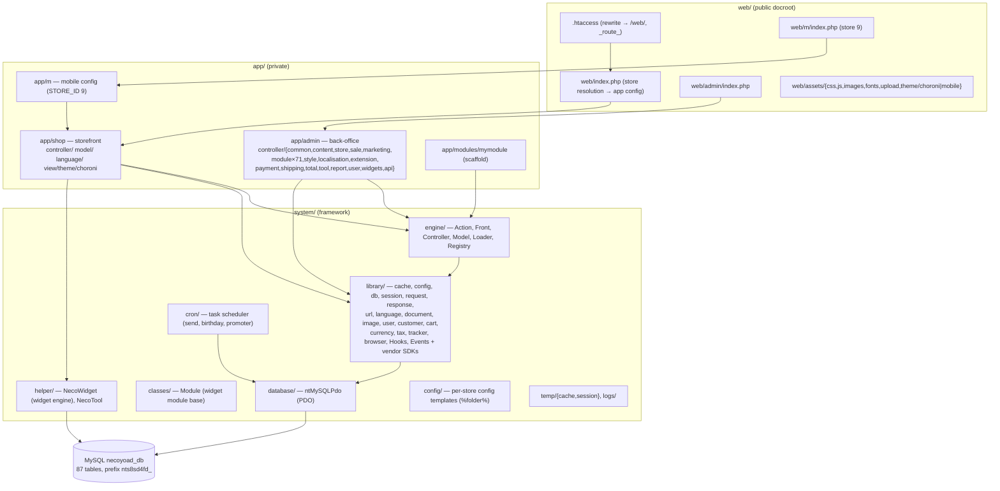
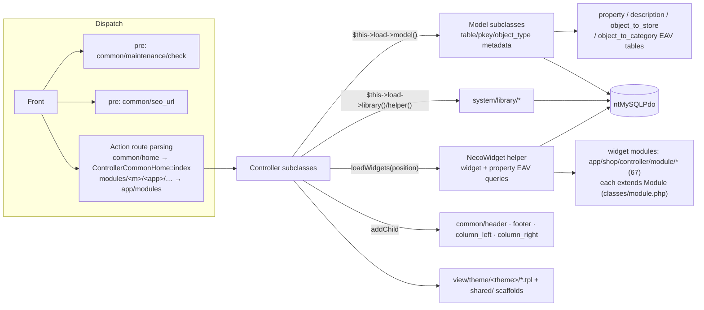

# 1 · General Architecture of the Whole App

> Verified against source at `/home/z/necoyoad`. Cross-appendix: [`appendix-research/2-architecture.md`](appendix-research/2-architecture.md).
> Companion PDF: `docs/architecture/necoyoad_architecture_blueprint_v1_sql_only.pdf` (v1) and v2 (source-verified).

## 1.1 Executive Summary

Necoyoad is **two products in one repository**:

1. **The legacy platform** — a custom PHP MVC framework in the OpenCart lineage (Registry / Loader /
   Front-controller / Action dispatch), extended with a WordPress-style hooks/events automation layer,
   an "Omni" EAV property system, a widget-composition rendering engine, multi-store tenancy on
   subdomains/folders, and a marketing campaign engine. It is a *production* system: the repo ships
   real access/error logs and **13 production cache artifacts** from `www.mudancer.com`
   (`system/temp/cache/*.cache`).

2. **`necoyoad-next/`** — a ground-up Laravel 11 + Filament 3 + Livewire 3 rewrite targeting PHP 8.3
   on FrankenPHP/Caddy with MySQL 8 + Redis 7, preserving the domain model (same 7 widget positions,
   same EAV group/key conventions, same morph `object_type` strings) while replacing the engine
   (Blade instead of raw-PHP `.tpl`, Eloquent + morph maps instead of LIKE-scanned EAV, Filament
   instead of the hand-rolled admin, queues + scheduler instead of the custom cron).

## 1.2 Layered Architecture (Legacy)

**Runtime topology:**

| Layer | Directory | Role |
|---|---|---|
| Public docroot | `web/` | Only 3 entries: `index.php` (shop), `admin/index.php`, `m/index.php` (mobile mirror) + `assets/` (shared + `theme/{choroni,mobile}`) |
| Private applications | `app/` | `shop/` (storefront), `admin/` (back-office), `m/` (mobile config shim, `STORE_ID=9`), `modules/` (module scaffold `mymodule`) |
| Framework | `system/` | `engine/` (Action, Controller, Front, Loader, Model, Registry), `library/` (~50 first-party libs + bundled SDKs), `classes/` (Module base), `database/` (single driver `ntMySQLPdo`), `helper/` (NecoWidget, NecoTool), `config/` (per-store config generators), `cron/` (task scheduler), `temp/` (cache + session) |
| Secrets | repo root | `cconfig.php` (CRYPT_KEY, DB creds), `necoyoad_db.sql` (schema dump), `.htaccess` (rewrites everything into `/web/`) |

The repo root is the Apache docroot *only* because `.htaccess:207-208` internally rewrites every
request into `/web/`. Root secrets (`cconfig.php`, the SQL dump) are mitigated by a `FilesMatch` deny
rule (`.htaccess:245-249`).

**Real PHP floor:** `startup.php:54` claims `PHP5.1+`, but typed properties and `: mixed` returns in
`Hooks`/`Events` make **PHP 8.0+ the actual floor**. Extensions required: `mysqli` (store probe),
`pdo_mysql` (runtime driver), `zlib`, `gd`, `openssl`, `curl`, `mbstring`, sockets (POP3 bounce).

## 1.3 The Engine (system/engine/)

| Class | File | Role |
|---|---|---|
| `Registry` | `system/engine/registry.php` (20 lines) | Service bag; `set()` emits `registry:update`. Holds the entire object graph: config, db, request, response, session, cache, document, language, user, customer, cart, currency, tax, tracker, hooks, fkey, `ClassName/Method/Route`, asset arrays, all models |
| `Front` | `system/engine/front.php` | Pre-action chain + dispatch loop; a pre-action returning an `Action` replaces the target (maintenance/SEO forwarding); controllers chain by returning `Action`s |
| `Action` | `system/engine/action.php` | Route→controller resolver: `common/home` → `app/shop/controller/common/home.php`, class `ControllerCommonHome` (`'Controller' + stripped path`), method `index`. Special remap: `modules/<module>/<app>/<path>` → module-scoped controllers |
| `Controller` | `system/engine/controller.php` (821 lines) | Abstract base: registry proxy, `data` bag with `data:update` event, `forward()/redirect()`, children, `render()/fetch()` (raw-PHP templates + `` substitution), `loadWidgets()`, `loadAssets()` |
| `Loader` | `system/engine/loader.php` | `auto()` locator: `system/library/` → `system/helper/` → model → language; `model()` registers under BOTH `modelProduct` and legacy `model_store_product` keys; module-scoped variants |
| `Model` | `system/engine/model.php` (1,803 lines) | Table metadata (`$table/$pkey/$object_type/$fields/$relations`), generic CRUD + SQL builder, EAV/description/store/category helpers, per-model event/hook API (`on/off/trigger`, `addFilter/applyFilters`) |

## 1.4 First-Party Library Map (system/library/)

~50 libraries — highlights:

- **Automation:** `automation/hooks.php` (WordPress-style filters/actions), `automation/events.php`
  (static pub/sub), `automation/webhooks.php` (stub) — see [Chapter 3](03-events-hooks-blueprint.md).
- **Persistence/presentation:** `Cache` (file driver, TTL-in-filename), `Config`, `DB`, `Document`,
  `Language`, `Log`, `Request` (**AES-256-CTR encrypted cookies** via `CRYPT_KEY`), `Response`,
  `Url` (SEO rewrite), `Image`/`NTImage` (GD) — see [Chapter 10](10-caching-rendering.md).
- **Commerce:** `Cart` (file-cache persisted), `Customer`, `Currency`, `Tax`, `Weight`/`Length`,
  `Product` helper.
- **Platform:** `User` (ACL via `user_group` serialized permissions), `Tracker` (full-visit stats),
  `Browser` (mobile/tablet/Facebook UA detection), `Validar` (Spanish validator), `Pagination`
  (AJAX-capable), `Mail` + `ntsMailer` (PHPMailer fork + SMTP + bounce rules), `Upload` (blueimp),
  `Captcha`/`reCAPTCHA`, `ntsPDF` (TCPDF fork), `Barcode39`/`BarcodeQR`, `Backup`, `Update`
  (self-updater), `Encoder` (source obfuscator), `Json` (+CORS), `Task` (cron task object),
  `cpxmlapi` (cPanel), `xhttp` (cURL wrapper w/ plugin stack).
- **Bundled SDKs:** `facebook/` (SDK v5), `google/`, `payu/` (OpenPayU v2), `meli/`
  (MercadoLibre), `email/`, `tcpdf/`, `pclzip/`, plus an experimental `reactjs/` server-side renderer.

## 1.5 Application Modules

- **`app/shop/controller/module/` — 67 storefront widget modules** (full inventory in
  [Chapter 4](04-widgets-system.md)): product family (list/overview/price/images/tabs/attributes…),
  category/manufacturer family, CMS (post/page/richtext), links (menus), banner, search, contact
  form, social (fblike, facebook_comments, google_analytics, google_maps), store chrome
  (store_logo, store_title, login/register forms, currency/language selectors, cart box,
  5-step checkout), rooms subsystem.
- **`app/admin/controller/` — ~160 controllers**: `content/*` (6), `store/*` (7), `sale/*` (9),
  `marketing/*` (6), **`module/*` (71 widget-config dirs)**, `style/*` (5 — layout manager, theme
  editor, template, views, editor), `localisation/*` (11), `extension/*` (4), `payment/*` (5),
  `shipping/*` (5), `total/*` (7), `tool/*` (7), `report/`, `user/*`, `widgets/*` (4 dashboard
  widgets), `api/` (v1 + 83 JSON endpoints), `chart/*` (3), plus `admincontroller.php` (the shared
  CRUD base).
- **`app/m/`** — a mobile-mirror storefront: `config.php` only (`STORE_ID='9'` — a *string*),
  `$privatePath` pointing at `app/shop/`, its own entry `web/m/index.php` (VERSION 2.0.1 vs shop's
  1.0.2) and its own asset theme `web/assets/theme/mobile/`.
- **`app/modules/mymodule/`** — a drop-in module-app scaffold demonstrating module-scoped
  controllers/views, a JSON health check, ACL hooks, and a slug service.

## 1.6 necoyoad-next Architecture

- **Stack:** Laravel 11 / PHP 8.3 / Livewire 3 / Filament 3.2 / Sanctum 4 / Predis 2 /
  Intervention Image 3 / enshrined svg-sanitize / Pest 2 (`composer.json`).
- **Bootstrap** (`bootstrap/app.php`): web+api+console routing; global middleware appended in order
  `ResolveStoreContext → ResolveLanguageContext → LogHttpResponse`; `StorefrontException` renders
  `errors/storefront` (view or JSON); **every reported Throwable** goes through `AuditService::logException`.
- **Providers:** `AppServiceProvider` (singletons: StoreContext, LanguageContext, EavService,
  AuditService, ImageService, FileManagerService, ThemeEditorService, BannerRendererService,
  BannerEventService; `Relation::enforceMorphMap` reusing **legacy `object_type` strings**;
  `DB::listen` query audit) and `NecoyoadServiceProvider` (WidgetService, AssetManifest,
  FilterPipeline, `WidgetComposer` view composer, widget asset registration = `deps.php` port).
- **Routes** (`routes/web.php`): `/` → `StorefrontController::home` named **`common.home`** (name
  parity with legacy); catalog `/products /product/{p} /categories /category/{c}`; CMS
  `/posts /post/{p} /page/{p}`; `/search`; Livewire checkout; customer auth; marketing tracking
  (`/track/open/{campaign}/{contact}` pixel, `/track/click/{nonce}`, `/unsubscribe/{token}`);
  `GET /widget/async/{name}`; throttled `POST /api/banner/event/*`; Filament admin + guarded
  `/admin/api/{filemanager,theme}/*`; demo-login trio; `/up` health.
- **Storefront contract** (every page in `StorefrontController`): (1) set session
  `object_type/object_id`, (2) set session `landing_page`, (3)
  `TemplateResolver->resolve($model->getProperty('style','view'), type, fallback)`, (4) render view →
  `WidgetComposer` injects `$widgets[$position]`.
- **Database:** single migration `0001_01_01_000000_create_core_tables.php` (843 lines, 49 InnoDB
  tables) + `DatabaseSeeder` (519 lines: 3 admins, 2 languages, 3 currencies, **5 fully populated
  demo stores**).
- **Deployment:** `docker-compose.yml` (FrankenPHP php8.3 + MySQL 8 + Redis 7, optional Meilisearch/
  Mailhog profiles), `Caddyfile` (docroot `public/`, `order php_server before file_server`,
  zstd/gzip, dotfile 404), `docker/entrypoint.sh` (APP_KEY generation, migrate+seed, asset publish,
  cache clear — note: it deletes `bootstrap/cache/*.php` on every boot, so no production
  config/route caching).

## 1.7 The Database Schema — 87 Tables by Domain

phpMyAdmin 5.2.0 dump (2023-02-03) of MySQL 5.7.17; **all ENGINE=MyISAM, zero INSERTs (schema-only)**;
prefix `nts8sd4fd_`; 75× latin1 vs 12× utf8 charsets; `int(1)` booleans; `datetime DEFAULT
'0000-00-00 00:00:00'`; **no foreign keys** — referential integrity is app-level only.

| Domain | Tables (count) | Notes |
|---|---|---|
| **Core / settings** (24) | `setting, store, extension, template, theme, theme_style, status, object, description, property, url_alias, language, currency, country, zone, geo_zone, zone_to_geo_zone, weight_class, length_class, tax_class, tax_rate, user, user_group, user_activity` | `store` has only `owner_id, name, folder, status` — the subdomain doubles as folder; `object` spine table is **dead code**; `property`/`description`/`url_alias` are the shared EAV spine |
| **Catalog** (22) | `product, product_type, product_attribute, product_attribute_group, product_discount, product_special, product_image, product_option, product_option_description, product_option_value, product_option_value_description, product_related, product_tags, product_to_category, product_to_download, product_to_zone, category, manufacturer, review, review_likes, download, warehouse_movement` | `product` = 28 cols (price `decimal(15,4)`, cost, dims, sku); names live in `description`; `category` doubles as post-category table (`object_type` discriminator); `review` is threaded + polymorphic |
| **Orders / checkout** (14) | `order, order_download, order_history, order_option, order_payment, order_product, order_total, coupon, coupon_category, coupon_history, coupon_product, balance, bank, bank_account` | `order` = 49 denormalized columns (store snapshot, both addresses, currency+rate, coupon, IP); **no `store_id`** — only `store_name/store_url` snapshots |
| **Customers** (3) | `customer, customer_group, address` | `customer` = 26 cols incl. `referenced_by` referral, `rif`, serialized `cart`, `activation_code`, `congrats` (birthday opt-in), `banned` |
| **CMS** (5) | `post, menu, menu_link, banner, banner_item` | posts & pages share `post` (discriminated by `post_type`); `banner.jquery_plugin` is the engine discriminator |
| **Widgets** (2) | `widget, widget_landing_page` | legacy rows/columns are **EAV rows**, not tables (see [Chapter 4](04-widgets-system.md)) |
| **Marketing** (10) | `campaign, campaign_contact, campaign_link, campaign_link_stat, campaign_stat, contact, contact_list, contact_to_list, newsletter, notification` | full link-level click analytics + per-contact queue |
| **Automation / tracking** (7) | `search, stat, task, task_exec, task_queue, object_to_category, object_to_store` | `stat` stores full server/session/request dumps; `task` scheduler with 6 task types |

## 1.8 ER Domain Diagram

```mermaid
erDiagram
    STORE ||--o{ SETTING : "store_id"
    STORE ||--o{ OBJECT_TO_STORE : ""
    STORE ||--o{ WIDGET : "store_id"
    STORE ||--o{ THEME : ""
    STORE ||--o{ MENU : ""
    STORE ||--o{ ORDER : "snapshot"
    STORE ||--o{ CUSTOMER : ""
    OBJECT ||--o{ DESCRIPTION : "object_id+object_type"
    OBJECT ||--o{ PROPERTY : "object_id+object_type"
    OBJECT ||--o{ OBJECT_TO_STORE : ""
    OBJECT ||--o{ OBJECT_TO_CATEGORY : ""
    OBJECT ||--o{ URL_ALIAS : "object_id+object_type"
    OBJECT ||--o{ REVIEW : "object_id+object_type"
    CATEGORY ||--o{ OBJECT_TO_CATEGORY : ""
    CATEGORY ||--o{ PRODUCT_TO_CATEGORY : ""
    PRODUCT ||--o{ PRODUCT_TO_CATEGORY : ""
    PRODUCT ||--o{ PRODUCT_IMAGE : ""
    PRODUCT ||--o{ PRODUCT_DISCOUNT : ""
    PRODUCT ||--o{ PRODUCT_SPECIAL : ""
    PRODUCT ||--o{ PRODUCT_OPTION : ""
    PRODUCT_OPTION ||--o{ PRODUCT_OPTION_VALUE : ""
    PRODUCT ||--o{ PRODUCT_RELATED : ""
    PRODUCT ||--o{ PRODUCT_TAGS : ""
    PRODUCT }o--|| MANUFACTURER : ""
    POST ||--o{ DESCRIPTION : "post_id"
    POST ||--o{ PROPERTY : ""
    MENU ||--o{ MENU_LINK : ""
    MENU_LINK }o--o{ MENU_LINK : "parent_id (tree ≤3)"
    BANNER ||--o{ BANNER_ITEM : ""
    WIDGET ||--o{ WIDGET_LANDING_PAGE : ""
    WIDGET ||--o{ PROPERTY : "rows/cols EAV (object_type widget_rows/widget_cols)"
    CUSTOMER ||--o{ ADDRESS : ""
    CUSTOMER ||--o{ ORDER : ""
    CUSTOMER ||--o{ REVIEW : ""
    CUSTOMER ||--o{ BALANCE : ""
    CUSTOMER }o--|| CUSTOMER_GROUP : ""
    ORDER ||--o{ ORDER_PRODUCT : ""
    ORDER ||--o{ ORDER_TOTAL : ""
    ORDER ||--o{ ORDER_HISTORY : ""
    ORDER ||--o{ ORDER_OPTION : ""
    ORDER ||--o{ ORDER_PAYMENT : ""
    CAMPAIGN }o--|| NEWSLETTER : ""
    CAMPAIGN ||--o{ CAMPAIGN_CONTACT : ""
    CAMPAIGN ||--o{ CAMPAIGN_LINK : ""
    CAMPAIGN_LINK ||--o{ CAMPAIGN_LINK_STAT : ""
    CAMPAIGN ||--o{ CAMPAIGN_STAT : ""
    CONTACT }o--o{ CONTACT_LIST : "contact_to_list"
    TASK ||--o{ TASK_QUEUE : ""
    TASK ||--o{ TASK_EXEC : ""
    USER }o--|| USER_GROUP : "permission ACL"
    USER ||--o{ USER_ACTIVITY : ""
    THEME ||--o{ THEME_STYLE : "selector/property/value"
    THEME }o--|| TEMPLATE : ""
    LANGUAGE ||--o{ DESCRIPTION : ""
    LANGUAGE ||--o{ URL_ALIAS : ""
    CURRENCY ||--o{ ORDER : ""
```

## 1.9 Module Composition Map

## 1.10 Legacy ↔ Next — Top-Level Mapping

| Concern | Legacy | necoyoad-next |
|---|---|---|
| Entry point | `.htaccess` → `web/index.php` | Caddy `try_files` → `public/index.php` |
| Store resolution | mysqli probe + subdomain regex + per-app `config.php` | `StoreContext` 4-strategy (domain/`?store_id=`/subdomain/path) |
| Service container | `Registry` + `Loader::auto()` | Laravel container + providers |
| Bootstrap | `startup.php` + `app/shop/map.php` (330 lines) | `bootstrap/app.php` + providers + middleware |
| Routing | `Front` + `Action` (`?r=` or pre-action forward) | Laravel routes; home route **named `common.home`** for parity |
| Pre-actions | `maintenance/check`, `seo_url` (shop); `login`, `permission` (admin) | Middleware (`LogHttpResponse`) + route middleware |
| Templates | raw-PHP `.tpl` + `Controller::fetch()` + `` | Blade + `TemplateResolver` + `<x-dynamic-component>` |
| Widget engine | `NecoWidget` (LIKE over serialized EAV) | `WidgetService` (JSON columns + Eloquent + 300s cache) |
| Hooks/Events | `Hooks` + `Events` static bus | Laravel events + `FilterPipeline` port |
| Admin | hand-rolled `AdminController` CRUD + 160 controllers | 16 Filament resources + 3 pages |
| Scheduler | `system/cron/cron.php` polling `task`/`task_queue` | Laravel scheduler + queued jobs |
| DB | 87 MyISAM tables, no FKs | 49 InnoDB tables, FKs + morph maps |
| Config | `cconfig.php` + `setting` rows | `.env` + `config/necoyoad.php` + `stores.settings` JSON |
| Errors | `error/not_found` controller + logs | `StorefrontException` family → `errors/storefront` view |

## 1.11 Verified Quirks Worth Knowing

1. The whole `Config` object is serialized into the session (`ntConfig_{store_id}`) — settings
   snapshots go stale for the session's lifetime.
2. Models register under **two registry keys** (`modelProduct` + legacy `model_store_product`).
3. `map.php` creates a `Front` controller that `web/index.php` discards (it builds its own).
4. Non-shop subdomains still load `app/shop/map.php` (hardcoded include).
5. `necoyoad.com` is hard-coded as the canonical apex in `.htaccess:222-227` and
   `web/index.php:42`; both canonicalization rules emit scheme-relative `//host/...` targets.
6. The SQL dump is 100% empty — no seed data, not even a default store row.
7. `app/m/config.php` defines `STORE_ID` as the **string** `'9'`.
8. `system/config/*.txt` are templated per-store `config.php`/`index.php` generators
   (`%folder% %store_id% %admin_path% %package% %version%`) used by store CRUD (see
   [Chapter 9](09-multistore-descriptions-dto.md)).

---

Next: [Chapter 2 — the homepage boot stack, step by step](02-boot-stack-walkthrough.md) ·
[Back to index](README.md)
