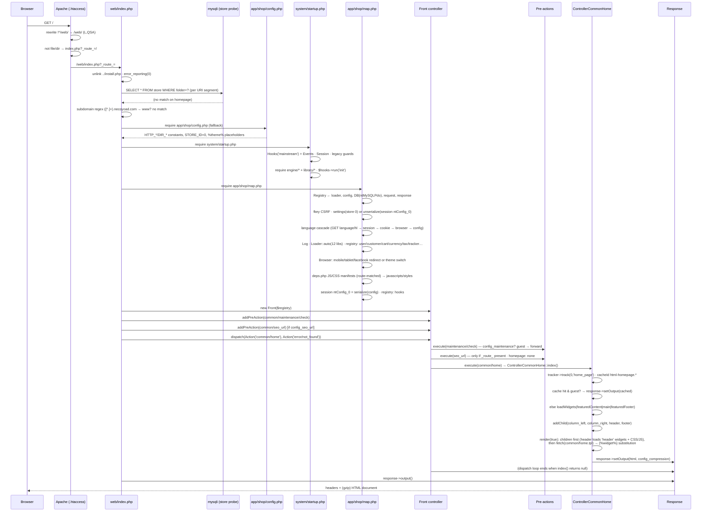

# 2 · Code-Stack Walkthrough — What Happens When Someone Opens the Homepage

> The complete request lifecycle, file by file, line by line:
> **`.htaccess` → `web/index.php` → `cconfig.php` → `app/shop/config.php` → `system/startup.php` →
> `app/shop/map.php` → `Front` → pre-actions → dispatch → `ControllerCommonHome` → render → output.**
> All paths/lines verified in source. Appendix:
> [`appendix-research/2-architecture.md`](appendix-research/2-architecture.md).

## 2.1 The Full Sequence



## 2.2 Step 1 — `.htaccess` (253 lines)

**Rewrite block (lines 201–214):**

```apache
RewriteEngine On
RewriteBase /
# everything not already under /web/ is pushed there
RewriteCond %{REQUEST_URI} !^/web/
RewriteRule ^(.*)$ /web/$1 [L,QSA]                      # :207-208
# non-file, non-dir paths become front-controller routes
RewriteCond %{REQUEST_FILENAME} !-f
RewriteCond %{REQUEST_FILENAME} !-d
RewriteRule ^(.*)\?*$ index.php?_route_=$1 [L,QSA]      # :210-212
```

Because the docroot is the repo root, the internally rewritten script is **`/web/index.php`** with
`$_GET['_route_']` carrying the SEO path.

**Domain canonicalization (216–227):** non-HTTPS + `www.` → 301 to the non-www host; non-HTTPS +
`subdomain.necoyoad.com` → 301 to the subdomain form. Both emit **scheme-relative** `//host/...`
targets (missing `https:`). The apex domain `necoyoad.com` is hard-coded.

**Security:** `Options -MultiViews` (:229), `ErrorDocument 404 /index.php?r=error/404` (:231 —
404s enter the app as a route), `-Indexes`, dotfile deny, and
`FilesMatch "(\.(tpl|bak|config|sql|fla|psd|ini|log|sh|inc|swp|dist)|~)$"` → Deny all (:245-249)
protecting `cconfig.php` / `necoyoad_db.sql`. `session.cookie_httponly` under mod_php5.

**Performance:** full MIME map (svg/woff/webp/appcache), `mod_deflate` chain + legacy `mod_gzip`
fallback, `mod_expires` (default +1 month; images/fonts +1 month; **CSS/JS +1 year**; HTML 0),
per-type `Cache-Control`, and **ETag/Last-Modified stripped** (`FileETag None` — no conditional
revalidation at all). See [Chapter 10](10-caching-rendering.md) for the cache story.

## 2.3 Step 2 — `web/index.php` (85 lines, the front controller)

| Step | Lines | What happens |
|---|---|---|
| Install guard | 2-4 | deletes a stray `../install.php` if present |
| Identity | 7-8 | `PACKAGE='standalone'`, `VERSION='1.0.2'` |
| Install redirect | 11-17 | missing `cconfig.php` → 302 to `install/index.php` |
| DB bootstrap | 19-20 | `new mysqli(...)` **only** for store resolution |
| Store: folder probing | 21-31 | with `_route_`: every `/`-segment of `REQUEST_URI` probed against `store.folder`; **last match wins** |
| Store: `?store_id=` | 32-38 | `elseif` branch — **ignored on SEO/routed URLs** |
| Store: subdomain | 41-42 | `preg_match('/([^.]+)\.necoyoad\.com/', SERVER_NAME)` |
| App config | 43-51 | `app/<subdomain>/config.php` if it exists (e.g. `admin`, `m`), else **`app/shop/config.php`** |
| Startup | 53 | `require DIR_SYSTEM . 'startup.php'` |
| Map | 56 | `require app/shop/map.php` (**always** the shop map) |
| Front | 59 | `$controller = new Front($registry)` |
| Pre-action 1 | 62 | `common/maintenance/check` |
| Pre-action 2 | 65 | `common/seo_url` (only if `config_seo_url`) |
| Router | 73-79 | `?r=` → `new Action($r)`; else `new Action('common/home')` |
| Dispatch | 82 | `dispatch($action, new Action('error/not_found'))` |
| Output | 85 | `$response->output()` |

> **Design note:** the store row found in steps 1–3 is used only to choose the app folder;
> `STORE_ID` itself is a compile-time constant inside the per-app `config.php`.

## 2.4 Step 3 — `cconfig.php` (the secrets file)

```php
define('CRYPT_KEY',  "f89b0ccf-…");   // AES-256-CTR cookie encryption + ukey
define('C_CODE',     "0000001");      // install-wide code; prefixes session/cache/cart keys
define('DB_DRIVER',  'ntMySQLPdo');   // the ONLY runtime driver (PDO)
define('DB_HOSTNAME','localhost'); define('DB_USERNAME','root');
define('DB_PASSWORD','');      define('DB_DATABASE','necoyoad_db');
define('DB_PREFIX',  'nts8sd4fd_');
```

## 2.5 Step 4 — `app/shop/config.php` (73 lines)

Defines the path/URL constant universe:

- `CATALOG='shop'`, `ADMIN='admin'`, **`STORE_ID=0`**.
- `HTTP_HOME/HTTP_ADMIN` + asset URLs (`HTTP_IMAGE/CSS/JS/UPLOAD/DOWNLOAD` under `assets/`).
- **Theme-templated URLs** — `HTTP_THEME_CSS/JS/IMAGE/FONT = HTTP_HOME .
  "assets/theme/%theme%/…"` — the literal `%theme%` placeholder is substituted at runtime
  (`str_replace` in `Controller::_loadAssets()`, `map.php`, `header.php`, `Module::loadWidgetAssets()`).
- DIR constants: `DIR_APPLICATION/MODEL/CONTROLLER/LANGUAGE`, `DIR_TEMPLATE='app/shop/view/theme/'`,
  `DIR_MODULE='app/modules/'`, `DIR_CACHE='system/temp/cache/'`, `DIR_SESSION`,
  `DIR_LOGS='system/logs/shop/'`, `NTS_DEBUG_MODE=false`.
- Protocol detection exists but **both branches yield `https://`** (HTTPS-only assumptions).

## 2.6 Step 5 — `system/startup.php` (169 lines)

1. **:4-8** loads `library/automation/hooks.php` + `events.php`; `global $hooks = new Hooks("mainstream")`.
2. **:11-46** custom error handler — **only when `NTS_DEBUG_MODE===true`**; emits `php:error` /
   `error` events per error. Production simply disables display.
3. **:50-51** `Session` created early (own save path `DIR_SESSION`, `nts_token` cookie on parent domain).
4. **:54-120** legacy hygiene: PHP 5.1 gate, register_globals cleanup, magic_quotes cleanup, UTC
   default, IIS `DOCUMENT_ROOT`/`REQUEST_URI` synthesis.
5. **:123-128** engine requires (action, controller, front, loader, model, registry);
   `:130` `Events::emit("engine_load", true)`.
6. **:133-145** `classes/module.php` + library requires (cache, config, db, document, language,
   log, request, response, url, image).
7. **:147** `$hooks->run('init')`; **:148-150** the default identity `processcss` filter;
   **:153-169** commented examples documenting the intended `dispatch`/`fetch`/`query` extension API.

## 2.7 Step 6 — `app/shop/map.php` (330 lines, the composition root)

Reads like a boot script — the entire object graph is built here:

1. **:3-16** `Registry`, `Loader`, `Config`, `DB` (ntMySQLPdo), `Request`, `Response` (+ an unused
   `Front` — index.php builds its own).
2. **:18-27** `$hooks->run('system_load', [db, loader, registry])` + `Events::emit("system_load", …)`.
3. **:30-43** CSRF **fkey** = `md5(REMOTE_ADDR) . "." . 11×md5(mt_rand) . "_" . strtotime(today)`,
   stored in session + Registry.
4. **:47-55** Settings load: `SELECT * FROM setting WHERE store_id = 0` → `config->set()` per row,
   **or** `unserialize(session['ntConfig_0'])` — the whole `Config` object cached in session
   (written back at :323, invalidated only by the admin cache manager).
5. **:60** `Content-Type: text/html; charset=utf-8`.
6. **:63-121** **Language detection cascade** (priority order):
   `?language=` → `?hl=` → session → cookie → `HTTP_ACCEPT_LANGUAGE` (split on `,`, matched against
   each language's `locale` comma-list, **last match wins**, no q-values) → `config_language`.
   Persisted to session + cookie; sets `config_language_id/language`; instantiates `Language`.
7. **:124-131** `Log('log.txt')` into Registry; `Events::on("php:error")` → `$log->trace()`.
8. **:133-144** `Loader::auto()` for `url, user, customer, currency, tax, weight, length, cart,
   validar, encoder, browser, tracker`.
9. **:146-156** Registry: `config, load, db, log, request, response, session, cache, document,
   language, user`; `$hooks->run('app_load')`.
10. **:161-174** app libs (`customer, currency, tax, weight, length, cart, browser, tracker`) +
    empty asset accumulators (`javascripts/styles/scripts`).
11. **:177-183** referral capture: `?refby=` → `setRefByCustomer`, `?ref=` → `setRefCustomer`.
12. **:186-197** `IMAGE_BG_COLOR_R/G/B` constants from settings (image letterbox background).
13. **:199-234** **device handling** via `Browser`: mobile → redirect to `config_mobile_url` or swap
    `config_template = config_mobile_template`; tablet likewise; Facebook in-app browser likewise
    (setting key typo: `config_redirect_when_facebbok`).
14. **:237-246** `language->load('common/header')`; `Loader::auto('account/customer',
    'store/product', 'store/category', 'localisation/language', 'localisation/currency')`.
15. **:248-259** `$route` from `_r_`/`r` for asset matching; `?cc=` currency override (ineffective
    here — see below); `?template=` live theme preview (requires `common/header.tpl`);
    `$tpl = config_template ?: 'choroni'`.
16. **:261-321** **`deps.php` asset manifests**: loads
    `web/assets/theme/<tpl>/{js,css}/deps.php`, filters entries by route (`'*'` wildcard), registers
    them as `header_javascripts/javascripts/styles/css/scripts`; leftovers land in registry
    accumulators for `Module::loadDeps()`. This is the **route-named asset convention** — e.g. the
    home page automatically pulls `commonhome.css`/`commonhome.js` if present
    (naming: lowercase, strip `Controller`, strip `/`).
17. **:323-329** `session['ntConfig_0'] = serialize($config)`; re-set config + global hooks into
    Registry; `$hooks->run('load')` + `Events::emit("load", $registry)`.

> **`?cc=` quirk:** `map.php:250-252` sets `config_currency` *after* the `Currency` instance was
> constructed (:165) — the real switch happens in `common/header.php:47-56`
> (`$this->currency->set($cc)` + redirect). `?hl=` language switching is handled at
> `header.php:36-45` the same way.

## 2.8 Step 7 — Dispatch Internals

- **`Front::dispatch($action, $error)`** (`front.php:17-33`): runs pre-actions in order — each
  pre-action executes **after** emitting `Events::emit("dispatch")`; if a pre-action *returns* an
  `Action`, it replaces the target and the loop breaks (this is how maintenance/SEO forwarding
  works). Then `while ($action) { emit; $action = execute($action); }` — controllers chain by
  returning `Action`s.
- **`Front::execute()`** (:35-60): sets Registry keys `ClassName/Method/Route` (3×
  `registry:update`), `require`s the controller file, instantiates `new $class($registry)` (which
  runs `init()` — **listener/observer registration time**), and
  `call_user_func_array([$controller, $method], $args)`. Missing file/method → error action.
- **`Action`** (`action.php`): `common/home` → file `app/shop/controller/common/home.php`, class
  `ControllerCommonHome` (built as `'Controller' + preg_replace('/[^a-zA-Z0-9]/', '', $path)`),
  default method `index`. Module remap: `modules/<m>/<app>/<path>` → `DIR_MODULE.<m>/app/<app>/controller/…`.

**Pre-actions in play for the homepage:**

1. `common/maintenance/check` (`maintenance.php:37-46`) — guests are forwarded to the widget-driven
   maintenance page when `config_maintenance` is on (admins pass through).
2. `common/seo_url` — for `?_route_=` URLs: `api/*` passthrough, `buscar|search/` → `store/search`,
   store-folder segment stripping, per-segment `url_alias` keyword lookup mapping
   `product_id / path (accumulated) / page_id / manufacturer_id / post_id`, plus bilingual
   hard-coded routes (`sitemap`, `special|ofertas`, `blog`, `posts|articulos`, `pages|paginas`,
   `productos|products`, `categorias|categories`, `carrito|cart`, `login`, `register`,
   `<profile-slug>/pedidos|mensajes|pagos|comentarios`), then `forward()`. Full details in
   [Chapter 10 §10.6](10-caching-rendering.md).

## 2.9 Step 8 — `ControllerCommonHome::index` (`app/shop/controller/common/home.php:5-56`)

1. `tracker->track(0, 'home_page')` (:7) + referral-invitation flag (:9-11).
2. Cache key `html-homepage.<lang>.<hl>.<cc>.<customer_id>.<currency>.<store_id>` (:13-19).
3. Clears session `object_type/object_id/landing_page` (:23-25).
4. Guest + cache hit → `response->setOutput(cached)` and done (:28-29).
5. Otherwise: `document->title/description` from per-language settings;
   `session['landing_page'] = 'common/home'`; **`loadWidgets('featuredContent')`,
   `loadWidgets('main')`, `loadWidgets('featuredFooter')`** (:35-37); children
   `common/column_left`, `column_right`, `header`, `footer` (:39-42); `cacheId` set for guests;
   template = `default_view_home` setting or `common/home.tpl` under `config_template` with the
   `choroni/` fallback; `response->setOutput($this->render(true))`.

`loadWidgets()` and `render()/fetch()` (the `` substitution engine) are covered in depth
in [Chapter 4](04-widgets-system.md) and [Chapter 7](07-templates-blueprint.md).

## 2.10 The Output Document

The rendered homepage has this exact skeleton (verified against templates + production cache
artifacts):

```
<!doctype html><html><head>
  OpenGraph · <base href> · title/keywords/description
  $styles links + inline <style>$css</style>          ← header.tpl:34-41
  window.nt.* config JS object                        ← header.tpl:45-79
</head>
<body nt-editable="1">                                ← visual-editor contract
<div id="mainContainer" class="container">            ← header.tpl:87 (closed in footer.tpl)
  <div id="headerContainer"><div id="header">
      … widget rows for position 'header' …           ← widgets-rows.tpl
  </div></div>
  <div id="contentContainer" class="tpl-home">        ← home.tpl:4
    <div id="featuredContentContainer">… rows …</div>
    <div id="mainContentContainer"><div class="row">
      [column_left widgets] <div id="columnCenter">… 'main' rows …</div> [column_right]
    </div></div>                                      ← Foundation 12/9/6-col grid depending on side columns
    <div id="featuredFooterContainer">… rows …</div>
  </div>
  <div id="footerContainer"><div id="footer">… rows …</div>
      <div id="copyright">powered_by</div></div>
</div>
… footer scripts (deferred JS, script buckets, UItoTop) …
</body></html>
```

Rows are `<div data-row data-position class="row[ container]" nt-editable>`, columns are
`<div data-column class="large-N medium-N small-N" nt-editable>`, and each widget leaves a
`` **token** in `widgets-rows.tpl` that `Controller::fetch()` replaces with the
widget module's HTML (wrapped in `<li data-necotienda_module … nt-editable movable removable
configurable>`).

## 2.11 Boot-Time Hook/Event Firing Order

For reference (full catalog in [Chapter 3](03-events-hooks-blueprint.md)):

| Order | Point | Fired at |
|---|---|---|
| 1 | `php:error` / `error` (debug only) | startup.php:37-38 |
| 2 | `engine_load` | startup.php:130 |
| 3 | `init` hook | startup.php:147 |
| 4 | `system_load` hook + event | map.php:18-27 |
| 5 | `csrf_load` hook | map.php:43 |
| 6 | `config_load` hook + event | map.php:57-58 |
| 7 | `language_load` hook | map.php:121 |
| 8 | ~16× `loader:*:load` events | Loader::auto loop |
| 9 | ~10× `registry:update` | Registry::set |
| 10 | `app_load` hook + event | map.php:158-159 |
| 11 | `load` hook + event | map.php:328-329 |
| 12 | `dispatch` event ×N | front.php:22/:30 per action |
| 13 | `data:update`, `beforeLoad/afterLoad`, `beforeRender/afterRender`, `renderWidget` | render pipeline |

## 2.12 Same Flow in necoyoad-next (for contrast)

```
Caddy (encode zstd/gzip, try_files → /index.php)
  → FrankenPHP public/index.php
  → Laravel bootstrap/app.php (global middleware: ResolveStoreContext → ResolveLanguageContext → LogHttpResponse)
  → Route '/' (named common.home) → StorefrontController::home
      session(object_type/object_id) · session(landing_page='common.home')
      TemplateResolver->resolve($page?->getProperty('style','view'), 'home', 'content.home')
  → response()->view(themes.choroni.content.home)
  → WidgetComposer (view composer) → WidgetService::getTree ×7 positions
      (cache key widgets:{store}:{position}:{lang}:{route}:{ot}:{oid}, TTL 300s, admin bypass)
  → storefront layout → widget-row.blade.php → <x-dynamic-component :component="$widget['component']">
  → Livewire CartDrawer mounted on every page · audit on non-2xx/3xx responses
```

---

Next: [Chapter 3 — Events & Hooks Blueprint](03-events-hooks-blueprint.md) ·
[Back to index](README.md)
