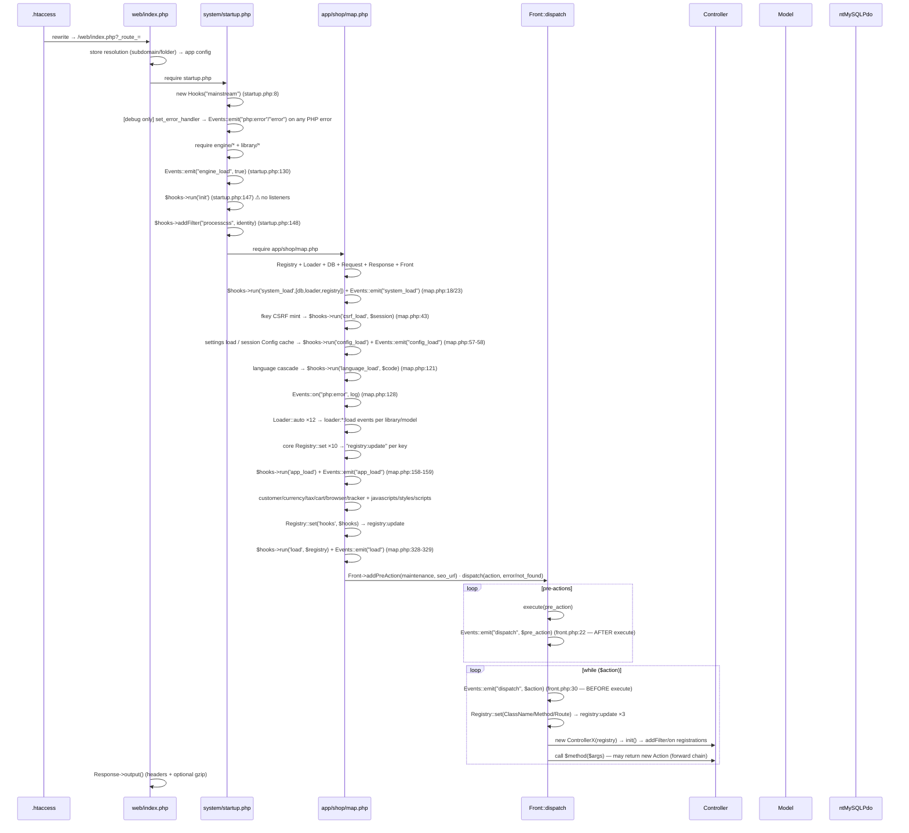
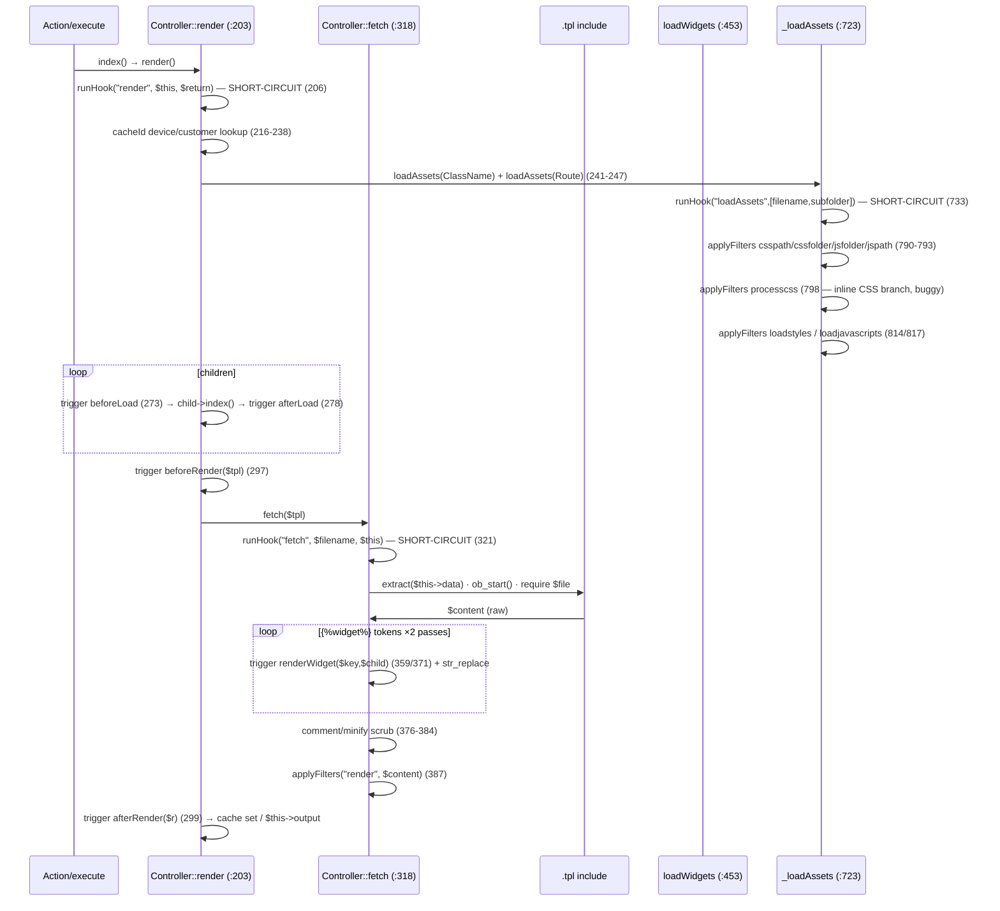
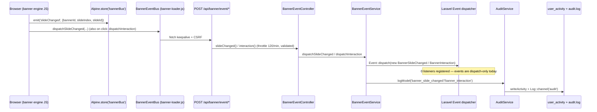

# 3 · Events & Hooks Blueprint

> Two parallel interception mechanisms power every customizable pipeline in the legacy platform:
> a WordPress-style **`Hooks`** engine (filters + actions, priorities, short-circuits) and a static
> **`Events`** pub/sub bus. This chapter maps both, catalogs **every emission/registration site**,
> and shows how the Laravel rewrite replaces them. Companion PDF: blueprint v4/v8; appendix:
> [`appendix-research/3a1-events-hooks.md`](appendix-research/3a1-events-hooks.md).

## 3.1 The Two Mechanisms at a Glance

| | `Hooks` (`system/library/automation/hooks.php`) | `Events` (`system/library/automation/events.php`) |
|---|---|---|
| Style | WordPress filters/actions | Static pub/sub bus |
| Instantiation | `new Hooks("mainstream")` (startup.php:8) — storage is **static**, so the channel is a named-static singleton with an instance façade | Pure static class |
| Registration | `addFilter($tag, $fn, $priority)` / `addAction($tag, $fn)` (tag gets an `action:` prefix) | `Events::on($name, $fn[, $once])` |
| Invocation | `applyFilters($tag, $value, ...$extra)` — **chain**, value threaded through callbacks; `run($tag, $arg)` — actions with **short-circuit** (any truthy return breaks the stack) | `Events::emit($name, ...$args)` — fire-and-forget, returns discarded, registration order |
| Priorities | `URGENT=10, HIGH=50, NORMAL=100, LOW=200, LOWEST=250`, ksort'ed buckets | none |
| Storage shape | `Hooks::$hooks['mainstream']['actions|filters'][$tag][$priority][$uniqueId]` | `Events::$data[$event][] = ['function'=>cb, 'once'=>bool]` |
| Meta events | `'all'` tap (two competing variants, both unused) | `"events"` (on every `on()`), `"call"`, `"called"` (per listener) |
| Async | none | none (`//TODO: add async and multi-thread support`, events.php:7) |

## 3.2 `Hooks` Deep Dive

**Storage & identity** — unique ids: string function name → itself; closure → `spl_object_hash`;
`[Class, method]` → `Class.method`. Re-registration overwrites. Priority buckets are lazily ksort'ed
and memoized in `$merged_filters`.

**`applyFilters($tag, &$value)` — the filter chain with a famous quirk (hooks.php:106-149):**

```php
$args = func_get_args(); array_shift($args);   // [originalValue, extra1, extra2, ...]
// per priority bucket:
$args[1] = $value;                              // line 141 — CLOBBERS extra1!
$value  = call_user_func_array($fn, $args);     // line 142
```

Effective callback contract: **`function ($original, $filtered, ...argsFromThirdOn)`**. Consequence:
`applyFilters("cssfolder", $cssFolder, $template, $subfolder)` (controller.php:791) loses
`$template` but keeps `$subfolder`. (The rewrite's `FilterPipeline` fixes this.)

**`run($tag, $arg)` — actions with short-circuit (hooks.php:178-234):** prefixes the tag with
`action:`, unwraps a 1-element `array(&$this)` payload (how `runHook("index", $this)` passes whole
controllers), executes priority-ordered, and **`if ($hasToReturn) return $hasToReturn;`** (lines
225-228) — any truthy listener return breaks the remaining listeners AND lower priorities and is
returned to the caller. This is the interception/override mechanism at `render`, `fetch`,
`loadWidgets`, `insert`, `delete`, `db:query` etc.

**Dead API surface (verified zero callers):** `$once` param (stored, never honored),
`removeFilter`'s all-priorities branch (unreachable), `did/doingFilter/doingAction/
getCurrentFilter/getCurrentAction/hasAction/removeAllActions/runAll/hasFilter`, both `'all'` hooks.

## 3.3 `Events` Deep Dive

- `on()` appends and **first emits meta-event `"events"`** with `{event, callback, once}`.
- `emit()`: **no listeners → return null** (meta-events only fire when listeners exist); emits
  `"call"` `{event, args}` before; iterates in **registration order**; `once` listeners unset after
  first call; emits `"called"` `{event, function, args}` after **each** listener; finally writes
  `self::$data[$event]['done'] = true` — a quirk that appends a junk entry to the listener array
  (later skipped via `isset($ev["function"])`).
- **Payload packing inconsistency:** `Controller::trigger` / `Model::trigger` / module `trigger()`
  wrappers pack variadics into a **single array arg** (why listeners do `$args[0]`), while direct
  emits (map.php, registry, loader) pass unpacked args. Runtime evidence: `error-ssl.log` shows
  `Events::emit('model:language:...', Array)` crashes from a live model self-observer.
- `webhooks.php` is a stub (`//TODO: create class to sync with third parties APIs`). The planned
  `automation/workflows` pre-actions exist only as comments in `web/index.php:67-70`.

## 3.4 Request-Lifecycle Interception Points

### 3.4.1 The boot chain — every hook/event in order



### 3.4.2 The render pipeline



Seams: `redirect` hook (short-circuit), `render` hook (short-circuit), device/customer-decorated
cacheId, `beforeLoad/afterLoad` per child, `beforeRender/afterRender`, **two-pass `renderWidget`
triggers** around `` substitution, `render` filter on final HTML (with
`config_minified_html` scrub before it).

### 3.4.3 The model CRUD protocol

```mermaid
flowchart TD
    subgraph add/update
        A1[trigger insert/update<br/>namespaced + global event] --> A2[applyFilters insert/update<br/>mutate $data]
        A2 --> A3[runHook insert/update<br/>SHORT-CIRCUIT aborts SQL]
        A3 --> A4[INSERT/UPDATE + setDescriptions/setStores/setCategories]
        A4 --> A5[cache->delete]
        A5 --> A6["trigger save action=insert|update"]
    end
    subgraph delete
        D1[runHook delete<br/>SHORT-CIRCUIT aborts] --> D2[getById snapshot]
        D2 --> D3[DELETE + shared tables: object_to_category,<br/>object_to_store, property, description, stat,<br/>url_alias, review]
        D3 --> D4[trigger delete with snapshot record]
    end
    subgraph read getAll
        R1[applyFilters select<br/>columns] --> R2[buildSQLQuery:<br/>applyFilters buildSQLQuery / join / where]
        R2 --> R3[db->query → db:query hook + db:query:error event]
        R3 --> R4[applyFilters query_result<br/>rows]
    end
```



Protocol per operation: `trigger(event)` → `applyFilters(filter)` → `runHook(action, short-circuit
aborts SQL)` → SQL + relation helpers (which trigger their own events) → cache purge (all no-ops —
see [Chapter 10](10-caching-rendering.md)) → `trigger(event)`. Model events fire on **two channels**:
namespaced `model:{table}:{object_type}::{event}` + global. `runHook` runs global (return discarded)
then namespaced (return honored).

## 3.5 The Complete Catalog

### 3.5.1 Events emitted (`Events::emit`)

**Platform/bootstrap:** `php:error` / `error` (startup.php:37-38, debug only) · `engine_load`
(startup.php:130) · `system_load` (map.php:23) · `config_load` (map.php:58) · `app_load`
(map.php:159) · `load` (map.php:329) · `dispatch` (front.php:22 after / :30 before each execute) ·
`registry:update` (registry.php:12, every `Registry::set`) · `db:query:error` (ntMySQLPdo.php:73) ·
`loadWidget` (helper/widgets.php:520).

**Loader lifecycle:** `loader:{library|controller|model|database|helper|modulemodel|modulelibrary}:{load|fail}`
— every `:fail` path precedes a hard `exit()`.

**Controller triggers** (payload packed as single array): `data:update`, `forward`, `redirect`,
`addChild`, `beforeLoad`/`afterLoad`, `beforeRender`/`afterRender`, `renderWidget` (×2),
`beforeLoadWidget`, `loadWidget`.

**Model events** (namespaced + global): `insert` (before SQL) · `save` (after SQL, insert|update
action) · `update` · `copy` · `delete` (with deleted record) · `sort` · `setStore` / `setCategory` ·
`deleteDescription` / `setDescription` / `setUrlAlias` · `setProperty` / `deleteProperties` /
`updateProperties` · `activate` / `deactivate` / `toggleStatus`.

**Module controllers:** `moduleLoad`, `moduleAsyncResponse`, `moduleRender`, `moduleEditorResponse`,
`widgetLoad`.

**Admin CRUD:** `copy`, `delete`, `activate`, `deactivate`, `edit`, `new` — fired alongside
`User::registerActivity` writes.

### 3.5.2 Hooks fired (`$hooks->run` / `runHook`)

| Group | Hook points |
|---|---|
| Boot | `init`, `system_load`, `csrf_load`, `config_load`, `language_load`, `app_load`, `load` |
| Render | `redirect`, `render`, `fetch`, `loadWidgets`, `loadAssets` (all short-circuit) |
| Model CRUD | `insert`, `update`, `copy`, `delete`, `sort` (short-circuit aborts the SQL) |
| Module | `index`, `async` (both receive `$this`) |
| Admin CRUD | `index`, `insert`, `update`, `copy`, `delete`, **`avtivate`** (typo — never matches), `sortable`, `getList`, `grid`, `getForm`, `validateForm`, `validateDelete` |
| DB | `db:query` — runs before **every** query with the escaped SQL; a truthy return becomes the query result (interceptor/cache/rewrite seam) |

### 3.5.3 Filters (`applyFilters`)

| Group | Filter points |
|---|---|
| Default | `processcss` identity filter (startup.php:148-150) — combined with the arg-clobber bug, inline-CSS mode appends the CSS **folder path** to the page |
| Render/assets | `data:update`, `render`, `loadcss`, `loadstyles`, `loadjavascripts`, `csspath`, `cssfolder`, `jsfolder`, `jspath`, `processcss`, `rowcss`, `columncss` |
| Model SQL builder | `insert`, `update`, `copy`, `select`, `query_result`, `buildSQLQuery`, `join`, `where` |
| Widget settings | `module:settings` (the widget composition seam), `widget:settings` (admin forms) |
| Admin grid/form | `formData`, `formProcess:dom`, `formProcess:description`, `breadcrumbs`, `getList:data`, `getList:scripts`, `grid:filters`, `grid:result`, `grid:data`, `grid:scripts`, `getForm:data`, `getForm:scripts` |
| DB | `db:escape` |

### 3.5.4 Registration inventory

| Registrations | Count | Where | Resolved tag |
|---|---|---|---|
| `processcss` identity | 1 | startup.php:148 | `processcss` |
| `module:settings` data providers | **55 files** | `app/shop/controller/module/*.php` `init()` | `module:{name}:module:settings` |
| `widget:settings` admin forms | 9 files | `app/admin/controller/module/*/widget.php` | `module:{name}:widget:settings` |
| Grid/form filters | 24 / 5 / 2 / 2 / 2 files | admin controllers `init()` | **un-namespaced** (cross-talk hazard) |
| Model query filters | 21 admin models + shop category | model `init()` | namespaced (self-scoped) |
| `addHook("delete")` | 3 | banner, campaign, review models | namespaced before-delete |
| Model self-observers (`on("save"/"delete")`) | **38 closures in 22 models** | admin models `init()` | side effects: cascades, cache purges, item persistence |

> **Namespace hazard:** `Controller::addFilter` namespaces tags, but `Controller::applyFilters`
> doesn't — two admin controllers in one request chain each other's `grid:*` closures. `Model`
> deliberately applies **both** global and namespaced ("for all models / for this model").

**Totals:** ~34 hook points, ~39 filter points, ~26 event names (+ loader pairs + per-model
namespaced names), ~190 listener registrations, 40 live event listeners.

## 3.6 necoyoad-next — The Replacement

- **`app/Filters/FilterPipeline`** — the `Hooks` port: `apply(name, value, ...args)` chains with
  extra args intact (arg-clobber **fixed**); `run(name, ...args)` keeps short-circuit semantics;
  `addFilter/addAction` with priorities. Bound as `'filter'` singleton — **but double-registered**
  (FilterServiceProvider + NecoyoadServiceProvider) and currently has **zero emit points** in app
  code (only tests exercise it).
- **Laravel events — dispatch-only:** the `Banner*` family (`BannerRendering` mutable pre-render
  event with `addSlide()/overrideEngine()`, `BannerRendered`, `BannerSlideChanged`,
  `BannerInteraction`) extends a `BannerEvent` base with `broadcastOn()` → `PrivateChannel
  ('admin.banners.{id}')` but **not** `ShouldBroadcast`. **No `Event::listen`/`Listeners` exist
  anywhere** — the events are dispatched, never observed (and the banner widget bypasses
  `BannerRendererService::render()`, so the render events never even fire on the storefront path).
- **Model observation** → the `Auditable` trait (created/updated/deleted → `AuditService::logModel`)
  on 11 models, replacing the 38 legacy self-observers (side effects relocated into services).
- **Query observation** → `DB::listen` → `AuditService::logQuery` (>100 ms or `AUDIT_ALL_QUERIES`)
  replaces the `db:query` hook (observer only — no short-circuit).
- **Boot hooks** → providers + middleware; **`php:error`** → `$exceptions->report()` →
  `logException` (dual sink: `user_activity` table + `audit` log channel, always-on).
- **Queue jobs** (`SendCampaignEmail`, `SendBirthdayEmail`) are dispatched by Artisan commands on
  the scheduler — the legacy cron (which never used Hooks/Events either) is replaced by
  Laravel's scheduler + queues.

### The banner event bus (frontend → backend analytics)



## 3.7 Legacy ↔ Next Mapping

| Legacy | Next | Parity |
|---|---|---|
| `Hooks` (channels, priorities, short-circuit) | `FilterPipeline` + `Filter` facade | ported, fixed args — **no emit points wired** |
| `Events` static bus | Laravel `Event` dispatcher | dispatch-only, no listeners |
| Boot hooks | providers + middleware | conceptual |
| `dispatch` event | routing/middleware | no observer tap |
| `registry:update` | container bindings | no update event |
| `loader:*:load\|fail` | Composer autoloading | gone by design |
| Model CRUD events | `Auditable` + services | audit only |
| Model SQL filters | Eloquent scopes + builder | replaced |
| render/fetch hooks + `render` filter | `BannerRendering`/`BannerRendered` (banners only) | partial |
| `module:settings` ×55 | `widgetData()` per widget class | polymorphism replaces filters |
| Asset filters | Vite + `AssetManifest` | build-time replaces runtime |
| `db:query` hook | `DB::listen` audit | observer only |
| `php:error` → log | `logException` always-on | improved |
| Admin grid/form filters | Filament declarative resources | no filter seam |
| — | Browser audit beacon (`/api/audit/browser`) | **next-only** |
| — | Banner event bus (`/api/banner/event/*`) | **next-only** |

## 3.8 Verified Defects (highlights)

1. Filter arg-clobber destroys extra arg #1 (hooks.php:141) — the `processcss` default filter
   therefore appends a folder path inline instead of CSS.
2. Payload packing inconsistency between `trigger()` wrappers and direct emits.
3. Admin `grid:*` filters registered globally → cross-controller closure chaining.
4. `avtivate` typo in `admincontroller.php:159` — hook can never fire.
5. `Events::emit` `'done'` junk-array pollution; meta-event recursion hazards.
6. Legacy cron + webhooks stub never integrated with the automation layer.
7. Next: `FilterPipeline` double-bound; banner events dispatch-only; widget path skips
   `render()` so rendering events/audit are dead code.

---

Next: [Chapter 4 — Widgets System](04-widgets-system.md) · [Back to index](README.md)
