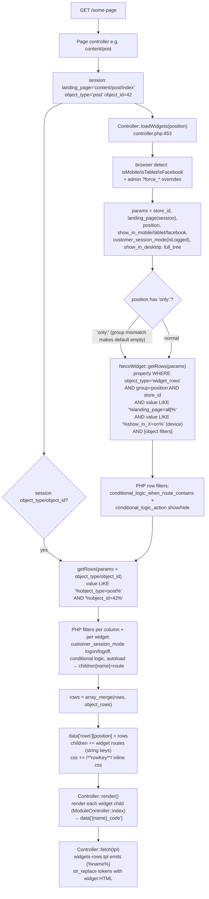
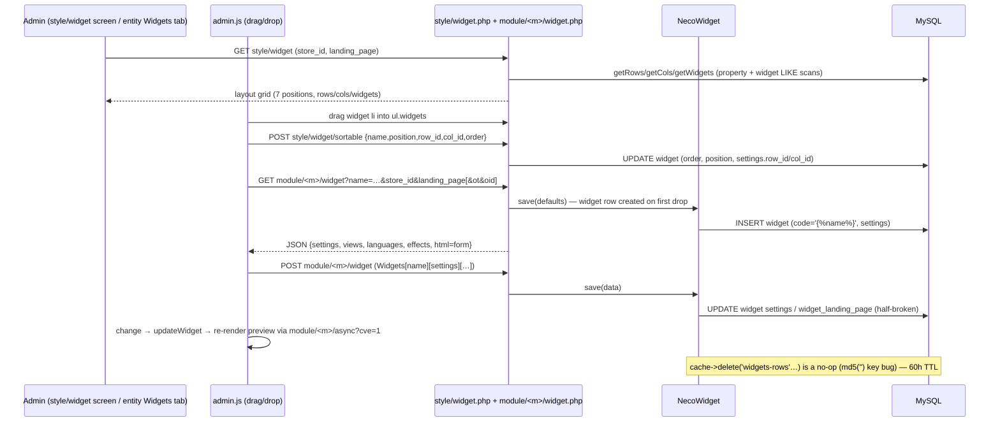
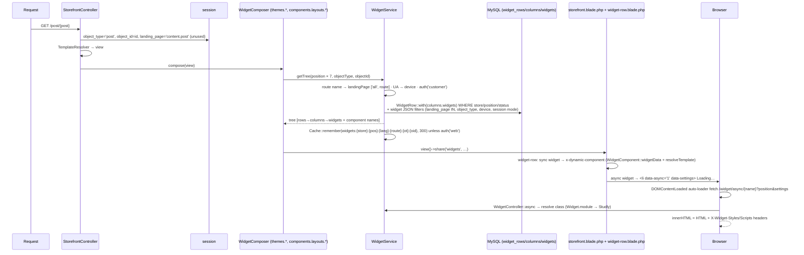

# 4 · The Widgets System

> Necoyoad's defining feature: **every page region is a widget composition surface**. Admins drag
> widget modules into rows/columns via a visual layout manager; storefront templates emit
> `` tokens that the engine substitutes at render time. 67 widget modules in legacy,
> 7 Blade components in the rewrite. Companion PDFs: blueprint v3 (async section) & v8; appendix:
> [`appendix-research/3a2-widgets.md`](appendix-research/3a2-widgets.md).

## 4.1 The Data Model — Legacy vs Next

**Legacy has NO `widget_row`/`widget_column` tables.** Only two tables exist
(`necoyoad_db.sql` L1516, L1535):

- `nts8sd4fd_widget`: `widget_id, store_id, code` (the literal `` token), `name` (unique
  instance name), `extension` (module slug), `position` (7 zones), `app` ('shop'), `order`,
  `settings` (PHP-serialized blob), `status`.
- `nts8sd4fd_widget_landing_page`: `widget_id, landing_page, object_type` — **half-maintained**
  (admin writes a different key shape than the storefront reads; effectively unused).

Rows and columns are **rows of the EAV `property` table**: `object_type='widget_rows'|'widget_cols'`,
`group` = layout position, `key` = `widgetRow_<hash>` / `widgetColumn_<hash>`, `value` = serialized
settings, `order`. Nesting is stitched **purely by LIKE over serialized blobs** — col→row via
`value LIKE '%row_id=…%'`, widget→col via `settings LIKE '%col_id=…%'`.

The engine works because of the **`filter_*` convention**: `ControllerStyleWidget::saveRow/saveCol`
duplicates every setting into `filter_<k> => '<k>=<v>'` strings before serializing, so
`value LIKE '%landing_page=all%'` / `'%show_in_mobile=on%'` / `'%object_type=post%'` match the string
forms inside the blob. Production evidence: `system/temp/cache/widgets-rows-0.*.cache` contains
real rows (`property_id=5022, object_id=80739793, object_type='widget_rows', group='header',
key='widgetRow_69d653ecf0b7'` with `a:29` settings including every `filter_*` mirror).

**Next has real tables** (migration L335-377): `widget_rows` (store FK, position, key, JSON
settings, sort_order, status, index) → `widget_columns` (row FK cascade, key, JSON settings) →
`widgets` (column FK, name, module, nullable store_id, **`landing_page` column default 'all'**,
**`object_type`/`object_id` indexed**, JSON settings) — the LIKE-stitching replaced by FKs and
JSON-column filtering.

## 4.2 The Seven Positions (identical in both stacks)

`header` · `featuredContent` · `column_left` · `main` · `column_right` · `featuredFooter` · `footer`

## 4.3 The Query Engine — `NecoWidget` (`system/helper/widgets.php`, 786 lines)

- `getRoutes()` (L33-121): the admin landing-page catalog — Home, ~20 Account routes, Cart,
  Manufacturers, Categories, Products (incl. quickviewjson), Search, Specials, Pages, Post
  Categories, Posts, Sitemap + a `widgetsRoutes` hook.
- `getWidgets($position)` (L149-256): flat per-position list — SQL criteria on `position`,
  `app='shop'`, `settings LIKE` for row/col/showon{mobile,tablet,facebook,desktop}/async,
  `(landing_page=all OR <route>)`, store, object filters. Customer-session SQL criteria are
  commented out (L203-211) — handled in PHP instead.
- `getRows($data)` / `getCols($data)` (L258-657): the tree engine — SQL LIKE criteria on
  `object_type`, `store_id`, `group=<position>`, landing page, device flags, session mode (buggy),
  object filters; then PHP-side row/column **conditional logic**
  (`conditional_logic_when_route_contains` comma list × `conditional_logic_action` show/hide),
  recursion getRows→getCols→getWidgets, per-widget PHP filters (logon/logoff removal), and
  `autoload` gating: only autoload widgets populate `$row['children'][$name]` +
  `$row['widget'][$name]`, plus `Events::emit("loadWidget")`.
- `save/saveRow/saveCol` (L659-771): upserts; saveRow/saveCol do DELETE+INSERT on `property` with a
  double-escape corruption risk (`str_replace("'","\\'", db->escape(serialize(...)))`).
- **Cost:** 1 + rows + columns queries per position (×2 in per-object mode, ×7 positions worst
  case) of full-scan MyISAM LIKEs — mitigated by file caching for guests (60h TTL, see
  [Chapter 10](10-caching-rendering.md)).

## 4.4 Storefront Rendering Flow

### 4.4.1 How a page decides which widget rows to show

Key mechanics in `Controller::loadWidgets()` (`system/engine/controller.php:453-715`):

- Signature `($position, $landing_page='all', $app='shop', $full_tree=true)`; hook short-circuit;
  device/customer detection with admin `?force_mobile|tablet|facebook|customer_session=1` overrides.
- **Per-object override** (L569-629): if session `object_type/object_id` is set (the entity being
  viewed), a second `getRows()` is queried with object filters and **merged** (`array_merge`) with
  the default tree — this is how a product page gets product-specific widgets. The `only:` position
  prefix (embedded pages) requests the per-object tree exclusively.
- Widget children merge into `$this->children` with **string keys** (the widget name) vs. layout
  children with **numeric keys**; row/column CSS is wrapped in `/**key**/ … /** /key**/` markers
  into `$this->css` (filters `rowcss`/`columncss`).

### 4.4.2 `render()` → `fetch()` → `` substitution

- `render()` (:249-294) dispatches widget children with `$params = $this->widget[$key]` (the raw
  widget DB row → `ModuleController::index($widget)`); output becomes `data['{name}_code']`.
- `fetch()` (:356-374) runs **two `str_replace` passes** for `` tokens (the second pass
  catches tokens inside widget output); **unmatched tokens leak as literal text** (the manual-mode
  hazard).
- `shared/widgets-rows.tpl`: row `
`; column `
`; `<ul
  class="widgets">` → one `` token per widget.
- **Wrapper contract** (`shared/widget-head.tpl`): `<li data-necotienda_module data-landing_page
  data-widget nt-editable="1" movable removable configurable class="box {module}-widget"
  id="{widgetName}" [data-async] [data-sticky] [data-shrink] [data-animate] [transition attrs]>` —
  the same DOM contract the rewrite preserves (`nt-editable` etc.) even though its visual editor
  isn't rebuilt yet.

### 4.4.3 The three composition modes

1. **Dynamic** — admin configures rows/columns/widgets; `widgets-rows.tpl` emits tokens; engine
   substitutes (the default).
2. **Manual** — a template author hardcodes `` literals in a `.tpl` (e.g.
   `error/not_found.tpl:12`); requires a matching widget instance in the admin.
3. **Hybrid** — dynamic sections + hardcoded sections (e.g. `landing_page_necotienda.tpl`).

## 4.5 Admin Side

### 4.5.1 The layout manager & save loop

- **`ControllerStyleWidget`** (`style/widget.php`): `index()` = Style→Widgets layout manager
  (module palette via glob of `controller/module/*/widget.php`, store + landing-page selectors,
  position tree); `load()` = per-entity widget editor payload; `saveRow/saveCol` (parse_str +
  filter_* duplication); `sortable/sortrow/sortCol`; `delete/deleteRow/deleteColumn`.
- **`web/admin/js/frontend/admin.js`** (2,468 lines): `ul.widgets` sortable across columns — on
  update POSTs every widget's `{name, position, row_id, col_id, order}` to
  `style/widget/sortable`; widget forms fetched as JSON from `module/<m>/widget` with **live
  preview** via `module/<m>/async?cve=1`; auto-save on change (serialized checksum).
- **Widget config forms**: `ControllerWidgetController` GET creates the widget row with defaults
  on first drop (`route='module/<name>', autoload=1, showonmobile/desktop=1, view='default',
  customer_session_mode='any', landing_page='landing_page=all'`), globs view variants
  (`module/<m>_<view>.tpl`), module CSS/JS, languages, animate.css catalog; returns JSON
  `{...data, html}`. Form = **5 tabs (General / Data / Transitions / Style / Editor)**; the Editor
  tab can create new view/CSS/JS files in-admin. 67 admin modules ship `widget.php`.
- **Per-entity widget editing**: entity forms (post/page/product/category/manufacturer/post_category)
  embed a "Widgets" tab loading `style/widget/load?ot=<type>&oid=<id>` — the origin of per-object
  widgets.
- **Settings vocabulary**: `internal_name`, `show_in_{mobile,tablet,desktop,facebook}`, `sticky`,
  `layout_width` (fluid/fixed), `customer_session_mode` (any/logon/logoff), `conditional_logic_action`
  + `when_route_contains`, columns add `grid_large/medium/small` (1-12, default 12), plus per-widget
  `title, autoload, shrinkable(+width), view` picker.

## 4.6 Widget Type Inventory — 67 Storefront Modules

| Family | Modules (notable) |
|---|---|
| **Product display** | `product_list` (sources: random/latest/featured/**bestseller†/recommended/related/popular/special†** — † guard rejects them, defect F-8; dynamic `?category_id/?manufacturer_id`; pagination/endless-scroll), `product_{overview,title,description,images,price,model,stock,attributes,tags,tabs}`, `product_order_form`, `product_filter_attributes` |
| **Category/manufacturer** | `category_list` (+overview/title/description/image), `manufacturer_{list,name,image}` |
| **CMS** | `post_list`, `post_{overview,title,description,image,author,date_published}`, `post_category_{list,overview,…}`, `page_{overview,title,description,image}` |
| **Content** | `richtext` (per-language HTML **or** CMS-page embed via `content/page->embed()`), `plaintext`, `image`, `separator`, `link_button`, **`links`** (menu widget, 12 view variants), `plugin_template` (arbitrary template), `redirect` |
| **Marketing/social** | `banner`, `contact_form`, `invitefriends`, `facebook_comments`, `fblike`, `google_analytics`, `google_maps`, `lightbox` |
| **Chrome/account** | `store_logo` (device-aware), `store_title`, `store_phone`, `login_form`, `register_form`, `search`, `currency_selector`, `language_selector`, `shopping_cart_box`, `shopping_cart_checkout` (5-step), `comments`, `reviews` |
| **Rooms** | `rooms`, `rooms_admin_table` (customer "rooms" subsystem) |

**View variants:** `product_list/post_list {default,grid,list,carousel,slider}` ·
`category_list/manufacturer_list/post_category_list {default,grid}` ·
`links {default,main_menu,vertical,overheader,01..07,marketo}` ·
`login_form/shopping_cart_box {default,dropdown}` · checkout steps 1-5 + steps_control ·
`product_tabs {default,home,home_carousel}` · `link_button {default,link}`.

**Async rendering:** `?r=module/<name>/async&w=<widgetName>` → `ModuleController::async()` → JSON
`{id, settings, javascripts, scripts, styles, css, html}` (assets DIR→URL rewritten). `?cve`
variant renders `theme_editor_placeholder.tpl` for the visual editor. **Consumer is admin-only** —
legacy has no visitor-facing lazy loading (the `data-async` attr is only a transition hint; the
row/col "async" checkbox is never queried).

## 4.7 necoyoad-next Widget Engine

### 4.7.1 Page → tree → render

- **`WidgetService::getTree(position, objectType, objectId, only=false)`**: route name = landing
  page; UA-regex device detect; `auth('customer')` for session mode; default tree + per-object tree
  merge (two-query legacy behavior preserved); `queryTree` = eager `columns.widgets` with JSON
  filters — `landing_page IN ['all', route]` (indexed), `object_type` equality/`whereNull`,
  `settings->show_in_*` (**NULL=show** — semantic change vs legacy absent-key=hide),
  `settings->customer_session_mode` (`any`/NULL/`logged_in`/`logged_out` — renamed values).
  Cache `Cache::remember("widgets:{store}:{position}:{lang}:{route}:{ot}:{oid}", 300)` —
  hard-coded TTL (ignores `widget_cache_ttl` config), bypassed for `auth('web')`.
- **`WidgetComposer`** — view composer on `['themes.*','components.layouts.*']`; loads all 7
  positions; `view()->share('widgets', …)` once per request.
- **`WidgetComponent`** base — constructor auto-loads assets via `AssetManifest::loadForWidget`;
  `widgetData()` = the `module:settings` replacement; `resolveTemplate()` 5-level chain:
  `settings['template']` → config default → `themes.{active}.{tpl}` → `themes.choroni.{tpl}` →
  `components.widgets.{module}`.
- **`widget-row.blade.php`** — the `widgets-rows.tpl` equivalent: same `data-row`/`data-column`
  attributes and grid classes; `settings.transition_async` → `<li data-async="1"
  data-settings='{json}'>Loading…</li>` placeholder (**semantic inversion** of legacy `data-async`),
  else `<x-dynamic-component :component :settings :widgetName :position>` — the Blade replacement
  for `` tokens.
- **7 widget components**: `Banner` (publish-window check, engine asset enqueue, per-item widget
  tree via `getTree('main','banner_item',id, only:true)`; **BUG:** `resolveTemplate()` calls
  `$this->data()` instead of `widgetData()` → always renders swiper default), `ProductList`
  (featured/category/sort/limit — a large simplification of legacy's 8 sources), `CategoryList`,
  `ContactForm`, `RichText` (settings content only — CMS-embed and per-language modes gone),
  `Links` (recursive menu, N+1, no cache), + `search.blade.php` (**anonymous component with no
  backing class** — async 'search' → 404).
- **Async endpoint** `GET /widget/async/{name}`: resolves the component class from the Widget
  record's `module` column; returns **raw HTML + `X-Widget-Styles`/`X-Widget-Scripts` headers**
  (contract change: legacy JSON admin-consumed → next HTML browser-consumed; the storefront layout
  auto-loader fetches and swaps `innerHTML`). ⚠ No auth/rate-limit; bypasses store/landing/device/
  session filters; attacker-supplied settings JSON reaches RichText's raw `{!! $content !!}`
  (reflected XSS vector).
- **Filament `WidgetRowResource`**: row/column CRUD only (KeyValue settings, position select);
  the Widgets tab is a placeholder — no widget editor, no drag/drop, no per-entity tab.

## 4.8 Legacy ↔ Next Mapping (essentials)

| Concern | Legacy | Next |
|---|---|---|
| Row/col storage | EAV `property` rows + LIKE stitching | `widget_rows`/`widget_columns` tables + FKs |
| Widget settings | PHP-serialize blob, `filter_*` mirrors | JSON columns, Eloquent filters |
| Tree query | `NecoWidget::getRows` LIKE scans | `WidgetService::queryTree` + 300s cache |
| Landing pages | blob `'landing_page=all'` + admin catalog | indexed `landing_page` column = route name |
| Tokens | `` + 2-pass str_replace | `<x-dynamic-component>` |
| Composition modes | dynamic/manual/hybrid | dynamic + `@stack('main-content')` manual seam |
| Async | admin-only JSON (`?cve` preview) | visitor-facing HTML + headers + auto-loader |
| Cache | 60h file cache, no-op invalidation | 300s `Cache::remember`, admin bypass |
| Widget modules | 67 | 7 components (~9% parity) |
| Dropped | conditional logic, autoload flag, row/col-level device/session filters, show_in_facebook, force-override params, per-widget inline CSS, 5-tab config forms, drag/drop manager, view-variant mechanism | — |

## 4.9 Verified Defects (highlights)

- **F1** `only:` strpos dead code — works by group-mismatch accident.
- **F2** row/col `customer_session_mode` SQL tests `!$data['show_in_desktop']` instead of the
  session flag → logon-gated rows/cols leak to logged-out desktop visitors.
- **F3** cache invalidation no-op + 60h TTL → guests see stale trees up to 2.5 days.
- **F4** dual landing-page mechanisms (blob vs half-written table).
- **F5** google_maps/lightbox `moduleName` copy-paste bugs.
- **F8** product_list guard makes bestseller/special sources unreachable.
- **F9** no FK integrity — LIKE-stitched tree; deleteRow cascades can miss after double-escape
  corruption.
- **Next:** Banner `data()` bug, unauthenticated filter-bypassing async endpoint (XSS vector),
  missing Search component, dead config-default template level, unused `widget_cache_ttl`.

---

Next: [Chapter 5 — Banners](05-banners.md) · [Back to index](README.md)
