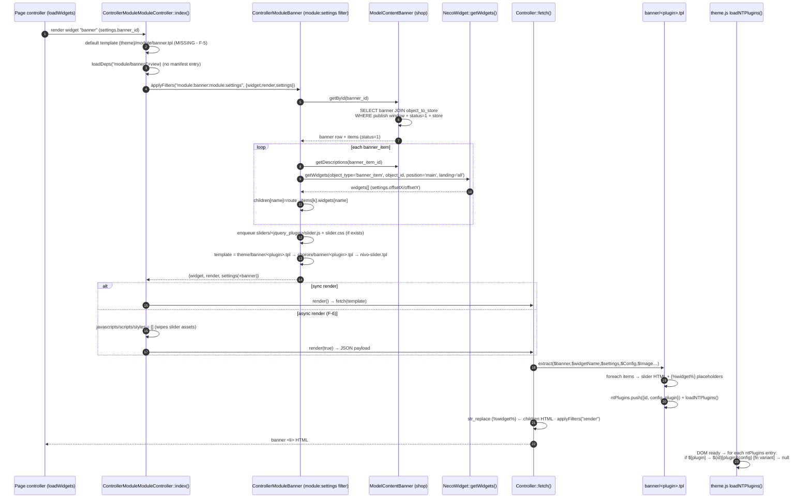
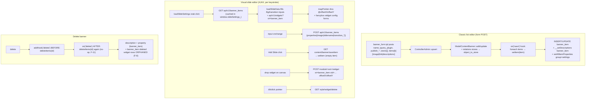
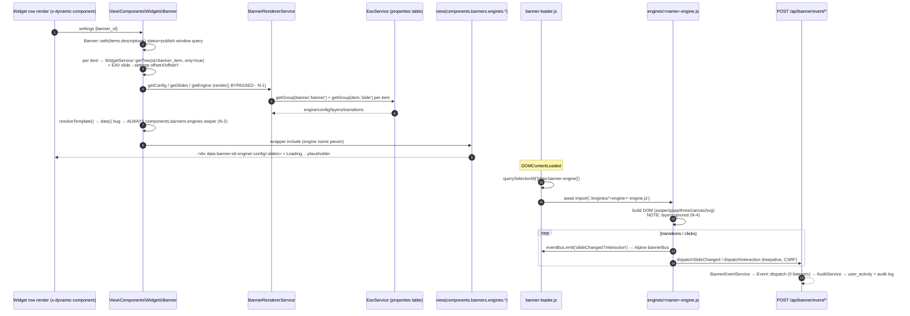
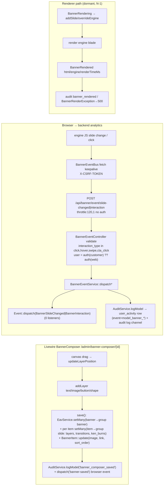
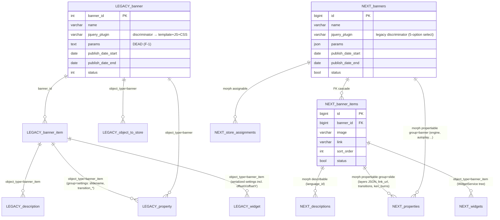

# 5 · Banners — From 33 jQuery Sliders to 8 Modern Engines

> The banner subsystem is the platform's showcase feature. Legacy: a `jquery_plugin` discriminator
> column selecting among **33 slider templates** with a `window.ntPlugins` client registry. Next:
> an EAV-selected engine family of **8 modern engines** (Swiper, GSAP ×3, three.js, Canvas, SVG
> morph, Ken Burns) with lazy dynamic imports and a browser→server analytics bus. Companion PDF:
> blueprint v9; appendix: [`appendix-research/3a3-banners.md`](appendix-research/3a3-banners.md).

## 5.1 Legacy Data Model

- **`nts8sd4fd_banner`** (L107-117): `banner_id`, `name`, **`jquery_plugin` varchar(150) — THE
  discriminator** (drives template + JS + CSS folder lookup), `params` text (**dead column — zero
  read/write sites**), `publish_date_start/end` (`'0000-00-00'` = open), `status`.
- **`nts8sd4fd_banner_item`** (L125-134): `banner_item_id`, `banner_id`, `image`, `link`,
  `sort_order`, `status`.
- **EAV attachment** (see [Chapter 8](08-omni-eav-properties.md)): localized title/description →
  `description` (object_type `banner_item`); per-slide settings → `property` group `settings`
  (`slidename`, `transition_delay/duration/effect in+out`); store scoping → `object_to_store`;
  **per-slide widgets** → `widget` rows (object_type `banner_item`).
- **Scheduling SQL** (shop model `banner.php:26-33`): `publish_date_start <= NOW() AND
  (publish_date_end >= NOW() OR '0000-00-00') AND status=1 AND store match` — the only visibility
  gates; language resolves at render time.

## 5.2 Legacy Storefront Rendering

Flow through `app/shop/controller/module/banner.php` `module:settings` filter (L12-84):

1. Store-scoped `getById` → per-item descriptions + **recursive `NecoWidget::getWidgets
   (object_type='banner_item', position='main', landing='all')`** → registers per-slide widget
   children + offsetX/offsetY overlays (the "widgets on slides" concept).
2. Enqueues `sliders/<plugin>/slider.js|css` (file_exists-guarded).
3. **3-tier template resolution**: `{theme}/banner/<plugin>.tpl` → `choroni/banner/<plugin>.tpl` →
   **hard fallback `nivo-slider.tpl`**. (There is no `module/banner.tpl` at all — a banner with an
   empty `jquery_plugin` hits a debug `exit()`.)
4. Client seam: `window.ntPlugins.push({id, config, plugin, fn?})` + `loadNTPlugins()`
   (`theme.js:91-106`) — init guard on `$[plugin]` presence; `fn(slider, el)` post-init variant.

⚠ **Async pitfall:** `modulecontroller.php` **resets javascripts/styles AFTER the filter** — async
banner widgets lose their slider assets.

## 5.3 The 33 Legacy Templates (`app/shop/view/theme/choroni/banner/`)

| # | Template | Engine / effect |
|---|---|---|
| 1-2 | `nivo-slider`, `nivo-slider-v3.1` | Nivo Slider (fallback; v3.1 adds HTML captions) |
| 3 | `slick` | slick 1.5.0 (selector missing `#` → never inits) |
| 4 | `camera-v1.3.4` | Camera 1.4.0 canvas slideshow |
| 5 | `eislideshow` | codrops Elastic Image Slideshow |
| 6 | `evolution-v1.1.5` | Slider Evolution (hardcoded widget id `#widget_banner_1047204256`) |
| 7 | `layer-slider-v0.0.1` | custom vanilla JS; per-item `` tokens |
| 8 | `parallax-content-slider` | cslider (selector `"slider"` never inits) |
| 9 | `horizontal-parallax` | CSS-only parallax |
| 10 | `slicebox-v1.1.0` | codrops 3D cuboids |
| 11 | `jssor-vertical-nav` | jssor with vertical thumbnails |
| 12 | `necoslider` | dead static demo (ignores items) |
| 13 | `carousel` | Owl Carousel 2.2.1 |
| 14-15 | `horizontal`, `vertical` | CSS lists; per-item `` |
| 16-18 | `fancybox-gallery`, `fancybox-grid`, `grid-gallery` | fancyBox 3.0.47 / gridrotator (no `#` → never inits) |
| 19-33 | `horizontal-hover-effect-01..15` | pure-CSS hover galleries (only -08 ships JS = anime.js + PolarisFx; its ntPlugins entry **lacks `plugin:`** → never initializes) |

Assets: 14 JS dirs / 30 CSS dirs under `web/assets/…/sliders/`; the fallback `nivo-slider`'s own
JS+CSS are **missing** from assets.

## 5.4 Legacy Admin

- `ControllerContentBanner` — grid filters, sliders list from `glob(DIR_JS.'sliders/*',
  GLOB_ONLYDIR)`, AJAX `saveItem()`/`deleteItem()` (delete→re-insert item + descriptions +
  properties; id churn F-13).
- **Visual slide editor** (`banner_form.tpl`, 447 lines): vtabs editor (Bg/Contents/Preview; per-slide
  `properties[slidename|transition_*]` instant-save) + classic sortable items editor.
  `contentbanner.js` (579 lines): `loadSlideSettings` → `api/v1/banner_items`; per-keystroke POST;
  **widget drag-drop onto slide bg** computes percentage offsetX/offsetY and POSTs
  `module/<ext>/widget` with `ot=banner_item, oid=<item>`; fancybox config dialogs.
- Model self-observers: `on("save")` bulk `setItem`; `addHook("delete")` AND `on("delete")` both
  call `deleteItems` (double cascade, second no-op); delete **orphans per-slide widget rows**.
- Widget form (`module/banner/widget.php`): settings `class/width/margin/padding/float` + a single
  `banner_id` select.

## 5.5 necoyoad-next — The Modern Banner Engine

### 5.5.1 Render paths

- **`BannerRendererService`** (204 lines, singleton): `ENGINES` const (8); `getEngine()` = EAV
  `banner→engine ?? 'swiper'`; `getConfig()` = defaults (autoplay 5000 / transition 800 / loop /
  nav / pagination / parallax_depth / ken_burns_intensity) merged with EAV group `banner`;
  `getSlides()` = items → EAV group `slide` (layers JSON, link_url/target, background
  video/gradient, transition_in/out, ken_burns). `render()` = 6 steps: `BannerRendering` dispatch
  (mutable `addSlide()`/`overrideEngine()`) → engine resolution (unknown → swiper) → slides merge
  (empty → `BannerRenderException`) → blade render → `BannerRendered(html, engine, renderTimeMs)` →
  audit. ⚠ **`render()` has zero call sites** — the widget component calls getConfig/getSlides/
  getEngine directly, so both render events + audit + exception paths are dead in practice.
- **The 8 engines** — all Blades are 6-line wrapper includes; real markup is the hydration shell
  (`wrapper.blade.php`: `data-banner-id/-engine/-config(JSON)/-slides(JSON)/-name` + "Loading
  banner…"). `banner-loader.js` scans the DOM, lazily `import()`s the engine module, and passes
  `(el, config, slides, bannerId, eventBus)`:

| Engine | Library | Effect |
|---|---|---|
| `swiper` | Swiper 11 (+6 effect modules) | the full-featured default: nav/pagination/lazy/video/gradient slides |
| `gsap-cube` | GSAP | ≤6 cube faces rotateY (drops >6 slides) |
| `gsap-flip` | GSAP | Y-axis flip cards |
| `gsap-coverflow` | GSAP | tilt/scale/x-offset coverflow |
| `ken-burns` | none | random pan/zoom presets × intensity + crossfade |
| `three-distort` | three.js | GLSL noise-distortion crossfade shader, rAF loop, full dispose |
| `canvas-particles` | none | 3000-pixel particle dissolve |
| `svg-morph` | GSAP + flubber | path morphing (hardcoded circle paths — images ignored) |

All engines emit `slideChanged` + click interactions; all fall back to swiper-engine on missing
lib; on loader failure → `banner_engine_error` audit + plain `` fallback list.

### 5.5.2 Composer + analytics pipeline

- **`BannerComposer`** (Livewire, `/admin/banner-composer/{bannerId}`): 3-panel UI — slide list /
  layer canvas with vanilla-JS drag + z-order / properties + engine config. Layer schema:
  `text|image|button|shape` with x/y/z/w/h + animation in/out/delay/duration/easing. `save()`
  writes EAV groups `banner` + `slide` per item + `banner_composer_saved` audit + browser
  `banner-saved` dispatch. ⚠ Layers are **write-only** — no engine renders them (design doc
  features like live iframe preview / timeline editor / presets remain unimplemented).
- **Analytics**: engine JS → `Alpine.store('bannerBus')` local pub/sub + `BannerEventBus` fetch
  (CSRF header + `keepalive`) → `POST /api/banner/event/{slide-changed|interaction}`
  (`throttle:120,1`, no auth) → `BannerEventController` validation → `BannerEventService::dispatch*`
  → `Event::dispatch` + `AuditService::logModel` → **`user_activity` rows** (morph activitable →
  Banner, ip/browser). No dedicated analytics tables, no impression tracking.
- **ER comparison**:

## 5.6 Legacy ↔ Next Mapping (headline)

| Legacy | Next |
|---|---|
| 33 jQuery templates + `jquery_plugin` column | 8 engines + EAV `banner→engine` + wrapper data-attributes |
| `window.ntPlugins` / `loadNTPlugins()` registry | `banner-loader.js` lazy dynamic import per engine |
| Per-item **widgets** (offsetX/offsetY overlays; only 2 templates rendered them) | per-slide **layers** JSON (stored, never rendered) |
| No analytics | full browser→server event pipeline (throttled, `user_activity`-backed) |
| Model self-observers | `Banner*` events + `Auditable` |
| Missing-template debug `exit()` | `BannerRenderException` |
| Scheduling / store scoping / localized descriptions / EAV settings | **all preserved** |
| `carousel()` JSON endpoint | dropped |

## 5.7 Known Issues Register

**Legacy (15, full list in research):** dead `params` column; 6 templates with broken/missing
ntPlugins selectors (slick/gridrotator/cslider/fancybox never init); evolution hardcoded widget id;
hhe-08 missing `plugin:` key; no default module template → debug exit; async render wipes slider
assets; orphaned per-item widgets on delete; item cache never invalidated; saveItem id churn.

**Next (15, full list in research):** `render()` zero call sites (events/audit dead);
`resolveTemplate()` `data()` bug → always swiper wrapper; events dispatch-only / not broadcastable;
layers write-only; cube drops >6 slides; `direction` always 'next'; svg-morph hardcoded paths;
vestigial `public/sliders` enqueue; `config banner_plugins` never read (5-option list duplicated
inline, 8 engines in neither); no impressions + unauthenticated throttled write surface; composer
saves `banner_items.link` but renderer reads EAV `slide.link_url` (links ignored); no explicit
store scoping in widget query.

---

Next: [Chapter 6 — Menus](06-menus.md) · [Back to index](README.md)
