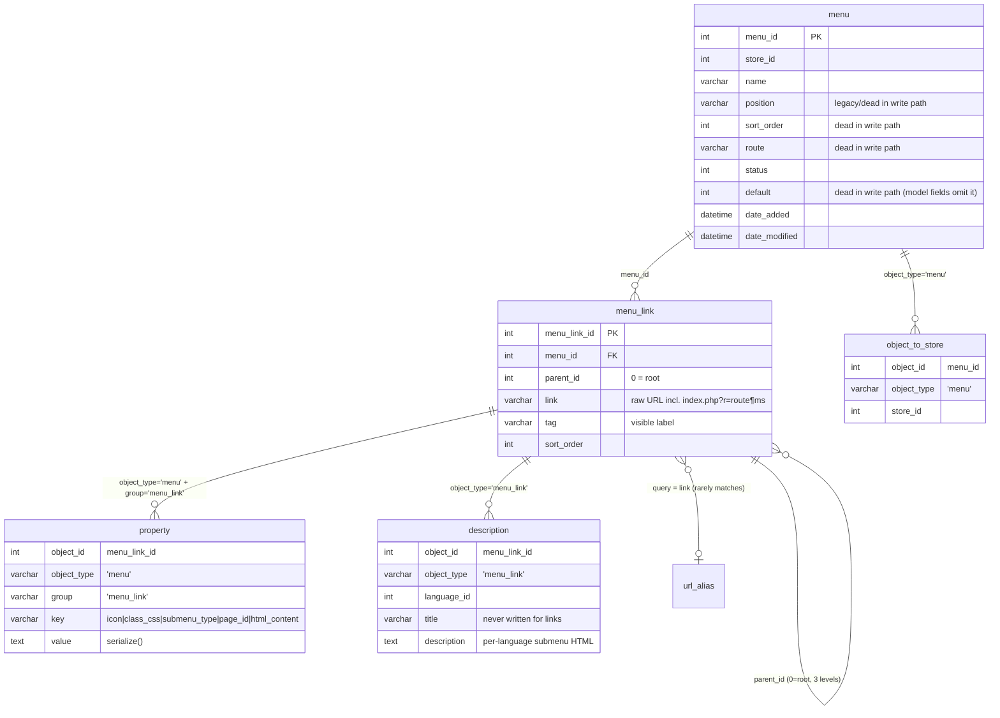
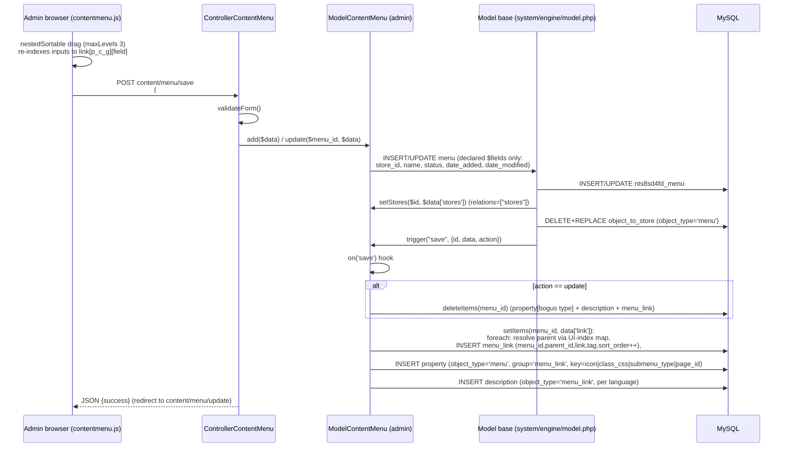
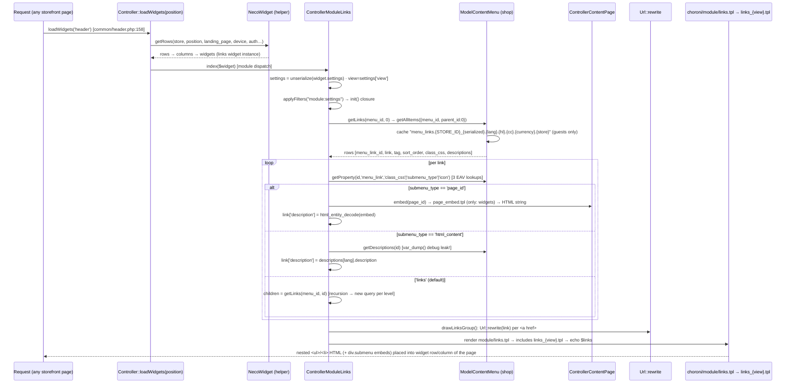
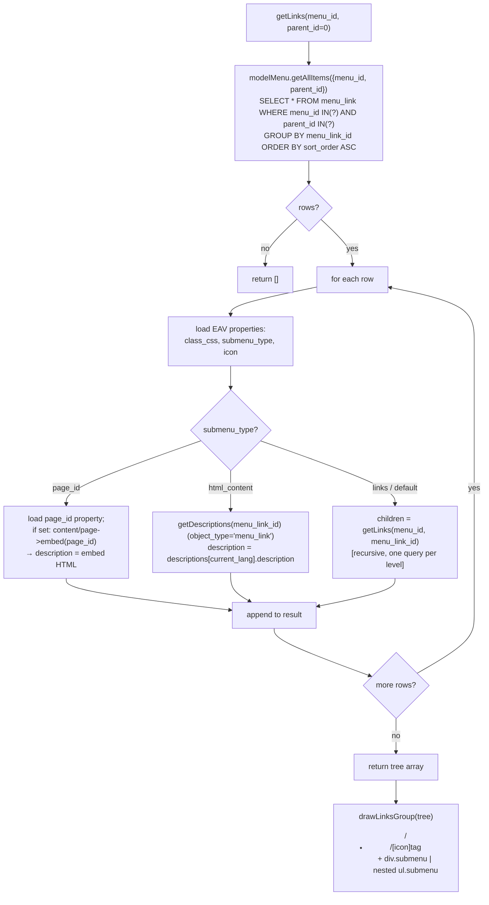

# 6 · Menus — Tree Composition, Link Metadata & Page Embedding

> The menu system: adjacency-list `menu`/`menu_link` tables, per-link EAV metadata
> (icon/class_css/submenu_type/page_id), a nestedSortable admin tree editor, and a storefront
> **links widget** that renders menus in 12 view variants — including embedding entire CMS pages
> as submenus via `page_embed.tpl`. Companion PDF: blueprint v7; appendix: [`appendix-research/3a4-menus.md`](appendix-research/3a4-menus.md).

## 6.1 Data Model (legacy, verified in `necoyoad_db.sql`)

**`nts8sd4fd_menu`** (L569-580): `menu_id, store_id, name, position, sort_order, route, status,
default, date_added, date_modified`. ⚠ `position`, `route`, `default`, `sort_order` are **dead in
the write path** — the admin model's `$fields` only persists `store_id, name, status, dates`; live
store scoping is `object_to_store` (`object_type='menu'`), not the `store_id` column.

**`nts8sd4fd_menu_link`** (L588-595): `menu_link_id, menu_id, parent_id` (**adjacency list; 0 =
root**), `link` varchar(250) (**raw URL** — either an external URL or a route-URL produced by admin
AJAX pickers), `tag` (visible label), `sort_order`. No status/target/permission columns.

**Link "types" are not polymorphic** — `link` stores whatever the admin picked: arbitrary URL,
CMS page (`Url::createUrl('content/page', …)`), product category
(`store/category&path=parent_child`), or post category.

**Per-link metadata (EAV `property`)**: rows written with `object_type='menu'` + **`group='menu_link'`**
+ keys `icon`, `class_css`, `submenu_type`, `page_id` (and `html_content` — read but never written).
**Localization** (`description`): rows with `object_type='menu_link'`, per `language_id`; only the
`description` field (rich HTML for `submenu_type='html_content'`) is ever written — localized
`title` labels are dormant; `tag` is the only label.

## 6.2 ER Diagram

## 6.3 Admin — The Tree Editor

### 6.3.1 Save sequence

`ControllerContentMenu` (`app/admin/controller/content/menu.php`, 495 lines) + `contentmenu.js`
(487 lines):

- **Tree editor** `getLinks($parent_id=0)`: server-renders nested `<ol><li>` with per-link inputs
  `link[i][menu_link_id|link|tag|class_css|submenu_type|page_id|descriptions[lang][description]]`.
  Index grammar: root = `id`, child = `grandparent_parent_id`, grandchild = `gp_p_id` (**max 3
  levels** — UI `nestedSortable({maxLevels: 3})` re-indexes on drag).
- **`submenu_type` select**: `links` (Sub-Links) / `page_id` (A Page) / `html_content` (HTML
  Content) with show/hide JS.
- Per-language CKEditor textareas wired to `common/filemanager` + storefront `theme.css` as
  contentsCss; **FontAwesome icon picker** (fas/far/fab catalogs hardcoded in JS); entity pickers
  (`addPage/addCategory/addPostCategory` POST to AJAX endpoints and append items).
- **`setItems()`** (model, L206-252): tree persistence — resolves parents through a `$parent[key]`
  map of inserted ids, INSERTs with a shared incrementing `sort_order`, then `setProperty` per
  metadata key + `setDescriptions`. **Delete-and-reinsert ⇒ menu_link ids unstable across saves.**
- `save()` is an AJAX endpoint → JSON. Copy/activate/grid inherited from `AdminController`.

## 6.4 Storefront — The Links Widget

### 6.4.1 Rendering sequence

`app/shop/controller/module/links.php` (99 lines), `ControllerModuleLinks`:

- `init()` registers the `module:settings` filter; `settings['menu_id'] > 0` →
  `data['links'] = drawLinksGroup(getLinks(menu_id))`.
- **`getLinks()`** — recursive tree builder: one `getAllItems` query per level (file cache prefix
  `menu_links`, admin-bypassed); per link 3 EAV lookups (`class_css`, `submenu_type`, `icon`); then
  the **3-way branch**:
  1. `page_id` → `load->controller('content/page')` + `html_entity_decode($pageController->embed($page_id))` — an **entire embedded CMS page** as submenu content;
  2. `html_content` → localized rich HTML from descriptions (⚠ contains a leftover `var_dump` at line 56 — debug artifact);
  3. else → recurse `children = getLinks(menu_id, menu_link_id)`.
- **`drawLinksGroup()`**: nested `<ul[ class="submenu"]>` / `<li class="{class_css}">` /
  `<a href="{Url::rewrite(link)}" title="{tag}">[]{tag}</a>`;
  `description` → `
`; children → recursive `<ul class="submenu">`.
- **12 view templates**: `{theme}/module/links.tpl` includes `links_{settings['view']}.tpl` —
  `default`, `main_menu`, `vertical`, `overheader` (hamburger `.responsive` toggle), `01`–`07`
  (menumaker/dlmenu `ntPlugins`), `marketo`. Async mode `?r=module/links/async&w=…` returns JSON html.
- **Navigation is widget-driven**: `common/header.php:158 loadWidgets('header','shop',true)` →
  `header.tpl:94-95` includes `shared/widgets-rows.tpl` — there is no hardcoded nav.

### 6.4.2 The page-embed flow (submenu_type = 'page_id')

`ControllerContentPage::embed($page_id)` (page.php:123-177): cache `html-page-embed.*`; sets
session `object_type/object_id`; `loadWidgets('only:featuredContent'|'only:main'|'only:featuredFooter')`
(per-page-object widgets only); template = per-page `style/view` property else
**`content/page_embed.tpl`** (24 lines: `div.tpl-page-embed` with widgets-featured → 12-col
widgets-rows(main) → widgets-featured-footer; **no header/footer**) — returned as a string into the
submenu `
`.

### 6.4.3 Tree-builder algorithm

**Query cost (uncached):** ~150 queries for a 5×3×2 menu (1 per level + ~6 lookups per link);
cached per (store, language, currency…) for guests.

## 6.5 necoyoad-next

- **Schema**: `menus` (store_id **FK 1:1** — semantic change from legacy m:n scoping, +`is_default`,
  +`status` on links, parent 0 → **NULL**) → `menu_links` (morph spine: descriptions/properties via
  the `menu_link` alias — unifying legacy's split conventions).
- **Models**: `Menu::links()` = hasMany → `whereNull('parent_id')` → orderBy(sort_order)
  (**root links only**); `MenuLink` = `HasDescriptions` + `HasProperties` + parent/children
  (children filter status).
- **Filament `MenuResource`**: Tabs — General (name, store select, position, is_default, status,
  sort_order) + Links (**Repeater → relationship('links')** with tag/link/**parent_id select of ALL
  MenuLinks globally**/sort_order, orderable). No UI for icon/class_css/submenu_type/page_id/
  per-language descriptions — parity gap. No copy/activate actions.
- **Rendering**: `App\View\Components\Widgets\Links` — recursive `MenuLink` queries per level, maps
  `class_css`/`icon` via EavService, `drawLinksGroup()` emits `<ul class="menu-links">` markup.
  **N+1 kept, no cache, no submenu_type branch** (docblock claims 3 types; code only recurses;
  `$langId` computed but unused; icon loaded but not rendered). No SEO URL rewriting of links.
- **Seeder**: 1 "Main Menu" (position header, is_default) + 4 flat links per store; no links widget
  instance seeded.
- **Not ported**: page embed (`embed()`/`page_embed.tpl`), html_content/page_id submenu rendering,
  per-view template variants, per-link metadata admin UI, menu caching.

## 6.6 Legacy ↔ Next Mapping

| Concern | Legacy | Next | Status |
|---|---|---|---|
| menu/menu_link tables | SQL L569/L588 | migrations L277/L291 | ✅ ported (default→is_default, parent 0→NULL, +status) |
| Store scoping | `object_to_store` m:n | single store_id FK | ⚠ semantic change |
| Tree | adjacency, depth ≤3, unstable ids | adjacency, unbounded, stable ids | ✅ improved |
| Per-link EAV | property group `menu_link` | properties morph + EavService | ⚠ read path only, no admin UI, submenu_type unused |
| Localized submenu HTML | description object_type `menu_link` | morph descriptions | ⚠ schema only, no renderer |
| Admin CRUD | nestedSortable tree + CKEditor + icon picker + entity pickers | Filament flat Repeater + global parent select | ⚠ heavily simplified |
| Rendering | 3 submenu types, `Url::rewrite`, 12 view templates, file cache | recursion only, raw URLs, 1 template, no cache | ⚠ subset |
| Page-embed submenu | `content/page->embed()` + `page_embed.tpl` | — | ❌ not ported |
| Cache | `menu_links.*` (never invalidated) | widget-tree cache TTL 300s; menu tree uncached | ⚠ different layer |

## 6.7 Verified Defects (legacy F-1…F-10)

F-1 `var_dump` in links.php:56 · F-2 EAV cleanup object_type mismatch → orphaned property rows ·
F-3 dead columns (position/route/default/sort_order) · F-4 phantom `menu_to_store` table referenced
by dead shop-model methods · F-5 keyword/slug input never persisted · F-6 `url_alias` lookup never
matches (full URL vs route-query format; keyword always `''`) · F-7 **cache never invalidated on
save** (storefront prefix `menu_links` never cleared) · F-8 link ids unstable (delete+reinsert) ·
F-9 global sort_order counter across levels · F-10 three-level depth cap (UI + index grammar).

---

Next: [Chapter 7 — Templates Blueprint](07-templates-blueprint.md) · [Back to index](README.md)
