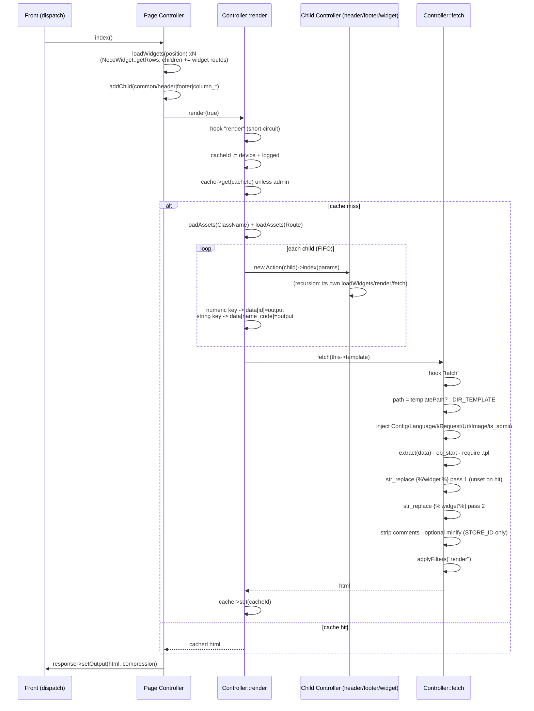
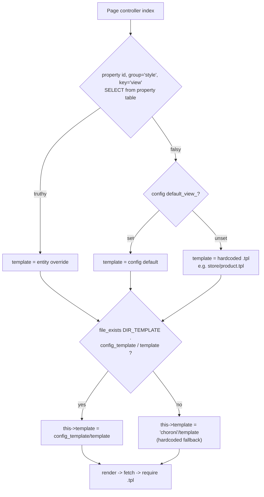
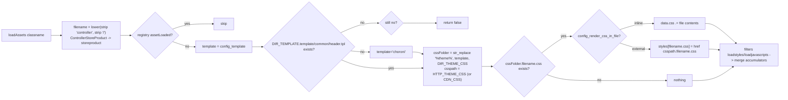
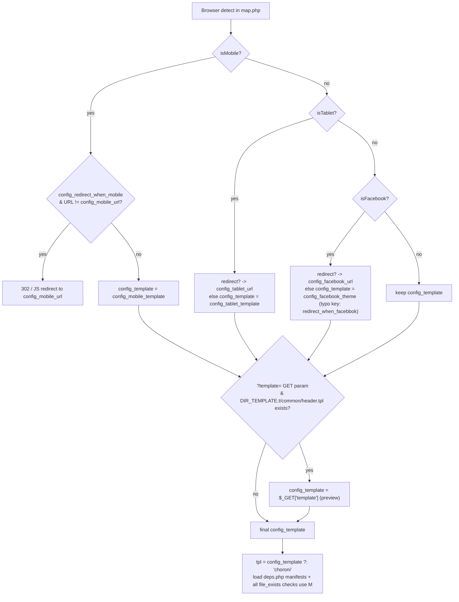
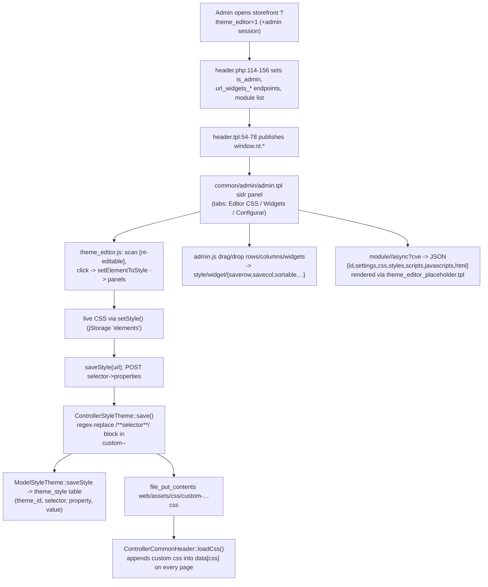
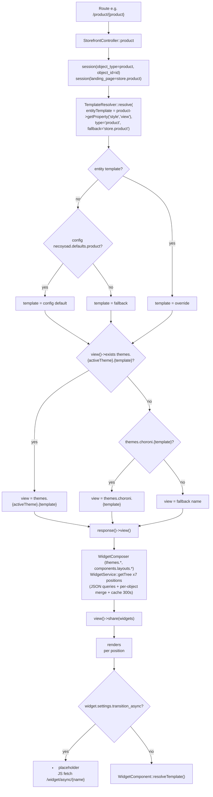
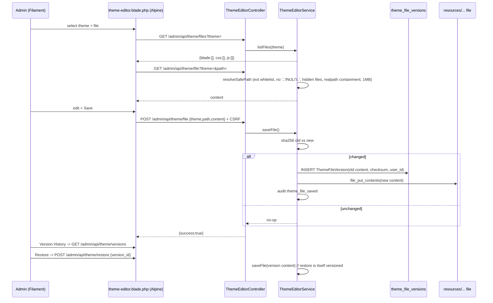

# 7 · Templates Blueprint — Themes, Resolution Chains & Live Editors

> How any page picks its template, how themes are structured, how assets are resolved, and how the
> two live theme editors work (legacy visual CSS editor vs the rewrite's sandboxed file editor with
> sha256 versioning). Companion PDF: blueprint v3; appendix: [`appendix-research/3b1-templates.md`](appendix-research/3b1-templates.md).

## 7.1 Legacy Theme Structure

**Exactly one theme ships: `choroni`** — `app/shop/view/theme/choroni/` with **332 `.tpl` files**:

| Folder | Count | Contents |
|---|---|---|
| `common/` | 19 | Layout: `header/footer/home.tpl`, `column_left/right`, `maintenance`, `success`, + `admin/*` visual-editor chrome (theme configurator panels for background/fonts/dimensions/shadows/borders/radius/margins/paddings + widgets) |
| `shared/` | 56 | Fragments: `widgets-rows.tpl`, `widgets-featured{,-footer}.tpl`, `widgets-column-{left,center,right}.tpl`, `widgets-common.tpl`, `widget-head/footer.tpl`, `breadcrumbs`, `messages`, `sort`, form fragments (`fields/*` incl. payment/shipping), `fragment/header-start.tpl` (319 lines), `product/sticker.tpl` |
| `module/` | 169 | One `.tpl` per widget type + view variants (`product_list_{default,grid,list,carousel,slider}.tpl`, `links_01..07.tpl`, …) |
| `banner/` | 33 | Slider-engine templates (see [Chapter 5](05-banners.md)) |
| `store/` | 11 | product/products_all/category/categories/manufacturer(s)/search/special/review/comment |
| `content/` | 10 | post/posts/page/page_embed/category/categories + `landing_page_necotienda{,_svg_01..03}.tpl` |
| `account/` | 22 | login/register/order/invoice/payment_receipt/balance/… |
| `checkout/`, `payment/`, `page/`, `error/`, `localisation/` | 12 | cart/success; payu ×3 + pp_standard; sitemap/deprecated; not_found; languages/currencies |

Theme **assets** live separately in `web/assets/theme/choroni/{css,js}` (route-named CSS/JS +
`deps.php` manifests). A second asset-only theme `web/assets/theme/mobile/` exists with no matching
template theme — device swap only changes assets.

**Path constants & `%theme%` substitution** (`app/shop/config.php`): `DIR_TEMPLATE =
'app/shop/view/theme/'` (:47); `HTTP_THEME_CSS/JS/IMAGE/FONT` with literal `%theme%` placeholders
(:30-33); substituted at runtime by `str_replace` in `Controller::_loadAssets()`,
`map.php:263-267/304-307`, `header.php:337-344`, `Module::loadWidgetAssets()`; CSS relative URLs
(`../images/`, `../fonts/`) are rewritten in `__loadCss():440-443`.

## 7.2 The Template Engine — Raw PHP + `` Tokens

`.tpl` files are **raw PHP** executed by `require` inside `Controller::fetch()`. No Smarty/Twig.
The only template "syntax" is the `` string token substituted after execution via
`str_replace`. `system/library/template.php` (24 lines, `final class Template`) is **dead code** —
OpenCart heritage with zero call sites.

### 7.2.1 `Controller::render()` (controller.php:203-316)

1. `"render"` hook short-circuit → 2. cache-key decoration: device suffix
   `.mobile/.tablet/.facebook/.pc` from `Browser` + customer-logged flag → 3. cache lookup
   (skipped for admins) → 4. own assets: `loadAssets(ClassName)` + `loadAssets(Route)` →
   5. **children loop** — each child runs its own `render()`; publication rule: **numeric key**
   (layout child) → `$this->data[$controller->id]` (becomes `$header/$footer/$column_left/$column_right`);
   **string key** (widget child) → `$this->data[$key.'_code']` → 6. `fetch()` between
   `beforeRender`/`afterRender` events → 7. cache write-back if `$return` → 8. output disposition.

### 7.2.2 `Controller::fetch()` (controller.php:318-399)

1. `"fetch"` hook short-circuit → 2. path: `$this->templatePath` (module-local templates) else
   `DIR_TEMPLATE . $filename` → 3. missing file: silent `''` unless `NTS_DEBUG_MODE` →
   4. **six magic services injected**: `$Config`, `$Language`, `$l` (closure → language->get),
   `$Request`, `$Url` (fresh), `$Image` (fresh NTImage), `$is_admin` → 5. `extract($this->data)` →
   6. `ob_start(); require($file)` → 7. **first-pass `` substitution** —
   `str_replace('', code, $content)` with `unset($children[$key])` on hit →
   8. **second pass** for tokens inside widget output → 9. HTML post-processing (strip `/* */`
   comments, collapse newlines, minify if `config_minified_html && defined('STORE_ID')` —
   storefront only) → 10. `applyFilters("render")`.

### 7.2.3 The render/fetch pipeline



## 7.3 Page Template Resolution — The 4-Step Chain

Every page controller (verified: home, product, category, post, page, content/category, error
paths) follows:

```php
$template         = $model->getProperty($entity_id, 'style', 'view');          // 1. per-entity EAV override
$default_template = $this->config->get('default_view_<entity>') ?: '<hardcoded>.tpl';  // 2. store default
$template         = empty($template) ? $default_template : $template;          // 3.
$this->template   = file_exists(DIR_TEMPLATE . $this->config->get('config_template') . '/' . $template)
    ? $this->config->get('config_template') . '/' . $template                  // 4a. active theme
    : 'choroni/' . $template;                                                  // 4b. hardcoded fallback
```

### 7.3.1 Resolution decision flow



**The `default_view_*` system:** `app/admin/controller/style/views.php` persists ~50 settings —
`default_view_home`, `default_view_page{,_all,_error,_review,_comment}`, `default_view_post*`,
`default_view_product{,_quickview,...}`, `product_category*`, `manufacturer*`, `account_*`,
`search/special/contact/sitemap/maintenance/not_found` — and globs theme `.tpl` files for the picker.

**`$tpl` fragment inheritance:** every template starts with
`<?php $tpl = is_dir(DIR_TEMPLATE.config_template."/shared") ? config_template : "choroni"; ?>`
then `include(DIR_TEMPLATE.$tpl."/shared/…")` — a child theme can override page templates while
inheriting choroni's shared fragments.

**Special layouts:** `page_embed.tpl` (embedded page = widget-only canvas, no header/footer —
see [Chapter 6](06-menus.md)); error404 → `default_view_*_error ?: error/not_found.tpl`.

## 7.4 Asset Resolution — The Route-Named Convention



- **Naming rule** (controller.php:719): lowercase, strip `controller`, strip `/` → `common/home` →
  `commonhome`; `ControllerStoreProduct` → `storeproduct`; `store/product/quickview` →
  `storeproductquickview`; module routes append the view: `modulebanner.css`.
- **Theme sentinel** (:750-752): `config_template` is valid only if
  `DIR_TEMPLATE.<t>/common/header.tpl` exists, else literal `'choroni'`.
- **CDN precedence:** `CDN_CSS/CDN_JS` over `HTTP_THEME_*` (:755-756); `$subfolder` variant for
  per-app templates (`config_{sub}_template`).
- **Inline vs external modes** (`config_render_js_in_file`/`config_render_css_in_file`): inline
  appends file contents to `data['css']`/registry arrays — with the known bug at :798 that discards
  the `file_get_contents` result due to the `processcss` filter arg-clobber.
- **`deps.php` manifests** (`web/assets/theme/<tpl>/{css,js}/deps.php`): `$css_assets` /
  `$js_assets` / `$js_header_assets` / `$jsx_assets` (inline) keyed by entry with `'routes' => '*'
  | [...]`; loaded and route-filtered in `map.php:261-321`; leftovers feed `Module::loadDeps()`.

## 7.5 Device Theme Switching & Preview



`map.php:199-257`: mobile → `config_redirect_when_mobile` 302/JS redirect to `config_mobile_url`
**or** swap `config_template = config_mobile_template`; tablet likewise; Facebook in-app browser
likewise (typo key `config_redirect_when_facebbok`). **Live preview:** `?template=<name>` swaps the
active theme if `DIR_TEMPLATE.<name>/common/header.tpl` exists.

## 7.6 The Legacy Visual Theme Editor — Three Pieces

### 7.6.1 The editing loop



1. **Inline chrome**: `?theme_editor=1` + admin session → `header.php:113-156` publishes
   `url_widgets_{load,save,savecol,saverow,sortable,sortrow,sortcol,delete,...}` +
   `window.nt.*` → `common/admin/admin.tpl` sidr panel with per-property panels;
   `theme_editor.js` (2,498 lines, jQuery + jStorage) implements panels, element pickers, style
   translation, copy/paste style, per-group resets, and `saveStyle()` (POSTs the selector→
   properties map). `admin.js` drives the widget drag/drop manager over the same endpoints. DOM
   hooks: `nt-editable/movable/removable/configurable` + `data-row/column/widget/position`.
2. **CSS persistence**: `ControllerStyleTheme::save()` (style/theme.php:136-418) regex-replaces
   `/**selector**/ … /**selector**/` blocks inside `web/assets/css/custom-<theme_id>-<config_template>.css`;
   `ModelStyleTheme::saveStyle()` bulk-INSERTs into `theme_style (theme_id, selector, property,
   value)`; consumed by header `loadCss():358-368`.
3. **Code editor**: `ControllerStyleEditor` lists/saves raw `.tpl`/`.css` — **with the security
   flaw that motivated the rewrite**: `save()` takes paths from GET; its
   `strpos($file, realpath(...)) >= 0` guard is **always true**; no extension whitelist (PHP
   editable), no backup, no CSRF (ThemeEditorService docblock cites this explicitly).

## 7.7 necoyoad-next — TemplateResolver + Live Theme Editor

### 7.7.1 Resolution + composition



**`TemplateResolver::resolve(?string $entityTemplate, string $type, string $fallback)`** (55 lines):

1. per-entity EAV override → 2. `config("necoyoad.defaults.{$type}")` → 3. hard fallback →
4. theme = `StoreContext->setting('config_template', 'choroni')` (reads `Store->settings` JSON) →
5. `view()->exists("themes.{theme}.{template}")` → active theme → 6. `themes.choroni.{template}` →
7. bare fallback. Naming: `themes.<theme>.<folder>.<name>` →
`resources/views/themes/<theme>/<folder>/<name>.blade.php`. Callers: all 9 StorefrontController
page actions pass `$model->getProperty('style','view')` — same EAV group/key as legacy.
⚠ Config key mismatch: controller uses `products/categories/posts` for "all" pages but config
defines `product_all/category_all/post_all` — those levels never fire.

### 7.7.2 The theme editor (sandboxed, versioned)



- **Stack**: Filament page (Design nav) → Alpine UI → REST `admin/api/theme/*`
  (`auth` + `can:theme-edit'`) → `ThemeEditorController` → `ThemeEditorService` → filesystem +
  `theme_file_versions`.
- **Sandbox**: `ALLOWED_EXTENSIONS = ['blade.php','css','js','scss','json']` (**no `.php`** — RCE
  fix); base dirs per extension (`resources/views/themes/<theme>`, `resources/themes/<theme>/{css,js}`);
  theme regex `^[a-zA-Z0-9\-_]+$`; path rejects `..`/NUL/leading `/`/hidden dot-segments;
  `realpath` containment; **1 MB read+write cap**; dedicated exceptions
  (`ThemeFileNotFoundException` 404 / `UnsafeFileException` 422).
- **Versioning**: pre-save sha256 compare → unchanged = no-op; changed → snapshot OLD content into
  `theme_file_versions` (theme, file_path, content, user_id, checksum); restore is itself versioned
  (undoable); last 50 versions listed; audit events `theme_file_read/saved/restored`.
- **UI**: theme select, type filter (Blade/CSS/JS), file-tree sidebar, textarea editor, version
  history table with Restore, unsaved-changes guard.

### 7.7.3 Theme + layout components

- `resources/views/themes/choroni/`: `content/{home,post,posts,page}.blade.php` +
  `store/{product,products,category,categories,search}.blade.php` — all wrap
  `<x-layouts.storefront>`; entity content inline; widget positions via
  `<x-layouts.widget-row :position="$position" />`; `home.blade.php` is purely widget-driven.
  Theme assets: `resources/themes/choroni/{css/theme.css, js/theme.js}` — the customization surface
  for the editor.
- **`components/layouts/storefront.blade.php`** (189 lines, the `widgets-common.tpl` equivalent):
  graceful Vite try/catch, `$styles`/inline `$css`/`$headerJavascripts`, `#contentContainer
  .tpl-{type}[nt-editable]`, featuredContent/main/featuredFooter with **the same large-6/9/12
  responsive logic** as legacy, `@stack('main-content')` manual-composition seam, Alpine stores
  `ntPlugins`/`ntContext`, **async widget auto-loader** (`[data-async="1"]` → fetch
  `/widget/async/{name}` + audit on failure), `@livewire('storefront.cart-drawer')` on every page.
- **`components/layouts/widget-row.blade.php`** (63 lines): rows/columns with the same data
  attributes and grid classes; per widget: async placeholder vs
  `<x-dynamic-component :component="$widget['component']">`.
- **Asset pipeline**: `vite.config.js` (app.css + app.js only — theme files are NOT in the Vite
  graph, they're editor-editable raw files); `AssetManifest` = the `deps.php`` port
  (`registerWidget/loadForWidget/loadForRoute` — ⚠ `loadForRoute` never called; enqueued
  `css/widgets/*` assets don't exist yet in `public/`); versioning = Vite content hashes for the
  app bundle + content history for theme files.
- **Error page**: `errors/storefront.blade.php` — standalone styled status/message page for all
  `StorefrontException` subclasses.

## 7.8 Legacy ↔ Next Mapping (condensed)

| Concern | Legacy | Next |
|---|---|---|
| Engine | raw PHP `.tpl` via `Controller::fetch()`; dead `Template` class | Blade + `<x-dynamic-component>` |
| Theme dir | `choroni/**` 332 tpl | `themes/choroni/**` 9 blades |
| Theme assets | `web/assets/theme/<t>/{css,js}` + `%theme%` constants | `resources/themes/choroni/{css,js}` + Vite app bundle |
| Active theme | `config_template` setting | `Store.settings['config_template']` (same key) |
| Per-entity override | EAV `property('style','view')` | `getProperty('style','view')` → same group/key |
| Store default view | ~50 `default_view_*` settings + admin screen | `config('necoyoad.defaults.<type>')` (9 keys; ⚠ mismatch on "all" pages) |
| Resolution chain | entity → config → hardcoded → theme-or-choroni | entity → config → fallback → theme → choroni → bare |
| Widget tree query | `NecoWidget` LIKE blob scans | `WidgetService` JSON filters + cache 300s |
| Row/col scaffolding | `widgets-rows.tpl` + column templates (large-N) | `widget-row.blade.php` (same grid classes/data attrs) |
| Layout composers | 6 common controllers, addChild numeric keys | storefront layout component + WidgetComposer |
| Async widgets | admin-only JSON; `data-async` = transition hint | visitor HTML endpoint; `data-async="1"` = lazy load (**semantic inversion**) |
| Asset manifest | `deps.php` (4 manifests, route-filtered) | `AssetManifest` + provider registrations |
| Device themes | map.php redirect-or-swap | dropped (UA regex only for Alpine store) |
| Visual CSS editor | `?theme_editor=1` + `theme_style` table + generated CSS | **not re-implemented** (gap) |
| Code editor | unsafe GET-path `fopen(w+)` any extension | sandboxed whitelist + traversal guards + 1MB + versioning + audit |
| Module view variants | `module/<n>_<view>.tpl` via `settings['view']` | `resolveTemplate()` settings→theme→component |

## 7.9 Traps Worth Knowing

1. `system/library/template.php` is dead code — the engine is `Controller::fetch()`.
2. `_loadAssets()` line 798 bug discards inline route CSS (filter output used instead).
3. Legacy editor `save()` guard `strpos(...) >= 0` is always true → arbitrary file write.
4. Next config-default key mismatch (`products` vs `product_all`).
5. `data-async` semantic inversion legacy→next.
6. Legacy `$this->css` is a **keyed array** with `/**key**/` markers (not a string); consumed by
   header `loadCss()`.
7. `web/assets/theme/mobile/` is an asset-only theme — device swap changes assets, not templates.
8. Next preserves the `nt-editable` DOM contract everywhere — visual-editor-ready even though the
   visual editor isn't rebuilt.
9. Next's Theme Editor can edit **Blade live** — broader than legacy, while closing the PHP-RCE
   vector.

---

Next: [Chapter 8 — Omni EAV Properties](08-omni-eav-properties.md) · [Back to index](README.md)
