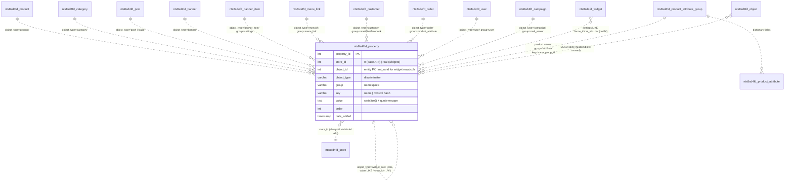
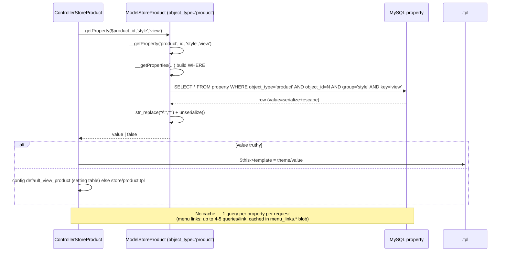
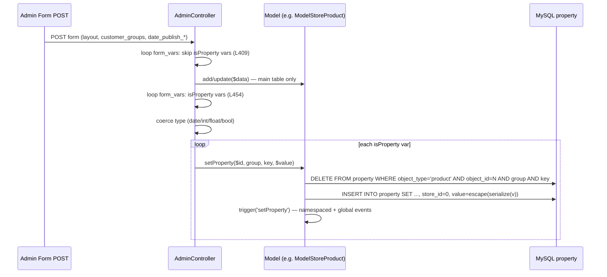
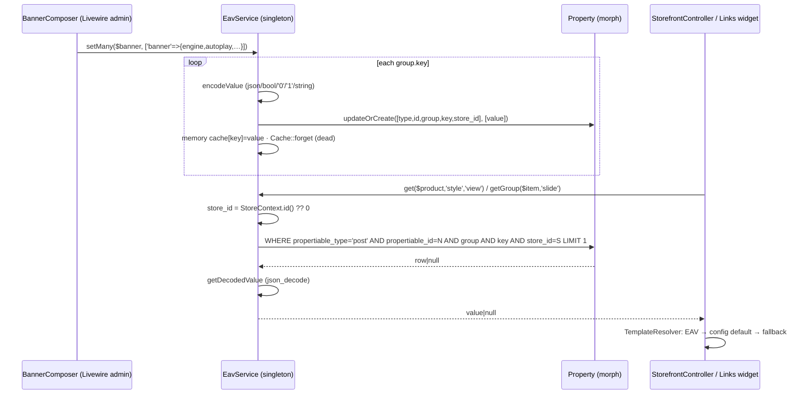

# 8 · Omni EAV Properties — One Table, Seventeen Object Types

> The `property` table is Necoyoad's universal key-value store: the same storage pattern attaches
> to products, categories, posts, pages, banners, banner items, menus, menu links, customers,
> orders, campaigns, users, extensions — and even **virtual entities** (widget rows/columns with
> random ids) and **zero-id global storage** (extension registrations). That's the "Omni" in Omni
> EAV. This chapter documents the API, the full group/key catalog, and the rewrite's morph-based
> successor. Appendix: [`appendix-research/3b2-eav.md`](appendix-research/3b2-eav.md).

## 8.1 The `property` Table (necoyoad_db.sql L1119-1129)

```sql
CREATE TABLE `nts8sd4fd_property` (
  `property_id` int(11) NOT NULL,          -- surrogate PK, never referenced by app code
  `store_id`    int(11) DEFAULT NULL,      -- 0 in practice; only NecoWidget writes real ids
  `object_id`   int(11) NOT NULL,          -- entity PK — or mt_rand(1,99999999) for widget rows/cols!
  `object_type` varchar(100) utf8 NOT NULL,-- discriminator ('product','page','menu','banner_item','widget_rows'…)
  `group`       varchar(100) utf8 NOT NULL,-- key namespace ('style','settings','menu_link','attribute'…)
  `key`         varchar(100) utf8 NOT NULL,-- key name (or row/col hash 'widgetRow_69d653ecf0b7')
  `value`       text utf8 NOT NULL,        -- ALWAYS serialize()'d + quote-pre-escaped
  `order`       int(11) NOT NULL,          -- sort order (widget rows/cols only)
  `date_added`  timestamp NOT NULL DEFAULT CURRENT_TIMESTAMP,
  UNIQUE KEY `property` (`object_id`,`object_type`,`group`,`key`)   -- leads with object_id!
) ENGINE=MyISAM DEFAULT CHARSET=latin1;
```

Structural consequences:

- The UNIQUE key leads with `object_id` → queries filtering only by `object_type`/`group` (every
  widget row/col scan, attribute search filters) are **full table scans** with `LIKE` over
  serialized `text`.
- `store_id` has no index and is excluded from the UNIQUE key → per-store property variants are
  structurally impossible via the base API (always written as 0).

**Sibling "shared spine" tables** using the same `(object_id, object_type)` addressing,
auto-cleaned by `Model::delete` (model.php:548-563): `description`, `object_to_store`,
`object_to_category`, `url_alias`, `stat`, `review`.

**Not EAV — common confusions resolved:**

- `setting` = `(store_id, group, key, value)` config store — `ModelSettingSetting` even has methods
  named `getProperty/deleteProperty` (API-name collision, different table).
- `product_attribute` / `product_attribute_group` = the **attribute dictionary** (field
  *definitions*: label/type/pattern/default/required). Per-product attribute **values** live in
  `property` (group `attribute`, key `<name>:<attribute_group_id>`). One EAV table, two roles.

## 8.2 The Model API (system/engine/model.php)

**Read path:**

- `__getProperties($object_type, $id, $group=null, $key=null)` (:1378-1406) — SQL
  `SELECT * FROM property WHERE object_type=? AND object_id=? [AND group=?][AND key=?]`;
  `'*'`/empty/null are **wildcards**; **no cache, no ORDER BY, no store filter**; each row's value
  `unserialize(str_replace("\'", "'", $row['value']))`.
- `__getProperty(...)` (:1361-1364) — `$rows[0]['value']` or **`false` on miss**.

**Write path:**

- `__setProperty($object_type, $id, $group, $key, $value)` (:1421-1451) — **delete-then-insert**;
  value encoding: `serialize($value)` → `str_replace("'", "\'")` → `db->escape()`. Fires
  `setProperty` trigger (namespaced + global). `store_id` always **0** (the `$store_id` arg is
  ignored by the 4-param delete callee — inline-assigned local).
- **The escape dance decoded**: the manual `\'` pre-escape survives `db->escape` doubling; MySQL
  unescapes once on INSERT leaving a literal `\'` in the blob; the read-side `str_replace`
  restores quotes so `unserialize()` succeeds. Round-trip consistent — but raw SQL equality
  against `value` can never match the serialize-wrapped form.
- `__deleteProperties(...)` (:1465-1495) — wildcard DELETE; fires event with `$this->object_type`
  instead of the passed type (misreports cross-type ops).
- `__setAllProperties` (:1510-1527) — **broken & dead** (argument-order TypeError on PHP 8).
  Every model re-implements the loop correctly.

**Generic query builder** — `buildSQLQuery` (:825-1059) supports `$data['properties']`
(:1001-1024): `LEFT JOIN property pp` + `LCASE(pp.key) LIKE` + `CONVERT(LCASE(pp.value) USING
utf8) LIKE` — fuzzy search over serialized blobs. Consumers: storefront search (6 blocks +
`store/search.php:191-278` mapping URL criterion `properties`→`forAttributes`), manufacturer,
admin menu/banner-item grids.

**Public per-model wrappers** (the "free" omni API): `getProperty` (:1713), `setProperty`
(:1732), `deleteProperty($id, group='*', key='*')` (:1754), `getAllProperties` (:1774) — all
delegate with `$this->object_type`.

## 8.3 ER — The Legacy EAV Cluster



## 8.4 The `property('style','view')` Pattern — No Magic Method

Grep `\-\>property\(` over `app/` → **0 hits** (the blueprint's shorthand). The pattern is three
concrete mechanisms:

1. **Storefront reads** — `$this->modelX->getProperty($id, 'style', 'view')` → template override in
   product (`store/product.php:168`), category (`:95`), manufacturer (`:82`), post (`:80`), page
   (`:100,159`), blog category (`:73`) — see [Chapter 7 §7.3](07-templates-blueprint.md).
2. **Admin writes** — the **`form_vars` EAV declaration**: fields with `'isProperty' => true,
   'group' => …, 'key' => …`. Save flow: loop 1 skips isProperty vars for the main-table upsert;
   loop 2 coerces types and calls `setProperty($id, $var['group'], $var['key'], …)`; hydration
   mirror on edit. Sites: page/post/post_category/category/product/manufacturer/attribute/download
   admin forms (all with `style/view` as the `layout` field, plus `customer_groups`,
   `data/internal_name`, publish dates).
3. **Cross-model primitives** — e.g. the banner model writes `banner_item` properties; the menu
   model writes link properties under type `menu`.

## 8.5 Read/Write Sequences

### 8.5.1 Legacy read — product page template override



### 8.5.2 Legacy write — admin form_vars



## 8.6 The Complete GROUP/KEY Catalog (every combination found in source)

| object_type | group | key(s) | purpose |
|---|---|---|---|
| `product` | `style` | `view` | template override |
| `product` | `customer_groups` | `customer_groups` | visibility array |
| `product` | `attribute` | `<name>:<attr_group_id>` | **per-product attribute values** |
| `product` | `attributes` | `admin_attributes` | full attributes mirror |
| `product` | `attribute_group` | `attribute_group_id` | group-id array |
| `product` | `data` | `date_publish_start/end` | publish window |
| `product` | `shipping_methods`/`payment_methods`/`product_status` | method name | search filters (latent — no write site) |
| `category` | `style`, `customer_groups` | `view`, `customer_groups` | override/visibility |
| `post_category` | `style`, `customer_groups` | same | blog categories |
| `post` | `style`, `customer_groups`, `data` | `view`, `customer_groups`, `internal_name` | posts |
| `page` | `style`, `customer_groups`, `data` | same | pages = posts w/ post_type=page |
| `manufacturer` | `style` | `view` | brand template override |
| `attribute` ⚠ | `style` | `view` | dictionary entity — writes under `attribute`, shop reads under `product_attribute_group` (dual-type mismatch) |
| `banner` | any | any | banner-level API (no writer) |
| `banner_item` | `settings` | `slidename`, `transition_delay_in/out`, `transition_duration_in/out`, `transition_effect_in/out`, `image` | slide settings (visual editor) |
| `menu` ⚠ (object_id = **menu_link_id**) | `menu_link` | `icon`, `class_css`, `submenu_type`, `page_id`, `html_content` | link metadata (see [Chapter 6](06-menus.md)) |
| `campaign` | `mail_server` | `mail_server_id` | SMTP binding per campaign |
| `customer` | `meli` | `meli_oauth_id/token/refresh/expire`, `meli_code` | MercadoLibre OAuth |
| `customer` | `live` / `facebook` | `*_oauth_id/token`, `*_code` | OAuth |
| `order` | `product_attribute` | `<attr key>` | order attribute snapshot |
| `user` | `user` | `image` | admin avatar |
| `extension` | `<section>:<position>`, `<section>_menu:<position>` | module_name | module-install menu/partial registration; **object_id=0 (non-entity EAV)** |
| `widget_rows` | `<position>` | `widgetRow_<hash>` | layout row (value = serialized settings incl. `filter_*` mirrors) |
| `widget_cols` | `<position>` | `widgetColumn_<hash>` | layout col (value contains `row_id=<row key>`) |

Real production rows recovered from `system/temp/cache/widgets-rows-0.*.cache`:
`property_id=5022, store_id=0, object_id=80739793, object_type='widget_rows', group='header',
key='widgetRow_69d653ecf0b7', order=0, value=a:29:{internal_name:"Account Panel Header"…
conditional_logic_action:"hide", conditional_logic_when_route_contains:"account, room"…}`.

**The dead `object` spine:** `nts8sd4fd_object` was designed as a universal entity spine
(parent typing, subtype, status enum, params) but **no controller ever loads `ModelObject`** —
dead code with two gems: a `getCache()` that never returns the cache result, and a `setProperty`
that INSERTs without `object_type` while `deleteProperty` filters by it (orphans by construction).

## 8.7 Performance & Caching

- Base EAV API has **zero caching** — one query per `getProperty`. Caching only around it:
  NecoWidget file caches, menu-links blob cache, banner items cache.
- Fan-out: product page ≈ 3 EAV queries (indexed); header menu cold ≈ 5 queries/link; widget tree
  = O(rows×cols) unindexable LIKE scans per position; attribute search adds double-LIKE JOINs.
- `unserialize()` without `allowed_classes` at model.php:1402, widgets.php:348/414, cart.php:424,
  send.php:250, object.php:136 — **object-injection surface** on admin-writable values.

## 8.8 necoyoad-next — EavService + Morph Map

### 8.8.1 Write & read paths



- **Schema** (migration L125-137): `properties` — `morphs('propertiable')`, nullable `store_id` FK,
  `group(100)`, `key(100)`, `text value`, `sort_order` (legacy `order` renamed), timestamps, plain
  index `(propertiable_type, propertiable_id, group, key)` — **legacy's UNIQUE is lost**
  (concurrent `updateOrCreate` can duplicate).
- **`EavService`** (singleton): `get(model, group, key, storeId?)` — store = `StoreContext::id()
  ?? 0`; in-memory cache `morphClass:id:group:key:store`; **null on miss** (legacy: false);
  `getGroup` (not memory-cached); `set` = `updateOrCreate` + memory cache prime + a **dead**
  `Cache::forget("eav:…")` (nothing writes that key; and it omits the key segment);
  `setMany` (loops, N queries — BannerComposer's shape); codec = JSON for arrays/objects,
  `'1'`/`'0'` for bools, string cast otherwise; a declared `TYPE_CASTS` registry is **never used**.
  **No default-store fallback chain** — a property saved under store 0 is invisible to a request
  resolving store 2.
- **`HasProperties`** trait: `getProperty/setProperty/getAllProperties/setManyProperties/
  deleteProperty` (method names deliberately match legacy) — users: **Product, Post, Category,
  Banner, BannerItem, MenuLink**. ⚠ `getAllProperties(null)` bypasses store scoping.
- **Morph map** (`AppServiceProvider:63-72`): aliases `product, post, page, category, manufacturer,
  banner, banner_item, menu_link` — legacy names, enabling 1:1 data migration. Traps: `page` and
  `post` both map to `Post::class` → every Post morphs as `post` (rows with `propertiable_type=
  'page'` unreachable); `menu` → `menu_link` (naive migration strands legacy link properties).
- **Consumers**: TemplateResolver (style/view parity — but **nothing in the admin writes it**; the
  PostResource edits a dead `posts.template` column); banner engine EAV (the only complete
  vertical: engine/config/slide groups + the Livewire BannerComposer writer); menu link properties
  (icon/class_css — read-only, no writer). **No Filament EAV editor exists** — the legacy
  `isProperty` form_vars mechanism has no successor.
- `EavPropertyNotFoundException` — never thrown (dead scaffolding).

## 8.9 Legacy ↔ Next Mapping

| Concern | Legacy | Next |
|---|---|---|
| Storage | stringly object_type + UNIQUE(object,type,group,key) | morphs + plain index (uniqueness lost) |
| Values | `serialize()` + escape dance | JSON / bool strings / strings |
| Miss | `false` | `null` |
| Store | hardwired 0 | StoreContext-scoped, no fallback |
| Events | setProperty/deleteProperties/updateProperties triggers | none |
| Admin authoring | isProperty form_vars + banner saveItem + menu model | **only BannerComposer** |
| Template override | read + write | read parity; write UI missing |
| Product attributes / OAuth / campaign mail servers / extension partials / widget rows-cols | full | absent |

## 8.10 Verified Defects (selection)

**Legacy (13):** broken `__setAllProperties`; store_id always 0; unsafe `unserialize`; event
payloads report the wrong object_type; three falsy miss shapes; orphaned menu-link properties;
attribute dual object_type; serialized-value equality lookups never match; phantom
`customer_property` table; wildcard sentinel edge cases; MyISAM no FKs.

**Next (10):** lost UNIQUE; dead cache forget; codec inconsistency (numeric strings int vs string);
unused TYPE_CASTS; store-scoping trap (admin writes vs storefront reads); `getAllProperties(null)`
bypass; `page` morph alias unreachable; EavPropertyNotFoundException never thrown; booleans read
back as strings; N+1 reads with no eager loading.

---

Next: [Chapter 9 — Multi-Store & Descriptions DTO](09-multistore-descriptions-dto.md) ·
[Back to index](README.md)
