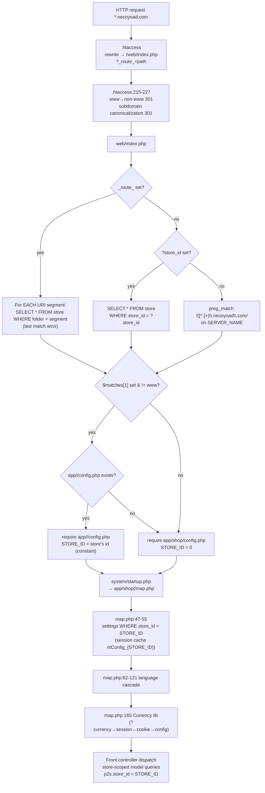
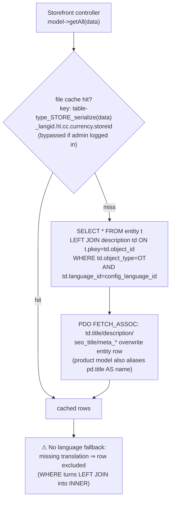
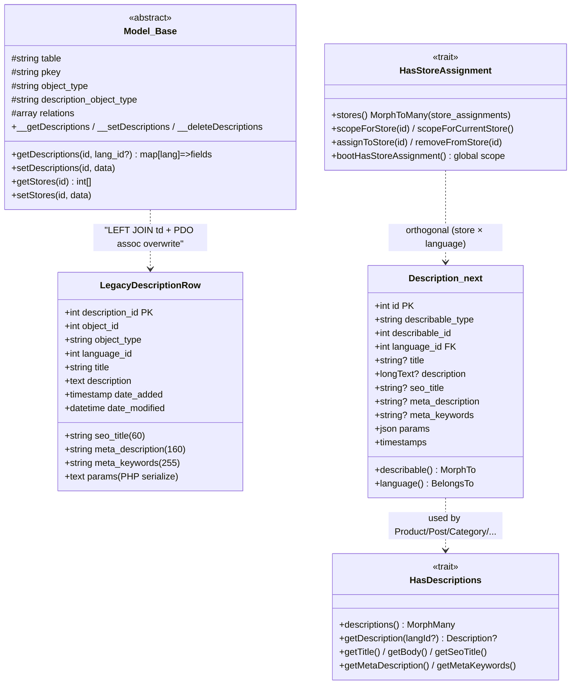
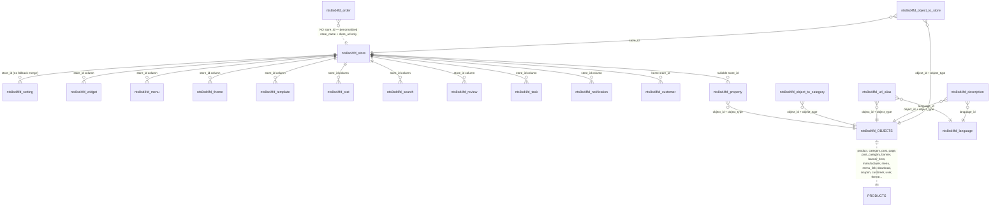
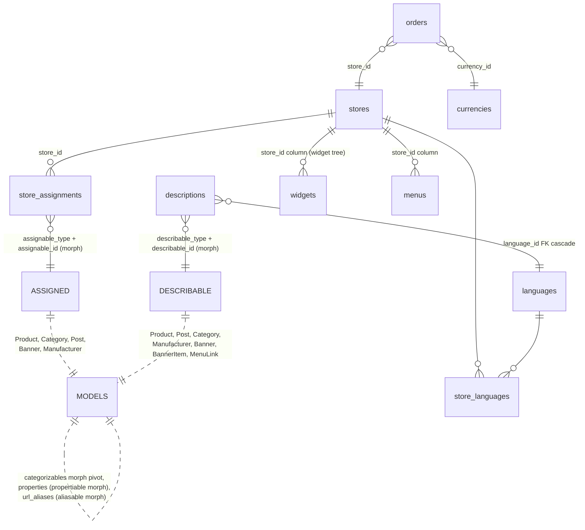
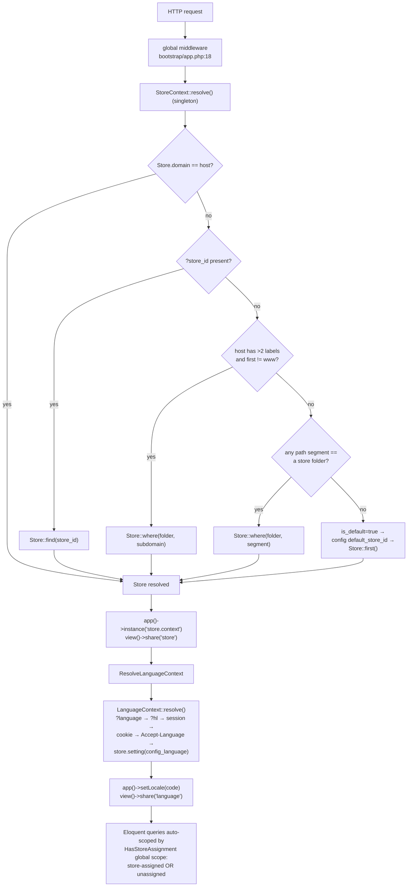
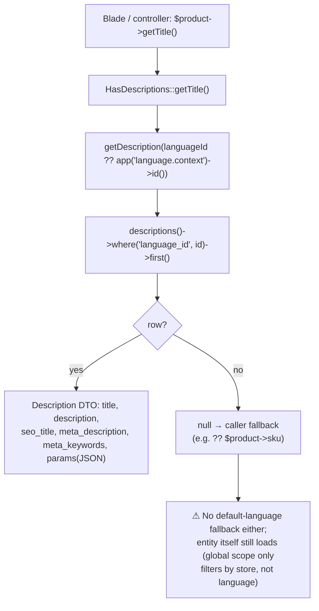

# 9 · Multi-Store & the Descriptions DTO

> Necoyoad is a **tenant platform**: one installation serves many stores, resolved by subdomain
> (`store.necoyoad.com`), URL folder (`/storecode/...`), or `?store_id=`. Content is localized
> through a polymorphic **`description` DTO** (one row per entity × language). This chapter maps
> tenant resolution, store-scoped data, and the description pipeline in both stacks. Companion PDF:
> blueprint v5; appendix: [`appendix-research/3b3-multistore-dto.md`](appendix-research/3b3-multistore-dto.md).

## 9.1 Legacy Store Resolution

- **`store` table** (L1252-1260): `store_id, owner_id, name, folder, status, dates` — **no
  `domain` column** (the folder doubles as the subdomain label), no `is_default` (store 0 is the
  de-facto default). The dump has zero rows.
- `web/index.php`: folder probing (every `/`-segment probed, **last match wins**) → `?store_id=`
  (`elseif` — **ignored on SEO/routed URLs**) → subdomain regex
  `preg_match('/([^.]+)\.necoyoad\.com/', SERVER_NAME)` → `app/{folder}/config.php` if it exists,
  else `app/shop/config.php`.
- **`STORE_ID` is a compile-time constant** in the per-app config: `app/shop/config.php:4` → `0`;
  `app/admin/config.php:10` → `0` (admin always store 0); **`app/m/config.php:3` → the string
  `'9'`** (mobile app = store 9, reusing shop controllers via `$privatePath`).
- `.htaccess:215-227` canonicalization: www→non-www 301 + subdomain 301 (both emit scheme-relative
  `//host/...` targets).

## 9.2 Per-Store Settings & Scoping

- **`setting` table** `(store_id, group='config', key, value)` — `map.php:47-55` loads **store 0
  only** (or the whole `Config` object from session `ntConfig_0`, written back at :323).
  **No store-0 fallback / no default+override merge** — each store must carry a complete settings set.
- **17 tables carry a `store_id` column**: customer, menu, notification, object_to_store,
  order_payment, product_attribute, property, review, review_likes, search, setting, stat, store,
  task, template, theme, widget. ⚠ **`order` has NO store_id** — only denormalized
  `store_name`/`store_url` snapshots.
- Everything else (products, categories, posts, pages, banners, manufacturers…) is scoped through
  the **`object_to_store`** pivot (`UNIQUE(object_id, object_type, store_id)`; store 0 = "Default"
  checkbox in admin). `Model::__setStores` (:1086-1116) DELETE-then-REPLACE; auto-wired in
  add/update/copy; `buildSQLQuery` LEFT-JOINs the pivot when `stores ∈ $relations` and `$data
  ['store_id']` is present (empty → defaults to STORE_ID).
- **Store CRUD + per-store app generator** (`app/admin/controller/store/store.php`): slug
  validation (accent-strip, reserved words), `createStandardApp()` → `createFolder()` (mkdir
  `app/<folder>` + `web/<folder>`), optional `copyFiles()` (recursive copy of `app/shop` + assets —
  standalone app mode), `createConfig()` from `system/config/config_shared.txt` /
  `config_custom.txt` templates with **`%folder% %store_id% %admin_path% %package% %version%`
  placeholders** → writes `app/<folder>/config.php` + `web/<folder>/index.php`.

## 9.3 The Description DTO (Legacy)

**`nts8sd4fd_description`** (L452-465): `description_id, object_id, object_type, language_id,
title(255), description(text), seo_title(60), meta_description(160), meta_keywords(255), params,
dates` — a polymorphic + language-keyed DTO. **No unique key on (object, type, language)**
(dupes prevented only by delete-then-insert code). The edit-form `keyword` is NOT stored here — it
lives in `url_alias` (same addressing shape).

**Model API** (`system/engine/model.php`):

- `__getDescriptions` (:1193-1228) — criteria type + id (+ optional language); reshapes rows to
  `[language_id => [language_id, title, description, seo_title, meta_keywords, meta_description]]`;
  then queries `url_alias` with the same criteria and merges `keyword` per language.
- `__setDescriptions` (:1280-1348) — per language: delete-then-INSERT (UPDATE branch commented
  out); `params` PHP-serialized; **if `keyword` → `REPLACE INTO url_alias (language_id, object_id,
  object_type, query='object_type=ID', keyword)`**.
- Wrappers use `$this->description_object_type ?: $this->object_type` — banner → `banner_item`,
  menu → `menu_link` (child-type descriptions).
- CRUD auto-wiring: add :322, update :415, copy :481, delete :548-563.

**The read path — LEFT JOIN + row merge:**

`buildSQLQuery:834-837` LEFT-JOINs `description td` + `WHERE td.object_type = X`; language criteria
only when `$data['language_id']` isset (not set → rows duplicate per language, `GROUP BY t.pkey`
picks an arbitrary one). Because the language filter sits in the WHERE clause, the LEFT JOIN
behaves as INNER: **an entity lacking a description in the current language vanishes from
listings** — there is **no default-language fallback anywhere in the legacy read path**. The merge
itself is `SELECT *` + `FETCH_ASSOC` — description columns **overwrite** entity columns (last-wins);
the storefront product model also aliases explicitly (`pd.title AS name`, …).

**Entities with descriptions (object_type catalog):** product, category, post_category, post, page
(same `post` table), manufacturer, banner + banner_item, menu_link, download, review, coupon,
newsletter, campaign, theme + localisation tables (country, currency, zone, length/weight class,
stock_status, order_status, order_payment_status).

**Language negotiation** (`map.php:62-121`): `?language=` → `?hl=` → session → cookie →
`HTTP_ACCEPT_LANGUAGE` (split on `,`, matched against each language's `locale` comma-list, **last
match wins**, no q-values) → `config_language`; persisted session + cookie. Only
`app/shop/language/spanish/**` ships; `Language::load` falls back to the `spanish/` directory.
Admin has no cascade — the `config_admin_language` setting. Language-create clones all description
rows into the new language; language-delete removes them.

## 9.4 DTO Class Diagram

## 9.5 Store-Scoped ER

### 9.5.1 Legacy

### 9.5.2 necoyoad-next

## 9.6 necoyoad-next — StoreContext + HasDescriptions

### 9.6.1 Store & language resolution

- **`StoreContext`** (per-request singleton): `resolve()` memoized — ① exact `stores.domain` match
  (new concept, highest priority) → ② `?store_id=` → ③ subdomain (>2 host labels, non-www →
  `folder` match; generalizes the legacy necoyoad.com regex) → ④ path segment matching a folder
  (**does NOT consume the segment** — would need `Route::prefix('{store?}')`, not implemented) →
  ⑤ fallback `is_default` → `config('necoyoad.default_store_id')` → `Store::first()`. Accessors:
  `id()/model()/folder()/setting($key, $default)` → `Store->settings` JSON (replacing ~200 legacy
  `config_*` rows with one JSON blob). No cache layer.
- **Middleware** (global, in order): `ResolveStoreContext` (bind + `view()->share('store')`) →
  `ResolveLanguageContext` (bind + `app()->setLocale` + share). `StoreNotResolvedException` (503)
  exists but is **never thrown**.
- **`LanguageContext`**: 6-level cascade mirroring legacy — `?language=` → `?hl=` → session →
  cookie → `Accept-Language` (improved: strips q-values, first match breaks) → store setting;
  final fallback `$languages->first() ?? new Language(['id'=>1,'code'=>'en'])`; persists session +
  30-day cookie.
- **`HasStoreAssignment`** trait — pivot `store_assignments` (morph `assignable`, UNIQUE per
  store×entity): **global scope `whereHas('stores', id) OR orDoesntHave('stores')`** —
  assigned-to-current-store OR unassigned (= global) content is visible; a deliberate semantic
  change from legacy store-0-default. Used by Banner, Category, Manufacturer, Post, Product.
  Admin bypass: `NecoyoadResource::getEloquentQuery()` → `withoutGlobalScope('store')`.
- **`Store` model + Filament StoreResource**: name/folder(unique)/domain/is_default/status +
  **Settings tab = KeyValue JSON editor**; `store_languages` pivot (per-store language subset).
- **Multi-currency:** `Currency` model (code/symbol/decimal_place/value decimal(15,8)) + seeder
  (USD 1.0, VES 36.5, EUR 0.92) — **no conversion layer ported** (`?cc=`/session/cookie cascade
  and `format()/convert()` gone; product-list blade prints the global default code + unconverted
  price). `orders` persist `store_id` + `currency_id` FKs — data model ready, runtime conversion is
  a gap. Legacy `Currency` lib cascade: `?currency=` → session → cookie → `config_currency`; the
  real `?cc=` switch is a header-controller redirect.
- **Seeders** — 5 demo stores: Necoyoad Demo (default, USD/en), TechWorld, Moda Latina (VES/es),
  Home & Garden (EUR/en), Gadgets Pro — each with 5 customers, 3 categories, 5 products, 1 page +
  2 posts, 1 banner (3 slides), 1 menu (4 links), widget tree, contacts, newsletter; passwords all
  `password`.

### 9.6.2 Description resolution

- **`Description` model**: `describable` morph + `language_id` FK + title/description/seo_title/
  meta_description/meta_keywords/params (JSON cast); migration has
  **UNIQUE(describable_type, describable_id, language_id)** — fixes the legacy duplicate hole;
  **no store_id** (localization orthogonal to tenancy).
- **`HasDescriptions`**: `descriptions(): MorphMany`; `getDescription(?lang)` — single-language
  fetch (language context default), **no fallback chain** (null if missing; callers do `?? sku`);
  helpers `getTitle/getBody/getSeoTitle/getMetaDescription/getMetaKeywords`.
- **Morph map** reuses legacy object_type strings ('page' → Post::class) for 1:1 data migration.
- **Filament consumption** (`NecoyoadResource::sharedTabs()`): **Descriptions tab** =
  `Repeater::make('descriptions')->relationship()` per language (language_id select, title,
  description, SEO fields) — the direct descendant of legacy per-language `
`
  tabs; **Stores tab** = multi-select ("Leave empty for all stores"); **SEO tab** = keyword.
- Storefront: route-model binding + global scope → cross-store deep links 404; `getTitle() ??
  $product->sku`; search queries descriptions via whereHas; CartDrawer eager-loads descriptions
  filtered by LanguageContext; cart = `session('cart')` — **not store-scoped** (quirk preserved
  from legacy, where the cart key uses install-wide `C_CODE`).

## 9.7 Legacy ↔ Next Mapping

| Concern | Legacy | Next |
|---|---|---|
| Store identity | `store` (folder only) | `stores` + domain + is_default + settings JSON |
| Resolution | folder-probe / `?store_id=` / subdomain regex / app-config require | domain / `?store_id=` / subdomain / path segment / default fallback |
| STORE_ID | PHP constant | `StoreContext` singleton |
| Settings | `setting` rows per store, session-cached, no merge | `stores.settings` JSON via `setting()` |
| Store CRUD | controller + file generator (.txt templates) | Filament StoreResource, no codegen |
| Store pivot | `object_to_store` (store 0 = default) | `store_assignments` morph; unassigned = global (scope) |
| Assignment UI | `stores[]` checkbox scrollbox | Filament multi-select shared tab |
| Descriptions | `description` + `url_alias`, delete+INSERT, LEFT-JOIN overwrite merge | `descriptions` morph (UNIQUE), `updateOrCreate`, explicit relation |
| Language fallback | none (entity hidden) | none (null field, entity still loads) |
| Language detection | 6-level map.php cascade | 6-level LanguageContext (q-values fixed) |
| Currency | Currency lib + `?cc=` + convert/format | model only; **conversion not ported** |
| Cart | not store-scoped (C_CODE) | not store-scoped (session) |
| Order↔store | denormalized store_name/url | `orders.store_id` + `currency_id` FKs |
| Cache keys | store×lang×currency | `widgets:{store}:{lang}:…` only |

## 9.8 Verified Defects (selection)

**Legacy:** `saveContent()` bulk-assignment SQL is broken (non-existent columns on 3 blocks; 7
blocks omit `store_id` → rows land on store 0; per-block DELETEs wipe other types' assignments);
store-delete references 10 phantom `*_to_store` tables; no settings fallback merge; `?store_id=`
ignored on SEO URLs; folder probe scans all segments; hard-coded necoyoad.com; `STORE_ID='9'`
string in app/m; no unique index on description(object, language); language-missing ⇒ entity
invisible; `SELECT *` column collisions (description overwrites `date_modified`/`params`); order
lacks store_id; cart/customer not store-scoped.

**Next:** no currency conversion; `StoreNotResolvedException` never thrown; path-segment strategy
doesn't consume the segment (404 risk); no language fallback in HasDescriptions; cart not
store-scoped; `store_languages` pivot not enforced by LanguageContext; Menu keeps a legacy
`store_id` column while siblings use the morph pivot (mixed mechanisms); singleton contexts capture
the request at first resolution (Octane caveat).

---

Next: [Chapter 10 — Caching & Rendering](10-caching-rendering.md) · [Back to index](README.md)
