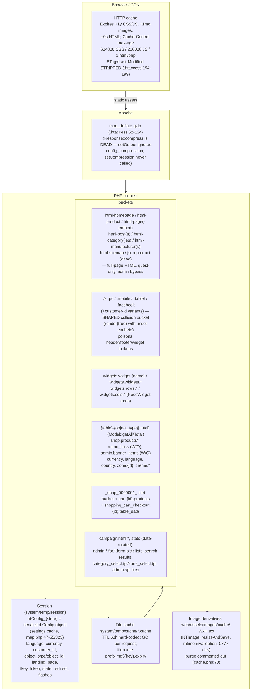
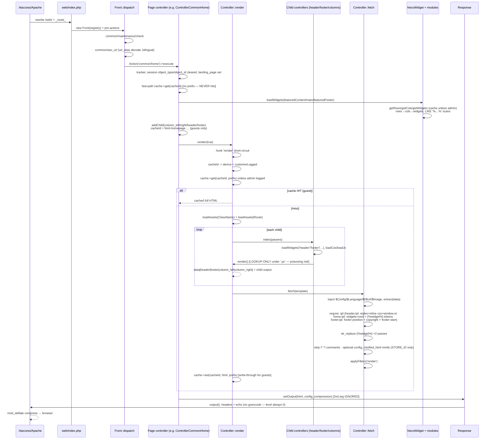
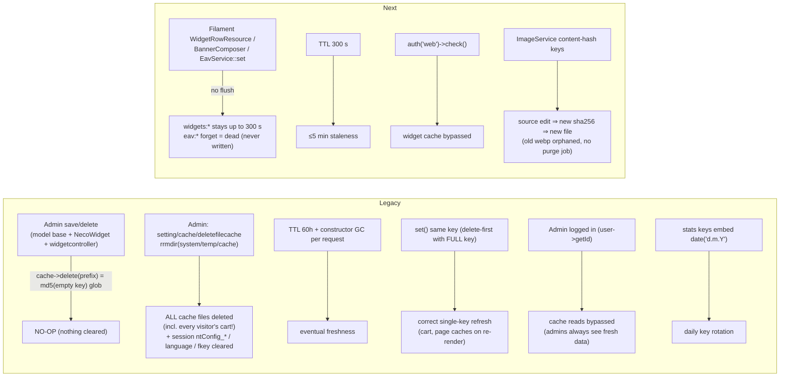
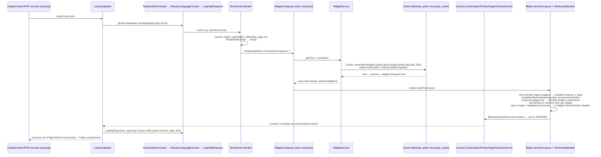

# 10 · Caching & Rendering — Layers, Bugs and the Pipeline

> The caching story spans five layers (browser HTTP cache, Apache compression, session config
> snapshots, the file cache with TTL-in-filename, and the GD image derivative cache) — and includes
> one **systemic cache-poisoning bug proven by production artifacts**. The rendering story is the
> full page assembly pipeline from dispatch to gzipped output. Companion PDF: blueprint v3;
> appendix: [`appendix-research/3b4-caching-rendering.md`](appendix-research/3b4-caching-rendering.md).

## 10.1 The Cache Class (`system/library/cache.php`, 127 lines)

- **File driver**: `system/temp/cache/`, one file per entry:
  `<sanitizedPrefix>.<md5(key)>.<expiry>.cache`. Payload = plain `serialize($value)`.
- **TTL hard-coded 60h** (`$this->expire = 60*3600`, L14) — no per-entry TTL API. The expiry
  timestamp is **in the filename**; garbage collection runs in the constructor on **every request**
  (glob all `*.cache`, unlink expired) — the only expiry enforcement; `get()` never checks age.
- `set()` does delete-first then `fopen('w')` write — **no locking/atomic rename** (torn reads
  self-heal as misses because `unserialize()` failure → `false`).
- `unserialize()` **without `allowed_classes`** — object-injection surface (widget settings
  legitimately contain `O:8:"stdClass"`).
- **The `delete()` no-op bug**: `delete($prefix)` with empty key globs
  `<prefix>.md5('')=d41d8cd98f00b204e9800998ecf8427e*.cache` — **matches nothing ever written →
  every prefix-style delete in the app is a silent no-op.** Only full-key deletes work (the Cart
  does this correctly).
- `sanitizeCacheId()` slugs prefixes (`widgets.rows.0` → `widgets-rows-0`). Device suffixes
  (`.mobile/.tablet/.facebook/.pc`) apply only if `file_exists('browser.php')` in CWD — never true
  → **no device suffixes in practice**.

## 10.2 Production Cache Artifacts (proof)

13 real files from `www.mudancer.com` (all expire 2025-11-02):

| Artifact | Identified as | Content |
|---|---|---|
| `1af03898…` | md5('currency') | 2 currency rows (VEB, 'es') |
| `8512ae7d…` | md5('language') | Español language row |
| **`206392ad…`** | **md5('.pc')** | **a complete rendered `error/not_found` page (20 KB)** — see §10.3 |
| `shop-0000001.140e…` | prefix sanitize(`_shop_0000001_`) | **an empty guest shopping CART stored in the file cache** |
| `widgets-rows-0.bdfb24…` | NecoWidget getRows | full nested header tree (row → 3 columns → widgets) |
| `widgets-cols-0.bcc6c…` | NecoWidget getCols | the 3 header columns standalone |
| `widgets-widgets-shop-header-error-not_found-0.*` | getWidgets | per-column widget lists for the 404 landing page |

## 10.3 ⚠ The `.pc` Shared-Collision Bucket (critical, artifact-proven)

`Controller::render()` (:216-234) **appends** the device + `customer->isLogged()` suffix to
`$this->cacheId` even when it is NULL: guest key = `'.pc'`, logged = `'.pc<customer_id>'`. Lookup
runs whenever cacheId is non-empty and admin is not logged; **write only `if ($return)`**.

- **Readers (every guest page):** `common/header.php:262`, `footer.php:141`, `column_left/right`,
  `modulecontroller.php:270` call plain `render()` → they all `Cache::get('.pc')`.
- **Writers:** any `render(true)` *without* a controller-set cacheId dumps its **entire output**
  into `.pc` — error paths of page/category/product/manufacturer, **all `account/*` pages**,
  maintenance, header dropdown fragments, async widget HTML.
- **Consequence:** last writer wins for 60 hours. The md5('.pc') artifact **is a full 404 page** →
  after one 404 hit, every guest page's header child (and sync widgets) renders that entire 404
  page until the bucket is overwritten or expires. A systemic cross-controller cache-poisoning bug.

## 10.4 The Cache Layers

**Consumer catalog (key patterns):**

| Subsystem | Key | TTL | Invalidation |
|---|---|---|---|
| Settings | session `ntConfig_{store_id}` (whole Config object) | session lifetime | admin cache manager only |
| Full pages (guest) | `html-homepage.{lang}.{hl}.{cc}.{cust}.{currency}.{store}`, `html-page{,-embed}.*`, `html-post(s)`, `html-categor(y|ies)`, `html-product.{id}`, `html-manufacturer(s)`, `html-sitemap` | 60h | none (prefix deletes are no-ops) |
| Model base | `{table}-{object_type}` + `STORE_ID.serialize($data).lang.hl.cc.currency.store` (+`-total`) | 60h | no-op purges; admin read-bypass |
| Widgets | `widgets.widget.{name}`, `widgets.widgets.{app} {pos} {lp} {store} {ot} {oid}`, `widgets.rows/cols.…` | 60h | no-op |
| Menus | `menu_links[.total]` | 60h | **write-only — never hits** (get-with-prefix vs set-without-prefix) |
| Banner items | `admin.banner_items` | 60h | write-only |
| Localisation | `currency`, `language`, `country`, `zone.{id}`, `theme.all.active.for.store.{id}` | 60h | never |
| Cart | prefix `_shop_{C_CODE}_` key `<customer\|session>_shop_{C_CODE}_cart`, `cart.{id}.products`, `shopping_cart_checkout.{id}.table_data` | 60h | **`removeCartCache()` — the only correct invalidation in the whole app** |
| Search | `products_searched`, `total_/criteria_/url_products_searched` | 60h | none (stale search results) |
| Campaigns | `campaign.html.{id}[.{contact_id}]`, `.temp` bodies | 60h | overwrite |
| Stats | date-rotated keys (`…date('d.m.Y')`) | daily by key | hand-rolled daily rotation |
| Admin pick-lists | `products.for.store.form.{id}` etc. | 60h | none |

**Admin cache manager** (`app/admin/controller/setting/cache.php`): `index()` is a placeholder
(`echo 'build cache manager'`); **`deletefilecache()` = recursive `rrmdir(DIR_CACHE)`** — nukes
everything **including every visitor's cart** — plus session `ntConfig_*`/`language`/`fkey` clears.

## 10.5 HTTP Caching & Compression

- `.htaccess:147-199`: Expires default +1 month; images/fonts +1 month; **CSS/JS +1 year**;
  Cache-Control images 2592000 public, **CSS 604800** (contradicts the 1-year Expires), **JS
  216000**, html/php `max-age=1 private must-revalidate`; **ETag + Last-Modified stripped,
  `FileETag None`** — no conditional revalidation at all. `mod_deflate` does compression.
- **`Response::setOutput($output)` takes ONE parameter** — every caller's second arg
  (`config_compression`) is silently discarded; `setCompression()` is never called →
  `compress()`/`gzencode()` (response.php:24-52) is **dead code**. Gzip happens only in Apache.
- `Json::encode` sends `Cache-Control: no-cache, must-revalidate`.

## 10.6 The Rendering Pipeline (legacy)

Stages: dispatch → pre-actions (maintenance, seo_url decode) → controller index (tracker, session
widget context, dead fast-path cache get, `loadWidgets` × positions, addChild
column_left/right/header/footer, cacheId) → `render(true)`: hook → key decoration → cache lookup →
`loadAssets(ClassName + Route)` → **children loop** (each child runs its own loadWidgets +
loadCss/loadJs + lookup-only render; output → `data['header'|'footer'|'column_left'|'column_right']`)
→ `fetch()` (magic services injection; extract; require tpl; two-pass `` substitution;
comment-strip + optional `config_minified_html` minify; `render` filter) → cache write-back →
`Response->output()`.

**Script buckets** (footer.php:84-124): Registry `scripts` bucketed by `method` — `function` (raw),
`script` (raw), `ready` (`$(function(){…})`), `window` (`$(window).load`); footer-start.tpl emits
external `$javascripts`, the bucket block, **late CSS injected via jQuery** + UItoTop.
Inline modes: `config_render_js/css_in_file` inline the files (with the controller.php:798
processcss bug that discards the read CSS).

**SEO URL layer** (encode/decode asymmetry): decode = `common/seo_url` pre-action (api passthrough,
`buscar|search` → store/search, store-folder strip, per-segment `url_alias` lookup **without
language filter**, bilingual magic routes, `<profile-slug>/pedidos|mensajes|pagos|comentarios`,
unknown → 404); encode = `Url::createUrl/rewrite` per-param `url_alias` lookups **with language
filter**, category path walking, fixed rewrites — **no memoization (N+1 per emitted link)**.

**Image pipeline:** `Image`/`NTImage` (GD): letterbox resize with `IMAGE_BG_COLOR_*` fill,
crop/rotate/watermark; `resizeAndSave()` derivatives at
`web/assets/images/cache/<name>-<W>x<H>.<ext>` with **mtime-based invalidation**, mkdir 0777,
optional static watermark; `common/home::getimage` streams the ORIGINAL image although the resized
derivative was computed (bug); derivative purge is commented out.

## 10.7 The Invalidation Map

## 10.8 necoyoad-next — Caching & Rendering

- **Cache store**: `config/cache.php` default file, prefix `necoyoad_cache`; docker-compose sets
  `CACHE_STORE=redis`/`SESSION_DRIVER=redis` while `entrypoint.sh:32-39` force-writes `.env` to
  file ("CRITICAL" comment) — under compose the effective store is **Redis**; the entrypoint also
  deletes `bootstrap/cache/{config,routes,events,views}.php` every boot → **no production
  config/route caching**. Caddy handles compression (zstd/gzip).
- **Every `Cache::` usage**: (1) `WidgetService:144-153` —
  `Cache::remember("widgets:{store}:{position}:{lang}:{route}:{ot}:{oid}", 300)` — TTL hard-coded
  (`widget_cache_ttl` config ignored); never invalidated on write (≤5-min staleness); the key
  **omits the device/customer-session dimensions the query filters on** → cross-context
  collisions. (2) `EavService:107` — dead `Cache::forget('eav:…')`. No full-page cache, no HTTP
  cache middleware.
- **Assets**: single Vite entry (app.css/app.js); storefront layout wraps Vite in try/catch
  (manifest missing → assets silently skipped); `public/` ships **only index.php** — the Vite
  bundle was never built and AssetManifest-enqueued widget assets don't exist (404) ⇒ pages render
  without their CSS/JS. Vite assets are content-hashed; AssetManifest paths unversioned.
- **Livewire rendering**: CartDrawer keeps the cart in the Laravel **session** (vs legacy file
  cache) with `addToCart` events; ProductPage dispatches `addToCart …->to(CartDrawer::class)`;
  CheckoutForm snapshots the session cart into an Order. Consequence: all pages are
  session-varying → **no full-page cache possible**; only the 5-min widget cache exists.
- **HTTP/audit**: `LogHttpResponse` audits responses with status <200 or ≥400 to the `audit`
  channel (30-day retention) — no response timing; only other headers: tracking-pixel
  `no-cache` + widget-async `X-Widget-Styles/-Scripts`.
- **ImageService** (Intervention Image v3, GD/Imagick): thumbnails at
  `storage/app/public/media/cache/{sha256(source)}-{W}x{H}-{mode}.webp` — **content-hash
  invalidation**, WebP q80, EXIF orientate, 5 resize modes, audit + `ImageProcessingException`;
  no purge job for hash-named derivatives (a daily `images:clean-cache` scheduler entry exists in
  `routes/console.php`).

## 10.9 Legacy ↔ Next Mapping (headline)

| Concern | Legacy | Next |
|---|---|---|
| Page cache | full-page file cache (guest-only, 60h, poisoned `.pc` bucket) | none (session-varying Livewire) |
| Widget cache | NecoWidget rows/cols caches (60h, no-op invalidation) | `Cache::remember` 300s (admin bypass) |
| Settings cache | whole Config in session | none (per-request `Store->settings` JSON) |
| Cache store | files only | file/redis (compose: redis) |
| Compression | Apache mod_deflate (Response::compress dead) | Caddy zstd/gzip |
| HTTP cache | Expires/Cache-Control, ETag stripped | Caddy defaults for statics only |
| Image cache | GD derivatives, mtime invalidation | Intervention derivatives, sha256 invalidation, WebP |
| Cart storage | file cache (nuke-on-clear risk) | Laravel session |
| Invalidation | prefix deletes (no-ops), manual nuke, TTL | TTL only |
| Audit | user_activity table, php:error log | AuditService 5 channels + browser beacon |

## 10.10 Verified Defects Register

**Legacy (17):** L1 `.pc` bucket poisoning (critical, artifact-proven) · L2 all prefix deletes
no-op (60h staleness) · L3 write-only cache families (the menu cache never worked) · L4 dead
fast-path gets · L5 dead `Response::compress` · L6 stale ntConfig session snapshots · L7 cart in
file cache (nuke-on-clear, 60h) · L8 per-customer cache blowup · L9 unsafe unserialize · L10
GC-only expiry/non-atomic writes · L11 getimage serves the original · L12 .htaccess contradictions
+ ETag stripping · L13 currency/language/theme caches never invalidated · L14 image-cache purge
commented out/watermark path bug/0777 dirs · L15 session `clear()`/`has()` quirks · L16
date-rotated stats workaround · L17 dead json-product cache.

**Next (12):** N1 TTL config ignored · N2 widget cache key omits device/auth dimensions · N3 no
write invalidation · N4 dead EAV forget · N5 compose-vs-entrypoint cache-store contradiction · N6
no production config/route caching · N7 missing public assets (unstyled storefront) · N8
`loadForRoute` unwired · N9 no HTTP cache policy · N10 no full-page cache · N11 unpurged
media-cache · N12 audit lacks timing.

---

Next: [Chapter 11 — 186 Killer Features](11-100-killer-features.md) · [Back to index](README.md)
