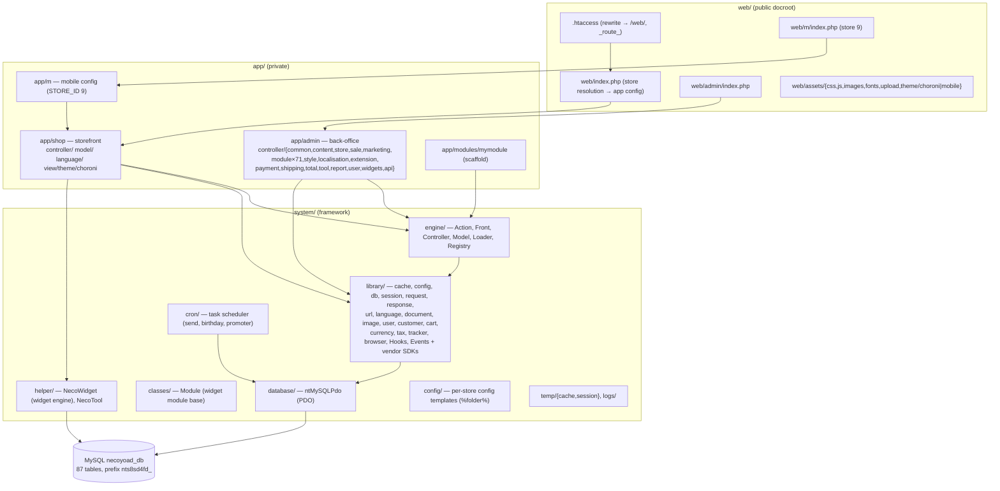

# Necoyoad — General Architecture & Homepage Request Stack (Research 2)

Repo: `/home/z/necoyoad` — legacy PHP multi-store e-commerce/CMS ("Necoyoad / NecoTienda Standalone", VERSION 1.0.2 storefront, 2.0.1 admin) + `necoyoad-next/` Laravel 11 rewrite.
Cross-referenced research: `research/3a2-widgets.md` (widget engine), `research/3a4-menus.md` (menus), `research/3b1-templates.md` (templates/render). Not re-derived here; cited where relevant.

---

## A) Homepage Request Lifecycle (legacy app), step by step

### A.1 `.htaccess` (repo root, 253 lines)

**Rewrite rules** (`.htaccess:201-214`):
```apache
<IfModule mod_rewrite.c>
  Options +FollowSymlinks
  Options -Indexes
  RewriteEngine On
  RewriteBase /

  RewriteCond %{REQUEST_URI} !^/web/
  RewriteRule ^(.*)$ /web/$1 [L,QSA]              # .htaccess:207-208  everything → /web/

  RewriteCond %{REQUEST_FILENAME} !-f
  RewriteCond %{REQUEST_FILENAME} !-d
  RewriteRule ^(.*)\?*$ index.php?_route_=$1 [L,QSA]   # .htaccess:210-212  non-file/dir → index.php?_route_=
</IfModule>
```
- Front-controller pattern: any path that is not an existing file/directory is mapped to `index.php` with `$_GET['_route_']`. Because the docroot is the repo root and everything is internally rewritten into `/web/`, the `index.php` resolved is `/web/index.php`.
- Note the `(?:.*)\?*$` suffix in the pattern — it also strips a trailing `?`/query fragment.

**Domain canonicalization redirects**:
- `.htaccess:216-220` — if not HTTPS and host starts with `www.`, 301-redirect to `https://%{HTTP_HOST}/$1` (non-www).
- `.htaccess:222-227` — if not HTTPS, host is NOT `necoyoad.com`, and host matches `^([^.]+).necoyoad.com`, 301 to `https://%1.%{HTTP_HOST}/$1` (subdomain form). I.e. `necoyoad.com` is the hard-coded canonical apex; other tenants live on subdomains.

**Security directives**:
- `.htaccess:229` `Options -MultiViews`; `.htaccess:231` `ErrorDocument 404 /index.php?r=error/404` (404s enter the app as route `error/404`).
- `.htaccess:235-237` `Options -Indexes` (via mod_autoindex).
- `.htaccess:239-243` deny requests whose SCRIPT_FILENAME is both a dir and a file beginning with a dot — effectively 403 dotfiles.
- `.htaccess:245-249` `<FilesMatch "(\.(tpl|bak|config|sql|fla|psd|ini|log|sh|inc|swp|dist)|~)$"> Order allow,deny / Deny from all` — blocks direct fetch of templates, configs, SQL dumps, logs, etc.
- `.htaccess:251-253` (mod_php5) `php_value session.cookie_httponly true`.
- No CSP/X-Frame-Options/etc.; the only "header security" is `X-UA-Compatible IE=Edge,chrome=1` (`.htaccess:1-7`) and CORS `Access-Control-Allow-Origin "*"` for images (`.htaccess:9-17`) and fonts (`.htaccess:19-23`).

**Performance directives**:
- MIME types for modern assets (`.htaccess:29-50`, incl. `svg`, `woff`, `webp`, `appcache`).
- **mod_deflate** (`.htaccess:52-134`): mangled-header Accept-Encoding normalization for proxies (Yahoo trick), then `FilterDeclare/FilterProvider COMPRESS DEFLATE` by content-type for html/css/js/json/xml/svg/fonts; legacy fallback `AddOutputFilterByType DEFLATE …` for old Apache.
- **mod_gzip** block (`.htaccess:136-145`, legacy servers).
- **mod_expires** (`.htaccess:147-175`): default `access + 1 month`; HTML/XML/JSON `+0 seconds`; RSS/Atom `+1 hour`; favicon `+1 week`; images/media/fonts `+1 month`; **CSS and JS `+1 year`**.
- **Cache-Control** headers (`.htaccess:176-192`): images `max-age=2592000 public`, CSS `max-age=604800`, JS `max-age=216000`, xml/txt `216000 must-revalidate`, html/php `max-age=1 private must-revalidate`.
- ETag/Last-Modified removed + `FileETag None` (`.htaccess:194-199`).
- Charset: `AddDefaultCharset utf-8` + `AddCharset utf-8 .css .js .xml .json .rss .atom` (`.htaccess:232-233`).

### A.2 `web/index.php` (85 lines) — the storefront front controller

| Step | Lines | What happens |
|---|---|---|
| Install guard | 2-4 | If `../install.php` exists it is `unlink()`-ed (self-cleaning leftover). |
| Silence errors | 6 | `error_reporting(0)`. |
| Package identity | 7-8 | `define('PACKAGE','standalone'); define('VERSION','1.0.2');` |
| Install redirect | 10-17 | If `../cconfig.php` missing → 302 to `install/index.php` (protocol is hard-coded `https://` in both branches). |
| DB bootstrap | 19-20 | `require_once cconfig.php`, then **`new mysqli(DB_HOSTNAME, DB_USERNAME, DB_PASSWORD, DB_DATABASE)`** — a raw mysqli handle used *only* for store resolution. |
| Store resolution — folder probing | 21-31 | If `$_GET['_route_']` set: split `$_SERVER['REQUEST_URI']` on `/`, and for **every** non-empty segment run `SELECT * FROM nts8sd4fd_store WHERE folder='<segment>'`; last matching folder wins (`$matches[1] = $store['folder']`). |
| Store resolution — `?store_id=` | 32-38 | Else if `$_GET['store_id']`: `SELECT * FROM …store WHERE store_id=(int)`, take `folder`. |
| Store resolution — subdomain | 41-42 | If no match so far: `preg_match('/([^.]+)\.necoyoad\.com/', $_SERVER['SERVER_NAME'], $matches)` — first label of a `*.necoyoad.com` host. |
| App config selection | 43-51 | If `$matches[1]` exists and != `www`: load `app/<subdomain>/config.php` **if it exists**, otherwise fall back to `app/shop/config.php`; no match at all → `app/shop/config.php`. This is how the `admin` subdomain and the `m` (mobile) subdomain select their app (and any per-store app folder). |
| Startup | 53 | `require_once(DIR_SYSTEM . 'startup.php')`. |
| App map | 56 | `require_once(dirname(__FILE__)/../../app/shop/map.php')` — always the **shop** map (note: even for the admin subdomain this file boots the shop map; the admin has its own entry at `web/admin/index.php`). |
| Front controller | 59 | `$controller = new Front($registry);` |
| Pre-action 1 — maintenance | 62 | `$controller->addPreAction(new Action('common/maintenance/check'))`. |
| Pre-action 2 — SEO URLs | 65 | if `config_seo_url` setting is truthy → `new Action('common/seo_url')`. |
| (stub) workflows/hooks/events | 67-70 | Commented-out TODO pre-actions `automation/workflows`, `automation/events`. |
| Router | 73-79 | If `$_GET['r']` (explicit route, e.g. `index.php?r=store/product&product_id=1`) → `new Action($request->get['r'])`; otherwise `new Action('common/home')` (the homepage). Also copies `$request->get['r']` into `$controller->ClassName` if unset. |
| Dispatch | 82 | `$controller->dispatch($action, new Action('error/not_found'))` — second arg is the error fallback action. |
| Output | 85 | `$response->output()` — emits headers + (optionally gzipped) body. |

### A.3 `cconfig.php` (11 lines) — installation constants

```php
define('CRYPT_KEY', "f89b0ccf-9149-4ef4-b728-53667fc4876e");  // app-wide crypto key (cookies, User ukey)
define('C_CODE', "0000001");                                  // customer/installation code
// DB
define('DB_DRIVER',   'ntMySQLPdo');    // only driver shipped (system/database/ntMySQLPdo.php)
define('DB_HOSTNAME', 'localhost');
define('DB_USERNAME', 'root');
define('DB_PASSWORD', '');
define('DB_DATABASE', 'necoyoad_db');
define('DB_PREFIX',   'nts8sd4fd_');
```

### A.4 `app/shop/config.php` (73 lines) — app constants

- Identity: `CATALOG='shop'`, `ADMIN='admin'`, **`STORE_ID=0`** (default store; note the mobile app `app/m/config.php` uses `STORE_ID='9'`).
- Path resolution: `$publictPath = <repo>/web/`, `$privatePath = app/shop/`, `$mainPath = <repo>/`.
- `$httpPath` derived from `HTTP_HOST . PHP_SELF` minus `/index.php` (strip `/web/` if present).
- Protocol: HTTPS detection checks `$_SERVER['HTTPS']` or `HTTP_X_FORWARDED_PROTO`; **both branches return `'https://'`** — the site is https-only by construction.
- HTTP URLs: `HTTP_HOME` (`https://<host>/`), `HTTP_ADMIN` (`…/<ADMIN>/`), `HTTP_IMAGE/CSS/JS/UPLOAD/DOWNLOAD` under `assets/…`, and theme URLs with the **`%theme%` placeholder**: `HTTP_THEME_CSS` = `HTTP_HOME . "assets/theme/%theme%/css/"`, `HTTP_THEME_JS`, `HTTP_THEME_IMAGE` (`images/`), `HTTP_THEME_FONT`. `HTTPS_*` mirror set (all https).
- DIR constants: `DIR_APPLICATION` (app/shop/), `DIR_MODEL`, `DIR_CONTROLLER`, `DIR_LANGUAGE`, `DIR_TEMPLATE` = `app/shop/view/theme/`, `DIR_MODULE` = `app/modules/`, `DIR_ADMIN_APPLICATION` = `app/shop/../admin/`.
- Shared public paths: `DIR_IMAGE`, `DIR_CSS`, `DIR_JS`, `DIR_UPLOAD`, `DIR_DOWNLOAD` → `web/assets/…`; `DIR_THEME_CSS/JS/IMAGE` with `%theme%` placeholders.
- System paths: `DIR_SYSTEM` = `<repo>/system/`, `DIR_DATABASE`, `DIR_CONFIG` (`system/config/`), `DIR_CACHE` = `system/temp/cache/`, `DIR_SESSION` = `system/temp/session/`, `DIR_LOGS` = `system/logs/shop/`.
- `define('NTS_DEBUG_MODE', false);` — gates the debug error handler in startup.php.

### A.5 `system/startup.php` (169 lines) — framework bootstrap

| Lines | What happens |
|---|---|
| 4-8 | `require library/automation/hooks.php` + `library/automation/events.php`; `global $hooks; $hooks = new Hooks("mainstream");` — a WordPress-style filter/action system (see B inventory). |
| 11-46 | **Error handler**: only if `NTS_DEBUG_MODE===true` — sets `display_errors=1`, `error_reporting(E_ALL)`, registers `error_handler()` that maps errno→label, echoes message, and `Events::emit("php:error")` + `Events::emit("error")`. In production (`else`) display_errors off and *no* handler. |
| 50-51 | `require library/session.php; $session = new Session();` — session started early (Session class re-points `session.save_path` to `DIR_SESSION` and sets a `nts_token` cookie bound to the parent domain). |
| 54-56 | Stale version gate: `exit('PHP5.1+ Required')` if `phpversion() < 5.1.0` (see D for the *real* minimum). |
| 59-73 | Legacy `register_globals` sanitization. |
| 76-94 | Legacy `magic_quotes_gpc` stripslashes cleanup. |
| 96-98 | Default timezone UTC when `date.timezone` unset. |
| 101-120 | IIS compat: synthesize `DOCUMENT_ROOT` / `REQUEST_URI`. |
| 123-128 | **Engine load**: `require engine/action.php, controller.php, front.php, loader.php, model.php, registry.php`. |
| 130 | `Events::emit("engine_load", true)`. |
| 133 | `require classes/module.php` (Module base class for widget modules). |
| 136-145 | **Common library load**: `cache.php, config.php, db.php, document.php, language.php, log.php, request.php, response.php, url.php, image.php`. |
| 147 | `$hooks->run('init')` — first extension point of the request. |
| 148-150 | Registers a no-op `processcss` filter (plugin seam). |
| 153-169 | Commented-out examples showing the intended extension API: `Events::on("dispatch")`, `$hooks->addAction("fetch")`, `$hooks->addFilter("query")`. |

### A.6 `app/shop/map.php` (329 lines) — Registry bootstrap (read in full)

1. **Registry + core services** (3-16): `$registry = new Registry();` `$loader = new Loader($registry);` `$config = new Config();` `$db = new DB(DB_DRIVER,…)` (DB wraps driver `ntMySQLPdo`); `$request = new Request();` `$response = new Response();` `$controller = new Front($registry);` (this instance is unused — index.php creates its own).
2. **Hook/event emission** (18-27): `$hooks->run('system_load', [db, loader, registry])` and `Events::emit("system_load", …)`.
3. **CSRF fkey** (30-43): if session lacks `fkey`, build `md5(REMOTE_ADDR) . "." . 11×md5(mt_rand(1000000,9999999)) . "_" . strtotime(date('d-m-Y'))`; register as `fkey` in Registry (used by forms as CSRF token; not the same as session `token`). `$hooks->run('csrf_load', $session)`.
4. **Settings load with per-store session cache** (47-55): if session lacks `ntConfig_<STORE_ID>` → `SELECT * FROM nts8sd4fd_setting WHERE store_id=0` and `$config->set(key,value)` for each row; **else** `$config = unserialize($session->get('ntConfig_'.STORE_ID))` — the whole Config object is round-tripped through the session (cache written back at line 323). Then `config_store_id` set. `hooks->run('config_load')` + `Events::emit("config_load")`.
5. **Response content-type** (60): `Content-Type: text/html; charset=utf-8`.
6. **Language detection cascade** (63-121):
   - Load all rows from `nts8sd4fd_language` into `$languages[code]` map (language_id, name, code, locale, directory, filename).
   - `$detect` from `HTTP_ACCEPT_LANGUAGE` (browser languages matched against comma-separated `locale` values).
   - Priority: `$_GET['language']` → `$_GET['hl']` → `session['language']` → cookie `language` → `$detect` (browser) → `config_language` (store default).
   - Persist to session + cookie; set `config_language_id` / `config_language`; `new Language($directory)` + `$language->load($filename)`; `hooks->run('language_load')`.
7. **Log** (124-131): `global $log; $log = new Log('log.txt'); $registry->set('log', $log);` plus an `Events::on("php:error")` listener that calls `$log->trace($error_msg)`.
8. **`Loader::auto()` preloads** (133-144): `url, user, customer, currency, tax, weight, length, cart, validar, encoder, browser, tracker` — each resolved by `Loader::auto()` (library → helper → model → language fallback order).
9. **Registry registrations** (146-156): `config, load, db, log, request, response, session, cache (new Cache()), document (new Document()), language, user (new User($registry))`; then `hooks->run('app_load')` / `Events::emit("app_load")`.
10. **App libs** (161-174): `customer (new Customer)`, `currency (new Currency)`, `tax`, `weight`, `length`, `cart`, `browser`, `tracker (new Tracker)`; plus empty arrays `javascripts`, `styles`, `scripts` registered for the asset pipeline.
11. **Referral tracking** (177-183): `?refby=` → `Customer::setRefByCustomer()`, `?ref=` → `setRefCustomer()`.
12. **Image background constants** (186-197): `IMAGE_BG_COLOR_R/G/B` from `config_image_bg_color_*` settings, defaulting to 255 (used by the image resize library).
13. **Device detection / theme switch / redirect** (199-234): `$loader->library('browser'); $browser = new Browser;`
    - Mobile: if `config_redirect_when_mobile` and current host ≠ `config_mobile_url` → 302 (or JS fallback) to `config_mobile_url`; else `config_template = config_mobile_template`.
    - Tablet: same pattern with `config_redirect_when_tablet` / `config_tablet_url` / `config_tablet_template`.
    - Facebook in-app browser: `config_redirect_when_facebbok` (sic) / `config_facebook_url` / `config_facebook_theme`.
14. **Shared language + model preloads** (237-246): `$language->load('common/header')`; `Loader::auto('account/customer')`, `store/product`, `store/category`, `localisation/language`, `localisation/currency`; `$registry->set('validar', new Validar());`.
15. **Route detection** (248): `$route = $_GET['_r_'] ?? $_GET['r']` lowercased — used for asset manifests.
16. **Currency override** (250-252): `?cc=` sets `config_currency`.
17. **Template preview** (255-257): `?template=<name>` switches `config_template` if `<name>/common/header.tpl` exists.
18. **Theme default** (259): `$tpl = config_template ?: 'choroni'`.
19. **Asset manifests (`deps.php`)** (261-321): if `web/assets/theme/<tpl>/js/deps.php` exists, include it and collect `$js_assets` / `$js_header_assets` / `$jsx_assets` whose route filter matches `$route` (array membership or `'*'`) into `javascripts` / `header_javascripts` / `scripts` (jsx scripts are inlined via `file_get_contents`). Same for `web/assets/theme/<tpl>/css/deps.php` with `$css_assets[asset]['css'|'routes']`. Leftover manifests registered as `js_assets`, `js_header_assets`, `jsx_assets`, `css_assets`; final arrays as `header_javascripts`, `javascripts`, `styles`, `css`, `scripts`. Whether files are referenced by URL or read from disk depends on `config_render_js_in_file` / `config_render_css_in_file`.
20. **Config session cache write-back** (323): `$session->set('ntConfig_' . STORE_ID, serialize($config));`.
21. **Final registrations** (325-329): `config` (re-set), `hooks` (global Hooks instance into Registry); `$hooks->run('load', $registry)` and `Events::emit("load", $registry)`.

### A.7 Dispatch internals (`system/engine/*`)

**`front.php` (61 lines, `final class Front`)**
- `addPreAction($pre_action)` (13-15) appends to `$pre_action[]`.
- `dispatch($action, $error)` (17-33): stores `$error` fallback; **pre-action loop** — executes each pre action in order, emits `Events::emit("dispatch", $pre_action)` after each; if a pre-action *returns* an Action, that becomes the new `$action` and the loop breaks (maintenance/seo_url use this to forward). Then `while ($action) { Events::emit("dispatch", $action); $action = $this->execute($action); }` — controllers may return another Action (forwarding chain) until null.
- `execute($action)` (35-60): reads `file/class/method/args` from the Action; sets `ClassName`, `Method`, `Route` in the **Registry** (these power `$this->Route` in templates and asset loading); if the controller file exists → `require_once`, `new $class($registry)`, and if `$method` is callable → `call_user_func_array([$controller,$method],$args)`; the return value becomes the next action. Missing file or un-callable method → the stored `$error` action (`error/not_found`), which is then cleared so only one error hop occurs.

**`action.php` (79 lines, `final class Action`)** — route string → controller file/class/method:
- Route `common/home` → explode on `/`, strip `../`.
- **Modules special case** (17-31): route `modules/<module>/<app>/<path>` shifts segments; base path becomes `DIR_MODULE . <module> . '/app/<app>/'` (e.g. `r=modules/mymodule/shop/home` → `app/modules/mymodule/app/shop/controller/home.php`).
- Directory walk (33-52): for each part, if `controller/<path>` is a directory → descend (first segment becomes a folder, e.g. `common/home` → `controller/common/home.php`); if a `.php` file matches → set `$this->file`, and `$this->class = 'Controller' . preg_replace('/[^a-zA-Z0-9]/','',$path)` (so `common/home` → class `ControllerCommonHome` in `app/shop/controller/common/home.php`).
- Method (54-60): next remaining segment, default `index`. So `common/home` = `ControllerCommonHome::index()`.
- Optional `$args` propagated via `getArgs()` (passed by `Action` constructor, used by `Controller::forward($route,$args)`).

**`loader.php` (187 lines, `final class Loader`)** — the service/asset locator:
- `__get/__set` proxy to Registry (so `$this->load->…` and `$controller->db` work through the same bag).
- `auto($route)` (19-29): tries `system/library/<route>.php` → `system/helper/<route>.php` → `model(<route>)` → `language(<route>)` — a poor-man's autoloader used heavily in map.php.
- `library($library)` (31-45): include `system/library/<library>.php`, emits `loader:library:load|fail` events; hard `exit()` with `<div class="msg error">` on failure.
- `controller($route)` (47-64): include + instantiate a controller class by route, returns instance (used for widget module controllers).
- `model($model, $return=false)` (66-91): includes `app/<app>/model/<model>.php`, instantiates `Model<name>`, registers under **two** keys: `model<LastSegment>` (e.g. `modelProduct`) and legacy `model_<path_with_underscores>`; emits `loader:model:load|fail`.
- `database(...)` (93-116): instantiates `DB` wrapper (unused in practice — map.php constructs DB directly).
- `helper($helper)` (118-133), `config($config)` (135-137, delegates to `Config::load` from `system/config/`), `language($language)` (139-141).
- `moduleModel($model,$path)` / `moduleLibrary($library,$path)` / `moduleLanguage(...)` (143-186): module-scoped equivalents (models under `<module>/model/`, vendor libs under `<module>/vendor/`).

**`registry.php` (20 lines, `final class Registry`)**: plain get/set/has over `private $data = []`; `set()` emits `Events::emit("registry:update", key, value)` when the Events class is available — the whole object graph (config, db, request, response, session, cache, document, language, user, customer, cart, currency, tax, tracker, hooks, fkey, ClassName/Method/Route, asset arrays, every model) lives here and is shared by reference with controllers/models via `__get`.

**`model.php` (1802 lines, `abstract class Model`)** — the ActiveRecord-ish base:
- Constructor (21-26): stores registry, builds `$namespace = "model:<table>:<object_type>"`, calls overridable `init()` (where models register their own hooks/events).
- Magic `__get/__set` (37-55) → Registry; `__call` (57-70) translates `getX/setX` into key access.
- Event/hook API on instances: `on/off/trigger` (122-166, delegates to `Events`), `addFilter/applyFilters` (178-209), `addHook/runHook` (221-251).
- Generic CRUD: `add(array $data)` (283), `update(int $id, array $data)` (369), `copy(int $id)` (458), `delete(int $id)` (531), `sortTable(array)` (613), private `__prepareUpsertSQL` (645), `getByID` (718), `getAll(array $data, array $options)` (736), `getAllTotal` (784), `buildSQLQuery(...)` (825, with `__getCriteriaSQL` 1061).
- EAV/multi-store/multi-language helpers (used by nearly every entity model): `getStores/__setStores` (1075/1086), `getCategories/__setCategories` (1127/1150), description CRUD `__getDescriptions/__deleteDescriptions/__setDescriptions` (1193/1241/1280) + public wrappers (1612-1646), property (EAV) CRUD `__getProperty/__getProperties/__setProperty/__deleteProperties/__setAllProperties` (1361-1539) + public wrappers (1713-1793), `__activate/__deactivate/__toggleStatus` (1540-1611), `setStores/setCategories/activate/deactivate` wrappers (1646-1712).
- Protected metadata each model declares: `namespace, table, pkey, object_type, description_object_type, fields, relations` (7-14) — the base class composes SQL from these declarations.

**`controller.php` (821 lines, `abstract class Controller`)** — summary (render/template internals covered by research 3b1):
- Constructor calls overridable `init()` (22-27). Magic `__get/__set` → Registry (29-35).
- `data` bag with `get/set` (37-47; `set()` runs the `data:update` filter and triggers the `data:update` event), `setvar()` (130-147) implements post→model→get→config→default resolution used by all form controllers; `getvar` (149).
- Event/hook delegation: `on/off/trigger` (57-83 → `Events`), `addFilter/applyFilters/addHook/runHook` (92-121 → global `$hooks`, namespaced by `$this->namespace`).
- `forward($route,$args)` (153-158) returns a new `Action` (used by pre-actions and controllers to chain); `redirect($url)` (160-176) honors a `redirect` hook, then `header('Location: …')+exit` or JS fallback.
- Children: `addChild($child,$params)` (178-189) + `getChild/getChildParams/getChildren` (191-201) — page sections rendered inside the parent template as `$header`, `$footer`, `$column_left`, `$column_right` variables.
- `render($return=false)` (203-316): runs `render` hook (can short-circuit); computes device-suffixed `cacheId` (`.pc/.mobile/.tablet/.facebook` + customer-logged flag, lines 216-234); optional full-page cache get (236-238); calls `$this->loadAssets($this->ClassName)` and `loadAssets($this->Route)` (241-247); **renders children first** (249-294: builds child `Action`, instantiates child controller, calls `$controller->index($params)`, captures `$controller->output` into `$this->data[$controller->id]`); then `fetch($tpl)` (298) with `beforeRender/afterRender` triggers; caches if `cacheId` set; returns or stores in `$this->output`.
- `fetch($filename)` (318-…): runs `fetch` hook; resolves template under `$this->templatePath` or `DIR_TEMPLATE`; `extract($this->data)` + `ob_start(); include $file; ob_get_clean()`; then **replaces `` tokens** with widget module outputs (the `` substitution, see research 3a2/3b1).
- `loadWidgets($position, $landing_page='all', $app='shop', $full_tree=true)` (453-715) and `loadAssets/_loadAssets` (717-822): widget tree loading + per-controller CSS/JS aggregation — full analysis in research/3a2-widgets.md.

### A.8 `common/home` controller + home template render output

**Controller `app/shop/controller/common/home.php` (`ControllerCommonHome`)**:
- `index()` (5-56):
  1. `$this->tracker->track(0, 'home_page')` — page-view tracking (line 7).
  2. If session `ref_email` without `ref_cid` → `data['show_register_form_invitation']=true` (9-11, referral landing).
  3. Cache key `html-homepage.<language_id>.<hl>.<cc>.<customer_id>.<currency>.<store_id>` (13-19); `$cached = $this->cache->get($cacheId)` (21).
  4. Clears session widget context: `object_type`, `object_id`, `landing_page` (23-25).
  5. If cached **and** guest → `$this->response->setOutput($cached, config_compression)` (28-29) — full-page cache hit, done.
  6. Otherwise: `document->title/description` from `config_title_<lang>` / `config_meta_description_<lang>` (31-32); `session['landing_page']='common/home'` (34); `loadWidgets('featuredContent')`, `loadWidgets('main')`, `loadWidgets('featuredFooter')` (35-37) — the three home positions; children `common/column_left`, `common/column_right`, `common/header`, `common/footer` (39-42); `cacheId` set only for guests (44-46); template = `default_view_home` setting or `common/home.tpl`, resolved under active `config_template` else fallback `choroni/` (47-52); `$this->response->setOutput($this->render(true), config_compression)` (54).
- `getimage()` (58-86): legacy image-resize endpoint (`?r=common/home/getimage&image=…&width=…&height=…`) using `NTImage::resizeAndSave`, streams file with `Content-type: image/<ext>`.

**Render output structure** — the final homepage HTML assembled from `choroni/common/home.tpl` + children:

```
<!doctype html>
<head> … opengraph, <base href=HTTP_HOME>, title/keywords/description/viewport,
      $styles links + inline $css, header-start fragment, window.nt.* JS config … </head>   ← common/header.tpl:1-80
<body nt-editable="1">
<div id="mainContainer" class="container">                       ← header.tpl:87 (closed in footer.tpl)
  <div id="headerContainer"><div id="header">                    ← header.tpl:90-96
      rows/columns of the 'header' widget position (widgets-rows.tpl)
  </div></div>
  <div id="contentContainer" class="tpl-home">                    ← home.tpl:4
    <div id="featuredContentContainer">  rows of 'featuredContent'  </div>   ← shared/widgets-featured.tpl + widgets-rows.tpl
    <div id="mainContentContainer"><div class="row">              ← home.tpl:9-10
       [column_left  large-3]  <div id="columnCenter"> rows of 'main' </div>  [column_right]   ← widgets-column-left/center/right.tpl
    </div></div>
    <div id="featuredFooterContainer"> rows of 'featuredFooter' </div>      ← home.tpl:33 / widgets-featured-footer.tpl
  </div>
  <div id="footerContainer">                                       ← footer.tpl
     <div id="footer"> rows of 'footer' position </div>
     <div id="copyright"> text_powered_by </div>
  </div>
</div>                                                              ← closes mainContainer
footer-start fragment (scripts), </body></html>
</body></html>
```

Widget row/column markup (`shared/widgets-rows.tpl`): each row = `<div data-row="…" data-position="…" class="row[ container][ classnames]" id="<position>_<row_id>" nt-editable>` with `unserialize()`-ed row settings (`sticky`, `layout_width=fixed`, `classnames`); each column = `<div data-column="…" class="large-<grid_large> medium-<grid_medium> small-<grid_small>" nt-editable>` (Foundation-grid classes); inside, `<ul class="widgets">` with one `<li>` **token** `` per widget (line 17) — later substituted by `Controller::fetch()` with the widget module output (wrapper contract `data-necotienda_module`, `nt-editable movable removable configurable`, `data-async`, transitions — see research 3a2).

Related children controllers: `common/header.php` (`ControllerCommonHeader::index` — hl/cc redirect handling, token, opengraph, theme_editor admin URLs when `?theme_editor=`, `loadWidgets('header','shop',true)`, `loadCss()`/`loadJs()` incl. inline-JS mode and `custom-<theme_id>-<tpl>.css`), `common/footer.php` (powered-by text + inline `moduleSearch()` JS), `common/column_left.php`/`column_right.php` (render only if the position has rows).

**Maintenance pre-action** (`app/shop/controller/common/maintenance.php:37-46`): if `config_maintenance` and the admin `User` is not logged in → `forward('common/maintenance')`, which renders a widget-driven maintenance page (same 3 positions + columns).

**SEO URL pre-action** (`app/shop/controller/common/seo_url.php`, active when `config_seo_url`):
- `api/*` routes (`api/live|google|twitter|facebook|meli`) are forwarded with parsed query (7-17).
- `buscar/…` / `search/…` prefixes → `store/search` with `q` (18-21).
- Splits `_route_` on `/`; a segment matching `nts8sd4fd_store.folder` is stripped (multi-store folder prefix, 41-45).
- Remaining segments matched against `nts8sd4fd_url_alias.keyword`; maps `product_id` / `category_id` (accumulates `path` with `_` separators) / `page_id` / `manufacturer_id` / `post_id` query params (47-91); unknown keyword → `r=error/not_found`.
- Hard-coded bilingual keywords: `sitemap`, `special|ofertas`, `blog`, `posts|articulos`, `pages|paginas`, `productos|products`, `categorias|categories`, `buscar|search`, `carrito|cart` → checkout/cart, `login`, `register`, and customer-profile slugs `<firstname><lastname>/pedidos|orders|mensajes|pagos|payments|comentarios|reviews` (profile slug built from logged-in customer name, 23-38, 93-139).
- If a route was determined → `forward($request->get['r'])` (141-143).

---

## B) Inventory

### B.1 `system/engine/*` (6 classes)

| File | Class | Role |
|---|---|---|
| `action.php` | `Action` | Route string → controller file/class/method/args resolver (incl. `modules/<m>/…` remap); value object for dispatch. |
| `controller.php` | `Controller` (abstract) | Base controller: registry proxy, data bag, event/hook delegation, forward/redirect, children, render/fetch (with `` substitution), loadWidgets, loadAssets. |
| `front.php` | `Front` | Front controller: ordered pre-action chain + dispatch loop with error-action fallback. |
| `loader.php` | `Loader` | Locates libraries/helpers/models/controllers/languages + module-scoped variants; `auto()` multipath include; registers models into Registry. |
| `model.php` | `Model` (abstract) | Base model: declared table/pkey/object_type metadata, generic add/update/copy/delete/getAll/getAllTotal + SQL builder, EAV property/description/store/category helpers, per-instance events & hooks. |
| `registry.php` | `Registry` | Service locator bag shared by all controllers/models; `set()` emits `registry:update` event. |

### B.2 `system/library/*` (first-party)

| File | Class | Role |
|---|---|---|
| `cache.php` | `Cache` | File cache in `system/temp/cache/` (`*.cache`, TTL encoded in filename, default **60h** `60*3600`), `get/set/delete` with optional prefix. |
| `config.php` | `Config` | Key/value store; `load()` includes `system/config/<name>.php`. |
| `db.php` | `DB` | Driver wrapper: loads `system/database/<driver>.php`, proxies query/escape/countAffected/getLastId; `query()` returns stdClass `{row, rows, obj, num_rows}`. |
| `document.php` | `Document` | Page metadata holder: title, description, keywords, base, charset (`utf-8`), language (`es-ve`), direction, links, styles, scripts, breadcrumbs. |
| `language.php` | `Language` | Dictionary loader from `app/<app>/language/<dir>/<file>.php` ($_ entries) + optional module path. |
| `log.php` | `Log` | File logger (`system/logs/<catalog>/log.txt`) with timers/memory counters, `trace()`, `write()`. |
| `request.php` | `Request` | Wraps superglobals (htmlspecialchars `clean()` on all), get/post/cookie/files/server accessors; **AES-256-CTR encrypted cookies** (`encrypt_string`/`decrypt_string` with `CRYPT_KEY`, cookie names `md5(CRYPT_KEY.key)`). |
| `response.php` | `Response` | Header bag + output buffer; `compress()` gzips when `config_compression` level set (requires zlib); `output()` sends headers then echoes. |
| `url.php` | `Url` | Static `createUrl($route,$params,$connection,$base)` / `createAdminUrl()`; rewrites to SEO keyword URLs via `url_alias` when enabled; static registry-injected db/config/customer. |
| `image.php` | `Image` / (`NTImage` in helpers) | GD resize/crop/watermark with `IMAGE_BG_COLOR_*` background fill. |
| `session.php` | `Session` | PHP session wrapper; re-points save_path to `DIR_SESSION`, sets `nts_token` cookie on parent domain; get/set/has/clear/data array. |
| `user.php` | `User` | Back-office user auth: session (`ukey`) validation, `user_group.permission` (serialized access/modify arrays), `hasPermission()`, login/logout; hardcoded `$key` used for ukey signing. |
| `customer.php` | `Customer` | Storefront customer session (login by email+password over `customer` table, profile fields incl. rif/company/birthday, referral setters `setRefByCustomer/setRefCustomer`, balance/cart glue). |
| `currency.php` | `Currency` | Loads `currency` table, converts + formats values, session-selected code. |
| `cart.php` | `Cart` | Session/cart persisted in `customer.cart` + cache name `shopping_cart_checkout.*`; quantity/stock/tax-aware totals via product/tax/weight models. |
| `tax.php` | `Tax` | Tax rate resolution from geo zone (session country/zone or store default). |
| `weight.php` / `length.php` | `Weight`/`Length` | Unit conversion (class-description loading currently commented out/TODO). |
| `tracker.php` | `Tracker` | Page/keyword tracking writer (`track()` → `stat`/`search` tables), referral + campaign attribution. |
| `browser.php` | `Browser` (Chris Schuld) | User-agent detection: isMobile/isTablet/isFacebook, browser name/version, OS. |
| `validar.php` | `Validar` | Spanish-language form validator (regex patterns, error accumulator). |
| `valid_forms.php` | — | Legacy form-validation include (superseded by Validar). |
| `pagination.php` | `Pagination` | Pager renderer with ajax mode (`ajaxTarget`). |
| `mail.php` | `Mail` | Simple mailer (mail/sendmail/smtp). |
| `ntsmailer.php` | `ntsMailer` | Requires `email/mailer.php` (PHPMailer fork) + smtp — campaign mailer used by cron. |
| `upload.php` | `Upload` | blueimp jQuery-File-Upload server class bound to `DIR_UPLOAD`. |
| `encryption.php` | `Encryption` | Legacy char-shift encrypt/decrypt. |
| `encoder.php` | `Encoder` | Source-code "encoder" (obfuscation tool for distribution, by the platform author). |
| `json.php` | `Json` | `encode()` that also emits JSON/CORS headers (used for AJAX endpoints). |
| `date.php` | `DateClass` | Date math/formatting utility (scrimpnet). |
| `general.php` | `General` | Misc helpers (byte-size formatting etc.). |
| `product.php` | `Product` | Product data helper used by cart/checkout (loads store/product model). |
| `template.php` | `Template` | **Dead code** — never instantiated (see research 3b1). |
| `backup.php` | `Backup` | DB backup helper (dump to `backups/`). |
| `update.php` | `Update` | Platform self-updater (xhttp + pclzip; download/install patches). |
| `task.php` | `Task` | Scheduled-task object for the cron system (queue items, intervals, run_once). |
| `captcha.php` | `Captcha` | Math-captcha image generator. |
| `recaptcha.php` | `reCAPTCHA` | Google reCAPTCHA client. |
| `ntspdf.php` | `ntsPDF extends TCPDF` | PDF generation (invoices/catalogs) over bundled TCPDF. |
| `Barcode39.php` / `BarcodeQR.php` | `Barcode39`/`BarcodeQR` | Code39 PNG barcodes / QR via Google Chart API. |
| `cpxmlapi.php` | — | cPanel XML-API client (hosting provisioning). |
| `automation/hooks.php` | `Hooks` | WordPress-style filter/action engine (priority constants URGENT 10 … LOWEST 250, `addFilter/applyFilters/addAction/run/removeFilter`, short-circuit return semantics, named instance `"mainstream"`). |
| `automation/events.php` | `Events` | Static pub/sub (`on/once/off/emit`) with `once` support and `events/call/called` meta-emissions. |
| `automation/webhooks.php` | — | Stub (TODO third-party sync). |

**Bundled third-party SDKs** under `system/library/`: `facebook/` (Facebook PHP SDK v5), `google/` (Google APIs client), `payu/` (OpenPayU payment SDK v2), `meli/meli.php` (MercadoLibre SDK), `email/` (PHPMailer fork + pop3/smtp/utf8/newsletter/vcard/spam rules), `tcpdf/` (PDF), `xhttp/` (xHTTP curl wrapper + plugins: cookie, multi, oauth, rpc, profile), `reactjs/reactjs.php` (server-side React/JSX experiment), `pclzip.php` (zip archive).

### B.3 `system/classes/*`
- `module.php` — `class Module extends Controller`: base class for widget modules. Constructor derives `moduleRoute = 'module/<name>'` from the class name and calls `loadDeps($route)` which harvests `$js_assets/$js_header_assets/$jsx_assets/$css_assets` (route-filtered asset manifests registered by the theme `deps.php`) into the controller's asset arrays; `loadWidgetAssets($filename,$subfolder,$async)` delegates to `Controller::_loadAssets` and, when rendering async with inline-file mode, rewrites local file paths to URLs for the widget-head/async contract.

### B.4 `system/database/*` (drivers)
- `ntMySQLPdo.php` — `class ntMySQLPdo`: **the only driver**. Wraps PDO (`mysql:host=…;port=3306;dbname=…`, persistent connections), forces `SET NAMES utf8` + `SET SQL_MODE=''`; `query($sql,$params=[])` prepares/executes and returns `{row, rows, obj, num_rows}`; runs `$hooks->run("db:query")` before executing and `$hooks->applyFilters("db:escape")` inside `escape()` (manual `str_replace` escaping, not `quote()`); throws on PDOException; `countAffected/getLastId/getVersion/prepare/bindParam/arrayToObj` helpers. Selected by `DB_DRIVER='ntMySQLPdo'` in cconfig.php.

### B.5 `system/helper/*`
- `widgets.php` — `final class NecoWidget` (786 lines): the widget tree query engine (serialized-LIKE scans over `property`/`widget` tables, filter_* convention, row/col assembly, device/landing/object criteria, cache). Full analysis in research 3a2-widgets.md.
- `tools.php` — `class NecoTool`: color utilities (`hex2rgba`), CSS/JS `minify()`.

### B.6 `system/config/*`
- `config_shared.txt` / `config_custom.txt` / `index.txt` — **templated config generators** with `%folder%`, `%store_id%`, `%admin_path%`, `%package%`, `%version%` placeholders: blueprints for generating per-store `config.php` files (the shared one points `DIR_APPLICATION` at `app/shop/` for tenant stores; `index.txt` is a mini front-controller template used when creating a new store subdomain folder). Not loaded at runtime by the shop (Config::load expects `.php`); they are inputs to the store-creation admin flow.
- `config_browser.php` — Contao browser-detection extension mapping table (Browser class constants → names).

### B.7 `system/cron/*`
- `cron.php` — CLI entry: requires `app/admin/config_cron.php` + startup, then `system/cron/api/{send,birthday,promoter}.php` (others commented: seller, bounce, maintenance, seo, update, order, task, report, backup). Class `Cron` builds its own Registry/Loader/Config/DB/Request/Session, loads mailer/smtp libs, reads settings (store 0), then queries `nts8sd4fd_task` (`date_start_exec<=NOW() AND time_exec<=NOW() AND status=1`) and `nts8sd4fd_task_queue`, builds `Task` objects; `run()` dispatches by task type (`send`, `sale*`, `enquiry*`, `report*`, `backup*`, `maintenance*`) — currently promoter + send are active. Executed as `php system/cron/cron.php` (no scheduler config in repo).
- `api/send.php` (`CronSend`) — email-marketing campaign delivery; `api/birthday.php` (`CronBirthday`) — birthday greetings task factory; `api/promoter.php` (`CronPromoter`) — visit-based newsletter preparation; `api/bounce.php`, `api/update.php`, `api/seller.php` — disabled/stub processors.

### B.8 `app/modules/*` — extension modules
Only **one** module ships: `mymodule/` — a **scaffold/example** (not a widget):
- `app/modules/mymodule/app/shop/controller/home.php` — `ControllerHome` with `index()` (orders dashboard draft, has a leftover `var_dump($this->templatePath)`), `ping()` (JSON health check), `login()`/`permission()` (admin auth/ACL pre-action equivalents), `slug()` (SEO slug generator with reserved-word avoidance and url_alias/store uniqueness loops), `loadiframe()` (URL fetcher via xhttp).
- `app/modules/mymodule/app/shop/view/template/home.php`, `app/modules/mymodule/app/admin/controller/home.php`.
- Accessed through `Action`'s module remap: `?r=modules/mymodule/shop/home`. The 67 actual widget modules live in `app/shop/controller/module/*` (research 3a2).

### B.9 `app/admin/*` — back-office structure
Entry: `web/admin/index.php` (84 lines) → `app/admin/config.php` (defines `ADMIN_PATH`, `APP_PATH`, `DB_VERSION/ADMIN_VERSION/SHOP_VERSION/SYSTEM_VERSION` 1.0.2, admin URL constants, `DIR_TEMPLATE = view/templates`, `NTS_DEBUG_MODE`) → startup → inline bootstrap (Registry, Loader, Config, DB, Request, Response, Front, Session; settings for store 0; admin language from `config_admin_language`; admin template default `default` with `?template=` preview) → `app/admin/map.php` (**route-switched lazy loader**: per-route `Loader::auto()` of languages/models/libs, e.g. `common/home` → sale/customer, sale/order, store/product, store/review, currency) → pre-actions `common/home/login` (token/session validation with ignore-list) and `common/home/permission` (user_group ACL) → dispatch → output.

Controller groups (`app/admin/controller/`, ~190 files):
- `admincontroller.php` — shared admin controller base.
- `common/` (8): home (dashboard incl. `login`/`permission`/`slug` methods), header, footer, login, logout, nav, filemanager (CKEditor file browser/uploader), callback.
- `content/` (6): page, post, post_category, menu, banner, file (media manager).
- `store/` (7): product, category, manufacturer, review, attribute, download, store (multi-store CRUD).
- `sale/` (9): order, customer, customergroup, coupon, payment, balance, bank, bank_account, cumpleanos (birthdays).
- `marketing/` (6): campaign, contact, list, newsletter, message, mailserver.
- `module/` (71 dirs + `widget_common.php` + `widgetcontroller.php`): one folder per widget module with `widget.php` (settings form), `install.php`, `uninstall.php`, `config.php`, some `plugin.php` — the widget administration (see research 3a2 §admin).
- `style/` (5): widget (layout manager), theme (theme editor + theme_style), template, views (default_view_* per entity), editor (raw file editor).
- `localisation/` (11): language, currency, country, zone, geo_zone, tax_class, order_status, order_payment_status, stock_status, weight_class, length_class.
- `extension/` (4): module, payment, shipping, total (extension install/uninstall over `extension` table).
- `payment/` (5): free_checkout, bank_transfer, cheque, cod, debit.
- `shipping/` (5): free, flat, item, weight, pickup.
- `total/` (7): sub_total, shipping, coupon, tax, handling, low_order_fee, total (order-total pipeline).
- `tool/` (7): backup, restore, error_log, update, csv, excel, vcard (import/export).
- `report/` (1): visits (stat/search analytics).
- `user/` (2): user, user_group (ACL editor).
- `widgets/` (4): order, order_stats, server_status, update — **dashboard widgets** for the admin home.
- `api/` (2): `v1.php` + `v1.0.0/` — JSON REST API (used by contentmenu.js etc.: `api/v1/pages`, `api/v1/languages`).
- `error/` (2): not_found, permission.
- `chart/` (3): dashboard charts.
- `support/` (1): feedback.

Models mirror the same domains (`app/admin/model/{content,localisation,marketing,report,sale,setting,stats,store,style,tool,user}` + `object.php`). Views in `app/admin/view/templates/<theme>/…`; public admin assets served from `web/admin/` (css/js/images/email_templates).

### B.10 `app/m` — the mobile app
- Contains **only** `config.php` (89 lines): `CATALOG='m'`, **`STORE_ID='9'`** (dedicated mobile store row), `ADMIN='admin'`; otherwise identical shape to shop config but `$privatePath` points to `app/shop/` — i.e. **DIR_APPLICATION is the shop app** with a different store id and URL namespace (`m.<domain>` or `/<domain>/m/`).
- Entry `web/m/index.php`: same front-controller shape as shop (PACKAGE standalone, VERSION **2.0.1**, install check, `app/m/config.php`, startup, `DIR_APPLICATION . 'map.php'` → `app/shop/map.php`, pre-actions `common/maintenance/check` + `common/seo_url`, router, dispatch).
- Effectively an **abandoned mobile-mirror storefront**: separate store record (id 9), separate mobile theme (`web/assets/theme/mobile/` exists), sharing the shop controllers. There is no `app/m/map.php` — it reuses the shop map.

### B.11 `necoyoad-next/` — Laravel 11 rewrite

**Stack** (`composer.json`): PHP `^8.3`, `laravel/framework ^11.0`, `livewire/livewire ^3.0`, `filament/filament ^3.2` (+forms/tables), `laravel/sanctum ^4.0`, `predis/predis ^2.0`, `intervention/image ^3.0`, `enshrined/svg-sanitize ^0.16`, Pest ^2. Dev: sail, pint, collision, mockery, faker.

**`routes/web.php`** (99 lines):
- `/` → `StorefrontController::home` named **`common.home`** (legacy route-name parity).
- `/demo-login` (+ `/demo-login/admin/{id}`, `/demo-login/customer/{id}`) → `DemoLoginController` (dev-only demo accounts).
- Catalog: `/products` (`store.product.all`), `/product/{product}` (`store.product`), `/categories`, `/category/{category}`; CMS: `/posts`, `/post/{post}`, `/page/{page}`; `/search`.
- `/checkout` → Livewire `CheckoutForm::class`; cart/product-page as Livewire components (`CartDrawer`, `ProductPage`).
- Customer auth: `GET/POST /login`, `/register`, `POST /logout` → `CustomerAuthController`.
- Marketing: `/track/open/{campaign}/{contact}` (1×1 PNG pixel), `/track/click/{nonce}` (redirect), `/unsubscribe/{token}`, `POST /contact/submit`.
- Widgets: `GET /widget/async/{name}` → `WidgetController::async` (AJAX widget rendering, X-Widget-Styles/Scripts headers).
- Admin APIs (middleware `auth` + `can:file-manager` / `can:theme-edit`): `/admin/api/filemanager/*` (directories, files, directory create, file/directory delete, move, copy, rename, upload, thumbnail) → `Admin\FileManagerController`; `/admin/api/theme/*` (files, read, save, versions, restore) → `Admin\ThemeEditorController`.
- `POST /api/banner/event/{slide-changed|interaction}` (throttle 120/min, no auth) → `BannerEventController`; `/admin/banner-composer/{bannerId}` → Livewire `Admin\BannerComposer` (auth + can:file-manager).
- Health: `/up` registered in `bootstrap/app.php` via `withRouting(health: '/up')`.

**`routes/api.php`**: single endpoint `POST /audit/browser` → `AuditController::browser` (throttle 60/min; receives console errors/failed requests from `resources/js/audit-logger.js` via `navigator.sendBeacon`; CSRF-exempt because api group).

**`StorefrontController` flow** (318 lines; documented pattern per controller): (1) set/clear session `object_type`/`object_id` (per-entity widget overrides), (2) set `landing_page` session key (widget filtering), (3) `TemplateResolver->resolve(entityTemplate: $model->getProperty('style','view'), type, fallback)` — per-entity EAV template override → config default → hard fallback, (4) `response()->view($template, […])` — the storefront Blade layout triggers `WidgetComposer` which populates `$widgets[$position]`. Methods: `home, product, category, post, page` (Post model doubles for pages via `type`), `search` (LIKE over descriptions title/description, limit 20 — replaces Scout), `allProducts, allCategories, allPosts`, `trackOpen` (creates `CampaignStat` + tracking pixel), `trackClick` (CampaignLink lookup → CampaignLinkStat → redirect), `unsubscribe` (Contact by `unsubscribe_token` → `is_active=false` → `marketing/unsubscribed` view), `contactSubmit` (validates name/email/message, firstOrCreate Contact with unsubscribe token → `marketing.contact-sent`).

**Providers** (`bootstrap/providers.php`): framework providers + `AppServiceProvider`, `NecoyoadServiceProvider`, `FilamentAdminPanelProvider`, `App\Filters\FilterServiceProvider`, Filament (2), Livewire.
- `AppServiceProvider`: singletons `StoreContext`, `LanguageContext` (bound to request), `EavService`, `AuditService`, `ImageService` (Intervention), `FileManagerService`, `ThemeEditorService`, `BannerRendererService`, `BannerEventService`; `Relation::enforceMorphMap` with aliases `product, post, page (→Post), category, manufacturer, banner, banner_item, menu_link`; `DB::listen` → `AuditService::logQuery` (slow-query audit mandate).
- `NecoyoadServiceProvider`: singleton `WidgetService` (needs Store+Language contexts), `AssetManifest`, `'filter' => FilterPipeline` (Hooks equivalent); `view()->composer(['themes.*','components.layouts.*'], WidgetComposer::class)`; `registerWidgetAssets()` registers per-widget CSS/JS manifests (rich-text, product-list, category-list, contact-form, search, banner) — the `deps.php` equivalent.
- `FilamentAdminPanelProvider`: panel id `admin`, path `/admin`, `->login()`, Blue primary color, auto-discovery of `app/Filament/{Resources,Pages,Widgets}`, standard cookie/session/CSRF middleware stack + `Authenticate` auth middleware.

**Middleware** (`bootstrap/app.php`): appended in order — `ResolveStoreContext` (StoreContext::resolve → bind `store.context` + `view()->share('store')`), `ResolveLanguageContext`, `LogHttpResponse` (audit responses outside 200-399). Exceptions: `StorefrontException` subclasses render to `errors/storefront.blade.php` or JSON; **every** Throwable reported to `AuditService::logException`.

**`config/necoyoad.php`**: template `defaults` map (home→content.home, product→store.product, category→store.category, post/page→content.*, post_all→content.posts, category_all→store.categories, product_all→store.products, search→store.search); `widget_cache_ttl` (env `WIDGET_CACHE_TTL`, default 300s); `default_theme=choroni`; `default_language` (en), `default_currency` (USD), `default_store_id` (0); `banner_plugins` (nivo-slider, slick, camera, fancybox-gallery, grid-gallery); `widget_positions` (7: featuredContent, main, featuredFooter, column_left, column_right, header, footer — parity with legacy); `image` (driver gd/imagick, quality 85, webp 80, thumbnail_format webp); `filemanager` (mime/extension whitelist, 10MB).

**`StoreContext`** (4-strategy store resolution): (1) exact host == `stores.domain`; (2) `?store_id=`; (3) subdomain (host with >2 labels, first != `www`, match `stores.folder`); (4) path-segment match against `stores.folder` (does **not** consume the segment — routes would need `{store?}` prefix); fallback `is_default` store → `config(necoyoad.default_store_id)` → first store. Cached per request; helpers `id()/model()/folder()/setting()`.

**Database**: single migration `0001_01_01_000000_create_core_tables.php` (843 lines) creating 49 tables: `stores, languages, store_languages, currencies, countries, zones, geo_zones, descriptions, properties, url_aliases, categorizables, store_assignments, categories, products, manufacturers, product_images, reviews, posts, menus, menu_links, banners, banner_items, widget_rows, widget_columns, widgets, customer_groups, customers, addresses, orders, order_items, order_totals, coupons, contacts, contact_lists, contact_list_subscriptions, newsletters, campaigns, campaign_links, campaign_stats, campaign_link_stats, users, user_activity, settings, campaign_contact_list, sessions, cache, cache_locks, jobs, job_batches, failed_jobs, password_reset_tokens, customer_password_resets, theme_file_versions`. Key design change: the 5 legacy polymorphic tables (`object, description, property, object_to_store, object_to_category`) become Eloquent morph relations (`describable`, `propertiable`, `assignable`, `categorizable`) + morph map; widgets get real `widget_rows`/`widget_columns` tables with JSON settings.

**Seeders**: single `DatabaseSeeder.php` (519 lines) — 3 admin users (superadmin/editor/manager, password `password`), 2 languages (en/es), 3 currencies (USD/VES/EUR), 2 customer groups, **5 stores/tenants** (Necoyoad Demo default + TechWorld, etc. with domains/folders), per store: 5 customers, 3 categories, 5 products, 1 page + 2 posts, 1 banner (3 slides), 1 menu (4 links), widget tree (banner + featured products + welcome text), 1 contact list + 3 contacts, 1 newsletter.

**Other notable app/ pieces** (from repo tree; details in other research): Services `TemplateResolver, WidgetService, EavService, AuditService, ImageService, FileManagerService, ThemeEditorService, BannerRendererService, BannerEventService, AssetManifest, LanguageContext, StoreContext`; View `Components/WidgetComponent` + `Components/Widgets/{Banner,ProductList,ContactForm,CategoryList,Links,Search,RichText}`, `Composers/WidgetComposer`; Livewire `Storefront/{CheckoutForm,ProductPage,CartDrawer}`, `Admin/BannerComposer`; Filament Resources (Product, Category, Post, Banner, Menu, Store, User, Language, Currency, Manufacturer, Campaign, Newsletter, Contact, ContactList, WidgetRow) + Pages (Dashboard, ThemeEditor, FileManager) + Widgets (DashboardStats); Jobs `SendCampaignEmail`, `SendBirthdayEmail`; Console commands `SendDueCampaigns, SendBirthdayEmails, ProcessBounces, CleanImageCache`; Events (Banner*), Mail `CampaignEmail`; Filters `FilterPipeline/Filter` (legacy Hooks port); theme `resources/views/themes/choroni/{content,store}` + `resources/themes/choroni/{css,js}`; `vite.config.js` asset pipeline with `AssetManifest`.

**Deployment** (`docker-compose.yml` + `docker/Dockerfile` + `Caddyfile` + `docker/entrypoint.sh`):
- Compose services: `app` (build docker/Dockerfile, port 8080:80, bind-mount repo with anonymous volumes for `vendor/`+`bootstrap/cache/`, env DB_HOST=mysql, DB_DATABASE=necoyoad_next, REDIS_HOST=redis, queue/cache/session=redis; healthcheck curls `/up`), `mysql` (mysql:8.0, healthcheck mysqladmin ping), `redis` (redis:7-alpine), optional profiles `meilisearch` (search) and `mailhog` (mail). Named volumes mysql_data/redis_data/meili_data.
- Dockerfile: base `dunglas/frankenphp:latest-php8.3`; apt deps (libpng/libonig/libxml2/libzip); `docker-php-ext-install pdo_mysql mbstring exif pcntl bcmath gd zip intl`; composer install (non-fatal); chown www-data; copies Caddyfile; entrypoint `docker/entrypoint.sh`; CMD `frankenphp run --config /etc/frankenphp/Caddyfile`.
- Caddyfile: FrankenPHP `document_root /var/www/html/public`, `order php_server before file_server`, `:80` site: `encode zstd gzip`, block `/.env /.git /.htaccess /.DS_Store` → 404, `try_files {path} /index.php?{query}` + `file_server` + `php_server`, stdout console log. (I.e., the Laravel public/ dir is the docroot; all non-file paths go to index.php.)
- entrypoint.sh: creates .env from example, forces `SESSION_DRIVER=file`, `CACHE_STORE=file`, `QUEUE_CONNECTION=sync` (dev-safe despite compose env), composer install/update retry, APP_KEY generation (artisan or manual base64), `storage:link`, waits up to 60s for MySQL (raw PDO probe), `migrate --force` + `db:seed --force` (non-fatal), publishes filament/laravel assets, clears config/route/view caches + opcache, then `exec frankenphp`.

---

## C) Database schema — `necoyoad_db.sql`

- Dump header: phpMyAdmin 5.2.0, Server 5.7.17 (MySQL), PHP 8.1.2, generated 2023-02-03; DB `necoyoad_db`; `SET NAMES utf8mb4` for the dump connection.
- **87 tables**, all with prefix **`nts8sd4fd_`**.
- **Engine: MyISAM for all 87 tables** (no InnoDB, no foreign keys — integrity is app-level; `SET FOREIGN_KEY_CHECKS=0` wrapper).
- Charsets: **75 tables `DEFAULT CHARSET=latin1`**, 12 tables `DEFAULT CHARSET=utf8` (coupon_category, coupon_history, description, extension, object, product_type, setting, status, store, url_alias, user, user_group) with several `COLLATE=utf8_bin` (extension, setting, store, url_alias, user, user_group); mixed per-column `CHARACTER SET utf8 [COLLATE utf8_bin|utf8_spanish2_ci]` overrides inside latin1 tables (typical OpenCart lineage).
- **Data: the dump is schema-only — there are ZERO INSERT statements.** All 87 tables are empty (only `CREATE TABLE` + `ALTER TABLE … AUTO_INCREMENT` statements). No seed/reference data (no countries, languages, or even a default store row).
- Conventions: `int(11)` PKs with AUTO_INCREMENT; booleans as `int(1)`; timestamps `datetime NOT NULL DEFAULT '0000-00-00 00:00:00'`; EAV pattern via `object_type` string columns.

### C.1 All 87 tables grouped by domain

**Core / platform / settings (24)**
`setting` (key/value config per store), `store` (tenants), `extension` (installed plugins: type/app/key/license/install/uninstall/settings/version), `template` (template packages), `theme` (theme instances bound to template+store+user), `theme_style` (per-theme CSS selector/property/value rows), `status` (generic status registry per object_type), `object` (polymorphic object spine), `description` (polymorphic i18n content), `property` (polymorphic EAV), `url_alias` (SEO keyword map), `language`, `currency`, `country`, `zone`, `geo_zone`, `zone_to_geo_zone`, `weight_class`, `length_class`, `tax_class`, `tax_rate`, `user`, `user_group` (ACL), `user_activity` (audit log).

**Catalog (22)**
`product`, `product_type`, `product_attribute` (form-field attribute definitions with store_id/group/label/type/pattern/default/required), `product_attribute_group`, `product_discount`, `product_special`, `product_image`, `product_option`, `product_option_description`, `product_option_value`, `product_option_value_description`, `product_related`, `product_tags`, `product_to_category`, `product_to_download`, `product_to_zone`, `category` (polymorphic — object_type column defaults 'product' but also stores post categories), `manufacturer`, `review` (polymorphic: object_id+object_type+parent_id), `review_likes`, `download`, `warehouse_movement` (stock movements: warehouse/shelf/batch/barcode).

**Orders / checkout / payments (14)**
`order` (49 columns), `order_download`, `order_history`, `order_option`, `order_payment` (bank transfer evidence), `order_product`, `order_total`, `coupon`, `coupon_category`, `coupon_history`, `coupon_product`, `balance` (customer wallet per currency), `bank`, `bank_account`.

**Customers / CRM (3)**
`customer` (26 columns), `customer_group`, `address`.

**CMS / content (5)**
`post` (posts **and** pages: post_type column + template column), `menu`, `menu_link`, `banner`, `banner_item`.

**Widgets / layout (2)**
`widget` (widget instances with serialized settings + position + app + extension), `widget_landing_page` (widget↔landing-page mapping).

**Marketing / messaging (10)**
`campaign`, `campaign_contact`, `campaign_link`, `campaign_link_stat`, `campaign_stat`, `contact`, `contact_list`, `contact_to_list`, `newsletter`, `notification` (in-app notifications per store/customer/object).

**Tracking / analytics / automation (7)**
`search` (search-term log with browser/os/ip/server/session/request dumps), `stat` (page-view tracking), `task`, `task_exec`, `task_queue` (cron scheduler), `object_to_category`, `object_to_store` (polymorphic m:n maps to categories and stores).

### C.2 Column lists for ~24 key tables (prefix `nts8sd4fd_` omitted)

**`setting`** (5): setting_id, store_id (0), group, key, value — powers every `config_*` option (one row per key per store).

**`store`** (7): store_id, owner_id, name, folder (subdomain/path slug used by index.php folder probing and seo_url strip), status, date_added, date_modified. *(No `url`/`domain` column — store URLs are derived from folder + canonical domain logic.)*

**`object`** (11): object_id, object_type ('product, post, survey…'), parent_id, parent_type, status_id (→status table), subtype, status enum('-1','0','1','') (-1 deleted, 0 deactivated, 1 activated), params text, sort_order, date_added (timestamp default CURRENT_TIMESTAMP), date_modified.

**`description`** (12): description_id, object_id, object_type, language_id, title, description (rich/html), seo_title (60), meta_description (160), meta_keywords (255), params, date_added, date_modified — the i18n spine for every content entity.

**`property`** (9): property_id, store_id, object_id, object_type, `group` (key-pair group), `key`, value text, `order`, date_added — EAV spine (also stores widget rows/cols as object_type `widget_rows`/`widget_cols`, group `position`, per research 3a2).

**`url_alias`** (6): url_alias_id, object_id, language_id, object_type, query (e.g. `product_id=42`), keyword (the slug matched by `common/seo_url`).

**`product`** (28): product_id, owner_id, model, product_type, sku, location, quantity, stock_status_id, image, manufacturer_id, shipping, price decimal(15,4), tax_class_id, date_available, weight, weight_class_id, length, width, height, length_class_id, status, date_added, date_modified, viewed, sort_order, subtract, minimum, cost decimal(15,4). *(No name/description columns — those live in `description`; categories via `product_to_category`.)*

**`category`** (9): category_id, object_type (default 'product' — doubles as post-category table), image, viewed, parent_id, sort_order, date_added, date_modified, status.

**`post`** (14): post_id, parent_id, author_id, post_type (post/page discriminator, collation utf8_spanish2_ci), sort_order, image, status, date_publish_start, date_publish_end, publish, allow_reviews, template (per-post template override), date_added, date_modified.

**`order`** (49): order_id, invoice_id, invoice_prefix, store_name, store_url (multi-store snapshot), customer_id, customer_group_id, firstname, lastname, telephone, rif, email, shipping_firstname/lastname/company/address_1/address_2/city/postcode/zone/zone_id/country/country_id/address_format/method, payment_firstname/…/payment_method, comment, total decimal(15,4), order_status_id, language_id, currency_id, currency, value, coupon_id, date_modified, date_added, ip — full denormalized order snapshot.

**`order_product`** (10): order_product_id, order_id, product_id, name, model, price, total, tax, quantity, subtract.
**`order_payment`** (14): order_payment_id, order_id, customer_id, store_id, bank_account_id, order_payment_status_id, transac_number, transac_date, bank_from, payment_method, amount decimal(11,0), comment, date_added, date_modified.
**`order_history`** (6): order_history_id, order_id, order_status_id, notify, comment, date_added.
**`order_total`** (6 cols incl. code-style total pipeline rows).

**`customer`** (26): customer_id, store_id, address_id, customer_group_id, referenced_by (referral tree), firstname, lastname, email, password, telephone, sex, cart (serialized cart text), newsletter, rif (Venezuelan tax id), company, activation_code, photo, birthday, congrats (birthday-email flag), status, banned, approved, complete, visits, ip, date_added.

**`review`** (12): review_id, store_id, object_id, customer_id, parent_id (threaded), object_type, author, text, rating, status, date_added, date_modified.

**`widget`** (10): widget_id bigint, store_id, code, name, extension (module name), position (header/main/featuredContent/featuredFooter/column_left/column_right/footer), app, order int(2), settings text (serialized), status.
**`widget_landing_page`** (4): widget_landing_page_id, widget_id, landing_page (route), object_type.

**`banner`** (9): banner_id, name, **jquery_plugin** (slider engine discriminator: nivo, slick, camera, …), params text (serialized config), publish_date_start, publish_date_end, status, date_added, date_modified.
**`banner_item`** (6): banner_item_id, banner_id, image, link, sort_order, status.

**`menu`** (10): menu_id, store_id, name, position, sort_order, route, status, default, date_added, date_modified.
**`menu_link`** (6): menu_link_id, menu_id, parent_id, link, tag, sort_order. *(See research 3a4 for dead columns: position/route/default never persisted from the admin form; extra EAV metadata lives in `property`.)*

**`language`** (9): language_id, name, code, locale, image (flag), directory (language folder), filename (default dictionary), sort_order, status.
**`currency`** (8): currency_id, code, symbol_left, symbol_right, decimal_place, value float(15,8), status, date_modified.

**`user`** (12): user_id, user_group_id, username, password, firstname, lastname, email, image, status, ip, date_added, date_modified.
**`user_group`** (3): user_group_id, name, permission (serialized {access:[], modify:[]} ACL).

**`theme`** (13): theme_id, template_id, user_id, store_id, name, template (default 'default'), default, status, sort_order, date_publish_start, date_publish_end, date_added, date_modified.
**`theme_style`** (5): theme_style_id, theme_id, selector, property, value — powers the visual theme editor's `custom-<id>-<tpl>.css` output.
**`template`** (11): template_id, store_id, name, version, for_nt_version, colors, cols, scheme, status, date_added, date_modified.

**`extension`** (13): extension_id, type (module/payment/shipping/total), app, key, license, install, uninstall (controller routes), url_developer, settings text, version, status, last_update, date_added.

**`campaign`** (15): campaign_id, newsletter_id, name, subject, from_name, from_email, replyto_email, trace_email, trace_click, embed_image, repeat, date_start, date_end, date_added, date_modified.
**`contact`** (11): contact_id, customer_id, name, email, telephone, provider, date_added, date_modified, date_deleted, is_active, is_deleted.
**`newsletter`** (7): newsletter_id, name, textbody, htmlbody, date_added, date_modified, status.

**`task`** (16): task_id, store_id, object_id, object_type, task, type (send/sale/enquiry/report/backup/maintenance), params, time_interval, time_exec, time_last_exec, run_once, status, sort_order, data_added (sic), date_start_exec, date_end_exec (+ `task_queue` 6 cols, `task_exec` 5 cols).

**`stat`** (17): stat_id, customer_id, object_id, object_type, store_id, store_url, server (serialized $_SERVER), session, request, ref, email, browser, browser_version, os, ip, status, date_added — the `Tracker` write target.
**`search`** (12): search_id, store_id, customer_id, urlQuery, browser, browser_version, os, server, session, request, ip, date_added.

**`object_to_store`** (6): object_to_store_id, store_id, object_id, object_type, params, date_added; **`object_to_category`** (6) analogous with category_id.

*(Remaining tables — address 12, balance 13, bank 5, bank_account 10, country 6, coupon 13, coupon_category 2, coupon_history 6, coupon_product 3, customer_group 6, download 7, geo_zone 5, length_class 2, manufacturer 6, notification 11, product_* pairs, review_likes 9, status 6, tax_class 6, tax_rate 8, warehouse_movement 16, weight_class 2, zone 5, zone_to_geo_zone 6 — follow the same conventions.)*

---

## D) Runtime topology, PHP target, extension dependencies

### D.1 What runs where

| Location | Role | Exposure |
|---|---|---|
| `<repo>/` root | Apache docroot **only by virtue of `.htaccess`** — everything is rewritten into `/web/`; root also holds `cconfig.php` (DB secrets), `necoyoad_db.sql`, `access-ssl.log`/`error-ssl.log`, `backups/`, `updates/` (placeholder index.html only). | Public (mitigated only by FilesMatch deny for `.sql/.log/.config` etc.) |
| `web/` | **Public web root**: `index.php` (storefront), `admin/` (admin entry + admin assets css/js/images/email_templates), `m/` (mobile entry), `assets/` (css, js, images, fonts, upload, theme/{choroni,mobile}), `robots.txt` (allow-all stub), stray `apaj_cart.txt`. | Public |
| `app/` | **Private application code**: `shop/` (storefront: controller/model/language/view/theme), `admin/` (back-office), `m/` (mobile config only), `modules/` (mymodule scaffold). Never served directly — all requests funnel through `web/index.php` (or `web/admin/index.php`, `web/m/index.php`). | Private (via rewrite) |
| `system/` | **Private framework**: engine/, library/, classes/, database/, helper/, config/, cron/, temp/{cache,session}, logs/. | Private |
| `necoyoad-next/` | Standalone Laravel 11 app with its own docroot `necoyoad-next/public/`, own DB (`necoyoad_next`), Docker/Caddy stack; completely independent of the legacy runtime. | Public only through FrankenPHP/Caddy |
| `docs/architecture/` | 12-volume LaTeX/PDF blueprint set (v1 SQL-only … v12 new-necoyoad project plan) + covers. | Static |

Three entry points of the legacy app: `web/index.php` (shop + any `app/<subdomain>` config), `web/admin/index.php` (admin, own bootstrap, login+permission pre-actions), `web/m/index.php` (mobile store 9). Cron enters via CLI `system/cron/cron.php`.

### D.2 PHP version target
- `system/startup.php:54-56` still checks `PHP5.1+` (2009-era text), **but the code requires PHP ≥ 7.4 in practice**: `Model` uses typed properties (`protected object $registry`, `protected string $table`, model.php:7-14), `Hooks`/`Events` use typed properties and `:mixed` returns (**PHP 8.0+** for `mixed`), `??` null-coalescing throughout (map.php:248), `str_replace` with arrays, closures; the dump was produced under PHP 8.1.2. Effective target: **PHP 8.0-8.2** (works on 8.1; `mixed` type makes 8.0 the floor). The `necoyoad-next` app pins **PHP ^8.3** (FrankenPHP php8.3 image).

### D.3 PHP extension dependencies (legacy)
- **mysqli** — `web/index.php:20` (store resolution only).
- **PDO mysql** (`pdo_mysql`) — the runtime driver `ntMySQLPdo`.
- **zlib** — response gzip (`Response::compress`, response.php:37) + `pclzip`.
- **GD** — `system/library/image.php` (`imagecreatetruecolor`), captcha, barcodes.
- **openssl** — encrypted cookies (`Request::encrypt_string`, aes-256-ctr), Facebook/Google SDKs, mail SMTP.
- **curl** — xhttp library, Facebook/Google SDKs, meli, tcpdf, BarcodeQR.
- **mbstring** — seo_url transliteration, api controllers, xhttp.
- **json, session, pcre, spl** (implicit).
- Optional: `imap` (email/pop3 bounce processing in cron — `email/pop3.php` uses sockets), `exif` not required.

### D.4 necoyoad-next runtime
FrankenPHP (PHP 8.3 worker) + Caddy (zstd/gzip, dotfile blocking, try_files→index.php), MySQL 8.0, Redis 7 (cache/session/queue in compose; entrypoint downgrades to file/sync for dev), optional Meilisearch + Mailhog profiles. PHP extensions installed in image: `pdo_mysql, mbstring, exif, pcntl, bcmath, gd, zip, intl`.

---

## E) Diagram-ready material

### E.1 Layered architecture (legacy)



### E.2 Homepage request lifecycle (legacy) — sequence diagram

```mermaid
sequenceDiagram
    participant B as Browser
    participant A as Apache (.htaccess)
    participant I as web/index.php
    participant M as mysqli (store probe)
    participant C as app/shop/config.php
    participant S as system/startup.php
    participant MP as app/shop/map.php
    participant F as Front controller
    participant P as Pre-actions
    participant H as ControllerCommonHome
    participant R as Response

    B->>A: GET /
    A->>A: rewrite !^/web/ → /web/ (L,QSA)
    A->>A: not file/dir → index.php?_route_=/
    A->>I: /web/index.php?_route_=
    I->>I: unlink ../install.php; error_reporting(0)
    I->>M: SELECT * FROM store WHERE folder=? (per URI segment)
    M-->>I: (no match on homepage)
    I->>I: subdomain regex ([^.]+).necoyoad.com → www? no match
    I->>C: require app/shop/config.php (fallback)
    C-->>I: HTTP_*/DIR_* constants, STORE_ID=0, %theme% placeholders
    I->>S: require system/startup.php
    S->>S: Hooks('mainstream') + Events; Session; legacy guards
    S->>S: require engine/* + library/* ; $hooks->run('init')
    I->>MP: require app/shop/map.php
    MP->>MP: Registry ← loader, config, DB(ntMySQLPdo), request, response
    MP->>MP: fkey CSRF; settings(store 0) or unserialize(session ntConfig_0)
    MP->>MP: language cascade (GET language/hl → session → cookie → browser → config)
    MP->>MP: Log; Loader::auto(12 libs); registry: user/customer/cart/currency/tax/tracker…
    MP->>MP: Browser: mobile/tablet/facebook redirect or theme switch
    MP->>MP: deps.php JS/CSS manifests (route-matched) → javascripts/styles
    MP->>MP: session ntConfig_0 = serialize(config); registry: hooks
    I->>F: new Front($registry)
    I->>F: addPreAction(common/maintenance/check)
    I->>F: addPreAction(common/seo_url)   [if config_seo_url]
    I->>F: dispatch(Action('common/home'), Action('error/not_found'))
    F->>P: execute(maintenance/check) — config_maintenance? guest → forward
    F->>P: execute(seo_url) — only if _route_ present; homepage: none
    F->>H: execute(common/home) → ControllerCommonHome::index()
    H->>H: tracker->track(0,'home_page'); cacheId html-homepage.*
    H->>H: cache hit & guest? → response->setOutput(cached)
    H->>H: else loadWidgets(featuredContent|main|featuredFooter)
    H->>H: addChild(column_left, column_right, header, footer)
    H->>H: render(true): children first (header loads 'header' widgets + CSS/JS),<br/>then fetch(common/home.tpl) →  substitution
    H->>R: response->setOutput(html, config_compression)
    F->>R: (dispatch loop ends when index() returns null)
    I->>R: response->output()
    R-->>B: headers + (gzip) HTML document
```

### E.3 Module map — legacy app composition

```mermaid
flowchart LR
    subgraph FrontController["Dispatch"]
        F[Front] --> PA1["pre: common/maintenance/check"]
        F --> PA2["pre: common/seo_url"]
        F --> ACT[Action route parsing<br/>common/home → ControllerCommonHome::index<br/>modules/&lt;m&gt;/&lt;app&gt;/… → app/modules]
    end
    ACT --> CTR[Controller subclasses]
    CTR -->|"$this->load->model()"| MDL[Model subclasses<br/>table/pkey/object_type metadata]
    CTR -->|"$this->load->library()/helper()"| LIBS[system/library/*]
    CTR -->|"loadWidgets(position)"| NW[NecoWidget helper<br/>widget + property EAV queries]
    NW --> WG["widget modules: app/shop/controller/module/* (67)<br/>each extends Module (classes/module.php)"]
    CTR -->|addChild| CH[common/header|footer|column_left|column_right]
    CTR --> TPL[view/theme/&lt;theme&gt;/*.tpl + shared/ scaffolds]
    MDL --> EAV[property / description / object_to_store<br/>/ object_to_category EAV tables]
    MDL --> DBI[(ntMySQLPdo)]
    LIBS --> DBI
    NW --> DBI
```

### E.4 ER domain diagram (legacy schema, 87 tables)

```mermaid
erDiagram
    STORE ||--o{ SETTING : "store_id"
    STORE ||--o{ OBJECT_TO_STORE : ""
    STORE ||--o{ WIDGET : "store_id"
    STORE ||--o{ THEME : ""
    STORE ||--o{ MENU : ""
    STORE ||--o{ ORDER : "snapshot"
    STORE ||--o{ CUSTOMER : ""
    OBJECT ||--o{ DESCRIPTION : "object_id+object_type"
    OBJECT ||--o{ PROPERTY : "object_id+object_type"
    OBJECT ||--o{ OBJECT_TO_STORE : ""
    OBJECT ||--o{ OBJECT_TO_CATEGORY : ""
    OBJECT ||--o{ URL_ALIAS : "object_id+object_type"
    OBJECT ||--o{ REVIEW : "object_id+object_type"
    CATEGORY ||--o{ OBJECT_TO_CATEGORY : ""
    CATEGORY ||--o{ PRODUCT_TO_CATEGORY : ""
    PRODUCT ||--o{ PRODUCT_TO_CATEGORY : ""
    PRODUCT ||--o{ PRODUCT_IMAGE : ""
    PRODUCT ||--o{ PRODUCT_DISCOUNT : ""
    PRODUCT ||--o{ PRODUCT_SPECIAL : ""
    PRODUCT ||--o{ PRODUCT_OPTION : ""
    PRODUCT_OPTION ||--o{ PRODUCT_OPTION_VALUE : ""
    PRODUCT ||--o{ PRODUCT_RELATED : ""
    PRODUCT ||--o{ PRODUCT_TAGS : ""
    PRODUCT }o--|| MANUFACTURER : ""
    POST ||--o{ DESCRIPTION : "post_id"
    POST ||--o{ PROPERTY : ""
    MENU ||--o{ MENU_LINK : ""
    MENU_LINK }o--o{ MENU_LINK : "parent_id (tree ≤3)"
    BANNER ||--o{ BANNER_ITEM : ""
    WIDGET ||--o{ WIDGET_LANDING_PAGE : ""
    WIDGET ||--o{ PROPERTY : "rows/cols EAV (object_type widget_rows/widget_cols)"
    CUSTOMER ||--o{ ADDRESS : ""
    CUSTOMER ||--o{ ORDER : ""
    CUSTOMER ||--o{ REVIEW : ""
    CUSTOMER ||--o{ BALANCE : ""
    CUSTOMER }o--|| CUSTOMER_GROUP : ""
    ORDER ||--o{ ORDER_PRODUCT : ""
    ORDER ||--o{ ORDER_TOTAL : ""
    ORDER ||--o{ ORDER_HISTORY : ""
    ORDER ||--o{ ORDER_OPTION : ""
    ORDER ||--o{ ORDER_PAYMENT : ""
    CAMPAIGN }o--|| NEWSLETTER : ""
    CAMPAIGN ||--o{ CAMPAIGN_CONTACT : ""
    CAMPAIGN ||--o{ CAMPAIGN_LINK : ""
    CAMPAIGN_LINK ||--o{ CAMPAIGN_LINK_STAT : ""
    CAMPAIGN ||--o{ CAMPAIGN_STAT : ""
    CONTACT }o--o{ CONTACT_LIST : "contact_to_list"
    TASK ||--o{ TASK_QUEUE : ""
    TASK ||--o{ TASK_EXEC : ""
    USER }o--|| USER_GROUP : "permission ACL"
    USER ||--o{ USER_ACTIVITY : ""
    THEME ||--o{ THEME_STYLE : "selector/property/value"
    THEME }o--|| TEMPLATE : ""
    LANGUAGE ||--o{ DESCRIPTION : ""
    LANGUAGE ||--o{ URL_ALIAS : ""
    CURRENCY ||--o{ ORDER : ""
```



(Domain color grouping for the doc: Core/Settings = store, setting, extension, template, theme, theme_style, status, language, currency, country, zone, geo_zone, zone_to_geo_zone, weight_class, length_class, tax_class, tax_rate, user, user_group, user_activity; Polymorphic spine = object, description, property, object_to_store, object_to_category, url_alias; Catalog = product* (16), category, manufacturer, review, review_likes, download, warehouse_movement; Orders = order* (7), coupon* (4), balance, bank, bank_account; Customers = customer, customer_group, address; CMS = post, menu, menu_link, banner, banner_item; Widgets = widget, widget_landing_page; Marketing = campaign* (5), contact* (3), newsletter, notification; Automation/Tracking = task* (3), search, stat.)

### E.5 Legacy ↔ next mapping summary (for the architecture chapter)

| Legacy | necoyoad-next |
|---|---|
| `web/index.php` + `.htaccess` rewrites | `public/index.php` + Caddyfile `try_files → /index.php` |
| Store resolution (folder probe / `?store_id=` / subdomain regex) in `web/index.php:21-42` | `StoreContext::resolve()` 4 strategies (domain / `?store_id=` / subdomain / path) |
| `Registry` service bag | Laravel container + singletons in `AppServiceProvider` |
| `app/shop/map.php` bootstrap | `bootstrap/app.php` middleware + providers |
| `Front` + `Action` route strings (`r=common/home`) | Laravel routing; route **names** keep legacy identity (`common.home`, `store.product`, …) |
| Pre-actions (maintenance, seo_url) | (middleware; SEO by route model binding) |
| `Controller::render/fetch` + `.tpl` | Blade views + `TemplateResolver` |
| `Controller::loadWidgets` + NecoWidget | `WidgetComposer` + `WidgetService` + `WidgetComponent` (+ `/widget/async/{name}`) |
| `system/library/*` classes | `app/Services/*` (ImageService, FileManagerService, AuditService…) |
| Hooks (`Hooks`/`Events`) | Laravel Events + `FilterPipeline` (`'filter'` singleton) |
| Admin `app/admin` controllers + ACL (`user_group.permission`) | Filament 3 panel `/admin` + Policies (`can:file-manager`, `can:theme-edit`) |
| `system/cron/cron.php` task tables | Laravel queue jobs + scheduler commands (`SendDueCampaigns` etc.) |
| 87-table MyISAM schema, EAV spine | 49 InnoDB tables (one migration), Eloquent morphs + `EavService` |
| `cconfig.php` constants | `.env` + `config/necoyoad.php` |

---

## File index (primary evidence)

Legacy: `.htaccess`; `web/index.php`; `web/admin/index.php`; `web/m/index.php`; `cconfig.php`; `app/shop/config.php`; `app/m/config.php`; `app/admin/config.php`; `app/admin/map.php`; `system/startup.php`; `app/shop/map.php`; `system/engine/{front,action,loader,registry,model,controller}.php`; `app/shop/controller/common/{home,header,footer,maintenance,seo_url,column_left,column_right}.php`; `app/shop/view/theme/choroni/common/{home,header,footer}.tpl`; `app/shop/view/theme/choroni/shared/{widgets-rows,widgets-featured,widgets-column-center,widget-head,widget-footer}.tpl`; `system/classes/module.php`; `system/database/ntMySQLPdo.php`; `system/helper/{widgets,tools}.php`; `system/config/{config_shared,config_custom,index,config_browser}.txt(.php)`; `system/cron/cron.php`; `system/library/*.php` (headers); `app/modules/mymodule/**`; `necoyoad_db.sql`.

Next: `composer.json`; `bootstrap/{app,providers}.php`; `routes/{web,api}.php`; `app/Http/Controllers/StorefrontController.php`; `app/Http/Middleware/ResolveStoreContext.php`; `app/Providers/{App,Necoyoad,FilamentAdminPanel}Provider.php`; `app/Services/StoreContext.php`; `config/necoyoad.php`; `database/migrations/0001_01_01_000000_create_core_tables.php`; `database/seeders/DatabaseSeeder.php`; `docker-compose.yml`; `docker/{Dockerfile,entrypoint.sh}`; `Caddyfile`; `README.md`.
