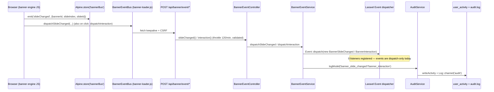

# Necoyoad — Events & Hooks Blueprint (Research 3-a-1)

Repo: `/home/z/necoyoad` — legacy PHP multi-store e-commerce/CMS ("Necoyoad / NecoTienda Standalone") + `necoyoad-next/` (Laravel 11 + Filament 3 + Livewire 3) rewrite.
Cross-referenced (not re-derived): `research/2-architecture.md` (boot chain, engine classes), `research/3a2-widgets.md` (widget engine), `research/3a4-menus.md`, `research/3b1-templates.md` (render pipeline, `processcss` line-798 bug).
All file:line references verified in source during this pass.

---

## A) Core automation library (legacy) — `system/library/automation/`

### A.1 `system/library/automation/hooks.php` — class `Hooks` (329 lines)

A WordPress-style **filter/action engine** with channels ("names") and priority buckets. The single runtime instance is created in `system/startup.php:8`:

```php
global $hooks;
$hooks = new Hooks("mainstream");   // system/startup.php:7-8
```

**Channel = "mainstream"** — the constructor (`hooks.php:23-32`) stores `$this->name = $name` and lazily creates `self::$hooks[$name] = ['actions' => [], 'done' => false]`. Storage is **static** (`private static array $hooks = []`, hooks.php:19), so *every* instance named `"mainstream"` shares the same registry — the class is effectively a named-static singleton with an instance façade. `app/shop/map.php:326` and `app/admin/map.php:842` additionally push the same object into the Registry under key `'hooks'` (`Registry::set('hooks', $hooks)` → emits `registry:update`).

**Storage shape** (`hooks.php:49-52`):
```
Hooks::$hooks[ '<channel>' ]['actions'][ '<tag>' ][ <priority:int> ][ '<unique_id>' ] = [ 'function' => callable, 'once' => bool ]
```
- Filter tags and action tags live in the **same** array; actions are distinguished by a literal `"action:"` prefix added by `addAction()` (hooks.php:156) / `run()` (hooks.php:180). So `addAction("fetch")` registers tag `"action:fetch"`, while `addFilter("processcss")` registers plain `"processcss"`.
- Priorities are class constants (hooks.php:10-14): `URGENT = 10`, `HIGH = 50`, `NORMAL = 100` (default), `LOW = 200`, `LOWEST = 250`. Buckets are `ksort`-ed lazily on first run and memoized via `$merged_filters` (hooks.php:126-129 / 215-218).
- Unique listener ids (`_filter_build_unique_id`, hooks.php:280-316): string function name → the string itself; closure/object → `spl_object_hash($obj)`; static/array callable → `Class . method`. Same-id re-registration **overwrites** (dedup by id).

**Typed properties** (PHP 7.4+/8.0+ floor — `mixed` returns on `__get`, hooks.php:34): `private array $merged_filters`, `public array $current_filter`, `private static array $hooks`, `private array $data`, `private string $name`. The magic `__get/__set/__isset` (hooks.php:34-44) expose an arbitrary per-instance `$data` bag (unused by the codebase).

**Public API:**

| Method | Lines | Semantics |
|---|---|---|
| `addFilter(string $tag, callable $fn, int $priority = self::NORMAL, bool $once = false)` | 46-57 | Registers `$fn` under `$tag[$priority][idx]`, unsets the sort memo. **`$once` is stored but NEVER honored** (no removal after first call anywhere) — dead parameter. |
| `removeFilter(string $tag, callable $fn = null, int $priority = self::NORMAL)` | 59-87 | With `$fn`: removes exact id. Without `$fn`: intends "remove tag (all priorities) or one priority" — but the guard `false !== $priority` (line 76) is always true for an `int` param, so the *all-priorities* branch is dead code; only the given priority bucket is cleared. |
| `hasFilter(string $tag, callable $fn = null)` | 89-104 | Returns bool (any) or the priority int if the exact `$fn` is registered. |
| `applyFilters($tag, &$value)` | 106-149 | Filter chain (see below). |
| `addAction(string $tag, callable $fn, int $priority = NORMAL, bool $once = false)` | 154-158 | `addFilter("action:".$tag, …)`. |
| `hasAction` / `removeAction` / `removeAllActions` | 160-176 | Prefix-mapped to the Filter variants. |
| `run(string $tag, $arg = '')` | 178-234 | Action dispatcher with **short-circuit** (see below). |
| `runAll($args)` | 236-244 | Fires the un-prefixed `'all'` filter bucket directly (unused). |
| `did($tag)` | 246-252 | Returns the bucket array or `0` (unused; caller must pass the `"action:"`-prefixed tag to see actions). |
| `getCurrentFilter/getCurrentAction/doingFilter/doingAction` | 257-278 | Introspection of the `$current_filter` stack (unused). |
| `_call_all_hook($args)` | 318-326 | Fires the un-prefixed `'all'` bucket. |

**`applyFilters($tag, &$value)` chain semantics (hooks.php:106-149):**
1. If a filter `'all'` bucket exists, push `$tag` onto `current_filter`, collect `func_get_args()`, shift off `$tag`, fire `_call_all_hook($args)` (the "all filters" tap).
2. No listeners for `$tag` → return `$value` unchanged.
3. Lazy `ksort` of priority buckets; `reset()` to the first priority.
4. Loop over priorities (`do…while(next()!==false)`), and within each bucket over listeners:
   ```php
   $args[1] = $value;
   $value = call_user_func_array($the_['function'], $args);   // hooks.php:141-142
   ```
   `$args` was built as `func_get_args()` minus the tag → `[originalValue, extraArg1, extraArg2, …]`. Because line 141 assigns the **current** (progressively filtered) value to `$args[1]`, the effective callback signature is:

   > `function ($original, $filtered, ...$argsFromIndex2On)` — the **first extra argument is always clobbered** by the running value.

   For the canonical 2-arg call `applyFilters("x", $v)` the callback receives `($v_original, $v_current)`. For `applyFilters("csspath", $csspath, $template)` (controller.php:790) the callback receives `($csspath_original, $csspath_current)` — **`$template` is silently lost**. For `applyFilters("cssfolder", $cssFolder, $template, $subfolder)` (controller.php:791) it receives `($cssFolder_original, $cssFolder_current, $subfolder)` — `$template` lost, `$subfolder` kept. This quirk matches the `($original, $filtered)` convention visible in the default `processcss` filter (startup.php:148-150).
5. Chained result returned (`$value` also modified by reference).

**`run($tag, $arg = '')` action semantics (hooks.php:178-234):**
1. Tag prefixed to `"action:".$tag`; if absent, an empty bucket is created (so even un-listened actions leave a trace, line 181-183).
2. If an `action:all` bucket exists, push tag + call `_call_all_hook(func_get_args())` **without shifting the tag** (unlike `applyFilters`) — "all" listeners see `('action:init', …)`.
3. Argument assembly (hooks.php:201-212): `$arg` is **unwrapped** if it is a 1-element array whose only element is an object (`array(&$this)` convention — this is how `runHook("index", $this)`-style calls pass the controller); otherwise passed as-is; variadic extras appended.
4. Priority-ordered execution with **short-circuit**:
   ```php
   $hasToReturn = call_user_func_array($the_['function'], $args);
   if ($hasToReturn) { return $hasToReturn; }   // hooks.php:225-228
   ```
   Any truthy return **breaks the workflow stack**: remaining listeners in the bucket *and all lower priorities* are skipped, and the value is returned to the caller. Call sites use this as an interception/override mechanism (`$hasToReturn = $this->runHook("render", $this, $return); if ($hasToReturn) return $hasToReturn;` — controller.php:206-209).
5. Returns `null` if nothing short-circuits.

**'all' hooks duality (quirk):** `applyFilters()` taps the **un-prefixed** `'all'` bucket (hooks.php:109) while `run()` taps the `'action:all'` bucket (hooks.php:186) — and `_call_all_hook()` itself reads the un-prefixed `'all'` key (hooks.php:320), so `run()`'s `action:all` guard can pass while `_call_all_hook` iterates a *different* (usually empty) bucket. WordPress-inspired, subtly inconsistent, and unused in this codebase.

### A.2 `system/library/automation/events.php` — class `Events` (78 lines)

A minimal **static pub/sub** (observer) system, complementary to `Hooks` (events = notifications, no short-circuit; hooks = filters/actions with chain + short-circuit). Header comment: `//TODO: add async and multi-thread support` (events.php:7).

```php
class Events {
    private static array $data = [];      // events.php:10 — [event => [ ['function'=>cb,'once'=>bool], … ]]
```

**API (all static):**

| Method | Lines | Semantics |
|---|---|---|
| `once(string $event_name, callable $fn)` | 24-26 | `on($name, $fn, true)` — **no callers in the entire codebase**. |
| `on(string $event_name, callable $fn, bool $once = false)` | 31-44 | Appends `['function'=>$fn,'once'=>$once]`. Before appending it emits the meta-event **`"events"`** with payload `{event, callback, once}` (events.php:34-38) — a listener on `"events"` is a registration spy. Note the recursion hazard: an `"events"` listener that itself registers events re-enters. |
| `off(string $event_name)` | 46-48 | Sets the listener list to `[]` (does not `unset` — `isset` stays true, `count()===0` short-circuits emit). |
| `emit(string $event_name, ...$args)` | 50-76 | Dispatcher (below). |

**`emit()` semantics (events.php:50-76):**
1. **No listeners → `return null` immediately** (events.php:51-53) — the `"call"`/`"called"` meta-events only fire when at least one listener exists.
2. Emits meta-event **`"call"`** with `{event, args}` *before* invoking listeners (events.php:55-58) — an invocation spy.
3. Iterates listeners **in registration order** (plain `foreach`, **no priorities**), calling `call_user_func_array($fn, $args)`; listeners registered `once` are unset **after** their first invocation (events.php:64-66).
4. After each listener returns, emits meta-event **`"called"`** with `{event, function, args}` (events.php:68-72) — per-listener completion spy.
5. After the loop: `self::$data[$event_name]['done'] = true;` (events.php:75) — **quirk**: this appends a `'done' => true` entry *into the listener array*. It is skipped by the `isset($ev["function"])` guard on the next emit, but it permanently pollutes the bucket and makes `count()` ≥ 1 after the first emit (harmless because emit's early-exit checks `===0`).
6. Listener return values are **discarded** (fire-and-forget, no filtering).
7. **No wildcard listeners** (`*` unsupported), no once-rearm, no async.

**Payload shape inconsistency (important):** `Events::emit(...$args)` is variadic, but the engine wrappers **pack the variadics into a single array** before emitting:
- `Controller::trigger(string $ev, ...$args)` → `Events::emit($ev, $args)` (controller.php:80-83) — listener receives **one argument: the array of args**.
- `Model::trigger(string $ev, ...$args)` → emits the namespaced event and the global event, each with the array-packed payload (model.php:159-163).
- `ControllerModuleModuleController::trigger` / `ControllerWidgetController::trigger` → same pattern (modulecontroller.php:70-74; widgetcontroller.php:70-74).

That is why e.g. `ModelLocalisationLanguage`'s listener starts with `$data = $args[0];` (app/admin/model/localisation/language.php:48-49) — and why the production error log shows `Events::emit('model:language:…', Array)` in the stack trace (`error-ssl.log:1`). Meanwhile `map.php` and the loader emit *unpacked* payloads (`Events::emit("system_load", [db,loader,registry])` passes one array; `Events::emit(strtolower(__CLASS__).":update", $key, $value)` passes two scalars).

Instance façade note: `Events::__set` **throws** `ErrorException` ("Can't assign values of properties directly", events.php:16-18) — the class refuses ad-hoc property injection; `__get/__isset` read `$data` (read-only spy of the listener table).

### A.3 `system/library/automation/webhooks.php` — stub

Single line: `//TODO: create class to sync with third parties APIs and add async functionality` (webhooks.php:2). The planned third-party webhook/automation layer was never implemented.

### A.4 Related but separate: `system/library/xhttp/xhttp.php`

The bundled third-party HTTP library carries its **own private mini hook system** (unrelated to global `Hooks`): `public static $hooks = []` with `self::$hooks['data-preparation'][8][] = ['xhttp','utf8_encode']` seeded at bootstrap (xhttp.php:25-30) and `xhttp::runHook($name, &$hooks, $arguments)` / `addHook($hook,$priority,$function)` (xhttp.php:417-437). Worth a footnote in the chapter; it never intersects the platform's hooks/events.

---

## B) Complete hook/event catalog (legacy)

Counting methodology: exhaustive `rg` over the repo (excluding `docs/`, logs, `necoyoad-next/` for the legacy tables).

### B.1 `Events::emit(` — every call site

**Platform/bootstrap events:**

| Event name | Fired at | Payload | Context |
|---|---|---|---|
| `php:error` | `system/startup.php:37` | `$msg` (string "PHP {level}: {errstr} in {file} on {line}") | Debug error handler (only when `NTS_DEBUG_MODE===true`) |
| `error` | `system/startup.php:38` | `$msg` (same string) | Alias event, same handler |
| `engine_load` | `system/startup.php:130` | `true` | After all engine classes required |
| `system_load` | `app/shop/map.php:23` | `["db"=>$db, "loader"=>$loader, "registry"=>$registry]` | Storefront bootstrap, right after `$hooks->run('system_load', …)` (map.php:18) |
| `config_load` | `app/shop/map.php:58` | `$config` (Config object) | After settings loaded / session-cached Config unserialized |
| `app_load` | `app/shop/map.php:159` | `$registry` | After core registry registrations (config/load/db/log/request/response/session/cache/document/language/user) |
| `load` | `app/shop/map.php:329` | `$registry` | End of storefront map (after `Registry::set('hooks', $hooks)`, map.php:326) |
| `load` | `app/admin/map.php:844` | `$registry` | End of admin map (after `Registry::set('hooks', $hooks)`, line 842) |
| `dispatch` | `system/engine/front.php:22` | `$pre_action` (Action) | **After** executing each pre-action in the pre-action loop |
| `dispatch` | `system/engine/front.php:30` | `$action` (Action) | **Before** each `execute()` in the forwarding `while` loop |
| `registry:update` | `system/engine/registry.php:12` | `$key, $value` (two args) | Every `Registry::set()` — the whole object graph funnels through this event |
| `db:query:error` | `system/database/ntMySQLPdo.php:73` | `$error` (PDO errorInfo), `$sql` | After a failing PDO statement, before the Exception is thrown |
| `loadWidget` | `system/helper/widgets.php:520` | `$w` (widget row), `$settings` (two args) | NecoWidget::getRows, when a widget has `autoload` on (children collection) |

**Loader lifecycle events (all from `system/engine/loader.php`, prefix `strtolower(__CLASS__)` = `"loader"`):**

| Event | Line | Payload |
|---|---|---|
| `loader:library:load` / `loader:library:fail` | 36 / 41 | `$library` |
| `loader:controller:load` / `loader:controller:fail` | 55 / 60 | `$class`, `$route` |
| `loader:model:load` / `loader:model:fail` | 80 / 87 | `$model_name`, `$model` |
| `loader:database:load` / `loader:database:fail` | 102 / 112 | `$db_instance, $driver, $hostname, $username, $password, $database` |
| `loader:helper:load` / `loader:helper:fail` | 124 / 129 | `$helper` |
| `loader:modulemodel:load` / `loader:modulemodel:fail` | 154 / 161 | `$model_name, $model, $path` |
| `loader:modulelibrary:load` / `loader:modulelibrary:fail` | 173 / 178 | `$library, $path` |

All `:fail` branches are followed by a hard `exit('<div class="msg error">…')` — the events are the only observation point before death.

**Engine `Controller` events** (all via `Controller::trigger()` → `Events::emit($ev, $args)`; listener receives ONE array arg — `system/engine/controller.php`):

| Event | Line | Packed payload (array contents) |
|---|---|---|
| `data:update` | 46 | `$this->data` (whole data bag) — fired by `Controller::set()` |
| `forward` | 155 | `[$route, $args]` |
| `redirect` | 168 | `[$url]` (before `header('Location')+exit` or JS fallback) |
| `addChild` | 184 | `[$child, $params]` |
| `beforeLoad` | 273 | `[$action, $controller, $params]` — before child controller `index()` |
| `afterLoad` | 278 | `[$action, $controller, $params]` — after child output captured |
| `beforeRender` | 297 | `[$tpl]` — before `fetch($tpl)` |
| `afterRender` | 299 | `[$r]` (rendered html) — after `fetch()` |
| `renderWidget` | 359, 371 | `[$key, $child]` — during `` token substitution (two passes) |
| `beforeLoadWidget` | 508 | `[$params]` (widget query params: store_id/landing_page/position/device flags…) |
| `loadWidget` | 661, 705 | `[$widget, $settings]` — flat (non-full_tree) widget branch |

**Engine `Model` events** (all via `Model::trigger()` → emitted **twice**: namespaced `"model:{table}:{object_type}::{event}"` AND global `"{event}"`; payload = ONE array arg — `system/engine/model.php`):

| Event (global name) | Line | Packed payload |
|---|---|---|
| `insert` | 293 | `["data"=>$data, "object_type", "pkey", "table"]` — before INSERT |
| `save` | 337 | `["id"=>$id, "data"=>$data, "query"=>$sql, "action"=>"insert"]` — after INSERT (from `add()`) |
| `update` | 379 | `["id"=>$id, "data"=>$data, "object_type", "pkey", "table"]` — before UPDATE |
| `save` | 430 | `["id"=>$id, "data"=>$data, "query"=>$sql, "action"=>"update"]` — after UPDATE |
| `copy` | 501 | `["from"=>$id, "to"=>$newId, "data"=>$data, "object_type", "pkey", "table"]` — after `add()` of the clone |
| `delete` | 584 | `["id"=>$id, "data"=>$recordDeleted, "object_type", "pkey", "table"]` — after DELETE (+ shared-table cleanup) |
| `sort` | 636 | `["data"=>$orderedIds, "object_type", "pkey", "table"]` — after `sortTable()` writes sort_order |
| `setStore` | 1108 | `["object_id", "object_type", "pkey", "table", "store_id"]` — per REPLACE into `object_to_store` |
| `setCategory` | 1172 | `["object_id", "object_type", "pkey", "table", "category_id"]` — per REPLACE into `object_to_category` |
| `deleteDescription` | 1260 | `["object_id", "object_type", "pkey", "table", "language_id"]` |
| `setDescription` | 1320 | `["object_id", "object_type", "pkey", "table", "language_id", "data"=>$value]` |
| `setUrlAlias` | 1338 | `["object_id", "object_type", "pkey", "table", "language_id", "keyword"]` |
| `setProperty` | 1442 | `["object_id", "object_type", "pkey", "table", "group", "key", "value"]` |
| `deleteProperties` | 1487 | `["object_id", "object_type", "pkey", "table", "group", "key"]` |
| `updateProperties` | 1517 | `["object_id", "object_type", "pkey", "table", "group", "data"=>$data, "store_id"]` |
| `activate` | 1543 | `["id", "object_type", "pkey", "table"]` |
| `deactivate` | 1565 | `["id", "object_type", "pkey", "table"]` |
| `toggleStatus` | 1589 | `["id", "object_type", "pkey", "table"]` |

Model namespace construction: `$this->namespace = "model:{$this->table}:".($this->object_type ? ':'.$this->object_type.':' : '')` (model.php:23) — e.g. `ModelLocalisationLanguage` (`table=language`, `object_type=language`) → `"model:language::language:"` so its save event is `model:language::language:save` (matches the `error-ssl.log` stack trace `Events::emit('model:language:...')`).

**Module controller events** (`app/shop/controller/module/modulecontroller.php`, extends `Module` extends `Controller`; prefix `$this->moduleName` + global):

| Event | Line | Packed payload |
|---|---|---|
| `{moduleName}moduleLoad` + `moduleLoad` | 175 | `['widget'=>$widget, 'render'=>$render]` |
| `{moduleName}moduleAsyncResponse` + `moduleAsyncResponse` | 256 | `$return` = `['id','settings','javascripts','scripts','styles','css','html']` |
| `{moduleName}moduleRender` + `moduleRender` | 261 | `['id','settings','javascripts','scripts','styles','css']` (sync render branch) |
| `{moduleName}moduleEditorResponse` + `moduleEditorResponse` | 289 | `$return` (theme-editor `?cve` JSON branch) |

**Admin widget controller events** (`app/admin/controller/module/widgetcontroller.php`): `widgetLoad` (+ namespaced) at line 179, payload `['widget'=>$widget, 'render'=>$render]`.

**Admin CRUD controller events** (`app/admin/controller/admincontroller.php`, plain global names only):

| Event | Line | Packed payload |
|---|---|---|
| `copy` | 97, 108 | `['id', 'controller'=>$this->ClassName, 'route'=>$this->Route]` |
| `delete` | 135, 145 | same shape |
| `activate` | 175 | same shape |
| `deactivate` | 186 | same shape |
| `edit` | 436 | same shape — after `$this->model->update($id,$data)` |
| `new` | 446 | same shape — after `$this->model->add($data)` |

**Meta events** (internal to `Events`): `"events"` on every `on()` (events.php:34), `"call"` at every emit with listeners (events.php:55), `"called"` after each listener (events.php:68).

### B.2 `Events::on(` — every listener registration

| Listener | Registered at | Listens to | What it does |
|---|---|---|---|
| Error→log | `app/shop/map.php:128-131` | `php:error` | `$log->trace($error_msg)` (writes to `log.txt` via `Log`) |
| Error→log | `app/admin/map.php:791-794` | `php:error` | same |
| **Model self-observers** (22 admin model files, 38 registrations, all inside `init()` — constructor-time) | see table below | namespaced `model:{table}:{object_type}::{save|delete}` | side-effect closures |
| (commented example) | `system/startup.php:154-156` | `dispatch` | doc example only |

**Model self-observer inventory** (`$this->on(...)` in `app/admin/model/**`; all receive the packed-array payload, `$args[0]` = payload array):

| Model file | on("save") | on("delete") | Side effects |
|---|---|---|---|
| `localisation/language.php:48,84` | ✔ | ✔ | save(insert): clone `description` rows into the new language; delete: purge `status` + `description` rows for the language id (this is the closure seen crashing in `error-ssl.log` — `status` table has no `language_id` column) |
| `user/user.php:59,82` | ✔ | ✔ | save: hash password / update `user_activity`-style data; delete: cascade user rows |
| `user/usergroup.php:38` | — | ✔ | delete: purge group permissions |
| `sale/customer.php:140` | — | ✔ | delete: purge customer-related rows |
| `sale/customergroup.php:49` | — | ✔ | delete: purge group rows |
| `sale/coupon.php:83,107` | ✔ | ✔ | save/delete: coupon maintenance |
| `sale/order.php:215,237` | ✔ | ✔ | order save/delete bookkeeping |
| `content/menu.php:51,57` | ✔ | ✔ | save: `setItems` re-insert of menu_link tree (see research 3a4); delete: `deleteItems` |
| `content/post_category.php:60` | ✔ | — | category maintenance |
| `content/banner.php:62,83` | ✔ | ✔ | save: persist `items` (banner_item + sort_order) via `setItem`; delete: `deleteItems($id)` |
| `style/theme.php:79,104` | ✔ | ✔ | theme save/delete (custom CSS files etc.) |
| `marketing/campaign.php:88` | ✔ | — | campaign save |
| `marketing/contact.php:43,52` | ✔ | ✔ | contact maintenance |
| `marketing/list.php:39,50` | ✔ | ✔ | contact-list maintenance |
| `store/download.php:51` | ✔ | — | download save |
| `store/store.php:39,49` | ✔ | ✔ | store save/delete (config dirs) |
| `store/category.php:60` | ✔ | — | category save |
| `store/product.php:139,213` | ✔ | ✔ | product save/delete (related tables) |
| `store/manufacturer.php:49` | ✔ | — | manufacturer save |
| `store/attribute.php:44,64` | ✔ | ✔ | attribute maintenance |
| `localisation/geozone.php:35,56` | ✔ | ✔ | geo zone save/delete |
| `localisation/taxclass.php:41,61` | ✔ | ✔ | tax class save/delete |

No shop-side (storefront) model registers listeners; no module controller ever calls `on()`/`off()` (the `Module::on` wrapper at modulecontroller.php:33-36 / widgetcontroller.php:33-36 is dead API surface). `Events::once` has zero callers.

### B.3 `$hooks->run(` / `->runHook(` — every action hook fired

**Boot lifecycle (storefront `app/shop/map.php` unless noted):**

| Hook | Fired at | Args | Notes |
|---|---|---|---|
| `init` | `system/startup.php:147` | — | First extension point of the request, right after all engine+library requires. **No listeners in the codebase** (extension seam). |
| `system_load` | `app/shop/map.php:18` | `["db","loader","registry"]` | paired with `Events::emit("system_load")` (map.php:23) |
| `csrf_load` | `app/shop/map.php:43` | `$session` | after `fkey` CSRF token minted into Registry |
| `config_load` | `app/shop/map.php:57` | `$config` | paired with event (map.php:58) |
| `language_load` | `app/shop/map.php:121` | `$code` | after 5-level language cascade + `$language->load()` |
| `app_load` | `app/shop/map.php:158` | `$registry` | paired with event (map.php:159) |
| `load` | `app/shop/map.php:328` | `$registry` | paired with event (map.php:329); admin equivalent `app/admin/map.php:843` + event at 844 |

**Rendering pipeline (`system/engine/controller.php`):**

| Hook | Line | Args | Short-circuit effect |
|---|---|---|---|
| `redirect` | 162 | `$url` | replaces the redirect entirely (return value used instead of `header()+exit`) |
| `render` | 206 | `$this` (controller), `$return` | replaces the whole render output |
| `fetch` | 321 | `$filename`, `$this` | replaces the fetched template output (the startup.php:158 commented example is exactly this) |
| `loadWidgets` | 464 | `["position","landing_page","app","full_tree"]` | replaces the entire widget-tree load |
| `loadAssets` | 733 | `["filename","subfolder"]` | replaces per-controller asset loading |

**Model CRUD interception (`system/engine/model.php`, via `Model::runHook` = global run + namespaced run, namespaced result returned):**

| Hook | Line | Args |
|---|---|---|
| `insert` | 304 | `["data","object_type","pkey","table"]` (before SQL; truthy return **aborts the insert** and is returned as the id) |
| `update` | 391 | `["id","data","object_type","pkey","table"]` (before SQL; aborts update) |
| `copy` | 461 | `["id","object_type","pkey","table"]` (before read; aborts copy) |
| `delete` | 534 | `["id","object_type","pkey","table"]` (before DELETE; aborts delete — **this is the "before delete" hook used by banner/campaign/review models**) |
| `sort` | 616 | `["data","object_type","pkey","table"]` (before sort writes; aborts) |

**Module pipeline (`app/shop/controller/module/modulecontroller.php` / admin `widgetcontroller.php`):**

| Hook | File:line | Args |
|---|---|---|
| `index` | modulecontroller.php:169 / widgetcontroller.php:172 | `$this` (controller instance) — short-circuits module rendering |
| `async` | modulecontroller.php:299 / widgetcontroller.php:468 | `$this` — short-circuits the `?r=module/<name>/async&w=…` endpoint |

**Admin CRUD controller hooks (`app/admin/controller/admincontroller.php`)** — all receive `$this` (the controller) and can short-circuit the method:

| Hook | Line | Wraps method |
|---|---|---|
| `index` | 45 | `index()` → getList |
| `insert` | 62 | `insert()` → upsert |
| `update` | 74 | `update()` → upsert |
| `copy` | 86 | `copy()` |
| `delete` | 123 | `delete()` |
| **`avtivate`** (sic — typo, never matches `activate`) | 159 | `activate()` |
| `sortable` | 204 | `sortable()` |
| `getList` | 492 | `getList()` |
| `grid` | 709 | `grid()` (JSON grid endpoint) |
| `getForm` | 906 | `getForm()` |
| `validateForm` | 1203 | `validateForm()` (short-circuit = validation verdict) |
| `validateDelete` | 1233 | `validateDelete()` |

**Database layer:**

| Hook | Fired at | Args | Effect |
|---|---|---|---|
| `db:query` | `system/database/ntMySQLPdo.php:39` | `$this->escape($sql)` (escaped SQL string) | Runs **before every query**; truthy return is returned as the query result — a full query interceptor / query-cache / query-rewrite seam. |

### B.4 `applyFilters(` — every filter application point

**`system/startup.php` (default registration, the only stock one):**
- `$hooks->addFilter("processcss", function ($original, $filtered) { return $filtered; })` — startup.php:148-150 — an identity filter; combined with the `$args[1]` clobber quirk and the `_loadAssets` call shape (`applyFilters("processcss", $cssFolder, $filename, $template)`, controller.php:798) the default filter returns **`$cssFolder`**, so inline-CSS mode appends the *folder path* to `$this->data['css']` instead of the file contents (the `file_get_contents` result on line 797 is discarded — bug F-2 in research 3b1).

**Render/asset pipeline (`system/engine/controller.php`):**

| Filter | Line | Value chained | Extra args (1st is clobbered) |
|---|---|---|---|
| `data:update` | 42 | `["key","value","data"]` | — (set() interception: `if (isset($v["value"])) $value = $v["value"];`) |
| `render` | 387 | `$content` (final HTML) | — (post-minify output filter) |
| `loadcss` | 437 | `$this->data['css']` | — |
| `loadstyles` | 447, 814 | `$styles` array | — |
| `loadjavascripts` | 817 | `$javascripts` array | — |
| `csspath` | 790 | `$csspath` | `$template` (lost) |
| `cssfolder` | 791 | `$cssFolder` | `$template` (lost), `$subfolder` (kept) |
| `jsfolder` | 792 | `$jsFolder` | `$template` (lost), `$subfolder` (kept) |
| `jspath` | 793 | `$jspath` | `$template` (lost) |
| `processcss` | 798 | `$cssFolder` (⚠ should be CSS content) | `$filename` (lost), `$template` (kept) |
| `rowcss` | 542, 603 | `$this->css` array | — |
| `columncss` | 564, 625 | `$this->css` array | — |

**Model query-builder filters (`system/engine/model.php`):**

| Filter | Line | Value | Purpose |
|---|---|---|---|
| `insert` | 301 | `$data` | mutate row data before INSERT |
| `update` | 388 | `$data` | mutate row data before UPDATE |
| `copy` | 494 | `["id","data"]` | mutate clone payload |
| `select` | 752 | `["sql"=>"*","data"=>$data]` | rewrite SELECT column list (`getAll()`) |
| `query_result` | 762 | `$result` (rows) | post-process every `getAll()` result set |
| `buildSQLQuery` | 831 | `["data","sort_data","countAsTotal"]` | rewrite the whole criteria input |
| `join` | 1027 | `["sql"=>$sql,"data"=>$filters]` | append JOINs (`__getCriteriaSQL`-adjacent builder) |
| `where` | 1031 | `["criteria"=>$criteria,"data"=>$filters]` | append WHERE criteria |

**Module/widget settings filters:**

| Filter | Fired at | Value |
|---|---|---|
| `module:settings` (+ `module:{moduleName}:module:settings`) | modulecontroller.php:225-229 | `['widget','render','settings']` — the **widget composition seam**: each module's registered closure computes data (products, posts, links…) into `$this->data` and may return modified settings |
| `widget:settings` (+ `module:{moduleName}:widget:settings`) | widgetcontroller.php:444 | `$this->data` (admin widget form data before JSON render) |

**Admin grid/form filters (`app/admin/controller/admincontroller.php`):**

| Filter | Line | Value |
|---|---|---|
| `formData` | 262 | `$data` (raw POST before model save) |
| `formProcess:dom` | 363 | `['dom'=>DOMDocument,'data']` (rich-text pipeline: base64 images, tracking links) |
| `formProcess:description` | 400 | `$description['description']` (final HTML string) |
| `breadcrumbs` | 510 | `[$this, 'breadcrumbs'=>…]` (note: array literal with a numeric 0 key + named key quirk) |
| `getList:data` / `getList:scripts` | 688 / 691 | list-view data / scripts |
| `grid:filters` | 788 | grid filter definitions |
| `grid:result` | 818 | each grid row (`$results[$k] = applyFilters("grid:result", $result)`) |
| `grid:data` / `grid:scripts` | 888 / 891 | grid payload / scripts |
| `getForm:data` / `getForm:scripts` | 1178 / 1181 | form payload / scripts |

**DB filter:** `db:escape` — ntMySQLPdo.php:94 — `$value` chained **before** the manual `str_replace` escaping on every `DB::escape()` call.

### B.5 Registrations inventory (`addFilter` / `addAction` / `addHook`)

| Registration | Count | Where | Resolved tag |
|---|---|---|---|
| `processcss` identity filter | 1 | system/startup.php:148 | `processcss` |
| `module:settings` (widget data providers) | **55 files** | `app/shop/controller/module/*.php` (each module's `init()`, e.g. product_list.php:12, links.php:15, banner.php:12, search.php:12…) | `module:{moduleName}:module:settings` (via `ControllerModuleModuleController::addFilter`, modulecontroller.php:89-93) |
| `widget:settings` (admin widget form providers) | **9 files** | `app/admin/controller/module/{banner,product_list,product_tabs,product_filter_attributes,product_attributes,links,lightbox,post_list,richtext}/widget.php` | `module:{moduleName}:widget:settings` |
| `grid:*` / `getForm:*` / `formData` / `grid:filters` / `grid:result` | 24 files / 5 files / 2 files / 2 files / 2 files | `app/admin/controller/**` `init()` (e.g. content/menu.php:71,94,124; store/product.php:196,250,405,418,445; localisation/*.php …) | **plain, un-namespaced** (Controller base `$namespace=''`) — see hazard note below |
| Model query-builder filters (`select`/`join`/`where`/`insert`/`update`/`copy`/`query_result`) | 21 admin model files + 1 shop model | `app/admin/model/**` `init()` + `app/shop/model/store/category.php:60,70,90` | `model:{table}:{object_type}::{name}` (namespaced — each model's closure only fires for itself) |
| `addHook("delete")` (before-delete actions) | 3 | `app/admin/model/content/banner.php:77`, `marketing/campaign.php:114`, `store/review.php:69` | namespaced `model:…::delete` action |
| `addAction` | 0 live | only the commented example startup.php:158 | — |

**Hazard — admin controller filter cross-talk:** because `Controller::addFilter()` registers under `$this->namespace . $name` and **no controller ever sets `$namespace`** (verified: zero `protected $namespace =` in `app/`), while `Controller::applyFilters()` applies the **un-namespaced** tag (controller.php:105-109), every admin entity controller's `grid:data`/`getForm:data` closure registers on the **same global tag**. If two entity controllers are constructed in one request, both closures chain on every grid/form render. In practice one admin request builds one entity controller (children like `common/header` don't register these), so the defect is latent. The symmetric asymmetry is real, though: `Model::addFilter` registers namespaced but `Model::applyFilters` applies **both** global and namespaced (model.php:198-204) — the deliberate "for all models / for this model" pattern; `ModuleController` mirrors it (modulecontroller.php:109-115).

### B.6 Totals

- **Events emitted:** 30 distinct emit call-site families (≈ 60 sites counting per-line loader pairs and duplicated branches), ~26 distinct event names + 4 loader-namespace pairs + per-model namespaced names.
- **Event listeners:** 2 platform (`php:error`×2) + 38 model self-observers + 0 module = **40 live registrations**.
- **Action hooks fired:** 7 boot + 5 render-pipeline + 5 model CRUD + 4 module/admin-module (`index`/`async` ×2) + 12 admincontroller methods + 1 DB = **~34 distinct hook points**.
- **Filters applied:** ~14 render/asset + 8 model query-builder + 2 module settings + 12 admin grid/form + 2 DB + 1 data:update = **~39 distinct filter points**.
- **Registrations:** 1 default + 55 module:settings + 9 widget:settings + ~60 admin controller grid/form + ~62 model query filters + 3 addHook = **~190 listener registrations** in the shipped code.

---

## C) Request-lifecycle interception points (legacy)

### C.1 Boot chain with every hook/event (storefront)

```mermaid
sequenceDiagram
    participant HT as .htaccess
    participant WI as web/index.php
    participant ST as system/startup.php
    participant MP as app/shop/map.php
    participant FE as Front::dispatch
    participant C as Controller
    participant M as Model
    participant DB as ntMySQLPdo

    HT->>WI: rewrite → /web/index.php?_route_=
    WI->>WI: store resolution (subdomain/folder) → app config
    WI->>ST: require startup.php
    ST->>ST: new Hooks("mainstream")  (startup.php:8)
    ST->>ST: [debug only] set_error_handler → Events::emit("php:error"/"error") on any PHP error
    ST->>ST: require engine/* + library/*
    ST->>ST: Events::emit("engine_load", true)  (startup.php:130)
    ST->>ST: $hooks->run('init')  (startup.php:147)  ⚠ no listeners
    ST->>ST: $hooks->addFilter("processcss", identity)  (startup.php:148)
    ST->>MP: require app/shop/map.php
    MP->>MP: Registry + Loader + DB + Request + Response + Front
    MP->>MP: $hooks->run('system_load',[db,loader,registry]) + Events::emit("system_load") (map.php:18/23)
    MP->>MP: fkey CSRF mint → $hooks->run('csrf_load', $session) (map.php:43)
    MP->>MP: settings load / session Config cache → $hooks->run('config_load') + Events::emit("config_load") (map.php:57-58)
    MP->>MP: language cascade → $hooks->run('language_load', $code) (map.php:121)
    MP->>MP: Events::on("php:error", log) (map.php:128)
    MP->>MP: Loader::auto ×12 → loader:*:load events per library/model
    MP->>MP: core Registry::set ×10 → "registry:update" per key
    MP->>MP: $hooks->run('app_load') + Events::emit("app_load") (map.php:158-159)
    MP->>MP: customer/currency/tax/cart/browser/tracker + javascripts/styles/scripts
    MP->>MP: Registry::set('hooks', $hooks) → registry:update
    MP->>MP: $hooks->run('load', $registry) + Events::emit("load") (map.php:328-329)
    MP->>FE: Front->addPreAction(maintenance, seo_url); dispatch(action, error/not_found)
    loop pre-actions
        FE->>FE: execute(pre_action)
        FE->>FE: Events::emit("dispatch", $pre_action)  (front.php:22 — AFTER execute)
    end
    loop while ($action)
        FE->>FE: Events::emit("dispatch", $action)  (front.php:30 — BEFORE execute)
        FE->>FE: Registry::set(ClassName/Method/Route) → registry:update ×3
        FE->>C: new ControllerX(registry) → init() → addFilter/on registrations
        FE->>C: call $method($args) — may return new Action (forward chain)
    end
    WI->>WI: Response->output() (headers + optional gzip)
```

Admin variant: `web/admin/index.php` → `startup.php` (same Hooks/Events) → `app/admin/map.php` (route-switched lazy loader; **only** `php:error` listener + final `load` hook/event, lines 791-794 / 842-844) → pre-actions `common/home/login` + `common/home/permission` (web/admin/index.php:67-70) → dispatch. The planned automation pre-actions (`automation/workflows`, `automation/events` gated by `config_run_workflows`/`config_run_events`) exist only as comments (web/index.php:67-70).

### C.2 Dispatch interception (`system/engine/front.php`)

`Front::dispatch($action, $error)` (front.php:17-33): pre-action loop executes each pre-action and emits `Events::emit("dispatch", $pre_action)` **after** execution; if a pre-action returns an Action (maintenance/seo_url forwarding), it becomes the new `$action` and the loop breaks. The main `while ($action)` loop emits `Events::emit("dispatch", $action)` **before** each `execute()` — the natural point for a routing observer (the startup.php:154 commented example targets exactly this). `execute()` (front.php:35-60) resolves file/class/method/args, sets `ClassName`/`Method`/`Route` into the Registry (3 × `registry:update`), instantiates the controller (→ constructor → `init()` → **listener registration time**), and calls the method — a returned `Action` continues the chain (forwarding), `null` ends it. `Action` itself (system/engine/action.php) has no events; the `modules/<name>/…` route remap happens in its constructor (action.php:17-31).

### C.3 Registry interception (`system/engine/registry.php`)

`Registry::set()` (registry.php:9-15) emits `Events::emit("registry:update", $key, $value)` before storing — *the* service-locator tap: every object entering the graph (config, db, request, response, session, cache, document, language, user, customer, cart, currency, tax, tracker, hooks, fkey, ClassName/Method/Route, asset arrays, every `model*`/`model_*` registration) passes through it. Guarded by `class_exists("Events") && is_callable([Events::class,'emit'])` so early boot is safe.

### C.4 Loader interception (`system/engine/loader.php`)

Every load/fail emits `loader:{library|controller|model|database|helper|modulemodel|modulelibrary}:{load|fail}` (loader.php:36-178, details in B.1). All methods hard-`exit()` on failure — the `:fail` events are terminal diagnostics. Note `Loader::model()` registers the instance under **two** Registry keys (`modelProduct` + legacy `model_store_product`, loader.php:76-77) → two `registry:update` emissions; only `Loader::model()` and `moduleModel()` actually *register* into the Registry (`controller()` returns the instance without registering).

### C.5 Controller render pipeline interception (`system/engine/controller.php`)

```mermaid
sequenceDiagram
    participant A as Action/execute
    participant C as Controller::render (:203)
    participant F as Controller::fetch (:318)
    participant T as .tpl include
    participant W as loadWidgets (:453)
    participant L as _loadAssets (:723)

    A->>C: index() → render()
    C->>C: runHook("render", $this, $return) — SHORT-CIRCUIT (206)
    C->>C: cacheId device/customer lookup (216-238)
    C->>L: loadAssets(ClassName) + loadAssets(Route) (241-247)
    L->>L: runHook("loadAssets",[filename,subfolder]) — SHORT-CIRCUIT (733)
    L->>L: applyFilters csspath/cssfolder/jsfolder/jspath (790-793)
    L->>L: applyFilters processcss (798 — inline CSS branch, buggy)
    L->>L: applyFilters loadstyles / loadjavascripts (814/817)
    loop children
        C->>C: trigger beforeLoad (273) → child->index() → trigger afterLoad (278)
    end
    C->>C: trigger beforeRender($tpl) (297)
    C->>F: fetch($tpl)
    F->>F: runHook("fetch", $filename, $this) — SHORT-CIRCUIT (321)
    F->>T: extract($this->data); ob_start(); require $file
    T->>F: $content (raw)
    loop  tokens ×2 passes
        F->>F: trigger renderWidget($key,$child) (359/371) + str_replace
    end
    F->>F: comment/minify scrub (376-384)
    F->>F: applyFilters("render", $content) (387)
    C->>C: trigger afterRender($r) (299) → cache set / $this->output
```

`loadWidgets()` (controller.php:453-715): `runHook("loadWidgets", [position, landing_page, app, full_tree])` short-circuit at 464-472; `trigger("beforeLoadWidget", $params)` at 508 (full-tree branch) before `NecoWidget::getRows($params)`; row/column inline CSS passes through `applyFilters("rowcss")` (542/603) and `applyFilters("columncss")` (564/625); flat branch `trigger("loadWidget", $widget, $settings)` per widget (661/705). `Controller::set()` runs the `data:update` filter then triggers the `data:update` event (controller.php:41-47) — the template-data tap. `redirect()` honors a `redirect` hook (162-165) then triggers `redirect` before the Location header/JS fallback; `forward()`/`addChild()` trigger `forward`/`addChild` events (155/184).

### C.6 Model lifecycle interception (`system/engine/model.php`)

Every generic CRUD method follows the same **trigger(event) → applyFilters(filter) → runHook(action) → SQL → trigger(event)** protocol:

```mermaid
flowchart TD
    subgraph add/update
        A1[trigger insert/update<br/>namespaced + global event] --> A2[applyFilters insert/update<br/>mutate $data]
        A2 --> A3[runHook insert/update<br/>SHORT-CIRCUIT aborts SQL]
        A3 --> A4[INSERT/UPDATE + setDescriptions/setStores/setCategories]
        A4 --> A5[cache->delete]
        A5 --> A6[trigger save action=insert|update]
    end
    subgraph delete
        D1[runHook delete<br/>SHORT-CIRCUIT aborts] --> D2[getById snapshot]
        D2 --> D3[DELETE + shared tables: object_to_category,<br/>object_to_store, property, description, stat,<br/>url_alias, review]
        D3 --> D4[trigger delete with snapshot record]
    end
    subgraph read getAll
        R1[applyFilters select<br/>columns] --> R2[buildSQLQuery:<br/>applyFilters buildSQLQuery / join / where]
        R2 --> R3[db->query → db:query hook + db:query:error event]
        R3 --> R4[applyFilters query_result<br/>rows]
    end
```

`sortTable()` mirrors it (`sort` hook before, `sort` event after); EAV helpers trigger `setStore`/`setCategory`/`deleteDescription`/`setDescription`/`setUrlAlias`/`setProperty`/`deleteProperties`/`updateProperties`; status helpers trigger `activate`/`deactivate`/`toggleStatus`. The `Model::runHook` protocol runs the **global** hook first (return discarded) then the **namespaced** hook (return honored) — model.php:242-247.

### C.7 Module pipeline interception (`modulecontroller.php` / `widgetcontroller.php`)

`index($widget, $render)` (modulecontroller.php:166-294): `runHook("index", $this)` short-circuit → `trigger('moduleLoad', [widget, render])` → language load → settings unserialize + defaults → inline `style` CSS capture → `loadDeps($route)` → **`applyFilters("module:settings", [widget, render, settings])`** (225-229 — the seam where all 55 modules inject their data) → template resolution (theme override → choroni fallback) → branches:
- `?cve` (theme editor): placeholder render → `trigger('moduleEditorResponse', $return)` → JSON output.
- `$render=true` (async): full render → `trigger('moduleAsyncResponse', $return)` → JSON `{id, settings, javascripts, scripts, styles, css, html}`.
- sync: `trigger('moduleRender', [...])` → `loadWidgetAssets` → `render()`.

`async()` (modulecontroller.php:296-314 / widgetcontroller.php:464-483): `runHook("async", $this)` short-circuit → `NecoWidget($registry, route)->getWidget($name)` → `index($widget, true)`.

### C.8 Admin CRUD interception (`admincontroller.php`)

Every public method opens with `runHook("<method>", $this)` (short-circuit) — the 12 hooks in B.3 — and fires `trigger()` events after model writes (`copy`/`delete`/`activate`/`deactivate`/`edit`/`new`, payload `{id, controller: ClassName, route: Route}`) alongside `$this->user->registerActivity(...)` writes into `user_activity` (the legacy audit trail — see E). Filter points `formData`/`formProcess:dom`/`formProcess:description` (262/363/400) transform POST data and rich-text DOM before persistence; grid/getList/getForm filters shape every admin screen payload (688/691/788/818/888/891/1178/1181).

### C.9 Database interception (`library/db.php` + `database/ntMySQLPdo.php`)

`DB` (library/db.php) is a thin decorator over the single driver `ntMySQLPdo` (selected via `DB_DRIVER='ntMySQLPdo'` in cconfig.php). The driver is the **deepest interception point**:
- `query($sql)` (ntMySQLPdo.php:36-89): `$hooks->run("db:query", $this->escape($sql))` **before** prepare/execute — a truthy return short-circuits and becomes the "query result" (query cache/rewrite/black-hole seam); on PDO errorInfo → `Events::emit("db:query:error", $error, $sql)` then throw.
- `escape($value)` (ntMySQLPdo.php:91-97): `$hooks->applyFilters("db:escape", $value)` before the manual `str_replace` escaping — an output/input-encoding filter seam (the startup.php:165 commented example).
- The `query` action hook receives the **escaped** SQL string, not the raw one.

`library/response.php` has **no** hooks/events — `output()` (response.php:54-68) sends accumulated headers + (optionally gzipped) body; the last filter that touches output is `applyFilters("render", $content)` inside `Controller::fetch()`.

---

## D) necoyoad-next equivalents

### D.1 `app/Events/*` — the Banner event family

No `app/Listeners/` directory exists; no `EventServiceProvider::$listen` map; **no `Event::listen` registration anywhere in the app** — the Laravel Event system is used dispatch-only, with audit performed inline by the dispatching services.

**`BannerEvent` (abstract base — app/Events/BannerEvent.php)**
- Constructor: `public readonly Banner $banner, public readonly ?BannerItem $slide = null, public readonly array $context = []` (lines 30-34).
- Traits: `Dispatchable, InteractsWithSockets, SerializesModels` (line 28).
- `broadcastOn(): [new PrivateChannel('admin.banners.' . $this->banner->id)]` (36-41). Docblock claims two channels ('banners' public + 'admin.banners.{id}' private) but only the private one is implemented. **The class does not implement `ShouldBroadcast`** — so despite `InteractsWithSockets` + `broadcastOn()`, Laravel will never actually broadcast these events; it's structured-for-later broadcasting. `BroadcastServiceProvider` is registered (bootstrap/providers.php:8).
- References `docs/reports/1782968369_modern_banner_module_3d_canvas_svg_composer.md` — the design doc driving this subsystem.

**`BannerRendering` (app/Events/BannerRendering.php)** — fired *before* render; a **mutable "hook-like" event**: `protected array $injectedSlides = []`, `protected ?string $overrideEngine = null` with `addSlide(array $slide)`, `getInjectedSlides()`, `overrideEngine(string $engine)`, `getOverrideEngine()` (25-46). Docblock suggests listeners inject slides / switch engines / track impressions / A-B test, with a usage example `Event::listen(BannerRendering::class, fn …)` (17-21) — no such listener exists yet. This is the direct analogue of the legacy `runHook("render"/"fetch")`-style *pre*-interception, expressed as a mutable event object.

**`BannerRendered` (app/Events/BannerRendered.php)** — fired *after* render; adds `public readonly string $html, public readonly string $engine, public readonly float $renderTimeMs` (21-30). Analogue of `applyFilters("render", $content)` (post-processing HTML) — but with no listener, no post-processing happens.

**`BannerSlideChanged` (app/Events/BannerSlideChanged.php)** — `public readonly int $slideIndex, public readonly ?int $slideId = null, public readonly string $direction = 'next'` (24-33). Originates from the **browser** (frontend JS) via POST.

**`BannerInteraction` (app/Events/BannerInteraction.php)** — `public readonly string $interactionType ('click'|'hover'|'swipe'|'cta_click' — enforced by controller validation), public readonly ?int $slideId, public readonly ?string $linkUrl, public readonly ?int $userId` (18-29). Also browser-originated.

### D.2 Dispatch sites & event flow

**Server-side render lifecycle — `app/Services/BannerRendererService.php`** (singleton, AppServiceProvider.php:52):
`render(Banner $banner)` (118-203): ① `Event::dispatch(new BannerRendering($banner))` (124-125) → ② engine resolution honoring `$renderingEvent->getOverrideEngine() ?? $this->getEngine($banner)` (128; EAV `banner/engine`, default `'swiper'`; 8 engines: swiper, gsap-cube, gsap-coverflow, gsap-flip, three-distort, canvas-particles, svg-morph, ken-burns — ENGINES const 33-42) → ③ config + slides via EAV, merging `$renderingEvent->getInjectedSlides()` (140-146) → ④ `view("components.banners.engines.{$engine}")->render()` with swiper fallback (152-169) → ⑤ `Event::dispatch(new BannerRendered(banner, html, engine, renderTimeMs, context: ['slide_count']))` (174-180) → ⑥ `AuditService::logModel('banner_rendered', …)` (183-192); `BannerRenderException` wraps any failure with `logException` (196-202).
⚠ **Gap:** the storefront Banner widget (`app/View/Components/Widgets/Banner.php`) calls `getConfig/getSlides/getEngine` directly (83-85) and never calls `render()` — verified: **zero call sites of `BannerRendererService::render()`**. So the two render-lifecycle events currently fire only when something invokes `render()` explicitly (nothing does); the widget path bypasses the event layer entirely.

**Frontend-originated events — `app/Services/BannerEventService.php`** (singleton, AppServiceProvider.php:55):
- `dispatchSlideChanged(bannerId, slideIndex, slideId, direction)` (33-57): `Banner::find` guard → `Event::dispatch(new BannerSlideChanged(...))` (40-45) → `AuditService::logModel('banner_slide_changed', …)` (47-56).
- `dispatchInteraction(bannerId, interactionType, slideId, linkUrl, userId)` (62-88): same pattern with `BannerInteraction` + `'banner_interaction'` audit.

**HTTP entry — `app/Http/Controllers/BannerEventController.php`** on `routes/web.php:87-90`:
```
POST /api/banner/event/slide-changed  (throttle:120,1)  → slideChanged()
POST /api/banner/event/interaction    (throttle:120,1)  → interaction()
```
Validation: `banner_id required|integer|exists:banners,id`, `slide_index required|integer|min:0`, `slide_id nullable|integer`, `direction in:next,prev,manual`; `interaction_type in:click,hover,swipe,cta_click`, `link_url max:500`; user resolution `auth('customer')->id() ?? auth('web')->id()` (BannerEventController.php:60). No auth required (public visitors' interactions are tracked).

**Frontend event bus — `resources/js/banners/banner-loader.js`:**
- `BannerEventBus.dispatchSlideChanged / dispatchInteraction` — `fetch('/api/banner/event/…', {method POST, X-CSRF-TOKEN meta, keepalive: true})` (14-65); failures queue a `banner_event_dispatch_error` into `window.__necoyoadAudit`.
- **Client-side pub/sub:** `Alpine.store('bannerBus', { on(event,cb), emit(event,data) })` (70-84) — other widgets can sync to banner slides in-browser (the docblock on `BannerSlideChanged` describes exactly this).
- Loader scans `[data-banner-engine]` elements (wrapper.blade.php emits `data-banner-id/-engine/-config/-slides`), dynamic-`import()`s `./engines/{engine}-engine.js` (89-114) — lazy engine loading with a no-JS fallback list and `banner_engine_error` audit event.
- All 8 engine modules (`resources/js/banners/engines/{swiper,gsap-cube,gsap-coverflow,gsap-flip,three-distort,canvas-particles,svg-morph,ken-burns}-engine.js`) call `eventBus.emit('slideChanged', {bannerId, slideIndex, slideId})` locally and `eventBus.dispatchInteraction(bannerId, 'click', slideId, link)` for CTA clicks (e.g. swiper-engine.js:79, 88).



### D.3 Audit event flow (the legacy `user_activity` successor)

**`app/Services/AuditService.php`** (singleton, AppServiceProvider.php:40) — dual sink: `user_activity` table (structured) + `storage/logs/audit.log` (`'audit'` channel, config/logging.php:16-18). Implements the explicit mandate: *all DB queries, API requests with response ≠ 200-399, and failed exec processes must be logged for audit*.
- `logQuery(QueryExecuted $query)` (40-61): slow-query filter `>100ms` (`SLOW_QUERY_THRESHOLD_MS`) unless `AUDIT_ALL_QUERIES=true` (config/app.php:31). Wired in `AppServiceProvider::boot()` via **`DB::listen`** (AppServiceProvider.php:76-79) — the Laravel-native analogue of the legacy `db:query` hook / `db:query:error` event, applied to *every* query on the default connection.
- `logRequest(method, url, status, userId, guard)` (66-109): statuses outside `[200,399]` only; writes audit-log warning + `user_activity` row (`event='http_error'`). Wired via **`app/Http/Middleware/LogHttpResponse.php`** (appended globally in bootstrap/app.php:21), which skips `api/audit/*` to avoid recursion (LogHttpResponse.php:29-32).
- `logExec(command, exitCode, stderr, stdout)` (114-136): only non-zero exits → `'exec_failed'` rows.
- `logModel(event, modelClass, modelId, changes, userId)` (141-164): `'model_' . event` rows + morph target `activitable_type/activitable_id`.
- `logException(Throwable, context)` (169-188): wired to **every reported exception** via `bootstrap/app.php:40-46` (`$exceptions->report(fn (\Throwable $e) => app(AuditService::class)->logException($e))`) — the analogue of the legacy `php:error` → `Log::trace` listener, but for exceptions (Laravel's error handler replaces the legacy `set_error_handler` debug shim).
- `writeActivity()` (193-222) never throws (try/catch + own audit-error log) — mirroring the legacy philosophy that logging must not kill the request.
- `detectGuard()` (227-235) records which auth guard (web/customer) produced the action.

**`app/Traits/Auditable.php`** — model observers via trait boot hooks: `static::created / static::updated / static::deleted` → `AuditService::logModel('created'|'updated'|'deleted', …)` with full attributes / `getChanges()` (28-64). The docblock explains it replaced dead Filament-Resource hooks ("Filament 3 only calls afterCreate/… on Page classes, not on the Resource class") so audit works for **all write paths** (Filament, API, tinker, seeders). Attached to **11 models**: `Banner, User, Category, Newsletter, Campaign, Manufacturer, Order, Product, Contact, Customer, Post` (verified `use Auditable` in each model). This is the direct successor of the legacy **`Model::trigger('save'/'insert'/'update'/'delete')` + per-model `on()` closures** pattern and of `User::registerActivity`.

**`app/Models/UserActivity.php`** — Eloquent model over the legacy-parity `user_activity` table: fillable `user_id, activitable_type, activitable_id, event, action, description, ip, browser, date_added`; `activitable(): MorphTo`, `user(): BelongsTo`; `$timestamps = false` (9-16).

**Browser audit pipeline** (no legacy equivalent — new in next):
- `resources/js/audit-logger.js`: captures ① `window.onerror` (`js_error`), ② `unhandledrejection` (`promise_rejection`), ③ wrapped `console.error` (`console_error`), ④ wrapped `fetch` failures outside 200-399 (`fetch_error`), ⑤ wrapped XHR `loadend` failures (`xhr_error`); batches (10 events / 5 s) and ships via `navigator.sendBeacon('/api/audit/browser')` with `fetch`+CSRF fallback and a 50-event requeue cap; flushes on `beforeunload`/`pagehide`; exposes `window.__necoyoadAudit` (also reused by banner event bus errors).
- `routes/api.php:15-17`: `POST /api/audit/browser` → `AuditController::browser` with `throttle:60,1` (CSRF-exempt because sendBeacon can't attach tokens; comment at api.php:9-11). `AuditController::browser` (28-87) validates the batch (`events max:50`, per-field caps) and writes both the `audit` log channel and `UserActivity` rows (`event = 'browser_' . type`, e.g. `browser_js_error`).

### D.4 `app/Filters/*` — the legacy Hooks port

- **`FilterPipeline`** (app/Filters/FilterPipeline.php) — concrete port of `Hooks`:
  - `apply(string $name, mixed $value, ...$args): mixed` (22-33) — chains `$value = call_user_func($callback, $value, ...$args)` over callbacks **in registration order per priority** — note it **fixes** the legacy arg-clobber (extra args are passed through untouched, first param is the running value).
  - `run(string $name, ...$args): mixed` (40-54) — action with the same **short-circuit** semantics as legacy `Hooks::run` (truthy return wins and skips the rest).
  - `addFilter / addAction(string $name, callable $callback, int $priority = 10)` (56-66) — `$filters[$name][$priority][] = $callback; ksort(...)` (legacy priority constants URGENT…LOWEST are dropped in favor of plain ints; default 10 like WordPress).
  - `hasFilter(name)` (68-71), `removeFilter(name)` (73-76 — clears both filters and actions for the tag).
  - Storage is per-instance (not static, no channels); no `'all'` tap, no `once`.
- **`Filter`** (app/Filters/Filter.php) — a **Facade** with accessor `'filter'` (33-39) and `@method` docblock `apply/run/addFilter/addAction/hasFilter/removeFilter` (26-31). Docblock explicitly frames it: *"This is the Hooks system from the original Necoyoad (v2, v3), reimplemented using Laravel's Pipeline pattern"* and keeps the split *"Events (observer pattern, no short-circuit) use Laravel's native Event system."*
- **`FilterServiceProvider`** (app/Filters/FilterServiceProvider.php:18) — `$this->app->singleton('filter', FilterPipeline::class)`. Registered in `bootstrap/providers.php:34`.
- **⚠ Double registration:** `NecoyoadServiceProvider::register()` also binds `$this->app->singleton('filter', FilterPipeline::class)` (NecoyoadServiceProvider.php:28) — both providers are in `bootstrap/providers.php` (lines 32, 34). Same binding, harmless duplicate, but indicates the seam moved between providers.
- **⚠ No emit points:** `Filter::apply()/Filter::run()` are called **nowhere** in app code (only docblock examples in Filter.php:15-16). The only real consumers are the tests `tests/Unit/WidgetEngineTest.php:48-64` (`describe('Filters (Hooks System)')` — applies a filter, asserts chaining; adds an action, asserts short-circuit via `app('filter')`). So the Hooks port is **scaffolding awaiting emit points** — the widget component docblocks point the way: `WidgetComponent` comments "to inject its data (replacing the module:settings filter)" (WidgetComponent.php:15, 52), i.e. the composition seam the legacy `module:settings` filter provided is, in next, the `widgetData()` polymorphic method + (future) Filter emit points.

### D.5 Queue jobs & scheduler (event-adjacent automation)

- `app/Jobs/SendCampaignEmail.php` (implements `ShouldQueue`, `$tries=3`, `$timeout=60`): per-recipient campaign mail with personalisation tokens (`` … ``), link rewriting into `campaign_link` nonces, tracking pixel — dispatched **by the `campaigns:send-due` console command** (routes/console.php:11, every 15 min), not by a Laravel event.
- `app/Jobs/SendBirthdayEmail.php`: per-customer birthday job (`campaigns:send-birthdays`, daily 09:00, routes/console.php:13); mail send is still TODO (commented `BirthdayEmail` mailable), logs to `campaign` channel.
- Scheduler (routes/console.php): `campaigns:send-due` 15min, `campaigns:process-bounces` hourly, `campaigns:send-birthdays` daily 09:00, `images:clean-cache` daily 03:00. This replaces the legacy `system/cron/*` task framework (cron.php `run()` calling cronPromoter/cronSend/cronReport/cronBackup/cronMaintenance/cronSale/cronEnquiry — which never used Hooks/Events; plain imperative scheduler).
- No job is triggered by a model event or dispatched event; `SendCampaignEmail` is the port of legacy `CronSend::sendCampaign` (v4).

### D.6 Other lifecycle observation points in next

- **View composers** — `NecoyoadServiceProvider::boot()` registers `view()->composer(['themes.*','components.layouts.*'], WidgetComposer::class)` (NecoyoadServiceProvider.php:38): the "render-time" injection of widget positions into every storefront view — functionally the successor of `Controller::loadWidgets()` + the `` substitution seam (details in research 3a2/3b1), conceptually an event listener on "view rendering".
- **Livewire events** — `BannerComposer::save()` (app/Livewire/Admin/BannerComposer.php:214-264) writes banner+slide EAV via `EavService`, logs `banner_composer_saved` audit, then `$this->dispatch('banner-saved', …)` (263) — a **browser-facing Livewire event**, not a Laravel Event (naming collision worth a doc note).
- **Exception rendering** — `bootstrap/app.php:25-37` renders `StorefrontException` subclasses as the `errors.storefront` view/JSON; combined with the `report()` audit hook this is the whole error-event channel.
- **Filament** — no Resource-level hooks (NecoyoadResource.php:94-97 documents the decision; audit lives in the `Auditable` trait instead).

---

## E) Legacy ↔ next mapping table

| Legacy mechanism | Identifier(s) | necoyoad-next equivalent | Parity notes |
|---|---|---|---|
| `Hooks` class ("mainstream" channel, priorities, short-circuit) | `system/library/automation/hooks.php` | `App\Filters\FilterPipeline` + `Filter` facade, singleton `'filter'` | Ported: apply/run/addFilter/addAction/hasFilter/removeFilter, priority ksort, short-circuit. Dropped: channels, `'all'` tap, `once`, URGENT/…/LOWEST constants, arg-clobber (fixed). **No emit points wired yet.** |
| `Events` class (static pub/sub, `on/once/off/emit`, meta events) | `system/library/automation/events.php` | Laravel `Event` dispatcher (`Event::dispatch`, `Event::listen` — the latter unused) | No `once` usage existed; Laravel covers it. Legacy meta-events (`events`/`call`/`called`) have no equivalent (Laravel has `Event::listen('*')`/fakes). |
| Boot hooks `init/system_load/csrf_load/config_load/language_load/app_load/load` | startup.php:147; shop map.php:18/43/57/121/158/328; admin map.php:843 | Laravel boot sequence: service providers (`AppServiceProvider`, `NecoyoadServiceProvider`, `FilterServiceProvider`), `bootstrap/app.php` middleware append (StoreContext/LanguageContext/LogHttpResponse), route-level middleware | Conceptual mapping only — no named boot hooks; contexts replace `config_load/language_load`, middleware replaces pre-action chain. |
| `dispatch` event (pre/post action) | front.php:22/30 | Laravel routing (route matching, middleware, route model binding) | No observer tap; throttles/guards are middleware. |
| `registry:update` event | registry.php:12 | Laravel service container bindings (`$app->singleton`) | Container replaces Registry; no update event (bind/resolving events exist unused). |
| `loader:*:load|:fail` events | loader.php:36-178 | Composer autoloading + `AssetManifest::registerWidget` (NecoyoadServiceProvider:48-89) | Load events gone; asset manifests replace deps.php; failures throw. |
| Model CRUD events `insert/update/save/delete/copy/sort` (+ namespaced) | model.php:293…636 | `Auditable` trait (`created/updated/deleted` boot hooks) + `AuditService::logModel` | Legacy = mixed concerns (side-effects + notify); next = audit only, side-effects moved into services/Filament pages. Per-table namespaced names have no equivalent (Laravel events are class-based). |
| Model query filters `select/join/where/buildSQLQuery/query_result/insert/update/copy` | model.php:301…1031 | Eloquent query builder + scopes (`scopePosts/scopePages`, store global scope) + `EavService` | Eloquent replaces the SQL-builder filter seams entirely. |
| Render pipeline hooks `render/fetch` + filter `render` (short-circuit + HTML filter) | controller.php:206/321/387 | `BannerRendering` / `BannerRendered` events in `BannerRendererService::render()` (mutable pre-event = hook semantics) | Implemented for banners only; widget path bypasses `render()` today. Blade view composers are the generic render seam. |
| `loadWidgets` hook + `loadWidget/beforeLoadWidget` events + `` substitution | controller.php:464/508/661/705, fetch 356-374 | `WidgetComposer` (view composer) + `WidgetComponent`/`widgetData()` + `/widget/async/{name}` endpoint | Composition seam is polymorphism (`widgetData()`) not filters; Filter docblocks mark the future port. |
| Asset filters `csspath/cssfolder/jsfolder/jspath/processcss/loadcss/loadstyles/loadjavascripts/rowcss/columncss` | controller.php:437-817 | Vite pipeline (`vite.config.js`) + `AssetManifest` + `@vite`/`asset()` | Build-time replaces runtime filters; legacy processcss bug has no successor (nothing to port). |
| `module:settings` filter (55 modules) | modulecontroller.php:225; each module `init()` | `WidgetComponent::widgetData()` per widget class (+ future `Filter::apply('module:settings'))` | Data-provider seam preserved conceptually; next is class polymorphism. |
| `widget:settings` filter (9 admin widget forms) | widgetcontroller.php:444; module `widget.php` forms | Filament resource forms / widget config pages (partial; see research 3a2 gaps) | Partial. |
| `db:query` hook (query interceptor) + `db:query:error` event + `db:escape` filter | ntMySQLPdo.php:39/73/94 | `DB::listen` → `AuditService::logQuery` (slow-query audit); Eloquent bindings replace manual escape | Observer only — no short-circuit/query-rewrite seam in next (by design). |
| `php:error`/`error` events → `Log::trace` | startup.php:37-38; map.php:128/791 | Laravel error handler + `$exceptions->report()` → `AuditService::logException` (bootstrap/app.php:40-46) | Next is always-on (legacy only in debug); dual sink user_activity + audit.log. |
| Admin CRUD hooks `index/insert/update/copy/delete/avtivate/sortable/getList/grid/getForm/validateForm/validateDelete` | admincontroller.php:45-1233 | Filament Resource/Page lifecycle (pages have hooks; resources intentionally don't) + `Auditable` trait | Declarative Filament replaces hook-shaped CRUD; no short-circuit extension seam. |
| Admin grid/form filters `grid:* / getForm:* / formData / formProcess:* / breadcrumbs` | admincontroller.php:262-1181 | Filament table/form schema declarations; rich-text processing inside `EavService`/components | Partial; no filter chain seam. |
| `User::registerActivity` → `user_activity` table | library/user.php:116-138 | `AuditService::writeActivity` → `UserActivity` model (same table) | Schema parity (`activitable_*` morph columns replace `object_id/object_type`). |
| `Events::on` model self-observers (38 closures in 22 admin models) | `app/admin/model/**/init()` | `Auditable` trait + service-level logic | Legacy pattern had real side effects (language cloning, item persistence); next delegates to services (e.g. BannerComposer::save for banner items). |
| Banner module: `on("save")`/`addHook("delete")`/`on("delete")` + module controller | admin/model/content/banner.php:62-86 | `Banner*` events + `BannerEventService` + `Auditable` on `Banner` + `BannerComposer` | See D.1/D.2; legacy banner double-`deleteItems` quirk has no successor. |
| Module `index`/`async` hooks, `moduleLoad/moduleRender/moduleAsyncResponse/moduleEditorResponse` events | modulecontroller.php:169-299 | `/widget/async/{name}` (`WidgetController::async`) — no events fired | Async parity without the event veneer. |
| Webhooks stub / planned automation pre-actions | automation/webhooks.php; web/index.php:67-70 | (none) | Both sides unfinished. |
| Legacy cron framework | system/cron/* | Laravel scheduler (routes/console.php) + queued jobs (`SendCampaignEmail`, `SendBirthdayEmail`) | Replaced; neither used hooks/events. |
| (new) Browser audit bus | — | `resources/js/audit-logger.js` + `POST /api/audit/browser` + `AuditController` | Next-only capability. |
| (new) Frontend banner event bus | — | `banner-loader.js` BannerEventBus + `Alpine.store('bannerBus')` + `/api/banner/event/*` | Next-only; the closest thing to a real pub/sub parity layer. |

---

## F) Quirks & findings register (legacy)

1. **F-1 filter arg clobber** — `Hooks::applyFilters` line 141 (`$args[1] = $value`) destroys the first extra runtime argument; documented callback contract is `($original, $filtered, …restFromThird)`. Affects `csspath/cssfolder/jsfolder/jspath/processcss` (controller.php:790-798).
2. **F-2 processcss default filter is actively harmful** — identity filter (startup.php:148) + F-1 + `_loadAssets` shape ⇒ inline-CSS mode appends the CSS **folder path** to the page CSS (controller.php:797-799); the `file_get_contents` result is discarded (also logged as bug in research 3b1).
3. **F-3 `$once` dead** — stored by `addFilter`/`addAction` (hooks.php:49-52) but never honored in `applyFilters`/`run`.
4. **F-4 `removeFilter` dead branch** — `false !== $priority` (hooks.php:76) always true for `int` param; "remove all priorities" unreachable.
5. **F-5 `Events::emit` 'done' pollution** — `self::$data[$event_name]['done'] = true` (events.php:75) appends junk into the listener array; guarded only by `isset($ev["function"])`.
6. **F-6 meta-event recursion hazards** — `on()` emits `"events"` before registering (events.php:34); an `"events"` listener that registers events recurses. `"call"`/`"called"` fire only when listeners exist.
7. **F-7 payload packing inconsistency** — `trigger()` wrappers pack variadics into ONE array arg; direct `Events::emit` calls pass unpacked args. Listener signatures depend on which emitter ran (see B.1 note).
8. **F-8 Controller addFilter/applyFilters namespace asymmetry** — registration is namespaced (`$this->namespace.$name`, controller.php:95), application is not (controller.php:108); benign today only because no controller sets `$namespace` (verified zero in `app/`), but admin `grid:*` closures all share one global tag (cross-talk hazard).
9. **F-9 `Model::runHook` return asymmetry** — global run's return discarded, namespaced run's return honored (model.php:245-246); a global action can short-circuit its own stack while the namespaced one still runs.
10. **F-10 admincontroller hook tag typo** — `runHook("avtivate", …)` (admincontroller.php:159) can never match an `addAction("activate")` registration.
11. **F-11 double deleteItems in banner model** — `addHook("delete")` before (banner.php:77-80) AND `on("delete")` after (83-86) both call `deleteItems($id)`.
12. **F-12 'all' hook duality** — `run()` guards `'action:all'` but `_call_all_hook` iterates un-prefixed `'all'` (hooks.php:186 vs 320); `applyFilters` taps `'all'` directly (line 109). Two different all-hooks; both unused.
13. **F-13 dead APIs** — `Events::once`, `Hooks::runAll/did/doingFilter/doingAction/getCurrentFilter/getCurrentAction/hasAction/removeAllActions/hasFilter`, `Controller::off`, `Model::off`, `Module::on/off` have **zero call sites** (verified by exhaustive grep).
14. **F-14 dispatch emit ordering** — pre-action `dispatch` emitted **after** execute (front.php:21-22); main-loop `dispatch` emitted **before** execute (front.php:30-31).
15. **F-15 only one Hooks instance ever** — `new Hooks("mainstream")` appears solely in startup.php:8; static storage makes the channel concept moot; Registry key `'hooks'` set late (shop map.php:326, admin map.php:842).
16. **F-16 db:query hook receives escaped SQL** (ntMySQLPdo.php:39) — an interceptor cannot see the raw string, only the pre-escaped form.
17. **F-17 production evidence of the event system** — `error-ssl.log` stack traces show `Model->trigger('save')` → `Events::emit('model:language:…')` → `ModelLocalisationLanguage->{closure}` chains crashing on the missing `status.language_id` column — the model self-observer pattern is live code with real runtime effect.

### Next-side gaps/quirks

1. **N-1 Banner events dispatch-only** — zero `Event::listen` registrations app-wide; `BannerRendering`'s mutation API (`addSlide`/`overrideEngine`) has no consumer.
2. **N-2 Widget bypasses renderer events** — `View/Components/Widgets/Banner.php:83-85` calls service getters directly; `BannerRendererService::render()` (the only emitter of Rendering/Rendered) has no call site.
3. **N-3 Not broadcastable** — `BannerEvent` has `InteractsWithSockets` + `broadcastOn()` but doesn't implement `ShouldBroadcast`; docblock promises a public `'banners'` channel that the code doesn't return.
4. **N-4 FilterPipeline double-bound** — singleton `'filter'` registered in both `NecoyoadServiceProvider` (line 28) and `FilterServiceProvider` (line 18).
5. **N-5 Filter facade unused** — no emit points; only tests exercise the pipeline (`WidgetEngineTest.php:48-64`).
6. **N-6 Livewire `dispatch('banner-saved')` is a browser event**, not a Laravel event — naming overlap worth flagging in docs.
7. **N-7 Audit endpoint is unauthenticated but throttled** (`/api/audit/browser` throttle 60/min; `/api/banner/event/*` throttle 120/min, no auth) — deliberate (public visitor tracking), but a doc-worthy abuse surface.

---

## G) Diagram material for the chapter

1. **Event-system class diagram** — classes: `Hooks` (static channels, priorities, action:/filter tags), `Events` (static listener table), the three façades `Controller`/`Model`/`ControllerModuleModuleController`/`ControllerWidgetController` each exposing `on/off/trigger/addFilter/applyFilters/addHook/runHook`, plus next-side `BannerEvent` hierarchy + `FilterPipeline`/`Filter` + `AuditService`/`Auditable`.
2. **Interception-point sequence diagram** — the C.1 boot sequence + C.5 render pipeline + C.6 model CRUD flow (three Mermaid sources provided above, ready to reuse).
3. **Catalog tables** — B.1 (events), B.3 (hooks), B.4 (filters), B.5 (registrations) are directly transcribable.
4. **Legacy↔next mapping** — section E table.
5. **Frontend event bus diagram** — D.2 Mermaid sequence (browser → API → Event::dispatch → audit).

## H) File index (primary sources)

Legacy: `system/library/automation/{hooks,events,webhooks}.php`, `system/startup.php`, `system/engine/{front,controller,model,loader,registry,action}.php`, `system/library/{db,response,user}.php`, `system/database/ntMySQLPdo.php`, `system/helper/widgets.php` (line 520), `web/index.php`, `web/admin/index.php`, `app/shop/map.php`, `app/admin/map.php`, `app/shop/controller/module/modulecontroller.php`, `app/admin/controller/module/widgetcontroller.php`, `app/admin/controller/admincontroller.php`, `app/shop/controller/module/*.php` (55 modules), `app/admin/controller/module/*/widget.php` (9), `app/admin/model/**` (22 self-observing models), `error-ssl.log` (runtime evidence).
Next: `app/Events/{BannerEvent,BannerRendering,BannerRendered,BannerSlideChanged,BannerInteraction}.php`, `app/Services/{BannerRendererService,BannerEventService,AuditService}.php`, `app/Http/Controllers/{BannerEventController,AuditController,WidgetController}.php`, `app/Traits/Auditable.php`, `app/Models/UserActivity.php`, `app/Filters/{Filter,FilterPipeline,FilterServiceProvider}.php`, `app/Providers/{AppServiceProvider,NecoyoadServiceProvider}.php`, `bootstrap/{app,providers}.php`, `routes/{web,api,console}.php`, `app/Http/Middleware/LogHttpResponse.php`, `resources/js/audit-logger.js`, `resources/js/banners/{banner-loader.js,engines/*.js}`, `app/Livewire/Admin/BannerComposer.php`, `tests/Unit/WidgetEngineTest.php`, `config/{app,logging}.php`.
