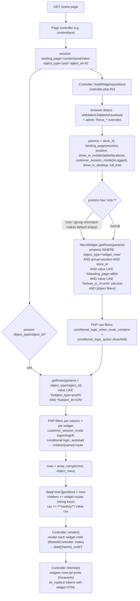
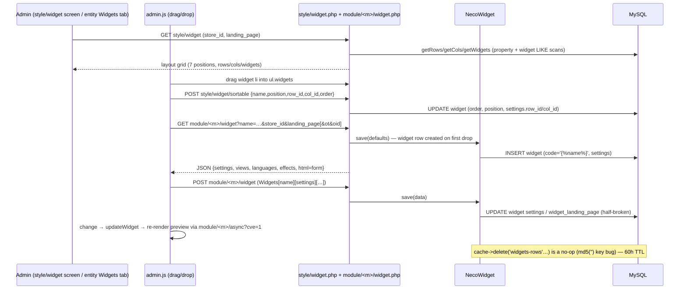

# 3-a-2 — Widget System Deep Dive (Legacy Necoyoad + necoyoad-next)

Research agent: Explore-widgets. Research-only — no repo modifications.
All file:line refs verified against source at `/home/z/necoyoad`.
Orientation: `docs/architecture/necoyoad_architecture_blueprint_v8_cms_widget_composition.tex` (890 lines) — read in full; claims re-verified against source. Several blueprint claims are **corrected** here (see A.8-F1, A.8-F2).
Cross-referenced (not re-derived): `/home/z/my-project/research/3a4-menus.md` (links widget, menu pipeline), `/home/z/my-project/research/3b1-templates.md` (§A.3 loadWidgets summary, §A.5 module controller, §B.5 next widget pipeline summary). This document is the widget-domain authoritative deep-dive.

**Mission-premise correction (important):** the legacy DB has **no `widget_row` / `widget_column` tables**. Those tables exist only in the Laravel rewrite (`necoyoad-next`). In legacy, rows and columns are stored as rows of the polymorphic **`property` EAV table** (`object_type='widget_rows'` / `'widget_cols'`). Verified: `grep "CREATE TABLE ... widget"` in `necoyoad_db.sql` returns only `nts8sd4fd_widget` (L1516) and `nts8sd4fd_widget_landing_page` (L1535).

---

## PART A — LEGACY WIDGET SYSTEM (repo root `app/`, `system/`)

### A.1 Data model

#### A.1.1 `nts8sd4fd_widget` — the widget instance table (`necoyoad_db.sql` L1516–1527)

```sql
CREATE TABLE `nts8sd4fd_widget` (
  `widget_id` bigint(20) NOT NULL,        -- PK (AI, L2576)
  `store_id`   int(11)    NOT NULL DEFAULT '0',
  `code`       varchar(250) NOT NULL,     -- literal token '' (written by NecoWidget::save, L685)
  `name`       varchar(250) NOT NULL,     -- unique instance name; the  token key
  `extension`  varchar(50)  NOT NULL,     -- module slug e.g. 'banner', 'product_list'
  `position`   varchar(50)  NOT NULL,     -- layout zone: header|featuredContent|column_left|main|column_right|featuredFooter|footer
  `app`        varchar(50)  NOT NULL,     -- 'shop' (mobile app 'm' never writes widgets)
  `order`      int(2)       NOT NULL,     -- sort inside column
  `settings`   text         NOT NULL,     -- PHP serialize() blob (stdClass or array)
  `status`     int(1)       NOT NULL
) ENGINE=MyISAM;
```

No data rows in the dump (`grep -c "INSERT INTO ...widget"` = 0) — the demo store ships with zero widgets configured.

#### A.1.2 `nts8sd4fd_widget_landing_page` (L1535–1540)

```sql
CREATE TABLE `nts8sd4fd_widget_landing_page` (
  `widget_landing_page_id` int(11) NOT NULL, -- PK (AI)
  `widget_id` int(11) NOT NULL,
  `landing_page` varchar(150) NOT NULL,      -- route string or 'all'
  `object_type` varchar(255) NOT NULL        -- declared but never written by any code path
) ENGINE=MyISAM;
```

**Half-maintained table:** written by `NecoWidget::save()` (`system/helper/widgets.php` L674–681, L695–697) but the admin widget form posts `landing_page` inside `settings` (hidden input `Widgets[<name>][settings][landing_page]` = `'landing_page=all'`, `app/admin/view/templates/default/shared/widget_form_main.tpl` L17), so `$data['landing_page']` at top level is **unset** on the normal POST path (`app/admin/controller/module/widgetcontroller.php` L316–324 builds `$data` from `post['Widgets'][name]` + name/position only). Consequences: on UPDATE the foreach at L676 iterates a nonexistent key (skipped); on INSERT L697 interpolates an undefined index (PHP 8.1 warning, empty string inserted). Meanwhile the **storefront** (`NecoWidget::getWidgets`) never reads this table — it filters on the `settings` blob via `LIKE '%landing_page=...'`. Only the **admin** `ModelStyleWidget::getWidgets` reads it (`app/admin/model/style/widget.php` L333–336: `w.widget_id IN (SELECT widget_id FROM widget_landing_page WHERE landing_page=... OR landing_page='all')`). Two divergent landing-page mechanisms for the same concept. (See finding A.8-F4.)

#### A.1.3 `nts8sd4fd_property` — rows & columns live here (L1119–1130)

```sql
CREATE TABLE `nts8sd4fd_property` (
  `property_id` int(11) NOT NULL,
  `store_id`  int(11) DEFAULT NULL,
  `object_id` int(11) NOT NULL,            -- random mt_rand(1,99999999) filler (widgets.php L730, L756)
  `object_type` varchar(100) NOT NULL,     -- 'widget_rows' | 'widget_cols'
  `group`     varchar(100) NOT NULL,       -- the layout POSITION name ('main', 'header', …)
  `key`       varchar(100) NOT NULL,       -- row_id / col_id (DOM ids like 'r123'/'c456')
  `value`     text NOT NULL,               -- PHP serialize() of settings array
  `order`     int(11) NOT NULL,            -- sort of row within position / col within row
  `date_added` timestamp DEFAULT CURRENT_TIMESTAMP
) ENGINE=MyISAM;
```

Nesting: a **row** = one `property` row (`object_type='widget_rows'`, `group=<position>`). A **column** = one `property` row (`object_type='widget_cols'`, `group=<position>`) whose serialized `value` contains `row_id=<row key>` (matched by `p.value LIKE '%row_id=…%'`, `system/helper/widgets.php` L570–572). A **widget** = one `widget` table row whose serialized `settings` contain `row_id=`/`col_id=` strings (matched by `settings LIKE '%row_id=…%'`, L180–186). There are **no foreign keys** — the tree is stitched purely by LIKE scans over serialized blobs. `object_to_store` (L674) is NOT used by widgets (widgets scope by their own `store_id` column; rows/cols by `property.store_id`).

#### A.1.4 The `filter_*` serialized-string convention (the key to the LIKE engine)

`ControllerStyleWidget::saveRow` (`app/admin/controller/style/widget.php` L203–231) and `saveCol` (L233–262) take the admin form query-string, `parse_str` it, and then **duplicate every setting** into a `filter_<k> => '<k>=<v>'` string:

```php
foreach($data['settings'] as $k=>$v) { $data['settings']['filter_'.$k] = $k .'='. $v; }   // L211-213
if (isset($data['row_id']))       $data['settings']['filter_row_id'] = 'row_id='. $data['row_id'];        // L215-216
if (isset($data['landing_page'])) $data['settings']['filter_landing_page'] = 'landing_page='. $data['landing_page']; // L219-220
...
```

So the stored serialized `value` of a row contains, e.g., `s:20:"filter_landing_page";s:16:"landing_page=all";` **and** `s:12:"landing_page";s:4:"all";`. The SQL engine (`getRows`/`getCols`) matches only the `filter_*` **string values** via `p.value LIKE '%landing_page=all%'`, `'%show_in_mobile=on%'`, `'%object_type=post%'`, etc. Widget-level settings follow the same idea but store the prefixed string directly in the setting itself (`settings->landing_page = 'landing_page=all'`, widgetcontroller.php L417/L427; hidden input value already contains the prefix, widget_form_main.tpl L17), which is why `getWidgets` uses `settings LIKE '%landing_page=all%'` and `'%showonmobile%'` (widget form key is `showonmobile`, no `_in_`, no `=on` — `widget_form_general.tpl` L19).

**Language scoping: none at tree level.** Rows/cols/widgets carry no language dimension; language is applied *inside* widget modules (e.g. richtext picks `settings['descriptions'][config_language_id]['description']`). The next rewrite adds `languageId` to the cache key only (B.3).

### A.2 The query engine — `final class NecoWidget` (`system/helper/widgets.php`, 786 lines)

Loaded via `$load->helper('widgets')` (`system/engine/controller.php` L489). Constructor (L20–31) takes `($registry, $route='all', $app='shop')`: `$this->landing_page = $route` (the **current route**, used for `conditional_logic_when_route_contains` matching), `$this->app = $app`. Grabs config/customer/user/cache/db/hooks from registry. (Note: the task brief said "system/classes/module.php (NecoWidget class)" — `system/classes/module.php` is the `Module` base class (see A.4.1); NecoWidget lives in `system/helper/widgets.php`.)

Methods:

| Method | Lines | Purpose |
|---|---|---|
| `getRoutes()` | 33–121 | Static map of landing-page route strings grouped for the admin dropdown: Home (`common/home`), Account (20 routes), Cart/Checkout (2), Manufacturers (3), Categories (3), Products (4 incl. `store/product/quickviewjson`), Listing (`store/search`), Specials, Content Pages, Post Categories, Posts, Pre-built (`page/sitemap`, `page/deprecated`). Extensible via `hooks->applyFilters("widgetsRoutes", …)` (L118). This is the admin "Landing Page" selector source. |
| `getWidget($name, $useCache)` | 123–147 | Single row from `widget` by `name`. Cache prefix `widgets.widget.<name>`, key `+ STORE_ID + _ + config_store_id`. |
| `getWidgets($position, $useCache=true)` | 149–256 | Flat widget list per position (legacy pre-rows mode). Accepts array `$data` or string position. Criteria: `w.position = <pos|'main'>`, `w.app = $this->app` (hardcoded 'shop'), `settings LIKE '%row_id=…%' / '%col_id=…%'`, device via `settings LIKE '%showonmobile%' / '%showontablet%' / '%showonfacebook%' / '%showondesktop%'` (L188–202), `'%async=on%'` (L213–215), landing page `(settings LIKE '%landing_page=all%' OR …'%landing_page=<route>%')` (L217–222), store (`w.store_id` — with special-case: `object_type == 'banner_item'` forces `store_id = 0`, L224–228), object filter `settings LIKE '%object_type=<t>%'` / `'%object_id=<id>%'` **or** `NOT LIKE '%object_type%'` / `NOT LIKE '%object_id%'` for the default tree (L230–240). `customer_session_mode` SQL criteria are **commented out** (L203–211) — session filtering for widgets happens in PHP later. Cache prefix `widgets.widgets.<app> <position> <lp> <store> <ot> <oid>`. |
| `getRows($data, $useCache=true)` | 258–536 | **The tree engine.** Queries `property` with `object_type='widget_rows'`, `store_id`, `group=<position>` (L279–288), landing page `(value LIKE '%landing_page=all%' OR '%landing_page=<lp>%')` (L290–295), `value LIKE '%app=<app>%'` (only if `data['app']` set — storefront `loadWidgets` does **not** set it, so rows are not app-filtered on the storefront, L297–299), device `value LIKE '%show_in_mobile=on%' / '%show_in_tablet=on%' / '%show_in_facebook=on%' / '%show_in_desktop=on%'` (L301–315), customer session (see bug F2), `'%async=on%'` (L323–325), object filter `value LIKE '%object_type=…%' / '%object_id=…%'` with `NOT LIKE` fallback (L327–337). `ORDER BY order ASC`. When `data['full_tree']` set (L345+): unserializes each row, applies row-level `conditional_logic_*` in PHP (L351–392: explode `conditional_logic_when_route_contains` on commas; `conditional_logic_action` 'show' keeps row only if current route contains a word; 'hide' keeps only if route does NOT contain it; empty word or `'any'` disables the rule), recurses `getCols()` per row (L409), per-column conditional logic again (L417–457), and per-widget PHP filters: `customer_session_mode` logon/logoff removal (L462–474), widget conditional logic (L477–516), and — only when `settings['autoload']` — collects `$row['children'][$w['name']] = $settings['route']` (widget child route for `Controller::children`) and `$row['widget'][$w['name']] = $w` (raw DB row), plus `Events::emit("loadWidget", …)` (L518–523). Cache: prefix `widgets.rows.<app> <lp> <store> <ot> <oid>`, id `+ STORE_ID + serialize($data) + config_store_id`, bypassed when `$user->getId()` (L272). |
| `getCols($data, $useCache=true)` | 538–657 | Same pattern for `object_type='widget_cols'`: `store_id`, `group=<position>`, `key=<col_id>`, **`value LIKE '%row_id=<row key>%'`** (L570–572) — this is the row→column link, landing page (L574–579), device/session/async/object criteria identical to getRows, `ORDER BY order`. With `full_tree`, recurses into `getWidgets()` per column (L648). Cache prefix `widgets.cols.…`. |
| `save($data)` | 659–718 | Upsert into `widget` by `name`: UPDATE position/order/settings (L668–673) or INSERT with `code = ''` (L683–693). Rewrites `widget_landing_page` (see A.1.2). Cache deletes use `widgets.widgets.`/`widgets.rows.`/`widgets.cols.` prefixes built with **spaces** (L700–716) — see cache-invalidation finding F3. |
| `saveRow($data)` / `saveCol($data)` | 720–744 / 746–771 | DELETE + INSERT of the `property` row (key = row_id/col_id; `object_id` = `mt_rand(1,99999999)`; group = position; value = `serialize($settings)`; note double-escaping `'` → `\'` after `db->escape` (L735, L761) — serialized strings containing quotes get corrupted). Cache delete same broken-prefix style. |

**Engine cost:** every storefront page fires `getRows` (1 query) + N×`getCols` (one per returned row!) + ΣM×`getWidgets` (one per column!) — i.e. **1 + rows + columns queries** per position, ×2 when a per-object override is active, ×N positions (up to 7 per page). Each is a full-table `LIKE '%…%'` scan over MyISAM with no usable index. First-hit results are file-cached for guests (cache semantics in A.8-F3).

### A.3 `Controller::loadWidgets()` — the composition entry point (`system/engine/controller.php` L453–715)

Signature (L453): `loadWidgets($position, $landing_page = 'all', $app = 'shop', $full_tree = true)`.

1. **Hook short-circuit** (L464–472): `runHook("loadWidgets", [position, landing_page(session or arg), app, full_tree])` — a hook returning truthy replaces the entire pipeline.
2. **Device/customer detection** (L474–487): `browser->isMobile/isTablet/isFacebook`, `customer->isLogged`. Admin force-overrides via GET: `?force_mobile=1`, `?force_tablet=1`, `?force_facebook=1`, `?force_customer_session=1` (admin-only, L484–487).
3. **NecoWidget instantiation** (L489–490): `new NecoWidget($registry, $this->Route)` — current Route becomes the conditional-logic matcher.
4. **Full-tree branch** (`$full_tree` true — the only mode used in practice; no caller passes false):
   - Params (L494–505): `store_id=STORE_ID`, `landing_page=session('landing_page')`, `position`, `show_in_mobile/tablet/facebook` (device booleans), `customer_session_mode` (login boolean), `conditional_logic_when_route_contains` (the Route — only used by NecoWidget indirectly via its constructor arg), `show_in_desktop`, `full_tree`.
   - `trigger("beforeLoadWidget", $params)` (L508).
   - **`only:` check (L510): `if (!strpos($position, 'only:'))`** — see finding F1: for a well-formed `'only:main'`, `strpos` returns 0 → `!0` is true → the default-tree branch **executes**. The intended skip never happens; the default tree is instead emptied *accidentally* because `getRows` queries `p.group = 'only:main'` which matches nothing. Net effect matches the blueprint's description ("embedded pages show only per-object widgets") but through group-name mismatch, not through the strpos guard.
   - Default tree (L512–566): `getRows($params, !$user->getId())` (cache for guests only). For each row: merges `$row['children']` (widget routes, **string keys**) into `$this->children` and `$row['widget']` into `$this->widget`; minifies and inline-injects row CSS into `$this->css` keyed by row key with `/**{key}**/…/** /{key}**/` markers (L527–543); same per column (L545–565); filters `rowcss`/`columncss` (L542, L564).
   - **Per-object override** (L569–629): if `session('object_type'|'object_id')` set — strips `only:` (L570), sets `$widgets->object_type/object_id`, re-runs `getRows`, merges children/widgets/CSS the same way, then `$rows = array_merge($rows, $_rows)` (L629).
   - Publishes `$this->data['rows'][$position] = $rows` (L630) — **note**: if the per-object session branch ran, `$position` was reassigned to the stripped name (L570); otherwise rows are stored under the raw name (with `only:` if present) — template `$position='main'` would then miss (embedded pages always set object session, so this is benign in practice).
5. **Flat branch** (L631–714, `full_tree=false` — **dead in practice**, no caller): iterates `getWidgets($position, $app)` (2nd arg is actually `$useCache`! see F6), applies PHP `customer_session_mode` skip (L636–646), device check `showonmobile`/`showondesktop` (L649), registers `$this->children[$widget['name']] = $settings['route']` and `$this->widget[...]` only when `settings['route']` exists (L648), builds a synthetic rows array for the template (L652–657), per-object loop repeats (L669–712).

**Call sites** (all verified):
- Every content/store/checkout/account page controller calls the trio `loadWidgets('featuredContent'|'main'|'featuredFooter')` after setting `session('landing_page', '<route>/index')` and `session('object_type'/'object_id')` — e.g. `app/shop/controller/content/post.php` L70–73, `content/page.php` L90–93 (index) and L154–157 (embed, with `only:`), `store/product.php` L154–157, `common/home.php` L34–37 (landing_page `common/home`, no object), `common/maintenance.php` L17–20, `checkout/cart.php` L34–37, `page/sitemap.php` L61–64, `rooms/account.php` L40–43, plus error404/all variants.
- `common/column_left.php:5` → `loadWidgets('column_left')`; `common/column_right.php:5` → `column_right`; `common/footer.php:104` → `footer`; `common/header.php:158` → `loadWidgets('header', 'shop', true)` (the `'shop', true` args land in `$landing_page`/`$app` — `$app=true` is never consumed by the full-tree branch; effectively dead args, F10).
- The **7 positions** are exactly: `header, featuredContent, column_left, main, column_right, featuredFooter, footer` — hardcoded in the admin layout manager (`app/admin/view/templates/default/style/widget.tpl` L73–168) and in next's `config/necoyoad.php` L52–60.

### A.4 Storefront rendering flow

#### A.4.1 Module base class (`system/classes/module.php`, 107 lines)

`class Module extends Controller`: constructor derives `$this->moduleRoute = 'module/' . strtolower(class minus 'controllermodule')` and calls `loadDeps($this->moduleRoute)` (L10–11). `loadDeps($route)` (L22–62) consumes route-scoped asset declarations (`$this->js_assets`, `js_header_assets`, `jsx_assets`, `css_assets` — arrays keyed by asset path with route whitelist or `'*'`) pushing into Registry accumulators `javascripts`/`header_javascripts`/`scripts`/`styles`. `loadWidgetAssets($filename, $subfolder, $async)` (L64–106) calls `_loadAssets` then, in async mode, rewrites DIR paths back to HTTP URLs (so the JSON payload contains usable URLs; cf. 3b1 §A.5).

#### A.4.2 Widget child dispatch & token substitution (`system/engine/controller.php`)

- `Controller::render()` (L203–316): iterates `$this->children` (numeric keys = layout children like `common/header`; **string keys = widget children**). For each child (L249–285): builds `Action`, instantiates the module controller, and **`$params = isset($this->widget[$key]) ? $this->widget[$key] : $this->getChildParams($child)`** (L263) — i.e. the widget child receives the raw `widget` DB row (the `$widget` argument of `ModuleController::index`). Output stored as `$this->data[$key . '_code']` (string key) or `$this->data[$controller->id]` (numeric key) (L280–285).
- `Controller::fetch($filename)` (L318–392+): `extract($this->data)` + `require($file)` (L350–354), then **token substitution** (L356–374): two passes of `str_replace('', $this->data[$key . '_code'], $content)` for every string-keyed child (the first pass unsets matched children; second pass catches str_replace overlap cases). Unsubstituted `` tokens remain as literal text (manual-mode hazard, blueprint v8 §6.2 — verified: no fallback stripping exists).
- Per-row/column/widget inline CSS accumulates in the Registry `css` array with `/**{key}**/` markers; header drains it into `<style>` (cf. 3b1 §A.7; controller.php L537–540, `common/header.php` L334–377).

#### A.4.3 The scaffolding templates (`app/shop/view/theme/choroni/shared/`)

- **`widgets-rows.tpl`** (24 lines, verified verbatim): for each `$rows[$position]` row (skip empty `key`), `unserialize($row['value'])` → wrapper `<div data-row="{key}" data-position="{position}" [data-sticky="1"] class="row[ container if layout_width==fixed][ classnames]" id="{position}_{key}" nt-editable>` (L7); columns → `<div data-column="{key}" data-position class="large-{grid_large} medium-{grid_medium} small-{grid_small}[ classnames]" id="{position}_{key}" nt-editable>` (L15); `<ul class="widgets">` emitting `` per widget (L17).
- `widgets-featured.tpl` / `widgets-featured-footer.tpl`: set `$position='featuredContent'`/`'featuredFooter'` + include widgets-rows inside `#featuredContentContainer`/`#featuredFooterContainer`.
- `widgets-column-center.tpl`: Foundation-style responsive width `large-6|9|12` depending on which side columns have content; `$position='main'` + include.
- `widgets-column-left/right.tpl`: echo rendered `$column_left`/`$column_right` child output.
- `widgets-common.tpl`: featured + breadcrumbs + conditional left + center + conditional right + featured-footer (the universal inner-page scaffold; home.tpl still inlines the same includes — the refactoring scar, blueprint v8 §8.2).
- **`widget-head.tpl`** (63 lines) — the widget wrapper contract. Throws `Exception("FATAL ERROR: The index module is not set for ". $settings['route'])` if `settings['module']` missing (L2). Emits (L16–43):
  ```html
  <li data-necotienda_module="{settings.module}"
      data-landing_page="{settings.landing_page minus 'landing_page=' prefix}"
      data-widget="{widgetName}"
      nt-editable="1" movable="1" removable="1" configurable="1"
      class="box {module}-widget[ {settings.class}][ shrinkable]"
      id="{widgetName}"
      [style="position:absolute;z-index:9;top:{offsetY};left:{offsetX}"]
      [data-sticky="1"] [data-shrink="{shrinkable_width|200}"]
      [data-animate] [data-repeat="1"] [data-async="1"]
      [data-transition_{i}_effect|delay|duration|beforeStart|onStart|onStop="…"]>
  ```
  plus a conditional `<div class="container"[ style="display:none;" when transition_active]>` opener when `layout_width==fixed` or transitions active (L45–63).
- **`widget-footer.tpl`** (5 lines): closes the conditional `</div>` + `</li>`.
- The `data-async="1"` attribute (from `settings['transition_async']`, widget-head.tpl L39) is **not consumed by any storefront JS in the legacy tree** (verified: `grep -rln "data-async" web/ app/shop/view/` only matches widget-head.tpl). In legacy it is a CSS/animation hint only; the *admin* visual editor is the only consumer of the async endpoint (A.7). (The next rewrite repurposes it as a true lazy-load flag — a semantic trap already flagged in 3b1 §B.7.)

#### A.4.4 Composition modes (verified against source)

1. **Dynamic (default):** admin-configured tree in `property`+`widget` → `loadWidgets` → children registered → `widgets-rows.tpl` emits tokens → `fetch()` substitutes.
2. **Manual:** template authors write `` directly (e.g. `error/not_found.tpl:12`); requires the widget instance to exist with that name (else literal token leaks to HTML — blueprint v8 findingbox, confirmed by the str_replace-only substitution).
3. **Hybrid:** e.g. `content/landing_page_necotienda.tpl` — `widgets-common.tpl` dynamic area + hardcoded SVG sections after it (blueprint v8 §6.3, file verified).

### A.5 Admin widget management

#### A.5.1 `ControllerStyleWidget` (`app/admin/controller/style/widget.php`, 374 lines)

- `index()` (L26–132): the **Style → Widgets layout manager screen**. Enumerates installed widget-capable modules via `glob(DIR_APPLICATION . "controller/module/*")` filtered on `file_exists($module . '/widget.php')` (L31–48); loads stores; reads `store_id`/`landing_page` from query (default 0/'all'); builds the row/col/widget tree via `modelWidget->getRows` → `getCols` → `getWidgets` (L63–96) — note: admin model's `getWidgets` is called **per column** with `position => $row['group']`, `col_id`; renders `style/widget.tpl`.
- `load()` (L134–201): **per-entity widget editor payload** — requires `?oid`; accepts `ot`/`oid`/`store_id`/`landing_page`; fetches full tree with object filter (`getRows(..., false)` no-cache); renders `common/form_widgets.tpl`. Called from entity edit screens' "Widgets" tabs (A.5.4).
- `saveRow()` / `saveCol()` (L203–262): parse the row/col settings form (`parse_str` after `&amp;`→`&`), build the `filter_*` duplicates (A.1.4), delegate to `NecoWidget::saveRow/saveCol`.
- `delete()` (L269–277, by widget name), `deleteRow()` (L284–293, strips leading `#` from `row_id`), `deleteColumn()` (L300–309) → admin model deletes (which cascade via LIKE, see below).
- `sortable()` / `sortrow()` / `sortCol()` (L316–344) → model `sortWidget`/`sortRow`/`sortCol`.
- `getalljson()` (L346–372): JSON list of widget-capable modules for the drag panel.

#### A.5.2 `ModelStyleWidget` (`app/admin/model/style/widget.php`, 788 lines)

- `$table='widget'`, `$object_type='widget'`, fields map (L14–53), `$relations = ["stores"]` (L55 — base-Model relation, unused in practice).
- `deleteRow($id)` (L85–103): cascades by **LIKE on the serialized settings** — deletes `widget_landing_page` rows for widgets whose settings contain the row id, `widget` rows containing it, `property widget_cols` containing it, and the `widget_rows` property by key. `deleteColumn($id)` (L113–132) similar (note duplicated widget_cols DELETE — copy-paste, L123–129).
- `getByName($name)` (L179–202) returns the widget row + `landing_pages` from the `widget_landing_page` table.
- `getAll($data)` (L212–299): grouped-by-position list with LIKE filters (row_id/col_id/device flags/async/object_type/object_id) + `getLandingPages` per widget.
- `getWidgets($position)` (L301–398): the **table-based landing-page mechanism** (subquery on `widget_landing_page`, L333–336) + `w.store_id` + LIKE filters on settings (device keys here use the `show_in_mobile=on` form, L352–366, unlike NecoWidget's `showonmobile` form — the two engines use **different device-key spellings**, matching their respective form writers).
- `getRows` (L406–518) / `getCols` (L519–639): admin mirrors of NecoWidget's tree queries (same LIKE criteria; the admin variants additionally accept `position`/`row_id` filters and skip the `app` filter).
- `getRoutes()` (L400–404): delegates to `NecoWidget::getRoutes()`.
- `sortWidget($data)` (L726–748): per widget — unserializes settings (as **object**, `$settings->row_id = …` — note widgets saved via the admin form are stored as stdClass thanks to widgetcontroller L320–324), rewrites row_id/col_id/position/order, UPDATE by name; cache delete `widgets-*` prefixes (broken, F3).
- `sortRow` (L757–767) / `sortCol` (L776+): UPDATE `property` order/group by key.

#### A.5.3 The visual layout manager UI

- **`style/widget.tpl`** (174 lines): store selector + landing-page `<select>` (grouped by `getRoutes()`), left palette `#widgetsPanel` (`.neco-widget` items with `data-widget=<module>`), and **7 position zones** (`<ul class="widgetRowsWrapper" data-position="header|featuredContent|column_left|main|column_right|featuredFooter|footer">`), each rendering rows via `shared/row_widget_form_main.tpl` with "Add Row" buttons.
- **`shared/row_widget_form_main.tpl`** (70 lines): row box `<li class="row widgetRow widgetBox" id="{row_id}">` with header (internal name, `[mover]`, id, settings submenu) and General/Style htabs; "Add Column" button; columns via `col_widget_form_main.tpl`; `memoizeRows()` dedupe (defined in `style/widget_helpers.tpl`).
- **`shared/col_widget_form_main.tpl`** (66 lines): column `<div class="grid_{grid_large} widgetColumn widgetBox">`, `<ul class="widgetWrapper ui-sortable" id="{col_id}_widgets">`, each widget `<li class="widgetSet" id="{widget name}">` + `loadNtWidgets({name, position, extension, order})` bootstrap script; "Mover"/"Eliminar" buttons.
- **Row settings form** (`shared/row_widget_form_general.tpl`, 75 lines): `internal_name`, `show_in_mobile`, `show_in_tablet`, `show_in_desktop`, `show_in_facebook` (checkboxes), `sticky`, `layout_width` (fluid|fixed), `customer_session_mode` (any|logon|logoff), `conditional_logic_action` (show|hide), `conditional_logic_when_route_contains` (comma list). Style tab (`row_widget_form_style.tpl`) = per-row CSS (Ace editor).
- **Column settings form** (`shared/col_widget_form_general.tpl`, 103 lines): same + `grid_large`/`grid_medium`/`grid_small` selects (1–12, default 12).
- **The drag/drop engine** (`web/admin/js/frontend/admin.js`, 2468 lines):
  - `initSortable` (L1979–2021): `$("ul.widgets").sortable({ connectWith: 'ul.widgets', handle: '.move', receive: … loadWidgets(module, widgetName, landing_page, 1), update: … })` — on update, builds a `postData` map of **every** `[data-widget]` element: `{name: id, position: closest('[data-row]').data('position'), row_id, col_id, order: index+1}` and POSTs to `style/widget/sortable` (L2000–2013). This is how widgets move between rows/columns/positions.
  - `loadWidgets(moduleName, widgetName, landing_page, w, fromAdmin)` (L2023+): fetches the widget **form** JSON from `createAdminUrl('module/<module>/widget')` with `store_id`, `landing_page`, optional `ot`/`oid` globals (per-entity mode); then `renderWidget()` fetches the **live preview** via `createUrl('module/<module>/async', {…, cve:1})` and injects returned html/css/scripts into the editor panel; `bindFormWidget` (L2274–2336) auto-saves on change (checksum-diffed serialize → `updateWidget` POSTs the form to `module/<module>/widget`); `deleteWidget` (L2354–2358) → `style/widget/delete?name=<id>` + DOM removal.
  - Row/column CRUD (`addRow`, `addColumn`, `removeRow`, `removeColumn`, `updateRowUI`, `updateColUI`, `rowSortableUI`, `colSortableUI`, `initDragNDrop` — referenced from templates, e.g. form_widgets.tpl L364–369) persists through `style/widget/saveRow|saveCol|deleteRow|deleteColumn|sortrow|sortCol` (URLs wired into the storefront header for the inline editor: `common/header.php` L113–156 sets `url_widgets_save|savecol|saverow|sortable|sortrow|sortcol|delete|deletecolumn|deleterow` — cross-ref 3b1 §A.7).

#### A.5.4 Widget configuration forms (per module)

- **`ControllerWidgetController`** (`app/admin/controller/module/widgetcontroller.php`, 483 lines) — the modern form provider. Each module's `<module>/widget.php` extends it (67 modules have `widget.php`; only `social` and `web_content_crawler` admin modules lack it). `index($widget=null, $render=false)` (L168–462):
  - Requires `?name=` (the widget instance name; L177).
  - **GET (form)**: builds defaults for a NEW widget (L407–435): `route='module/<name>'`, `autoload=1`, `showonmobile=1`, `showondesktop=1`, `view='default'`, `customer_session_mode='any'`, `conditional_logic_action='show'`, `landing_page='landing_page=all'` (+ optional `object_type=`/`object_id=`/`row_id=`/`col_id=`/`offsetX=`/`offsetY=` prefixed strings from GET) and **immediately saves** the widget row (`$widget->save($data)`, L438) — i.e. dropping a widget into the layout creates the DB row with defaults before the form is even shown. Then loads `modelWidget->getByName` for existing widgets (L386–405), enumerates the module's view variants via `glob(DIR_CATALOG . 'view/theme/<theme>/module/<module>_*.tpl')` (L356–361), the module's CSS/JS asset files (L366–377), languages, and the full **animate.css effect catalog** (L185–305). Applies the `widget:settings` filter seam (L444) — each module's `init()` adds data (e.g. banner loads all banners). Renders `module/<module>/widget.tpl` and returns everything as JSON `{...data, html}` (L448–461).
  - **POST (save)**: reads `post['Widgets'][<name>]`, converts `settings` array → stdClass, deletes widget caches (`widgets-rows|cols|widgets|widget-<name>`), `NecoWidget::save($data)` (L313–336).
  - `async()` (L464–483): admin-side re-render: `NecoWidget(registry, route)->getWidget(name, false)` → `index($widget, true)`.
- **`widget_common.php`** (276 lines): the older include-based twin of the same logic (used only by `module/post_author/widget.php` which `include`s it inside a plain `Controller` class).
- **Form template contract** (`module/<module>/widget.tpl` → `shared/widget_form_main.tpl`, 58 lines): a `<form id="{name}_form">` with 5 htabs — **General** (`widget_form_general.tpl`), **Data** (module-specific `widget_form_data.tpl`), **Transitions** (`widget_form_effects.tpl`), **Style** (`widget_form_style.tpl`), **Editor** (`widget_form_editor.tpl`) — plus hidden fields `Widgets[<name>][settings][landing_page|route|object_type|object_id|row_id|col_id|offsetY|offsetX]` (L17–42).
  - **General tab** (133 lines): `title`, `autoload`, `showonmobile`, `showontablet`, `showondesktop`, `showonfacebook`, `sticky`, `shrinkable` + `shrinkable_width` (default 200), `layout_width`, `customer_session_mode`, `conditional_logic_action`, `conditional_logic_when_route_contains`, and the **View** variant `<select>` populated from the globbed `module/<module>_<view>.tpl` files (L123–133). (When `offsetY` is set — absolutely-positioned widget — most controls are replaced by hidden defaults, L114–121.)
  - **Transitions tab**: `transition_active`, `transition_repeat`, `transition_async`, and a repeater `transitions[i][effect|delay|duration|beforeStart|onStart|onStop]` using the animate.css catalog.
  - **Style tab**: per-widget CSS in an Ace editor, saved as `settings['style']` (injected with `/**{widgetName}**/` markers by `ModuleController::index` L200–213).
  - **Editor tab**: lists/creates the module's view `.tpl` files, CSS and JS files (`addWidgetFile` → `style/editor/file` unsafe editor — cross-ref 3b1 theme editor findings) — this is the in-admin "create a new view variant" workflow.
- **Module-specific data tabs** (examples): banner (`module/banner/widget_form_data.tpl` — banner select), links (menu select, cross-ref 3a4 §3), product_list, search, etc.

#### A.5.5 The landing_page concept (summary)

1. **Route name of the current page**, set in session by every storefront controller (`session('landing_page','content/post/index')` etc. — 30+ call sites verified; note `common/home` has no `/index` suffix).
2. **Widget filter dimension**: widget `settings['landing_page']` = `'all'` or a route string (from `getRoutes()` map); matched via serialized-blob LIKE (storefront) or `widget_landing_page` table (admin).
3. **`NecoWidget::getRoutes()`**: the admin-selectable catalog of landing pages (route strings → language keys), filterable via the `widgetsRoutes` hook.
4. `Controller::loadWidgets` 2nd parameter `$landing_page` is only a fallback for the hook payload (session value wins).

### A.6 Legacy widget type inventory

**67 storefront module controllers** under `app/shop/controller/module/` (each `ControllerModule<X> extends ControllerModuleModuleController` with `$moduleName`; `modulecontroller.php` excluded). Grouped:

| Group | Modules (controller file → purpose) |
|---|---|
| **Catalog – product** | `product_list` (multi-source product grid: `settings['module']` selects random/latest/featured/bestseller/recommended/related/popular/special — see F8; `dynamic` mode follows `?category_id`/`?manufacturer_id`; pagination + endless scroll + search-results reuse) • `product_overview`/`product_title`/`product_description`/`product_images`/`product_price`/`product_model`/`product_stock`/`product_attributes`/`product_tags`/`product_tabs` (product-detail-page fragments rendered as widgets on `store/product`) • `product_order_form` (order form widget) • `product_filter_attributes` (attribute filter box) |
| **Catalog – category/manufacturer** | `category_list` (grid/tree of categories; `defaults` width/height from `config_image_category_*`) • `category_overview`/`category_title`/`category_description`/`category_image` • `manufacturer_list`/`manufacturer_name`/`manufacturer_image` |
| **CMS – posts/pages** | `post_list` (featured/latest posts; carousel/slider variants) • `post_overview`/`post_title`/`post_description`/`post_image`/`post_author`/`post_date_published` • `post_category_list`/`post_category_overview`/`post_category_title`/`post_category_description`/`post_category_image` • `page_overview`/`page_title`/`page_description`/`page_image` |
| **Content widgets** | `richtext` (per-language HTML via `settings['descriptions'][lang]['description']` **or** CMS page embed via `content_type='post_id'` + `ControllerContentPage::embed()` — richtext.php L20–32) • `plaintext` (bare module, no init) • `image` (single image w/ width/height) • `separator` • `link_button` • `links` (menu widget — 12 view variants; cross-ref 3a4) • `plugin_template` (renders an arbitrary theme template) • `redirect` (bare; `redirect_default.tpl`) • `forms` (bare; **no .tpl exists in theme** — dormant) |
| **Marketing / social** | `banner` (slider; template fully overridden per banner `jquery_plugin` → `banner/<plugin>.tpl`; cross-ref 3b1 §A.5 + blueprint v9) • `contact_form` (NecoWidget user — custom send flow) • `invitefriends` • `facebook_comments` • `fblike` • `google_analytics` (tracker snippet widget) • `google_maps` (**moduleName misdeclared as `'google_analytics'`** — F5) • `lightbox` (**moduleName misdeclared as `'invitefriends'`** — F5; also hijacks session landing_page to `content/page`, lightbox.php L34) |
| **Store chrome / account** | `store_logo` (device-aware: `config_mobile_logo` on mobile) • `store_title` • `store_phone` • `login_form` (default/dropdown variants) • `register_form` • `search` (search box + cached category/zone selects; search.php L34–60) • `currency_selector` • `language_selector` • `shopping_cart_box` (default/dropdown) • `shopping_cart_checkout` (5-step checkout widget: `default_step_1..5` + `steps_control` variants) • `comments` • `reviews` (both bound to current product/post via `ot`/`oid`) |
| **Rooms subsystem** | `rooms` (bare widget; the `rooms/account` page — customer "rooms"/spaces, template `module/rooms/account.tpl` + `account_menu/`) • `rooms_admin_table` |

**View variants** (from `app/shop/view/theme/choroni/module/` glob, 146 files): `product_list_{default,grid,list,carousel,slider}` • `post_list_{default,grid,list,carousel,slider}` • `category_list_{default,grid}` • `manufacturer_list_{default,grid}` • `post_category_list_{default,grid}` • `links_{default,main_menu,vertical,overheader,01..07,marketo}` (12) • `login_form_{default,dropdown}` • `shopping_cart_box_{default,dropdown}` • `shopping_cart_checkout_default_step_1..5` + `steps_control` • `product_tabs_{default,home,home_carousel}` • `link_button_{default,link}` • everything else `_default` only. The wrapper `module/<name>.tpl` includes the variant: `include("product_list_" . $settings['view'] . '.tpl')` (e.g. product_list.tpl:3; mechanism documented in 3b1 §A.5).

**Orphan templates** (no module controller): `share_buttons.tpl(+_default)`, `skype_me.tpl`, `slick.tpl`, `subscribe.tpl`, `promoter.tpl(+_default)`, `twitter.tpl`, `twitter_home.tpl`, `catalog2pdf.tpl`, `product_content_tabs.tpl` — dead view variants from removed/refactored modules.

**`app/modules/mymodule/`** — NOT a widget module: a scaffold "custom module" app (mini-MVC with its own `app/{admin,shop}/controller/home.php`, both containing the same `ControllerHome` with index/ping/login/permission/slug/loadiframe actions, a `var_dump($this->templatePath)` debug leftover, and `view/template/home.php`). It demonstrates the "drop-in module app" extension pattern, unrelated to the widget pipeline.

### A.7 Async widget rendering (legacy)

- **Endpoint**: `?r=module/<name>/async&w=<widgetName>` → `ControllerModuleModuleController::async()` (`app/shop/controller/module/modulecontroller.php` L296–314): `new NecoWidget($registry, query('route'))` → `getWidget($w, false)` (no cache) → `index($widget, true)`.
- **Render path** (`index($widget, $render=true)`, L236–259): clears Registry JS/CSS accumulators, renders HTML, `loadWidgetAssets($filename, null, true)` (DIR→URL rewrite), returns JSON:
  ```json
  { "id": "<widget name>", "settings": {...}, "javascripts": [...], "scripts": [...],
    "styles": [{"media":"all","href":"..."}], "css": {"<widgetName>": "/*inline css*/"}, "html": "<li …>…</li>" }
  ```
  (`moduleAsyncResponse` event emitted first, L256.)
- **`?cve` mode** (theme-editor preview, L272–293): template swapped to `choroni/module/theme_editor_placeholder.tpl` (widget-head/footer + "Open widget settings first for this module <b>{module}</b>" placeholder), same JSON payload (`moduleEditorResponse` event).
- **Consumers**: the **admin** visual editor (`admin.js` `loadWidgets`→`renderWidget` fetches `module/<name>/async?cve=1` for the live preview; the storefront `?theme_editor` inline mode uses the same URLs — `common/header.php` L113–156). **No storefront visitor-facing lazy loading exists in legacy** (the row/col `async` checkbox is never applied as a query filter — storefront `loadWidgets` never passes `async` in params, so the `value LIKE '%async=on%'` criteria in getRows/getCols is dead; and the widget-level `transition_async` only emits the `data-async="1"` attribute with no JS handler — A.4.3).

### A.8 Legacy findings (defects & quirks)

| # | Finding | Evidence |
|---|---|---|
| **F1** | **`only:` prefix skip is dead code.** `if (!strpos($position, 'only:'))` — for `'only:main'` strpos returns 0, `!0 === true`, so the default-tree branch still runs. The documented "skip default tree" behavior materializes only *accidentally*: the default query filters `p.group = 'only:main'` which matches no rows, so the default tree is empty. If a position group were ever literally named `xonly:main` (offset > 0), the skip would trigger — pure coincidence. Blueprint v8 §7.2's mechanism description is wrong even though the net behavior is right. | controller.php L510–512; widgets.php L282–284 |
| **F2** | **Row/column `customer_session_mode` SQL bug.** `else if (isset($data['customer_session_mode']) && !$data['show_in_desktop'])` — tests the wrong variable. Logged-out **desktop** visitors get no logon/logoff criteria → rows/cols gated `customer_session_mode=logon` render for them (only widgets are protected by the PHP-level check at L462–474; rows/cols have no PHP fallback). Mobile logged-out users are filtered correctly (by accident). | widgets.php L317–321 (rows) and L601–605 (cols) |
| **F3** | **Cache invalidation broken + 60h TTL.** `Cache::delete($prefix)` globs `<prefix>.md5($key)*` — with `$key=''` that's `md5('')` = `d41d8cd98f00b204e9800998ecf8427e`, matching nothing ever written (real keys are `md5(prefix.serialize(data).…)`). All `cache->delete('widgets-rows'|'widgets.widgets.'…)` calls (widgetcontroller L326–329, NecoWidget::save/saveRow/saveCol L707/743/769, model sortWidget L743–745) are no-ops. Entries expire only after `60*3600s = 60 hours`. Admins bypass cache (`user->getId()`), guests may see stale widget trees for up to 2.5 days after admin changes. | system/library/cache.php L14, L58–71; callers above |
| **F4** | **`widget_landing_page` dual mechanism.** Storefront filters landing pages via settings-blob LIKE; admin `getWidgets` via the table subquery; the table is only written on the insert path with an undefined index (A.1.2). Same concept, two sources of truth, one stale. | widgets.php L217–222 vs model L333–336; save L674–697 |
| **F5** | **moduleName copy-paste bugs**: `google_maps.php` declares `$moduleName='google_analytics'`; `lightbox.php` declares `$moduleName='invitefriends'`. Both modules therefore load the wrong module's language file, wrong deps route, and wrong template (`choroni/module/google_analytics.tpl` / `invitefriends.tpl` — google_maps.tpl exists but is unreachable through the module pipeline). | module controllers L7–8 each |
| **F6** | **`getWidgets` signature misuse**: flat-branch `loadWidgets` calls `$widgets->getWidgets($position, $app)` — 2nd param is `$useCache`, not app. (Dead path today, but a trap.) | controller.php L632; widgets.php L149 |
| **F7** | **Row/col "Async/Ajax" checkbox is inert** (never queried — `async` not in loadWidgets params) and **widget `transition_async` has no storefront JS consumer**. Legacy has no visitor-facing lazy widgets. | controller.php L494–505; widget-head.tpl L39; grep results A.4.3 |
| **F8** | **product_list func guard excludes two implemented sources**: `if (!$func || !in_array($func, array('random','latest','featured','recommended','related','popular'))) $func='random';` — the `bestseller` and `special` switch cases are unreachable. | product_list.php L66–67 vs L129–156 |
| **F9** | **No FK integrity**: tree stitched by LIKE over serialized blobs; `deleteRow` cascades can miss rows whose serialized string spacing/format differs (e.g. after the double-escape corruption in saveRow/saveCol L735/L761). | A.1.3 |
| **F10** | **`loadWidgets('header','shop',true)`** (header.php L158): args land in `$landing_page`/`$app`; `$app=true` unused in full-tree mode — the 'shop' landing_page fallback only matters if the session lacks landing_page (hook payload only). | controller.php L453, L464–469 |
| **F11** | **1+rows+cols queries per position** (plus object-override re-run) of full-scan MyISAM LIKEs — the perf motivation for next's JSON-column rewrite. | A.2 engine cost |
| **F12** | `mymodule` scaffold ships `var_dump()` debug output in both admin+shop controllers. | app/modules/mymodule/app/*/controller/home.php |

---

## PART B — NECOYOAD-NEXT WIDGET ENGINE (`necoyoad-next/`)

### B.1 Schema (`database/migrations/0001_01_01_000000_create_core_tables.php` L335–377)

```php
Schema::create('widget_rows', ...      // L336-346
    $table->id();
    $table->foreignId('store_id')->constrained()->cascadeOnDelete();
    $table->string('position', 50);    // layout zone (7 positions)
    $table->string('key', 100);        // row key (echoes legacy property.key)
    $table->json('settings')->nullable();   // {classnames, sticky, layout_width, show_in_*, customer_session_mode, ...}
    $table->integer('sort_order')->default(0);
    $table->boolean('status')->default(true);
    $table->timestamps();
    $table->index(['store_id', 'position']);
);
Schema::create('widget_columns', ...   // L350-357
    $table->foreignId('row_id')->constrained('widget_rows')->cascadeOnDelete();
    $table->string('key', 100);
    $table->json('settings')->nullable();   // {grid:{large,medium,small} | grid_large/…, classnames, …}
    $table->integer('sort_order')->default(0);
);
Schema::create('widgets', ...          // L361-376
    $table->foreignId('column_id')->constrained('widget_columns')->cascadeOnDelete();
    $table->string('name', 250);            // instance name (async endpoint key)
    $table->string('module', 50);           // 'banner' | 'product-list' | 'rich-text' | 'category-list' | 'contact-form' | 'links' | ...
    $table->foreignId('store_id')->nullable()->constrained()->nullOnDelete();
    $table->string('landing_page', 150)->default('all');  // REAL column now (was settings blob)
    $table->string('object_type', 50)->nullable();        // per-entity override, REAL column
    $table->foreignId('object_id')->nullable();
    $table->json('settings')->nullable();
    $table->integer('sort_order')->default(0);
    $table->boolean('status')->default(true);
    $table->index(['column_id', 'sort_order']);
    $table->index(['object_type', 'object_id']);
);
```

Key changes vs legacy: rows/columns get **real tables** (no more property EAV + LIKE); `landing_page` and `object_type/object_id` become **indexed columns**; settings become **JSON columns** queried via `settings->key` (still unindexed, but MySQL can use generated-column indexes; at minimum the SQL is structured). Drop order: widgets → widget_columns → widget_rows (L800–802).

### B.2 Models (`app/Models/`)

- **`Widget.php`** (31 lines): `fillable = [column_id, name, module, store_id, landing_page, object_type, object_id, settings, sort_order, status]`; `casts = ['settings' => 'array', 'status' => 'boolean']`; `column(): BelongsTo`; accessor **`getComponentNameAttribute(): "widgets.{$module}"`** (L27–30) — e.g. module `product-list` → component `widgets.product-list`, which `<x-dynamic-component>` resolves to class `App\View\Components\Widgets\ProductList` (class exists) or falls back to the anonymous view `components/widgets/product-list.blade.php`.
- **`WidgetRow.php`** (31 lines): `table='widget_rows'`, fillable `[store_id, position, key, settings, sort_order, status]`, casts settings array + status boolean, `columns(): HasMany(WidgetColumn, row_id)->orderBy('sort_order')`, `store(): BelongsTo`.
- **`WidgetColumn.php`** (31 lines): fillable `[row_id, key, settings, sort_order]`, casts settings array, `widgets(): HasMany(Widget, column_id)->orderBy('sort_order')`, `row(): BelongsTo`. **No status column** (rows carry status, columns don't).
- No query scopes defined on any of the three models (the task brief's "scopes" expectation: none exist — all filtering lives in `WidgetService::queryTree`).

### B.3 `WidgetService` (`app/Services/WidgetService.php`, 193 lines)

- Constructor DI: `StoreContext`, `LanguageContext`.
- **`getTree(position, objectType=null, objectId=null, only=false)`** (L50–97):
  - Resolves `$storeId`, `$languageId`, `$route = request()->route()?->getName() ?? 'all'` (Laravel route names like `common.home`, `store.product` — the landing_page dimension), device booleans via **UA regex** (`isMobile()` L181–185: `/(android|iphone|ipod|ipad|windows phone|blackberry|mobile)/i`; `isTablet()` L187–191: `/(ipad|tablet|kindle|silk)/i` — note iPad matches mobile-first, so `isTablet` only fires for non-iPad tablets… actually `isMobile()` includes `ipad` too, so iPad → mobile, and `isTablet` can only be true when `isMobile` is false (kindle/silk/tablet without 'mobile'), making `isDesktop = !isMobile && !isTablet` behave; no `show_in_facebook` dimension and no admin force-override params), `$isLoggedIn = auth('customer')->check()`.
  - Default tree (skipped when `$only` — the honest `only:` equivalent, now a real parameter), then per-object tree when `objectType && objectId`, merged with `array_merge` (L93) — same two-query merge as legacy.
- **`queryTree(...)`** (L102–179): `WidgetRow::with(['columns.widgets' => closure])`:
  - Widget-level filters (on the eager-loaded relation): `status=true`, `store_id`, **`whereIn('landing_page', ['all', $route])`** (indexed column — replaces the LIKE OR), `object_type/object_id` equality when per-object query, **`whereNull('object_type')`** for the default tree (replaces `NOT LIKE '%object_type%'`), device: `settings->show_in_mobile = true OR NULL` (NULL = show everywhere) etc. (L120–129), auth: `settings->customer_session_mode = 'any' OR NULL OR logged_in|logged_out` (L130–136) — legacy values `logon/logoff` renamed `logged_in/logged_out`, and **NULL now means any** (legacy missing key meant "hidden on that device" — semantic change), `orderBy('sort_order')`.
  - Row-level filters: `store_id`, `position`, `status`, `orderBy('sort_order')` (L139–142). **Note: no row/column-level device/landing/session filters** — those dimensions apply to widgets only (legacy applied them at all three levels).
  - **Cache** (L144–153): `Cache::remember("widgets:{storeId}:{position}:{languageId}:{routeName}:{objectType}:{objectId}", 300)` (TTL hardcoded 300 — `config('necoyoad.widget_cache_ttl')` L28 is NOT used, a divergence), **bypassed when `auth('web')->check()`** (Filament admins).
  - Tree shape (L155–178): `[id, key, settings, columns => [id, key, settings, grid => settings['grid'] ?? {large:12,medium:12,small:12}, widgets => [id, name, module, settings, component => 'widgets.<module>']]]`.

### B.4 Composer, provider, config

- **`WidgetComposer`** (`app/View/Composers/WidgetComposer.php`, 65 lines): registered in `NecoyoadServiceProvider::boot()` **L38** on `['themes.*', 'components.layouts.*']`. On compose: reads `session('object_type'/'object_id')` (per-entity protocol preserved — set by `StorefrontController`, see B.10), loads the tree for all **7 positions** (hardcoded array L42, mirroring `config('necoyoad.widget_positions')`), `view()->share('widgets', …)` once per request (`app()->bound('widgets.shared')` guard — needed because anonymous components have isolated scope) + `$view->with('widgets', …)`.
- **`NecoyoadServiceProvider`** (`app/Providers/NecoyoadServiceProvider.php`): singleton `WidgetService` (L21–23), singleton `AssetManifest` (L25), `'filter'` singleton = `FilterPipeline` (L28 — the hooks/seams replacement), widget composer registration (L38), and **`registerWidgetAssets()`** (L48–89): registers CSS/JS for `rich-text`, `product-list`, `category-list`, `contact-form`, `search`, `banner` pointing at `css/widgets/*.css` / `js/widgets/*.js` — **files that do not exist on disk** (no `public/css/widgets/`), and `AssetManifest::loadForRoute()` is never called by any middleware (docblock claims it is). `loadForWidget()` is called from `WidgetComponent::__construct` (L47) so every rendered widget enqueues a 404 `<link>`/`<script>` for its registered asset (only the 6 registered modules).
- **`config/necoyoad.php`**: `defaults` (page-level template map — `home/product/category/post/page/post_all/category_all/product_all/search`), `widget_cache_ttl` (300, unused by WidgetService), `widget_positions` (the 7), `default_theme='choroni'`.

### B.5 `WidgetComponent` base + concrete widgets (`app/View/Components/`)

- **`WidgetComponent`** (121 lines): props `settings` (array), `widgetName`, `position`; constructor auto-loads assets via `AssetManifest::loadForWidget(static::class)` (L47) — the `Module::loadDeps` equivalent. **`widgetData(): array`** = the `module:settings` filter replacement (L59–62; named widgetData because Component::data() already exists). **`resolveTemplate()`** (L72–97) — 5-level chain: `settings['template']` → `config("necoyoad.defaults.{$moduleName}")` → `themes.{active}.{template}` → `themes.choroni.{template}` → `components.widgets.{module}` (component default view). `moduleName()` (L115–119) = kebab of class basename (`ProductList` → `product-list`). **Divergence:** the `defaults` config keys are page-level (`product`, `post`…), never kebab module names (`product-list`, `rich-text`…), so level 2 always misses for widgets — the effective chain is `settings['template']` → theme view → component default. `render()` (L99–109) merges `widgetData()` + widgetName/position/settings into the view.
- **`Widgets\Banner`** (127 lines): `widgetData()` loads `BannerModel` by `settings['banner_id']` with status + publish-window checks; enqueues `js/sliders/{plugin}/slider.js` + css via `AssetManifest::enqueueAsset` (L45–50); maps items with descriptions, per-item **`WidgetService::getTree(position:'main', objectType:'banner_item', objectId: item->id, only: true)`** (L63–69 — banner-item widgets, the legacy `object_type='banner_item'` special case now first-class), item offsetX/offsetY EAV props; returns banner/items/plugin/pluginConfig/config/slides/engine (via `BannerRendererService`). **Override `resolveTemplate()`** (L89–126): engine EAV → `components.banners.engines.{engine}`; plugin → `themes.{theme}.banner.{plugin}` → `themes.choroni.banner.{plugin}` → `components.sliders.{plugin}`; fallback swiper → `components.sliders.nivo-slider`. **Bug (B.11-F13):** it calls `$this->data()` (L91) — Laravel's `Component::data()` returns public properties + extracted methods, **not** `widgetData()` results — so `$data['banner']`/`$data['plugin']` are always null and the engine/plugin branches never execute; every Banner widget renders the swiper/nivo default view through this path.
- **`Widgets\ProductList`** (52 lines): products by store + status, optional `featured` flag, `category_id` filter (whereHas categories), `sort`/`order` (default sort_order ASC), `limit` (default 5); returns products/heading/view. (A deliberate simplification of legacy's 8 product sources + pagination + endless scroll + search reuse.)
- **`Widgets\CategoryList`** (38 lines): categories by `parent_id` (default 0), store, status, sort_order; returns categories/heading/view.
- **`Widgets\ContactForm`** (22 lines): heading + `email` (settings or `mail.from.address`); the Blade posts to `route('contact.submit')` (`StorefrontController::contactSubmit`, routes/web.php L57).
- **`Widgets\RichText`** (22 lines): `content` + `heading` straight from settings (legacy's CMS-page-embed and per-language descriptions modes are gone).
- **`Widgets\Links`** (88 lines): menu widget — recursive `getLinks(menuId, parentId)` (N+1 per level, no cache — cross-ref 3a4 §6.4), `drawLinksGroup` nested `<ul class="menu-links">` with class_css/icon EAV props; docblock claims 3 submenu types (none/page_id/html_content) but the code implements recursion only (legacy parity gap).
- **`Widgets\Search` — DOES NOT EXIST.** `resources/views/components/widgets/search.blade.php` exists (11 lines, form with `$action`/`$placeholder`/Alpine `searchTerm`) but there is no `app/View/Components/Widgets/Search.php` class. Consequences: a widget with module `search` renders as an **anonymous component** (props `$action`/`$placeholder` undefined → blank search form); the async endpoint's direct name→class fallback (`'search' → App\View\Components\Widgets\Search`, WidgetController L138–142) fails → 404. AssetManifest registers 'search' assets but `loadForWidget` is never invoked for it (no class constructor).

### B.6 Views

- **`resources/views/components/layouts/widget-row.blade.php`** (63 lines) — the `widgets-rows.tpl` equivalent. Iterates `$widgets[$position]` rows: `<div data-row="{{key}}" data-position class="row {classnames}" id="{position}_{key}" nt-editable [data-sticky="1"]>`; columns: `<div data-column data-position class="large-{grid.large} medium-{grid.medium} small-{grid.small} {classnames}" id="{position}_{key}" nt-editable>` with `$column['grid'] ?? ['large'=>12,'medium'=>12,'small'=>12]` default; `<ul class="widgets">`; per widget: **if `settings['transition_async`]** → placeholder `<li id="{name}" class="widget async-widget nt-editable" data-widget data-position data-async="1" data-settings='{json}'>Loading…</li>`, else `<x-dynamic-component :component="$widget['component']" :settings :widgetName :position />` — the Blade-component replacement for `` tokens. Header docblock names the three composition modes; manual mode is `@stack('main-content')` in the storefront layout (L91).
- **`widgets/*.blade.php`** (6 files): each `<li id="{widgetName}" class="widget {type} nt-editable" data-widget data-position>` — a reduced widget-head contract (legacy's `data-necotienda_module`, `movable/removable/configurable`, transitions, sticky/shrink/offset attributes are all dropped). `rich-text` renders `{!! $content !!}` (raw HTML — legacy parity, XSS-by-design for admin-authored content). `product-list` renders a Tailwind grid with image/name/price. `category-list` a `<ul>` of links. `contact-form` a POST form to `contact.submit`. `links` outputs `{!! $links_html !!}`.
- **`components/layouts/storefront.blade.php`** (190 lines) — the `widgets-common.tpl` equivalent: `<head>` with Vite + `AssetManifest` styles `$styles` + inline `$css` + `$headerJavascripts`; body: `#contentContainer.tpl-{templateType}` → featuredContent widget-row → `#mainContentContainer.row` → breadcrumbs → conditional `column_left` (large-3) → center column with responsive `large-6|9|12` computed from `$widgets['column_left'/'column_right']` presence (L85 — same Foundation-style logic as legacy widgets-column-center.tpl) containing `main` widget-row + `@stack('main-content')` → conditional `column_right` → featuredFooter widget-row; footer `$javascripts` + inline `$scripts`; Alpine `ntPlugins`/`ntContext` stores (L127–137); **async widget auto-loader** (L139–175): `querySelectorAll('[data-async="1"]')` → `fetch('/widget/async/'+name+'?position=&settings=')` → innerHTML replace, error path queues an audit event via `window.__necoyoadAudit`; cart-drawer Livewire embed. **Note: header/footer positions are NOT rendered by this layout** (only the 5 content positions — the composer loads all 7 but header/footer trees are unused; legacy renders them via `common/header.tpl`/`footer.tpl`).

### B.7 Async rendering (`app/Http/Controllers/WidgetController.php`, 145 lines + `routes/web.php` L60)

- Route: `Route::get('/widget/async/{name}', WidgetController::async)->name('widget.async')`.
- `async(Request, string $name)` (L50–115): `position` (default 'main') + `settings` JSON from query; **`resolveWidgetComponent($name)`** (L123–143): 1) `Widget::where('name', $name)->first()` → `module` column → Studly → `App\View\Components\Widgets\{Studly}` if class_exists; 2) fallback direct name→Studly→class; else 404 JSON + `Log::channel('widget')` warning. Renders the component (`app($class, [...])` + `render()->with([...])->render()`), returns HTML `text/html` with **`X-Widget-Styles`** (JSON array of hrefs) and **`X-Widget-Scripts`** headers carrying enqueued assets (L89–91). Exceptions: `ViewException` → 500 JSON with message; any `Throwable` → 500 'Internal error' (both logged to the `widget` channel).
- **Contract change vs legacy**: legacy returned one JSON `{id, settings, javascripts, scripts, styles, css, html}` (admin-consumed); next returns raw HTML + asset headers (browser-consumed) — a cleaner visitor-facing lazy-load contract, and the *first* genuinely visitor-facing async widget mechanism in the project (legacy's was admin-only; cross-ref 3b1 mapping row "data-async semantic shift").
- **Gap:** no auth/rate-limit on `/widget/async/{name}`; widget resolution is **by name only** — store/landing_page/device/session filters are bypassed (any widget of any store can be rendered by name if the DB row exists); settings are attacker-supplied JSON passed into the component (`settings['banner_id']` etc. — bounded by component logic, but e.g. RichText would echo arbitrary `content` back: reflected XSS vector via `rich-text` module + crafted `settings[content]`). See B.11-F14.

### B.8 Filament admin — `WidgetRowResource` (`app/Filament/Resources/WidgetRowResource.php`, 121 lines)

- Extends `NecoyoadResource` (audit hooks; store-scope bypass no-op since WidgetRow uses direct store_id).
- Form (L42–86): Tabs — **Row Settings** (store select, position select with the 7 positions, key, sort_order, status, `KeyValue` settings editor labeled "classnames, sticky, layout_width"), **Columns** (Repeater relationship: key, sort_order, KeyValue settings "grid_large, grid_medium, grid_small, classnames" — orderable), **Widgets** (Placeholder hint: "Widgets are managed within columns. Edit a column to add widgets." — **but no column edit page manages widgets**: the Repeater schema has no nested widgets relation; the docblock admits "In a full implementation, this would be a drag-and-drop Livewire page (see Livewire\WidgetEditor\WidgetTree)" — **which does not exist** in `app/Livewire/`).
- Table (L88–111): store/position(badge)/key/sort_order/status; filters store + position — **position filter only lists 5 positions (missing header/footer)** while the form offers 7.
- Pages: standard List/Create/Edit only.
- **Parity vs legacy admin:** none of the drag/drop layout manager, widget palette, per-widget configuration forms (General/Data/Transitions/Style/Editor tabs), landing-page selector, per-entity "Widgets" tab, live preview, sortrow/sortcol/sortable endpoints. Widget instances can only be created via the DatabaseSeeder or by hand.

### B.9 Tests & exception

- **`tests/Unit/WidgetEngineTest.php`** (64 lines): pins only — DI instantiation of `WidgetService`, `StoreContext`, `LanguageContext`, `AssetManifest`; `Widget::component_name` accessor (`module 'banner'` → `'widgets.banner'`); unrelated model method-existence checks; `FilterPipeline` addFilter/apply + addAction short-circuit. **No tree filtering, caching, only-merge, device/auth behavior is pinned.**
- **`tests/Feature/StorefrontTest.php`** (15 lines): `GET /` and `GET /search?q=test` return 200. Nothing widget-specific.
- **`app/Exceptions/WidgetRenderException.php`** (15 lines): extends `StorefrontException`, statusCode 500, message `"Widget '{widgetName}' failed to render: {reason}"`. **Never thrown anywhere** (grep: only its own definition) — reserved seam. The async controller catches `ViewException`/`Throwable` directly instead.

### B.10 Data flow in next (page → widgets)

`StorefrontController` (318 lines) follows the v8 pattern per method (docblock L17–26): `session(['object_type'=>…, 'object_id'=>…])`, `session(['landing_page'=>…])` — actually only `object_type/object_id` go to session; **`landing_page` session writes exist but are unused** (WidgetService derives route from `request()->route()->getName()`, B.3; session `landing_page` is set but never read — dead writes, L37/54/79/105/131/152…). Entity pages set object session (`product`/`category`/`post`/`page`); listing/home/search pages `session()->forget(['object_type','object_id'])`. Template resolution via `TemplateResolver` (cross-ref 3b1 §B), `response()->view(...)` → `WidgetComposer` fires → `$widgets` shared → `storefront` layout + `widget-row` render.

**`DatabaseSeeder::createWidgetTree`** (L424–466): per store — 1 `WidgetRow` (`{folder}_main_1`, position main), 1 `WidgetColumn` (grid 12/12/12), 3 `Widget`s: banner (`{folder}_hero`, settings `banner_id`+title), product-list (`{folder}_featured`, `featured:true, limit:4`), rich-text (`{folder}_welcome`, content) — all `landing_page='all'`, sort 1–3. (No header/footer/column/featured widgets seeded; no per-entity widgets.)

### B.11 Next findings

| # | Finding | Evidence |
|---|---|---|
| **F13** | **`Banner::resolveTemplate()` calls `$this->data()`** (Laravel public-property/method extraction) instead of `$this->widgetData()` → `$data['banner']`/`$data['plugin']` always null → engine-EAV and plugin-view branches dead; every banner renders the swiper/nivo default. | Banner.php L91–92 |
| **F14** | **`/widget/async/{name}` has no auth/rate-limit and bypasses all filters**: any widget by name, attacker-supplied settings JSON; RichText echoes `settings['content']` raw → reflected XSS; store/landing/device/session scoping not applied. | WidgetController.php L50–91; rich-text.blade.php L11 |
| **F15** | **Search widget has a view but no component class**: module `search` renders as an anonymous component with undefined `$action`/`$placeholder`; async 'search' → 404. | components/widgets/search.blade.php; no Search.php |
| **F16** | **Config-default template level is dead for widgets** (key mismatch: `necoyoad.defaults.product` vs moduleName `product-list`), and `widget_cache_ttl` config is ignored (hardcoded 300). | WidgetComponent L81; config/necoyoad.php L15–28; WidgetService L152 |
| **F17** | **`AssetManifest` scaffolding:** registered widget asset paths don't exist on disk (404 links/scripts), `loadForRoute()` never called, `search` assets unreachable (no class). | NecoyoadServiceProvider L48–89; AssetManifest L63 |
| **F18** | **Filament WidgetRowResource cannot manage widget instances** (placeholder tab; referenced Livewire\WidgetEditor\WidgetTree doesn't exist); table position filter missing header/footer. | WidgetRowResource L80–83, L99–106 |
| **F19** | **Row/column-level device/landing/session filters dropped** — filtering happens on widgets only (legacy applied all three levels); `show_in_facebook` dimension gone; `logged_in/logged_out` rename vs legacy `logon/logoff`; NULL settings = "show" (legacy absent key = "hide on device"). | WidgetService L114–142 |
| **F20** | **Tests pin almost nothing** of the widget engine (no filter/cache/merge behavior); `WidgetRenderException` never thrown. | B.9 |
| **F21** | `storefront.blade.php` renders only 5 of 7 positions (header/footer trees loaded by composer but never displayed — no header/footer chrome equivalents). | storefront.blade.php; WidgetComposer L42 |
| **F22** | Session `landing_page` writes in StorefrontController are dead (service uses route names). | StorefrontController L37+; WidgetService L58 |

---

## PART C — Data-flow diagrams (Mermaid, for the doc chapter)

### C.1 Legacy: how a page decides which widget rows to show



### C.2 Legacy: widget instance storage & admin save loop



### C.3 Next: page → widget tree → sync/async render

```mermaid
sequenceDiagram
    participant R as Request
    participant SC as StorefrontController
    participant S as session
    participant VC as WidgetComposer (themes.*, components.layouts.*)
    participant WS as WidgetService
    participant DB as MySQL (widget_rows/columns/widgets)
    participant L as storefront.blade.php + widget-row.blade.php
    participant B as Browser

    R->>SC: GET /post/{post}
    SC->>S: object_type='post', object_id=id, landing_page='content.post' (unused)
    SC->>SC: TemplateResolver → view
    SC->>VC: compose(view)
    VC->>WS: getTree(position × 7, objectType, objectId)
    WS->>WS: route name → landingPage ['all', route]; UA → device; auth('customer')
    WS->>DB: WidgetRow::with(columns.widgets) WHERE store/position/status<br/>+ widget JSON filters (landing_page IN, object_type, device, session mode)
    WS-->>VC: tree [rows→columns→widgets + component names]
    WS->>WS: Cache::remember(widgets:{store}:{pos}:{lang}:{route}:{ot}:{oid}, 300) unless auth('web')
    VC->>L: view()->share('widgets', …)
    L->>L: widget-row: sync widget → x-dynamic-component (WidgetComponent::widgetData + resolveTemplate)
    L->>B: async widget → <li data-async="1" data-settings> Loading…
    B->>B: DOMContentLoaded auto-loader fetch /widget/async/{name}?position&settings
    B->>WS: WidgetController::async → resolve class (Widget.module → Studly)
    B-->>B: innerHTML = HTML + X-Widget-Styles/Scripts headers
```

---

## PART D — Legacy ↔ Next mapping table

| Aspect | Legacy Necoyoad | necoyoad-next | Verdict |
|---|---|---|---|
| Widget instance storage | `widget` table + serialized `settings` blob (MyISAM, no FK) | `widgets` table, JSON `settings`, FK to `widget_columns` | Preserved + normalized |
| Row storage | `property` EAV rows (`object_type='widget_rows'`, `group=position`, `key=row_id`, `value`=serialize) | `widget_rows` table (store_id, position, key, JSON settings, sort_order, status) | EAV → real table |
| Column storage | `property` EAV (`object_type='widget_cols'`, value contains `row_id=` string) | `widget_columns` table (FK row_id, key, JSON settings incl. grid, sort_order) | LIKE-stitch → FK |
| Row↔col↔widget linkage | `value LIKE '%row_id=…%'` / `settings LIKE '%col_id=…%'` | foreign keys + eager loading | Perf/correctness fix |
| Landing-page filter | serialized-blob LIKE (`'%landing_page=<route>%'`) on storefront; `widget_landing_page` table in admin (dual, half-broken) | `widgets.landing_page` column + `whereIn('landing_page', ['all', routeName])` | Indexed column; one source of truth |
| Per-entity override | `settings LIKE '%object_type=post%' AND '%object_id=42%'` + session protocol; 2nd getRows run merged | `object_type`/`object_id` columns (indexed); 2nd queryTree merged (`array_merge`); session protocol kept | Preserved |
| `only:` embedded-page mode | `'only:'` position prefix — skip is dead code (F1); works via group-name mismatch | explicit `$only` parameter of `WidgetService::getTree` (used by banner-item widgets) | Intent made honest; but no page-embed controller in next |
| Position set | 7 hardcoded in admin UI (`header, featuredContent, column_left, main, column_right, featuredFooter, footer`) | same 7 in `config('widget_positions')` + WidgetComposer + Filament form; storefront layout renders only 5 | Config-preserving, layout drops header/footer |
| Device filter | `show_in_mobile/tablet/facebook/desktop` at row+col+widget levels via `LIKE '%…=on%'` (absent key = hidden); Browser lib + admin `?force_*` | widget-level only, JSON `settings->show_in_*` with NULL = show; UA regex; no facebook, no force-override | Simplified + semantic change |
| Customer-session filter | `customer_session_mode` any/logon/logoff at 3 levels (SQL buggy at row/col — F2; PHP check at widget) | widget-level only, `any/logged_in/logged_out`, NULL=any | Preserved concept, renamed values, row/col level dropped |
| Conditional logic | `conditional_logic_when_route_contains` + `action` show/hide, PHP-side per row/col/widget | **Not implemented** | Dropped |
| autoload flag | `settings['autoload']` gates child registration (and `` substitution) | no equivalent — all tree widgets render | Dropped |
| Tree query cost | 1+rows+cols LIKE queries per position (×2 object mode) | 1 eager-loaded query per position (×2) + 300s cache | Perf fix |
| Caching | file cache, prefix-glob, guest-only; invalidation no-op (F3), TTL 60h | `Cache::remember` 300s keyed by all dimensions; bypass for `auth('web')`; TTL config ignored | Improved; invalidation on write still missing (no flush on Filament save) |
| Widget composition modes | dynamic (`widgets-rows.tpl` tokens) / manual (`` literals) / hybrid | dynamic (`<x-dynamic-component>`) / manual (`@stack('main-content')`) / hybrid | All three preserved |
| Token substitution | `Controller::fetch` str_replace `` → `data['{name}_code']` | `<x-dynamic-component :component="$widget['component']">` (`widgets.{module}` accessor) | Equivalent, class-based |
| Widget wrapper contract | `widget-head/footer.tpl`: `<li data-necotienda_module data-landing_page data-widget nt-editable movable removable configurable class="box {module}-widget" [transitions/sticky/shrink/offset attrs]>` | `widgets/*.blade.php`: `<li id class="widget {type} nt-editable" data-widget data-position>` | Reduced (editor hooks mostly dropped, `nt-editable`/data-widget kept) |
| Row/column scaffolding | `widgets-rows.tpl` (data-row/data-column, large-/medium-/small- grid, classnames, sticky, layout_width→container) | `widget-row.blade.php` (identical attrs + grid via settings.grid default 12/12/12) | Preserved (layout_width container class not emitted) |
| Module pipeline | `Module` base + `ModuleController::index` (module:settings filter seam, per-widget inline CSS w/ markers, view-variant template `module/<name>_<view>.tpl`, per-module asset deps) | `WidgetComponent` base + `widgetData()` seam, `resolveTemplate()` 5-level chain, `AssetManifest` deps | Preserved in spirit; inline per-widget CSS dropped |
| Module inventory | 67 storefront modules, ~30 view variants | 6 component classes (+1 view-only search) | ~9% parity (banner, product_list, category_list, contact_form, rich_text, links, search-partial) |
| Async rendering | `?r=module/<name>/async&w=` → JSON `{id,settings,javascripts,scripts,styles,css,html}` (admin-editor-only consumer); `data-async` = transition hint | `GET /widget/async/{name}` → HTML + `X-Widget-Styles/Scripts` headers; `data-async="1"` = true lazy-load placeholder + auto-loader JS | Semantic shift (documented in 3b1); first visitor-facing lazy load |
| Widget config UI | full form contract (General/Data/Transitions/Style/Editor tabs, view-variant picker, animate.css catalog, file creation) | none (Filament KeyValue settings on rows/columns only) | Dropped |
| Layout manager | drag/drop admin.js + saveRow/saveCol/sortable/sortrow/sortcol/delete endpoints + live preview | none (Filament CRUD fallback; referenced Livewire tree editor missing) | Dropped |
| Per-entity widget editing | entity form "Widgets" tab → `style/widget/load?ot&oid` | none | Dropped |
| Landing-page catalog | `NecoWidget::getRoutes()` + `widgetsRoutes` filter | route names of `routes/web.php` (implicit) | Preserved implicitly |
| Events/filters seams | `loadWidgets`/`beforeLoadWidget`/`loadWidget`/`moduleLoad`/`moduleRender`/`moduleAsyncResponse`/`renderWidget`/`rowcss`/`columncss`/`module:settings`/`widget:settings`/`widgetsRoutes` | `FilterPipeline` ('filter' singleton) exists; no widget-pipeline emit points | Seam exists, emit points dropped |
| Exception handling | widget-head throws if `settings['module']` missing; async returns JSON anyway | `WidgetRenderException` (never thrown); async catches ViewException/Throwable → 500 JSON + `widget` log channel | Reserved seam |
| Seeding | none (dump has 0 widget rows) | 3 widgets/store (banner, product-list, rich-text) | Demo parity |

---

## PART E — File index (widget domain)

**Legacy:** `necoyoad_db.sql` L1516/L1535/L1119/L674 · `system/helper/widgets.php` (NecoWidget, 786 ln) · `system/classes/module.php` (Module base, 107 ln) · `system/engine/controller.php` L203–316 (render), L318–392 (fetch/token), L453–715 (loadWidgets) · `app/shop/controller/module/modulecontroller.php` (315 ln) + 67 module controllers · `app/shop/view/theme/choroni/shared/{widgets-rows,widgets-featured,widgets-featured-footer,widgets-column-*,widgets-common,widget-head,widget-footer}.tpl` · `app/shop/view/theme/choroni/module/*` (146 files) · `app/admin/controller/style/widget.php` (374 ln) · `app/admin/model/style/widget.php` (788 ln) · `app/admin/controller/module/widgetcontroller.php` (483 ln) + `widget_common.php` (276 ln) + 67× `module/<m>/widget.php` · `app/admin/view/templates/default/style/widget.tpl` + `shared/{row,col}_widget_form_{main,general,style}.tpl` + `shared/widget_form_{main,general,effects,style,editor,theme}.tpl` + `common/form_widgets.tpl` + `module/<m>/widget.tpl|widget_form_data.tpl` · `web/admin/js/frontend/admin.js` L1979–2437 · `system/library/cache.php` · entity-form widget tabs: `content/{post,page,post_category}_form_widgets.tpl`, `store/{product,category,manufacturer}_form_widgets.tpl`.

**Next:** `database/migrations/0001_01_01_000000_create_core_tables.php` L335–377 · `app/Models/{Widget,WidgetRow,WidgetColumn}.php` · `app/Services/WidgetService.php` (193 ln) · `app/Services/AssetManifest.php` (123 ln) · `app/View/Components/WidgetComponent.php` (121 ln) · `app/View/Components/Widgets/{Banner,ProductList,CategoryList,ContactForm,Links,RichText}.php` · `app/View/Composers/WidgetComposer.php` (65 ln) · `resources/views/components/layouts/{storefront,widget-row}.blade.php` · `resources/views/components/widgets/{banner-less 6}.blade.php` · `app/Http/Controllers/WidgetController.php` (145 ln) · `routes/web.php` L60 · `app/Filament/Resources/WidgetRowResource.php` (121 ln) · `app/Providers/NecoyoadServiceProvider.php` · `config/necoyoad.php` · `app/Exceptions/WidgetRenderException.php` · `tests/Unit/WidgetEngineTest.php` · `tests/Feature/StorefrontTest.php` · `database/seeders/DatabaseSeeder.php` L424–466.
