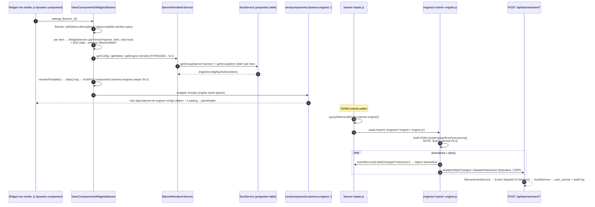

# Necoyoad — Banner Subsystem Deep Dive (Research 3-a-3)

Repo: `/home/z/necoyoad` — legacy PHP multi-store e-commerce/CMS + `necoyoad-next/` (Laravel 11 + Filament 3 + Livewire 3) rewrite.

Cross-referenced (not re-derived): `research/2-architecture.md` (schema/boot), `research/3a1-events-hooks.md` §D.1/D.2 (Banner event family + audit pipeline), `research/3a2-widgets.md` (widget engine, Banner widget seam), `research/3b1-templates.md` §A.5 (banner template resolution, ntPlugins). Orientation doc: `docs/architecture/necoyoad_architecture_blueprint_v9_banner_subsystem.tex` (830 lines) — read in full, every claim re-verified in source below; several blueprint claims corrected (see §A.9 blueprint-verification table).

Design doc driving the rewrite: `docs/reports/1782968369_modern_banner_module_3d_canvas_svg_composer.md` (444 lines, repo-root `docs/reports/`).

---

## A) Legacy Banner Subsystem

### A.1 Database Schema

**`nts8sd4fd_banner`** — `necoyoad_db.sql:107-117` (MyISAM, latin1; dump is schema-only, zero rows):

| Column | Type | Notes |
|---|---|---|
| `banner_id` | int(11) NOT NULL | PK (no AUTO_INCREMENT in dump — ids assigned by insert layer) |
| `name` | varchar(250) NOT NULL | Admin label |
| `jquery_plugin` | varchar(150) NOT NULL | **The discriminator** — names a folder under `web/assets/js/sliders/<plugin>/` + `web/assets/css/sliders/<plugin>/` + a `.tpl` in `choroni/banner/` |
| `params` | text NOT NULL | Intended serialized slider config — **dead column** (see F-1) |
| `publish_date_start` | date NOT NULL | Scheduling start (`'0000-00-00'` = immediately) |
| `publish_date_end` | date NOT NULL | Scheduling end (`'0000-00-00'` = no end) |
| `status` | int(1) NOT NULL | Enabled flag |
| `date_added` / `date_modified` | datetime NOT NULL | Audit stamps (model defaults `NOW()`, `app/admin/model/content/banner.php:46-56`) |

**`nts8sd4fd_banner_item`** — `necoyoad_db.sql:125-134`:

| Column | Type | Notes |
|---|---|---|
| `banner_item_id` | int(11) NOT NULL | PK |
| `banner_id` | int(11) NOT NULL | FK → banner (no DB constraint — MyISAM) |
| `image` | varchar(250) NOT NULL | Filesystem path relative to `DIR_IMAGE` |
| `link` | varchar(250) NOT NULL | Slide link URL |
| `sort_order` | int(11) NOT NULL | Slide order (admin form reindexes on sort) |
| `status` | int(1) NOT NULL DEFAULT '1' | Per-slide enable (storefront filters `status='1'`) |

**EAV/polymorphic attachment** (no dedicated columns — all banner richness lives in shared tables):

| Data | Table | Keying |
|---|---|---|
| Localised slide title/description | `description` | `object_type='banner_item'`, `object_id=banner_item_id`, `language_id` (read via `ModelContentBanner::getDescriptions` → `__getDescriptions('banner_item', …)`, admin model `banner.php:177-183`) |
| Per-slide settings (slidename, transition_delay_in/out, transition_duration_in/out, transition_effect_in/out) | `property` | `object_type='banner_item'`, group `settings` (`setItemProperty`/`setAllItemProperties`, admin model `banner.php:300-323`) |
| Banner-level properties | `property` | `object_type='banner'` (`getAllProperties`, inherited from `Model` base) |
| Store assignment (multi-store scoping) | `object_to_store` | `object_type='banner'`, `object_id=banner_id` — written automatically because `ModelContentBanner::$relations = ["stores"]` (admin model `banner.php:59`; generic handler `system/engine/model.php:326,419,485,1099`) |
| Per-slide widgets (overlay composition) | `widget` (serialized `settings`) | `object_type='banner_item'`, `object_id=banner_item_id` — queried by `NecoWidget::getWidgets()` in the storefront module filter |

**Scheduling semantics** (storefront `app/shop/model/content/banner.php:26-33`):
```sql
SELECT DISTINCT * FROM banner b
LEFT JOIN object_to_store b2s ON (b.banner_id=b2s.object_id AND b2s.object_type='banner')
WHERE b.banner_id = :id
  AND b.publish_date_start <= NOW()
  AND (b.publish_date_end >= NOW() OR b.publish_date_end = '0000-00-00')
  AND b.status = '1'
  AND b2s.store_id = :STORE_ID
```
The same 4 gates (publish window, status, store) are the *only* storefront visibility rules; language is not a query filter — localized titles are picked at render time via `$Config->get('config_language_id')` inside each `.tpl`.

### A.2 Admin Management — `ControllerContentBanner`

`app/admin/controller/content/banner.php` (283 lines) extends `ControllerAdmin` (declarative CRUD; all insert/update/copy/delete/activate/grid inherited):

- **Class metadata** (`:7-17`): `object_type='banner'`, `model_name='modeBanner'` (sic — registry alias typo, harmless), `model_route='content/banner'`, `controller_route='content/banner'`.
- **`$form_vars`** (`:21-58`): `banner_id` (number), `name` (string), `jquery_plugin` (string), `publish_date_start`/`publish_date_end` (date), `banner_stores` (array), `banner_items` (array), `banner_properties` (array), `stores` (array). The form template actually posts `stores[]`, `items[N][…]`, `items[N][descriptions][lang][title|description]` (see §A.4).
- **`$filters`** (`:60-108`): grid filters — name (string), date_start/date_end, publish_date_start/publish_date_end (date), sort (`t.name|t.sort_order|t.date_added`), limit (10..250).
- **`$public_methods`** (`:110`): `insert, update, copy, delete, activate, grid` (gates the inherited verbs only; the custom `saveItem`/`deleteItem` are plain public methods reachable at `?r=content/banner/saveItem`).
- **`init()`** (`:112-236`):
  - `grid:data` filter (`:114-155`): batch actions `copyAll/deleteAll`; columns name, `jquery_plugin` (labeled **"View"**), publish start/end with `0000-00-00 → "--"` date formatters, status Active/Deactive.
  - `getForm:data` filter (`:157-195`): loads `languages`, `stores`, `NTImage`, **`sliders` = `glob(DIR_JS.'sliders/*', GLOB_ONLYDIR)`** (`:166-171`) — the admin "engine" dropdown is *discovered from the asset folders*, not a config list; also builds `modules` (installed widget modules having `widget.php`) used as the drag source for per-slide widget composition (`:173-192`).
  - `getForm:scripts` filter (`:197-235`): injects `image_delete()` / `image_upload()` JS helpers (filemanager dialog → preview replace).
- **`deleteItem()`** (`:238-241`): GET `?r=content/banner/deleteItem&id=<banner_item_id>` → `model->deleteItem()`.
- **`saveItem()`** (`:243-283`): AJAX endpoint used by the visual slide editor — if `banner_item_id` present it **deletes then re-inserts** the item (delete→setItem, `:248-252`), persists image/link/sort_order/status, `setDescriptions` (or an empty default for the current language), and iterates `properties[group][key] → setItemProperty`. Returns `{banner_item_id}` JSON.

### A.3 Admin Model — `ModelContentBanner` (self-observers)

`app/admin/model/content/banner.php` (324 lines), `$table='banner'`, `$pkey='banner_id'`, `$object_type='banner'`, `$description_object_type='banner_item'` (`:13-18`).

- **`$fields`** (`:20-57`): jquery_plugin (string), name (string), params (text — never populated by any form), status (boolean default 1), publish_date_start/end (date), date_added/date_modified (`sql` default `NOW()`).
- **`$relations = ["stores"]`** (`:59`) → automatic `object_to_store` sync on add/update.
- **Self-observers** (`init()`, `:61-88`) — the legacy "model hooks" pattern (cf. 3a1 §model self-observers):
  - `on("save")` (`:62-74`): iterates `$data['items']`, stamps `banner_id` + `sort_order = array index`, calls `setItem($item)` per slide (bulk-save of the classic `#items` list editor).
  - `addHook("delete")` before-delete (`:77-80`) **and** `on("delete")` after-delete (`:83-86`) — **both call `deleteItems($id)`** (double cascade; F-11 in 3a1, re-confirmed here — the first call already removed the rows, so the second is a no-op DELETE).
- **`getById()`** (`:98-104`): `parent::getAll(['banner_id'=>id])` + `banner_items` (via `getItems`), `banner_stores` (`getStores`), `banner_properties` (`getAllProperties`).
- **`getItems()`** (`:113-122`): each row enriched with `descriptions` + `properties` (group `*`).
- **`setItem($data)`** (`:124-162`) — upsert: if `banner_item_id` set → SELECT, then UPDATE (status only when strictly 0/1) else INSERT (status forced `'1'`); then `setDescriptions($id, $data['descriptions'])` + `setAllItemProperties($id,'settings',$data['properties'])` (delete-group-then-rewrite). Returns `banner_item_id`.
- **`deleteItems($banner_id)`** (`:164-169`): cascading DELETE of `description` (object_type banner_item, via IN-subselect), `property` (same), then `banner_item` rows. **Does not delete per-slide `widget` rows** (orphaned widgets — F-8).
- **`deleteItem($id)`** (`:171-175`): single-item variant.
- **`getAllItems` / `getAllItemsTotal`** (`:193-244`): file-cache keyed `admin.banner_items[.total]` + STORE_ID + serialized filters + language/hl/cc/currency/config_store_id; cache bypassed when an admin user is logged in (`!$cached || (bool)$this->user->getId()`, `:206`).
- **`buildItemSQLQuery`** (`:246-298`): criteria on banner_item_id/banner_id (array→IN), status, and an EAV `property` LEFT JOIN with `LCASE(pp.key) LIKE` / `CONVERT(LCASE(pp.value) USING utf8) LIKE` filters (the serialized-LIKE widget query convention, cf. 3a2); GROUP BY banner_item_id; sort whitelist `['sort_order']`; LIMIT with default 24.

### A.4 Admin Widget Form + Install/Uninstall

- **`app/admin/controller/module/banner/widget.php`** (16 lines): `ControllerModuleBannerWidget extends ControllerWidgetController`, `moduleName='banner'`; `widget:settings` filter (`:10-14`) loads `modelBanner->getAll()` into `$this->data['banners']` — feeds the banner-select dropdown in the widget instance form.
- **Widget settings form** `app/admin/view/templates/default/module/banner/widget_form_data.tpl`: fields `Widgets[name][settings][class]`, `width`, `margin`, `padding`, `float` (checkbox) and **`banner_id`** (select of all banners, `:29-37`). There is **no "random banner" or multi-select setting** — a banner widget instance is bound to exactly one banner; the mission's "random?" premise is not present in source. Layout fields (width/margin/padding/float) map to the widget wrapper, not the slider.
- `widget.tpl` (4 lines) is the shell: includes `widget_form_main.tpl` + `widget_form_data.tpl`.
- **`install.php`** (`app/admin/controller/module/banner/install.php`): registers extension + user-group permissions for install/uninstall/widget/plugin verbs.
- **`uninstall.php`**: `modelExtension->uninstall`, `modelSetting->delete('banner')`, `modelWidget->deleteAll('banner')`.

### A.5 Admin Visual Slide Editor (the legacy "composer")

Two editors coexist in `app/admin/view/templates/default/content/banner_form.tpl` (447 lines):

1. **Form header** (`:31-93`): name, publish start/end (`type="necoDate"`), **jquery_plugin `<select>`** populated from `$sliders` (asset-folder glob) with a `"0" → text_none` first option (`:55-63`), and a store checkbox scrollbox (default store `0` + all stores).
2. **Visual slide editor** (only when `$banner_id` exists, `:119-250`): left vertical tabs (`#vtabs`) — one `vtab` per slide labeled from `properties[slidename]`, `onclick="loadSlideSettings(banner_id, banner_item_id, this)"`, an `Add Slide` button calling `addRow(this)`; center panel with 3 inner tabs:
   - **Bg**: `properties[slidename]`, image picker (filemanager iframe → hidden `image` input → `data-background` preview swap), and **Transition In/Out** groups — `properties[transition_delay_in]`, `transition_duration_in`, `transition_effect_in` (select from `$transition_effects`) + `_out` variants (`:169-218`), each `onchange="updateSlide(...)"` → instant AJAX save.
   - **Contents**: searchable list of all installed widget modules, `draggable="true"` (`:221-236`) — drag a widget onto the slide background.
   - **Preview**: placeholder `[ Preview ]`.
   - Right: `#slide_background` canvas `` with absolute-positioned widget pointers (`:241-246`).
3. **Classic list editor** (`:269-336`): `#items` sortable `<ul>` of `slideRow`s — hidden `items[k][banner_item_id]`, `items[k][sort_order]` (`.sortOrder` auto-reindex on sort, `:373-383`), image picker per row, `items[k][link]`, per-language tabs with `items[k][descriptions][language_id][title]` + `[description]` textarea; `addItem()` JS clones a row (`:386-438`). This is the array consumed by the model `on("save")` bulk hook.

**`web/admin/templates/default/js/contentbanner.js`** (579 lines) — the composer brain:

- `loadSlideSettings(banner_id, banner_item_id, li)` (`:140-162`): locks UI, resets, and lazily fetches the slide via `api/v1/banner_items?id=&banner_item_id=` (cached in `window['slideSettings_<id>']`), then `loadSlideData`.
- `loadSlideData` (`:29-138`): fills image/properties inputs; **loads the slide's widgets** via `api/v1/widgets?object_id=&object_type=banner_item` (`:61-65`); for each widget renders an absolutely-positioned `mapPointer` div at `settings.offsetX/offsetY`, fetches the widget's config form HTML from `module/<extension>/widget` (fancybox "advanced" dialog), and auto-saves on every input change (`saveWidget`); dblclick deletes (`style/widget/delete`).
- `updateSlide` (`:174-199`): collects all `properties[...]` inputs + image and POSTs to `api/v1/banner_items` (instant per-keystroke persistence).
- `addRow` (`:227-252`): creates a slide immediately via `content/banner/saveItem` (banner_id only) and wires the new vtab.
- `removeSlide` (`:220-225`): removes tab + `content/banner/deleteitem?id=`.
- `onDropHandler` (`:281-399`): HTML5 drag-drop — drop of a widget module onto `#slide_background` computes **percentage** `posX/posY` (`(offsetX-12)*100/innerWidth+'%'`), creates the pointer, and POSTs the widget creation to `module/<extension>/widget` with `ot='banner_item'`, `oid=banner_item_id`, `offsetX/offsetY`, `position='main'`, `store_id=0` (`:311-325`); re-drag of an existing pointer updates its offsetX/offsetY + `saveWidget`.
- `unserialize()` (`:405-579`): JS port of PHP `unserialize` (to read serialized widget settings from the API).

### A.6 REST-ish Admin API v1 endpoints

`app/admin/controller/api/v1.0.0/` (procedural route files; JSON envelope `{status, error, payload{results, filters, pagination, total}}`):

- **`banners.php`** (152 lines): GET list (filters: id/banner_id/store_id/status/name/plugin/publish dates/properties + paging; default sort `t.name`), POST create (`modelBanner->add(prepareData('banners', …))`), PUT update (loads row, merges `sc` query param, update), DELETE (ids array).
- **`banner_items.php`** (155 lines): GET list (banner_id/ban_item_id/status/sort_order/image/link/properties; default sort `t.sort_order`; `id` alias maps to `banner_id`, `:49-55`), POST → `setItem` (update when `banner_item_id` query present, else insert), PUT (empty), DELETE → `deleteItem`.
- **`banners_data.php` / `banner_items_data.php`** (37 lines each): `prepareData` field whitelists — banners: notNull `name`; canBeNull `status/jquery_plugin/params/publish_*`; many `properties/items/stores`. banner_items: notNull `banner_id`; canBeNull `banner_item_id/sort_order/status/image/link`; many `properties/descriptions`.

### A.7 Storefront Rendering

**Module controller** `app/shop/controller/module/banner.php` (113 lines), `ControllerModuleBanner extends ControllerModuleModuleController`:

- `init()` registers the **`module:settings` filter** (`:12-84`) — invoked from `ControllerModuleModuleController::index()` via `applyFilters("module:settings", ['widget','render','settings'])` (`modulecontroller.php:225`; the filter is namespaced `module:banner:module:settings`, `modulecontroller.php:109-113`). Steps:
  1. `settings['banner_id']` guard (`:16`); injects `NTImage` + loads `content/banner` model; `$this->data['banner'] = modelBanner->getById((int)$settings['banner_id'])` (`:17-19`) — **store-scoped + publish-window + status=1 query** (§A.1); `items = []` default.
  2. For each item (`:22-50`): attach `descriptions` (per-language title/description); instantiate `NecoWidget` and query **per-item widgets** with `object_type='banner_item'`, `object_id`, `position='main'`, `landing_page='all'`, store = current (`:29-38`, admin sees more via `!$this->user->getId()` as `$visibleOnly` arg); for each widget: register child route `$this->children[$name] = $s['route']`, stash widget row, and record `$items[$k]['widgets'][$name] = ['name', 'offsetY', 'offsetX']` for the template overlay.
  3. `$settings['banner'] = $this->data['banner']` (`:55`) — banner data also becomes part of widget settings.
  4. **Asset enqueue keyed by `jquery_plugin`** (`:57-67`): `sliders/<plugin>/slider.js` (→ `$this->javascripts`) and `sliders/<plugin>/slider.css` (→ `$this->styles`) if the files exist.
  5. **3-tier template selection** (`:69-75`): active theme `banner/<plugin>.tpl` → `choroni/banner/<plugin>.tpl` → **hard fallback `choroni/banner/nivo-slider.tpl`**.
- **`carousel()`** (`:87-112`): AJAX JSON endpoint — `modelBanner->getById(?banner_id)`, items with `thumb = NTImage::resizeAndSave(image, width=80, height=80)` (dims from query), `title`/`description`/`link` fields (title/description are undefined-index reads from raw `banner_item` rows — F-7), `error:1` when empty.

**Module pipeline context** (`app/shop/controller/module/modulecontroller.php:200-296`): before the filter, defaults `$this->template` to `{theme}/module/banner.tpl` (`:218-222` — **which does not exist**, see F-5); `loadDeps('module/banner/'.$settings['view'])` (deps manifests have no banner entries); after the filter, sync mode → `render()` (enqueued slider JS/CSS survive; `loadWidgetAssets` at `:262`), **async mode → `$this->javascripts/scripts/styles = []` reset at `:238-240` AFTER the filter ran** → banner's dynamic slider assets are dropped from the async JSON payload (F-6).

**Client-side registry** — every slider template pushes into `window.ntPlugins` and calls `loadNTPlugins()`:
```js
// web/assets/theme/choroni/js/theme.js:91-106 (identical copy in mobile theme js/theme.js:75-90)
function loadNTPlugins() {
    if (typeof window.ntPlugins != 'undefined') {
        $.each(window.ntPlugins, function(i, item){
            if (item && ($[item.plugin] || $.fn[item.plugin])) {   // plugin present?
                if (typeof item.fn != 'undefined' && typeof item.fn == 'function') {
                    item.fn( $(item.id)[item.plugin](item.config), $(item.id) );  // init + post-init callback
                } else {
                    $(item.id)[item.plugin](item.config);          // apply jQuery plugin
                }
            }
            window.ntPlugins[i] = null;                            // consume entry
        });
    }
}
```
Entry contract: `{ id: <CSS selector>, config: {...}, plugin: '<$.fn name>', fn?: <post-init callback(slider, el)> }`. The `fn` variant is used by slicebox (nav wiring, `slicebox-v1.1.0.tpl:58-93`) and hhe-08 (PolarisFx, missing `plugin` — F-4).

### A.8 The 33 Banner Templates — Full Inventory

`app/shop/view/theme/choroni/banner/` — 33 `.tpl` files (only theme; `mobile` theme has none). Universal anatomy:
1. `$tpl` shared-fragment base resolution (`is_dir(theme/shared) ? theme : 'choroni'`).
2. Optional `$settings['class']` augmentation, `include widget-head.tpl` + `module-heading.tpl` (the `<li data-necotienda_module data-widget nt-editable movable removable configurable>` wrapper with transition data attributes — cf. 3b1).
3. `foreach ($banner['items'])` — image (`HTTP_IMAGE . image`), optional `<a href=link>`, localized `title`/`description` via `$item['descriptions'][$Config->get('config_language_id')]`.
4. Optional inline `<script>` pushing the ntPlugins entry + `loadNTPlugins()` (guard: `typeof loadNTPlugins !== 'undefined'`).
5. `include widget-footer.tpl`.

| # | Template | jQuery plugin (`plugin:`) | JS lib (vendor) | What it renders / effect | Notes |
|---|---|---|---|---|---|
| 1 | `nivo-slider.tpl` | `nivoSlider` | jQuery Nivo Slider (theme-level vendor; no `sliders/nivo-slider/slider.js`!) | Classic NivoSlider, 12 slices, random effect, controlNavThumbs | **Hard fallback**; id-selector bug F-2 (works by accident) |
| 2 | `nivo-slider-v3.1.tpl` | `nivoSlider` | `sliders/nivo-slider-v3.1/slider.js` = Nivo Slider v3.2 (dev7studios) | Nivo with **HTML captions** (`nivo-html-caption` divs per slide), no config pushed (plugin defaults) | Correct `#` selector |
| 3 | `slick.tpl` | `slick` | `sliders/slick/slider.js` = slick 1.5.0 (Ken Wheeler) | Single-slide carousel (slidesToShow 1, arrows, linear cssEase) | data-thumb uses undefined `$item['thumb']` (F-7); id missing `#` (F-2) |
| 4 | `camera-v1.3.4.tpl` | `camera` | `sliders/camera-v1.3.4/slider.js` = Camera slideshow v1.4.0 (pixedelic, canvas-based) | Full-bleed slideshow w/ caption divs (`camera_caption fadeIn`), pagination only, thumbnails 285×115 via `$Image->resizeAndSave` | |
| 5 | `eislideshow.tpl` | `eislideshow` | `sliders/eislideshow/slider.js` = EIS "Elastic Image Slideshow" (codrops, smartresize) | Auto-playing centered accordion-style large-image slider (`animation:'center'`, interval 3000) | |
| 6 | `evolution-v1.1.5.tpl` | `slideshow` | `sliders/evolution-v1.1.5/slider.js` = jQuery Slider Evolution 1.1.5 (aeroalquimia/CodeCanyon, bundles easing) | Rotator slider (`transition:'squareRandom'`), responsive resize handler | **Hardcoded `#widget_banner_1047204256`** in resize handler (F-3); uses `$item['thumb']` (F-7) |
| 7 | `layer-slider-v0.0.1.tpl` | `slider_plugin` | `sliders/layer-slider-v0.0.1/slider.js` = **custom vanilla-JS engine** (443 lines: classList helpers, layer slider) | Custom layer slider — arrows + dots, per-slide `` placeholders (one of only 2 templates with per-item widgets) | Images via `Url::createUrl('common/home/getimage')` |
| 8 | `parallax-content-slider.tpl` | `cslider` | `sliders/parallax-content-slider/slider.js` = $.Slider "cslider" (codrops Parallax Content Slider) | Auto-playing parallax slide deck (`da-slider`, bg increment parallax) | id-selector broken (`"slider"` tag selector) — never initializes (F-2) |
| 9 | `horizontal-parallax.tpl` | *(none — CSS-only)* | — (css `sliders/horizontal-parallax/slider.css`) | Horizontal parallax strip: bg-image `<figure>` + `b-horizontal-*` title/description/link layers | `data-banner="horizontal-parallax"` |
| 10 | `slicebox-v1.1.0.tpl` | `slicebox` | `sliders/slicebox-v1.1.0/slider.js` = jquery.slicebox v1.1.0 (codrops, 3D) | **3D cuboid rotation** slider (`orientation:'r'`, `cuboidsRandom:true`), nav arrows/dots wired via `fn` callback, autoplay `slider.play()` | Stray `"` emitted after description (F-9) |
| 11 | `jssor-vertical-nav.tpl` | `jssorPlugin` | `sliders/jssor-vertical-nav/slider.js` = jssor bundle wrapper (49KB) | Jssor slider with **vertical thumbnail navigator** (`$Orientation:2`, 4 cols), arrow navigator, autoplay | |
| 12 | `necoslider.tpl` | *(none)* | — | **Static demo markup** — 3 hardcoded empty `<li class="slide">` + prev/pause/next buttons; ignores `$banner['items']` entirely | Dead template (F-10) |
| 13 | `carousel.tpl` | `owlCarousel` | `sliders/carousel/slider.js` = Owl Carousel v2.2.1 | Responsive multi-item carousel (1/2/4 items @ 0/600/1000px), autoplay 3000, uses `$item['thumb']` (F-7) | |
| 14 | `horizontal.tpl` | *(none — CSS-only)* | css `sliders/horizontal/slider.css` | Horizontal card list (thumb + details), **per-item `` placeholders inside `.thumb`** | `data-banner="horizontal"` |
| 15 | `vertical.tpl` | *(none — CSS-only)* | css: reuses `banner-hhe-10` class | Vertical title/image/description/link stack | Uses undefined `$item['thumb']` (F-7) |
| 16 | `fancybox-gallery.tpl` | `fancybox` | `sliders/fancybox-gallery/slider.js` = fancyBox v3.0.47 | Lightbox **gallery** (block-grid catalog, click→fancybox, ajax html dataType) | id `""` → never applies (F-2) |
| 17 | `fancybox-grid.tpl` | `gridrotator` | `sliders/fancybox-grid/slider.js` = jquery.gridrotator v1.1.0 (codrops) | Animated **grid rotator** (rows 4 × cols 10, responsive w1024..w240 overrides, random step) | id missing `#` (F-2) |
| 18 | `grid-gallery.tpl` | `gridrotator` | `sliders/grid-gallery/slider.js` = fancyBox v3.0.47 (mislabeled; gridrotator CSS) | Grid gallery w/ responsive grid + lightbox | id missing `#` (F-2); css `sliders/grid-gallery/slider.css` is the gridrotator stylesheet |
| 19-33 | `horizontal-hover-effect-01..15.tpl` | *(CSS-only, no ntPlugins)* | css `sliders/horizontal-hover-effect-NN/slider.css` each; **only -08 ships `slider.js`** (anime.js + PolarisFx stack effect, codrops Polaroid stack) | 15 pure-CSS hover-reveal gallery variants: image thumb + `.title`/`.body`/`.link` sections expanding on hover; -08 = 3D polaroid stack w/ PolarisFx | hhe-05 template sets class `banner-hhe-04` (copy-paste, own CSS unused — F-12); hhe-08 pushes ntPlugins entry **without `plugin:` key** → never initialized (F-4) |

**Asset-side inventory** (`web/assets/`):
- `js/sliders/<plugin>/slider.js` exists for **14** plugins: camera-v1.3.4, carousel, eislideshow, evolution-v1.1.5, fancybox-gallery, fancybox-grid, grid-gallery, horizontal-hover-effect-08, jssor-vertical-nav, layer-slider-v0.0.1, nivo-slider-v3.1, parallax-content-slider, slicebox-v1.1.0, slick.
- `css/sliders/<plugin>/slider.css` exists for **30** dirs (all 15 hhe, horizontal, horizontal-parallax, and the 13 JS-backed ones minus… nivo-slider-v3.1 included). **Missing CSS**: `nivo-slider` (the fallback!), `vertical`, `necoslider`. **Missing JS**: `nivo-slider` (fallback relies on theme vendor bundle), `horizontal`, `vertical`, `horizontal-parallax`, `necoslider`, `hhe-01..07,09..15` (pure CSS).
- Shared slider imagery under `web/assets/css/sliders/images/` (Thumbs.db, camera-loader.gif etc. — Windows dev artifacts).

**Per-item widget composition** (unique to banners, v9 §"Per-Item Widget Composition"): only **`horizontal.tpl:28-31`** and **`layer-slider-v0.0.1.tpl:11-15`** actually emit `{%<widget>%>` placeholders for `$item['widgets']`; the other 31 templates ignore the loaded widget tree (the controller still pays the recursive `NecoWidget::getWidgets` cost per slide). Placeholders are substituted by `Controller::fetch()`'s children loop (`system/engine/controller.php:356-365`).

### A.9 Blueprint v9 — verification results

| Blueprint claim | Verdict |
|---|---|
| banner/banner_item schemas | ✔ exact (SQL L107-134) |
| `ControllerContentBanner` 283 lines, form_vars, inherited CRUD | ✔ |
| `ModelContentBanner` on('save') / setItem / deleteItems / getById | ✔ (plus double delete not noted there) |
| storefront module filter flow + per-item widgets + 3-tier template + nivo fallback | ✔ (`banner.php:12-84`) |
| storefront model store-scope + publish window | ✔ (`shop/model/content/banner.php:26-56`) |
| `carousel()` endpoint with NTImage::resizeAndSave | ✔ (`banner.php:87-112`) |
| "33 templates" inventory | ✔ 33 files confirmed; blueprint's table omits `nivo-slider-v3.1` naming detail and doesn't flag broken selectors |
| "params is effectively unused" | ✔ **strengthened**: `banner.params` has zero read sites app-wide (`rg '\[.params.\]' app/` only matches customergroup/report controllers) |
| "templates hardcode config" | ✔ all ntPlugins configs are literal JS objects |
| (implied) all templates initialize their plugin | ✘ **6 templates have broken/missing selectors and 1 misses the `plugin` key** (F-2/F-4 — new finding, not in blueprint) |
| (implied) module has a default template | ✘ `choroni/module/banner.tpl` **does not exist** (F-5 — new finding) |

### A.10 Legacy Findings (defects & quirks)

| ID | Finding | Evidence |
|---|---|---|
| F-1 | `banner.params` is a dead column — never written by any form, never read anywhere | model fields `banner.php:29-32`; `rg params` app-wide |
| F-2 | **Broken ntPlugins selectors in 6 templates**: `nivo-slider.tpl:26` uses `$widgetname` (undefined) → `" .nivoSlider"` — *accidentally works* via class selector; `parallax-content-slider.tpl:34` → `"slider"` (tag selector, never matches → cslider never inits); `fancybox-gallery.tpl` → `""` (empty selector, never applies); `fancybox-grid.tpl`, `grid-gallery.tpl`, `slick.tpl` push ids **without `#`** → tag selectors → slick/gridrotator/fancybox never initialize | `rg 'id:\s*"' banner/*.tpl` audit (§A.8) |
| F-3 | `evolution-v1.1.5.tpl:61-67` resize handler hardcodes `#widget_banner_1047204256` (production widget name from a live site) | template lines 61-67 |
| F-4 | `horizontal-hover-effect-08.tpl:62-72` pushes `{id, config, fn}` **without `plugin:`** — `loadNTPlugins`' `$[item.plugin]` guard fails → PolarisFx stack effect never initializes | template + theme.js:95 |
| F-5 | No default module template: `modulecontroller.php:218-222` defaults to `{theme}/module/banner.tpl` which doesn't exist (161 module tpls, none for banner). With `jquery_plugin='0'` (admin "None" option) or empty, `!empty()` gate skips selection → `Controller::fetch` missing-template path → **debug `exit()`** (controller.php:396) or silent empty widget in prod | `ls app/shop/view/theme/choroni/module/`; `banner.php:57`; admin form `:58` |
| F-6 | **Async render wipes slider assets**: `modulecontroller.php:238-240` resets `javascripts/scripts/styles` *after* the `module:settings` filter enqueued `sliders/<plugin>/slider.js|css`; the async JSON payload then only contains deps-manifest assets (no banner entries) → async-loaded banner widgets ship without their slider JS/CSS | modulecontroller order; deps.php has no banner keys |
| F-7 | Templates `vertical.tpl`, `slick.tpl`, `carousel.tpl`, `evolution-v1.1.5.tpl` read `$item['thumb']` and `carousel()` reads `$v['title']/$v['description']` — keys never set by the storefront filter (raw `banner_item` rows) → PHP notices + empty attrs | shop controller `banner.php:22-52` vs templates |
| F-8 | `deleteItems`/`deleteItem` cascade description+property+banner_item but **not** the per-slide `widget` rows (object_type banner_item) → orphaned widgets on every banner/item delete | admin model `banner.php:164-175` |
| F-9 | `slicebox-v1.1.0.tpl:17` emits a stray `"` after the description `</em>` | template line |
| F-10 | `necoslider.tpl` is dead demo markup — hardcoded 3 empty slides, never iterates `$banner['items']` | template (17 lines) |
| F-11 | Double `deleteItems` on banner delete (`addHook("delete")` before + `on("delete")` after) — second call is a no-op | admin model `banner.php:77-86` |
| F-12 | `horizontal-hover-effect-05.tpl` sets class `banner-hhe-04`; its own CSS (`sliders/horizontal-hover-effect-05/slider.css` styling `.banner-hhe-05`) is never applied | template line 2 vs css |
| F-13 | `saveItem()` deletes+reinserts items on edit → `banner_item_id` churn (breaks nothing internally, but orphans EAV keyed by old id? — no, EAV deleted too; ids unstable per save) | admin controller `banner.php:248-252` |
| F-14 | Banner content form's Transition Effect selects are empty: `$transition_effects` is only populated for *widget* forms (`widgetcontroller.php:307`, `widget_common.php:184` — animate.css catalog), never by `ControllerContentBanner::getForm:data` | banner_form.tpl:186-217 isset-guarded loops render nothing |
| F-15 | `getAllItems` cache never invalidated on save (cache key includes serialized filters; no `Cache::delete('admin.banner_items')` anywhere) — stale admin grids until TTL | admin model `:193-222` |

---

## B) necoyoad-next Banner Engine

### B.1 Models & Schema

**`app/Models/Banner.php`** (35 lines): `use HasFactory, Auditable, HasDescriptions, HasProperties, HasStoreAssignment`.
- `$fillable = ['name','jquery_plugin','params','publish_date_start','publish_date_end','status']` (`:20-23`)
- `$casts = ['params' => 'array', 'status' => 'boolean']` (`:25-28`)
- `items(): HasMany` → `BannerItem` **ordered by sort_order** (`:30-33`)
- No explicit scopes; store scoping via `HasStoreAssignment` (global scope + `stores()` morphToMany `store_assignments`, trait `:43-51`).
- `Auditable` → created/updated/deleted auto-audit (3a1 D.2).

**`app/Models/BannerItem.php`** (26 lines): `HasDescriptions, HasProperties` (no store assignment); `$fillable = ['banner_id','image','link','sort_order','status']`, `status` boolean cast; `banner(): BelongsTo`.

**Migration** `database/migrations/0001_01_01_000000_create_core_tables.php:305-328`:
```php
banners:      id, name(250), jquery_plugin(150) default 'nivo-slider', params JSON nullable,
              publish_date_start date nullable, publish_date_end date nullable, status bool default true,
              timestamps, softDeletes
banner_items: id, banner_id FK→banners cascadeOnDelete, image(250), link(250) nullable,
              sort_order int default 0, status bool default true, timestamps
```
Deltas vs legacy: PK `id` (bigint), `params` JSON (still unused by the render path — parity with F-1, but the widget passes it as `pluginConfig` to views), nullable publish dates (legacy used `'0000-00-00'`), soft deletes, real FK cascade (fixes F-8 partially for items but not per-slide widgets/EAV), **no `date_added/date_modified`** (Laravel timestamps).

**Morph map** (`app/Providers/AppServiceProvider.php:63-72`): `'banner' => Banner::class, 'banner_item' => BannerItem::class` — so the `properties` (propertiable), `descriptions` (describable), `store_assignments` (assignable) polymorphic tables use the same object-type strings as legacy EAV. `properties` table: `morphs('propertiable'), store_id FK nullable, group(100), key(100), value text, sort_order, index(propertiable_type,id,group,key)` (migration `:125-137`). `descriptions`: morphs + language_id FK + title/description/seo/meta + unique(describable,language) (`:110-122`).

**HasDescriptions** (`app/Traits/HasDescriptions.php`): `descriptions()` morphMany; `getDescription(?languageId)` defaults to `app('language.context')->id()`; `getTitle()/getBody()/getSeoTitle()` field helpers — this is what `BannerRendererService::getSlides` uses for slide titles.

### B.2 `BannerRendererService` — full analysis

`app/Services/BannerRendererService.php` (204 lines), **singleton** (`app/Providers/AppServiceProvider.php:52`), ctor-injects `EavService` + `AuditService`.

- **`ENGINES` const** (`:33-42`): `swiper`, `gsap-cube`, `gsap-coverflow`, `gsap-flip`, `three-distort`, `canvas-particles`, `svg-morph`, `ken-burns` (labels in comments).
- **`getEngine(Banner): string`** (`:52-55`): `eav->get($banner,'banner','engine') ?? 'swiper'` — **engine is an EAV property (group `banner`, key `engine`)**, not a column; the `jquery_plugin` column remains the legacy discriminator and is *not* consulted here.
- **`getConfig(Banner): array`** (`:60-75`): defaults `engine/autoplay:true/autoplay_speed:5000/transition_speed:800/loop:true/show_navigation:true/show_pagination:true/parallax_depth:0/ken_burns_intensity:50` merged with EAV group `banner`.
- **`getSlides(Banner): array`** (`:82-112`): `items()->where('status',true)->orderBy('sort_order')` then per item EAV group `slide`: `layers` (JSON string → array), `link_url`, `link_target` (default `_self`), `background_type` (`image`), `background_video_url`, `background_gradient`, `transition_in/out` (`fade`), `ken_burns` (`none`). Note `link` prefers EAV `slide.link_url` over the `banner_items.link` column.
- **`render(Banner): string`** (`:118-203`) — 6-step lifecycle:
  1. `Event::dispatch(new BannerRendering($banner))` (`:124-125`) — mutable pre-event (`addSlide()`, `overrideEngine()`).
  2. Engine resolution: `$renderingEvent->getOverrideEngine() ?? $this->getEngine($banner)` (`:128`); unknown engine → audit-log warning + **fallback to swiper** (`:131-137`).
  3. Config + slides; **merge injected slides** from the event (`:140-146`); empty slides → `throw new BannerRenderException($banner->name, 'no slides available')` (`:148-150`).
  4. Render `view("components.banners.engines.{$engine}", [banner, config, slides, engine])` (`:152-169`); missing view → audit warning + swiper fallback (`:154-162`).
  5. `Event::dispatch(new BannerRendered(banner, html, engine, renderTimeMs, context:['slide_count']))` (`:173-180`).
  6. `AuditService::logModel('banner_rendered', …)` with engine/slide_count/render_time_ms (`:182-192`).
  - Error paths (`:196-202`): `BannerRenderException` → `logException` + rethrow; any other `Throwable` → `logException` + wrap into `BannerRenderException(name, message, previous)` (→ HTTP 500 via `StorefrontException`, `app/Exceptions/BannerRenderException.php:12-15`, base `StorefrontException` `:10-20`).
- **Caching: none.** No `Cache::`/remember anywhere in the service; `EavService` has only a per-request in-memory array cache (`EavService.php:29-61`) + a `Cache::forget` invalidation hook for a Laravel-cache key that nothing populates (`:107`). The widget layer has its own 5-min widget-tree cache (`config/necoyoad.php:28`) but banner HTML is re-rendered per request. (`BannerRendered` docblock suggests "cache the rendered HTML" as a listener use case — no listener exists.)
- **⚠ Known issue (re-verified)**: `render()` has **zero call sites**. The storefront widget (`app/View/Components/Widgets/Banner.php:83-85`) calls only `getConfig/getSlides/getEngine`. Therefore `BannerRendering`/`BannerRendered` and the render audit never fire in practice (matches 3a1 N-2; expanded in B.4).

### B.3 The 8 Modern Engines — markup contract, JS, features

**Server-side contract — all 8 Blade templates are thin hydration shells.** `resources/views/components/banners/engines/{swiper,gsap-cube,gsap-coverflow,gsap-flip,three-distort,canvas-particles,svg-morph,ken-burns}.blade.php` are each a 6-line file: docblock comment + `@include('components.banners.wrapper', ['engine' => '<name>', 'config' => $config, 'slides' => $slides, 'banner' => $banner])`. **No engine-specific markup is server-rendered** — the DOM is built client-side by the engine JS module.

**`resources/views/components/banners/wrapper.blade.php`** (23 lines) — the single real template:
```html
<div class="necoyoad-banner banner-engine-{{ str_replace('.', '-', $engine) }}"
     data-banner-id="{{ $banner->id }}"
     data-banner-engine="{{ $engine }}"
     data-banner-config="{{ htmlspecialchars(json_encode($config ?? []), ENT_QUOTES, 'UTF-8') }}"
     data-banner-slides="{{ htmlspecialchars(json_encode($slides ?? []), ENT_QUOTES, 'UTF-8') }}"
     data-banner-name="{{ $banner->name ?? '' }}"
     nt-editable>
    <div class="banner-loading" style="min-height:200px; …">Loading banner...</div>
</div>
```
Data-attribute contract consumed by the loader: `data-banner-id`, `data-banner-engine`, `data-banner-config` (JSON), `data-banner-slides` (JSON array of slide objects from `getSlides`), `data-banner-name`; `nt-editable` preserved from legacy. A `banner-loading` placeholder shows until the engine replaces `innerHTML`.

**`resources/js/banners/banner-loader.js`** (117 lines, imported once from `resources/js/app.js:7`, shipped via Vite in `components/layouts/storefront.blade.php:27-35`):
- **`BannerEventBus`** (`:13-66`): `dispatchSlideChanged(bannerId, slideIndex, slideId, direction)` → `fetch('/api/banner/event/slide-changed', {method:'POST', headers:{'Content-Type':'application/json','X-CSRF-TOKEN': meta csrf-token}, body: JSON, keepalive: true})`; `dispatchInteraction(bannerId, interactionType, slideId, linkUrl)` → `/api/banner/event/interaction`. Failures are **silent** but queued into `window.__necoyoadAudit` as `banner_event_dispatch_error` (audit-logger bridge).
- **Alpine `bannerBus` store** (`:70-84`, registered on `alpine:init`): `on(event, cb)` / `emit(event, data)` — in-browser pub/sub so other widgets can sync to banner activity (e.g. product spotlight following slides) without a server round-trip.
- **Loader** (`:89-115`): on `DOMContentLoaded`, `querySelectorAll('[data-banner-engine]')` → per element parse config/slides/id → **`await import('./engines/${engine}-engine.js')`** (Vite code-splits each engine — Three.js only downloads for `three-distort` banners) → `module.default(el, config, slides, bannerId, BannerEventBus)`. On failure: console.error + `banner_engine_error` audit event + **no-JS fallback**: replace innerHTML with a plain `` list of slides (`:110-112`).

**Engine JS modules** (`resources/js/banners/engines/*.js`, 8 files) — common signature `async default(el, config, slides, bannerId, eventBus)`, all return a `{destroy}` handle (except swiper returns the Swiper instance), all wire `eventBus.emit('slideChanged', …)` (local) + `eventBus.dispatchSlideChanged(...)` (server) on transitions and `eventBus.emit('interaction', …)` + `dispatchInteraction(bannerId,'click', slideId, link)` on click:

| Engine | Lib (dynamic import) | Markup built | Transition / effect | Autoplay / nav / pagination | Events emitted | Fallbacks |
|---|---|---|---|---|---|---|
| `swiper-engine.js` (92 ln) | **Swiper 11** + modules Navigation/Pagination/Autoplay/EffectFade/Coverflow/Cube/Flip (CSS imported too, `:8-18`) | `.swiper > .swiper-wrapper > .swiper-slide[data-slide-id/-index]`; per slide: optional `<video autoplay muted loop playsinline>` bg, gradient div, lazy ``, full-slide `<a>` link overlay, bottom-left title overlay | `effect:'slide'` (fade/cube/coverflow/flip modules registered but unused), `speed: config.transition_speed‖800`, `grabCursor, keyboard, a11y` | autoplay `delay: config.autoplay_speed‖5000`, `disableOnInteraction:false`, loop `config.loop!==false`; nav/pagination only if `config.show_navigation/show_pagination` | `slideChange` → slideChanged(next); el click → interaction(click) | none (default engine; others fall back *to* it) |
| `gsap-cube-engine.js` (65 ln) | GSAP 3.12 | `.gsap-cube-container[perspective:1200px] > .gsap-cube[transform-style:preserve-3d] > .cube-face` — **max 6 faces** (`slides.slice(0,6)`), each `rotateY(i*90deg) translateZ(50%)`, bg-image + title | `gsap.to(cube,{rotationY: face*90, ease:'power2.inOut'})` | setInterval autoplay `autoplay_speed‖5000`; click anywhere advances | slideChanged + click interaction | GSAP import fail → re-dispatch to swiper-engine |
| `gsap-flip-engine.js` (67 ln) | GSAP | stacked `.flip-card`s (all absolute, `backface-visibility:hidden`, i>0 opacity 0) | current card `rotationY:180,opacity:0` out; next `fromTo(-180→0)` in | setInterval; click advances | slideChanged + click | GSAP fail → swiper |
| `gsap-coverflow-engine.js` (67 ln) | GSAP | `.coverflow-slide`s (width 70%, box-shadow, preserve-3d) | `update()`: per slide `x: offset*60%`, `rotationY: offset*-45`, `scale 1|0.8`, `opacity: 1-absOffset*0.3` (>2 hidden), z-index 100-absOffset | setInterval; click advances | slideChanged + click | GSAP fail → swiper |
| `ken-burns-engine.js` (77 ln) | GSAP | stacked `.kb-slide` full-bleed bg-images + title | crossfade 1.5s + **Ken Burns pan/zoom**: random direction from 4 presets scaled by `config.ken_burns_intensity‖50 /100` (`:32-44`) | setInterval; click advances | slideChanged + click | GSAP fail → swiper |
| `three-distort-engine.js` (146 ln) | **Three.js 0.160** | replaces el with `WebGLRenderer` canvas; OrthographicCamera(-1..1); `PlaneGeometry(2,2)` + `ShaderMaterial` | **GLSL fragment shader**: noise-perturbed `distortedUv = uv + sin(uv.y*10+time)*0.02*progress`, `mix(colorCurrent, colorNext, smoothstep(progress+noise))` — liquid distortion crossfade (`:44-67`); transition speed default **1200ms** | setInterval autoplay; rAF render loop; click advances; isTransitioning guard | slideChanged on complete + click | no Three / no `window.WebGLRenderingContext` / no textures → swiper |
| `canvas-particles-engine.js` (144 ln) | **none (Canvas 2D + rAF)** | single `<canvas>` 800×400 (width from `el.clientWidth`) | **particle dissolve**: 3000 particles sampled from image pixels; phase 1 explode (`vx,vy ±10`), phase 2 converge to next image's sampled targets (`:81-124`); transition speed default **1500ms** | setInterval; click advances | slideChanged on animation complete + click | no images / first image fails → swiper |
| `svg-morph-engine.js` (71 ln) | GSAP + **flubber 0.4** | `.svg-morph-container` (gradient bg) + inline `<svg viewBox 0 0 400 300"><path class="morph-path">` + absolutely-centered title divs | `flubber.interpolate(paths[cur], paths[next])` driven by `gsap.to({t:0→1}, onUpdate: pathEl.setAttribute('d', …))` — **paths are hardcoded default circles; "in production these come from slide EAV"** (comment `:17-22`) — no EAV path source exists | setInterval; click advances | slideChanged on complete + click | GSAP or flubber import fail → swiper |

Shared engine quirks (next findings N-5..N-8): `slides` beyond 6 dropped by gsap-cube; every engine emits `direction:'next'` hardcoded (manual clicks report as next); `slide_changed` is dispatched only *after* a transition completes (no "in progress"); layers (B.6) are ignored by every engine; autoplay `setInterval` handles are only destroyable via the returned handle which the loader discards (no teardown on page navigation/HTMX-style swaps).

### B.4 The Storefront Widget Component (and the render() bypass)

`app/View/Components/Widgets/Banner.php` (127 lines) extends `WidgetComponent` (base `app/View/Components/WidgetComponent.php`: constructor auto-loads widget assets via `AssetManifest::loadForWidget`; `render()` = `view(resolveTemplate(), array_merge(widgetData(), [widgetName, position, settings]))`).

**`widgetData()`** (`:23-87`):
- Banner lookup **without store scoping in SQL**: `BannerModel::with('items.descriptions')->where('id', settings['banner_id'])->where('status',true)->where('publish_date_start','<=',now())->where(fn publish_date_end >= now OR null)->first()` (`:27-35`). Store visibility relies on the `HasStoreAssignment` global scope (if it applies to the morph relation context) — note the legacy explicitly joined `object_to_store`; here the widget `settings.banner_id` is trusted (parity note D-7).
- **Legacy asset parity attempt**: if `public_path("js|css/sliders/{$banner->jquery_plugin}/slider.js|css")` exists → `AssetManifest::enqueueAsset()` (`:41-50`) — but `necoyoad-next/public/` has no `js/sliders/` or `css/sliders/` folders, so this never fires (N-9).
- Per-item data (`:53-76`): image/link/sort_order, `title`/`description` via `getDescription()`, **per-item widgets** via `WidgetService::getTree(position:'main', objectType:'banner_item', objectId:$item->id, only:true)` (the next port of the legacy recursive NecoWidget call), plus `offsetX/offsetY` from EAV `slide→settings` group.
- Returns `banner, items, plugin, pluginConfig (=$banner->params), config, slides, engine` — pulling `BannerRendererService::getConfig/getSlides/getEngine` directly (`:83-85`) — **the render() bypass**.

**`resolveTemplate()`** (`:89-126`) — intended priority: ① EAV `banner/engine` → `components.banners.engines.{engine}`; ② `jquery_plugin` → `themes.{theme}.banner.{plugin}` → `themes.choroni.banner.{plugin}` → `components.sliders.{plugin}`; ③ `components.banners.engines.swiper`; ④ `components.sliders.nivo-slider`.
**Bug (confirmed, extends 3a2's "resolveTemplate data() bug")**: line 91 `$data = $this->data();` — Laravel `Component::data()` returns the component's public properties (`widgetName/position/settings`), **not** `widgetData()` (the base class explicitly names the seam `widgetData()` "because Laravel's Component base class already has a … data() method", `WidgetComponent.php:52-57`). So `$data['banner']`/`$data['plugin']` are always null → branches ①② never fire → since `components.banners.engines.swiper` exists, **every banner widget renders the swiper wrapper regardless of EAV engine or jquery_plugin**; the `components.sliders.nivo-slider` fallback is unreachable. (Branch ② is additionally dead because `resources/views/themes/choroni/` has no `banner/` folder at all.)

**Legacy-parity slider views** (`resources/views/components/sliders/`): 3 ports of legacy templates, currently unreachable from the widget path:
- `nivo-slider.blade.php` — `<li class="banner nivo nt-editable" data-banner="nivoSlider">`, Alpine `x-data` init calling `$($refs.slider).nivoSlider({{ json_encode($pluginConfig ?? []) }})` (jQuery NivoSlider kept!), `@once @push('scripts')` an `Alpine.store('ntPlugins').push({id:'#<widget> .nivoSlider', plugin:'nivoSlider', config:{…defaults}})` — the modern port of `window.ntPlugins` (`resources/js/app.js:10-24` defines `Alpine.store('ntPlugins', [])` + `window.loadNTPlugins` which applies `jQuery(el)[item.plugin](item.config)`).
- `slick.blade.php` — Alpine init `$(ref).slick({slides_to_show, autoplay…})` from `$settings` widget settings.
- `fancybox-gallery.blade.php` — Tailwind grid + `data-fancybox` lightbox gallery.

### B.5 Admin — Filament `BannerResource` + Livewire `BannerComposer`

**`app/Filament/Resources/BannerResource.php`** (103 lines), extends `NecoyoadResource` (shared tabs: Descriptions repeater [language/title/description/seo fields] on the *banner*, Stores multi-select, SEO — `NecoyoadResource.php:33-73`):
- Form Tabs: **General** (name required; `jquery_plugin` Select **hardcoded to 5 options** — nivo-slider/slick/camera/fancybox-gallery/grid-gallery — mirroring `config/necoyoad.php:43-49` but not reading it (N-10); default `nivo-slider`; publish start/end DatePickers; status Toggle) — `:36-51`; **Slides** (Repeater `items` relationship: image path TextInput required, link, sort_order numeric, status Toggle; orderable) — `:53-64`; **Slide Descriptions** — **Placeholder hint only** ("Each slide can have per-language descriptions … via the Descriptions polymorphic table") — slide descriptions are NOT editable in Filament (parity gap D-8) — `:66-69`.
- Table: name (searchable), `jquery_plugin` badge, status boolean; actions: **"Visual Composer"** action → `route('admin.banner.composer', ['bannerId'=>$record->id])` opened in new tab (`:84-89`), Edit, Delete.
- Pages: plain `ListBanners`/`CreateBanner`/`EditBanner` (no composer embed, no preview).

**Route**: `routes/web.php:93-95` — `GET /admin/banner-composer/{bannerId}` → `BannerComposer` Livewire full-page component, middleware `['auth', 'can:file-manager']`, name `admin.banner.composer`.

**`app/Livewire/Admin/BannerComposer.php`** (270 lines), `#[Layout('components.layouts.app')]`:
- Public state: `bannerId, bannerName, engine='swiper', autoplay, autoplaySpeed=5000, transitionSpeed=800, loop, showNavigation, showPagination, parallaxDepth=0`, `slides[]`, `selectedSlide`, `selectedLayer` (`:31-44`).
- `mount()` (`:46-88`): loads banner + EAV group `banner` into the config props; maps `items()` → slides array with EAV group `slide` (layers JSON-decoded, transition_in/out, ken_burns); auto-`addSlide()` if empty.
- Slide ops: `addSlide()` (creates a real `BannerItem` row immediately with empty image/link, sort_order=count, status true — `:90-113`), `deleteSlide()` (deletes BannerItem, min-1 guard), `selectSlide()`, `reorderSlides(array $order)` (client order only — persisted on save).
- Layer ops: `addLayer(type)` with layer schema `{id: uuid, type: text|image|button|shape, content, image, x:50, y:50, z:auto-increment, width/height, color, background, font_size/weight/align, link_url, animation_in/out:'fade', delay:0, duration:600, easing:'power2.out'}` (`:140-167`), `deleteLayer`, `selectLayer`, `updateLayerPosition(layerIndex,x,y)` (called from the JS drag handler), `updateLayerZ(direction)`.
- `save()` (`:214-264`): `EavService::setMany($banner, ['banner' => [engine, autoplay, autoplay_speed, transition_speed, loop, show_navigation, show_pagination, parallax_depth]])`; per slide: `BannerItem::update(image, link, sort_order, status)` + `setMany($item, ['slide' => [layers, transition_in, transition_out, ken_burns]])`; `AuditService::logModel('banner_composer_saved', …)`; `$this->dispatch('banner-saved', …)` — a **browser-facing Livewire event** (naming collision with Laravel events — 3a1 N-6).
- `render()` → `livewire.admin.banner-composer`.

**`resources/views/livewire/admin/banner-composer.blade.php`** (421 lines): 3-column layout — LEFT slide list (thumb + layer count + delete + Add Slide); CENTER canvas (`x-ref="canvas"`, 450px, slide background-image, absolutely-positioned layer divs rendered by type: text styled div / image img / button `<a>` / shape div; z-index controls ↑ Forward / ↓ Backward / Delete; add-layer buttons +Text/+Image/+Button/+Shape via Alpine `bannerComposer()` → `$wire.addLayer(type)`); RIGHT properties panel (slide: background image path, link URL, **Transition In select** [fade/slide-left/slide-up/scale/rotate/flip/distort/particle-dissolve], **Ken Burns select** [none/zoom-in/zoom-out/pan-left/right/up/down]; layer: x/y/z/width, per-type content+styling, animation in/out selects, delay/duration inputs); separate **Banner Engine** card (8-engine select, autoplay/loop/navigation/pagination toggles, autoplay/transition ms inputs). Vanilla-JS global mousedown drag handler (`:364-412`) moves layers, clamps to canvas, and calls the Livewire component's `updateLayerPosition` via `window.Livewire.find(...)`.

**No live preview, no timeline editor, no animation-presets library** — the design doc (`docs/reports/1782968369…md` §3.4, PART 3) specifies a center **iframe live preview** with device toggle, a bottom **timeline editor** (`resources/js/banners/composer/timeline-editor.js` etc.), `BannerLayerEditor.php`/`BannerPreview.php` Livewire components and 20+ presets — none exist (N-11).

### B.6 Events, Analytics Pipeline, HTTP Endpoints

**Event classes** (`app/Events/`, all extend abstract `BannerEvent` — readonly `Banner $banner, ?BannerItem $slide, array $context`, `broadcastOn(): [PrivateChannel('admin.banners.{id}')]`, **not `ShouldBroadcast`** so never actually broadcast; docblock promises a public `'banners'` channel that isn't returned — 3a1 N-3):
- `BannerRendering` — mutable: `addSlide(array)`, `getInjectedSlides()`, `overrideEngine(string)`, `getOverrideEngine()` (`:25-46`); docblock use-cases: inject dynamic slides (featured products), mobile engine switch, impression tracking, A/B testing. **Zero listeners registered app-wide** (`rg Event::listen` — only the docblock example).
- `BannerRendered` — adds readonly `html, engine, renderTimeMs` (`:19-31`).
- `BannerSlideChanged` — readonly `slideIndex, slideId, direction ('next'|'prev'|'manual')` (`:22-33`); originates from browser JS.
- `BannerInteraction` — readonly `interactionType ('click'|'hover'|'swipe'|'cta_click'), slideId, linkUrl, userId` (`:18-31`).

**`app/Services/BannerEventService.php`** (89 lines, singleton `AppServiceProvider.php:55`):
- `dispatchSlideChanged(bannerId, slideIndex, slideId, direction)` (`:33-57`): `Banner::find` guard (silent return if missing) → `Event::dispatch(new BannerSlideChanged(...))` → `audit->logModel('banner_slide_changed', Banner::class, bannerId, {slide_index, slide_id, direction})`.
- `dispatchInteraction(bannerId, interactionType, slideId, linkUrl, userId)` (`:62-88`): same pattern → `BannerInteraction` + `'banner_interaction'` audit with `{interaction, slide_id, link_url, user_id}`.

**`app/Http/Controllers/BannerEventController.php`** (65 lines):
- `slideChanged()` validation (`:29-34`): `banner_id required|integer|exists:banners,id`, `slide_index required|integer|min:0`, `slide_id nullable|integer`, `direction nullable|string|in:next,prev,manual`.
- `interaction()` validation (`:49-53`): `interaction_type required|string|in:click,hover,swipe,cta_click`, `slide_id nullable|integer`, `link_url nullable|string|max:500`; **user resolution** `auth('customer')->id() ?? auth('web')->id()` (`:60`) — customer guard first, then admin.

**Routes** `routes/web.php:85-90` (in `web.php`, not `api.php` — sessions/web middleware apply):
```php
Route::middleware('throttle:120,1')->prefix('api/banner/event')->group(function () {
    Route::post('slide-changed', [BannerEventController::class, 'slideChanged']);
    Route::post('interaction',    [BannerEventController::class, 'interaction']);
});
```
**Throttling 120 req/min per IP**, **no auth required** (public visitors tracked by design — the comment says so). CSRF: web group → `VerifyCsrfToken` applies, satisfied by the `X-CSRF-TOKEN` header the loader sends.

**Analytics storage** — there are **no dedicated banner-analytics tables** (no impressions/clicks tables in the 49-table migration). Every banner event lands in two sinks via `AuditService::logModel` (`app/Services/AuditService.php:141-164`):
1. **`user_activity` table** (`writeActivity`, `:193-222`): `user_id`, morphs `activitable` (→ `App\Models\Banner` + id), `event` (`model_banner_slide_changed` / `model_banner_interaction` / `model_banner_rendered` / `model_banner_composer_saved`), `action` (`Banner#<id>`), `description`, `ip`, `browser` (user-agent, 50 chars), `date_added` — wrapped in try/catch so analytics can never crash the request.
2. **`audit` Log channel** (`Log::channel('audit')->info('Model event', …)` with event/model/model_id/changes/user_id/guard/ip).
Plus the model-level `Auditable` trait on `Banner` itself (created/updated/deleted). Impressions are *not* tracked anywhere — only slide changes and interactions (the `BannerRendering` docblock lists "track impressions" as an unimplemented listener idea).

**Frontend pipeline recap** (3a1 D.1, verified): engine JS → local `Alpine.store('bannerBus').emit('slideChanged'/'interaction')` (in-browser sync) + `BannerEventBus.dispatch*` → `fetch keepalive POST /api/banner/event/*` (CSRF header) → controller validation → `BannerEventService` → Laravel event (no listeners) → audit sinks. Errors on the fetch path feed `window.__necoyoadAudit` (audit-logger batching, `/api/audit/browser` throttle 60/min).

### B.7 Config, Assets, Seeder, Tests

- **`config/necoyoad.php:42-49`** `'banner_plugins'`: 5 entries (nivo-slider, slick, camera, fancybox-gallery, grid-gallery) — comment "for Filament select", but `BannerResource` hardcodes its own copy of the same 5 (never reads the config — N-10). Also `widget_positions` (`:52-60`) and `widget_cache_ttl` (`:28`).
- **AssetManifest** (`app/Providers/NecoyoadServiceProvider.php:83-88`): widget `banner` registered with **empty css/js** + comment "Banner assets are loaded dynamically based on jquery_plugin" — the dynamic enqueue targets `public/js|css/sliders/…` which don't exist (B.4).
- **Seeder** `database/seeders/DatabaseSeeder.php`: per store — `createBanner()` (`:378-394`): `Banner::firstOrCreate(['name' => '<store> Hero'], ['jquery_plugin' => 'nivo-slider', 'publish_date_start' => now(), 'status' => true])` + `stores()->syncWithoutDetaching` + 3 `BannerItem`s (`banners/<folder>/slide{1..3}.jpg`, slide 1 links `/`); `createWidgetTree()` (`:424-445`): main-position row/col with a `banner` module widget (`settings: {banner_id, title}`, `landing_page: 'all'`) + featured product-list + welcome rich-text. Note: seeder banners have **no EAV `banner/engine` property** → `getEngine()` returns swiper; combined with the resolveTemplate bug the seeded NivoSlider banner renders through the swiper engine wrapper.
- **Tests**: no banner tests at all (`tests/Feature/StorefrontTest.php`, `tests/Unit/WidgetEngineTest.php` — zero `Banner` references).
- **Dependencies** `package.json:16-19`: `swiper ^11.0`, `gsap ^3.12`, `three ^0.160`, `flubber ^0.4`. Vite input only `resources/css/app.css` + `resources/js/app.js` (engines are dynamic-import chunks).

### B.8 necoyoad-next Findings

| ID | Finding | Evidence |
|---|---|---|
| N-1 | `BannerRendererService::render()` has **zero call sites** → `BannerRendering`/`BannerRendered` events, engine-override/slide-injection API, render-time audit and the `BannerRenderException` paths are all dead code in practice | `rg BannerRendererService` → only `Banner.php:83-85,95` (getters) + provider |
| N-2 | Widget `resolveTemplate()` calls `$this->data()` (public properties only) instead of `widgetData()` → **always renders `components.banners.engines.swiper`**; EAV engine, `jquery_plugin`, `themes.*.banner.*` and `components.sliders.*` branches unreachable; the 3 legacy-parity slider views are orphaned | `Banner.php:89-104`; `WidgetComponent.php:52-57,99-109` |
| N-3 | All banner events are **dispatch-only**: zero `Event::listen` registrations app-wide; `BannerEvent` has `InteractsWithSockets`+`broadcastOn` but not `ShouldBroadcast` | 3a1 N-1/N-3, re-verified |
| N-4 | **Layers are write-only**: the composer stores `layers` JSON in EAV group `slide`, but **none of the 8 engine JS modules renders `layers`** (swiper renders bg video/gradient/img/link/title only; GSAP/Three/Canvas/SVG engines use image+title) — the flagship "layer-based composition" (design doc §1.3) has no render path | engine JS audit §B.3 |
| N-5 | `gsap-cube` silently drops slides beyond 6 (`slides.slice(0,6)`, `faceCount = min(slideCount, 6)`); design doc says "Hero banners with 6 or fewer slides" but nothing validates/warns | gsap-cube-engine.js:18,23 |
| N-6 | All engines hardcode `direction:'next'` in `dispatchSlideChanged` (even for click/manual navigation); the controller accepts `prev|manual` but nothing sends them | engine JS; controller `:33` |
| N-7 | Engine `destroy()` handles (clearInterval / three.js dispose) are discarded by the loader — no teardown API, no re-init on Livewire morph (potential duplicate timers if the widget HTML is re-rendered client-side) | banner-loader.js:100; engine returns |
| N-8 | `svg-morph` engine morphs **hardcoded circle paths** — slide images are ignored entirely; comment admits "in production these come from slide EAV" (no EAV source implemented) | svg-morph-engine.js:17-22 |
| N-9 | Widget asset parity enqueue (`public/js|css/sliders/{plugin}/slider.js|css`) targets folders that don't exist in `necoyoad-next/public/` → never enqueues; `AssetManifest` banner widget entry is empty | `Banner.php:41-50`; NecoyoadServiceProvider:83-88 |
| N-10 | `config/necoyoad.php banner_plugins` (5 plugins) is never read; `BannerResource` duplicates the list inline — config drift risk (also: 8 modern engines are NOT in either list; the composer's engine select has all 8, hardcoded in the blade) | config:42-49; BannerResource:38-47; banner-composer.blade.php:305-314 |
| N-11 | Design-doc features not implemented: layer timeline editor, live iframe preview + device toggle, animation presets library, `BannerLayerEditor`/`BannerPreview` Livewire components, per-slide background audio (ken-burns), `responsive_breakpoints` config key, `parallax_depth` is stored but unused by engines | `docs/reports/1782968369…md` §3.4/3.2 vs source |
| N-12 | Analytics has **no impression tracking** and no dedicated tables — slide-changes/interactions land in `user_activity` + audit log; an attacker (or simply a busy page) can fill `user_activity` at 120 events/min/IP with unauthenticated POSTs | §B.6; routes:87 |
| N-13 | `BannerComposer::save()` persists `slides[*].link` into the `banner_items.link` column but the renderer reads EAV `slide.link_url` (never written by composer) → links set in the composer are ignored by `getSlides()` | BannerComposer:239-244 vs BannerRendererService:101 |
| N-14 | Widget banner lookup doesn't check store assignment in its own query (relies on `HasStoreAssignment` global scope if active) — legacy explicitly joined `object_to_store`; widget `settings.banner_id` is trusted input from the widgets table | `Banner.php:27-35` vs shop model:27-33 |
| N-15 | `user_activity.browser` column is varchar(50) but `writeActivity` stores full user-agent — long UAs truncate/fail silently (audit try/catch swallows) | migration:641; AuditService:211 |

---

## C) Diagram Material (Mermaid)

### C.1 Legacy — storefront banner render sequence

```mermaid
sequenceDiagram
    autonumber
    participant Page as Page controller (loadWidgets)
    participant MC as ControllerModuleModuleController::index()
    participant B as ControllerModuleBanner (module:settings filter)
    participant M as ModelContentBanner (shop)
    participant NW as NecoWidget::getWidgets()
    participant F as Controller::fetch()
    participant T as banner/<plugin>.tpl
    participant JS as theme.js loadNTPlugins()

    Page->>MC: render widget "banner" (settings.banner_id)
    MC->>MC: default template {theme}/module/banner.tpl (MISSING - F-5)
    MC->>MC: loadDeps("module/banner/"+view) (no manifest entry)
    MC->>B: applyFilters("module:banner:module:settings", {widget,render,settings})
    B->>M: getById(banner_id)
    M->>M: SELECT banner JOIN object_to_store<br/>WHERE publish window + status=1 + store
    M-->>B: banner row + items (status=1)
    loop each banner_item
        B->>M: getDescriptions(banner_item_id)
        B->>NW: getWidgets(object_type='banner_item', object_id, position='main', landing='all')
        NW-->>B: widgets[] (settings.offsetX/offsetY)
        B->>B: children[name]=route; items[k].widgets[name]
    end
    B->>B: enqueue sliders/<jquery_plugin>/slider.js + slider.css (if exists)
    B->>B: template = theme/banner/<plugin>.tpl → choroni/banner/<plugin>.tpl → nivo-slider.tpl
    B-->>MC: {widget, render, settings(+banner)}
    alt sync render
        MC->>F: render() → fetch(template)
    else async render (F-6)
        MC->>MC: javascripts/scripts/styles = [] (wipes slider assets)
        MC->>F: render(true) → JSON payload
    end
    F->>T: extract($banner,$widgetName,$settings,$Config,$Image…)
    T->>T: foreach items → slider HTML +  placeholders
    T->>T: ntPlugins.push({id, config, plugin}) + loadNTPlugins()
    F->>F: str_replace  ← children HTML; applyFilters("render")
    F-->>Page: banner <li> HTML
    JS->>JS: DOM ready → for each ntPlugins entry:<br/>if $[plugin] → $(id)[plugin](config) [fn variant] → null
```

### C.2 Legacy — admin save flows (both editors)

```mermaid
flowchart TD
    subgraph FormSubmit["Classic list editor (form POST)"]
        A1[banner_form.tpl posts<br/>name, jquery_plugin, publish_*, stores[], items[k][image|link|descriptions]] --> A2[ControllerAdmin::upsert]
        A2 --> A3[ModelContentBanner::add/update<br/>+ relations stores → object_to_store]
        A3 --> A4["on('save') hook:<br/>foreach items → setItem(item)"]
        A4 --> A5[INSERT/UPDATE banner_item<br/>+ __setDescriptions banner_item<br/>+ setAllItemProperties group=settings]
    end
    subgraph VisualEditor["Visual slide editor (AJAX, per keystroke)"]
        B1[loadSlideSettings vtab click] --> B2["GET api/v1/banner_items<br/>(cached in window.slideSettings_)"]
        B2 --> B3[loadSlideData fills Bg/transition inputs<br/>+ api/v1/widgets?ot=banner_item]
        B3 --> B4[mapPointer divs @offsetX/offsetY<br/>+ fancybox widget config forms]
        C1[input onchange] --> C2["POST api/v1/banner_items<br/>(properties[image|slidename|transition_*])"]
        C3[Add Slide click] --> C4["GET content/banner/saveItem<br/>→ setItem (empty item)"]
        C5[drop widget on canvas] --> C6["POST module/&lt;ext&gt;/widget<br/>ot=banner_item oid=… offsetX/offsetY"]
        C7[dblclick pointer] --> C8[GET style/widget/delete]
    end
    subgraph Delete["Delete banner"]
        D1[delete] --> D2["addHook('delete') BEFORE:<br/>deleteItems(id)"]
        D2 --> D3["on('delete') AFTER:<br/>deleteItems(id) again (no-op, F-11)"]
        D3 --> D4[description + property (banner_item)<br/>+ banner_item deleted<br/>widget rows ORPHANED (F-8)]
    end
```

### C.3 Next — render sequence (renderer path vs widget path)



### C.4 Next — banner composer save + event/analytics pipeline

```mermaid
flowchart LR
    subgraph Composer["Livewire BannerComposer /admin/banner-composer/{id}"]
        S1[canvas drag → updateLayerPosition] --> S2[addLayer text/image/button/shape]
        S2 --> S3["save(): EavService.setMany(banner→group banner)<br/>+ per item setMany(item→group slide: layers, transitions, ken_burns)<br/>+ BannerItem::update(image, link, sort_order)"]
        S3 --> S4["AuditService.logModel('banner_composer_saved')<br/>+ dispatch('banner-saved') browser event"]
    end
    subgraph Pipeline["Browser → backend analytics"]
        P1[engine JS slide change / click] --> P2[BannerEventBus fetch keepalive<br/>X-CSRF-TOKEN]
        P2 --> P3["POST /api/banner/event/slide-changed|interaction<br/>throttle:120,1 no auth"]
        P3 --> P4[BannerEventController validate<br/>interaction_type in click,hover,swipe,cta_click<br/>user = auth(customer) ?? auth(web)]
        P4 --> P5[BannerEventService::dispatch*]
        P5 --> P6["Event::dispatch(BannerSlideChanged|BannerInteraction)<br/>(0 listeners)"]
        P5 --> P7["AuditService.logModel → user_activity row<br/>(event=model_banner_*) + audit log channel"]
    end
    subgraph RenderAudit["Renderer path (dormant, N-1)"]
        R1[BannerRendering → addSlide/overrideEngine] --> R2[render engine blade]
        R2 --> R3[BannerRendered html/engine/renderTimeMs]
        R3 --> R4[audit banner_rendered / BannerRenderException→500]
    end
```

### C.5 ER — legacy vs next banner data model

```mermaid
erDiagram
    LEGACY_banner ||--o{ LEGACY_banner_item : "banner_id"
    LEGACY_banner_item ||--o{ LEGACY_description : "object_type=banner_item"
    LEGACY_banner_item ||--o{ LEGACY_property : "object_type=banner_item (group=settings: slidename, transition_*)"
    LEGACY_banner ||--o{ LEGACY_property : "object_type=banner"
    LEGACY_banner ||--o{ LEGACY_object_to_store : "object_type=banner"
    LEGACY_banner_item ||--o{ LEGACY_widget : "object_type=banner_item (serialized settings incl. offsetX/offsetY)"
    LEGACY_banner { int banner_id PK varchar name varchar jquery_plugin "discriminator → template+JS+CSS" text params "DEAD (F-1)" date publish_date_start date publish_date_end int status }

    NEXT_banners ||--o{ NEXT_banner_items : "FK cascade"
    NEXT_banner_items ||--o{ NEXT_descriptions : "morph describable (language_id)"
    NEXT_banner_items ||--o{ NEXT_properties : "morph propertiable group=slide (layers JSON, link_url, transitions, ken_burns)"
    NEXT_banners ||--o{ NEXT_properties : "morph propertiable group=banner (engine, autoplay…)"
    NEXT_banners ||--o{ NEXT_store_assignments : "morph assignable"
    NEXT_banner_items ||--o{ NEXT_widgets : "object_type=banner_item (WidgetService tree)"
    NEXT_banners { bigint id PK varchar name varchar jquery_plugin "legacy discriminator (5-option select)" json params nullable date publish_date_start nullable date publish_date_end nullable bool status softDeletes }
    NEXT_banner_items { bigint id PK bigint banner_id FK varchar image varchar link nullable int sort_order bool status }
```

### C.6 Engine catalog (merged legacy+next, diagram-ready)

| Era | Count | Selection mechanism | Rendering | Init mechanism |
|---|---|---|---|---|
| Legacy | 33 templates / 14 JS bundles | `banner.jquery_plugin` column → folder-name lookup | PHP `.tpl` server-side HTML | `window.ntPlugins` push + `loadNTPlugins()` jQuery apply |
| Next | 8 engines | EAV `banner→engine` property (fallback `swiper`) | Blade wrapper emits data-attrs; **DOM built client-side** | `banner-loader.js` dynamic `import()` per engine |

---

## D) Legacy ↔ Next Comparison

| Dimension | Legacy | necoyoad-next | Parity verdict |
|---|---|---|---|
| Slide parent | `banner` table (SQL L107) | `banners` table (migration L305) | ✔ (+ soft deletes, FK cascade) |
| Slide child | `banner_item` (SQL L125) | `banner_items` (migration L319) | ✔ |
| Discriminator | `jquery_plugin` varchar(150) → template+JS+CSS folder | `jquery_plugin` column kept (5-option select) **plus** EAV `banner/engine` (8 engines) | Split personality: column still seeded/persisted but widget path ignores it (N-2); engine is EAV-only |
| Engine catalog | 33 templates: nivo-slider, nivo-slider-v3.1, slick, camera-v1.3.4, eislideshow, evolution-v1.1.5, layer-slider-v0.0.1, parallax-content-slider, horizontal-parallax, slicebox-v1.1.0, jssor-vertical-nav, necoslider, carousel, horizontal, vertical, fancybox-gallery, fancybox-grid, grid-gallery, hhe-01..15 | 8 engines: swiper, gsap-cube, gsap-coverflow, gsap-flip, three-distort, canvas-particles, svg-morph, ken-burns | ~4:1 reduction; conceptual mapping: nivo/slick/carousel→swiper; slicebox→gsap-cube; camera/eislideshow→gsap-flip/ken-burns; parallax→gsap-coverflow; gridrotator→canvas-particles; layer-slider→(layers, unwired N-4); jssor/fancybox/hhe-15/necoslider→dropped |
| Localized slide text | `description` table object_type=banner_item | `descriptions` morph (banner_item) + `getTitle()` | ✔ |
| Per-slide settings | `property` group `settings`: slidename, transition_delay/duration/effect in/out | EAV group `slide`: transition_in/out, ken_burns, layers, background_*, link_url/target | ✔ superset; but transitions/ken_burns **not consumed by engines** (only autoplay/transition_speed/nav/pagination are) |
| Scheduling | publish_date_start/end + `'0000-00-00'` open end, enforced in SQL | nullable dates, enforced in Eloquent widget query + renderer trusts caller | ✔ (legacy open-end `0000-00-00` semantics → null) |
| Store scoping | `object_to_store` join in storefront SQL | `store_assignments` morph + HasStoreAssignment scope (widget query doesn't join explicitly) | ◐ (N-14) |
| Widget instance form | banner_id select + class/width/margin/padding/float | widgets.settings JSON: banner_id + title (seeder) | ◐ (no layout fields UI — WidgetRowResource placeholder, cf. 3a2) |
| Per-item widgets | recursive NecoWidget::getWidgets per slide; `` substitution; offsetX/offsetY overlay | WidgetService::getTree(ot=banner_item, only:true) per slide; offsetX/offsetY via EAV | ◐ loaded but **not rendered** (wrapper has no widget placeholders) |
| Admin CRUD | declarative ControllerAdmin + grid/form filters + api/v1 endpoints | Filament BannerResource (General/Slides/shared tabs) | ✔ (slide descriptions UI missing) |
| Visual composer | banner_form.tpl vtabs + contentbanner.js drag-drop widgets on slide bg, per-slide transition props, instant AJAX saves | Livewire BannerComposer 3-panel: slides + layer canvas (drag, z-order) + props/engine config; save→EAV | ✔ modernized (layers instead of widgets); preview/timeline/presets missing (N-11) |
| Slide editor save model | dual: bulk form POST (on('save')) + per-keystroke AJAX (saveItem / api/v1/banner_items) | Livewire roundtrips + explicit save() | ✔ |
| Render pipeline | module:settings filter → template per plugin → ntPlugins registry | WidgetComponent::widgetData → resolveTemplate → wrapper data-attrs → lazy engine import | ✔ concept; broken template resolution (N-2), renderer events dead (N-1) |
| Client init seam | `window.ntPlugins` + `loadNTPlugins()` (theme.js:91) | `Alpine.store('ntPlugins')` + `window.loadNTPlugins` (app.js:10-24) for legacy-parity views; `banner-loader.js` for engines | ✔ both present |
| Asset loading | per-plugin `sliders/<plugin>/slider.js|css` enqueue (file_exists) | AssetManifest (empty for banner) + nonexistent public/sliders dirs; engines via Vite chunks | ◐ legacy asset path vestigial (N-9) |
| Analytics | none (no impression/click tracking; only admin activity logs) | POST /api/banner/event/{slide-changed,interaction}, throttle 120/min, user_activity + audit sinks, Alpine bannerBus in-page sync | ✚ new capability |
| Events/hooks | model self-observers (on save/delete, addHook delete) + module:settings filter | BannerRendering/Rendered (mutable pre-event = hook analogue), BannerSlideChanged/Interaction; Auditable trait; Livewire browser event | ◐ events exist but dispatch-only (N-3) |
| Caching | admin item cache (never invalidated, F-15); storefront html cache at page level | none for banners (EAV in-memory per request only; 5-min widget tree cache) | ◐ |
| Exception handling | missing template → debug exit()/silent null (F-5) | BannerRenderException (StorefrontException, 500) + audit logException | ✔ better (but unreachable via widget) |
| API | `carousel()` JSON endpoint + admin api/v1 banners/banner_items | POST /api/banner/event/* only; no storefront carousel JSON | ◐ carousel endpoint dropped |
| Tests | none | none | — |

---

## E) File Index (verified this session)

**Legacy**: `necoyoad_db.sql:107-134`; `app/admin/controller/content/banner.php` (283 ln); `app/admin/model/content/banner.php` (324 ln); `app/admin/controller/module/banner/{widget,install,uninstall}.php`; `app/admin/controller/api/v1.0.0/{banners,banner_items,banners_data,banner_items_data}.php`; `app/admin/view/templates/default/content/banner_form.tpl` (447 ln); `app/admin/view/templates/default/module/banner/{widget,widget_form_data}.tpl`; `web/admin/templates/default/js/contentbanner.js` (579 ln); `app/shop/controller/module/banner.php` (113 ln); `app/shop/model/content/banner.php` (64 ln); `app/shop/controller/module/modulecontroller.php:96-296`; `system/engine/controller.php:318-397`; `system/engine/model.php:326-1099`; `app/shop/view/theme/choroni/banner/*.tpl` (33 files); `web/assets/js/sliders/*/slider.js` (14); `web/assets/css/sliders/*/slider.css` (30); `web/assets/theme/choroni/js/theme.js:91-106`; `app/{admin,shop}/language/spanish/…/banner.php`.

**Next**: `app/Models/{Banner,BannerItem}.php`; `app/Services/{BannerRendererService,BannerEventService,EavService,AuditService,AssetManifest,WidgetService}.php`; `app/Events/{BannerEvent,BannerRendering,BannerRendered,BannerSlideChanged,BannerInteraction}.php`; `app/Exceptions/{BannerRenderException,StorefrontException}.php`; `app/Http/Controllers/BannerEventController.php`; `app/View/Components/{WidgetComponent,Widgets/Banner}.php`; `app/Livewire/Admin/BannerComposer.php` (270 ln); `resources/views/livewire/admin/banner-composer.blade.php` (421 ln); `resources/views/components/banners/wrapper.blade.php` + `engines/*.blade.php` (8×6 ln); `resources/views/components/sliders/{nivo-slider,slick,fancybox-gallery}.blade.php`; `resources/js/app.js`; `resources/js/banners/banner-loader.js` + `engines/*-engine.js` (8); `app/Filament/Resources/BannerResource.php` (+3 Pages); `app/Providers/{AppServiceProvider,NecoyoadServiceProvider}.php`; `routes/web.php:85-95`; `config/necoyoad.php:42-49`; `database/migrations/0001_01_01_000000_create_core_tables.php:110-137,305-328,632-645`; `database/seeders/DatabaseSeeder.php:378-445`; `package.json:16-19`; `docs/reports/1782968369_modern_banner_module_3d_canvas_svg_composer.md` (444 ln).
