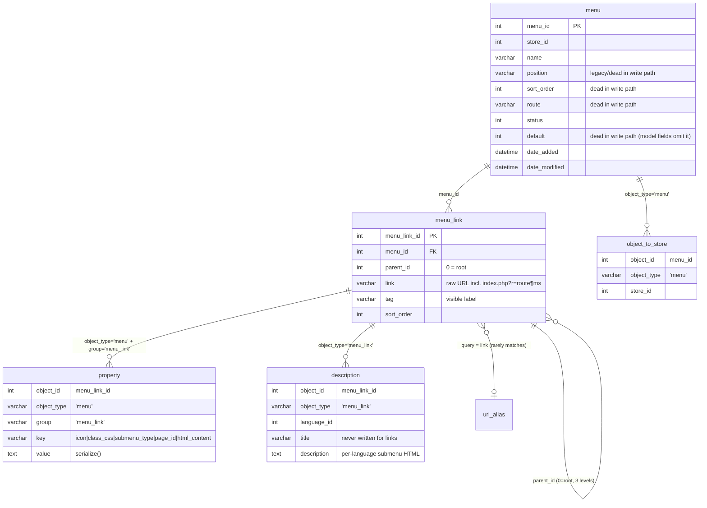
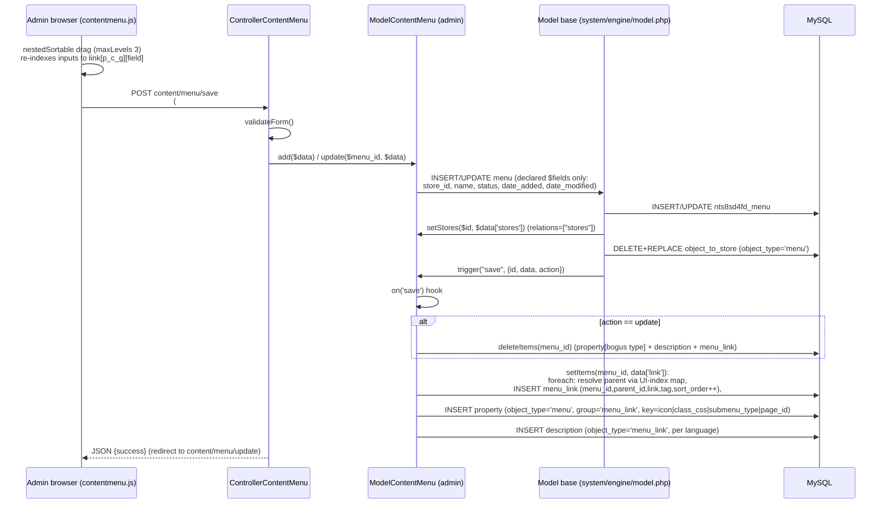
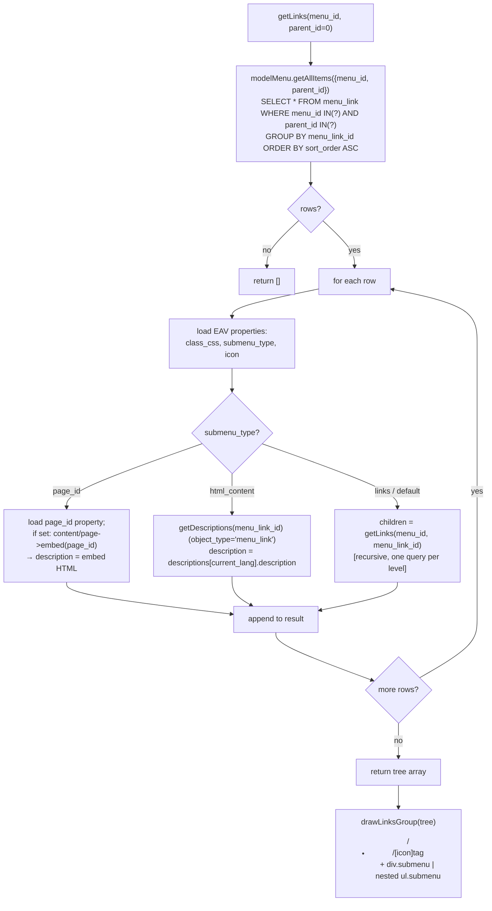

# Task 3-a-4 — Menu System Deep Dive (Legacy Necoyoad + necoyoad-next)

Agent: Explore-menus · Repo: `/home/z/necoyoad` · Research-only (no repo modifications).
Orientation source: `docs/architecture/necoyoad_architecture_blueprint_v7_menu_links.tex` (725 lines) — **read first, then every claim below re-verified against source.** Corrections to the blueprint are flagged as **[BP-CORRECTION]**.

---

## 1. Executive summary

- A **menu** is a named link collection scoped to one or more stores (`object_to_store`, `object_type='menu'`). Its **links** form an **adjacency-list tree** via `menu_link.parent_id` (0 = root in legacy; NULL = root in the Laravel rewrite). Max depth **3** levels, enforced by the admin UI (jQuery `nestedSortable maxLevels: 3`) and by the server-side index encoding `link[grandparent_parent_child]`.
- Link "types" are **not polymorphic link types** — every row stores a raw URL string in `menu_link.link` (typically `…/index.php?r=content/page&page_id=5` built by `Url::createUrl()`), plus a visible label `tag`. Links to CMS pages / product categories / post categories are created by admin AJAX endpoints that resolve the entity to `{title, href}` JSON.
- Per-link metadata lives in the **EAV `property` table**: `group='menu_link'`, keys `icon`, `class_css`, `submenu_type`, `page_id`, `html_content`; localised rich HTML (for `submenu_type='html_content'`) lives in the polymorphic **`description`** table with `object_type='menu_link'`.
- `submenu_type` has **3 values** — `links` (recurse into child links; default), `page_id` (embed a CMS page rendered through `content/page->embed()` → simplified `page_embed.tpl` layout), `html_content` (localised HTML from `description`).
- Storefront rendering is **widget-driven**: the `links` widget module (`ControllerModuleLinks`) renders the tree recursively (`getLinks()` + `drawLinksGroup()`) into nested `<ul>/<li>`; the widget's `settings['view']` selects one of **12 `links_*.tpl` sub-templates**; `Url::rewrite()` converts the stored route-URL into an SEO URL at render time.
- The Laravel rewrite (`necoyoad-next`) reproduces the schema (menus/menu_links + morph `properties`/`descriptions`), the Filament CRUD (simplified: no icon/submenu-type/page-embed editing), and a recursive `Links` Blade widget component — but **omits** the three-submenu-type rendering (docblock claims it, code doesn't do it), page embedding, SEO URL rewriting, per-menu template overrides, and caching.

---

## 2. Legacy database schema (verified from `necoyoad_db.sql`)

### 2.1 `nts8sd4fd_menu` (necoyoad_db.sql:569-580)

```sql
CREATE TABLE `nts8sd4fd_menu` (
  `menu_id` int(11) NOT NULL,
  `store_id` int(11) NOT NULL,
  `name` varchar(100) NOT NULL,
  `position` varchar(100) NOT NULL,
  `sort_order` int(11) NOT NULL,
  `route` varchar(150) NOT NULL,
  `status` int(1) NOT NULL,
  `default` int(1) NOT NULL,
  `date_added` datetime NOT NULL,
  `date_modified` datetime NOT NULL
) ENGINE=MyISAM DEFAULT CHARSET=latin1;
```

- `store_id`: legacy column; live store-scoping actually goes through `object_to_store` (see §2.4) because `relations = ["stores"]` in the admin model.
- `position`: intended layout slot ('header'/'footer'/'sidebar' per blueprint) — **never written by the current admin code path** (see §4.3 finding F-3).
- `route`, `default`: same — columns exist, model `$fields` doesn't include them → **[BP-CORRECTION]** the blueprint's listing 3.3 implies these are live; in fact `default` (checkbox in form) and `position`/`route` are **dead columns** in the current write path.
- No PRIMARY KEY declared in the dump (schema-only dump, no INSERTs for menu/menu_link — table is empty in the shipped SQL).

### 2.2 `nts8sd4fd_menu_link` (necoyoad_db.sql:588-595)

```sql
CREATE TABLE `nts8sd4fd_menu_link` (
  `menu_link_id` int(11) NOT NULL,
  `menu_id` int(11) NOT NULL,
  `parent_id` int(11) NOT NULL,      -- 0 = root (adjacency list)
  `link` varchar(250) NOT NULL,      -- raw URL, e.g. http://host/index.php?r=content/page&page_id=5
  `tag` varchar(250) NOT NULL,       -- visible label
  `sort_order` int(11) NOT NULL
) ENGINE=MyISAM DEFAULT CHARSET=latin1;
```

- **Adjacency list** (not nested set): tree assembled by repeated `WHERE menu_id=? AND parent_id=? ORDER BY sort_order` queries.
- **No `status`/`target`/permission columns** on menu_link — visibility filtering, `target=_blank`, per-link permissions do **not exist** in the legacy schema (blueprint makes no claim of them either).
- **Link "types"**: the `link` column stores whatever the admin picked: an arbitrary external URL typed in the "Enlaces (URL)" box, or a route-URL generated from a CMS page (`content/page&page_id=N`), product category (`store/category&path=parent_child`), or post category (`content/category&path=parent_child`) — see §4.4.

### 2.3 `nts8sd4fd_property` (EAV, necoyoad_db.sql:1119-1129) — per-link metadata

```sql
CREATE TABLE `nts8sd4fd_property` (
  `property_id` int(11) NOT NULL,
  `store_id` int(11) DEFAULT NULL,
  `object_id` int(11) NOT NULL,          -- = menu_link_id
  `object_type` varchar(100) NOT NULL,   -- = 'menu' (see finding F-2!)
  `group` varchar(100) NOT NULL,         -- = 'menu_link'
  `key` varchar(100) NOT NULL,           -- icon | class_css | submenu_type | page_id | html_content
  `value` text NOT NULL,                 -- PHP serialize()d value
  `order` int(11) NOT NULL,
  `date_added` timestamp NOT NULL DEFAULT CURRENT_TIMESTAMP
) ENGINE=MyISAM DEFAULT CHARSET=latin1;
```

Keys actually written/read for menu links (all in `app/admin/model/content/menu.php` and `app/shop/model/content/menu.php`):
| key | written by | read by | meaning |
|---|---|---|---|
| `icon` | `setItems()` L232-234 | admin `getAllItems()` L101; links widget L46 | FontAwesome class string e.g. `fa-home fas` |
| `class_css` | L236-238 | shop model `getAllItems()` L64; links widget L44 | CSS class(es) for the `<li>` |
| `submenu_type` | L240-242 | admin model L102; links widget L45 | `links` \| `page_id` \| `html_content` |
| `page_id` | L244-246 | admin model L105; links widget L49 | CMS page (post_id) to embed as submenu |
| `html_content` | — (never written!) | admin model L104 | **dead key**: read but no write path |

### 2.4 `nts8sd4fd_description` (polymorphic, necoyoad_db.sql:452-465) — localised labels/HTML

- Rows for menu links use `object_type='menu_link'`, `object_id=menu_link_id`, `language_id`.
- Fields: `title`, `description` (rich HTML used for `submenu_type='html_content'`), `seo_title`, `meta_description`, `meta_keywords`, `params`. Only `description` is written by the menu editor (per-language CKEditor textareas); `title` is never written for menu links → **[BP-CORRECTION]**: blueprint §"The Menu Link Label is Both…" claims localised `description.title` can override `tag`; in the current write path only `description` (HTML body) is saved, so the localised *label* feature is dormant; `tag` is the only label.

### 2.5 `nts8sd4fd_object_to_store` (necoyoad_db.sql:674-681) — store scoping

- `object_type='menu'`, `object_id=menu_id`, `store_id` per row (0 = "default/all"). Written by `Model::__setStores()` (system/engine/model.php:1086-1116) because `relations = ["stores"]`.
- **Phantom table**: the shop model's `getMenu()` (L172-209) and `getMainMenu()` (L218-224) JOIN `menu_to_store` — **that table does not exist** in the dump (verified: no `menu_to_store` CREATE). Both methods are dead/broken code (they'd throw SQL errors if invoked); nothing calls them in the live rendering path (verified by grep — only the model itself defines them).

### 2.6 `nts8sd4fd_url_alias` (necoyoad_db.sql:1410-1417)

- Both menu models query `url_alias WHERE query = <menu_link.link>` (admin model L90, shop model L53) hoping to find an SEO `keyword` for the link. Because `link` stores **full URLs** while `url_alias.query` stores route-queries (`…_id=N` form, see `__setDescriptions` model.php:1330-1335), this lookup **almost never matches** → `keyword` is effectively always `''`. The keyword input in the JS editor is likewise never persisted (`setItems()` ignores it) — see finding F-5.

### 2.7 ER diagram (Mermaid)



---

## 3. Legacy admin — menu editor

### 3.1 Controller `app/admin/controller/content/menu.php` (495 lines)

`ControllerContentMenu extends ControllerAdmin` (requires `DIR_CONTROLLER . "admincontroller.php"`, L3).

Declarative config:
- `object_type='menu'`, `model_name='modelMenu'`, `model_route='content/menu'` (L9-16)
- `form_vars`: `menu_id`, `parent_id` (number), `name` (string), `sort_order` (number), `default` (boolean), `stores` (array) (L21-46)
- `filters`: `name`, `parent_id`, `date_start`, `date_end` (L48-65)
- `public_methods`: `['insert','update','copy','delete','activate','grid']` (L67) — inherited CRUD from `ControllerAdmin` (`app/admin/controller/admincontroller.php:43-254`): `index→getList`, `insert/update→upsert`, `copy`, `delete` (multi via POST `selected[]`), `activate` (toggle status), `grid` (AJAX list), `sortable` (not enabled for menus — TODO comment at L123).

Key customisations:
- `init()` `grid:data` filter (L71-92): grid columns `name` + `status` (Active/Deactive formatter), batch action `deleteAll`.
- `init()` `getForm:data` filter (L94-121): loads `languages`, `stores`, `pages` (modelPage->getAll), `manufacturers`, `categories` (recursive checkbox tree HTML via `getCategories()`, L203-225), `post_categories` (`getPostCategories()`, L180-201); then `$data['links'] = $this->getLinks()` — the server-rendered tree editor (L113-118).
- `save()` (L158-178): custom AJAX save endpoint (POST, `validateForm()`), calls `model->update(menu_id, $data)` or `model->add($data)`, returns JSON. Used by the inline `saveAndKeep()` JS injected via `getForm:scripts` filter (L124-155) which serializes `#formMenu` + `#menuItems` via jQuery `serializeFormJSON`.
- **Tree editor renderer** `getLinks($parent_id=0)` (L239-416): recursively renders `<li id="li_{index}">` blocks. Index encoding (L254-259): root = `menu_link_id`; child = `{grandparent}_{parent}_{id}` trimmed (max 3 segments). Per-link form fields emitted as HTML strings:
  - hidden `link[{index}][menu_link_id]` (L271)
  - `link[{index}][link]` (Url, type=url, L293), `link[{index}][tag]` (Etiqueta, L300), `link[{index}][class_css]` (Clases CSS, L307)
  - `link[{index}][submenu_type]` select with options **`links` (Sub-Links) / `page_id` (A Page) / `html_content` (HTML Content)** + inline JS show/hide of the page_id row vs html_content rows (L313-324)
  - `link[{index}][page_id]` select populated from `$pages` (uses `$page['post_id']` as value — pages live in the post table) (L328-343)
  - per-language CKEditor textareas `link[{index}][descriptions][{lang_id}][description]` with language tabs `.htabs2` (L346-393); CKEditor config wired to `common/filemanager` browse/upload URLs and the storefront `theme.css` as `contentsCss` (L371-386)
  - icon picker row with `showIcons(index, icon)` button + delayed auto-init `<script>` for links that have an icon (L276-287); icon value normalised by stripping `fa-` prefix and `fab|fas|far` suffixes for display (L261-264)
  - "[ Eliminar ]" link removes the `<li>` client-side (L274)
  - recursion: `children = modelMenu->getAllItems(['menu_id','parent_id'=>$result['menu_link_id']])` → nested `<ol>` (L399-409)
- **Entity→link AJAX endpoints** (JSON, POST):
  - `page()` (L418-441): `modelPage->getById($value)` → `{title, href: Url::createUrl('content/page', ['page_id'=>$post_id], 'NONSSL', HTTP_CATALOG)}`
  - `category()` (L443-467): `modelCategory->getById` → `{title, href: Url::createUrl('store/category', ['path'=>parent_child])}`
  - `postcategory()` (L469-493): same for `content/category` post-category paths.
- `getParentsTree($id)` (L227-237): returns the parent_id of a link (single level) used to build the child index.

### 3.2 Model `app/admin/model/content/menu.php` (274 lines)

`ModelContentMenu extends Model`:
- `table='menu'`, `pkey='menu_id'`, `object_type='menu'`, `description_object_type='menu_link'` (L13-16)
- `$fields`: `store_id` (int, default 0), `name`, `status` (bool, default 1), `date_added`/`date_modified` (sql NOW()) (L18-44) — **`position`, `route`, `default`, `sort_order` NOT declared** → never persisted (finding F-3).
- `$relations = ["stores"]` (L46) → `Model::add/update` call `setStores()` writing `object_to_store` (model.php:326-332, 419-425).
- `init()` hooks (L49-61):
  - `on("save")`: if `action=='update'` → `deleteItems($id)`; then `setItems($id, $data['data']['link'])` (payload shape from `Model::add/update` triggers at model.php:337-342 / 430-435).
  - `on("delete")`: `deleteItems($id)`.
- `getAllItems($data)` (L63-113): file-cache (`cache_prefix='admin.menu_links'`; key = STORE_ID + serialize($data) + language_id + `hl` + `cc` + currency + config_store_id; **cache bypassed when `$this->user->getId()`** i.e. any logged admin). SQL from `buildSQLQueryItems()`; per row: url_alias keyword lookup + properties `icon`, `submenu_type`, `class_css`, `html_content`, `page_id` + `getDescriptions(menu_link_id)`.
- `buildSQLQueryItems()` (L140-204): filters `menu_id[]`, `parent_id[]` (incl. 0), `menu_link_id[]`, `link` LIKE, `tag` LIKE, `keyword` LIKE (against non-existent `ml.keyword` column — latent bug), optional `properties` filter (`LEFT JOIN property lp ON ml.menu_link_id = lp.object_id` + `lp.object_type='menu_link'` — never matches actual `object_type='menu'` rows, F-2); `GROUP BY ml.menu_link_id`; ORDER BY `ml.sort_order` (default) or whitelisted `tag`/`sort_order`; LIMIT (default 24).
- **`setItems($menu_id, $links)`** (L206-252) — the tree persistence algorithm:
  ```php
  foreach ($links as $key => $link) {           // $key = index path from the UI
      if (empty($link['link'])) continue;
      $index = explode("_", $key);
      if (count($index) == 2)  $parent_id = $parent[$index[0]];              // child
      elseif (count($index) == 3) $parent_id = $parent[$index[0]."_".$index[1]]; // grandchild
      else $parent_id = 0;                                                   // root
      INSERT INTO menu_link (menu_id, parent_id, link, sort_order=++n, tag);
      $parent[$key] = getLastId();          // map UI index -> real new id
      setProperty(..., 'icon'|'class_css'|'submenu_type'|'page_id') if non-empty;
      setDescriptions(newId, link['descriptions']) if non-empty;
  }
  ```
  - `sort_order` is a simple increment across the whole flat POST order (roots and children share the counter).
  - Only depth ≤ 3 is representable (2- or 3-part index keys); deeper nesting impossible from the UI.
  - **Delete-and-reinsert**: every menu save wipes all `menu_link` rows (via the `on('save')` hook on update, and `deleteItems` on menu delete) and re-inserts them with **new ids** — menu_link ids are not stable across edits.
- `deleteItems($id)` (L254-273): 4 statements —
  1. `DELETE FROM property WHERE object_id IN (SELECT menu_link_id FROM menu_link WHERE menu_id=$id) AND object_type='menu_link'` ← **never matches** (rows are stored with `object_type='menu'`) → orphaned EAV rows (F-2)
  2. `DELETE FROM description … object_type='menu_link'` ← correct
  3. `DELETE FROM menu_link WHERE menu_id=$id` ← correct
  4. `$this->deleteProperty($id, 'menu_link')` → `__deleteProperties('menu', $menu_id, 'menu_link', '*')` (model.php:1754-1757) — deletes properties where `object_id = menu_id`, which only coincidentally matches link rows → effectively a no-op (F-2).

### 3.3 Admin views & JS

- `app/admin/view/templates/default/content/menu_form.tpl` (204 lines): two-column layout.
  - Left (`grid_4`): "Datos del Menú" form (`#formMenu`): `_name` (mirrors to hidden `#name`), `_default` checkbox (mirrors to hidden `#default`), store multi-checkbox scrollbox `_store0…` (mirrors to hidden `stores[]` inputs inside `#menuItems`); "Enlaces (URL)" box (`#external_link` + `#external_tag` + `addLink()`); "Páginas" scrollbox (checkbox `pages[]`, `addPage()`); "Categorías de Productos" (tree HTML from `getCategories()`, `addCategory()`); "Categorías de Artículos" (`addPostCategory()`).
  - Right (`grid_8`): "Enlaces del Menú" form (`#menuItems`, POST target `$action`): `<ol class="items">` with the server-rendered tree (L177-179).
  - Bottom: `cssEditorConfig` JS object for CKEditor instances (filemanager URLs + theme.css as contentsCss) (L184-204).
- `menu_list.tpl` / `menu_grid.tpl`: thin delegates to `../shared/list.tpl` / `../shared/grid.tpl` (generic AdminController scaffolding).
- `web/admin/templates/default/js/contentmenu.js` (487 lines) — the tree editor client:
  - `makeSortable()` (L4-66): `$("ol.items").nestedSortable({maxLevels: 3, handle:'div.item', …})`; on `update`, rewrites every item's input `name` to `link[parentIndex_childIndex(_grandchildIndex)]` based on DOM position (e.g. `link[0][link]`, `link[0_2][tag]`, `link[1_0_2][link]`) — the exact format `setItems()` parses.
  - `addLink(token)` (L134-146): manual URL; fetches slug via `common/home/slug` and fills a `keyword` input (never persisted — F-5).
  - `addPage/addCategory/addPostCategory` (L148-211): POST checked ids to `content/menu/{page|category|postcategory}`, parse JSON, append items via `__addItem(k, link, tag, keyword)`.
  - `__addItem()` (L236-354): builds the `<li>` with icon picker (`__drawFontIcons` L384-399 — hardcoded FontAwesome **fas/far/fab lists** L478-488), Url/Tag/Slug/CSS-class inputs, submenu_type select with the same show/hide JS, page select (options from `api/v1/pages` fetched at L79-82), per-language CKEditor textareas (languages from `api/v1/languages` L84-87).
  - `showIcons(index, icon)` (L438-453): lazily draws the icon grid and pre-selects the saved icon.
- Widget config side: `app/admin/controller/module/links/widget.php` (20 lines) — `ControllerModuleLinksWidget extends ControllerWidgetController` adds a `widget:settings` filter that loads **all menus** (`modelMenu->getAll(['status'=>1])`) for the widget form; `app/admin/view/templates/default/module/links/widget_form_data.tpl` renders the **`settings[menu_id]` select** (+ a CSS `class` input). `install.php` registers module permissions (`module/links/{install,uninstall,widget,plugin}`).
- `app/admin/controller/store/store.php:1473-1519` `menus()`: JSON endpoint listing all menus with `added`/`add` classes relative to a store (store-editing form integration for menu↔store assignment).
- `app/admin/map.php:227-245`: route map loads `content/menu`, `url`, `localisation/language`, `store/store`, `content/post_category`, `store/category`, `store/manufacturer`, `content/page` for menu insert/update.
- Language file `app/admin/language/spanish/content/menu.php` (49 lines) — heading/labels (Spanish, e.g. `entry_store='Tienda:'`).

### 3.4 Admin save sequence (Mermaid)



---

## 4. Legacy storefront — rendering

### 4.1 Shop model `app/shop/model/content/menu.php` (265 lines)

- `getLinks($menu_id, $parent_id)` (L19-24) → `getAllItems(['menu_id','parent_id'])`.
- `getAllItems($data)` (L26-72): file-cache prefix **`menu_links`** (key includes STORE_ID, serialized `$data`, `config_language_id`, `hl`, `cc`, `config_currency`, `config_store_id`; bypassed for logged-in admin users). Per row: url_alias keyword lookup (`WHERE query = link` — see F-6), `class_css` property (`getProperty(menu_link_id,'menu_link','class_css')`), and `getDescriptions(menu_link_id)` — descriptions use `object_type='menu_link'` (L226-228). **Note: this model does NOT load `submenu_type`/`icon`/`page_id` — those are re-fetched by the widget controller per link.**
- `getAllItemsTotal()` (L74-97): count variant, cache prefix `menu_links.total`.
- `buildSQLQueryItems()` (L99-163): same as admin variant (menu_id[]/parent_id[]/menu_link_id[] filters, GROUP BY, ORDER BY `ml.sort_order`).
- Dead methods: `getMenu($menu_id)` (L172-209) and `getMainMenu()` (L218-224) — JOIN the **non-existent** `menu_to_store` table and read the never-written `default` column; unused by any controller (F-4).
- Explicit overrides (L226-264): `getDescriptions/setDescriptions` → `__get/setDescriptions('menu_link', …)`; `getProperty/setProperty/deleteProperties/getAllProperties/setAllProperties` → `__get/set…('menu', …)` — confirming the **property rows use `object_type='menu'` + `group='menu_link'`** convention.

### 4.2 Links widget module `app/shop/controller/module/links.php` (99 lines)

`ControllerModuleLinks extends ControllerModuleModuleController`, `moduleName='links'`:

- `init()` (L13-28): registers the `module:settings` filter (hook name becomes `module:links:module:settings` via `ControllerModuleModuleController::addFilter`, modulecontroller.php:89-93). If `$settings['menu_id'] > 0` → `$this->data['links'] = drawLinksGroup(getLinks(menu_id))` else `''`.
- **`getLinks($menu_id=0, $parent_id=0)`** (L30-70) — the recursive tree builder:
  1. `modelMenu->getAllItems(['menu_id','parent_id'])` (one query per tree level)
  2. per link: `getProperty(menu_link_id,'menu_link','class_css'|'submenu_type'|'icon')` (3 EAV queries per link)
  3. branch on `submenu_type`:
     - `'page_id'` → `getProperty(…,'page_id')`; if non-empty → `$pageController = $this->load->controller('content/page')`; `$return[$k]['description'] = html_entity_decode($pageController->embed($page_id))` (L48-53)
     - `'html_content'` → `$descriptions = modelMenu->getDescriptions(menu_link_id)`; **`var_dump($descriptions);`** debug leftover at L56 (F-1); then `$return[$k]['description'] = html_entity_decode($descriptions[config_language_id]['description'] ?? "")`
     - else (`links`/default) → `$return[$k]['children'] = $this->getLinks($menu_id, $result['menu_link_id'])` — recursion (L60)
  4. copies `class_css`/`icon` into `$return[$k]` only when non-empty (L63-64).
- **`drawLinksGroup($links, $submenu=false)`** (L72-98) — the HTML emitter:
  ```php
  <ul[ class="submenu"]>
    <li[ class="{class_css}"]>
      <a href="{Url::rewrite(link)}"[ title="{tag}"]>
        [<span class="{icon}"></span>]{tag}
      </a>
      [if description] <div class="submenu">{description}</div>
      [elseif children] drawLinksGroup(children, true)   // nested <ul class="submenu">
    </li>…
  </ul>
  ```
  `Url::rewrite()` (system/library/url.php:231+) converts the stored route-URL into an SEO keyword URL when `config_seo_url` is enabled (and appends theme-editor params if present).

### 4.3 Widget pipeline (how the links widget gets invoked)

`ControllerModuleModuleController::index($widget, $render)` (`app/shop/controller/module/modulecontroller.php:166-294`):
1. `runHook("index")`, `trigger('moduleLoad')`, loads language `module/links` (`app/shop/language/spanish/module/links.php` = `heading_title 'Menúes'`).
2. `$settings = unserialize($widget['settings'])`; applies `$defaults`; sets `title`/`view` (default `'default'`).
3. Extracts inline `$settings['style']` CSS into `$this->css`.
4. `$route = 'module/links/' . $settings['view']` → `loadDeps($route)` loads per-view CSS/JS declared in `$js_assets/$css_assets` (system/classes/module.php:22-62).
5. Template selection: `{config_template}/module/links.tpl` else `choroni/module/links.tpl` (L218-222) — **one template per module, view-dispatching happens inside the tpl**.
6. Applies filters `module:settings` — this is where `ControllerModuleLinks::init()`'s closure renders the menu tree into `$this->data['links']`.
7. Renders; if `$render` (async mode, `?r=module/links/async&w=<name>`, `async()` L296-314 via `NecoWidget`) returns JSON `{id, settings, javascripts, scripts, styles, css, html}`; theme-editor mode (`?cve`) renders `theme_editor_placeholder.tpl` instead.
8. Widget HTML is placed into the page by the widget-row/column scaffolding (`shared/widgets-rows.tpl`, `widgets-column-*.tpl`) and `Controller::fetch()` `` placeholder substitution (system/engine/controller.php:361-372). Pages call `loadWidgets('featuredContent'|'main'|'featuredFooter'|'header'…)` (controller.php:453+); the **header position** (`common/header.php:158 loadWidgets('header','shop',true)`) renders the site nav via `header.tpl` L94-95 (`$position='header'; include shared/widgets-rows.tpl`). **Menus are therefore never hardcoded in header/footer templates — navigation is a widget instance in a layout position.**

### 4.4 Templates (per-widget `view` → sub-template)

`choroni/module/links.tpl` (4 lines) = `widget-head.tpl` + **`include("links_".$settings['view'].'.tpl')`** + `widget-footer.tpl` — the "template override per menu(=widget instance)" mechanism.

| view / file | renderer notes |
|---|---|
| `links_main_menu.tpl` | `<div id="{name}_mainNav" class="main-nav">{links}` — main nav bar |
| `links_default.tpl` | module-heading + `<div class="horizontal">{links}` |
| `links_vertical.tpl` | module-heading + `<div class="vertical">{links}` |
| `links_overheader.tpl` | links + hamburger toggle `<i data-icon class="fa fa-bars">` toggling `.responsive` (inline JS) |
| `links_01..07.tpl` | module-heading + `<div class="links-01">{links}` + `ntPlugins.push({plugin:'menumaker'})` (`links_02` uses `plugin:'dlmenu'` + `<button class="dl-trigger">Open Menu</button>`; 02 also forces flex/relative/zIndex on the widget wrapper) |
| `links_marketo.tpl` | identical to `links_main_menu.tpl` |
| `link_button.tpl` (+`_default`/`_link`) | separate `link_button` module (`ControllerModuleLinkButton`, 8 lines, moduleName only): `<button onclick=location.href='{settings.href}'>{settings.text}</button>` / `<a href>{text}</a>` — no menu involved |

### 4.5 Page embed flow (`submenu_type='page_id'`)

`ControllerContentPage::embed(int $page_id)` (`app/shop/controller/content/page.php:123-177`):
1. Returns `''` if no id; sets `page_id` in request; cache key `html-page-embed.{page_id}.{language}.{hl}.{cc}.{customer_id}.{currency}.{store_id}` (cached full HTML for guests, bypassed for admins).
2. Sets session `object_type='page'`, `object_id=$page_id`, `landing_page='content/page/index'` — this is what enables **per-page widget overrides** downstream.
3. `loadWidgets('only:featuredContent'|'only:main'|'only:featuredFooter')` — the `only:` prefix (controller.php:510, 569-629) loads **only the widgets bound to this specific page object** (via `NecoWidget` object_type/object_id), skipping the default tree.
4. Template: per-page `style`/`view` property override, else `config('default_view_page')`, else **`content/page_embed.tpl`**.
5. Returns `$this->render(true)` (string) — the links widget `html_entity_decode()`s it and puts it into `<div class="submenu">`.

`choroni/content/page_embed.tpl` (24 lines) — the **simplified layout**: `div.tpl-page-embed` containing only `shared/widgets-featured.tpl` → one 12-column row with `shared/widgets-rows.tpl` (`$position='main'`) → `shared/widgets-featured-footer.tpl`. **No header/footer includes** (compare `page.tpl` which emits `$header`/`$footer` + `widgets-common.tpl`).

### 4.6 Storefront rendering sequence (Mermaid)

```mermaid
sequenceDiagram
    participant R as Request (any storefront page)
    participant LC as Controller::loadWidgets(position)
    participant NW as NecoWidget (helper)
    participant MC as ControllerModuleLinks
    participant MM as ModelContentMenu (shop)
    participant PC as ControllerContentPage
    participant U as Url::rewrite
    participant T as choroni/module/links.tpl → links_{view}.tpl

    R->>LC: loadWidgets('header')  [common/header.php:158]
    LC->>NW: getRows(store, position, landing_page, device, auth…)
    NW-->>LC: rows → columns → widgets (links widget instance)
    LC->>MC: index($widget)   [module dispatch]
    MC->>MC: settings = unserialize(widget.settings); view=settings['view']
    MC->>MC: applyFilters("module:settings")  → init() closure
    MC->>MM: getLinks(menu_id, 0) → getAllItems({menu_id, parent_id:0})
    MM->>MM: cache "menu_links.{STORE_ID}_{serialized}.{lang}.{hl}.{cc}.{currency}.{store}" (guests only)
    MM-->>MC: rows [menu_link_id, link, tag, sort_order, class_css, descriptions]
    loop per link
        MC->>MM: getProperty(id,'menu_link','class_css'|'submenu_type'|'icon')  [3 EAV lookups]
        alt submenu_type == 'page_id'
            MC->>PC: embed(page_id)  → page_embed.tpl (only: widgets) → HTML string
            MC->>MC: link['description'] = html_entity_decode(embed)
        else submenu_type == 'html_content'
            MC->>MM: getDescriptions(id)  [var_dump() debug leak!]
            MC->>MC: link['description'] = descriptions[lang].description
        else 'links' (default)
            MC->>MC: children = getLinks(menu_id, id)  [recursion → new query per level]
        end
    end
    MC->>U: drawLinksGroup(): Url::rewrite(link) per <a href>
    MC->>T: render module/links.tpl → includes links_{view}.tpl → echo $links
    T-->>R: nested <ul>/<li> HTML (+ div.submenu embeds) placed into widget row/column of the page
```

### 4.7 Tree-builder algorithm (summary, for a flowchart)



**Query cost** (uncached): per tree level 1 `menu_link` query + per link 1 `url_alias` + 1 `descriptions` + 1 `class_css` (model) + 3 more EAV + possibly descriptions again (widget) ⇒ for a 3-level menu with 5 roots × 3 children × 2 grandchildren (21 links): ~21 level-queries is actually 1+5+15=21, plus ≈21×6 = 126 per-link lookups → ≈150 queries first render; cached afterwards (file cache, guests only). Admin traffic always bypasses cache.

---

## 5. Verified findings & defects (legacy)

| # | Finding | Evidence |
|---|---|---|
| **F-1** | `var_dump($descriptions)` debug code left in production links widget — dumps raw descriptions array to output for every `html_content` link | app/shop/controller/module/links.php:56 |
| **F-2** | EAV cleanup mismatch: link properties are written with `object_type='menu'` + `group='menu_link'` (Model::setProperty → `__setProperty($this->object_type,…)`, model.php:1732-1735; shop model overrides confirm `'menu'`, shop/menu.php:241-247) but `deleteItems()` deletes `object_type='menu_link'` rows → **orphaned property rows accumulate** on every menu edit/delete (which is delete+reinsert, so per save). Also the `properties` search filter (`lp.object_type='menu_link'`, both models) can never match | admin model L255-260 vs model.php:1732-1739; buildSQLQueryItems L172-179 |
| **F-3** | `menu.position`, `menu.route`, `menu.default`, `menu.sort_order` are **never persisted** — not in the admin model `$fields`, and `__prepareUpsertSQL()` iterates declared fields only. The form's "Predeterminado" checkbox and blueprint's "default menu per position" concept are dead in the current write path | admin model L18-44; model.php:645-660; menu_form.tpl L44-46 |
| **F-4** | Phantom `menu_to_store` table: `getMenu()`/`getMainMenu()` in the shop model JOIN a table that doesn't exist in the schema (and read the never-written `default` column). Dead/broken code, not referenced by any controller | shop model L172-224; grep: only definition sites |
| **F-5** | The "Slug/keyword" input for newly added links (JS `addLink`→`common/home/slug`) is never saved — `setItems()` ignores `keyword`, and the server-rendered editor doesn't emit the field at all | contentmenu.js L140-146, L300-303; admin model L206-252 |
| **F-6** | `url_alias` keyword lookup `WHERE query = link` compares a **full URL** against route-query strings → practically always empty `keyword` (harmless; keyword unused in rendering) | admin model L90; shop model L53; model.php:1330-1335 (query format `type_id=N`) |
| **F-7** | **Cache never invalidated on save**: menu writes call `cache->delete("menu-menu")` (model.php:334, 427) which the Cache library interprets as *prefix* with empty key → deletes only files whose key md5's to md5(''); the storefront menu cache prefix is `menu_links`, admin's is `admin.menu_links` — neither is cleared. Guest menus can serve stale trees until manual cache purge/expiry sweep | system/library/cache.php:58-71; shop model L27; admin model L64 |
| **F-8** | Menu-link IDs are **unstable**: every save deletes + re-inserts all links (`on('save')` hook); any external reference to `menu_link_id` breaks silently | admin model L51-55, 254-273 |
| **F-9** | `sort_order` counter increments across all levels globally (roots and children share one counter) — works because ordering is only compared within the same parent | admin model L209, 225, 230 |
| **F-10** | The admin tree editor is limited to **3 levels** both client (`maxLevels: 3`) and server (index grammar of 1-3 segments); the blueprint's "arbitrary depth tree" implication should be qualified | contentmenu.js L11; admin model L213-219 |

---

## 6. necoyoad-next (Laravel 11 + Filament 3)

### 6.1 Schema (`database/migrations/0001_01_01_000000_create_core_tables.php`)

- `menus` (L277-289): `id`, **`store_id` FK (cascadeOnDelete)** — *single-store ownership instead of many-to-many*, `name(100)`, `position(100) nullable`, `sort_order`, `route(150) nullable`, **`is_default` boolean**, `status` boolean, timestamps.
- `menu_links` (L291-303): `id`, `menu_id` FK (cascadeOnDelete), **`parent_id` FK nullable (NULL = root; no self-FK constraint)**, `link(250)`, `tag(250)`, **`status` boolean (new — per-link enable/disable)**, `sort_order`, timestamps, index on `parent_id`.
- Supporting spine: `descriptions` (morphs `describable` + language_id + title/description/SEO/params + unique, L109-123), `properties` (morphs `propertiable` + store_id FK + group/key/value/sort_order, L125-137), `url_aliases` (morphs `aliasable` + language_id + keyword + query, L139-150), `store_assignments` (morphs `assignable`, L161-168 — **not used by Menu**).

### 6.2 Models

- `app/Models/Menu.php` (29 lines): `fillable = [store_id, name, position, sort_order, route, is_default, status]`; casts `is_default`/`status` bool. Relations: `links()` = hasMany(MenuLink)->**whereNull('parent_id')**->orderBy(sort_order) (root links only, L20-23); `store()` belongsTo. **No global store scope, no HasDescriptions/HasStoreAssignment** (documented in MenuResource docblock L20-23).
- `app/Models/MenuLink.php` (34 lines): `HasDescriptions` + `HasProperties` traits; `fillable = [menu_id, parent_id, link, tag, status, sort_order]`. Relations: `menu()`, `parent()` (self belongsTo), `children()` = hasMany(self, parent_id)->**where('status', true)**->orderBy(sort_order) (L30-33).
- `HasDescriptions` (app/Traits/HasDescriptions.php): `descriptions()` morphMany(Description,'describable'); `getDescription/getTitle/getBody/getSeoTitle/…` with language fallback via `app('language.context')->id()` (L31-38).
- `HasProperties` (app/Traits/HasProperties.php): `properties()` morphMany(Property,'propertiable'); `getProperty(group, key, ?storeId)` etc. delegate to `EavService` (L39-64) — properties are now **store-scoped** (`EavService::get` filters `store_id = currentStoreId()` — app/Services/EavService.php:43-63, 212-215).
- Morph map: `'menu_link' => MenuLink::class` (app/Providers/AppServiceProvider.php:71) — description/property rows for links use morph alias `menu_link` (contrast with legacy's split `menu`/`menu_link` conventions — the rewrite unifies it).

### 6.3 Filament admin — `app/Filament/Resources/MenuResource.php` (88 lines)

- Extends `NecoyoadResource` (audit hooks + `getEloquentQuery()->withoutGlobalScope('store')`, NecoyoadResource.php:89-92). Navigation: CMS group, icon `bars-3`, sort 2.
- **Form** (L32-65): Tabs:
  - *General*: `name` (required), `store_id` (Select relationship, required), `position` (TextInput, placeholder "header, footer, sidebar"), `is_default` (Toggle), `status` (Toggle), `sort_order` (numeric).
  - *Links*: **Repeater `links` → relationship('links')** with fields `tag` (Label), `link` (URL), `parent_id` (Select of **all** `MenuLink::pluck('tag','id')` — cross-menu options, no scoping to the current menu), `sort_order` (numeric); `->orderable('sort_order')`.
    - Because `Menu::links()` filters `whereNull('parent_id')`, **the repeater only manages root links**; children are created by picking a parent_id — a much flatter UX than legacy's nestedSortable tree.
    - **No fields for icon / class_css / submenu_type / page_id / per-language descriptions** — the EAV/description data can only be set programmatically (model APIs) — parity gap.
- **Table** (L67-78): columns name (searchable), position, store.name, status (boolean icon); actions Edit/Delete. No Copy, no batch activate (legacy had copy/activate/deleteAll).
- Pages: `ListMenus` (CreateAction header), `CreateMenu` (plain), `EditMenu` (DeleteAction header) — 21/13/22 lines, no custom logic.

### 6.4 Storefront rendering — Links widget component

- `app/View/Components/Widgets/Links.php` (88 lines) — extends `WidgetComponent`:
  - `widgetData()` (L23-38): `$menuId = settings['menu_id'] ?? 0`; if 0 → empty; else `getLinks(menuId, null)` + `drawLinksGroup()` → `['links_html' => $html]`.
  - `getLinks(int $menuId, ?int $parentId)` (L40-68): `MenuLink::where('menu_id',$menuId)->where('status',true)->orderBy('sort_order')` + `whereNull('parent_id')` / `where('parent_id',$id)`; maps each link to `{link, tag, sort_order, class_css: getProperty('menu_link','class_css'), icon: getProperty('menu_link','icon'), children: getLinks(menuId, $link->id)}`.
    - **[DIVERGENCE]** Docblock claims 3 submenu types support; code implements **only recursion** — no `submenu_type` branch, no page embed, no descriptions. `$langId` fetched (L42) but never used. No caching (legacy cached per store/language). Icon is loaded but **not rendered** by `drawLinksGroup`.
  - `drawLinksGroup()` (L70-87): `<ul class="menu-links">` → `<li class="class_css"><a href="link">tag</a>` + recursive `<ul>` for children. Raw `link` emitted (no `Url::rewrite` equivalent; no `e()` on href — actually `e($link['link'])` is applied to href; tag escaped too).
  - Legacy property conventions preserved: group `'menu_link'`, keys `class_css`/`icon`.
- Template `resources/views/components/widgets/links.blade.php`: `<li id="{widgetName}" class="widget links nt-editable" data-widget data-position>` + optional heading + `<div class="content">{!! $links_html !!}</div>`.
- Widget pipeline integration:
  - `WidgetService::getTree(position, objectType, objectId, only)` (app/Services/WidgetService.php:50-97) queries `widget_rows → widget_columns → widgets` filtered by store/language/position/landing_page(device/auth JSON settings), **5-minute cache keyed `widgets:{store}:{position}:{lang}:{route}:{objectType}:{objectId}`**, bypassed for `auth('web')` admins (L144-153).
  - `WidgetComposer` (app/View/Composers/WidgetComposer.php:32-63) loads positions `['featuredContent','main','featuredFooter','header','footer','column_left','column_right']` and `view()->share('widgets', …)`.
  - `resources/views/components/layouts/widget-row.blade.php` (L35-56): renders each widget via `<x-dynamic-component :component="$widget['component']" :settings :widgetName :position>`; async widgets (`settings.transition_async`) render placeholders fetched by `/widget/async/{name}` (routes/web.php:60; WidgetController::async resolves component class from the Widget row's `module` column → `App\View\Components\Widgets\{Studly}`, WidgetController.php:123-143). `Widget::getComponentNameAttribute()` returns `"widgets.{$module}"` (Widget.php:27-30) → module `'links'` resolves to the Links component.
  - `WidgetComponent::resolveTemplate()` (WidgetComponent.php:72-97): per-entity `settings['template']` → `config("necoyoad.defaults.links")` → active theme `themes.{theme}.{template}` → fallback `components.widgets.links`. Note `config/necoyoad.php` defines defaults for home/product/category/… but **no `defaults.links` entry** — so a links widget without an explicit `template` always falls back to the component default view.
- **No menu/nav usage in the choroni theme templates** (`resources/views/themes/choroni/**` has content/store views only) and **no links widget instance is seeded** (`DatabaseSeeder::createMenu()` seeds a `Main Menu` + 4 flat links per store at L399-419; `createWidgetTree()` seeds only banner/product-list/rich-text widgets, L424-465). No `MenuService`/renderer exists; no tests reference menus (grep over `tests/` = no matches).

### 6.5 StorefrontController / page embedding

`app/Http/Controllers/StorefrontController.php` (317 lines) implements home/product/category/post/**page**/search with the session `object_type/object_id/landing_page` + `TemplateResolver` pattern — but there is **no `embed()` equivalent** and no `page_embed` template in the rewrite: the legacy "page as submenu" flow cannot currently be reproduced.

---

## 7. Legacy ↔ Next mapping table

| Concern | Legacy (file:line) | necoyoad-next (file:line) | Status |
|---|---|---|---|
| Menu table | `menu` (SQL 569) | `menus` migration (0001:277) | ✅ ported (`default`→`is_default`, `status` int→bool, timestamps) |
| Store scoping | `object_to_store` m:n via `relations=["stores"]` (admin model L46; model.php:1086) | **single `store_id` FK** on menus (Menu.php:16, migration L280) | ⚠️ semantic change: m:n → 1:1 |
| Link table | `menu_link` (SQL 588) | `menu_links` (migration L291) | ✅ ported; `parent_id 0`→**NULL**; adds `status` + timestamps |
| Tree strategy | adjacency list, depth ≤ 3 (UI-enforced) | adjacency list, unbounded (`parent`/`children` relations, MenuLink.php:25-33) | ✅ same model, depth limit dropped |
| Label localisation | `tag` only (descriptions.title never written) | `tag` + HasDescriptions available (unused by Filament) | ⚠️ dormant in both |
| Submenu HTML | `description` rows `object_type='menu_link'` | morph `describable` (`menu_link` morph alias, AppServiceProvider.php:71) | ✅ schema ready; ❌ no renderer |
| Per-link EAV | `property` `object_type='menu'`+`group='menu_link'` keys icon/class_css/submenu_type/page_id/html_content | morph `properties` via EavService, group `'menu_link'`, store-scoped | ✅ read path (class_css/icon); ❌ no admin UI, no submenu_type/page_id usage |
| Admin CRUD | ControllerContentMenu + AdminController declarative CRUD + nestedSortable tree editor | MenuResource (Filament): General tab + flat Repeater of root links + parent select | ⚠️ simplified; no drag-nest, no icon picker, no CKEditor per-language HTML, no page/category pickers, no copy/activate |
| Link sources (page/category/post-cat) | AJAX endpoints `content/menu/{page,category,postcategory}` (menu.php:418-493) | — | ❌ not ported (links typed manually) |
| Rendering entry | `links` widget module via `module:settings` filter (links.php:15-27) | `App\View\Components\Widgets\Links` via `widgetData()` (Links.php:23-38) | ✅ pattern-equivalent (filter → method override) |
| Tree builder | `ControllerModuleLinks::getLinks()` recursion + cache (links.php:30-70) | `Links::getLinks()` recursion, no cache (Links.php:40-68) | ⚠️ N+1 kept, cache dropped |
| HTML emitter | `drawLinksGroup()` nested ul/li + icon span + div.submenu + Url::rewrite (links.php:72-98) | `drawLinksGroup()` nested ul.menu-links (Links.php:70-87) | ⚠️ no icons/submenu divs/SEO rewrite |
| Submenu: page embed | `ControllerContentPage::embed()` + `page_embed.tpl` (page.php:123-177; page_embed.tpl) | — | ❌ not ported |
| Submenu: html_content | descriptions + `var_dump` debug (links.php:54-58) | — | ❌ not ported (debug left behind in legacy) |
| Template per view | `links.tpl` includes `links_{view}.tpl` — 12 variants | `WidgetComponent::resolveTemplate()` settings['template'] → theme → default (WidgetComponent.php:72-97) | ⚠️ mechanism exists, no links templates/themes shipped; only default view |
| Widget pipeline | loadWidgets positions; header position nav (controller.php:453; header.php:158) | WidgetService + WidgetComposer + widget-row.blade.php dynamic components | ✅ ported incl. async + per-entity overrides |
| Cache | file cache `menu_links.*` keyed store/lang/currency, admin bypass (shop model L27-38) | widget-tree cache 300s (WidgetService.php:148-153); menu tree uncached | ⚠️ different layer |
| Cache invalidation | broken (F-7) | EavService invalidates per-key; widget cache TTL-only | ✅ improved |
| Seeding | none (empty SQL dump) | `DatabaseSeeder::createMenu()` 1 menu + 4 links/store (L399-419) | ✅ demo data |

---

## 8. Gaps / next actions (for the doc chapter)

1. **Parity backlog for necoyoad-next menus**: submenu_type tri-state rendering (page embed + html_content), icon rendering, per-link `class_css` admin field, per-language descriptions UI, UrlAlias/SEO link resolution, per-menu template variants (`links_main_menu`, `overheader` responsive toggle, menumaker/dlmenu plugins), copy/activate actions, N+1 fix via eager-loaded `children` (e.g. `::with('children')` tree hydration or a single-query adjacency build).
2. **Legacy bugs to document prominently**: F-1 `var_dump`, F-2 orphaned EAV rows, F-3 dead columns (`position`/`route`/`default`/`sort_order` not persisted), F-4 phantom `menu_to_store`, F-5 unsaved keyword/slug, F-7 cache never invalidated, F-8 unstable link ids.
3. **Chapter diagrams to draw**: ER (§2.7), admin save sequence (§3.4), storefront render sequence (§4.6), tree-builder flowchart (§4.7), widget pipeline context diagram (§4.3), legacy↔next mapping table (§7).

---

## 9. File index (verified line counts)

| File | Lines | Role |
|---|---|---|
| `necoyoad_db.sql` | 2602 | schema: menu (L569), menu_link (L588), description (L452), property (L1119), url_alias (L1410), object_to_store (L674) |
| `app/admin/controller/content/menu.php` | 495 | admin menu CRUD + tree editor + AJAX endpoints |
| `app/admin/model/content/menu.php` | 274 | admin model: fields, hooks, setItems/deleteItems, getAllItems |
| `app/admin/view/templates/default/content/menu_form.tpl` | 204 | two-column form: menu data, link sources, tree editor form |
| `web/admin/templates/default/js/contentmenu.js` | 487 | nestedSortable tree editor, addPage/addCategory/addPostCategory/addLink, icon picker |
| `app/admin/controller/admincontroller.php` | 1244 | declarative CRUD base (index/insert/update/copy/delete/activate/grid/sortable, upsert L257) |
| `system/engine/model.php` | 1802 | Model base: add/update (L283/369), triggers save, setStores L1086, descriptions L1193/1280, property L1361-1495, getAll L736 |
| `system/engine/controller.php` | 821 | loadWidgets L453, fetch placeholder substitution L361-372 |
| `system/classes/module.php` | 106 | Module base: loadDeps L22, loadWidgetAssets L64 |
| `system/library/cache.php` | — | file cache: get L31, set L43, delete L58 (prefix+md5(key) glob) |
| `system/library/url.php` | — | createUrl L17, rewrite L231 |
| `app/shop/model/content/menu.php` | 265 | storefront model: getLinks/getAllItems (cache), dead getMenu/getMainMenu, property/description overrides |
| `app/shop/controller/module/links.php` | 99 | links widget: module:settings filter, recursive getLinks, drawLinksGroup |
| `app/shop/controller/module/modulecontroller.php` | 315 | widget module base: filters, settings/view, template pick, render/async |
| `app/shop/controller/module/link_button.php` | 8 | standalone link-button widget |
| `app/shop/controller/content/page.php` | 213 | page controller incl. embed() L123 + template override L159-166 |
| `app/shop/view/theme/choroni/content/page_embed.tpl` | 24 | simplified embed layout (no header/footer) |
| `app/shop/view/theme/choroni/module/links*.tpl` | 13 files | view variants (main_menu, default, vertical, overheader, 01-07, marketo, base links.tpl) |
| `app/admin/controller/module/links/widget.php` | 20 | widget form: menus select data |
| `app/admin/view/templates/default/module/links/widget_form_data.tpl` | 15 | `settings[menu_id]` select + CSS class |
| `app/admin/controller/store/store.php` | 1522 | `menus()` JSON L1473-1519 |
| `necoyoad-next/database/migrations/0001_01_01_000000_create_core_tables.php` | 844 | menus L277, menu_links L291, descriptions L109, properties L125 |
| `necoyoad-next/app/Models/Menu.php` | 29 | model + root-links relation |
| `necoyoad-next/app/Models/MenuLink.php` | 34 | model + parent/children + traits |
| `necoyoad-next/app/Traits/HasDescriptions.php` | 71 | morph descriptions + language helpers |
| `necoyoad-next/app/Traits/HasProperties.php` | 81 | EAV facade → EavService |
| `necoyoad-next/app/Services/EavService.php` | 217 | store-scoped EAV get/set |
| `necoyoad-next/app/Filament/Resources/MenuResource.php` | 88 | Filament form/table |
| `necoyoad-next/app/Filament/Resources/MenuResource/Pages/*.php` | 21/13/22 | list/create/edit pages |
| `necoyoad-next/app/View/Components/Widgets/Links.php` | 88 | links widget component |
| `necoyoad-next/app/View/Components/WidgetComponent.php` | 120 | widget base: template resolution, render |
| `necoyoad-next/app/Services/WidgetService.php` | 192 | widget tree query + cache |
| `necoyoad-next/app/View/Composers/WidgetComposer.php` | 64 | loadWidgets equivalent |
| `necoyoad-next/app/Http/Controllers/StorefrontController.php` | 317 | page rendering pattern (no embed) |
| `necoyoad-next/database/seeders/DatabaseSeeder.php` | 520 | createMenu L399-419, createWidgetTree L424-465 |
