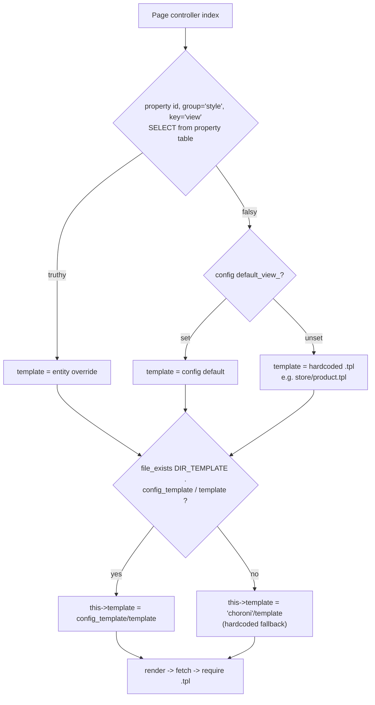
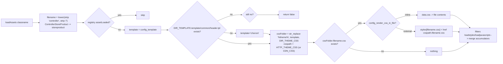
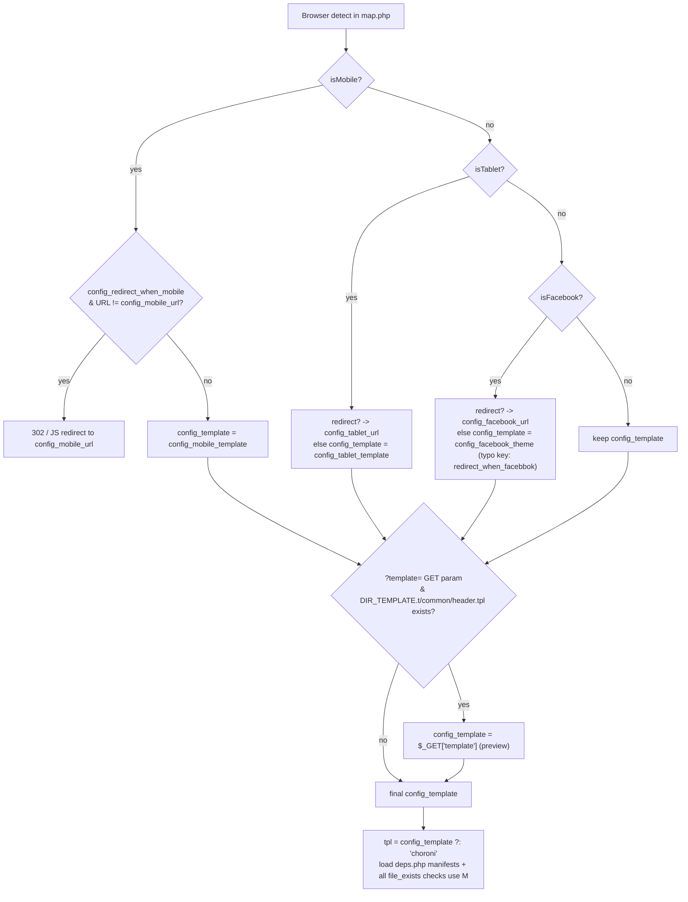
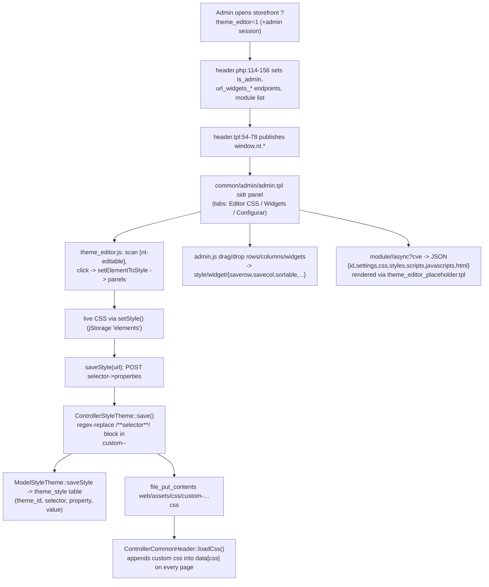
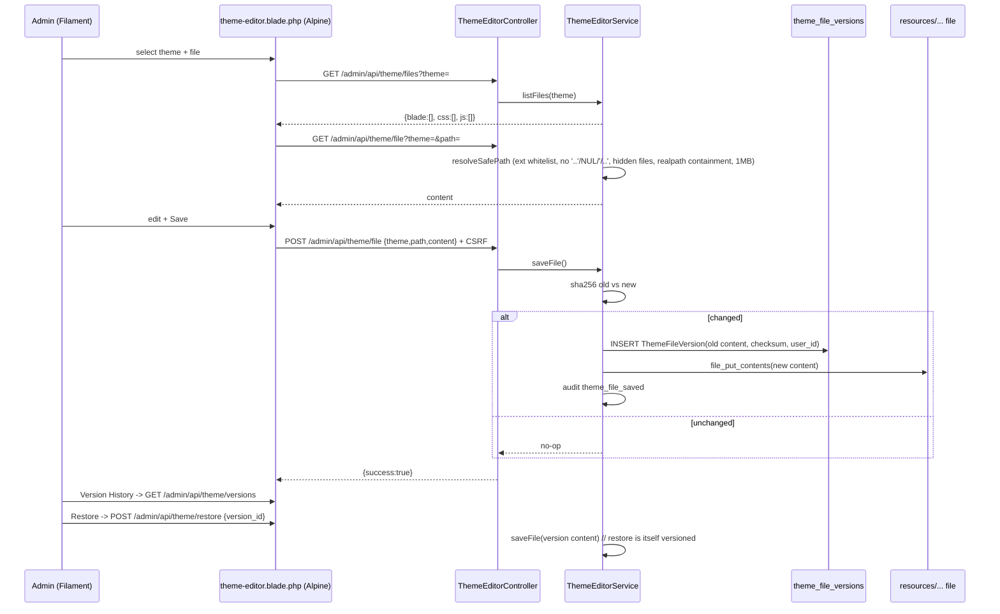

# 3-b-1 — Template & Theme Blueprint (Legacy Necoyoad + necoyoad-next)

Research agent: Explore-templates. All file:line refs verified against source at `/home/z/necoyoad`.
Orientation source: `docs/architecture/necoyoad_architecture_blueprint_v3_rendering_pipeline.tex` (2,713 lines) — claims re-verified in source; divergences noted.

---

## PART A — LEGACY TEMPLATE SYSTEM (repo root app)

### A.1 Theme directory structure

**Only one theme ships: `choroni`.** `app/shop/view/theme/` contains exactly one subfolder (verified via LS).

```
app/shop/view/theme/choroni/          ← 332 .tpl files total (verified count)
├── common/        (19)  Layout templates: header.tpl, footer.tpl, home.tpl,
│                        column_left.tpl, column_right.tpl, maintenance.tpl,
│                        success.tpl, admin/*.tpl (visual-editor chrome:
│                        admin.tpl, admin-theme-configurator.tpl,
│                        admin-theme-{background,fonts,dimensions,shadows,
│                        borders,borderradius,margins,paddings}.tpl,
│                        admin-widgets.tpl)
├── shared/        (56)  Fragments included by every page template:
│                        widgets-rows.tpl, widgets-featured.tpl,
│                        widgets-featured-footer.tpl, widgets-column-{left,
│                        center,right}.tpl, widgets-common.tpl,
│                        widget-head.tpl, widget-footer.tpl,
│                        breadcrumbs.tpl, messages.tpl, sort.tpl,
│                        module-heading.tpl, catalog-info.tpl,
│                        catalog-picture.tpl, blockgrid-start/end.tpl,
│                        featured-widgets.tpl, featured-footer-widgets.tpl,
│                        fragment/header-start.tpl (319 lines),
│                        fragment/footer-start.tpl (29 lines),
│                        fragment/form-*-heading.tpl,
│                        fields/*.tpl (~25 form-field fragments: address,
│                        city, country, zone, email, rif, gender, birthday,
│                        payment/*, shipping/*…), product/sticker.tpl,
│                        product/quickview-deps.tpl
├── module/       (169)  One .tpl per widget type + per "view" variant:
│                        product_list.tpl → includes product_list_<view>.tpl
│                        (variants: _default, _grid, _list, _carousel,
│                        _slider); links_01..07, plugin_template.tpl,
│                        rooms/*, theme_editor_placeholder.tpl, …
├── banner/        (33)  Slider-engine templates, one per jquery_plugin:
│                        nivo-slider.tpl, slick.tpl, camera-v1.3.4.tpl,
│                        slicebox-v1.1.0.tpl, evolution-v1.1.5.tpl,
│                        layer-slider-v0.0.1.tpl, jssor-vertical-nav.tpl,
│                        horizontal-hover-effect-01..15.tpl, necoslider.tpl,
│                        fancybox-gallery.tpl, fancybox-grid.tpl,
│                        grid-gallery.tpl, parallax-content-slider.tpl,
│                        horizontal-parallax.tpl, eislideshow.tpl,
│                        vertical.tpl, horizontal.tpl, carousel.tpl …
├── store/         (11)  product.tpl, product_quickview.tpl, products_all.tpl,
│                        category.tpl, categories.tpl, manufacturer(s).tpl,
│                        search.tpl, special.tpl, review.tpl, comment.tpl
├── content/       (10)  post.tpl, posts.tpl, page.tpl, page_embed.tpl,
│                        category.tpl, categories.tpl,
│                        landing_page_necotienda{,_svg_01..03}.tpl
├── account/       (22)  login/register/edit/password/addresses/order/invoice/
│                        payment/payment_receipt/balance/download/message*/
│                        review*/column_left.tpl …
├── checkout/       (3)  cart.tpl, cart_header.tpl, success.tpl
├── payment/        (4)  payu.tpl, payu_webcheckout.tpl, payu_redirect.tpl,
│                        pp_standard.tpl
├── page/           (2)  sitemap.tpl, deprecated.tpl
├── error/          (1)  not_found.tpl
└── localisation/   (2)  languages.tpl, currencies.tpl
```

**Theme asset roots (separate from templates):**
- `web/assets/theme/choroni/css/` — 57 entries (route-named CSS: `commonhome.css` pattern, `modulebanner.css`, `modulelinks01.css`, `color-default.css`, `grids.css`, `deps.php` manifest, `framework/`, `vendor/slick.css`…)
- `web/assets/theme/choroni/js/` — `deps.php`, `theme.js`, route-named JS (`storeproduct.js`, `moduleproductlistcarousel.js`…)
- `web/assets/theme/mobile/{css,fonts,images,js}` — a second **asset** theme (mobile) exists even though no `mobile` **template** theme exists in `app/shop/view/theme/` — all template fallbacks land on `choroni`.

### A.2 Path constants & `%theme%` substitution

`app/shop/config.php`:
- `DIR_TEMPLATE = $privatePath . "view/theme/"` — **line 47** (i.e. `app/shop/view/theme/`)
- HTTP theme assets with `%theme%` placeholder — **lines 30–33**:
  - `HTTP_THEME_CSS  = HTTP_HOME . "assets/theme/%theme%/css/"`
  - `HTTP_THEME_JS   = HTTP_HOME . "assets/theme/%theme%/js/"`
  - `HTTP_THEME_IMAGE= HTTP_HOME . "assets/theme/%theme%/images/"`
  - `HTTP_THEME_FONT = HTTP_HOME . "assets/theme/%theme%/fonts/"`
- Filesystem theme assets — **lines 61–63**: `DIR_THEME_CSS/JS/IMAGE = $publictPath . "assets/theme/%theme%/{css,js,image}/"`
- Shared (non-theme) assets: `HTTP_CSS`/`DIR_CSS` = `web/assets/css/`, `HTTP_JS`/`DIR_JS` = `web/assets/js/` (lines 26–28, 57–58).

The `%theme%` token is substituted at runtime by `str_replace('%theme%', $template, …)` in:
- `system/engine/controller.php` `_loadAssets()` **lines 759–769** (both HTTP path + DIR folder, with `'default'` fallback branch)
- `system/engine/controller.php` `__loadCss()` **lines 408–413** (fallback to literal `"choroni"`)
- `app/shop/map.php` **lines 263–267** (`$jsPath = DIR_THEME_JS|HTTP_THEME_JS`; `require_once(str_replace("%theme%", $tpl, DIR_THEME_JS) . 'deps.php')`) and **lines 304–307** (css deps.php)
- `app/shop/controller/common/header.php` `loadCss()` **lines 337–344**
- `system/classes/module.php` `loadWidgetAssets()` **lines 71–94** (converts DIR→HTTP for async JSON responses)
- Template-side: `common/header.tpl` **lines 50–51** (`window.nt.http_theme_image/http_theme_js`), and CSS rewrite of relative URLs `../images/`, `../fonts/` in `__loadCss()` **lines 440–443**.

Admin app mirrors this: `app/admin/config.php` **lines 38–41** (`HTTP_ADMIN_THEME_CSS…`), **54** (`DIR_TEMPLATE = app/admin/view/templates/`), **59–62** (`DIR_ADMIN_THEME_*`), **82** (`DIR_THEME_ASSETS = web/assets/theme/`).

### A.3 The template engine — raw PHP + `` tokens

**`.tpl` files are raw PHP templates** executed by `include`/`require` inside `Controller::fetch()`. There is no Smarty/Twig; the only non-PHP syntax is the string placeholder `` which is replaced **after** the template executes.

**`system/library/template.php` (24 lines) is DEAD CODE** — `final class Template` with `fetch()` doing `DIR_TEMPLATE . $filename` + `extract()` + `include`. A repo-wide grep for `new Template(` returns nothing, and `Loader::library('template')` is never called (loader would `include system/library/template.php` — `system/engine/loader.php:31-43`). It is OpenCart heritage; the real engine is in the Controller base class.

#### A.3.1 `Controller::render($return = false)` — `system/engine/controller.php:203-316`

Order of operations (verified):
1. **Hook short-circuit**: `$hasToReturn = $this->runHook("render", $this, $return); if ($hasToReturn) return $hasToReturn;` (lines 206–209).
2. **Cache key decoration** (lines 216–234): device suffix from `Browser` library (`.mobile` / `.tablet` / `.facebook` / `.pc`) + customer logged flag appended to `$this->cacheId`.
3. **Cache lookup** (lines 236–238): only when an admin is NOT logged in (`$user->islogged()` false); sub-key = `substr($this->cacheId, 0, strpos($this->cacheId, '.'))`.
4. On cache miss — **own asset loading** (lines 241–247): `loadAssets($this->ClassName[, APP_PATH])` then `loadAssets($this->Route[, APP_PATH])` (both normalize to the same filename; dedup via registry `assetLoaded`).
5. **Child loop** (lines 249–294): for each `$this->children` entry build `new Action($child)`, `require_once` the controller file, instantiate, call `$controller->index($params)` (params come from `$this->widget[$key]` for widgets or `getChildParams()` for layout children), capture `$controller->output`. Publication rule **lines 280–285**:
   - **string key** (widget child): `$this->data[$key.'_hook'] = $key; $this->data[$key.'_code'] = $output;`
   - **numeric key** (layout child): `$this->data[$controller->id] = $output;` → `$header`, `$footer`, `$column_left`, `$column_right` template vars.
   - Child loading also triggers per-child `loadAssets($class.$this->Method)` + `loadAssets($class)` (lines 265–271) — assets for `store/product/quickview` become `storeproductquickview.css`.
6. **Own template render** (lines 296–299): `trigger('beforeRender', $tpl); $r = $this->fetch($tpl); trigger('afterRender', $r);`
7. **Cache write-back** if `$return` (lines 301–305).
8. Output disposition: `return $r` or `$this->output = $r` (306–315).

#### A.3.2 `Controller::fetch($filename)` — `system/engine/controller.php:318-399`

The 12-step template-execution primitive:
1. **Hook**: `runHook("fetch", $filename, $this)` — short-circuit (321–324).
2. **Path resolution** (326–330): if `$this->templatePath` is a dir → `$file = $this->templatePath . $filename`; else `$file = DIR_TEMPLATE . $filename`. (`templatePath` is how `app/modules/mymodule/app/shop/controller/home.php:34` ships module-local templates: `$this->templatePath = dirname(__FILE__) . "/../view/template/";`.)
3. **Existence check** (332, 390–398): missing file returns '' silently unless `NTS_DEBUG_MODE` (then `exit` with message). Empty template pointer logs error in debug mode.
4. **Six magic services injected into the view-model** (333–341):
   - `$Config` (Config singleton), `$Language`, `$l` (closure `fn(string $str) => $this->language->get($str)`), `$Request`, `$Url` (fresh `new Url($this->registry)`), `$Image` (fresh `NTImage`), plus `$is_admin = true` when `User->getId()`.
5. **Class-name specials** (343–348): `ControllerCommonFooter` → `$this->data['javascripts'] = registry('javascripts')`; `ControllerCommonHeader` → `__loadCss()` + `$this->data['header_javascripts']`.
6. `extract($this->data)` (350) → view-model becomes local PHP vars.
7. Output buffering `require($file)` (351–354).
8. **First-pass `` substitution** (356–366): for string-keyed children, `str_replace('', $this->data[$key.'_code'], $content)`; on successful replacement `unset($this->children[$key])`.
9. **Second pass** (368–374) — catches tokens that appeared inside widget output.
10. **HTML post-processing** (376–384): strip multiline `/* */` comments; collapse `\n\n`/`\r\r` (note: buggy literal patterns `"/\n{2,}/"` are used as needle strings, not regex); if `config_minified_html && defined('STORE_ID')` → strip newlines + collapse whitespace (storefront only, never admin).
11. **Render filter**: `$content = $this->applyFilters("render", $content);` (387).
12. Return `$content`.

**Tokens**: only `` exists. Emitted by `shared/widgets-rows.tpl:17`:
```php
<?php foreach($column['widgets'] as $l => $widget) { ?>  <?php } ?>
```
and by `error/not_found.tpl:12` (``). Substitution is plain `str_replace` post-execution (not tree-based).

**Child key duality** (from `addChild()` `system/engine/controller.php:178-189`): `array_push($this->children, $child)` → numeric keys for layout children (`common/header` etc.); widget children enter via `array_merge($this->children, $row['children'])` in `loadWidgets()` where `$row['children'][$widgetName] = $settings['route']` → string keys.

#### A.3.3 `Controller::loadWidgets()` — `system/engine/controller.php:453-715`

- Hook short-circuit (464–472); Browser/Customer detection incl. **admin force-override GET params** `?force_mobile=1`, `?force_tablet=1`, `?force_facebook=1`, `?force_customer_session=1` (484–487).
- Instantiates `NecoWidget($registry, $this->Route)` after `load->helper('widgets')` (489–490).
- **Full-tree branch** (492–630): params array with `store_id, landing_page (from session), position, show_in_mobile/tablet/facebook, customer_session_mode, conditional_logic_when_route_contains, show_in_desktop, full_tree` (494–505); `$rows = $widgets->getRows($params, !$this->user->getId())` (512) — 2nd arg = use cache only when no admin.
- For each row (513–566): merge `$row['children']` into `$this->children` (widget children), merge `$row['widget']` into `$this->widget`, then **inline row CSS with markers** (527–543):
  ```php
  $this->css = array_merge($this->css, array(
      $row['key'] => "\n/**{$row['key']}**/\n" . $row_settings['style'] . "\n/** /{$row['key']}**/\n"));
  ```
  `$this->css` is an **array keyed by widget/row key** (stored in the Registry via `__set`), minified inline (comment-strip + whitespace collapse applied to style first). Filters: `rowcss`, `columncss` (542, 564).
- Same treatment for each column's `value` settings (545–565).
- **Per-object override** (569–629): if `session('object_type'|'object_id')` set → `getRows()` re-run with object filter, merged. This is the per-entity *widget* override companion to the per-entity *template* override.
- **Flat branch** `$full_tree = false` (631–714): `getWidgets($position, $app)` list; honors `customer_session_mode` logon/logoff skip (636–646), device flags `showonmobile`/`showondesktop` (649), registers `$this->children[$widget['name']] = $settings['route']` only when `settings['autoload']` (650, 663–664).
- Both branches end with `$this->data['rows'][$position] = $rows;` (630, 713) — the raw row tree consumed by `widgets-rows.tpl`.
- Position may carry a `only:` prefix to skip the default tree (line 510: `if (!strpos($position, 'only:'))`).

#### A.3.4 `Controller::loadAssets()` / `_loadAssets()` — `system/engine/controller.php:717-822`

- `loadAssets($classname, $subfolder=null)` **line 717**: `$filename = str_replace('/', '', str_replace('controller', '', strtolower($classname)))` — **naming convention**: route `common/home` → `commonhome`; class `ControllerStoreProduct` → `storeproduct`; `store/product/quickview` → `storeproductquickview`; module `module/banner` → `modulebanner`.
- `_loadAssets()` (723–822):
  - Registry dedup list `assetLoaded` (727–743).
  - Hook `loadAssets` (733–739).
  - **Theme resolution sentinel** (750–752): `$template = $config->get('config_template'); if (!file_exists(DIR_TEMPLATE . $template . '/common/header.tpl')) $template = 'choroni'; if (!file_exists(...)) return false;` — *a theme is "valid" iff it has `common/header.tpl`*.
  - CDN override: `CDN_CSS`/`CDN_JS` constants take precedence over `HTTP_THEME_CSS/JS` (755–756).
  - `%theme%` substitution for both HTTP path and DIR folder (758–770); with `$subfolder` (e.g. `APP_PATH='m'`), uses `config_{subfolder}_template`, `HTTP_{SUBFOLDER}_THEME_CSS`, `DIR_{SUBFOLDER}_THEME_CSS` constants (771–786).
  - Filters: `csspath`, `cssfolder`, `jsfolder`, `jspath` (789–793).
  - **CSS** (795–803): if file exists and `config_render_css_in_file` → inline via `file_get_contents` into `$this->data['css']` (note: line 798 has a bug — `$_css = $this->applyFilters("processcss", $cssFolder, $filename, $template);` discards the previously read contents); else push external `$styles[$filename.'.css'] = ['media'=>'all','href'=>$csspath.$filename.'.css']`.
  - **JS** (805–811): inline mode stores DIR path, external mode stores HTTP path into `$javascripts`.
  - Filters `loadstyles` / `loadjavascripts` (813–817); merge into `$this->styles` / `$this->javascripts` (819–820) — Registry-backed accumulators shared across controllers.

#### A.3.5 `Controller::__loadCss()` — `system/engine/controller.php:401-451`

Header-specific CSS assembly: route CSS file (`str_replace('/','',strtolower($this->Route).'.css')` line 416), inline-vs-external decision (417–423), drain `$styles` into `$this->data['css']` when inlining (425–434), `loadcss` filter (437), then **relative-URL rewriting** (439–444): `../../../images/` → `HTTP_IMAGE`, `../images/` → `%theme%`-substituted `HTTP_THEME_IMAGE`, `../fonts/` → `HTTP_THEME_FONT`, bare `../` stripped. `loadstyles` filter → `$this->data['styles']`.

### A.4 Template resolution chain (page level)

**Canonical pattern** (identical in every page controller — verified in `common/home`, `store/product`, `store/category`, `store/manufacturer`, `content/page`, `content/post`, `content/category`, `error/not_found`):

```php
// 1) Per-entity EAV override — property group 'style', key 'view'
$template = $this->modelProduct->getProperty($product_id, 'style', 'view');          // store/product.php:168
$template = $this->modelCategory->getProperty($category_id, 'style', 'view');        // store/category.php:95
$template = $this->modelPost->getProperty($post_id, 'style', 'view');                // content/post.php:80
$template = $this->modelPage->getProperty($page_id, 'style', 'view');                // content/page.php:100 (+159 for embed)
$template = $this->modelCategory->getProperty($category_id, 'style', 'view');        // content/category.php:73

// 2) Store-level config default (set via admin Style→Views screen)
$default_template = $this->config->get('default_view_product') ?: 'store/product.tpl';  // product.php:169

// 3) Use override if present, else default
$template = empty($template) ? $default_template : $template;                        // product.php:170

// 4) Theme-dir resolution: active theme if it has the file, else hardcoded 'choroni'
if (file_exists(DIR_TEMPLATE . $this->config->get('config_template') . '/' . $template)) {
    $this->template = $this->config->get('config_template') . '/' . $template;       // product.php:171-172
} else {
    $this->template = 'choroni/' . $template;                                        // product.php:173-174
}
```

**EAV lookup implementation** — `Model::getProperty()` `system/engine/model.php:1713-1716` → `__getProperty()` (1361–1364) → `__getProperties()` (1378+): `SELECT * FROM {prefix}property WHERE object_type=? AND object_id=? AND group=? AND key=?` — returns `$rows[0]['value']` or `false`. (`$this->object_type` is declared per model, e.g. `product`.) Some models override `getProperty()` directly (menu, banner, campaign, customer, order, review, manufacturer, attribute…).

**Admin UI for store-level defaults** — `app/admin/controller/style/views.php`: `ControllerStyleViews::index()` sets ~50 `default_view_*` settings via `$this->modelSetting->update('views', $this->request->post)` (line 12–14) — covering `default_view_home`, `default_view_page{,_all,_error,_review,_comment}`, `default_view_post{,_all,_error,...}`, `default_view_product{,_all,_error,_review,_comment,_related}`, `default_view_product_category{,_all,_home,_error}`, `default_view_manufacturer{,_all,_home,_error}`, `default_view_account_*` (login/register/order/invoice/payment_receipt…), `default_view_search/special/contact/sitemap/maintenance/not_found` (lines 25–93). It also enumerates theme .tpl files with `glob` for the picker (114–122).

**Error templates**: `store/product.php:225-229` error404 → `default_view_product_error ?: 'error/not_found.tpl'` with same theme check. Home: `common/home.php:47-51` (`default_view_home ?: 'common/home.tpl'`).

**Special page embed**: `content/page.php:159-165` — `default_view_page ?: 'content/page_embed.tpl'` for embedded pages; `page_embed.tpl` renders only `widgets-featured` + a full-width `widgets-rows` (`$position='main'`) + `widgets-featured-footer`, i.e. a widget-only canvas without header/footer children (the embed path renders standalone).

**`$tpl` shared-fragment inheritance** — every theme template begins with (e.g. `common/home.tpl:2`, `module/product_list.tpl:1`, `account/invoice.tpl:2`):
```php
<?php $tpl = is_dir(DIR_TEMPLATE. $this->config->get('config_template') ."/shared")
      ? $this->config->get('config_template') : "choroni"; ?>
```
then `include(DIR_TEMPLATE . $tpl . "/shared/widgets-rows.tpl")` etc. → a child theme can override page templates while inheriting choroni's `shared/` fragments.

### A.5 Widget/module template resolution (module level)

`app/shop/controller/module/modulecontroller.php` — `ControllerModuleModuleController extends Module` (`system/classes/module.php`, whose constructor computes `$this->moduleRoute = 'module/'.str_replace('controllermodule','',strtolower($class))` and calls `loadDeps($this->moduleRoute)` — line 10–11):

- `index($widget=null, $render=false)` (line 166):
  - `$settings = (array)unserialize($widget['settings'])`; `widgetName` published (183–185); `$settings['module'] ??= $this->moduleName` (187); defaults merged (189–193); `$settings['view'] ??= 'default'` (**line 196**).
  - Per-widget inline CSS with same `/**key**/…/** /key**/` markers (200–213).
  - **Asset route** (214–215): `$route = 'module/<module>/<view>'` → `loadDeps()`; asset filename `str_replace(['controller','_','/'],'',strtolower($settings['route'])).$settings['view']` (line 217) → e.g. `modulebannerdefault.css/js`.
  - **Template selection** (218–222): `module/<moduleName>.tpl` under active theme, else `choroni/module/<moduleName>.tpl`.
  - `module:settings` filter seam (225–231) — each concrete module registers a filter in its `init()` to load data and may **override `$this->template`** (banner does; see below).
  - `?cve` (theme-editor preview) branch (272–293): renders `choroni/module/theme_editor_placeholder.tpl` and returns JSON `{id, settings, javascripts, scripts, styles, css, html}` — the visual editor's per-widget refresh payload.
  - `$render=true` (async, 236–259): same JSON payload via `Json::encode` after `loadWidgetAssets($filename, null, true)` which converts filesystem paths back to URLs (system/classes/module.php:64–106).
- `async()` (296–314): endpoint `?r=module/<name>/async&w=<widgetName>` → `NecoWidget::getWidget($name, false)` then `index($widget, true)`.

**View variants**: the wrapper `module/<name>.tpl` includes the variant file, e.g. `module/product_list.tpl:3`:
```php
<?php include("product_list_". $settings['view'] .'.tpl'); ?>
```
→ `product_list_default.tpl | _grid | _list | _carousel | _slider`. Widget wrapper contract: `shared/widget-head.tpl` (throws `Exception("FATAL ERROR: The index module is not set...")` line 2 if `$settings['module']` missing) opens `<li data-necotienda_module=… data-landing_page=… data-widget=… nt-editable="1" movable="1" removable="1" configurable="1" class="box <module>-widget" id="<widgetName>">` (+ transition data-attrs, offset positioning, sticky/shrink attrs — lines 16–43, wrapper `<div class="container">` for fixed-width/transitions 45–63); `shared/widget-footer.tpl` closes it.

**Banner engine selection** — `app/shop/controller/module/banner.php:57-76`: per-banner `jquery_plugin` setting picks `banner/<jquery_plugin>.tpl` (active theme → choroni → **hard fallback `choroni/banner/nivo-slider.tpl`**), plus `sliders/<plugin>/slider.js|css` from shared asset dirs. Banner module therefore has no `module/banner.tpl` — the filter overrides `$this->template` entirely.

### A.6 Key layout templates & composition

- **`common/home.tpl`**: `echo $header` → `#contentContainer.tpl-home[nt-editable]` → include `shared/widgets-featured.tpl` → `#mainContentContainer > .row` → conditional left column (`if ($column_left)`) include `widgets-column-left.tpl`, always `widgets-column-center.tpl`, conditional right → include `widgets-featured-footer.tpl` → `echo $footer`.
- **`shared/widgets-featured.tpl`**: sets `$position='featuredContent'`, includes `widgets-rows.tpl`.
- **`shared/widgets-column-center.tpl`**: responsive Foundation-style grid width — `large-6` if both columns active, `large-9` if one, `large-12` if none; `$position='main'`; includes `widgets-rows.tpl`.
- **`shared/widgets-rows.tpl`** (the heart): iterates `$rows[$position]`; row wrapper `<div data-row data-position class="row[ container if layout_width==fixed][ classnames]" id="{position}_{row_id}" nt-editable>` (line 7); column wrapper `<div data-column data-position class="large-{grid_large} medium-{grid_medium} small-{grid_small}" id="{position}_{col_id}" nt-editable>` (line 15); `<ul class="widgets">` with `` tokens (line 17). Row/column settings are `unserialize($row['value'])`.
- **`shared/widgets-common.tpl`**: the generic inner-page scaffold = featured + breadcrumbs + 3 columns + featured-footer (used by store/content templates).
- **`common/header.tpl`**: `<head>` (styles loop lines 34–39, inline `<style>$css</style>` line 41, include `fragment/header-start.tpl` line 43, `window.nt.*` config incl. admin editor URLs lines 45–79) + `<body nt-editable="1">` + `#mainContainer.container` + `#header` position widgets (line 94–95). Admin chrome include is commented out at line 84 (`//if ($is_admin) { require_once('admin/admin.tpl'); }`) — the visual-editor sidebar (`common/admin/admin.tpl`, sidr panel with tabs "Editor CSS"/"Widgets"/"Configurar") is activated instead via `?theme_editor=1` + `$is_admin` (see A.8).
- **`common/footer.tpl`**: `#footer` position widgets + copyright + include `fragment/footer-start.tpl` (deferred JS/CSS loader) + closes `#mainContainer`.
- **`shared/fragment/header-start.tpl`** (319 lines): dns-prefetch, sticker `:before` styles, `$header_javascripts` script tags, inline `$scripts`, `window.I18n` / `window.Context.User|Product` / `window.Constants` (CSS_PATH, JS_PATH, THEMECSS_PATH…) / `window.Requests.QUICK_VIEW` / `window.Mq`, IE shim, rAF polyfill, critical-CSS async loader (`fetchStyle/fetchScript/appendToHead`).
- **`shared/fragment/footer-start.tpl`** (29 lines): `$javascripts` tags, inline scripts bucket, defers remaining `$styles`/`$css` to DOM-ready, `UItoTop()`.
- **Print/invoice**: `account/invoice.tpl` (order invoice, 165 lines), `account/payment_receipt.tpl`, `account/order_payment.tpl` — standard page templates (not standalone HTML) that also render widget positions.
- **Maintenance**: `common/maintenance.tpl` rendered by `ControllerCommonMaintenance` pre-action.

### A.7 Footer script bucketing & header/footer controllers

- `ControllerCommonFooter::index()` (`app/shop/controller/common/footer.php`): `$this->id='footer'` (line 17); pushes a `moduleSearch`/`moduleSearchFilters` JS function into `$this->scripts` (25–83); buckets `$this->scripts` by `method` → `ready`($r_output) / `window`($w_output) / `function`($f_output) (84–102); `loadWidgets('footer')` (104); `loadCss()`/`loadJs()` (106–107); template `config_template.'/common/footer.tpl'` → `'choroni/common/footer.tpl'` (130–132); `render()`.
- `ControllerCommonHeader::index()` (`app/shop/controller/common/header.php`): IE redirect, language/currency switch (hl/cc GET), session `token` (58–62), base/icon/logo/document meta (64–90), OpenGraph for `$params['product'|'category']` (92–111 — effectively dead, no caller passes params), admin detection + `?theme_editor` URL wiring for the inline editor (113–156: `url_widgets_load = Url::createUrl('module//async')`, `url_widgets_save|savecol|saverow|sortable|sortrow|sortcol|delete|deletecolumn|deleterow` → `Url::createAdminUrl('style/widget/…')`, plus module list via glob of `DIR_ADMIN_APPLICATION.controller/module/*`); `loadWidgets('header','shop',true)` (158); `loadCss()`/`loadJs()` (160–161); `$this->id='header'` (255); template `…/common/header.tpl` (257–259); `render()`.
- **Header `loadCss()`** (334–377): drains Registry `$this->css` (the per-row/column/widget marker-CSS array) into `$this->data['css']`; loads `custom-<theme_default_id>-<config_template>.css` from `DIR_CSS` (or theme css folder fallback) — **lines 358–368** — this is the generated theme-style override file; admin CSS `HTTP_ADMIN.'css/frontend/admin.css'` when admin logged (370–374).

### A.8 Device-based theme switching & preview

`app/shop/map.php` (verified lines 199–257):
- Mobile: `config_redirect_when_mobile` + URL mismatch → 302/JS redirect to `config_mobile_url`; else `config->set('config_template', config_mobile_template)` (201–211).
- Tablet: `config_redirect_when_tablet` / `config_tablet_url` / `config_tablet_template` (212–222).
- Facebook (note legacy typo `config_redirect_when_facebbok`): `config_facebook_url` / `config_facebook_theme` (223–234).
- **Preview override**: `?template=<name>` swaps `config_template` if `DIR_TEMPLATE.<name>/common/header.tpl` exists (255–257).
- `$tpl = config_template ?: 'choroni'` (259) used for deps.php loading (266, 306).
- Asset manifest boot (261–321): `require deps.php` from `web/assets/theme/<tpl>/{js,css}/`; route-filtered pushes into `$javascripts/$header_javascripts/$scripts/$styles`; leftovers stored in Registry `js_assets|js_header_assets|jsx_assets|css_assets` for later `Module::loadDeps()`; final registry sets (317–321).
- `deps.php` manifest shape (verified `web/assets/theme/choroni/css/deps.php`: 176 lines; js/deps.php: 153 lines): `$css_assets = ['key' => ['css'=>['media','href'], 'routes'=>'*'|[...]], ...]` with header comment documenting the magic naming convention (lines 24–47: "for common/home route create commonhome.css … for a module view create module[module_name][view].css"). JS: `$js_assets`, `$js_header_assets`, `$jsx_assets` (inline `<script>` via `file_get_contents`).

### A.9 Visual theme editor (legacy)

Three cooperating pieces:

1. **Inline editor chrome** — activated by `?theme_editor=1` when an admin session exists:
   - `header.tpl:54` `if ($is_admin || $_GET['theme_id'])` publishes `window.nt.uid/token/http_admin…` and all `url_widgets_*` endpoints.
   - `common/admin/admin.tpl`: sidr side panel (`#adminTools`), tabs `tabThemeConfigurator` (Editor CSS → `admin-theme-configurator.tpl`), `tabWidgets` (→ `admin-widgets.tpl`), `tabWidgetsSettings`; per-property editor panels `admin-theme-{background,dimensions,fonts,borders,borderradius,margins,paddings,shadows}.tpl`; jQuery-UI sliders for margins/paddings; `image_upload()` dialog opens admin filemanager iframe (lines 47–70).
   - `web/admin/js/frontend/theme_editor.js` (2,498 lines): jQuery + jStorage; key functions `renderPanels()` (553), `loadStyle()` (697), `setElementToStyle()` (977), `translateCssProperties()` (999), `setStyle()` (1545), `reset*()` per property group (2003–2407), `copyStyle/pasteStyle` (2430/2445), **`saveStyle(url)`** (2463–2478): reads `$.jStorage.get('elements')` (selector → properties map), POSTs to the theme save URL; activated only when `getUrlVars()['admin_tools']` (line 3).
   - `web/admin/js/frontend/admin.js` (2,468 lines): the drag/drop widget manager (sortable rows/columns/widgets via the `url_widgets_*` endpoints).
   - **`nt-editable` / `movable` / `removable` / `configurable` attributes** on every widget `<li>` (widget-head.tpl), row/column `<div>` (widgets-rows.tpl), page containers (home.tpl etc.), `<body>` (header.tpl:82) are the DOM hooks.

2. **CSS persistence** — `app/admin/controller/style/theme.php`:
   - `ControllerStyleTheme::save()` (136–418): builds selector-scoped CSS blocks wrapped in `/**$selector**/ … /**$selector**/` markers inside `web/assets/css/custom-<theme_id>-<config_template>.css` (filename line 138; old block removed via `preg_replace("%(/\*\*$selector\*\*/)(.*?)(/\*\*$selector\*\*/)%s","",...)` line 154; write line 415); covers background, dimensions, font, box-shadow, border (incl. per-side), border-radius (vendor-prefixed), margin, padding (159–407). Then `modelTheme->saveStyle(theme_id, $data)`.
   - `ModelStyleTheme::saveStyle()` (`app/admin/model/style/theme.php:162-176`): `DELETE` + bulk `INSERT INTO {prefix}theme_style (theme_id, selector, property, value)` — the CSS-rule EAV table. Also `getById` supplies `theme_default_id` (used by header loadCss).
   - Theme CRUD (`insert/update` 43–125): `theme` table rows with `theme_default_id` stored as a `setting` property; default toggling via `modelSetting->updateProperty('theme','theme_default_id', …)`.
   - Consumption: `ControllerCommonHeader::loadCss()` appends `custom-<theme_id>-<template>.css` (header.php:358–368).

3. **Code editor (file editor)** — `app/admin/controller/style/editor.php` `ControllerStyleEditor`:
   - `index()` (26–135): lists theme `.tpl` files (glob of `view/theme/<template>/*/ *.tpl`) and theme `css/*.css`; POST saves raw code with `fopen($folder.$f,'w+')` (52–57) — `$f` comes from GET; t=css targets `DIR_THEME_ASSETS<tpl>/css/`, t=tpl targets `DIR_CATALOG.view/theme/<tpl>/`.
   - `file()` (137–150): JSON read of any path passed in GET `f`.
   - `save()` (152–168): nominal guard `strpos($file, realpath(DIR_THEME_ASSETS)) >= 0 || …` (note: `>= 0` is always true when strpos returns 0 or the string is at offset 0; `strpos` false casts to 0 → guard ineffective) then `fopen($f,'w+')`.
   - **Security posture (documented as flaws in the rewrite)**: no path-traversal protection, no extension whitelist (PHP editable → RCE), no backup, no CSRF, silent failures. (The rewrite's ThemeEditorService docblock cites exactly this — see B.2.)

4. **Widget layout manager** — `app/admin/controller/style/widget.php` `ControllerStyleWidget`: tree browser for rows/columns/widgets per store + landing_page (63–96); and `app/admin/controller/module/widgetcontroller.php` `ControllerWidgetController::widget()` form: discovers **view variants** via `glob(DIR_CATALOG.'view/theme/<t>/module/<moduleName>_*.tpl')` (356–361) — populating the "view" select; lists module CSS/JS via `glob(DIR_THEME_ASSETS.<template>/css/module<name>*.css)` (367–377); default widget settings object with `view='default'`, `customer_session_mode='any'`, `conditional_logic_action='show'`, `landing_page='all'`, and string-encoded `row_id=…`/`col_id=…`/`object_type=…` params (406–435); `widget:settings` filter seam (444); admin form template `module/<name>/widget.tpl` under `default/` admin template (450–455).

### A.10 Email templates (adjacent subsystem)

`web/admin/email_templates/01_defaults/{pago-nuevo, pedido-nuevo, cliente-nuevo, replica-nueva, comentario-nuevo, happy-birthday}/index.html` (+ `preview.gif` each) — HTML email templates loaded via `DIR_EMAIL_TEMPLATE` (admin config.php:58); rendered by `system/cron/api/*::prepareTemplate()` (string substitution, not the .tpl engine).

---

## PART B — necoyoad-next TEMPLATE/THEME SYSTEM (Laravel 11 + Filament 3 + Livewire 3)

### B.1 `app/Services/TemplateResolver.php` (55 lines) — FULL analysis

```php
public function resolve(?string $entityTemplate, string $type, string $fallback): string
{
    $template = $entityTemplate;                                  // 1. per-entity override
    if (!$template) $template = config("necoyoad.defaults.{$type}"); // 2. config default
    if (!$template) $template = $fallback;                        // 3. hardcoded fallback
    $theme = $this->storeContext->setting('config_template', 'choroni');  // active theme from Store.settings JSON
    if (view()->exists("themes.{$theme}.{$template}")) return "themes.{$theme}.{$template}";  // active theme
    if (view()->exists("themes.choroni.{$template}")) return "themes.choroni.{$template}";    // choroni fallback
    return $fallback;                                             // final fallback (app-level view name)
}
```
- **Resolution algorithm**: entity template → `config('necoyoad.defaults.<type>')` → hardcoded fallback; then a *second* axis: active theme (`StoreContext::setting('config_template')` — `app/Services/StoreContext.php:104-107` reads `Store->settings[$key]` JSON column) → `choroni` → bare fallback name.
- **Naming convention**: dot views `themes.<theme>.<folder>.<name>` mapping to `resources/views/themes/<theme>/<folder>/<name>.blade.php`; fallbacks like `content.home`, `store.product` are *relative to the themes namespace*.
- **No cache** of its own (Blade's view `exists()` check uses Laravel's view finder + compiled cache); resolution cost per request.
- **Callers** — `app/Http/Controllers/StorefrontController.php`: home (39–43, `entityTemplate: null, type:'home', fallback:'content.home'`), product (59–63, `$product->getProperty('style','view')`), category (84–88), post (110–114), page (136–140), search (162–166, type `'search'`), allProducts (181–185, type `'products'`), allCategories (198–202, type `'categories'`), allPosts (215–219, type `'posts'`). **NOTE**: config keys in `config/necoyoad.php:15-25` are `home, product, category, post, page, post_all, category_all, product_all, search` — but the controller passes types `products`, `categories`, `posts` for the "all" pages, which do **not** exist in the config (`post_all` etc. never match) — an inconsistency; those pages always fall to the hardcoded fallback.
- **Config defaults** (`config/necoyoad.php`): `'defaults' => ['home'=>'content.home','product'=>'store.product','category'=>'store.category','post'=>'content.post','page'=>'content.page','post_all'=>'content.posts','category_all'=>'store.categories','product_all'=>'store.products','search'=>'store.search']`; plus `default_theme => 'choroni'` (line 31), `widget_cache_ttl => 300`, `widget_positions => [featuredContent, main, featuredFooter, column_left, column_right, header, footer]` (52–60).

### B.2 Live Theme Editor (code editor with versioning)

**Stack**: Filament page (UI shell) → Alpine.js (theme-editor.blade.php inline component) → REST API (`routes/web.php:77-83`, middleware `['auth','can:theme-edit']`, prefix `admin/api/theme`) → `ThemeEditorController` → `ThemeEditorService` → filesystem + `theme_file_versions` table.

- **`app/Filament/Pages/ThemeEditor.php`** (39 lines): navigation group **'Design'**, icon `heroicon-o-code-bracket`, label 'Theme Editor', view `filament.pages.theme-editor`; `shouldRegisterNavigation()` gated on `can('theme-edit')` (defaults true); `getViewData()` passes `activeTheme = app('store.context')->setting('config_template','choroni')`. Discovered automatically via `discoverPages` (`app/Providers/FilamentAdminPanelProvider.php:33`).
- **`resources/views/filament/pages/theme-editor.blade.php`** (193 lines): split-pane — theme `<select>` (hardcoded list `themes: ['choroni']`, line 107), type filter (Blade/CSS/JS), file tree sidebar (from `/admin/api/theme/files`), plain `<textarea>` editor (comment says Monaco; it is a textarea), Save button (POST `/admin/api/theme/file` with `X-CSRF-TOKEN`), Version History table (checksum prefix, user, date, Restore → POST `/admin/api/theme/restore`), unsaved-changes guard (`hasChanges`).
- **`app/Http/Controllers/Admin/ThemeEditorController.php`** (102 lines): endpoints `files` (GET, validate theme), `read` (GET theme+path), `save` (POST theme+path+content ≤ 1MB), `versions` (GET, returns id/checksum-12/user_id/ISO date), `restore` (POST version_id `exists:theme_file_versions,id`). Catches `FileOperationException` → JSON error with `$e->getStatusCode()` (404 for ThemeFileNotFoundException, 422 for UnsafeFileException — both extend `App\Exceptions\FileOperationException`).
- **`app/Services/ThemeEditorService.php`** (345 lines) — the sandbox:
  - **Editable types**: `ALLOWED_EXTENSIONS = ['blade.php','css','js','scss','json']` (line 39) — **no plain .php** (RCE fix). Blade under `resources/views/themes/<theme>/`; css/scss under `resources/themes/<theme>/css/`; js under `resources/themes/<theme>/js/`; json under `resources/themes/<theme>/`.
  - **Theme-name guard**: `^[a-zA-Z0-9\-_]+$` (`ensureSafeTheme`, 321–326).
  - **Path guard** (`ensureSafeRelativePath`, 331–344): rejects `..`, NUL bytes, leading `/`, and hidden dot-segments.
  - **Base-dir containment** (`resolveSafePath`, 204–255): `realpath($base)` + constructed path; for not-yet-existing dirs walks parent chain verifying it stays within `$realBase` (so new files can be created); `str_starts_with($realDir, $realBase)` final check.
  - **Size limit**: `MAX_FILE_SIZE = 1_048_576` (1MB) for both read and write (37, 115–117, 310–316).
  - **Versioning** (`saveFile`, 110–164): before overwrite, if sha256 changed → `ThemeFileVersion::create([theme, file_path, content=OLD content, user_id, checksum])`; unchanged content = no-op. Restore (`restoreVersion`, 183–199) calls `saveFile(version->theme, version->file_path, version->content)` — restore itself is versioned/undoable. `getVersions` returns last 50 by created_at desc (171–178).
  - **Audit**: every read/save/restore logs via `AuditService::logModel('theme_file_read'|'theme_file_saved'|'theme_file_restored', …)`.
  - **listFiles** (50–80): recursive scan of views/themes (blade) + resources/themes css|js dirs; skips >1MB; sorted by path.
- **`app/Models/ThemeFileVersion.php`** (27 lines): table `theme_file_versions`, fillable `[theme, file_path, content, user_id, checksum]`, `belongsTo(User)`.
- **Migration** `database/migrations/0001_01_01_000000_create_core_tables.php:759-770`: `id, theme(50, index), file_path(255), content(longText), user_id nullable FK, checksum(64, index), timestamps, index(theme, file_path, created_at)`.
- Docblock explicitly lists the legacy flaws it fixes (lines 16–31): no traversal protection, PHP editing (RCE), no backups, no version history, no CSRF.

### B.3 `resources/views/themes/choroni/**` — full structure

```
resources/views/themes/choroni/
├── content/
│   ├── home.blade.php      — <x-layouts.storefront>, sets $templateType='home'; purely widget-driven
│   ├── post.blade.php      — article (image, title, date, {!! description !!}) + widget rows (featuredContent, main, featuredFooter)
│   ├── posts.blade.php     — blog list (inline Eloquent query, paginate 10)
│   └── page.blade.php      — static page (title + {!! description !!}) + widget rows
└── store/
    ├── product.blade.php   — breadcrumbs + full column grid (left/center/right) + widget rows + @stack('main-content')
    ├── products.blade.php  — all products grid (inline query, paginate 12)
    ├── category.blade.php  — category products grid (inline query, paginate 12) + featuredContent/featuredFooter rows
    ├── categories.blade.php— root categories grid
    └── search.blade.php    — search results grid / empty state
```
Entity templates can embed queries directly (category/posts/products) — legacy .tpl equivalents had controllers pre-compute; here it's template-side (simpler, but moves data-access into views). All use `<x-layouts.storefront>`; widget positions emitted via `<x-layouts.widget-row :position="$position" />`.

**Theme assets**: `resources/themes/choroni/css/theme.css` and `resources/themes/choroni/js/theme.js` — one-line placeholder files ("editable via Theme Editor") i.e. the customization surface for the live editor.

### B.4 Layout components (`resources/views/components/layouts/`)

- **`storefront.blade.php`** (189 lines) — the `widgets-common.tpl` equivalent:
  - `<head>`: meta (csrf-token, store-id), `$title`, description/keywords; **Vite assets with graceful manifest-missing fallback** (lines 27–35: try/catch around `app(Vite::class)('resources/css/app.css'|'resources/js/app.js')`); `$styles` loop (38–40); inline `$css` `<style>` (43–45); `$headerJavascripts` loop (48–50).
  - `<body>`: `#contentContainer.tpl-{{ $templateType }}[nt-editable]` → `#featuredContentContainer` → `<x-layouts.widget-row position="featuredContent">` → `#mainContentContainer.row` → breadcrumbs (65–72), conditional left column (75–82), center column with responsive width class computed from `$widgets['column_left'/'column_right']` presence (85: `large-6/9/12` — same Foundation-style logic as legacy `widgets-column-center.tpl:2-8`) containing `widget-row main` + `@stack('main-content')` (manual composition seam), conditional right column (96–103) → `#featuredFooterContainer` + widget-row (108–111).
  - Footer JS: `$javascripts` loop, inline `$scripts` loop (115–124).
  - Alpine bootstrap: `Alpine.store('ntPlugins', [])`, `Alpine.store('ntContext', {sid, httpHome, isMobile (UA regex)})` (127–137).
  - **Async widget auto-loader** (139–175): `querySelectorAll('[data-async="1"]')` → `fetch('/widget/async/'+name+'?position=&settings=')` → replace innerHTML; error path queues an audit event via `window.__necoyoadAudit`.
  - `$slot` passthrough (181–183); `@livewire('storefront.cart-drawer')` on every page (186).
- **`widget-row.blade.php`** (63 lines) — the `widgets-rows.tpl` equivalent: iterates `$widgets[$position]` rows → `<div data-row data-position class="row {classnames}" id="{position}_{key}" nt-editable [data-sticky]>`; columns → `<div data-column class="large-{grid.large} medium-{grid.medium} small-{grid.small}" id=… nt-editable>` (grid from `$column['grid'] ?? ['large'=>12,'medium'=>12,'small'=>12]`); `<ul class="widgets">` → for each widget: **if `settings.transition_async`** render `<li … data-async="1" data-settings='{json}'>Loading…</li>` placeholder, **else** `<x-dynamic-component :component="$widget['component']" :settings :widgetName :position />` — the Blade-component replacement for `` tokens.
- **`app.blade.php`** (30 lines) — minimal admin/Livewire full-page layout (`{{ $slot }}`, @vite, @livewireStyles/Scripts) used by Banner Composer.

### B.5 Widget composition pipeline (replacement for loadWidgets/NecoWidget)

- **`app/View/Composers/WidgetComposer.php`** (65 lines): registered in `NecoyoadServiceProvider::boot()` **line 38**: `view()->composer(['themes.*', 'components.layouts.*'], WidgetComposer::class)` — runs before every theme/layout view; loads the tree for all 7 positions (`featuredContent, main, featuredFooter, header, footer, column_left, column_right` — matches `config('necoyoad.widget_positions')`); per-entity `objectType/objectId` from session; **`view()->share('widgets', …)` once per request** (`app()->bound('widgets.shared')` guard) so anonymous components (which have isolated scope) see `$widgets`.
- **`app/Services/WidgetService.php`** (193 lines): `getTree(position, objectType, objectId, only=false)` — default tree + per-object tree merged (`array_merge`, line 93); `queryTree()` uses Eloquent eager-load `WidgetRow->columns->widgets` with JSON-column filters: `settings->show_in_mobile/tablet/desktop` (NULL = show), `settings->customer_session_mode` (`any`/NULL/`logged_in`/`logged_out`), `landing_page IN [all, routeName]`, `store_id`, `object_type/object_id` — **replaces the legacy `LIKE '%key=value%'` serialized-blob scans with indexed JSON queries**; cache `Cache::remember("widgets:{storeId}:{position}:{languageId}:{routeName}:{objectType}:{objectId}", 300)` bypassed when admin (`auth('web')->check()`); tree shape `[id, key, settings, columns => [id, key, settings, grid, widgets => [id, name, module, settings, component]]]`.
- **`app/Models/Widget.php`**: `getComponentNameAttribute()` → `"widgets.{$this->module}"` (line 27–30) — module slug maps to Blade component `components/widgets/<module>.blade.php` or class `App\View\Components\Widgets\<Studly>`.
- **`app/View/Components/WidgetComponent.php`** (121 lines) — Module-base replacement: constructor takes `settings/widgetName/position` and **auto-loads assets** via `AssetManifest::loadForWidget(static::class)` (line 47); `widgetData()` = the `module:settings` filter replacement; **`resolveTemplate()`** (72–97) — per-widget 5-level resolution: `settings['template']` → `config("necoyoad.defaults.<module>")` → `themes.<active>.<template>` → `themes.choroni.<template>` → `components.widgets.<module>` (component default view); `render()` merges widgetData + widgetName/position/settings.
- Widget components: `app/View/Components/Widgets/{Banner, ProductList, ContactForm, CategoryList, Links, Search, RichText}.php` with views under `resources/views/components/widgets/*.blade.php` (product-list.blade.php emits the same `<li id={widgetName} class="widget product-list nt-editable" data-widget data-position>` wrapper contract as legacy widget-head.tpl).
- **Async endpoint**: `routes/web.php:60` `GET /widget/async/{name}` → `app/Http/Controllers/WidgetController.php` — resolves component class via `Widget` record's `module` column → `App\View\Components\Widgets\<Studly>` (fallback: direct name→class), renders HTML, returns with `X-Widget-Styles` / `X-Widget-Scripts` headers carrying the enqueued assets (89–91).

### B.6 Asset pipeline

- **`vite.config.js`** (14 lines): `laravel-vite-plugin` with inputs `resources/css/app.css` + `resources/js/app.js`, HMR refresh — **single pipeline**; theme-specific `resources/themes/choroni/{css,js}` are NOT in the Vite graph (they are Theme-Editor-editable raw files served/served-inline via AssetManifest paths).
- **`app/Services/AssetManifest.php`** (124 lines) — `deps.php` equivalent: `registerWidget(name, {css[], js[], routes})` (registration lives in `NecoyoadServiceProvider::registerWidgetAssets()` lines 48–89 for rich-text/product-list/category-list/contact-form/search/banner); `loadForWidget(class)` dedup'd enqueue; `loadForRoute(route)` for middleware; enqueue writes into **view shares** `styles` (`[['href', 'media']]`) and `javascripts` — consumed by storefront layout loops. Note comment: "In production, this would use Vite's manifest to resolve the path" (line 83) — Vite manifest integration is aspirational; there is **no `Asset@` Blade helper / custom directive** (grep verified — only the try/catch Vite usage in storefront.blade.php).
- **Asset versioning**: theme files have no build-hash; the theme editor versions *content* in `theme_file_versions` (checksums), while Vite-hashed assets cover app.css/app.js only.

### B.7 Error page

`resources/views/errors/storefront.blade.php` (73 lines): standalone styled HTML (no layout) — big status code, `$type`, `$message`, "Back to Home" link; rendered when `StorefrontException` is thrown (custom exception `app/Exceptions/StorefrontException.php`).

### B.8 StorefrontController page contract

Every page (v8 pattern, documented in controller header lines 16–27): (1) set session `object_type`/`object_id` for per-entity widget overrides; (2) set `landing_page`; (3) resolve template via TemplateResolver; (4) `response()->view($template, [...])` — the view composer then injects `$widgets`. Routes (`routes/web.php:18-60`): `/` → home (`common.home`), `/product/{product}` (`store.product`), `/category/{category}`, `/products|/categories`, `/post|/posts|/page/{page}`, `/search`, plus `/widget/async/{name}`.

---

## PART C — DIAGRAM MATERIAL (for Mermaid chapter)

### C.1 Legacy template resolution decision flow (per page controller)



### C.2 Legacy render/fetch pipeline

```mermaid
sequenceDiagram
    participant FC as Front (dispatch)
    participant PC as Page Controller
    participant R as Controller::render
    participant CH as Child Controller (header/footer/widget)
    participant F as Controller::fetch
    FC->>PC: index()
    PC->>PC: loadWidgets(position) xN<br/>(NecoWidget::getRows, children += widget routes)
    PC->>PC: addChild(common/header|footer|column_*)
    PC->>R: render(true)
    R->>R: hook "render" (short-circuit)
    R->>R: cacheId .= device + logged
    R->>R: cache->get(cacheId) unless admin
    alt cache miss
        R->>R: loadAssets(ClassName) + loadAssets(Route)
        loop each child (FIFO)
            R->>CH: new Action(child)->index(params)
            CH->>CH: (recursion: its own loadWidgets/render/fetch)
            R->>R: numeric key -> data[id]=output<br/>string key -> data[name_code]=output
        end
        R->>F: fetch(this->template)
        F->>F: hook "fetch"
        F->>F: path = templatePath? : DIR_TEMPLATE
        F->>F: inject Config/Language/l/Request/Url/Image/is_admin
        F->>F: extract(data); ob_start; require .tpl
        F->>F: str_replace  pass 1 (unset on hit)
        F->>F: str_replace  pass 2
        F->>F: strip comments; optional minify (STORE_ID only)
        F->>F: applyFilters("render")
        F-->>R: html
        R->>R: cache->set(cacheId)
    else cache hit
        R-->>PC: cached html
    end
    PC->>FC: response->setOutput(html, compression)
```

### C.3 Legacy asset resolution (per-controller CSS/JS)



### C.4 Legacy theme/device switching (map.php)



### C.5 Legacy visual editor loop



### C.6 necoyoad-next resolution + composition

```mermaid
flowchart TD
    A[Route e.g. /product/{product}] --> B[StorefrontController::product]
    B --> C["session(object_type=product, object_id=id)<br/>session(landing_page=store.product)"]
    C --> D["TemplateResolver::resolve(<br/>entityTemplate = product->getProperty('style','view'),<br/>type='product', fallback='store.product')"]
    D --> E{"entity template?"} -- no --> F{"config necoyoad.defaults.product?"}
    E -- yes --> G[template = override]
    F -- yes --> G2[template = config default] --> H
    F -- no --> G3[template = fallback] --> H
    G --> H{"view()->exists themes.{activeTheme}.{template}?"}
    H -- yes --> I[view = themes.{activeTheme}.{template}]
    H -- no --> J{"themes.choroni.{template}?"}
    J -- yes --> K[view = themes.choroni.{template}]
    J -- no --> L[view = fallback name]
    I & K & L --> M["response()->view()"]
    M --> N["WidgetComposer (themes.*, components.layouts.*)<br/>WidgetService::getTree x7 positions<br/>(JSON queries + per-object merge + cache 300s)"]
    N --> O["view()->share(widgets)"]
    O --> P["<x-layouts.storefront> renders<br/><x-layouts.widget-row> per position"]
    P --> Q{"widget.settings.transition_async?"}
    Q -- yes --> R["<li data-async=1> placeholder<br/>JS fetch /widget/async/{name}"]
    Q -- no --> S["<x-dynamic-component :component=widgets.{module}><br/>WidgetComponent::resolveTemplate()"]
```

### C.7 necoyoad-next Theme Editor save flow



---

## PART D — LEGACY ↔ NEXT MAPPING

| Concern | Legacy (repo root) | necoyoad-next | Notes / deltas |
|---|---|---|---|
| Template engine | Raw PHP `.tpl` via `Controller::fetch()` (controller.php:318-399); dead `Template` class (system/library/template.php) | Blade views | `` tokens → `<x-dynamic-component>` |
| Theme dir | `app/shop/view/theme/choroni/**` (332 tpl) | `resources/views/themes/choroni/**` (9 blades) | Next ships only content/ + store/ pages |
| Theme assets | `web/assets/theme/<theme>/{css,js}` + `%theme%` constants | `resources/themes/choroni/{css/theme.css, js/theme.js}` + Vite app bundle | Legacy had 57 css route files; next has placeholders |
| Active theme setting | `config_template` (Setting table, per store) | `Store.settings['config_template']` via `StoreContext::setting()` | Same key name preserved |
| Theme validity sentinel | `file_exists(DIR_TEMPLATE.<t>/common/header.tpl)` | `view()->exists("themes.<t>.<view>")` per template | Next has no single sentinel |
| Hardcoded fallback theme | `'choroni'` literal in every controller | `'choroni'` literal in TemplateResolver + WidgetComponent | Preserved |
| Per-entity template override | `property('style','view')` EAV (`Model::getProperty` → property table) | `HasProperties::getProperty('style','view')` → `EavService` → morphMany `Property` | Same group/key semantics |
| Store-level default view | `default_view_*` settings (admin Style→Views, ~50 keys) | `config('necoyoad.defaults.<type>')` (9 keys) | Next has far fewer; type-name mismatch for products/categories/posts "all" pages |
| Page resolution chain | entity → `default_view_*` → hardcoded → active-theme-or-choroni | entity → config default → hardcoded → active-theme → choroni → bare fallback | Same 3+2 shape |
| Widget tree query | `NecoWidget::getRows` with `LIKE '%k=v%'` on serialized PHP blobs (full scans) | `WidgetService::queryTree` JSON-column Eloquent queries + eager loading | Perf fix; same filter dimensions (store, landing_page, device, session mode, object) |
| Widget CSS markers | `/**key**/ … /** /key**/` inline CSS array in registry | `$css` view share (inline `<style>` in layout) | Marker-based per-widget CSS editing not re-implemented |
| Widget wrapper contract | `shared/widget-head.tpl` `<li nt-editable …>` | `components/widgets/*.blade.php` `<li … nt-editable>` + `widget-row.blade.php` | `data-widget`, `data-position`, `nt-editable` preserved |
| Row/column scaffolding | `shared/widgets-rows.tpl` (+ `widgets-column-*.tpl`, responsive large-N/medium-N/small-N) | `components/layouts/widget-row.blade.php` (+ storefront layout column logic) | Same data-row/data-column attrs, same grid classes |
| Layout composer | `ControllerCommonHome/Header/Footer/Column*` (6 controllers, children with numeric keys) | `components/layouts/storefront.blade.php` + `WidgetComposer` (view composer on `themes.*`, `components.layouts.*`) | Composite-view via addChild → Blade component tree |
| Widget positions | featuredContent, main, featuredFooter, header, footer, column_left, column_right | identical 7 (config `widget_positions`) | Preserved |
| Async widgets | `?r=module/<name>/async&w=` → JSON {id,settings,javascripts,scripts,styles,css,html}; `data-async` = CSS-transition flag | `GET /widget/async/{name}` → HTML + `X-Widget-Styles/Scripts` headers; `data-async="1"` = true lazy-load placeholder | Next repurposes data-async into actual lazy loading (layout auto-loader script) |
| Asset manifest | `deps.php` (4 manifests: js_assets, js_header_assets, jsx_assets, css_assets; route-filtered; leftovers for modules) | `AssetManifest` service + `NecoyoadServiceProvider::registerWidgetAssets()`; view shares `styles`/`javascripts` | Same concept; no header/jsx split; no Vite-manifest resolution yet |
| Route-named assets | `commonhome.css`, `storeproduct.css`, `modulebannerdefault.css` naming convention + `_loadAssets` | (not present — only widget-level registration) | Naming-convention auto-discovery dropped |
| Inline vs external assets | `config_render_css_in_file` / `config_render_js_in_file` per store | inline `$css`/`$scripts` always in layout | Per-store toggle dropped |
| Device theme switching | map.php: mobile/tablet/facebook redirect-or-swap `config_template` | `StoreContext` (no device swap); `isMobile` UA regex only for Alpine store | Device themes dropped |
| Theme preview | `?template=<name>` GET override | none (theme select in editor UI only) | Dropped |
| Admin default-views screen | `ControllerStyleViews` (~50 settings + .tpl picker) | none (config file) | Moved to code-level config |
| Visual CSS editor | `?theme_editor=1` + nt-editable DOM + theme_editor.js + `theme_style` table + `custom-<id>-<tpl>.css` generator | not re-implemented (only code Theme Editor) | Gap: no visual/no-code CSS editor in next |
| Code/file editor | `ControllerStyleEditor` (unsafe: GET path, fopen w+, any extension, no backup) | `ThemeEditorService` (whitelist blade/css/js/scss/json, traversal guards, 1MB cap, sha256 versioning, audit, restore) | Explicit security-driven rewrite |
| Editor UI | admin tpl + CodeMirror-era UI + sidr panel | Filament page + Alpine file-tree/textarea + REST `/admin/api/theme/*` | Monaco mentioned in comment but textarea used |
| Versioning | none (silent overwrite) | `theme_file_versions` (theme, file_path, content, user_id, checksum; restore = re-versioned save; last 50 listed) | New capability |
| Widget admin form | `ControllerWidgetController::widget()` — view variant glob, module css/js lists, default settings object | `Filament/Resources/WidgetRowResource` (+ List/Create/Edit rows) | View-variant picker not evidenced in next |
| View variants (module templates) | `module/<name>.tpl` includes `module/<name>_<view>.tpl`; `settings['view']` | `WidgetComponent::resolveTemplate()` `settings['template']` → theme view → component default | Mechanism generalized to any template name |
| Banner engines | `banner/<jquery_plugin>.tpl` per plugin (33 files) + `sliders/<plugin>/slider.{js,css}` | `components/banners/engines/*.blade.php` (8 engines: swiper, ken-burns, gsap-cube/flip/coverflow, svg-morph, canvas-particles, three-distort) + `resources/js/banners/engines/*` | Modern engine set |
| Error templates | `error/not_found.tpl` (+ per-entity `default_view_*_error`) | `resources/views/errors/storefront.blade.php` (custom styled page; Laravel error handling) | |
| Embed/iframe canvas | `content/page_embed.tpl` (widget-only, no header/footer) | `WidgetService::getTree(only: true)` param documented for embedded pages | API-level flag, no dedicated template |
| Template path override (modules) | `$this->templatePath` (module-local view dirs, e.g. app/modules/mymodule) | n/a (Blade namespace/view finder) | |
| HTML minify | `config_minified_html` + STORE_ID guard in fetch() | none | Dropped |
| Cache key | cacheId + device + logged-in; bypass for admin | `widgets:{store}:{position}:{lang}:{route}:{objectType}:{objectId}`, TTL 300, bypass for admin (`auth('web')`) | Same admin-bypass semantics |
| Hooks/filters seams | render/fetch/loadWidgets/loadAssets/cssfolder/rowcss/… (18 hooks, 10 events) | `FilterPipeline` ('filter' singleton) — seam exists, fewer emit points | Partially preserved |

### Notable divergences / findings worth calling out in the chapter
1. **Dead code**: `system/library/template.php` is never instantiated — the "template engine" is `Controller::fetch()`.
2. **Bug**: `_loadAssets()` line 798 — inline CSS path computes `$_css` via `applyFilters("processcss", $cssFolder, $filename, $template)` and discards `file_get_contents` result (inline CSS for route assets likely emits filter output, not file content).
3. **Buggy guard**: `ControllerStyleEditor::save()` `strpos(...) >= 0` is always true → arbitrary-file write (documented as the flaw motivating the rewrite).
4. **Config key mismatch in next**: StorefrontController uses types `products`/`categories`/`posts` but config defines `product_all`/`category_all`/`post_all` — those levels never fire.
5. **data-async semantic shift**: legacy = CSS transition flag (widget-head.tpl:39); next = lazy-load placeholder (widget-row.blade.php:36-48 + storefront auto-loader 139-175). Same attribute name, opposite meaning — a documentation trap.
6. **Legacy `$this->css` is an array** (keyed by row/widget key with marker comments), not a string — consumed by `ControllerCommonHeader::loadCss()` (header.php:346-356); blueprint v3 describes it as string concatenation (imprecise).
7. **The mobile asset theme** (`web/assets/theme/mobile/`) exists with css/js, but there is no `mobile` template theme — device template swap only changes *asset* resolution; template fallback still lands on choroni.
8. **`app/m`** is only a `config.php` stub (mobile app shell); `app/modules/mymodule` demonstrates `templatePath` module-local templates.
9. Next's storefront layout **still emits `nt-editable` attributes** on every container — the visual-editor DOM contract is preserved even though the visual editor itself isn't rebuilt yet.
10. Next Theme Editor can edit **Blade templates live** (bigger capability than legacy file editor which was tpl/css only in practice, but legacy technically allowed any extension incl. PHP — the RCE vector).
