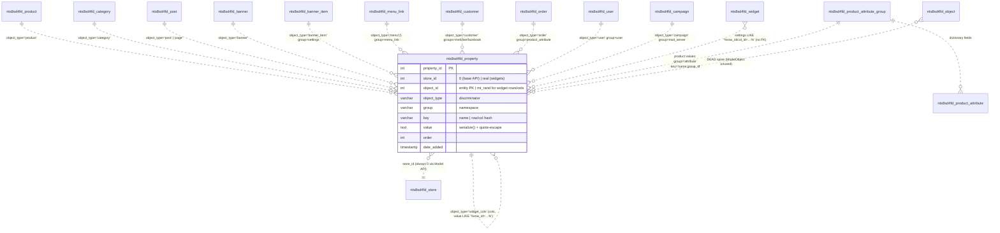
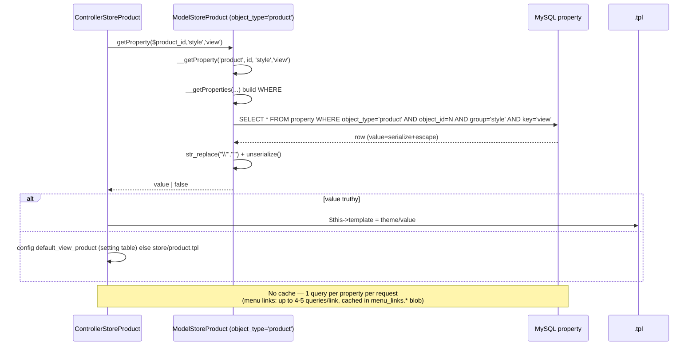
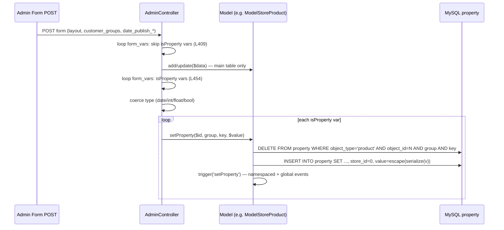

# 3-b-2 — The "Omni EAV" Property System (legacy `nts8sd4fd_property` ↔ necoyoad-next `properties`)

Agent: Explore-eav · Repo: `/home/z/necoyoad` · Research-only (no repo modifications)
Cross-referenced (not re-derived): `research/2-architecture.md` (Model base, 87-table schema), `3a1-events-hooks.md` (model lifecycle events), `3a2-widgets.md` (widget_rows/widget_cols EAV), `3a3-banners.md` (banner_item EAV), `3a4-menus.md` (menu_link EAV), `3b1-templates.md` (style/view template override). Everything below re-verified in source with file:line refs.

---

## 0. Executive summary

Legacy Necoyoad has **one polymorphic EAV store** — the `nts8sd4fd_property` table — that any subsystem can hang key/value metadata off, addressed by the tuple `(store_id, object_id, object_type, group, key)`. "Omni" is literal: the *same* table stores per-product template overrides (`style/view`), product attribute values (`attribute/<name>:<group_id>`), banner slide transitions (`settings/slidename`, `settings/transition_*`), menu-link icons/classes (`menu_link/icon`, `menu_link/class_css`, `menu_link/submenu_type`, `menu_link/page_id`, `menu_link/html_content`), customer OAuth tokens (`meli/*`, `live/*`, `facebook/*`), campaign mail-server binding (`mail_server/mail_server_id`), admin-user avatar (`user/image`), module-install menu registrations (`<section>_menu:<position>/<module_name>` with `object_id = 0` — *non-entity* EAV), and even the **widget layout tree itself** (`object_type = widget_rows` / `widget_cols`, where `object_id` is a random `mt_rand(1,99999999)` and the "entity" is identified by `group`=position + `key`=row/col hash). The Model base class (`system/engine/model.php`) exposes a generic `getProperty/setProperty/getAllProperties/deleteProperty` API plus cross-object `__getProperty('banner_item', …)` primitives, wired to model-lifecycle events and auto-cleanup on delete.

The Laravel rewrite keeps the same *idea* but narrows it: a `properties` table with a Laravel **morph** (`propertiable_type`/`propertiable_id`) instead of a stringly-typed `object_type`, a centralized `EavService` (per-store resolution, JSON values, request-level in-memory cache) behind a `HasProperties` trait on Product/Post/Category/Banner/BannerItem/MenuLink. However, the only *writer* in the rewrite is the Banner Composer Livewire screen (`banner` + `slide` groups); `style/view` and `menu_link` properties are **read** by the storefront but there is **no Filament UI that writes them** (PostResource writes a dead `template` *column* instead). `EavPropertyNotFoundException` exists but is never thrown. Notable legacy defects (per-store values impossible via base API, `__setAllProperties` arg-order bug, `ModelObject` inserting property rows *without* `object_type`, phantom `customer_property` table, broken serialized-value equality lookups) are catalogued in §A.11/E.

---

## A) Legacy EAV core

### A.1 The `nts8sd4fd_property` table

`necoyoad_db.sql` L1119–1129 (CREATE) + L1954–1956 (indexes) + L2444–2445 (AUTO_INCREMENT):

```sql
CREATE TABLE `nts8sd4fd_property` (
  `property_id` int(11) NOT NULL,                                  -- surrogate PK (AUTO_INCREMENT)
  `store_id`    int(11) DEFAULT NULL,                               -- owning store (0 = global in practice)
  `object_id`   int(11) NOT NULL,                                   -- PK of the attached entity (or a random int for widget rows/cols!)
  `object_type` varchar(100) CHARACTER SET utf8 NOT NULL,           -- discriminator: 'product','page','menu','banner_item','widget_rows',...
  `group`       varchar(100) CHARACTER SET utf8 NOT NULL COMMENT 'group of key pairs',
  `key`         varchar(100) CHARACTER SET utf8 NOT NULL COMMENT 'name of the key',
  `value`       text CHARACTER SET utf8 NOT NULL COMMENT 'value of the key',   -- ALWAYS serialize()'d, quote-pre-escaped
  `order`       int(11) NOT NULL,                                   -- sort order (used by widget rows/cols)
  `date_added`  timestamp NOT NULL DEFAULT CURRENT_TIMESTAMP
) ENGINE=MyISAM DEFAULT CHARSET=latin1;
-- L1954-1956:
ALTER TABLE `nts8sd4fd_property`
  ADD PRIMARY KEY (`property_id`),
  ADD UNIQUE KEY `property` (`object_id`,`object_type`,`group`,`key`);
```

Column semantics:

| Column | Meaning | Notes |
|---|---|---|
| `property_id` | surrogate PK | never referenced by application code |
| `store_id` | store scope | table default `NULL`; base Model API **always writes 0** (see A.3 bug #3); only `NecoWidget::saveRow/saveCol` write a real store id; **not part of the UNIQUE key**, so per-store variants of the same group/key are structurally impossible through the base API |
| `object_id` | id of the attached row | for `widget_rows`/`widget_cols` this is **`mt_rand(1,99999999)`** (`system/helper/widgets.php:730,756`) — a dummy, identity comes from `group`(position)+`key`(row/col id) |
| `object_type` | entity discriminator | free string; effectively the legacy "morph map" (see §D catalog) |
| `group` | key namespace | e.g. `style`, `data`, `settings`, `menu_link`, `attribute`, `customer_groups`, `mail_server`, `user`, `meli`, `live`, `facebook`, `<section>:<position>`; `group` and `key` are MySQL reserved words — always backticked |
| `key` | key name inside group | sometimes compound: `"<attr_name>:<attribute_group_id>"` for product attributes; sometimes a row/col hash `widgetRow_69d653ecf0b7` |
| `value` | **PHP-serialized** value | write: `serialize($v)` → `str_replace("'", "\'", …)` → `db->escape()`; read: `str_replace("\'", "'", …)` → `unserialize()` (see A.3 for the escape dance) |
| `order` | ordering | only meaningful for widget rows/cols (`ORDER BY \`order\` ASC`) |
| `date_added` | insert timestamp | DB default |

Index reality: the UNIQUE key leads with `object_id`, so queries that filter **without** `object_id` — every `NecoWidget::getRows/getCols` scan (`object_type='widget_rows' AND group=… AND store_id=… AND value LIKE …`), the search-engine property filters, `getCustomerByMeli` — are **full table scans** over `text` values with `LIKE '%…%'`. MyISAM, latin1 table default with utf8 columns (mixed collations addressed via `COLLATE utf8_general_ci` / `CONVERT(… USING utf8)` in query builders).

**Sibling "shared spine" tables** (same `object_id`+`object_type` addressing scheme, kept in sync by `Model::delete`, `model.php:548-563`): `description` (L452, UNIQUE(object_id,object_type,language_id)), `object_to_store` (L674, UNIQUE(object_id,object_type,store_id)), `object_to_category` (L659, UNIQUE(object_id,object_type,category_id)), `url_alias` (L1410), `stat`, `review`. The EAV `property` table is one member of this family.

**Not EAV, don't confuse:**
- `nts8sd4fd_setting` (L1197–1203): `(store_id, group, key, value)` — the config store. `ModelSettingSetting` (`app/shop/model/setting/setting.php:14-97`) exposes `getProperty($group,$key,$store_id)`/`deleteProperty()` — an API name collision with EAV but a **different table**; values are raw (not serialized) except mail-server rows (`cron/api/send.php:252-255` unserializes them). All `config_*` settings, `default_view_*` template defaults (see 3b1) and mail servers live here.
- `nts8sd4fd_product_attribute` (L912–925) / `product_attribute_group` (L933–939): the **catalog attribute dictionary** — *field definitions* (`group`,`label`,`name`,`type`,`pattern`,`default`,`required`), i.e. the form schema that drives which attribute values get stored in `property`. See A.9.

### A.2 The Model base EAV API (`system/engine/model.php`, 1803 lines)

Class metadata (`model.php:6-14`): `protected string $table/$pkey/$object_type/$description_object_type`, `protected array $fields`, `protected array $relations`. Instance namespace for events: `"model:{$table}:{$object_type}:"` (L23) — every `trigger()` emits twice: namespaced + global (L159-163).

#### Read path

**`__getProperties(string $object_type, int $id, string $group=null, string $key=null)` — L1378-1406**
- Guards: null/empty `$object_type` or non-numeric `$id` → `null` (note: `$id=0` allowed — "non-entity properties", cf. extension partials).
- SQL shape:
  ```sql
  SELECT * FROM `nts8sd4fd_property`
  WHERE `object_type` = '<escaped>' AND `object_id` = <int>
    [AND `group` = '<escaped>'   -- only if $group !== null && $group !== '' && $group !== '*'
     AND `key`   = '<escaped>']  -- only if $key  !== null && $key  !== '' && $key  !== '*'
  ```
  → `'*'` is the **wildcard sentinel** (both in the public wrappers' defaults and in the criteria builder). No `ORDER BY`, no `store_id` filter, **no caching** — one DB round-trip per call.
- Post-processing (L1400-1403): each row's `value` is unserialized after un-escaping: `$rows[$k]['value'] = unserialize(str_replace("\'", "'", $row['value']));`. Returns the **full rows** (including `property_id`, `store_id`, `group`, `key`, `order`, `date_added`) with `value` decoded.

**`__getProperty(string $object_type, int $id, string $group=null, string $key=null, bool $verbose=false)` — L1361-1364**
- Thin wrapper: `$rows = $this->__getProperties(...); return count($rows) > 0 ? ($verbose ? $rows[0] : $rows[0]['value']) : false;`
- Contract: **`false` when missing** (vs `null` in next). `$verbose=true` returns the full first row.

#### Write path

**`__setProperty(string $object_type, int $id, string $group, string $key, $value)` — L1421-1451**
- Guards (L1422-1430): rejects `is_numeric($object_type)` (prevents object_type `0`), empty object_type/group/key, non-numeric id — but *allows* `$id = 0` (explicit comment: *"allow to save non-entity properties"*).
- Algorithm: **delete-then-insert** (poor man's upsert):
  ```php
  $this->__deleteProperties($object_type, $id, $group, $key, $store_id = 0);   // L1432 — 5th arg IGNORED by the 4-param callee
  $this->db->query("INSERT INTO `…property` SET
      `object_id` = <int>, `store_id` = <int $store_id>, `object_type` = …,
      `group` = …, `key` = …,
      `value` = '" . $this->db->escape(str_replace("'", "\'", serialize($value))) . "'");  // L1433-1439
  ```
- **Bug (store_id):** `$store_id` is a *local* inline-assigned `0` (L1432); the callee takes only 4 params, so a per-store delete never happens and the INSERT always writes `store_id = 0`. Consequences: (a) per-store property overrides are impossible via this API; (b) any row previously written with a non-zero `store_id` (e.g. by NecoWidget) is *duplicated*, not replaced, when the same (object,group,key) is set through the base API.
- **Value escaping dance:** `serialize($value)` → manual `str_replace("'", "\'")` → `db->escape()` (`ntMySQLPdo.php:91-96`: `\→\\`, `'→\'`, `\"`, `\0/\n/\r/\Z`). MySQL unescapes once on INSERT, leaving a literal `\'` in the stored blob; the read path `str_replace("\'", "'")` (`model.php:1402`) restores the original quote so `unserialize()` succeeds. Round-trip verified consistent for quotes and backslashes — but it means **raw SQL equality/LIKE against `value` only works if you replicate the serialize+escape form** (see the broken `getCustomerByMeli` lookup, A.11 #9).
- **Events:** `Model::trigger("setProperty", [...])` after INSERT (L1442-1450) — payload `{object_id, object_type (the *passed* one), pkey, table, group, key, value}`. Emitted on both the namespaced channel (`model:{table}:{object_type}::setProperty`) and the global one.
- Security note: `unserialize()` on read (L1402, also `widgets.php:348,414`, `cart.php:424`) has **no `allowed_classes`** — PHP object injection surface for any admin-writable property value.

**`__deleteProperties(string $object_type, int $id, string $group, string $key=null)` — L1465-1495**
- DELETE with the same wildcard semantics (`'*'`/empty/`null` ⇒ no criterion). No store filter.
- Events: `trigger("deleteProperties", …)` — but note the payload uses **`"object_type" => $this->object_type`** (the *model's own* type, L1489) instead of the passed `$object_type` — wrong discriminator for cross-type calls (e.g. `ModelContentBanner` deleting `banner_item` properties fires the event as `banner`).

**`__setAllProperties(string $object_type, int $id, string $group, array $data, int $store_id=0)` — L1510-1527**
- **Broken/dead:** calls `$this->__setProperty($id, $group, $key, $value, $store_id)` (L1514) — argument list `(id, group, key, value, store_id)` against the signature `(object_type, id, group, key, value)`. In PHP 8 this fatals on a non-numeric string `$group` in `int $id` (TypeError); on numeric groups it would write nonsense rows. No caller anywhere in `app/` or `system/` (verified by grep) — every model re-implements the loop correctly instead (e.g. `ModelContentBanner::setAllItemProperties`, `banner.php:316-323`; `ModelSettingExtension::setAllProperties`, `extension.php:135-142`; base `Model::setAllProperties`, L1793-1801, which uses the public wrappers correctly). It *does* fire `trigger("updateProperties", …)` (L1517-1525, again with `$this->object_type`) — the only emit site of that event.

#### Public per-model wrappers (the API controllers actually call)

| Method | Lines | Delegation |
|---|---|---|
| `getProperty(int $id, string $group, string $key)` | 1713-1716 | `__getProperty($this->object_type, $id, $group, $key)` |
| `setProperty(int $id, string $group, string $key, $value)` | 1732-1735 | `__setProperty($this->object_type, …)` |
| `deleteProperty($id, $group='*', $key='*')` | 1754-1757 | `__deleteProperties($this->object_type, …)` — wildcards default ⇒ delete-all-for-entity |
| `getAllProperties(int $id, string $group='*')` | 1774-1777 | `__getProperties($this->object_type, $id, $group)` |
| `setAllProperties(int $id, string $group, array $data)` | 1793-1801 | deleteProperty($id,$group) + setProperty per pair (correct impl) |

So the "omni" trick is two-fold: every model gets the API **for its own `$object_type`** for free, and any model can operate on **foreign** types by calling the `__`-primitives with an explicit type string (banner model writes `banner_item` properties; menu model writes per-link properties under type `menu`).

#### Generic query-builder integration

`Model::buildSQLQuery` (`model.php:825-1059`):
- `$data['properties']` filter (L1001-1024): adds `LEFT JOIN property pp ON (t.{pkey} = pp.object_id)` and per-entry `LCASE(pp.key) LIKE '%…%'`, `CONVERT(LCASE(pp.value) USING utf8) LIKE '%…%'`, `pp.object_type = '{this->object_type}'` — a **fuzzy** EAV filter (accent-stripped, substring match against the *serialized* blob). Consumers: storefront search (`app/shop/model/store/search.php` ×6 blocks at L64-72, 199-210, 321-332, 451-462, 575-586 + controller `store/search.php:191-278` mapping URL criterion `properties`/`forAttributes`), manufacturer search (`store/manufacturer.php:108-120`), menu link admin search (`admin/model/content/menu.php:173`), banner item search (`admin/model/content/banner.php:264-271`), the generic product model (`shop/model/store/product.php:350-376` — also hard-codes groups `shipping_methods`/`payment_methods`/`product_status` filters for which **no write site exists** — latent/dead criteria).
- `$data['settings']` filter (L855-862) — analogous JOIN against the separate `setting` table, gated by `in_array("settings", $this->relations)` (no model declares it → dead branch).

#### Auto-cleanup on delete

`Model::delete` (L531-594): after deleting the main row, iterates `$shared_tables = ['object_to_category','object_to_store','property','description','stat','url_alias','review']` (L549-557) and deletes each with `WHERE object_id = <id> AND object_type = '{$this->object_type}'` (L559-563). This is the **only** referential integrity the EAV store has. (Banner goes further with manual cascades — `admin/model/content/banner.php:164-175` — because `banner_item` rows are children of `banner`, not the deleted entity.)

### A.3 The `$relations` metadata array — what it gates

`protected array $relations` (L14) is a whitelist of **automatic relation handling**, checked with `in_array(...)`:

| Relation | Gates | Code |
|---|---|---|
| `"descriptions"` | LEFT JOIN `description` in buildSQLQuery (L834-837), auto `setDescriptions` in add/update (L322-324, 415-417), copy hydration (L481-483), language filter (L875-884), title/queries search (L965-999) | |
| `"stores"` | LEFT JOIN `object_to_store` + `store_id IN (...)` (default `STORE_ID`) (L839-845), auto `setStores` (L326-328, 419-421), copy hydration (L485-487) | |
| `"categories"` | LEFT JOIN `object_to_category` + `category_id IN (...)` (L847-853), auto `setCategories` (L330-332, 423-425), copy hydration (L489-491) | |
| `"settings"` | LEFT JOIN `setting` on store (L855-862) — **declared by no model** (verified by grep) → dead | |
| `"properties"` | **does not exist** — EAV is NOT auto-persisted from `$data`; property writes are always explicit (`admincontroller.php:454-475` form_vars loop, model `init()` hooks, or dedicated setters) | |

38 models declare `$relations` (grep `relations\s*=\s*\[?[^\]]*"(properties|stores|categories|descriptions|settings)"`): e.g. `shop/model/store/product.php:125` `["categories","descriptions","stores"]`, `content/post.php:77` `["descriptions","stores","categories"]`, `admin/model/content/banner.php:59` `["stores"]`, `admin/model/store/attribute.php:40` `["categories"]`. `getRelations()` accessor (L101-104) is unused by app code.

### A.4 The `property('style','view')` "magic accessor" — what it actually is

There is **no `property()` magic method** on models or controllers (grep `\-\>property\(` over `app/` → 0 hits; `Model::__call` L57-70 only camelCases get/set for protected props and is unrelated; `Model::__get` L37-41 proxies to the Registry). The blueprint shorthand `property('style','view')` maps to three concrete mechanisms:

1. **Storefront reads** — one `getProperty($id, 'style', 'view')` call per entity render, feeding the 3-level template resolution (config default `default_view_*` → fallback, see 3b1):
   - product: `app/shop/controller/store/product.php:168` (default `default_view_product` / `store/product.tpl`, L169-175)
   - store category: `app/shop/controller/store/category.php:95`
   - manufacturer: `app/shop/controller/store/manufacturer.php:82`
   - blog post: `app/shop/controller/content/post.php:80`
   - CMS page: `app/shop/controller/content/page.php:100` and `:159`
   - blog category: `app/shop/controller/content/category.php:73` (object_type `post_category`)
2. **Admin writes** — the generic AdminController **form_vars EAV declaration**: any admin form field may carry
   ```php
   'layout' => ['name' => 'layout', 'type' => 'string',
                'isProperty' => true, 'group' => 'style', 'key' => 'view'],
   ```
   Save flow (`app/admin/controller/admincontroller.php`): the data-preparation loop **skips** `isProperty` vars for the main-table upsert (`if (array_key_exists('isProperty', $var) || $var['isProperty']) continue;` L408-409 — note the over-broad first condition), then a second loop re-coerces types (date `dd/mm/yyyy`→`yyyy-mm-dd`, int/float/bool, L454-473) and calls `$this->model->setProperty($id, $var['group'], $var['key'], $data[$var['name']])` (L474). Form hydration is the mirror loop at L1008-1017 (`$this->data[$var['name']] = $this->model->getProperty($model_info[$pkey], $var['group'], $var['key'])`, default from `$var['default']`). This is the *legacy equivalent of a Filament KeyValues/Repeater field*: declarative per-entity EAV fields on standard CRUD forms.
3. **Cross-model primitives** — `__getProperty/__setProperty('banner_item'|'menu'|…)` for child entities (banner slides, menu links) whose properties are managed by the parent model.

`isProperty` declarations found (all admin controllers):

| Controller | Fields (group/key) |
|---|---|
| `content/page.php:83-104` | `customer_groups/customer_groups` (array), `data/internal_name`, `style/view` (field name `layout`) |
| `content/post.php:83-104` | same three |
| `content/post_category.php:60-74` | `customer_groups/customer_groups`, `style/view` |
| `store/category.php:59-73` | `customer_groups/customer_groups`, `style/view` |
| `store/product.php:137-165` | `customer_groups/customer_groups`, `data/date_publish_start`, `data/date_publish_end`, `style/view` |
| `store/manufacturer.php:58-64` | `style/view` |
| `store/attribute.php:56-62` | `style/view` |
| `store/download.php:66-72` | `style/view` |
| `sale/customer.php:127-150` | whole block **commented out** |

### A.5 Complete legacy property GROUP/KEY catalog (every combination found in code)

Legend: W = write site, R = read site. All values serialized arrays/scalars.

| object_type | group | key(s) | Purpose | W / R |
|---|---|---|---|---|
| `product` | `style` | `view` | per-product template override | admin `store/product.php:159-165` / shop `store/product.php:168` |
| `product` | `customer_groups` | `customer_groups` | array of customer_group_ids allowed to view | admin form_vars / shop `store/product.php:40,423`; api `v1.0.0/products.php:103` |
| `product` | `attribute` | `<name>:<product_attribute_group_id>` | **per-product attribute values** (the dictionary-driven custom fields) | admin `model/store/product.php:326-336` (`setAttributes`) / shop `store/product.php:503` (`getAllProperties($id,'attribute')`), admin `store/product.php:361`, api `products.php:120` |
| `product` | `attributes` | `admin_attributes` | full `attributes` array mirror (form state) | admin model `product.php:338` / admin `store/category.php:192` |
| `product` | `attribute_group` | `attribute_group_id` | array of group ids used | admin model `product.php:339` / (form) |
| `product` | `data` | `date_publish_start`, `date_publish_end` | publish window | admin form_vars `product.php:145-158` / admin `store/product.php:446-447` |
| `product` | `shipping_methods` / `payment_methods` / `product_status` | method/status name | search filters — **no write site found** (latent) | — / shop `model/store/product.php:355-376`, `model/store/search.php:97-121` |
| `category` (store) | `style` | `view` | category template override | admin `store/category.php:67-73` / shop `store/category.php:95` |
| `category` | `customer_groups` | `customer_groups` | visibility | admin form_vars / — |
| `post_category` (blog) | `style` | `view` | blog-category template override | admin `content/post_category.php:68-74` / shop `content/category.php:73` |
| `post_category` | `customer_groups` | `customer_groups` | visibility | admin form_vars / — |
| `post` | `style` | `view` | post template override | admin `content/post.php:98-104` / shop `content/post.php:80` |
| `post` | `customer_groups` | `customer_groups` | visibility | admin form_vars / shop `content/post.php:51` |
| `post` | `data` | `internal_name` | admin-only label | admin `content/post.php:91-97` / admin `content/post.php:189` |
| `page` (posts w/ post_type=page) | `style` | `view` | page template override | admin `content/page.php:98-104` / shop `content/page.php:100,159` |
| `page` | `customer_groups` | `customer_groups` | visibility | admin form_vars / shop `content/page.php:79` |
| `page` | `data` | `internal_name` | admin-only label | admin `content/page.php:91-97` / admin `content/page.php:189` |
| `manufacturer` | `style` | `view` | manufacturer template override | admin `store/manufacturer.php:58-64` / shop `store/manufacturer.php:82` |
| `attribute` ⚠ (dictionary: table `product_attribute_group`) | `style` | `view` | attribute-group template override | admin `store/attribute.php:56-62` (writes under object_type `attribute`) / shop model `store/attribute.php:293-298` reads under object_type **`product_attribute_group`** — dual-type mismatch (A.11 #8) |
| `banner` | (any) | (any) | banner-level properties; API exists, no admin writer | — / admin model `content/banner.php:102` (`getById` → `banner_properties`), shop `model/content/banner.php:58-63` |
| `banner_item` | `settings` | `slidename`, `transition_delay_in/out`, `transition_duration_in/out`, `transition_effect_in/out`, `image` (posted by visual editor) | per-slide settings | admin model `content/banner.php:159` (`setAllItemProperties(…,'settings',…)`, L316-323), controller `saveItem` L269-275 (`setItemProperty($id,$group,$key,$v)` per POSTed `properties[group][key]`), api `v1.0.0/banner_items.php` POST → `setItem` / admin model `content/banner.php:119` (`getAllItemProperties` per item, feeds visual editor via api GET), search JOIN L264-271; delete cascade L167,173 (cross-verified with 3a3-banners.md) |
| `menu` ⚠ (object_id = **menu_link_id**) | `menu_link` | `icon`, `class_css`, `submenu_type`, `page_id`, `html_content` | per-link metadata | admin `model/content/menu.php:233-245` (`setProperty($menu_link_id,'menu_link',…)`) / admin `menu.php:101-105` (`getLinks`), shop `model/content/menu.php:64`, shop `controller/module/links.php:44-49`; orphan-producing delete mismatch (A.11 #7, 3a4 F-1) |
| `campaign` | `mail_server` | `mail_server_id` | selected SMTP server for campaign | shop `controller/marketing/campaign.php:61-64`, admin `controller/marketing/campaign.php:165,651,784` / `system/cron/api/send.php:244-258` (raw SQL read + unserialize) |
| `customer` | `meli` | `meli_oauth_id`, `meli_oauth_token`, `meli_oauth_refresh`, `meli_oauth_expire`, `meli_code` | MercadoLibre OAuth | shop `model/account/customer.php:121-125` / `controller/api/meli.php:218`, `model/account/customer.php:377-381` (broken equality lookup, A.11 #9) |
| `customer` | `live` | `live_oauth_id`, `live_oauth_token`, `live_code` | Microsoft Live OAuth | `customer.php:170-172` |
| `customer` | `facebook` | `facebook_oauth_id`, `facebook_oauth_token`, `facebook_code` | Facebook OAuth | `customer.php:217-219` |
| `order` | `product_attribute` | `<attribute key>` | order-time product attribute snapshot | shop `model/checkout/order.php:153-155` / `controller/checkout/success.php:117` (`getAllProperties($order_id,'product_attribute')` → order-confirmation email table) |
| `user` | `user` | `image` | admin avatar | admin `model/user/user.php:73` (save hook) / `controller/common/nav.php:12` |
| `extension` | `<section>:<position>` and `<section>_menu:<position>` (e.g. `admin_menu:store`, `login_form:account_box`) | module_name (e.g. `language_selector`) | module install-time menu/partial-template registration; `value` = `array(module, position, template)`; **`object_id = 0`** (non-entity EAV) | shop `model/setting/extension.php:87-97,103-113` (`addPartialTemplate/addMenu/removeMenu`), callers = module installers e.g. `admin/controller/module/language_selector/install.php:34-40` / `getPartials/getMenus` L83-105 |
| `widget_rows` | `<position>` (header, main, footer, …) | `widgetRow_<hash>` | layout row; `value` = serialized settings (internal_name, show_in_*, layout_width, sticky, conditional_logic_*, classnames, style, filter_* mirrors…) | `NecoWidget::saveRow` `system/helper/widgets.php:720-744` + admin `model/style/widget.php` (getRows L427, deleteRow L95-101, sortRow L757-767) / `getRows` L258-343 (LIKE engine — see 3a2) |
| `widget_cols` | `<position>` | `widgetColumn_<hash>` | layout column; value contains `row_id=<row key>` + grid classes etc. | `NecoWidget::saveCol` L746-771, admin `style/widget.php` (getCols L540, deleteColumn L113-132 [duplicated DELETE], sortCol L776-788) / `getCols` L538-657 |
| `review`, `manufacturer` (generic wrappers only) | — | — | models expose getProperty/getAllProperties but no concrete keys in code | `shop/model/store/review.php:463-467`, `store/manufacturer.php:163-167` |
| *(phantom)* `customer_property` table | `meli` | oauth keys | `system/library/customer.php:281-306` writes to `nts8sd4fd_customer_property` — **table does not exist in the schema** (grep in `necoyoad_db.sql` → 0 hits) | A.11 #10 |

Real production row samples survive in the repo's cache artifacts `system/temp/cache/widgets-rows-0.*.cache` / `widgets-cols-0.*.cache` (great doc material): e.g. `property_id=5022, store_id=0, object_id=80739793, object_type='widget_rows', group='header', key='widgetRow_69d653ecf0b7', order=0, value = a:29:{internal_name:"Account Panel Header", show_in_mobile:"on", …, conditional_logic_action:"hide", conditional_logic_when_route_contains:"account, room", filter_* mirrors…}` and cols `property_id=5007 … key='widgetColumn_0a124fb362fd'` with nested `widgets` array including each widget's serialized `settings` (`O:8:"stdClass":19:{…}` — note widgets themselves unserialize as **stdClass objects** here).

Also a **second EAV-ish store** worth naming in the doc: the `widget` table's own `settings` column (serialized widget instance config) and `widget_landing_page` pivot — see 3a2-widgets.md; and `nts8sd4fd_setting` (§A.1).

### A.6 The `object` spine table — effectively dead

`nts8sd4fd_object` (L639-651) was designed as the *universal entity spine*: `(object_id, object_type, parent_id, parent_type, status_id, subtype, status enum(-1,0,1,''), params text, sort_order, date_added, date_modified)` — a generic tree/status/params store for "product, post, survey, etc." with parent typing ("product category, post category, customer group") and subtype ("digital product, auction product…").

**Runtime reality:** the ONLY code touching it is `ModelObject` (`app/admin/model/object.php`, 213 lines): `sortOrder` (L88-103), `updateStatus`/`activate/deactivate/recycle` (L105-207) on the `object` table, plus its own property API (L117-173) with per-object_type cache. **No controller ever loads it** (grep `modelObject->`, `load->model('object')`, `new ModelObject` across the repo → 0 hits) — `ModelObject` is dead code, and with it the `object` table. The actual polymorphic spine of legacy Necoyoad is the `(object_id, object_type)` column pair replicated across `property` / `description` / `object_to_store` / `object_to_category` / `url_alias` / `stat` / `review` — *not* a central `object` registry. (Blueprint v5's "polymorphic spine" narrative describes aspiration, not runtime.)

`ModelObject` property API oddities (dead but instructive — it's the only *cached* legacy property reader): `getProperty($id,$group='*',$key='*')` caches under key `{object_type}.properties` + `serialize([id,group,key])` + `cacheConstant` (store/lang/currency/customer), bypassed for logged-in admins; **`getCache()` (L184-191) never returns** the `$this->cache->get(...)` result → read cache is permanently broken (always null ⇒ always re-query); `setProperty` (L144-154) INSERTs **without `object_type`** (and without `store_id`) while `deleteProperty` filters by `object_type` — orphan rows by construction.

Pivots actually used: `object_to_store` (`Model::getStores` L1075-1084 / `__setStores` L1086-1116, REPLACE INTO; JOIN in buildSQLQuery L839-845; banner storefront query `content/banner.php:28`), `object_to_category` (`getCategories` L1127-1137 / `__setCategories` L1150-1180; JOIN L847-853; attribute-dictionary binding `admin/model/store/attribute.php:86`, `shop/model/store/attribute.php:22`; suggested-products subquery `shop/model/store/product.php:382-384`). Both have proper UNIQUE keys (§A.1).

### A.7 `product_attribute` vs `property` — two EAV layers, different roles

Not duplicates — a **dictionary/values split**:

1. **Dictionary (schema):** `product_attribute_group` (name, status) + `product_attribute` (product_attribute_group_id, group [denormalized group name], label, name, type, pattern, default, required) — *form field definitions* created in Admin → Catalog → Attributes (`admin/model/store/attribute.php`: save hook L44-62 writes `product_attribute` rows with `group = $data['name']`, delete cascade L64-68; storefront reader `shop/model/store/attribute.php:26+` `getAllAttributes`). Groups are attached to categories via `object_to_category` (object_type `attribute`).
2. **Values (data):** per-product values in `property` — `admin/model/store/product.php:325-340 setAttributes()`: deletes groups `attribute`/`attributes`/`attribute_group`, then `setProperty($product_id,'attribute', $key.':'.$attribute_group_id, $value)` per field, plus the `attributes/admin_attributes` mirror and `attribute_group/attribute_group_id` index row. Storefront renders them via `getAllProperties($product_id,'attribute')` (`shop/controller/store/product.php:503`), the layered-nav search matches them via the `properties` LIKE filter (§A.5), and checkout snapshots chosen values onto the order as `order/product_attribute/<key>` (`checkout/order.php:153-155`).

So: "product attributes" = dictionary tables define *what* fields exist; the omni-EAV `property` table stores *the values* for each product (and for each order). This is why the `attribute` object_type on the property table (dictionary entity's own style/view) and the `attribute` *group* on product rows coexist.

### A.8 Performance & caching profile (legacy)

- **No caching at all** in the base EAV API: `__getProperties/__getProperty/__setProperty/__deleteProperties` hit MySQL directly, every call. Cache exists only in: `NecoWidget` rows/cols/widgets (file cache prefixes `widgets.rows.*`, `widgets.cols.*`, TTL/invalidation quirks per 3a2 F-3), `ModelObject` (broken, dead), and the *containing* operations (e.g. menu link properties are computed inside the cached `menu_links.*` blob, `shop/model/content/menu.php:26-72`; banner item properties inside cached `admin.banner_items`).
- **Query fan-out examples:**
  - Product page: `style/view` (1) + `customer_groups` (1) + `attribute` group (1) ≈ 3 EAV queries — cheap, all keyed by the UNIQUE index.
  - Header menu widget with N links (cold cache): 1 (menu_link select) + N×(1 url_alias + 1 `menu_link/class_css` + 1 descriptions×langs) and the links controller adds up to 3 more per link (`icon`, `submenu_type`, `page_id` — `controller/module/links.php:44-49`) ⇒ ~5N queries; mitigated only by the `menu_links` file cache.
  - Widget layout: per position — 1 `getRows` scan (full-table LIKE), per row 1 `getCols` scan, per column 1 `getWidgets` scan ⇒ O(rows×cols) unindexable LIKE scans per page (cold), all against `property`+`widget` (3a2 F-1).
  - Search with attribute criteria: adds the `property` JOIN with double `LIKE '%…%'` on serialized `value`.
- **Index blind spots:** UNIQUE(object_id, object_type, group, key) serves point lookups; everything filtering by `object_type` alone (`widget_rows`/`widget_cols`, `getCustomerByMeli`, banner item cascade deletes by subselect) or by `group` alone is a scan. `store_id` has no index at all.
- The serialized `value` means **no server-side typing/filtering** — comparisons are LIKEs against `s:N:"…"` blobs; equality lookups require replicating the exact serialized+escaped form (never done — see A.11 #9).

### A.9 Legacy defects & quirks (EAV-specific)

1. **`__setAllProperties` argument-order bug** (`model.php:1514`) — passes `($id,$group,$key,$value,$store_id)` into `__setProperty(string $object_type, int $id, …)`; PHP 8 TypeError for non-numeric groups. Dead code (no callers), but a landmine.
2. **`store_id` always 0 via base API** (`model.php:1432-1435`): the inline `$store_id = 0` in the delete call is ignored (4-param callee) and then reused by the INSERT — per-store properties structurally impossible; non-zero-store rows (widget rows/cols) get duplicated rather than updated by base-API writes. `property.store_id` is NULLable but effectively binary (0 or widget store).
3. **`unserialize()` without `allowed_classes`** everywhere values are decoded (`model.php:1402`, `widgets.php:348,414`, `cart.php:424`, `cron/api/send.php:250`, `object.php:136`) — PHP object injection surface on admin-writable properties.
4. **Event payload discriminators drift:** `__deleteProperties` and `__setAllProperties` fire with `$this->object_type` instead of the passed `$object_type` (`model.php:1489,1519`) — cross-type operations (banner_item, menu-link-as-menu) misreport.
5. **`__getProperties` returns `null` on bad input but `[]`-shaped rows otherwise; `__getProperty` returns `false` on miss** — three falsy shapes (`null`/`false`/`[]`) that callers treat interchangeably.
6. **`order`/`date_added` not maintained** by the base API (INSERT omits `order` → 0); only widget row/col writers set `order`.
7. **Menu-link property orphaning:** properties written as object_type `menu` + group `menu_link` keyed by `menu_link_id` (`admin/model/content/menu.php:233-245,255`), but link deletion removes rows as object_type `menu_link` (3a4 F-1) — permanent orphans; `Model::delete('menu')` cascade also can't catch them (child ids under wrong type).
8. **Attribute dictionary dual object_type:** admin model object_type `attribute` (`admin/model/store/attribute.php:15`) vs shop property wrappers `product_attribute_group` (`shop/model/store/attribute.php:294`) — style/view written under one type, readable only under the other.
9. **Serialized-value equality lookup broken:** `getCustomerByMeli` (`shop/model/account/customer.php:376-381`) does `WHERE … value = '<raw id>'` but stored values are `serialize()`-wrapped (`s:N:"…"`) → never matches (Meli SSO duplicate-check dead).
10. **Phantom `customer_property` table:** `system/library/customer.php:281-306` INSERTs meli OAuth rows into `nts8sd4fd_customer_property` — absent from the schema (would error at runtime / silently fail).
11. **`ModelSettingSetting` API-name collision** — `getProperty/deleteProperty` on the `setting` table (not EAV); mail servers stored there are `serialize()`d inside a table that otherwise stores raw strings (mixed conventions).
12. **Wildcard `'*'` sentinel** leaks into criteria building — a legit group literally named `*` would be un-deletable; also `deleteProperty()` with defaults silently wipes *all* entity properties.
13. **MyISAM, no FKs** — integrity is entirely `Model::delete`'s shared-table cascade (which misses child-type mismatches like banner_item-under-banner handled manually, and menu_link-under-menu not handled at all).

---

## B) necoyoad-next EAV

### B.1 Migration — `properties` table

`database/migrations/0001_01_01_000000_create_core_tables.php:125-137`:

```php
Schema::create('properties', function (Blueprint $table) {
    $table->id();
    $table->morphs('propertiable');            // propertiable_type (morph alias string) + propertiable_id, indexed
    $table->foreignId('store_id')->nullable()->constrained()->nullOnDelete();
    $table->string('group', 100);
    $table->string('key', 100);
    $table->text('value');                     // JSON-or-scalar string (EavService encodes)
    $table->integer('sort_order')->default(0); // legacy `order` renamed
    $table->timestamps();
    $table->index(['propertiable_type', 'propertiable_id', 'group', 'key']);   // plain index
});
```

vs legacy: `object_id/object_type` → morph pair; `order` → `sort_order`; `date_added` → `timestamps`; **UNIQUE(object_id,object_type,group,key) became a non-unique index** (see B.7 defect — concurrent `updateOrCreate` can duplicate); `group`/`key` are *not* reserved words in this stack (no backtick dance needed). Drop at L816.

### B.2 `app/Models/Property.php` (34 lines)

- `protected $fillable = ['propertiable_type','propertiable_id','store_id','group','key','value','sort_order']`.
- `propertiable(): MorphTo` (L20-23) — relation used by `HasProperties::properties()` and eager loads.
- `getDecodedValue(): mixed` (L25-33): `json_decode($value, true)`; returns the decoded array if `JSON_ERROR_NONE`, else the raw string. **No `is_numeric` guard** — numeric strings (`"5000"`) decode to ints here, unlike `EavService::decodeValue` (B.7 #3).
- No casts (`value` stays string), no global scopes, no store scope on the model — all scoping lives in `EavService`.

### B.3 `app/Services/EavService.php` (216 lines) — the full contract

Registered as a **singleton** (`app/Providers/AppServiceProvider.php:35`), docblock quotes the user mandate: *"Always use EAV service to add or alter data scheme, instead of change DB scheme."*

**State:** `private array $cache = []` — request-lifetime, keyed `"{morphClass}:{id}:{group}:{key}:{storeId}"` (L29-30, L197-200). Backed by the `properties` polymorphic table (morph: `propertiable`).

**Store resolution:** `currentStoreId()` (L212-215) = `app('store.context')?->id() ?? 0` — `StoreContext::id()` (`app/Services/StoreContext.php:89-92`) resolves the store from the request (4 strategies per 2-architecture) and defaults to 0, mirroring legacy's global `store_id=0`. Every method takes `?int $storeId = null` and normalizes via `??=`.

**Read:**
- `get(Model $model, string $group, string $key, ?int $storeId=null): mixed` (L43-63): in-memory cache hit → return; else single query
  `Property::where('propertiable_type', $model->getMorphClass())->where('propertiable_id', $model->getKey())->where('group',$group)->where('key',$key)->where('store_id',$storeId)->first()`
  → `$property?->getDecodedValue()` → cache & return. **Miss returns `null`** (legacy returned `false`).
- `getGroup(Model $model, string $group, ?int $storeId=null): array` (L68-79): `pluck('value','key')` + `decodeValue()` per entry → `['key' => value, …]`. Not cached in-memory (per-key entries only enter the cache if later fetched via `get`).
- No cross-store fallback: a property missing for store N is simply `null` — there is **no "default store 0 then store N" cascade**; the legacy behaviour (single store-0 row) is only preserved because every writer that doesn't care writes store 0 and readers pass store 0 unless a store context resolves. (If `StoreContext` resolves store 2 but the property was saved with store 0 by a different context, the read misses — real foot-gun, see B.7 #5.)

**Write:**
- `set(Model $model, string $group, string $key, mixed $value, ?int $storeId=null): void` (L84-108): `Property::updateOrCreate([type,id,group,key,store_id], ['value' => encodeValue($value)])` — delete-then-insert replaced by a real upsert; then primes the in-memory cache with the *pre-encoded* value and calls `Cache::forget("eav:{morphClass}:{id}:{group}:{storeId}")` (L107, key built at L207-210). **The Laravel-cache forget is dead defensive code:** nothing ever writes/reads that key (no `Cache::remember` in the service), and the key omits the property `key` segment — even if someone cached per-group, per-key invalidation would over/under-fire.
- `setMany(Model $model, array $properties, ?int $storeId=null): void` (L113-122): expects the **nested shape `[group => [key => value]]`** and loops `set()` per key (N queries; used by BannerComposer::save).
- `delete(Model …, group, key, storeId)` (L127-140) and `deleteGroup(…)` (L145-162): delete + in-memory purge (`deleteGroup` purges by key-prefix `"{morphClass}:{id}:{group}:"`, L156-161).

**Codec:**
- `encodeValue` (L167-176): arrays/objects → `json_encode($value)` (no flags — unicode/slashes escaped); booleans → `'1'`/`'0'`; everything else → `(string)$value`. `null` → `''`.
- `decodeValue(?string)` (L181-192): `json_decode($value, true)`; returns the decoded value **only if valid JSON AND `!is_numeric($value)`** — numeric strings stay strings; `null` in → `null` out.
- TYPE_CASTS registry (L33-38: integer/boolean/json/date) is **declared but never used** — no type-aware casting is actually applied on read (docblock promise vs implementation gap).

**Cache invalidation summary:** in-memory only, per-instance (singleton ⇒ request-scoped); no cross-request cache; no model-event hooks (`saved`/`deleted` on Property); writes through other paths (tinker, SQL, a second EavService instance in a queue worker) are invisible until the request ends.

### B.4 `app/Traits/HasProperties.php` (81 lines) — thin facade

- `properties(): MorphMany` (L30-33) → `morphMany(Property::class, 'propertiable')`.
- `getProperty(string $group, string $key, ?int $storeId=null): mixed` (L39-42) → `EavService::get`.
- `getAllProperties(?string $group=null, ?int $storeId=null): Collection` (L47-56): with `$group` → `getGroup()` re-keyed as `"{$group}.{$key}"`; without → raw `properties()` relation query keyed `"{group}.{key}"` (**bypasses store scoping entirely** in the no-arg branch — returns rows of every store).
- `setProperty` (L61-64), `setManyProperties` (L69-72), `deleteProperty` (L77-80) → EavService.
- Usage examples in the docblock mirror the legacy style guide (`$product->getProperty('style','view')`, `$banner->getProperty('settings','autoplay')`) — the semantic parity anchor to legacy.

**Models using HasProperties** (grep): `Product`, `Post` (posts **and** pages), `Category`, `Banner`, `BannerItem`, `MenuLink`. NOT using it despite morph-map presence: `Manufacturer` (alias registered but no trait — migrated manufacturer properties would be unreadable), `Menu`, `Store`, widget models (rows/columns/widgets use JSON `settings` columns — see 3a2).

### B.5 Morph map (the next "object_type" registry)

`app/Providers/AppServiceProvider.php:63-72`:

```php
Relation::enforceMorphMap([
    'product' => Product::class,  'post' => Post::class,
    'page' => Post::class,        // Post model handles both post + page types
    'category' => Category::class, 'manufacturer' => Manufacturer::class,
    'banner' => Banner::class,    'banner_item' => BannerItem::class,
    'menu_link' => MenuLink::class,
]);
```

- Aliases deliberately match legacy `object_type` strings (migration-friendly) — **except** the menu case: legacy stores link properties under object_type **`menu`** (with menu_link_id); next stores them under **`menu_link`** (morph alias of the MenuLink model). A naive row migration `object_type → propertiable_type` would strand menu-link properties.
- **Dual alias quirk:** `'page'` and `'post'` both map to `Post::class`. `Model::getMorphClass()` uses `array_search` and returns the **first** match — every Post instance (blog posts *and* pages) morphs as **`post`**. Rows written with `propertiable_type='page'` (hand-migrated legacy data) are unreachable through `EavService`/`HasProperties` (they query `propertiable_type = 'post'`); the `'page'` alias is effectively write-dead. Meanwhile `StorefrontController::page()` (L130) sets `session(['object_type' => 'page', …])` for the *widget* layer — string conventions drift between subsystems.

### B.6 `EavPropertyNotFoundException` — never thrown

`app/Exceptions/EavPropertyNotFoundException.php` (13 lines): `class EavPropertyNotFoundException extends StorefrontException` with message `"EAV property '{group}.{key}' not found"` and status 404 (`StorefrontException` base, `app/Exceptions/StorefrontException.php`, defaults 400). Grep across the whole `necoyoad-next` tree: **zero `throw` sites** — dead scaffolding (same pattern as `WidgetRenderException` in 3a2). The service contract is null-on-miss, so a "not found" exception type is architecturally unused.

### B.7 Consumers of EAV in next

1. **Template override (style/view parity):** `StorefrontController` passes `entityTemplate: $product->getProperty('style','view')` (product L60, category L85, post L111, page L137) into `TemplateResolver::resolve(?string $entityTemplate, string $type, string $fallback)` (`app/Services/TemplateResolver.php:25-53`): (1) per-entity EAV override → (2) `config('necoyoad.defaults.{type}')` (`config/necoyoad.php:15-25`, e.g. `'product' => 'store.product'`) → (3) hardcoded fallback; then theme existence check `themes.{theme}.{tpl}` → `themes.choroni.{tpl}` → raw fallback. Resolution levels and the config-default keys verified in 3b1 (which also documents the legacy `default_view_*` equivalents living in the `setting` table).
2. **Banner engine EAV (the one fully-implemented vertical):**
   - `BannerRendererService` (`app/Services/BannerRendererService.php`): `getEngine()` = `eav->get($banner,'banner','engine') ?? 'swiper'` (L52-55); `getConfig()` merges a 9-key default array with `eav->getGroup($banner,'banner')` (L60-75: engine, autoplay, autoplay_speed, transition_speed, loop, show_navigation, show_pagination, parallax_depth, ken_burns_intensity); `getSlides()` maps items through `eav->getGroup($item,'slide')` (L82-112: layers [JSON string → array], link_url, link_target, background_type, background_video_url, background_gradient, transition_in, transition_out, ken_burns).
   - Writer: `BannerComposer` Livewire (`app/Livewire/Admin/BannerComposer.php`, route `routes/web.php:93-95` `/admin/banner-composer/{bannerId}`): `mount()` hydrates the form from `getGroup($banner,'banner')` + per-item `getGroup($item,'slide')` (L46-88); `save()` does `setMany($banner,['banner'=>[…9 keys…]])` and per-slide `setMany($item,['slide'=>['layers','transition_in','transition_out','ken_burns']])` (L214-264) + audit log `banner_composer_saved` + `banner-saved` browser dispatch.
   - Widget seam: `app/View/Components/Widgets/Banner.php` reads per-item `getProperty('settings','offsetX'/'offsetY')` (L72-73 — legacy-offset parity group name `settings`!) and `resolveTemplate()` consults `eav->get($banner,'banner','engine')` (L97) for the engine-view branch on top of the legacy `jquery_plugin` branches.
3. **Menu links:** `app/View/Components/Widgets/Links.php:61-62` — `$link->getProperty('menu_link','class_css')` and `'icon'` (EavService + morph alias `menu_link`); rendered by `drawLinksGroup` (L70-87). No writer in Filament (`MenuResource` has no icon/class_css/submenu fields — 3a4).
4. **Banner widget tree + WidgetService** consume `object_type`/`object_id` *strings* for per-entity widget overrides (session protocol in StorefrontController L53-54 etc.) but widget settings themselves are JSON columns, **not** EAV — the `widget_rows`/`widget_cols` object types of legacy have no property-table counterpart (3a2 mapping table).
5. **Nothing else.** Greps: no Console/Jobs/Api/Filament EAV consumers; `DatabaseSeeder` seeds **zero** property rows (so a fresh install renders every storefront page with config-default templates, default swiper engine, no link icons); `tests/` contains **no EavService/HasProperties/Property tests**.

### B.8 Filament admin — how properties are (not) edited

- **No generic property UI.** Grep over `app/Filament/**` for `setProperty|EavService|getProperty|properties|Repeater('prop` → 0 hits. There is no KeyValues/JSON-editor/repeater field bound to the `properties` table on any resource; the isProperty form_vars mechanism of legacy has **no successor**.
- `BannerResource` edits `jquery_plugin` (5 hardcoded options, `config/necoyoad.php:43-49`) + a Slides repeater for **columnar** banner_item fields only; the EAV engine/slide config is edited solely by the separate BannerComposer Livewire screen (§B.7) reachable via an action (3a3).
- `PostResource` exposes `TextInput::make('template')` (`app/Filament/Resources/PostResource.php:42-43`) bound to the **`posts.template` column** (`migration L263: $table->string('template',100)->nullable()`) — but `StorefrontController::post/page` resolve templates from **`getProperty('style','view')`**, never from the column. The admin therefore edits a field the storefront ignores (write/read divergence; the EAV property has no UI writer at all).
- `ProductResource`/`CategoryResource`/`ManufacturerResource`/`MenuResource`: no template/property fields at all (verified by schema grep of their forms).

### B.9 next-side defects & quirks (EAV-specific)

1. **No unique constraint** on `(propertiable_type, propertiable_id, group, key, store_id)` — `updateOrCreate` is select-then-write; two concurrent requests can insert duplicates; subsequent `get()` returns an arbitrary first row. (Legacy had the UNIQUE, albeit store-blind.)
2. **`Cache::forget` dead code** (EavService L107) — key never written, and lacks the `key` segment; no cross-request caching actually exists, so nothing to invalidate.
3. **Decode inconsistency:** `Property::getDecodedValue()` (used by `get()`) numeric strings → int/float; `EavService::decodeValue()` (used by `getGroup()`) keeps them strings. `"5000"` round-trips as int via `get`, string via `getGroup`.
4. **TYPE_CASTS unused** — docblock promises type-aware reads (integer/boolean/json/date); nothing applies them.
5. **Store-scoping trap:** reads use `StoreContext` id (may be a real store id) while the only writer (BannerComposer, admin panel) writes with the *admin* request's store context — a storefront request on another store sees `null` (no default-store fallback chain).
6. **`getAllProperties(null)` bypasses store scoping** (raw relation query) — inconsistent with the scoped getters.
7. **'page' morph alias unreachable** (§B.5); menu legacy rows stranded under wrong type on migration (§B.5).
8. **`EavPropertyNotFoundException` never thrown** (§B.6); `Post.template` column dead for resolution (§B.8).
9. **Booleans encode as `'1'/'0'` but `getGroup` returns them as strings** (`decodeValue` guards only numerics) — `'1'` stays `'1'`, so `=== true` checks fail on group reads.
10. **No eager-load path:** `getProperty` per link/slide issues one query each (Links widget N+1 — 3a4 already flags no caching; BannerRenderer `getSlides` does `getGroup` per item — N+1 with no remember).

---

## C) Diagram material (Mermaid sources)

### C.1 ER — legacy EAV cluster



### C.2 Legacy EAV read path — product page template override



### C.3 Legacy EAV write path — admin form_vars (isProperty)



### C.4 next EAV — write (BannerComposer) & read (storefront) paths

```mermaid
sequenceDiagram
    participant LW as BannerComposer (Livewire admin)
    participant ES as EavService (singleton)
    participant P as Property (morph)
    participant SR as StorefrontController / Links widget
    LW->>ES: setMany($banner, ['banner'=>{engine,autoplay,…}])
    loop each group.key
        ES->>ES: encodeValue (json/bool/'0'/'1'/string)
        ES->>P: updateOrCreate([type,id,group,key,store_id], [value])
        ES->>ES: memory cache[key]=value ; Cache::forget (dead)
    end
    SR->>ES: get($product,'style','view') / getGroup($item,'slide')
    ES->>ES: store_id = StoreContext.id() ?? 0
    ES->>P: WHERE propertiable_type='post' AND propertiable_id=N AND group AND key AND store_id=S LIMIT 1
    P-->>ES: row|null
    ES->>ES: getDecodedValue (json_decode)
    ES-->>SR: value|null
    SR->>SR: TemplateResolver: EAV → config default → fallback
```

### C.5 Property key catalog table — see §A.5 (renders directly as a doc table) and §D for the omni object_type inventory.

---

## D) "Omni" aspects — full object_type inventory

### D.1 Legacy object_type strings found writing/reading `property` rows

`product`, `category` (store), `post_category` (blog), `post`, `page`, `manufacturer`, `attribute` (dictionary entity, admin side), `product_attribute_group` (dictionary entity, shop wrappers), `banner`, `banner_item`, `menu` (⚠ rows keyed by menu_link_id), `campaign`, `customer`, `order`, `user`, `extension` (object_id=0 — non-entity EAV), `widget_rows` (object_id=mt_rand), `widget_cols` (object_id=mt_rand). Generic no-key wrappers also exist for `review` and `manufacturer`. Model `$object_type` values that *could* address property rows via the base API (all 40+ admin models, §A.6 listing) but have no concrete property usage: `language`, `currency`, `zone`, `country`, `geo_zone`, `tax_class`, `weight_class`, `length_class`, `stock_status`, `order_status`, `order_payment_status`, `theme`, `template`, `widget`, `download`, `store`, `contact`, `contact_list`, `newsletter`, `setting`, `user_group`, `bank`, `bank_account`, `balance`, `address`, `order_payment`, `coupon`, `customer_group`.

The two **virtual** types (`widget_rows`/`widget_cols`) and the **zero-id** type (`extension`) prove the design intent: the property table is not an entity-attachment table but a *general-purpose string-addressed KV store* — any subsystem can invent its own addressing scheme (`group`=position, `key`=hash) and piggyback on it.

### D.2 next morph aliases (= legacy object_type parity list)

`product`, `post` (+ write-dead `page`), `category`, `manufacturer` (alias without HasProperties), `banner`, `banner_item`, `menu_link` (legacy used `menu`). No aliases for `campaign`/`customer`/`order`/`user`/`extension`/`widget_rows`/`widget_cols`/`review` — those subsystems either use columns, JSON, or don't exist yet in the rewrite.

---

## E) Legacy ↔ next mapping table

| Aspect | Legacy | necoyoad-next | Parity notes |
|---|---|---|---|
| Storage | `nts8sd4fd_property` (MyISAM, object_id+object_type strings, UNIQUE(object_id,object_type,group,key), serialized values) | `properties` (InnoDB, morphs + store FK, plain index, JSON-or-scalar strings) | structure ported; uniqueness **lost** |
| Addressing | `object_type` free string + `object_id` int | morph alias via `Relation::enforceMorphMap` + `propertiable_id` | aliases match legacy names except `menu`→`menu_link`; `page` alias dead |
| API | `Model::getProperty/setProperty/getAllProperties/deleteProperty` + `__`-primitives for cross-type | `HasProperties` trait → `EavService::get/getGroup/set/setMany/delete/deleteGroup` | trait keeps legacy method names for get/set; `getAllProperties(group)` shape differs (Collection keyed `group.key`) |
| Value format | `serialize()` + manual `\'` pre-escape + `db->escape` | `json_encode` / `'1'`/`'0'` / string cast | unserialize object-injection risk removed in next |
| Store scoping | column exists but base API writes 0; widget rows/cols only real users | full per-store `store_id` on every op via `StoreContext` | next is *more* capable but lacks a fallback chain (miss ⇒ null) |
| Miss semantics | `false` | `null` | callers must not `=== false` |
| Caching | none in base API; NecoWidget file cache; ModelObject broken cache | request-scoped in-memory array (singleton); no persistent cache | neither has real cross-request caching |
| Events | `setProperty`/`deleteProperties`/`updateProperties` triggers (namespaced+global) | none (no model events on Property) | next drops EAV event surface |
| Admin authoring | form_vars `isProperty`+`group`+`key` on any CRUD form; banner saveItem POST `properties[group][key]`; menu model setProperty loop | **only** BannerComposer Livewire (`banner`/`slide` groups) | style/view, menu_link, customer OAuth, campaign mail_server, extension partials all lack writers |
| Template override | `getProperty(id,'style','view')` in 6 controllers + `default_view_*` in `setting` | `getProperty('style','view')` in StorefrontController ×4 + `config('necoyoad.defaults.*')` via TemplateResolver | read parity yes; **no UI writes the property**; PostResource writes an unused `template` column |
| Product attributes | dictionary tables + `property` group `attribute` (key `name:group_id`) + search LIKE filters + order snapshot | not implemented (no attribute dictionary/values in next) | gap |
| Widget layout as EAV | `widget_rows`/`widget_cols` object types, LIKE-stitched tree | real `widget_rows`/`widget_columns` tables + JSON settings | see 3a2 — EAV usage deliberately dropped |
| Banner slide settings | group `settings`: slidename, transition_delay/duration/effect in/out | group `slide`: layers, transition_in/out, ken_burns, background_*, link_*; group `banner`: engine + config | superset (3a3); transitions not consumed by engines |
| Menu link metadata | group `menu_link` (icon, class_css, submenu_type, page_id, html_content) under type `menu` | group `menu_link` (class_css, icon only) under alias `menu_link` | subset; no submenu types/page embed (3a4) |
| Customer OAuth | groups `meli`/`live`/`facebook` | absent | gap |
| Campaign mail server | `mail_server/mail_server_id` + raw-SQL cron reader | absent | gap |
| Module partials | `extension` type, object_id 0, groups `<section>_menu:<position>` | absent (routes/modules hardcoded) | gap |
| Exception | — (false on miss) | `EavPropertyNotFoundException` (never thrown) | dead scaffolding |
| Tests | — | — | neither has EAV tests; seeder writes no properties |

---

## F) File index (verified sources)

Legacy: `necoyoad_db.sql` (L452, 639-681, 912-939, 1119-1129, 1197-1203, 1410, 1788-1803, 1954-1956, 2444-2445) · `system/engine/model.php` (L6-26, 57-70, 159-163, 283-345, 369-438, 458-511, 531-594, 825-1064, 1075-1180, 1193-1348, 1351-1527, 1600-1802) · `system/helper/widgets.php` (L258-343, 538-657, 659-771) · `system/library/cart.php` (L392-424) · `system/library/customer.php` (L281-306) · `system/cron/api/send.php` (L244-258) · `system/temp/cache/widgets-{rows,cols}-0.*.cache` (real row samples) · `app/admin/controller/admincontroller.php` (L408-409, 454-475, 1002-1017) · `app/admin/controller/{content/page,content/post,content/post_category,store/category,store/product,store/manufacturer,store/attribute,store/download,sale/customer}.php` (form_vars blocks) · `app/admin/controller/{common/nav,content/banner,marketing/campaign,marketing/mailserver,store/product,store/category}.php` · `app/admin/model/{object,content/menu,content/banner,store/product,store/attribute,user/user,style/widget}.php` · `app/shop/controller/{store/product,store/category,store/manufacturer,content/page,content/post,content/category,checkout/success,marketing/campaign,module/links,api/meli,store/search}.php` · `app/shop/model/{content/menu,content/banner,content/page,content/post,content/category,marketing/campaign,setting/extension,setting/setting,account/customer,account/order,checkout/order,store/product,store/category,store/manufacturer,store/attribute,store/review,store/search}.php`.

next: `database/migrations/0001_01_01_000000_create_core_tables.php` (L125-137, 263, 816) · `app/Models/Property.php` · `app/Services/EavService.php` · `app/Traits/HasProperties.php` · `app/Exceptions/{EavPropertyNotFoundException,StorefrontException}.php` · `app/Providers/AppServiceProvider.php` (L33-35, 60-72) · `app/Services/{TemplateResolver,BannerRendererService,StoreContext}.php` · `app/Http/Controllers/StorefrontController.php` (L34-147) · `app/Livewire/Admin/BannerComposer.php` · `app/View/Components/Widgets/{Banner,Links}.php` · `app/Filament/Resources/{PostResource,BannerResource,MenuResource,ProductResource}.php` · `config/necoyoad.php` · `routes/web.php` (L85-95) · models `app/Models/{Product,Post,Category,Banner,BannerItem,MenuLink}.php` (HasProperties use sites).
