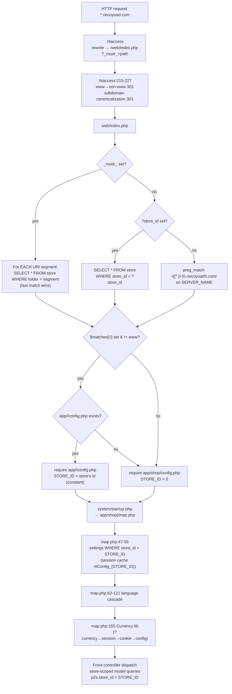
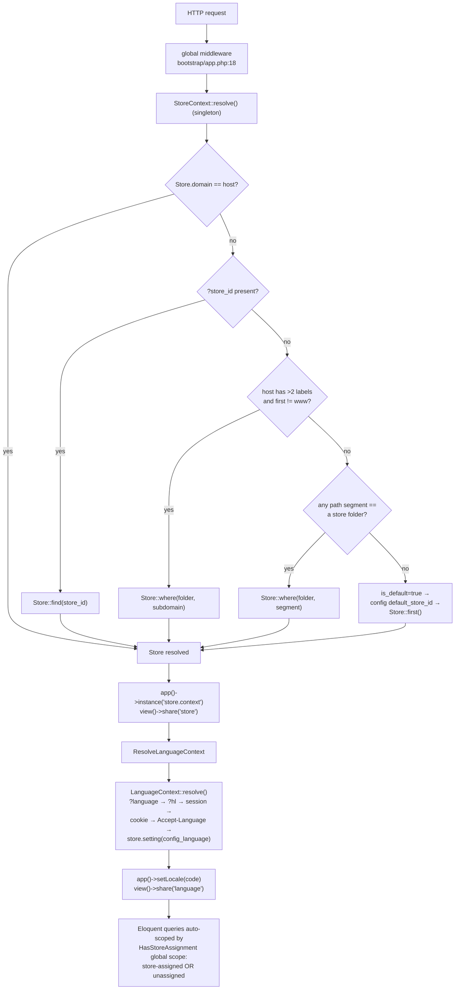
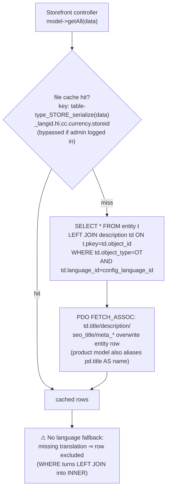
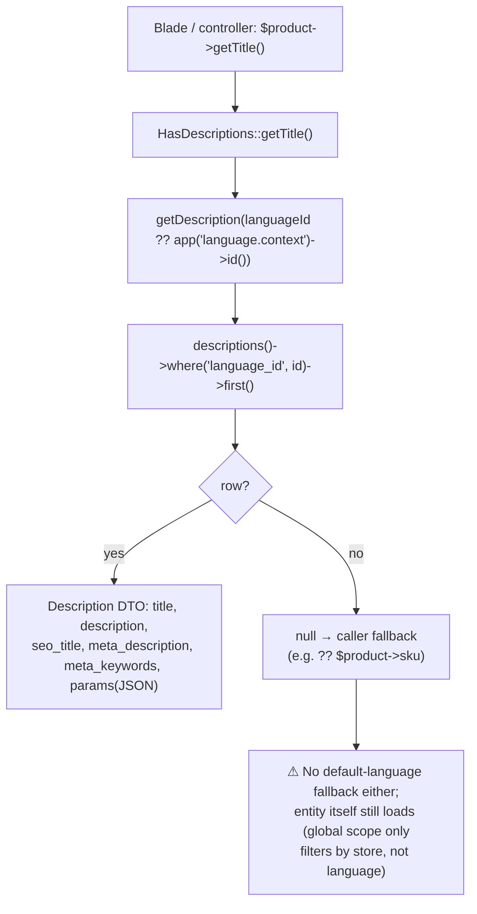
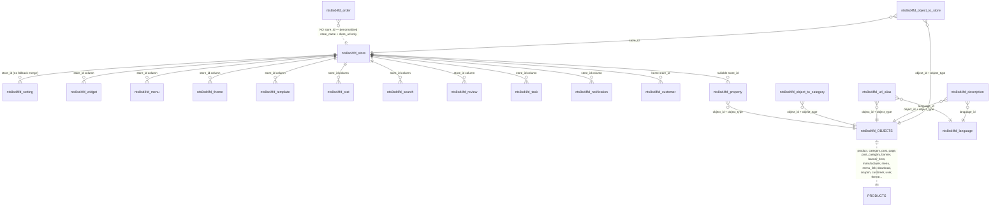
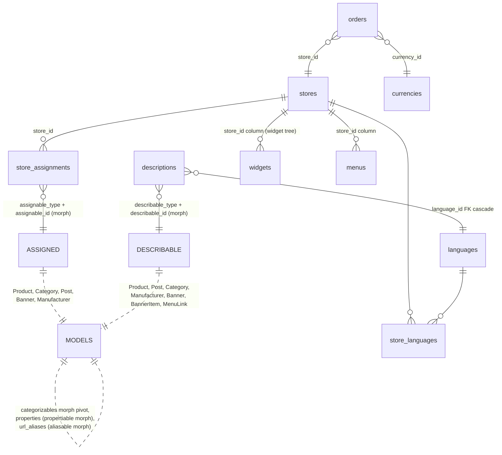
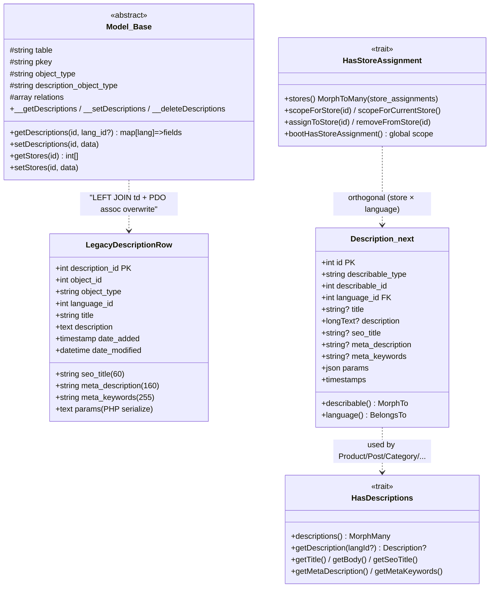
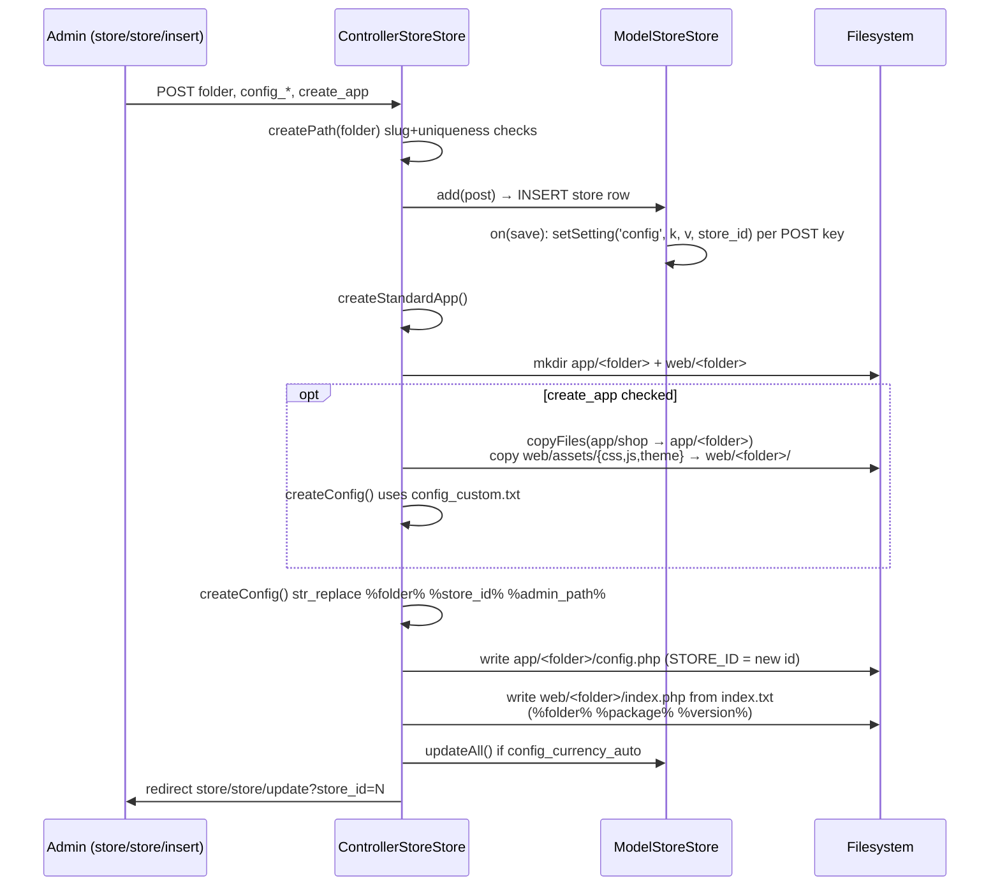

# Necoyoad — Multi-Store & Description-DTO Deep Dive (Research 3-b-3)

Repo: `/home/z/necoyoad` — legacy PHP multi-store e-commerce/CMS + `necoyoad-next/` (Laravel 11 + Filament 3 + Livewire 3) rewrite.
Cross-referenced (NOT re-derived): `research/2-architecture.md` (boot chain, store resolution, map.php), `research/3b2-eav.md` (property vs setting distinction, object spine), `research/3a4-menus.md` (menu/menu_link + object_to_store), `research/3a2-widgets.md` (widget store scoping), `research/3b1-templates.md` (theme resolution). Orientation doc: `docs/architecture/necoyoad_architecture_blueprint_v5_multistore_language.tex` (1365 lines) — read for orientation, all claims below re-verified in source.

All file:line refs are repo-relative. Legacy DB prefix `nts8sd4fd_` (schema: `necoyoad_db.sql`, 87 tables).

---

## A) Legacy Multi-Store

### A.1 The `store` table — full columns

`necoyoad_db.sql:1252-1260`:

```sql
CREATE TABLE `nts8sd4fd_store` (
  `store_id` int(11) NOT NULL,                       -- PK, AUTO_INCREMENT (sql:2487)
  `owner_id` int(11) NOT NULL,                       -- owning admin user
  `name` varchar(64) COLLATE utf8_bin NOT NULL,
  `folder` varchar(255) COLLATE utf8_bin NOT NULL,   -- URL folder / subdomain label, UNIQUE by convention (checked in code)
  `status` int(1) NOT NULL,
  `date_added` datetime NOT NULL,
  `date_modified` datetime NOT NULL
) ENGINE=MyISAM DEFAULT CHARSET=utf8 COLLATE=utf8_bin;
```

Notes:
- No `domain`/`url` column — the store is identified ONLY by `folder`. Subdomain matching (`shop.necoyoad.com`) works because the folder doubles as the subdomain label (`web/index.php:42-48`).
- No `is_default` flag — store 0 is the de-facto default (created at install; `app/shop/config.php:4` `STORE_ID=0`; admin hardcodes store 0).
- No settings columns — all store configuration lives in `nts8sd4fd_setting` rows (see A.4).
- PK: `PRIMARY KEY (store_id)` (sql:1999); the SQL dump contains **no INSERT data at all** (verified: zero `INSERT INTO` statements in the dump — schema only).

### A.2 Store resolution at the front door — `web/index.php` (84 lines)

`.htaccess` first rewrites everything into `/web/` (`.htaccess:201-214`, analyzed in research 2), then domain canonicalization:

- `.htaccess:215-220` — if not HTTPS and host starts with `www.` → `301` to `//%{HTTP_HOST}/$1` (NOTE: the rewrite target is `//host/...` — scheme-relative, the `https:` prefix is missing; same malformation at `.htaccess:222-227` for non-`necoyoad.com` subdomain hosts `^([^.]+).necoyoad.com` → `301` to `//%1.%{HTTP_HOST}/$1`. Both effectively force a "double-slash" redirect quirk).
- `ErrorDocument 404 /index.php?r=error/404` (`.htaccess:229`).

`web/index.php` store detection (order matters):

1. **Folder probing** (`web/index.php:21-31`): only when `$_GET['_route_']` is set (i.e. the request was rewritten by .htaccess because it wasn't a real file). It splits `$_SERVER['REQUEST_URI']` on `/` and queries `SELECT * FROM store WHERE folder = '<part>'` **for every path segment**; the LAST matching segment wins (`$matches[1] = $store['folder']` in the loop). So `/web/foo/bar/storecode/product` would resolve the store if any path segment equals a store folder.
2. **`?store_id=` override** (`web/index.php:32-38`): `elseif` branch — `SELECT * FROM store WHERE store_id = (int)$_GET['store_id']`; sets `$matches[1] = $store['folder']`. (Only evaluated when `_route_` is NOT set — quirk: `?store_id=` does not work on routed/SEO URLs.)
3. **Subdomain regex** (`web/index.php:41-42`): `preg_match('/([^.]+)\.necoyoad\.com/', $_SERVER['SERVER_NAME'], $matches)` — hard-coded against the literal domain `necoyoad.com`. Captures the leftmost DNS label.
4. **App selection** (`web/index.php:43-51`): if `$matches[1]` exists and != 'www': require `app/{strtolower($matches[1])}/config.php` **if it exists**, else fall back to `app/shop/config.php`. If no match at all → `app/shop/config.php` (the default store, STORE_ID 0).

Crucial consequence: the per-store `app/<folder>/config.php` file **is** the store binding — `STORE_ID` is a compile-time PHP constant defined in that file (see A.3). If no app folder exists for the resolved subdomain, the request silently runs as the default store 0 (only `folder` probing in step 1 actually loads a per-store config, since `$matches[1]` is then a folder that `createStandardApp()` materialized).

The store row found in steps 1/2 is used ONLY for its `folder` (to pick the app config); `STORE_ID` never comes from the DB row here — it comes from the generated `config.php`.

### A.3 Per-app configs — `app/{app}/config.php`

Existing apps in the repo:

| App | File | STORE_ID | CATALOG | Notes |
|---|---|---|---|---|
| shop (default store) | `app/shop/config.php:2-4` | `0` (int) | `'shop'` | root storefront; defines all DIR_*/HTTP_* constants; `NTS_DEBUG_MODE=false` (L73) |
| admin | `app/admin/config.php:10` | `0` (only if not already defined: `if (!defined("STORE_ID")) define('STORE_ID', 0);`) | `'shop'` (L44) | `ADMIN_PATH`/`APP_PATH='admin'`, version constants 1.0.2 |
| m (mobile) | `app/m/config.php:2-3` | `'9'` (**string**, not int!) | `'m'` | mobile app = store 9; `$privatePath` points at `app/shop/` (L9) so it REUSES shop controllers/models/views; `NTS_DEBUG_MODE=true` (L89) |

Key mechanics of the generated/shared configs (identical logic in `app/m/config.php:15-26` and `system/config/config_shared.txt:15-26`): derive `$domain` from `HTTP_HOST` by stripping `CATALOG.` and `www.`, then regex `([^.]+)\.<domain>` against `SERVER_NAME`; if the leftmost label == CATALOG the app is being served on `http://domain/` (subdomain mode), else the app is served under a `/CATALOG/` folder (folder mode). `HTTP_HOME` etc. are computed accordingly and `str_replace(CATALOG.'/'.CATALOG, ...)` de-duplicates.

Other entry points:
- `web/admin/index.php` — own mini-bootstrap: loads `app/admin/config.php`, then queries `SELECT * FROM setting WHERE store_id = 0` (`web/admin/index.php:26-28`) → **admin always reads store-0 settings**; language from `config_admin_language` setting (`web/admin/index.php:50-53`) — no detection cascade in admin; supports `?template=` admin-theme preview (L57-59); adds login+permission pre-actions (L63-64).
- `web/m/index.php` — mobile front controller: `PATH='m'`, loads `app/m/config.php` (STORE_ID 9), then the standard startup → `map.php` chain. `VERSION` here is `2.0.1` while `web/index.php:8` says `1.0.2` (version skew quirk).

### A.4 Per-store settings — `setting` table + `ntConfig_{store_id}` session cache

`necoyoad_db.sql:1197-1205`:

```sql
CREATE TABLE `nts8sd4fd_setting` (
  `setting_id` int(11) NOT NULL,
  `store_id` int(11) NOT NULL DEFAULT '0',
  `group` varchar(32) COLLATE utf8_bin NOT NULL,   -- always 'config' in practice
  `key` varchar(64) COLLATE utf8_bin NOT NULL,     -- e.g. config_template, config_language, config_currency, config_url, config_owner...
  `value` text COLLATE utf8_bin NOT NULL
) ENGINE=MyISAM ...;
```

Load path — `app/shop/map.php:46-58`:

```php
if (!$session->has('ntConfig_' . (int) STORE_ID)) {
    $query = $db->query("SELECT * FROM " . DB_PREFIX . "setting WHERE store_id = '" . (int) STORE_ID . "'");
    foreach ($query->rows as $setting) { $config->set($setting['key'], $setting['value']); }
} else {
    $config = unserialize($session->get('ntConfig_' . (int) STORE_ID));
}
$config->set('config_store_id', STORE_ID);
```

- **No store-0 fallback / no "default + override" merge** (contrary to OpenCart convention): a store with no `setting` rows boots with an empty config. Each store must carry a COMPLETE settings set (the store form writes all `config_*` POST fields as settings — see A.7).
- **Session cache**: the entire serialized `Config` object is cached in the session under `ntConfig_{store_id}` (`map.php:323` `$session->set('ntConfig_' . STORE_ID, serialize($config));` — note: key without `(int)` cast here, but with cast on read at L47/53; `(int)'9'`==`'9'` so both work). So settings are read from the DB once per session per store. Cache flush: `app/admin/controller/setting/cache.php:35-37` clears `ntConfig_0` and every `ntConfig_{store_id}` from the `store` table.
- `config_store_id` is set into the config (map.php:55) — used later in model cache keys.
- `hooks->run('config_load')` + `Events::emit('config_load')` fire after settings load (map.php:57-58).

Settings writes (admin): `ModelStoreStore` (A.7) — `setSetting()` deletes then INSERTs (`app/admin/model/store/store.php:267-281`), `getSettings($group,$key,$store_id)` filters `store_id`/`group`/`key` (`:236-265`), `deleteSettings()` (`:283-300`), `editMaintenance()` updates only `config_maintenance` per store (`:221-224`).

### A.5 STORE_ID propagation & per-store data model

`STORE_ID` is a **global constant** for the whole request (defined in the app config). It is used:

1. In `map.php` settings load (A.4).
2. As default store filter in every storefront query: e.g. `app/shop/model/store/product.php:342-348` — if no `store_id` in criteria: `$criteria[] = " p2s.store_id = '". (int)STORE_ID ."' "` (also `:297` for category-store join `c2s.store_id = STORE_ID`).
3. In cache keys: `Model::getAll/getAllTotal` cache id starts with `(int)STORE_ID` and ends with `config_store_id` (`system/engine/model.php:738-745`, `786-793`), plus `config_language_id`, `?hl`, `?cc`, `config_currency` — i.e. cache is segmented by store × language × currency.
4. Widget scoping: `widget.store_id` column filter (`app/admin/model/style/widget.php:233-234,305,330`).
5. Menu scoping: `m2s.store_id = STORE_ID` joins via object_to_store (`app/shop/model/content/menu.php:177,197,222`).
6. Banner scoping: `b2s.store_id = STORE_ID` (`app/shop/model/content/banner.php:28-33`, with a `//TODO: asociar con multitiendas` comment).

**Tables with a `store_id` COLUMN** (from schema grep — 16 tables + object_to_store):

| Table | store_id semantics | sql line |
|---|---|---|
| `nts8sd4fd_customer` | owning/home store of the customer (`DEFAULT '0'`) | 404 |
| `nts8sd4fd_menu` | menu belongs to exactly one store | 571 |
| `nts8sd4fd_notification` | store-scoped notification | 621 |
| `nts8sd4fd_object_to_store` | **the polymorphic store pivot** | 676 |
| `nts8sd4fd_order_payment` | payment recorded per store | 799 |
| `nts8sd4fd_product_attribute` | attribute dictionary scoped to store | 914 |
| `nts8sd4fd_property` | EAV values may be store-scoped (`DEFAULT NULL` = global) | 1121 |
| `nts8sd4fd_review` | review scoped to store | 1139 |
| `nts8sd4fd_review_likes` | like scoped to store (`DEFAULT '0'`) | 1163 |
| `nts8sd4fd_search` | search-log per store | 1178 |
| `nts8sd4fd_setting` | per-store settings (`DEFAULT '0'` = default store) | 1199 |
| `nts8sd4fd_stat` | pageview stat per store (+ denormalized `store_url`) | 1216 |
| `nts8sd4fd_store` | PK | 1253 |
| `nts8sd4fd_task` | cron/task per store | 1270 |
| `nts8sd4fd_template` | template package per store | 1356 |
| `nts8sd4fd_theme` | theme instance per store | 1378 |
| `nts8sd4fd_widget` | widget per store (`DEFAULT '0'`) | 1518 |

**Notable ABSENCE**: `nts8sd4fd_order` has **no store_id** — orders instead carry denormalized snapshots `store_name` + `store_url` (sql:693-694). `nts8sd4fd_product`, `category`, `post`, `banner`, `manufacturer`, `page` etc. have NO store column — they use the `object_to_store` pivot instead:

```sql
CREATE TABLE `nts8sd4fd_object_to_store` (
  `object_to_store_id` int(11) NOT NULL,
  `store_id` int(11) NOT NULL,
  `object_id` int(11) NOT NULL,
  `object_type` varchar(100) NOT NULL,
  `params` text COMMENT 'anything, arrays, classes, objects',
  `date_added` timestamp NOT NULL DEFAULT CURRENT_TIMESTAMP,
  UNIQUE KEY `object_to_store` (`object_id`,`object_type`,`store_id`)   -- sql:1803
) -- sql:674-681
```

An object assigned to store 0 is "default/all stores" conceptually (admin UI checkbox "Default" value 0 — `data_stores.tpl:16-17`).

### A.6 Model base store API — `system/engine/model.php` (1802 lines)

Class props (model.php:6-14): `$namespace`, `$table`, `$pkey`, `$object_type`, `$description_object_type`, `$fields`, `$relations`.

- **`getStores($id)`** — model.php:1075-1084: `SELECT * FROM object_to_store WHERE object_id = ? AND object_type = $this->object_type`; returns flat array of `store_id`s. (Used by admin form to pre-check boxes — `admincontroller.php:1002-1006`.)
- **`__setStores($object_type, $id, $data)`** — model.php:1086-1116: DELETE all rows for (object_type, object_id), then `REPLACE INTO object_to_store` per store_id (non-numeric/empty → 0). Triggers `setStore` event per row (L1108-1114).
- Wrapper **`setStores($id, $data)`** — model.php:1646-1649 → `__setStores($this->object_type, ...)`.
- **Auto-wiring in CRUD**:
  - `add()` — model.php:326-328: `if (in_array("stores", $this->relations) && is_array($data['stores'])) $this->setStores($id, $data['stores']);`
  - `update()` — model.php:419-421 (same guard).
  - `copy()` — model.php:485-487 copies store assignments (`'stores' => $this->getStores($id)` merged into the add payload).
  - `delete()` — model.php:548-563: deletes rows from the "shared tables" `object_to_category, object_to_store, property, description, stat, url_alias, review` for (object_id, object_type).
- **Query-side join** — `buildSQLQuery()` model.php:839-845: if `stores` ∈ relations AND `$data['store_id']` set (scalar→array; **empty→defaults to `STORE_ID`**):
  ```php
  $sql .= "LEFT JOIN object_to_store t2s ON (t.`{$this->pkey}` = t2s.`object_id`) ";
  $criteria[] = " t2s.object_type = '{$this->object_type}' ";
  $criteria[] = " t2s.store_id IN (...) ";
  ```
  Because the store criteria live in the WHERE clause, the LEFT JOIN behaves as INNER for store filtering. NOTE: if `store_id` is NOT passed in `$data`, the base model does NOT filter by store at all (unlike the storefront product model which hard-defaults to STORE_ID — A.5).
- Same pattern for `categories` relation → `object_to_category` join (model.php:847-853) and a `settings` relation join on the `setting` table (`model.php:855-862`, used by the store model's own listing to search settings).

Models declaring `relations` (complete list, from grep):
- `["descriptions","stores"]`: shop page/post-category/store-category; admin store/download/category/review/page/post_category/coupon/orderstatus/weightclass/lengthclass/stockstatus/currency/orderpaymentstatus/zone/newsletter
- `["descriptions","stores","categories"]`: shop post; admin store/product, content/post, style/theme
- `["stores"]`: admin content/menu, store/manufacturer, user/user, sale/customer, sale/customergroup, sale/bank_account, content/banner, localisation/geozone, localisation/taxclass, style/widget, style/template, setting/extension
- `["categories"]`: admin store/attribute
- `["descriptions"]`: admin localisation/country

Storefront models (`app/shop/model/store/product.php:125` etc.) re-declare the same relations so the base joins apply.

### A.7 Store CRUD in admin — `app/admin/controller/store/store.php` (1522 lines) + `app/admin/model/store/store.php` (301 lines)

**Controller**:
- `insert()` (store.php:43-85): builds `$this->data['folder']` from POST; serializes `config_token_ignore`; validates folder via `createPath()` (L55-59); `$store_id = $this->modelStore->add($this->request->post)` (L61) — the model's `save` event writes every POST `config_*` field into `setting`; then `createStandardApp()` (L64) if folder set; refreshes currency rates `modelCurrency->updateAll()` if `config_currency_auto` (L71-72); redirects per `$_POST['to']` (saveAndKeep/saveAndNew/default, L74-80).
- `update()` (L99-126): first `deleteSettings('config', null, store_id)` (L103) then `modelStore->update()` — full settings rewrite per save.
- `saveContent()` (L140-154): AJAX endpoint parsing serialized POST → `ModelStoreStore::saveContent($store_id, $data)` (bulk store-content assignment, see A.9).
- `delete()` (L161-170), `grid()` (L288-420, AJAX grid with filter/pagination), `getForm()` (L434+, per-language `config_title_{lang}` / `config_meta_description_{lang}` inputs L478-495 — store titles are settings keys, NOT description rows), `zone()` (L810-828 country→zone dropdown), `products()` (L939+, JSON feed of products for store-content picker), `activate/deactivate` (via base `__activate/__deactivate`).
- **Folder sanitization** — `createPath()` (L855-884): UTF-8 normalise → strip accents → `preg_replace('`[^a-z0-9]`i','_')` → lowercase trim `_`. Rejects if the slug already exists in `url_alias.keyword` OR `store.folder`; rejects reserved words (`'profile','products','productos','categories',...` L876).
- **App scaffolding** — `createStandardApp()` (L840-853):
  - `createFolder()` (L886-892): `mkdir app/<folder>` + `web/<folder>` (0755).
  - If `create_app` checkbox: `copyFiles()` (L918-937) recursively copies `DIR_CATALOG` (app/shop) into `app/<folder>` **plus** `web/assets/css|js|theme` into `web/<folder>/css|js|theme` (a full standalone copy of the storefront — "custom app" mode).
  - `createConfig()` (L894-916) always runs:
    - template = `system/config/config_custom.txt` (standalone app, own asset dirs `web/<folder>/...`) or `system/config/config_shared.txt` (shared app reusing `app/shop` code + shared `web/assets`) — chosen by `create_app`;
    - placeholders replaced: `%folder%` → folder, `%store_id%` → new store id, `%admin_path%` → ADMIN_PATH (controller L901-903);
    - written to `app/<folder>/config.php` (0644);
    - `system/config/index.txt` → `web/<folder>/index.php` with `%folder%`, `%package%` (PACKAGE), `%version%` (VERSION) replaced (L907-912). That generated front controller requires `app/<folder>/config.php` then the standard startup/map/dispatch chain (index.txt:14-44) — no maintenance pre-action, and it **always** adds `common/seo_url` (index.txt:31), unlike `web/index.php` which gates it on `config_seo_url`.
- Both templates define `CATALOG='%folder%'`, `STORE_ID='%store_id%'`, `ADMIN='%admin_path%'` and the subdomain-vs-folder URL logic of A.3. `config_shared.txt:9` points `$privatePath` at `../shop/` (shared code); `config_custom.txt:9` uses its own dir.

**Model** (`app/admin/model/store/store.php`):
- fields: name, folder, status(default 1), date_added/date_modified (NOW() sql defaults) (L10-35). No `owner_id` in fields (never written despite schema column).
- `init()`:
  - `on("save")` (L39-47): writes EVERY key of the saved payload into `setting` via `setSetting('config', $key, $value, $id)` — this is how per-store `config_*` settings get persisted.
  - `on("delete")` (L49-87): deletes the app/web folder trees (`deleteFiles()` L204-219 recursive glob-unlink); deletes `{table}_to_store` rows for a **list of tables that mostly DON'T EXIST** (`bank_account_to_store`, `banner_to_store`, `coupon_to_store`, `customer_to_store`, `download_to_store`, `object_to_store`, `template_to_store`, `theme_to_store`, `category_to_store`, `product_to_store`, `manufacturer_to_store` — only `object_to_store` exists; L59-75); deletes rows from `setting, search, store, stat` by store_id (L77-86). Notably does NOT delete `review`, `widget`, `menu`, `notification`, `task`, `stat.store_url` rows etc.
- `saveContent($store_id, $data)` (L90-202) — **defect-ridden bulk assignment** (see A.9/E).
- `getSetting/getSettings/setSetting/deleteSettings` (L226-300), `editMaintenance` (L221-224).

### A.8 Admin store-assignment UI (per entity)

- **Form partial** `app/admin/view/templates/default/shared/form/data_stores.tpl` (31 lines): checkbox scrollbox `name="stores[]"` with a fixed first checkbox value `0` labeled "Default" (L16-17) plus one checkbox per store; "Seleccionar Todos/Ninguno" toggles; if no stores exist, a hidden `stores[]=0` fallback (L30). Filter input `q` filters the list via JS (`admincontroller.php:1091-1093`).
- **Declarative wiring** in `AdminController::getForm()` (`app/admin/controller/admincontroller.php`):
  - `form_vars['descriptions']` → loads `$this->data['descriptions'] = $this->model->getDescriptions($id)` (POST data takes precedence) + `$this->data['languages'] = modelLanguage->getAll()` (L950-959);
  - `form_vars['stores']` → `$this->data['stores'] = $this->modelStore->getAll()` (L982-986);
  - always `$this->data['_stores'] = $this->model->getStores($id)` (assigned store ids for pre-checking; L1002-1006).
- Included by: `store/product_form_links.tpl`, `store/category_form_data.tpl`, `store/manufacturer_form_data.tpl`, `content/post_form_data.tpl`, `content/post_category_form_data.tpl`, `content/page_form_data.tpl`, `user/user_form.tpl` (grep hit list).
- The **store-content tab** in the store form (ControllerStoreStore::products / saveContent + `showContent`) assigns Products/Categories/Manufacturers/Downloads/Pages/Posts/PostCategories/Banners/Menus/Coupons/BankAccounts/Customers to a store in bulk (AJAX picker).

### A.9 `object_to_store` write inconsistencies (verified defects)

`ModelStoreStore::saveContent()` (`app/admin/model/store/store.php:90-202`) — each block DELETEs all `object_to_store` rows **for the store** (for some blocks, for ALL stores' rows of that type — since the DELETE has no object_type filter!) then INSERTs:

| Block | DELETE predicate | INSERT columns | Problem |
|---|---|---|---|
| Products (L91-98) | `WHERE store_id = X` | `store_id, product_id` | `product_id` column does NOT exist in `object_to_store` (needs object_id+object_type); **insert fails** (MyISAM: unknown column error) |
| Categories (L100-107) | same | `store_id, category_id` | same defect |
| Manufacturers (L109-116) | same | `store_id, manufacturer_id` | same defect |
| Downloads (L118-126) | same | `store_id, object_type='download', object_id` | OK columns, but the preceding DELETE wiped ALL types for the store |
| Pages (L128-136) | same | `object_type='page', object_id` | **INSERT omits store_id** → row gets store_id=0 |
| Posts (L138-145) | same | `object_type='post', object_id` | omits store_id |
| PostCategories (L147-154) | same | `object_type='post_category', object_id` | omits store_id |
| Banners (L156-163) | same | `object_type='banner', object_id` | omits store_id |
| Menus (L165-172) | same | `object_type='menu', object_id` | omits store_id |
| Coupons (L174-181) | same | `object_type='coupon', object_id` | omits store_id |
| BankAccounts (L183-190) | same | `object_type='bank_account', object_id` | omits store_id |
| Customers (L192-199) | same | `object_type='customer', object_id` | omits store_id |

Contrast with the **correct** generic path `Model::__setStores()` (model.php:1086-1116) used by entity forms (`stores[]` checkboxes → `setStores()`): DELETE by (object_type, object_id) then REPLACE with (object_type, object_id, store_id). Individual entity CRUD is fine; the per-store bulk "content" screen is the broken one. (Blueprint v5 §"object_to_store writes — inconsistent" documents the same; verified here at source level.)

Also inconsistent READS: `app/shop/model/store/product.php` joins `object_to_store p2s` polymorphically (L215) while some admin reports reference non-existent `product_to_store`-style legacy tables (e.g. `app/admin/model/report/cpurchased.php:12` joins `object_to_category p2c` with alias of `product_to_category` semantics — OpenCart lineage leftovers).

### A.10 Store-scoped widgets / menus / banners / products (cross-ref summary)

- **Widgets**: `widget.store_id` column (sql:1518); admin widget model defaults `$data['store_id'] = STORE_ID` (admin always 0) and filters `w.store_id` (`app/admin/model/style/widget.php:305,330,410+`). Widget rows/columns cascade per store (see research 3a2).
- **Menus**: `menu.store_id` column (sql:571) for the menu itself, but the storefront ALSO joins `object_to_store m2s ... m2s.store_id = STORE_ID` (`app/shop/model/content/menu.php:177`) — double scoping (column + pivot; the pivot rows are written via `__setStores` since admin content/menu model has `relations=["stores"]`).
- **Banners**: banner has NO store column; scoped solely via `object_to_store b2s` (`app/shop/model/content/banner.php:28-33`).
- **Products/categories/manufacturers/posts/pages**: no store column; scoped via `object_to_store` joins in storefront models (`product.php:215,296,306`; `manufacturer.php:80`).
- **Stat / search / review / notification / task**: own `store_id` columns (A.5).

### A.11 Currency handling

**Table** `nts8sd4fd_currency` (sql:385-393): `currency_id, code(3), symbol_left, symbol_right, decimal_place(1), value float(15,8), status, date_modified`. Rates are stored as multipliers against the base currency; `value` refreshed by `modelCurrency->updateAll()` (called after store save when `config_currency_auto` — store.php:71-72).

**Library** `system/library/currency.php` (139 lines):
- Constructor (L8-37): loads ALL currencies into `$this->currencies[code]`; selection cascade: `?currency=` GET (L28) → session `currency` (L30) → cookie `currency` (L32) → `config_currency` (L35). Global to the platform — **not store-scoped** (currencies are shared across stores; only the *default* differs per store via its `config_currency` setting).
- `set($currency)` (L39-49): sets code + persists to session & cookie.
- `format($number, $currency, $value, $format)` (L51-101): `value = number * rate`, `number_format` with per-language decimal/thousand separators (`language->get('decimal_point')`), symbol_left/right.
- `convert($value, $from, $to)` (L103-117): `value * (to/from)`; unknown code → 0 rate (quirk: converts to 0 instead of failing).
- Accessors: `getId/getCode/getValue/has` (L119-137).

**`?cc=` override** — the storefront currency switch:
- `app/shop/map.php:249-252`: `if (!empty($_GET['cc'])) $config->set('config_currency', $_GET['cc']);` — BUT this runs AFTER the `Currency` library was constructed (map.php:165 `$registry->set('currency', new Currency($registry));`) and `Currency` never re-reads config → config change alone doesn't switch the live instance.
- The real handler is `common/header` controller: `app/shop/controller/common/header.php:47-56` — `if ($this->request->hasQuery('cc')) { $this->currency->set($this->request->getQuery('cc')); ... redirect }` (also clears shipping session). `?hl=` language switch handled at L36-45 the same way (`$session->set('language', hl)` + redirect).
- UI: `currency_selector` module JS appends `&cc=CODE` (`app/shop/view/theme/choroni/module/currency_selector_default.tpl:19`); `localisation/currencies.tpl:6` builds `&cc=` links.
- `?cc` is also baked into every model cache key (A.5) so cached listings are currency-variant.

**Customer / cart store-scoping**:
- Customers are GLOBAL: `Customer::__construct` selects by `customer_id` + `status=1` with **no store filter** (`system/library/customer.php:33`); the `customer.store_id` column (sql:404) records only the originating store; admin sale/customer model has `relations=["stores"]` so a customer *can* additionally be assigned to stores via the pivot (`object_type='customer'`).
- Cart is NOT store-scoped: `Cart::get/set` keys on `customer_id ?? session_id` + `_shop_{C_CODE}_` prefix (`system/library/cart.php:39-49`), where `C_CODE` is the install-wide company code from `cconfig.php:3` (`"0000001"`) — same cart follows the user across stores in one session.

---

## B) The "Description DTO" pattern (legacy)

### B.1 The `description` table — full columns

`necoyoad_db.sql:452-465`:

```sql
CREATE TABLE `nts8sd4fd_description` (
  `description_id` int(11) NOT NULL,                     -- PK (sql:1721)
  `object_id` int(11) NOT NULL COMMENT 'relation with object''s table',
  `object_type` varchar(100) NOT NULL COMMENT 'type of the object in the relation',
  `language_id` int(11) NOT NULL COMMENT 'relation with language''s table',
  `title` varchar(255) NOT NULL COMMENT 'the title of the content',
  `description` text COMMENT 'the rich or html content',
  `seo_title` varchar(60) DEFAULT NULL COMMENT 'SEO title',
  `meta_description` varchar(160) DEFAULT NULL COMMENT 'SEO description or resume of the content',
  `meta_keywords` varchar(255) DEFAULT NULL COMMENT 'SEO keywords',
  `params` text COMMENT 'anything',
  `date_added` timestamp NULL DEFAULT CURRENT_TIMESTAMP,
  `date_modified` datetime DEFAULT NULL
) ENGINE=MyISAM DEFAULT CHARSET=utf8;
```

The DTO shape: **(object_id, object_type) → polymorphic owner; language_id → locale; payload = title + description (body) + seo_title + meta_description + meta_keywords + params (serialized misc)**. Only PK on description_id — **no unique key on (object_id, object_type, language_id)**, so duplicate translations are possible at SQL level (dedup enforced only by the delete-then-insert write pattern). The `keyword` shown in edit forms is NOT stored here — it lives in `url_alias` (see B.3).

### B.2 Model base description API — `system/engine/model.php`

- **`__getDescriptions(object_type, id, language_id=null)`** — model.php:1193-1228: builds criteria `object_type` + `object_id` (+ optional `language_id`); queries `description`; reshapes rows into `[language_id => ['language_id','title','description','seo_title','meta_keywords','meta_description']]` (note: `params` is NOT returned); then queries `url_alias` **with the same criteria** (url_alias has the same object_id/object_type columns) and merges `keyword` per language (L1221-1225). So the admin "descriptions" array is actually description + SEO keyword joined per language.
- **`__deleteDescriptions(object_type, id, language_id=null)`** — model.php:1241-1267: DELETE with same criteria; triggers `deleteDescription` event (L1260-1266). Does NOT delete url_alias rows (only `Model::delete()` bulk-cleans url_alias — L549-563).
- **`__setDescriptions(object_type, id, data)`** — model.php:1280-1348: foreach `$data` as `language_id => value` (language_id falls back to `$value['language_id']`, L1286); **delete-then-INSERT** per language (the UPDATE branch is commented out, L1288-1307); optional fields written only when isset: title, description, seo_title, meta_description, meta_keywords, `params` (serialized via `serialize()`, L1314); triggers `setDescription` event (L1320-1327); if `$value['keyword']` non-empty → `REPLACE INTO url_alias (language_id, object_id, object_type, query='object_type=ID', keyword)` (L1329-1346) + `setUrlAlias` event.
- Wrappers (model.php:1612-1632): `getDescriptions($id, $language_id)` / `setDescriptions($id, $data)` — both use `$this->description_object_type ?: $this->object_type`. `$description_object_type` lets a model whose rows are parents store descriptions under a child type — e.g. `ModelContentBanner` (`object_type='banner'`, `description_object_type='banner_item'`, `app/shop/model/content/banner.php:15-16` and admin `content/banner.php:17-18`) and `ModelContentMenu` (`menu` / `menu_link`, `app/admin/model/content/menu.php:15-16`).
- CRUD auto-wiring: `add()` model.php:322-324; `update()` L415-417; `copy()` L481-483 (copies descriptions); `delete()` L548-563 (deletes description rows among shared tables).

### B.3 Description consumption in queries — `buildSQLQuery` LEFT JOIN + row merge

Base `Model::buildSQLQuery()` (model.php:825-1059):

- **Join** (L834-837): if `descriptions` ∈ relations:
  ```php
  $sql .= "LEFT JOIN `" . DB_PREFIX . "description` td ON (t.`{$this->pkey}` = td.`object_id`) ";
  $criteria[] = " td.object_type = '{$this->object_type}' ";
  ```
- **Language filter** (L875-884): only when `$data['language_id']` isset — array→`IN (...)`; empty array → `td.language_id IN (config_language_id)`; **NOT set → no language criteria at all** (rows duplicate per language, collapsed by `GROUP BY t.pkey` — arbitrary language wins; relevant for `getByID()` which passes only `["id"=>$id]`, model.php:718-721).
- **Search** (L965-988): `queries` array → `LCASE(td.title) LIKE ... OR...` (+ `td.description` when `search_in_description`); **title filter** (L990-999).
- **GROUP BY / ORDER** (L1036-1045): `GROUP BY t.{pkey}` + `ORDER BY td.title` default for described models (else `t.date_added`); LIMIT with default 24.
- **Row merge**: `getAll` uses `SELECT * FROM table t LEFT JOIN description td ...` (model.php:749-760; `applyFilters('select')` may override the `*`). The PDO driver returns `PDO::FETCH_ASSOC` rows (`system/database/ntMySQLPdo.php:53`), so **duplicate column names overwrite: td's `title`, `description`, `seo_title`, `meta_description`, `meta_keywords`, `params`, `language_id`, `date_added`, `date_modified` overwrite the base table's values in the returned row**. This is the legacy "DTO merge": description fields are flattened into the entity row with no prefix.
- The storefront **product** model goes further and aliases explicitly: `app/shop/model/store/product.php:146-151` — `pd.title AS name, pd.title AS title, pd.description AS description, pd.meta_description AS meta_description, pd.meta_keywords AS meta_keywords, pd.seo_title AS seo_title` (plus `manufacturer`, `stock`, `weight_class` from other joins). It also joins `status ss (object_type='stock_status')` + `description wcd (object_type='weight_class')` for localisable reference data (L158-159, 229-236, 261-266).
- **Fallback behavior when a language is missing**: there is **NONE**. Because the language criteria sit in the WHERE clause, the LEFT JOIN degrades to INNER — an entity without a `description` row in the CURRENT language simply disappears from listings (storefront product model hard-codes `pd.language_id = config_language_id` at product.php:242). There is no "fall back to default language" anywhere in the legacy read path. The only fallback-ish mechanism is the admin language-creation clone (B.6).
- **Cache**: getAll/getAllTotal wrap the query in the file Cache with the store×language×currency key (A.5); admin-logged-in users bypass cache reads (model.php:748, `if (!$cached || (bool)$this->user->getId())`).

### B.4 Which entities have descriptions — complete object_type catalog

From `$object_type` / `$description_object_type` declarations + direct SQL in models:

**Content / catalog (via base relations)**:
| object_type | Model(s) | table |
|---|---|---|
| `product` | shop+admin `store/product` | product |
| `category` (product categories) | shop+admin `store/category` | category |
| `post_category` (blog categories) | shop `content/category`, admin `content/post_category` | category |
| `post` | shop `content/post`, admin `content/post` | post |
| `page` | shop `content/page` (same `post` table, post_type='page'), admin `content/page` | post |
| `manufacturer` | admin `store/manufacturer` (no descriptions relation but `manufacturer` descriptions queried in product joins — `store/product.php` LEFT JOINs manufacturer description via `mp.object_type='manufacturer'` in `store/manufacturer.php:110`) | manufacturer |
| `banner` | parent object for `banner_item` descriptions | banner |
| `banner_item` | `$description_object_type` of banner models; slides carry their own title/description | banner_item |
| `menu_link` | `$description_object_type` of menu models (`admin/model/content/menu.php:16`); menu links titles queried via `lp.object_type='menu_link'` (`content/menu.php:177,260,267`) | menu_link |
| `download` | admin `store/download` (relations descriptions+stores) | download |
| `review` | admin `store/review` (relations descriptions+stores — reviews CAN have descriptions, though review body lives in `review.text`) | review |
| `coupon` | admin `sale/coupon` (relations descriptions+stores; coupon title read via description join `checkout/coupon.php:6`) | coupon |
| `newsletter` | admin `marketing/newsletter` (descriptions+stores) | newsletter |
| `campaign` | descriptions/keywords written by campaign model (`admin/model/marketing/campaign.php:119,133,139`) | campaign |
| `theme` | admin `style/theme` (categories+descriptions+stores) | theme |

**Localisation (admin)**: `country` (relations descriptions), `currency` (descriptions+stores — currency titles are descriptions! `localisation/currency.php:44`), `zone` (descriptions+stores), `length_class`, `weight_class`, `stock_status`, `order_status`, `order_payment_status` (all descriptions+stores; storefront joins them by object_type — `account/order.php:116-117,185-186`, `account/payment.php:26-27,148`, `store/product.php:261-262`).

Others written ad hoc: `attribute` (product_attribute descriptions? — admin `store/attribute.php` joins category descriptions; attribute labels live in product_attribute table), `product_attribute_group` (`store/attribute.php:258`), `widget_rows` / `widget_cols` (property keys, not descriptions), `zone` descriptions used in product filtering (`store/product.php:313-317`).

### B.5 Language table + detection cascade

`nts8sd4fd_language` (sql:525-538): `language_id, name, code(5), locale, image, directory, filename, sort_order, status`. Only one language directory ships in the repo: `app/shop/language/spanish/**` (Language library falls back to `spanish/` for any missing file — `system/library/language.php:20-29`).

**Storefront cascade** — `app/shop/map.php:62-121` (priority order):
1. `?language=CODE` GET (L94-95)
2. `?hl=CODE` GET (L96-97) — `hl` is the "host language" param, also in cache keys
3. session `language` (L98-99)
4. cookie `language` (L100-101)
5. `HTTP_ACCEPT_LANGUAGE` browser negotiation (L78-92): splits the header on `,`, matches each against every language's `locale` (comma-separated locale list per language); LAST match wins (no q-value parsing — quirk)
6. store default `config_language` setting (L104-106)

Then: session + cookie are written back (L108-114); `config_language_id`/`config_language` set (L115-116); `new Language(directory)` + `load(filename)` (L119-120); `language_load` hook (L121). `?hl=` switching actually happens in `common/header` (A.11) with a redirect; map.php's GET check just makes the same request render in the new language without redirect.

**Admin**: no cascade — `web/admin/index.php:50-53` uses the `config_admin_language` **setting** (from store 0) to pick language_id + Language instance.

**Language CRUD quirks** (`app/admin/model/localisation/language.php:46-97`): on INSERT of a new language, the `save` handler **clones all description rows from the current admin language into the new language_id** (copy-forward seeding, L48-82); on DELETE it deletes all `status` + `description` rows of that language (L84-96).

### B.6 `url_alias` (SEO keyword DTO companion)

`necoyoad_db.sql:1410-1418`: `url_alias_id, object_id, language_id, object_type, query (e.g. 'product_id=42'), keyword`. Written together with descriptions by `__setDescriptions` (B.2); read together in `__getDescriptions`; bulk-deleted with the entity by `Model::delete()` (model.php:549-563). The SEO-URL pre-action resolves keywords → `query` (see research 2).

---

## C) necoyoad-next — Store & Language context

### C.1 `app/Services/StoreContext.php` (108 lines) — FULL analysis

Per-request singleton (bound in `AppServiceProvider::register()`, `app/Providers/AppServiceProvider.php:25-27`; also aliased as container instance `'store.context'` by the middleware). Constructor takes the current `Request`. `resolve()` (L32-87) caches the store in `$this->store` (memoized per instance) and walks **4 strategies + fallback**:

1. **Exact domain match** (L43-46): `Store::where('domain', $host)->first()` — NEW concept vs legacy (legacy has no domain column). Highest priority; a store with `domain='techworld.local'` wins regardless of path/query.
2. **`?store_id=` GET** (L49-54): `Store::find($request->query('store_id'))` — mirrors legacy web/index.php:32, but works on every URL (no `_route_` precondition).
3. **Subdomain** (L57-64): `count(explode('.',$host)) > 2 && $parts[0] !== 'www'` → `Store::where('folder', $subdomain)` — generalises legacy's hard-coded `*.necoyoad.com` regex to any multi-label host.
4. **Path segment** (L70-79): iterates ALL `/`-segments of `request->path()`, first segment matching a store folder wins. Comment (L66-69) notes the segment is NOT consumed — routes would need `Route::prefix('{store?}')` for path-based multi-store to work without 404s (not implemented in `routes/web.php`).
5. **Fallback** (L82-86): `Store::where('is_default', true)->first() ?? Store::find(config('necoyoad.default_store_id', 0)) ?? Store::first()` — never returns null while any store exists.

Accessors: `id()` (L89-92, `?? 0`), `model()` (L94-97), `folder()` (L99-102), **`setting($key, $default)`** (L104-107) → `$store->settings[$key]` reading the `settings` JSON column (cast 'array' in `app/Models/Store.php:17-21`). There is **no `currency()`/`language()` accessor** — consumers call `setting('config_currency')` / `setting('config_language')` (e.g. `LanguageContext.php:74`, `TemplateResolver.php:41`, `View/Components/Widgets/Banner.php:108`).

No `Cache::remember` around resolution — the memoized instance is the only caching (fresh `Store::where` queries per request).

### C.2 `app/Http/Middleware/ResolveStoreContext.php` (38 lines)

`handle()` (L26-37): `$store = $this->storeContext->resolve();` → `app()->instance('store.context', $this->storeContext);` (DI binding) → `view()->share('store', $store)` (every Blade view gets `$store`). No response headers, no exception on failure — `StoreNotResolvedException` exists (`app/Exceptions/StoreNotResolvedException.php`, 503, extends `StorefrontException`) but is **never thrown** anywhere (grep: only its own definition). Registered globally in `bootstrap/app.php:18` via `$middleware->append(...)` — so it runs for web, api AND the Filament admin panel.

### C.3 `app/Http/Middleware/ResolveLanguageContext.php` (41 lines)

`handle()` (L26-40): resolves language via `LanguageContext`, binds `'language.context'`, sets `app()->setLocale($language->code)`, `view()->share('language', $language)`. Also appended globally (bootstrap/app.php:19).

### C.4 `app/Services/LanguageContext.php` (101 lines)

Singleton (AppServiceProvider.php:29-31, receives the StoreContext singleton). `resolve()` (L32-85) — 6-level cascade mirroring legacy map.php:

1. `?language=` GET (L42-44)
2. `?hl=` GET (L46-48)
3. session `language` (L50-52)
4. cookie `language` (L54-56)
5. `HTTP_ACCEPT_LANGUAGE` (L58-70) — improved vs legacy: strips q-values (`explode(';', ...)`) and `break 2` on FIRST match
6. store default: `$this->storeContext->setting('config_language', 'en')` (L73-75)

Lookup set: `Language::where('status', true)->get()->keyBy('code')` (L38). Final fallback chain if code unknown: `$languages->get($code) ?? $languages->first() ?? new Language(['id'=>1,'code'=>'en'])` (L77). Persists: `session(['language' => $code])` + `Cookie::queue('language', $code, 60*24*30)` (30 days) (L81-82) — with a comment noting `cookie()` alone doesn't send. Accessors: `id()`, `code()`, `model()` (L87-100).

### C.5 `app/Traits/HasStoreAssignment.php` (71 lines) — store_assignments pivot

Migration `database/migrations/0001_01_01_000000_create_core_tables.php:161-168`:
```php
Schema::create('store_assignments', function (Blueprint $table) {
    $table->id();
    $table->foreignId('store_id')->constrained()->cascadeOnDelete();
    $table->morphs('assignable');
    $table->unique(['store_id', 'assignable_type', 'assignable_id']);
});
```
This replaces `object_to_store` (object_id/object_type/store_id) with a proper morph pivot.

Trait API:
- `bootHasStoreAssignment()` (L26-41): adds a **global scope 'store'** — if `store.context` is bound and has an id: `whereHas('stores', fn($sq) => $sq->where('stores.id', $id))->orDoesntHave('stores')` — i.e. **store-assigned OR unassigned (global) content is visible**. This is an intentional semantic improvement over legacy (legacy: entity visible only in stores it's assigned to, with store 0 as "default" via checkbox).
- `stores(): MorphToMany` (`morphToMany(Store::class, 'assignable', 'store_assignments')`, L43-46).
- `scopeForStore($query, $storeId)` (L48-53) / `scopeForCurrentStore($query)` (L55-60).
- `assignToStore(int $storeId)` → `syncWithoutDetaching` (L62-65); `removeFromStore(int $storeId)` → `detach` (L67-70).

**Models using HasStoreAssignment**: `Banner`, `Category`, `Manufacturer`, `Post`, `Product` (models dir grep) — plus Filament resources that only *reference* the relation (CampaignResource, ContactListResource, ContactResource, CurrencyResource, LanguageResource, ManufacturerResource, MenuResource, NewsletterResource, UserResource use it for the shared Stores tab UI).

**Admin bypass**: `NecoyoadResource::getEloquentQuery()` (app/Filament/Resources/NecoyoadResource.php:89-92) does `parent::getEloquentQuery()->withoutGlobalScope('store')` — admins see all stores' content.

### C.6 `app/Models/Store.php` + StoreResource (Filament CRUD)

Model (27 lines): `$fillable = ['name','folder','domain','is_default','status','settings']`; casts `settings => array` (JSON), `is_default/status => boolean`; `languages(): BelongsToMany(Language, 'store_languages')` (L23-26). Migration (create_core_tables.php:24-36): `id, name, folder UNIQUE, domain nullable, is_default bool, status bool, settings json, timestamps, softDeletes`.

`store_languages` pivot (migration L51-57): `(store_id, language_id)` composite PK — a store may expose a subset of languages (used by StoreResource "Languages" tab + seeder `syncWithoutDetaching`).

`app/Filament/Resources/StoreResource.php`:
- Form (L33-60): Tabs → **General** (name, folder `unique(ignoreRecord)`, domain, is_default, status), **Languages** (`Select::make('languages')->relationship('languages','name')->multiple()`), **Settings** (`KeyValue::make('settings')` free-form JSON editor — the equivalent of legacy's ~200 config_* setting rows is now one JSON blob per store).
- Table (L62-73): name (searchable), folder, domain, is_default/status icons; Edit action only (no create/delete actions declared in table — create exists via getPages).
- Class docblock (L14-25) notes: sharedTabs() NOT used because Store is the scope root (no descriptions/stores/SEO morphs of its own).

### C.7 Multi-currency in next

- `app/Models/Currency.php` (12 lines): fillable `code, symbol_left, symbol_right, decimal_place, value, status`; casts value float, status bool. Migration (L59-71): `code UNIQUE, decimal_place char(1) default '2', value decimal(15,8) default 1`.
- **No Currency library/service port**: there is no equivalent of legacy `Currency` (no selection cascade `?cc=`/session/cookie, no `format()`/`convert()`). The only consumer is the storefront widget view `resources/views/components/widgets/product-list.blade.php:22`: `{{ config('necoyoad.default_currency', 'USD') }} {{ number_format($product->price, 2) }}` — prints the GLOBAL default currency code + unconverted price. `config/necoyoad.php` exposes `default_currency` (env `DEFAULT_CURRENCY`) and `default_store_id`; per-store `settings.config_currency` exists in the seeder but is not consulted when rendering prices.
- Orders persist `currency_id` + `store_id` (`app/Models/Order.php:17-20` fillable), so the data model is ready but the runtime conversion layer is a **gap/TODO** in the rewrite.

### C.8 Database seeders — the 5-store demo structure

`database/seeders/DatabaseSeeder.php` (single seeder, 519 lines):
- 3 admin users (admin/editor/manager, password 'password', L95-113).
- Shared: languages `en` (en_US) + `es` (es_VE) (L62-63); currencies USD(1.0), VES(36.5), EUR(0.92) (L65-67); customer groups Retail/Wholesale (L72-73).
- **5 stores** (L78-84):
  | name | folder | domain | default | currency | lang |
  |---|---|---|---|---|---|
  | Necoyoad Demo | `default` | null | **yes** | USD | en |
  | TechWorld | `techworld` | techworld.local | no | USD | en |
  | Moda Latina | `moda` | moda.local | no | VES | es |
  | Home & Garden | `home` | home.local | no | EUR | en |
  | Gadgets Pro | `gadgets` | gadgets.local | no | USD | en |
- `createStore()` (L118-139): `Store::firstOrCreate(['folder'], [name, domain, is_default, status, settings[config_template='choroni', config_language, config_currency, config_title]])` + `languages()->syncWithoutDetaching([en, es])`.
- `seedStoreData()` (L144-172) per store: 5 customers (`store_id` column, L178-207), 3 categories, 5 products, 1 page + 2 posts (Post model `type='page'|'post'`), 1 banner (3 BannerItems), 1 menu (4 MenuLinks, `store_id` on menu), widget tree (WidgetRow/WidgetColumn/Widget with `store_id`), 3 contacts + contact list, 1 newsletter.
- Descriptions: every category/product/post gets **EN + ES description rows** via `syncDescriptions()` (L510-518): `$model->descriptions()->updateOrCreate(['language_id' => $languageId], $attrs)`.
- Products: `firstOrCreate(['sku' => $prod[0].'-'.$storeIndex], ...)` + `categories()->syncWithoutDetaching(...)` + `stores()->syncWithoutDetaching($store->id)` (L316-335). Note products are ALSO implicitly visible everywhere if unassigned (global-scope semantics, C.5).

### C.9 Routes / middleware / how store context affects storefront queries

- `bootstrap/app.php:17-22`: global middleware append order: `ResolveStoreContext` → `ResolveLanguageContext` → `LogHttpResponse`. Runs for every request (web + api + Filament).
- `routes/web.php`: storefront routes are un-prefixed (`/`, `/products`, `/product/{product}`, `/categories`, `/category/{category}`, `/posts`, `/post/{post}`, `/page/{page}`, `/search`, `/checkout`, auth, marketing tracking, `/widget/async/{name}`, admin API groups). NO `{store?}` prefix group — path-segment multi-store (strategy 4) would currently collide with these literal routes (documented in StoreContext's comment).
- `StorefrontController` (`app/Http/Controllers/StorefrontController.php`): route-model binding (`Product $product` etc.) → the HasStoreAssignment global scope automatically filters `Product::findOrFail` to the current store, so cross-store deep links 404 (unless the product is unassigned). Each action sets `session(['object_type' => ..., 'object_id' => ..., 'landing_page' => ...])` for widget composition (v8 pattern) and resolves the template via `TemplateResolver`. Description consumption: `$product->load(['descriptions', 'categories.descriptions']); $title = $product->getTitle() ?? $product->sku;` (L56-57), `$post->getTitle() ?? 'Post'` (L108), etc. — `$model->getTitle()` from HasDescriptions defaults to the current LanguageContext language.
- Search (`search()`, L149-174): `Product::whereHas('descriptions', fn($q) => $q->where('title','like',...)->orWhere('description','like',...))` — searches description DTO fields (comment notes "descriptions table has 'title', NOT 'name'").
- `WidgetService` (`app/Services/WidgetService.php:56,114-148`): widget trees loaded `where('store_id', $storeId)` (+ landing page, device, login, object_type/object_id filters); cache key `widgets:{storeId}:{position}:{languageId}:{routeName}:{objectType}:{objectId}` (L148) — store×language segmented exactly like legacy cache keys.
- Livewire components: `CartDrawer::add()` loads `Product::with(['descriptions' => fn($q) => $q->where('language_id', app(LanguageContext::class)->id())])` (CartDrawer.php:52-54); cart is `session('cart')` — NOT store-scoped (same as legacy quirk). `CheckoutForm` persists orders with `app(StoreContext::class)->id()` (CheckoutForm.php:54-58).
- Filament admin: NecoyoadResource::getEloquentQuery removes the store scope; sharedTabs give every entity the Descriptions/Stores/SEO tabs (see C.10).

### C.10 Filament consumption of the Description DTO

`app/Filament/Resources/NecoyoadResource.php:33-83` — `sharedTabs()` returns:
1. **Descriptions tab** (L36-64): `Repeater::make('descriptions')->relationship('descriptions')` — a Repeater over the morphMany relation; per-item fields: `language_id` (Select via `relationship('language','name')`), `title` (required), `description` (Textarea rows 5), `seo_title` (max 60), `meta_description` (max 160), `meta_keywords`. Columns 2, collapsible. This is the direct descendant of legacy's per-language `<div id="language{id}">` tabs (`general_descriptions.tpl`).
2. **Stores tab** (L66-74): `Select::make('stores')->relationship('stores','name')->multiple()->preload()` with helper "Leave empty for all stores" — morphToMany store_assignments; replaces legacy's `stores[]` checkbox scrollbox.
3. **SEO tab** (L76-81): `seo_url_keyword` text input (HasSeoUrl).

Resources calling `sharedTabs()`: ProductResource (L87), PostResource (L52), CategoryResource (L43), BannerResource (L71). StoreResource / MenuResource / WidgetRowResource deliberately don't (docblocks explain: scope root / no morphs).

### C.11 The Description model + HasDescriptions trait (DTO in next)

`app/Models/Description.php` (32 lines): `$fillable = ['describable_type','describable_id','language_id','title','description','seo_title','meta_description','meta_keywords','params']`; `$casts = ['params' => 'array']` (JSON column instead of legacy PHP `serialize()`); relations `describable(): MorphTo` + `language(): BelongsTo`. Migration (create_core_tables.php:109-123): `morphs('describable')`, FK `language_id` constrained cascade, `title nullable`, `description longText nullable`, `seo_title varchar(60)`, `meta_description varchar(160)`, `meta_keywords varchar(255)`, `params json nullable`, `timestamps`, **`unique(['describable_type','describable_id','language_id'])`** — fixes the legacy duplicate-translation hole. NO store_id on descriptions (localization is orthogonal to tenancy; store dimension lives on store_assignments).

`app/Traits/HasDescriptions.php` (71 lines):
- `descriptions(): MorphMany` (L26-29).
- `getDescription(?int $languageId = null): ?Description` (L31-38): `$languageId ??= app('language.context')->id();` then `descriptions()->where('language_id', $languageId)->first()` — **single-language fetch, no fallback chain** (returns null if translation missing — mirrors legacy INNER-JOIN semantics, but per-field rather than hiding the whole entity).
- Field helpers (L40-70): `getDescriptionField($field, $lang)`, `getTitle()`, `getBody()` (maps to `description` column), `getSeoTitle()`, `getMetaDescription()`, `getMetaKeywords()` — all default to current language.
- There is **no `translations()`/`descriptionFor($lang)` beyond the above**; no eager-load helper.

Morph map (AppServiceProvider.php:57-68): `Relation::enforceMorphMap(['product','post','page','category','manufacturer','banner','banner_item','menu_link'])` — **the morph aliases intentionally reuse the legacy object_type strings** ('page' maps to Post::class "Post model handles both post + page types"), so legacy data migrates 1:1 into `describable_type`.

Models using HasDescriptions: `Banner`, `BannerItem`, `Category`, `Manufacturer`, `MenuLink`, `Post`, `Product`.

### C.12 Language model (next)

`app/Models/Language.php` (21 lines): fillable `name, code, locale, directory, sort_order, status`; `stores(): BelongsToMany(Store, 'store_languages')`. Migration drops legacy `image`/`filename` columns, keeps `directory` (nullable) for theme-lang parity. `LanguageResource` (Filament) manages it. Admin UI language is Laravel's locale (`app()->setLocale` from ResolveLanguageContext).

---

## D) Diagram material (Mermaid)

### D.1 Legacy store resolution flowchart



### D.2 necoyoad-next store resolution flowchart



### D.3 Legacy description fallback / read path



### D.4 necoyoad-next description resolution



### D.5 Store-scoped data ER (legacy)



### D.6 Store-scoped data ER (necoyoad-next)



### D.7 Description DTO class diagram (legacy shape vs next model)



### D.8 Legacy per-store app generation sequence (store CRUD)



---

## E) Legacy ↔ Next mapping table

| Concern | Legacy (repo root) | necoyoad-next | Notes / deltas |
|---|---|---|---|
| Store identity | `store` table: store_id, owner_id, name, folder, status, dates (sql:1252) | `stores`: id, name, folder UNIQUE, domain, is_default, status, settings JSON, softDeletes | next adds domain + is_default; drops owner_id |
| Store resolution | web/index.php: folder-probe → ?store_id → subdomain regex `*.necoyoad.com` → app config require | StoreContext: domain exact → ?store_id → subdomain (any TLD) → path segment → is_default/default_store_id/first | next generalises subdomain, adds domain strategy, always resolves |
| STORE_ID propagation | global PHP constant per request (app config file) | container singleton `store.context` + `StoreContext::id()` | compile-time → runtime |
| Per-store settings | `setting` rows (store_id, group, key, value); loaded once per session, cached serialized in session `ntConfig_{store_id}`; NO store-0 fallback merge | `stores.settings` JSON column via `StoreContext::setting(key, default)` | row-per-key + session cache → JSON blob, no session cache |
| Settings write | ModelStoreStore on(save) writes every POST config_* key; update deletes all config rows first | Filament KeyValue editor on settings JSON | — |
| Store CRUD | ControllerStoreStore + generated per-store `app/<folder>/config.php` + `web/<folder>/index.php` from system/config/*.txt templates (config_custom/config_shared/index) | Filament StoreResource (no codegen) | next has no per-store app/folder scaffolding |
| Store↔object pivot | `object_to_store` (object_id, object_type, store_id) UNIQUE; Model::getStores/__setStores; store 0 = "default" | `store_assignments` morph pivot (assignable); HasStoreAssignment trait + global scope; unassigned = visible everywhere | semantic change: store 0 default ⇒ unassigned-global |
| Store assignment UI | `stores[]` checkbox scrollbox partial data_stores.tpl + declarative form_vars in AdminController | Filament `Select relationship('stores')->multiple()` shared tab | — |
| Bulk store content | saveContent() AJAX (broken SQL, A.9) | not ported | defect dropped rather than fixed |
| Descriptions | `description` (object_id, object_type, language_id, title, description, seo_title, meta_*, params serialize) + url_alias keyword | `descriptions` morph (describable_*, language_id FK, unique constraint, params JSON) + HasDescriptions trait + HasSeoUrl | same DTO fields; morph aliases reuse legacy object_type strings |
| Description write | delete-then-INSERT per language in __setDescriptions; REPLACE INTO url_alias | `descriptions()->updateOrCreate(['language_id'], attrs)` (seeder) / Filament Repeater relationship | upsert instead of delete+insert |
| Description read | LEFT JOIN td + PDO assoc overwrite into entity row; product model aliases pd.title AS name | `descriptions()` eager load + `getTitle()/getBody()` helpers; explicit per-language query | flat-row merge → explicit relation; no auto-merge |
| Language fallback | none — WHERE on td.language_id hides untranslated entities; language-create clones descriptions | none — getDescription returns null; caller `?? sku`-style fallback; entity itself still loads | next degrades per-field instead of per-entity |
| Language detection | map.php: ?language → ?hl → session → cookie → Accept-Language (last match) → config_language | LanguageContext: same order; strips q-values, first match; store setting fallback; session+Cookie::queue(30d) | near 1:1 port, improved |
| Admin language | config_admin_language setting (store 0), no cascade | app locale set from LanguageContext for all requests | unified |
| Currency | currency table + Currency lib (?currency→session→cookie→config_currency); ?cc= switch via common/header redirect; format/convert | Currency model only; no switcher/converter; `config('necoyoad.default_currency')` + raw price in product-list widget | conversion layer NOT ported (gap) |
| Per-store default currency | settings config_currency per store | stores.settings.config_currency (seeded per store) but unused at render time | partially wired |
| Customer scoping | global customers; customer.store_id = origin store; optional pivot assignment | Customer.store_id column (seeded per store); no HasStoreAssignment on Customer | similar |
| Cart scoping | NOT store-scoped (session/customer + C_CODE prefix cache) | NOT store-scoped (session 'cart') | quirk preserved |
| Menu scoping | menu.store_id column AND object_to_store pivot join | Menu.store_id belongsTo Store (no pivot) | simplified to column only |
| Widget scoping | widget.store_id column; widget tree per store | WidgetRow/Widget/… store_id columns; WidgetService store filter + cache key `widgets:{store}:{lang}:...` | preserved |
| Order store link | order: denormalized store_name/store_url, NO store_id | orders.store_id FK + currency_id | normalized properly |
| Cache segmentation | file cache key STORE_ID + language + hl + cc + currency | widget cache `widgets:{storeId}:{langId}:...` (only widgets cached) | scope narrowed |
| Events on DTO writes | Model::trigger setDescription/deleteDescription/setStore/setCategory/setUrlAlias (namespaced per model) | Eloquent model events + Auditable trait; no direct analog | — |

---

## F) Notable defects / quirks (verified)

### Legacy
1. **saveContent() broken SQL** (A.9): `product_id/category_id/manufacturer_id` columns don't exist in `object_to_store`; Pages/Posts/Banners/Menus/Coupons/BankAccounts/Customers INSERTs omit `store_id`; each block's DELETE wipes other object types' rows for the store.
2. **Store delete phantom tables** (`store.php:59-75`): deletes from 11 `{x}_to_store` tables of which only `object_to_store` exists (10 failing DELETEs per store delete, silent under MyISAM error suppression).
3. **No settings fallback**: a store with missing settings rows boots with an empty Config (map.php:47-54) — no merge with store 0.
4. **`?cc=` mostly-dead in map.php** (map.php:250-252): sets config AFTER the Currency instance was built (map.php:165); the real switch is the header controller redirect (header.php:47-56) — so `?cc=` works only via the header round-trip, and only for codes present in the currency table.
5. **`?store_id=` ignored on SEO URLs** (web/index.php:21-38): `elseif` — with `_route_` set, only folder probing runs.
6. **Folder probing scans ALL path segments** (web/index.php:22-31): any later segment matching a store folder overrides; also runs one DB query per segment.
7. **Hard-coded `necoyoad.com`** subdomain regex (web/index.php:42) + broken scheme-relative 301 targets in .htaccess:216-227.
8. **STORE_ID type inconsistency**: `app/m/config.php:3` defines STORE_ID as STRING `'9'`; others as int. Works due to `(int)` casts at use sites (map.php:47-48), but `map.php:323` keys the session cache with the raw constant.
9. **No unique index on description(object_id, object_type, language_id)** — duplicates only prevented by delete-then-insert code path; concurrent writes could double rows.
10. **Language missing ⇒ entity invisible** (B.3): WHERE-clause language criteria turn the LEFT JOIN into INNER; no fallback language.
11. **`getByID` arbitrary language**: base Model::getByID passes no language_id → all languages join → GROUP BY picks arbitrary td row (model.php:718-721, 875-884).
12. **SELECT * column collisions**: base getAll merges td.description/td.params/td.date_added… over the entity's own columns (PDO assoc last-wins) — e.g. entity `date_modified` silently becomes the description's.
13. **Admin currency model reads non-existent `title` column** (`app/shop/model/localisation/currency.php:17`, `$result['title'] ?? ""`).
14. **Language browser-detection takes the LAST match** (map.php:80-92), no q-value handling.
15. **Order has no store_id** — only denormalized store_name/store_url snapshots; per-store order reporting must parse strings.
16. **Cart shared across stores** (C_CODE install-wide prefix, cart.php:41-49).
17. **Delete-language cascades hard** (language.php:84-96): deleting a language deletes ALL its descriptions + statuses immediately.
18. **web/m VERSION 2.0.1 vs web/index.php VERSION 1.0.2** version skew; also `web/index.php:12` has an inverted HTTPS ternary (`strpos(...) === FALSE ? 'https://' : 'https://'` — both branches identical, harmless).
19. `ModelStoreStore` fields omit `owner_id` — the schema column is never populated by CRUD.

### necoyoad-next
1. **No currency conversion/format layer** — prices rendered raw with the global default currency code (product-list.blade.php:22); per-store `config_currency` setting unused at runtime (C.7). Legacy `?cc=` switcher has no analog.
2. **StoreNotResolvedException never thrown** — the 503 handler exists but the fallback chain in StoreContext always returns a store; dead defensive code.
3. **Path-segment strategy doesn't consume the segment** — `/techworld/products` resolves TechWorld but then 404s on `products` unless routes are prefixed (StoreContext.php:66-69 comment); currently no `{store?}` route group exists.
4. **No language fallback in HasDescriptions** — null title/body when translation missing; callers do ad-hoc `?? sku` / `?? 'Post'` fallbacks.
5. **`getDescription` N+1 risk**: helpers issue a query per call unless `descriptions` was eager-loaded (StorefrontController does `load(['descriptions'])`; widget components vary).
6. **Cart not store-scoped** (session 'cart') — cross-store carts bleed (inherited quirk).
7. Singleton contexts capture `$app['request']` at first resolution (AppServiceProvider.php:25-31) — fine under FPM, but under long-running workers (Octane/queue) the request could go stale (theoretical).
8. `store_languages` pivot exists and is editable, but LanguageContext does NOT restrict the 6-level cascade to the current store's languages (any active language is selectable) — pivot is currently decorative.
9. Menu keeps legacy `store_id` column while other entities use the morph pivot — two coexisting tenancy mechanisms (deliberate, mirrors legacy menu table, but inconsistent with the rest of next).
10. Search queries descriptions but has no store scoping beyond the Product global scope — fine, but `whereHas('descriptions')` + orWhere inside can match other stores' products' descriptions only via title of a visible product (acceptable).

---

## G) Quick reference — file inventory touched

Legacy: `web/index.php`, `web/admin/index.php`, `web/m/index.php`, `.htaccess:201-253`, `cconfig.php`, `app/shop/config.php`, `app/admin/config.php`, `app/m/config.php`, `app/shop/map.php`, `app/admin/map.php` (route-lazy loader), `system/engine/model.php`, `system/library/currency.php`, `system/library/language.php`, `system/library/cart.php`, `system/library/customer.php`, `system/database/ntMySQLPdo.php`, `system/config/config_shared.txt`, `system/config/config_custom.txt`, `system/config/index.txt`, `app/admin/controller/store/store.php`, `app/admin/model/store/store.php`, `app/admin/controller/admincontroller.php:950-1006`, `app/admin/model/localisation/language.php`, `app/admin/model/localisation/currency.php` (shop), `app/shop/model/store/product.php`, `app/shop/model/content/{page,post,category,menu,banner}.php`, `app/shop/controller/common/header.php`, `app/shop/controller/module/currency_selector.php`, admin form partials `shared/form/{general_descriptions,data_stores}.tpl`, `necoyoad_db.sql` (store/description/setting/language/currency/object_to_store/url_alias + store_id-bearing tables).

Next: `app/Services/{StoreContext,LanguageContext}.php`, `app/Http/Middleware/{ResolveStoreContext,ResolveLanguageContext}.php`, `app/Models/{Store,Language,Currency,Description,Product,Post,Category,Menu,MenuLink,Order}.php`, `app/Traits/{HasDescriptions,HasStoreAssignment,HasSeoUrl}.php`, `app/Providers/{AppServiceProvider,FilamentAdminPanelProvider}.php`, `app/Filament/Resources/{NecoyoadResource,StoreResource,ProductResource}.php`, `bootstrap/app.php`, `routes/web.php`, `config/necoyoad.php`, `database/migrations/0001_01_01_000000_create_core_tables.php`, `database/seeders/DatabaseSeeder.php`, `app/Http/Controllers/StorefrontController.php`, `app/Services/WidgetService.php`, `app/Livewire/Storefront/CartDrawer.php`, `resources/views/components/widgets/product-list.blade.php`, `tests/{Feature/StorefrontTest,Unit/WidgetEngineTest}.php`.
