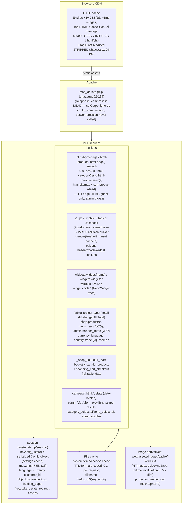

# 3-b-4 — Caching & Rendering Pipeline Deep Dive (Legacy Necoyoad + necoyoad-next)

Research agent: Explore-caching. Research-only — no repo modifications.
All file:line refs verified against source at `/home/z/necoyoad`.
Cross-referenced (not re-derived): `research/2-architecture.md` (boot chain, .htaccess A.1, dispatch internals, map.php), `research/3a2-widgets.md` (NecoWidget query engine, widget cache prefixes, F3 no-op invalidation), `research/3b1-templates.md` (Controller::render/fetch pipeline A.3, cacheId device suffixes, asset pipeline deps.php, minification), `research/3a1-events-hooks.md` (processcss filter + arg-clobber bug), `research/3a3-banners.md`, `research/3a4-menus.md` (menu_links cache), `research/3b2-eav.md` (property cache artifacts). This document is the **caching-domain authoritative deep-dive** and covers the rendering specifics NOT already in 3b1 (Response, Document, final assembly, script buckets, SEO URL layer).

Orientation source: `docs/architecture/necoyoad_architecture_blueprint_v3_rendering_pipeline.tex` (2,713 lines) — read for orientation; its cache claims re-verified; **one major pipeline behavior is missing from the blueprint and is documented here for the first time (see A.3, the `.pc` collision bucket — a real cross-controller cache-poisoning bug, proven by a production cache artifact shipped in the repo).**

---

## PART A — LEGACY CACHING CORE

### A.1 `system/library/cache.php` — the `Cache` class (127 lines), full analysis

`final class Cache` — a flat-file cache. One instance per request, registered in the Registry:
- storefront `app/shop/map.php:153` → `$registry->set('cache', new Cache())`
- admin `app/admin/map.php` (same pattern), cron `system/cron/cron.php:82,90`
- cache dir: `DIR_CACHE` = `system/temp/cache/` (`app/shop/config.php`, `system/config/config_custom.txt:89`, `config_shared.txt:84`)

**Constructor (lines 8–29):**
```php
$this->expire = 60*3600;                      // L14 — TTL = 216 000 s = 60 hours
$files = glob(realpath(DIR_CACHE) . "/" . '*.cache');   // L16 — GC sweep on EVERY request
foreach ($files as $file) {
    $time = substr(strrchr(str_replace('.cache', '', $file), '.'), 1);   // L20 — expiry stamp is IN the filename
    if ($time < time()) { if (file_exists($file)) unlink($file); }       // L22-26
}
```
- Creates `DIR_CACHE` (0755) if missing (L10-12).
- **TTL is hard-coded 60 h** — no per-entry TTL API at all; every `set()` uses the same expiry.
- **Garbage collection is request-time**: every HTTP request that instantiates `Cache` globs the whole cache dir and unlinks expired files. O(n) per request; also the *only* expiry enforcement — `get()` never checks the timestamp.
- Expiry parsing: filename minus `.cache`, text after the **last** dot = absolute expiry unix time. Filename anatomy (see `set()`): `<sanitizedPrefix>.<md5(key)>.<expiry>.cache` or `<md5(key)>.<expiry>.cache`. Since `sanitizeCacheId()` strips everything non-alphanumeric from the prefix and keys are md5 hex, the last dot is always the expiry separator — parsing is correct.

**`get($key, $prefix = "")` (L31-41):**
```php
if (!empty($prefix)) { $prefix = $this->sanitizeCacheId($prefix).'.'; }
$files = glob(realpath(DIR_CACHE) . "/" . $prefix . md5($key) . '*.cache');
if ($files) { return unserialize(file_get_contents($files[0])); }   // first glob match
```
- Lookup by **md5 of the full key string**, optionally namespaced by a sanitized prefix.
- `glob(... . md5($key) . '*')` — the trailing `*` swallows the expiry stamp; `files[0]` is the first alphabetical match (only one file per key exists because `set()` deletes first).
- Returns `unserialize()` of raw file bytes **without `allowed_classes`** → PHP object-injection surface if any file-write primitive exists (widget `style` editor, uploads). Widget settings are legitimately stored as `O:8:"stdClass"` inside cached trees (verified in artifacts, A.2).
- A torn/partial file (concurrent `fopen('w')` writer) makes `unserialize()` emit a warning (suppressed: `error_reporting(0)` in `web/index.php:6`) and return `false` → callers treat as miss and regenerate. Self-healing but silent.
- **No expiry check at read time** — an entry read during the same request it would expire is still served; the constructor GC is the only sweeper.

**`set($key, $value, $prefix = "")` (L43-56):**
```php
$this->delete($prefix, $key);                 // L45 — delete-first (same key), then write
$file = realpath(DIR_CACHE) . "/" . $prefix . md5($key) . '.' . (time() + $this->expire) . '.cache';
$handle = fopen($file, 'w'); fwrite($handle, serialize($value)); fclose($handle);
```
- Filename: `<sanitizedPrefix>.<md5(key)>.<now+216000>.cache`. Serialized payload = plain `serialize($value)` (the "quotes" handling people remember lives in the **DB layer**, not here: `NecoWidget::saveRow/saveCol` (widgets.php L735/L761) and `Model::__setProperty` (model.php L1421-1451) double-escape serialized strings `'` → `\'` when persisting to MySQL — cache files store whatever the model returned).
- **No locking / no atomic rename** — concurrent writers can interleave (torn reads above).
- Note the argument order asymmetry: `set($key, $value, $prefix)` but `delete($prefix, $key)`. `set()` calls `$this->delete($prefix, $key)` correctly (L45).

**`delete($prefix = "", $key = "")` (L58-71) — THE NO-OP BUG:**
```php
if (!empty($prefix)) { $prefix = $this->sanitizeCacheId($prefix) . '.'; }
$files = glob(realpath(DIR_CACHE) . "/" . $prefix . md5($key) . '*.cache');
foreach ($files as $file) { if (file_exists($file)) unlink($file); }
```
- Intended use: pass a prefix and delete "everything under it". Actual behavior: with only a prefix (`delete('widgets-rows')`), `$key` defaults to `''` → pattern `widgets-rows.` **`md5('')`** `= d41d8cd98f00b204e9800998ecf8427e` `*.cache` — **which matches nothing ever written** (real files are `<prefix>.<md5(fullKey)>`). Every prefix-style delete in the codebase is therefore a **silent no-op** (first documented in 3a2 F3; here extended to the complete caller inventory, A.5).
- Deletes only work when the caller passes the **exact full key** as 2nd arg (e.g. `Cart::removeCartCache()` does this correctly, cart.php L33-36).
- L70: `//$this->deleteFiles(DIR_IMAGE . 'cache', true);` — image-cache purge on delete is **commented out** (see A.8).

**`deleteFiles($directory, $recursive)` (L73-94):** recursive unlink/rmdir helper — only used by the admin cache-clear controller (via `rrmdir`, actually its own copy) — not wired to `delete()`.

**`sanitizeCacheId($cachedId)` (L96-126):**
- Device suffix: **only if `file_exists('browser.php')`** (relative path, L99) — `system/library/browser.php` is never in the CWD, so **in practice `$device` is always `''`** and prefixes get *no* device suffix (confirmed by the artifacts: `widgets-rows-0.…` not `widgets-rows-0-pc.…`).
- Transliterates accents, then `preg_replace('`[^a-z0-9]`i','-',…)` → **every non-alphanumeric char becomes `-`** (spaces, dots, slashes, underscores), collapses repeats, trims, lowercases.
- Concrete effects on real prefixes:
  - `"widgets.rows.0"` → `widgets-rows-0`
  - `"widgets.widgets.shop header error/not_found 0"` → `widgets-widgets-shop-header-error-not-found-0`
  - `"_shop_0000001_"` → `shop-0000001`
  - `"html-homepage"` → `html-homepage`

**Effective cache model:** namespaced md5-keyed immutable-for-60h file store with request-time GC, no tags, no prefix invalidation, no per-entry TTL, admin-bypass at the *consumer* level (`if (!$cached || (bool)$this->user->getId())` pattern) rather than in the cache itself.

---

### A.2 Production cache artifacts — `system/temp/cache/` (13 files, real production state)

All 13 files expire at unix **1762085776–1762085778 ≈ 2025-11-02**, i.e. written **2025-10-30** (expiry − 216 000 s). They are genuine artifacts of the production site **www.mudancer.com** (base href / `window.nt.http_home` inside the HTML artifact).

| File (prefix.md5.expiry.cache) | Size | md5 reverse-lookup / origin | Content |
|---|---|---|---|
| `1af0389838508d7016a9841eb6273962.1762085777.cache` | 537 B | **md5('currency')** → `ModelLocalisationCurrency::getCurrencies` (shop `model/localisation/currency.php:8,29`, no prefix) | `a:2:{s:3:"VEB";{currency row…}s:2:"es";{…}}` — 2 currencies (VEB id 2 value 1.0, 'es' id 4 value 5.0), keyed by code |
| `8512ae7d57b1396273f76fe6ed341a23.1762085777.cache` | 263 B | **md5('language')** → `ModelLocalisationLanguage::getLanguages` (`model/localisation/language.php:8,27`) | `a:1:{i:1;{language row: Español, es, es_ES.UTF-8, directory spanish}}` |
| `206392ad92d2fe1642dfa552d6393a3c.1762085778.cache` | 19 994 B | **md5('.pc')** → `Controller::render(true)` with `$this->cacheId === null` (see A.3) | `s:20492:"<!doctype html>…"` — **the complete rendered `error/not_found` page of mudancer.com** (full `<head>` with 10 stylesheet links + inline sticker-CSS + `window.nt.*` config, header widget row `widgetRow_69d653ecf0b7` with 3 columns (favicon image widget + 3 `link_button` widgets "Messages/Notifications/Account"), empty `#maincontent`, empty footer, copyright block, footer scripts incl. `moduleSearch()` JS) |
| `76cca8553d1a1ab009cd0dd6c637ba8c.1762085777.cache` | 6 B | unidentified no-prefix key (consistent with one of the **write-only `set()`** calls, A.5.3 — e.g. `menu_links`/`shop.manufacturers`/`store/search` returning zero rows) | `a:0:{}` (empty array) |
| `shop-0000001.140e27cda988bc1b3783a10fcc7cf421.1762085776.cache` | 6 B | prefix `shop-0000001` = sanitize(`"_shop_0000001_"`) → **`Cart::set('cart', [])`** (system/library/cart.php:40-47) | `a:0:{}` — **an empty guest shopping cart stored in the file cache** |
| `widgets-rows-0.bdfb249a6065541067ab0ee3be29dc5e.1762085777.cache` | 15 447 B | prefix `widgets.rows.error/not_found 0 0` (sanitize → `widgets-rows-0`) → `NecoWidget::getRows` full_tree (widgets.php:258-534) | `a:1:{i:0;{property_id 5022, object_type widget_rows, group header, key widgetRow_69d653ecf0b7, value = serialized a:29 settings (internal_name "Account Panel Header", show_in_mobile/tablet/desktop/facebook=on, sticky=1, layout_width=fixed, customer_session_mode=any, conditional_logic_action=hide, conditional_logic_when_route_contains "account, room", plus every `filter_*` variant)…` **with nested `columns` array (3 widget_cols property rows each with serialized a:30/a:34 settings incl. grid_large/medium/small, per-column `style` CSS text) each with nested `widgets` array (widget table rows: widget_id 1355, code ``, extension image, settings = `O:8:"stdClass":19:{…}` incl. route module/image, row_id, col_id)**}} — the complete header widget tree for the 404 page |
| `widgets-cols-0.bcc6c80349b6c214027ab331e6376234.1762085777.cache` | 9 655 B | `NecoWidget::getCols` (widgets.php:538-655) | `a:3:{…}` — the same 3 header columns as above, standalone (flat getCols cache: property rows + nested widgets) |
| `widgets-rows-0.{007fe3b2c8564407ec3662dffdd28476, 083f7b0107f4c068d3e728bc5f9a182a, b2492bb84469ae1430f32f3144778b77}.176208577x.cache` | 6 B ×3 | `getRows` for positions with no rows (featuredContent / main / footer of the 404 page) | `a:0:{}` |
| `widgets-widgets-shop-header-error-not-found-0.1d681a0b0513c8a9075f3c9f7d612edd.1762085777.cache` | 2 793 B | prefix `widgets.widgets.shop header error/not_found 0` → `NecoWidget::getWidgets` (widgets.php:149-256) | widget rows for one header column (the 3 `link_button` widgets, settings stdClass with empty hrefs) |
| `widgets-widgets-shop-header-error-not-found-0.302ced47b4ae45106d528d2752a70abb.1762085777.cache` | 6 B | `getWidgets` | `a:0:{}` (empty column) |
| `widgets-widgets-shop-header-error-not-found-0.ff319a529f0af1a9f34248fdcd312dae.1762085777.cache` | 938 B | `getWidgets` | the favicon `image` widget row |

Notes: the `widgets-*` filenames confirm the **space-separated prefixes** built by NecoWidget (`"widgets.rows.$app? $landing_page $store_id $object_type? $object_id"`) slugged by `sanitizeCacheId` into `-`; widget instance settings are stored as **stdClass** (admin widget form persists stdClass — matches 3a2 §A.4); row/column settings are **associative arrays** with a mirrored `filter_*` key for every setting (the LIKE-engine convention).

---

### A.3 `Controller::render()` caching and the `.pc` collision bucket — systemic cache poisoning (NEW finding)

`system/engine/controller.php:203-316` (render pipeline itself documented in 3b1 §A.3.1; here only the **cache semantics**):

1. **Key decoration (L216-234):**
```php
$device = '.mobile'|'.tablet'|'.facebook'|'.pc';   // from registry 'browser'
$this->cacheId .= $device;                         // L228 — APPENDS even when $this->cacheId is NULL!
$customerLogged = $customer->isLogged();           // L232 — Customer::isLogged() returns $this->customer_id (customer.php:401-403): null for guests, int id when logged
$this->cacheId .= $customerLogged;                 // L234 — '.pc'.null === '.pc'; '.pc'.123 === '.pc123'
```
**Consequence:** every controller that never sets `$this->cacheId` (declared `protected $cacheId = null;` at controller.php:15) ends up with cacheId **`'.pc'` (guest)**, **`'.pc<customer_id>'` (logged-in)**, or the `.mobile/.tablet/.facebook` variants — *shared across the entire application*.

2. **Lookup (L236-238):** performed whenever cacheId is non-empty AND the admin user is not logged in:
```php
$cached = $cache->get($this->cacheId, substr($this->cacheId, 0, strpos($this->cacheId, '.')));
```
For `.pc` the prefix is `substr('.pc', 0, 0) = ''` → **no prefix**, key `.pc` → file `md5('.pc').<expiry>.cache`.

3. **Write-back (L301-305): only `if ($return)`** — i.e. only controllers invoking `$this->render(true)` write cache; `render()` (no arg) is **lookup-only**.

**The bug combines three facts:**
- **Writers** — controllers calling `render(true)` *without* setting a cacheId write their FULL rendered output into the single shared bucket:
  - `error/not_found.php:43` (index), `content/page.php:211` (error404), `content/post.php:137` (error path), `content/category.php:82` (category index — no cacheId at all!) and `:114` (error404), `store/category.php:146` (error404), `store/product.php:232` (product error), `store/manufacturer.php:143` (error404), `content/page.php:172` (`embed()` return — actually embed *does* set cacheId at L168-170, so it writes `html-page-embed` only),
  - **every `account/*` page** (`login:112`, `register:225`, `edit:134`, `address:128/324`, `history:175`, `invoice:251`, `download:123`, `forgotten:142`, `success:66`, `newsletter:75`, `password:107`, `logout:75`, `account:58`, `message`, `balance`, `payment` …),
  - `common/maintenance.php:34`, `common/header.php:288` (`getLanguages`) and `:313` (`getCurrencies`) — these two write tiny dropdown fragments into the same bucket,
  - `module/modulecontroller.php:242` (async JSON path) and `:277` (theme-editor placeholder path) — widget HTML fragments,
  - `checkout` and `payment/*` render() variants are lookup-only (`$this->render();` — no write).
- **Readers** — the layout children render via plain `render()` (lookup-only) with the *same* null cacheId: `common/header.php:262`, `common/footer.php:141`, `common/column_left.php:17`, `common/column_right.php:16`, and `modulecontroller.php:270` (sync widget render). On **every guest page view** the header, footer, columns and every sync widget module do `Cache::get('.pc')`.
- **Poisoning:** last writer wins. Sequence on production (proven by artifact A.2): a guest hits a missing URL → `error/not_found::render(true)` caches the **entire 404 page** under `.pc` (file `206392ad…` = md5('.pc')). The next guest visiting **any** page gets the header child replaced by the *whole 404 page HTML* (the child lookup hits), and any widget rendered through `modulecontroller` likewise. The corrupted content persists **60 hours** (or until another `render(true)`-no-cacheId call overwrites the bucket — e.g. a login page view replaces it with the login form).

Additional poison vectors: `common/header::getLanguages/getCurrencies` (AJAX) cache dropdown fragments; async widget requests cache widget HTML under `.pc` — any of these fragments can later be served as "the header".
This also explains guest-vs-logged fragmentation: buckets `.pc`, `.pc1`…`.pcN` (per customer id), `.mobile`, `.tablet`, `.facebook` (+ id variants) — up to 8× (#customers+1) shared slots, each a mix of arbitrary fragments.

**Blueprint gap:** blueprint v3 documents the cache key as `cacheId + device + logged` (tex L551-566) but never mentions the null-cacheId case or the shared bucket; its §"Cache is Bypassed for Admins" (L2516+) is confirmed (lookup gated by `!$user->islogged()`, L236).

### A.3.1 Page-level HTML caches that DO work (named cacheIds)

Controllers that set `$this->cacheId` before `render(true)` get a **namespaced full-page cache** (prefix = substring before the first `.` of the cacheId). These are the functioning legacy "full-page caches" for guests:

| Controller / method | cacheId pattern (file:line) | Fast-path `get()` | render-level cache |
|---|---|---|---|
| `common/home::index` | `html-homepage.{lang_id}.{hl}.{cc}.{customer_id}.{currency}.{store_id}` (home.php:13-19; cacheId set L44-46 only if not admin) | L21 `get($cacheId)` **without prefix → NEVER HITS** (render writes `html-homepage.<md5(decorated)>`) | ✅ works (guest-only write) |
| `content/page::index` | `html-page.{page_id}{lang}…` (page.php:12-19, 109-111) | L81 no-prefix → dead | ✅ |
| `content/page::embed` | `html-page-embed.{page_id}…` (page.php:129-136, 168-170) | L143 no-prefix → dead | ✅ (fragment: `only:` widget positions, no header/footer children) |
| `content/post::index` / `all` | `html-post.{post_id}…` / `html-posts.{…}` (post.php:11-18/90, 168-175/198) | L53/L180 dead | ✅ |
| `content/category::index/all` | `html-post_categories.…` (category.php:143-151, 168) | L152 dead | ✅ |
| `store/category::index/all` | `html-category.…` / `html-categories.…` (store/category.php:44-51/92, 175-183/200) | L71/184 dead | ✅ |
| `store/product::index` | `html-product.{product_id}{lang}.{hl}.{cc}.{cust}.{currency}.{store}` (product.php:23-30, 165-177; `?np` lets even admins see cache, L50) | L48 dead | ✅ |
| `store/product::all` | `html-products.{serialize($_GET)}…` (product.php:236-243, 282-284) | L245 dead | ✅ |
| `store/product::quickviewjson` | `json-product.{product_id}…` (product.php:411-418) — **cacheId assigned at L589 AFTER the only `render(true)` (L585) → never written; fast-path get (L429) never hits ⇒ dead cache** | dead | ❌ (dead code) |
| `store/manufacturer::index/all` | `html-manufacturer.…` / `html-manufacturers.…` (manufacturer.php:33-39/79, 172-179/197) | L54/181 dead | ✅ |
| `page/sitemap::index` | `html-sitemap.…` (sitemap.php:10-18) | L18 no-prefix dead | ✅ (set at L~100 if guest) |

**Fast-path dead code pattern:** every page controller does an early `Cache::get($cacheId)` (no prefix) *before* rendering, but `Controller::render()` writes with prefix `'html-…'` and the *decorated* key — so the fast path can never hit; the effective cache is the render-internal one (which still skips asset loading, children and fetch on hit — controller.php L240 `if (!isset($cached))`). Net effect: the early gets are wasted glob() calls, not correctness bugs.

**Cache-hit bypass rules:** all page caches are **skipped for logged-in admins** (`$user->isLogged()`), and the *write* is additionally conditioned on the same check in most controllers (home.php L44, product.php L588, etc.). Logged-in *customers* ARE cached (customer_id in the key). `?np` (product) forces cache read even for admins.

---

### A.4 Complete cache-consumer catalog (key patterns, TTL, invalidation, admin bypass)

TTL is **always 60 h** (A.1); "admin bypass" = cache read skipped when `$this->user->getId()`/`isLogged()` is truthy. "No-op delete" = A.1 delete bug. **W/O** = *write-only* cache (get uses prefix, set omits it → never hit; pollutes bare-md5 files).

**A.4.1 Page HTML / fragment caches** — see A.3.1 table plus the shared `.pc` bucket (A.3).

**A.4.2 Model base class (`system/engine/model.php`) — the generic entity cache:**
```php
// getAll (L736-769):
$cache_prefix = "{$this->table}-{$this->object_type}";                       // L737
$cachedId = $cache_prefix . (int)STORE_ID . "_" . serialize($data)          // L738-745
          . config_language_id . "." . request('hl') . "." . request('cc') . "."
          . config_currency . "." . (int)config_store_id;
$cached = $this->cache->get($cachedId, $cache_prefix);                      // L747
if (!$cached || (bool)$this->user->getId()) { …query…; $this->cache->set($cachedId, $result, $cache_prefix); }  // L748-764
// getAllTotal (L784-805): identical with prefix "{$table}-{$object_type}-total", caches the COUNT.
```
- Key = `table-object_type` + STORE_ID + serialized criteria + language + hl + cc + currency + store — i.e. **cached per criteria array, per store, per language, per currency, per ?hl/?cc query params**.
- Admin bypass: yes (L748/L796). Invalidation: `add()`/`update()` purge `"$this->table-$this->object_type"` (L334, L427 — **prefix-only delete ⇒ NO-OP**); `delete()` purges `$this->object_type` (L581 — **no-op**). So base-model caches live 60 h regardless of edits.
- Used by every entity model that doesn't override (products, categories, pages, posts, banners, manufacturers, orders grid in admin, etc.).

**A.4.3 Storefront model custom caches (key patterns verified):**

| Model | Prefix | Key composition | Set with prefix? | Invalidation |
|---|---|---|---|---|
| `shop/model/store/product.php:130-205` | `shop.products` / `shop.products.total` | prefix + STORE_ID + `serialize($data)` + lang.hl.cc + **`customer->getId()`** + currency + store | ✅ | none (no delete calls) |
| `shop/model/store/manufacturer.php:28-68` | `shop.manufacturers(-total)` | same pattern | ❌ set L42/L68 without prefix → **W/O** | none |
| `shop/model/store/search.php:35-654` (5 methods) | `shop.search…` | same pattern | ❌ (L145/275/397/529/651) → **W/O** | none |
| `shop/model/store/attribute.php:37-208` | `shop.attributes…` | same | ❌ (L51/75/184/208) → **W/O** | none |
| `shop/model/store/review.php:128-208` | `shop.reviews…` | same | mixed (L151 ✅, L179/208 ❌) | none |
| `shop/model/content/menu.php:26-97` | `menu_links` / `menu_links.total` | prefix + STORE_ID + serialize(data) + lang.hl.cc.currency.store (includes per-link url_alias keyword + EAV icon/class_css/descriptions — N+1 built into the cached payload) | ❌ (L67/L91) → **W/O** (menu cache NEVER works; every menu render re-queries) | model save → `Cache::delete('menu_links')`-style calls are no-ops |
| `shop/model/style/theme.php:49-81` | (no prefix) | `theme.all.active.for.store.{STORE_ID}` / `theme.{id}.active.for.store.{STORE_ID}` | n/a (no prefix at all — bare md5 files) | none |
| `shop/model/localisation/currency.php:7-33` | none | `currency` | n/a | admin currency save → `cache->delete('currency')` (admin/model/localisation/currency.php:85) = **no-op** → rate changes invisible for 60 h |
| `shop/model/localisation/language.php:8-27` | none | `language` | n/a | admin language save → `delete(str_replace('_description','',$table))` (admin/model/localisation/language.php:80/94) = **no-op** |
| `shop/model/localisation/country.php:10-17` | none | `country` | n/a | none |
| `shop/model/localisation/zone.php:12-25` | none | `zone.{country_id}` | n/a | none |

**A.4.4 NecoWidget (`system/helper/widgets.php`)** — cache prefixes use **spaces**, slugged to `-` by sanitizeCacheId; bypass when admin logged in (`(bool)$this->user->getId()`); `useCache` 2nd arg additionally controlled by `Controller::loadWidgets` (cache only when NOT admin — controller.php L512):

| Method | Prefix (raw) | Key | Lines |
|---|---|---|---|
| `getWidget($name)` | `widgets.widget.{name}` | prefix + `.` + STORE_ID + `_` + config_store_id | 123-147 |
| `getWidgets($position)` | `widgets.widgets.{app} {position} {landing_page} {store_id} {object_type} {object_id}` | prefix + `.` + STORE_ID + `_` + serialize($data) + store_id | 149-256 (artifacts: `widgets-widgets-shop-header-error-not-found-0.*`) |
| `getRows($data)` | `widgets.rows.[{app} ]{landing_page} {store_id} [{object_type} ][{object_id}]` | prefix + `.` + STORE_ID + `_` + serialize($data) + config_store_id | 258-534 (artifact: `widgets-rows-0.*`, contains full nested tree rows→cols→widgets) |
| `getCols($data)` | `widgets.cols.…` (same shape) | same | 538-655 (artifact: `widgets-cols-0.*`) |
| `save()/saveRow()/saveCol()` | delete `widgets.widgets.{prefix}` / `widgets.rows.{prefix}` / `widgets.cols.{prefix}` | — | 707-716, 743, 769-770 — **all no-ops** |

**A.4.5 Admin widget/layout caches (`app/admin/model/style/widget.php`):**
- `getWidget($widget_id)` L157-169: key = prefix = `widgets.widget.{widget_id}` (set ✅ with prefix).
- `getWidgets`-equivalent L182-199: prefix `admin.widgets…`, **set L199 without prefix → W/O**.
- Row/col tree caches L227/L323/L425/L538 (get with `$cache_prefix`) — sets at L393/L512/L625 ✅/❌ mixed.
- Deletes: `'widgets'` (L72/102/131), `'admin-widgets-widgets'` (L73), `'widgets-widgets'` (L146/743), `'widgets-rows'`/`'widgets-cols'` (L744-745, 765, 785-786) — **all prefix-only ⇒ no-ops**.
- `app/admin/controller/module/widgetcontroller.php:326-329` and `widget_common.php:21-24` delete `widgets-rows|widgets-cols|widgets-widgets|widgets-widget-{name}` — **no-ops**.

**A.4.6 Banner caches:** storefront banner widget reads via the `module:settings` filter (no dedicated storefront cache); admin listing caches `admin.banner_items` / `admin.banner_items.total` (`admin/model/content/banner.php:195-239`) — **set L217/L239 without prefix → W/O**.

**A.4.7 Cart & checkout caches (`system/library/cart.php`):**
- **The cart itself lives in the FILE CACHE, not the session**: `Cart::get/set` (L38-48) → key `<customer_id|session_id>_shop_{C_CODE}_<k>`, prefix `_shop_{C_CODE}_` (sanitized `shop-0000001`) → cart contents survive 60 h / session loss; one cache file per visitor key `cart` (artifact `shop-0000001.…` = `a:0:{}`).
- Product-lines cache: `cacheNameForData = "cart.{id}.products"` (L18) — `getProducts()` L65-67 returns cached fully-hydrated lines; set L219.
- Checkout table cache: `cacheNameForDatable = "shopping_cart_checkout.{id}.table_data"` (L17), read/written by `module/shopping_cart_checkout.php:60-101` (key = prefix = `shopping_cart_checkout.{customer_id|session_id}.table_data`).
- Invalidation — the ONLY correct deletes in the app: `removeCartCache()` (cart.php L33-36) passes the full key as 2nd arg; called from `add/update/remove/clear/setMinQty` (L226/248/265/276/304).
- Side effect: **admin "clear cache" (`setting/cache/deletefilecache`) destroys every visitor's cart.**

**A.4.8 Search-flow caches:** `store/search.php:93-96` caches `products_searched`, `total_products_searched`, `criteria_products_searched`, `url_products_searched` (no prefix, 60 h — stale search results for guests); consumed by `module/product_list.php:77-108` and `module/rooms_admin_table.php:74-105`. `module/search.php:38-68` caches rendered `<select>` HTML under keys `category_select.tpl` / `zone_select.tpl` (no prefix).

**A.4.9 Campaign caches (cross-request mail-merge):** shop `marketing/campaign.php:101` `campaign.html.{campaign_id}`; admin `marketing/campaign.php:151-152` (`campaign.html.temp`, `campaign.data.temp` — serialize()d payload), L772-836 per-contact `campaign.html.{campaign_id}.{contact_id}`; consumed by `system/cron/api/send.php:270-272` and `update.php:100-102`.

**A.4.10 Admin stats caches (date-rotated):** `admin/model/stats/order.php` + `traffic.php` — keys like `admin.orders.stats.hs.all.{object_id}.{object}.{start}.{end}.{store}.{date('d.m.Y')}` (order.php L4-10): **the trailing current-date component rotates the key daily**, a hand-rolled workaround for the lack of invalidation (each day gets a fresh 60 h cache). ~20 methods follow this pattern.

**A.4.11 Admin form-data caches (persist big option lists between requests):** `admin/controller/store/store.php:956-1495` — `products|categories|manufacturers|pages|posts|post_categories|banners|downloads|coupons|bank_accounts|customers|menus .for.store.form.{store_id}` (values stored `serialize()`d, i.e. double-serialized in cache); `style/theme.php:997-1003` `products.for.theme.form`; `store/product.php:1058-1063` `products.for.product.form`; `sale/coupon.php:708-713` `products.for.coupon.form`. No invalidation (60 h staleness of admin pick-lists after content edits).

**A.4.12 `admin/model/object.php` (ModelObject property cache):** L181/190/194 — per-`object_type.key` prefix; the getter has the **missing-return bug** (L190; documented in 3b2) so the cache is effectively write-only here too.

**A.4.13 API cache:** `admin/controller/api/v1.0.0/files.php:48/119/136` — `admin.api.files…`-style keys (set L119 with prefix; L149 commented out).

**A.4.14 Session-backed "cache":** `ntConfig_{STORE_ID}` — see A.6.

---

### A.5 Cache invalidation surfaces (what clears what)

**A.5.1 Admin cache manager (`app/admin/controller/setting/cache.php`):**
- `index()` L21-23: `echo 'build cache manager';` — **placeholder, never built** (nav link "Manage Cache" → `setting/cache`, `admin/view/templates/default/common/nav.tpl:600`).
- `deletefilecache()` L30-57 — the real "clear all": `rrmdir(DIR_CACHE)` (L32, recursive unlink of every file in `system/temp/cache/`, L65-81), then clears the session config cache for store 0 + every store (`ntConfig_0`, `ntConfig_{store_id}`, L35-38) and session `language` + `fkey` (L40-41), sets a flash message, redirects back (HTTP_REFERER). Exposed from the admin header button (`admin/…/common/header.tpl:65`).
- Effects: nukes **all** subsystems at once — page HTML, widgets, model caches, **all visitor carts (A.4.7)**, campaign temp bodies, admin pick-lists. The only guaranteed-fresh start.

**A.5.2 Model save/delete purges (all no-ops):**

| Site | Call | Why it fails |
|---|---|---|
| `system/engine/model.php:334` (add), `:427` (update) | `delete("{$table}-{$object_type}")` | prefix-only → md5('') glob |
| `system/engine/model.php:581` (delete) | `delete($this->object_type)` | same |
| `shop/model/checkout/order.php:222` | `delete('product')` after checkout | no-op |
| `admin/model/store/product.php:209-210/233-234` | `delete('product')`, `delete('products')` | no-op |
| `admin/model/store/store.php:201` | `delete('store')` | no-op |
| `admin/model/localisation/currency.php:85`, `language.php:80/94` | `delete('currency')`, `delete(<table>)` | no-op |
| NecoWidget save/saveRow/saveCol, admin widget model + widgetcontroller (A.4.4/A.4.5) | `delete('widgets-rows'…)` | no-op |
| `admin/model/style/widget.php:743-745` etc. | `delete("widgets-widgets")`… | no-op |

**Net effect: there is NO working targeted invalidation anywhere.** Freshness is achieved only via: (1) 60 h TTL + per-request GC, (2) admin users bypassing reads, (3) same-key `set()` overwrite (delete-first inside `set()` uses the full key — works), (4) date-rotated keys (stats), (5) manual full purge (A.5.1).

**A.5.3 Write-only caches (get/set prefix mismatch):** manufacturer/search/attribute/review (shop), menu links (shop + admin), banner items (admin), admin widget list, admin theme styles (`admin/model/style/theme.php:199/205`) — `get($cachedId, $cache_prefix)` but `set($cachedId, …)` without prefix. The written bare-md5 file can never be found by the prefixed get. Pure overhead + cache-dir pollution (explains the unidentified `76cca855…` `a:0:{}` artifact).

---

### A.6 Session subsystem (`system/library/session.php`, 97 lines)

**Constructor (L7-28):**
- If the configured `session.save_path` isn't writable → `ini_set('session.save_path', realpath(DIR_SESSION))` with `DIR_SESSION = system/temp/session/` (mkdir 0755). Throws if still unwritable (L23-25).
- Sends an extra cookie **`nts_token=<mt_rand()>`** — a random value, *not* the session id — with `expires=Tue, 06-Jan-<Y+1> 23:39:49 GMT` (hard-coded Reyes-Magos date), `path=/`, `domain=.<parent domain>` (substr from the first dot of SERVER_NAME, L15).
- `session.cookie_domain` = parent domain (L18); `session_set_cookie_params(0, '/', parentDomain, true /*secure*/, true /*httponly**)` (L19) → the PHP session cookie is shared across all subdomains/stores of a tenant.
- `$this->data =& $_SESSION` (L27).

**API:** keys are transparently prefixed with `C_CODE . '_'` (`0000001_`) (L43/55/…). `has()` uses `!empty()` (L69-78) — **falsy session values (0, '', '0') read as absent**. `get($key, $subkey, $skey)` supports 2-level array access. `clear($key)` L86-95: with no key does `unset($this->data)` — **unbinds the property reference, does NOT clear $_SESSION** (bug); subkey clear works.

**What lives in the session** (storefront, verified call sites):
- `ntConfig_{store_id}` — **serialized whole `Config` object** = the settings cache: `map.php:47-55` loads `setting` rows only when absent, else `unserialize(session)`; written back at `map.php:323` (`serialize($config)`). Consequences: settings snapshot per browser session; **admin setting edits do NOT reach visitors until their session ends or admin cache-clear runs**; `config_store_id` re-set after restore (L55).
- `language` (map.php:108-110 + common/header.php:37 on `?hl=`), `currency` (Currency library), `customer_id` + customer profile fields (Customer library), `token`, `state` (CSRF-ish random per request — header.php:59/253, login.php:84), `fkey` (map.php:31-43 CSRF token: `md5(REMOTE_ADDR) . "." . 11×md5(mt_rand) . "_" . strtotime(date('d-m-Y'))`), `redirect` (post-login target), `landing_page` / `object_type` / `object_id` (**the widget-context protocol** — set by every page controller e.g. product.php:20-21, page.php:62-63/151-152, cleared on home/sitemap/404; consumed by `NecoWidget` per-object trees and by `Controller::loadWidgets` per-object override, controller.php:569-629), `success`/`error` flashes, `ref_email`/`ref_cid`/referral data (map.php:177-183), `payment_methods`/`payment_method` (cleared in checkout widget L45-46), `user_id`/`ukey` on admin.
- **Cart is NOT in the session** — it's in the file cache (A.4.7).

---

### A.7 HTTP-level caching & response compression

**A.7.1 `.htaccess` (repo root) — browser/CDN cache policy (verified lines; cross-ref 2-architecture A.1):**

| Mechanism | Lines | Value |
|---|---|---|
| `mod_expires` default | 147-149 | `access plus 1 month` |
| HTML / XML / JSON / cache-manifest | 150-154 | `+0 seconds` (never cached) |
| RSS/Atom | 155-156 | `+1 hour` |
| favicon | 157 | `+1 week` |
| images (gif/png/jpg/jpeg), video/audio, fonts (ttf/otf/woff/svg/eot), text/x-component | 158-171 | `+1 month` |
| **CSS / JS** | 172-173 | **`+1 year`** |
| `Cache-Control` via mod_headers | 176-192 | images `max-age=2592000 public`; **CSS `max-age=604800 public`** (1 week — contradicts the 1-year Expires!); **JS `max-age=216000 public`** (2.5 days); xml/txt `216000 must-revalidate`; **html/php `max-age=1 private must-revalidate`** |
| **ETag/Last-Modified stripped** | 194-199 | `Header unset ETag`, `Header unset Last-Modified`, `FileETag None` → **no conditional revalidation at all; clients must fully re-fetch or trust the clock-based max-age** |
| `mod_deflate` | 52-134 | per-content-type DEFLATE for html/css/js/json/xml/svg/fonts (+ legacy mod_gzip 136-145) |
| misc | 1-7 / 9-23 / 232-233 | `X-UA-Compatible IE=Edge,chrome=1`; CORS `*` for images/fonts; UTF-8 charset |

Note the internal inconsistency: `ExpiresByType text/css +1 year` vs `Header set Cache-Control max-age=604800` on `.css` — modern browsers prefer Cache-Control (1 week) but some proxies combine them.

**A.7.2 `Response` class compression is DEAD CODE:**
```php
public function setOutput($output) { $this->output = $output; }     // response.php:20-22 — ONE parameter!
```
Every controller calls `$this->response->setOutput($html, $this->config->get('config_compression'))` — the **second argument is silently discarded** (PHP permits extra args to methods), `$this->level` stays `0`, and `output()` (L54-68) only calls `compress()` `if ($this->level)` (L55). `setCompression($level)` (L16-18) is **never called anywhere in the app** (only inside the class itself). Therefore the entire `compress()` path — `gzencode($data, $level)` with `Content-Encoding: gzip|x-gzip` (L24-52, requires `HTTP_ACCEPT_ENCODING`, zlib ext, `!headers_sent()`, `!connection_status()`) — **never executes**. The `config_compression` setting is decorative; response compression happens exclusively in Apache `mod_deflate` (A.7.1). (The class also predates `Content-Length` concerns — none is ever set; no benchmark/debug output is attached to responses — that role belongs to `Log`/`NTS_DEBUG_MODE` trace, not Response.)

**A.7.3 Per-endpoint headers:** `map.php:60` sets `Content-Type: text/html; charset=utf-8` on every storefront response; `error/not_found.php:10` adds the raw `…/1.1 404 Not Found` header; `system/library/json.php:10-11` sends `Cache-Control: no-cache, must-revalidate` + `Pragma: no-cache` for JSON/AJAX; `common/home::getimage` (home.php:58-86) sends `Cache-Control: no-cache` + streams the image with `readfile()` — **and has a bug: it computes `NTImage::resizeAndSave($image,$width,$height)` (L74) but then streams the ORIGINAL file (L82), so the resized derivative is generated and thrown away** and the endpoint always returns the full-size original.

---

### A.8 Image pipeline caching (`system/library/image.php`, 320 lines)

- `Image` (L3-266): GD wrapper — `create()` (gif/png/jpeg only), `resize($w,$h)` (L75-122) = **letterbox**: `imagecreatetruecolor(w,h)`, background fill with `IMAGE_BG_COLOR_R/G/B` (constants injected in `map.php:186-197` from `config_image_bg_color_*`, default 255), `imagecopyresampled` centered (scale = min ratio). PNG keeps alpha (L106-110). `save($file,$quality=100)` — jpeg uses quality, **png always quality 0 (lossless), gif default**; `imagedestroy`. Extras: `watermark()` (L160-205 — positions center/topleft/topright/bottomleft/bottomright, saves at quality 70; **bug: checks `isset($path)` but `$path` is not a parameter — watermark file always resolves under `DIR_IMAGE`**), `crop()` (L207-216), `rotate()` (L218-225), private `filter/text/merge` helpers.
- `NTImage` (L268-319): static facade — `setWatermark($file,$position)` sets static `$watermark/$position` (used by `module/product_images.php:42`); `resizeAndSave($filename,$width,$height,$path=null)`:
  - Derivative path: **`cache/<name-without-ext>-<W>x<H>.<ext>`** under `DIR_IMAGE` (= `web/assets/images/`, a PUBLIC dir) (L137/L291).
  - **Cache check = file existence + mtime**: regenerate only if missing or `filemtime(source) > filemtime(derivative)` (L139/L293) — source edits auto-invalidate; no TTL.
  - Creates nested dirs with **0777** (L148/L302); returns `HTTP_IMAGE . $new_image` (public URL).
  - Missing source falls back to `no_image.jpg` (NTImage L285-287; `Image::resizeAndSave` just returns).
- Browser caching of derivatives is handled by `.htaccess` (+1 month, A.7.1). Server-side purge of the derivative dir is **commented out** in `Cache::delete` (cache.php L70) — the only deletion path is manual.
- `system/library/upload.php` (blueimp jQuery-File-Upload server class): uploads to `DIR_UPLOAD` (`web/assets/upload/`); no caching involved (only `clearstatcache()` internal calls).

---

## PART B — LEGACY RENDERING PIPELINE (the parts NOT covered by 3b1)

### B.1 `Response` (`system/library/response.php`, 69 lines)

State: `$headers[]`, `$level = 0`, `$output`. API:
- `addHeader($header)` L7-9 — string bag; emitted by `output()` with `header($h, true)` (replace mode) when `!headers_sent()` (L61-65).
- `redirect($url)` L11-14 — raw `header('Location: …') + exit` (the richer `Controller::redirect` at controller.php:160-176 with its `redirect` hook and JS fallback is what controllers actually use).
- `setCompression`/`setOutput`/`compress`/`output` — see A.7.2. `output()` is the terminal call in every entry point (`web/index.php:85`).
- No status-code management beyond raw headers, no cookies, no caching headers, no benchmark output.

### B.2 `Document` (`system/library/document.php`, 113 lines)

Plain mutable DTO for page metadata: `title, description, keywords, base, charset('utf-8'), language('es-ve' default), direction('ltr'), links[], styles[], scripts[], breadcrumbs[]` with getters/setters (`setTitle` L15, `setDescription` L23, `setKeywords` L31, `setBase` L39, `setCharset` L47, `setLanguage` L55, `setDirection` L63) and accumulators `addLink($href,$rel)` L71-76, `addStyle($href,$rel='stylesheet',$media='screen')` L82-88, `addScript($script)` L94-96, `addBreadcrumb($text,$href,$separator=' &gt; ')` L102-108.
**Consumption reality:** storefront templates read the *properties* (`$this->document->title/description/keywords/breadcrumbs` are copied into `$this->data` by page controllers; header.tpl renders `$title/$keywords/$description` L14-23). The `links/styles/scripts` accumulators are **almost unused** — only the ADMIN bootstrap pushes into them (`app/admin/map.php:75-77` fancybox css/js); the storefront asset pipeline bypasses Document entirely in favor of Registry accumulators (`javascripts`, `header_javascripts`, `styles`, `css`, `scripts` — map.php:136/148/319-321 + Controller `__set` magic). `base`/`charset`/`language`/`direction` are never read by the choroni templates (charset is hard-coded `<meta charset="UTF-8">`, header.tpl:13; `<base href>` hard-coded, L11).

### B.3 Final page assembly order, script buckets, inline CSS

**Assembly order (per rendered page, e.g. `common/home`)** — for the full render/fetch internals see 3b1 §A.3; here the *sequence* and the *output sinks*:

1. `Front::dispatch` runs pre-actions (maintenance → seo_url decode) then the routed controller.
2. Page controller `index()`: tracker, session widget-context (`object_type/object_id/landing_page`), cache fast-path get (dead, A.3.1), `document->title/…`, `loadWidgets(position)` ×3-7 (fills `data['rows'][position]`, Registry `css[<rowOrColKey>]` with `/**{key}**/…/** /{key}**/` markers, `$this->children`/`$this->widget` merges), `addChild(common/column_left|column_right|header|footer)`, optional `$this->cacheId`, template resolution (EAV `style/view` property → `default_view_*` setting → fallback `.tpl`, under active theme else `choroni/`), `response->setOutput(render(true), config_compression)`.
3. `render(true)`: hook short-circuit → cacheId decoration + cache lookup (guests) → `loadAssets(ClassName)` + `loadAssets(Route)` (per-route CSS/JS, dedup via Registry `assetLoaded`) → **children loop** (column_left, column_right, header, footer — each child controller's `index()` runs, internally: its own `loadWidgets('header'|'footer'|…)` (header.php:158/footer.php:104), `loadCss()`/`loadJs()`, then **`render()` (lookup-only, see A.3)**; output captured into `$this->data['header'|'footer'|'column_left'|'column_right']` by `$controller->id`) → `fetch($tpl)` → cache write-back.
4. `fetch()`: hook → path resolve → inject `$Config/$Language/$l/$Request/$Url/$Image/$is_admin` + class-specific specials (`ControllerCommonHeader` → `__loadCss()` + `header_javascripts`; `ControllerCommonFooter` → `javascripts`) → `extract($this->data)` → `require` template → `` token substitution (2 passes) → HTML post-processing (strip `/* */` comments; buggy literal `"\n{2,}"` collapse; **`config_minified_html` + `defined('STORE_ID')`** newline/whitespace strip — storefront-only minify) → `render` filter → return.
5. `Response::output()` — headers + echo (no compression, A.7.2); Apache deflates.

**Template-side sinks:**
- `common/header.tpl` — `<head>`: opengraph, `<base>`, charset, `$title/$keywords/$description`, favicon, Google font, **`$styles` external links (L34-39)**, **inline `<style><?php echo $css; ?></style>` (L41)** (per-route + per-row/col + `custom-{theme_id}-{tpl}.css` from the theme editor), `header-start` fragment, `window.nt.*` JS config (L45-79). Body opens `#mainContainer` + renders the `header` widget position via `shared/widgets-rows.tpl` (L94-95).
- `common/footer.tpl` — renders the `footer` widget position, `#copyright` (`$text_powered_by`), then **`shared/fragment/footer-start.tpl`** (L25) which closes the page.
- **Script buckets (`footer-start.tpl` + `ControllerCommonFooter`):** the Registry `scripts` array holds entries `['id'=>…, 'method'=>…, 'script'=>…]`; footer.php L84-124 buckets them:
  - `method='function'` → raw `<script> … </script>` (e.g. the hard-coded `moduleSearch()/moduleSearchFilters()` search helpers, footer.php:25-81),
  - `'script'`/other raw → `$s_output` echoed as-is,
  - `'ready'` (default) → wrapped `<script> $(function(){ … }); </script>`,
  - `'window'` → wrapped `<script> (function($){ $(window).load(function(){ … }); })(jQuery); </script>`.
  All concatenated into `$this->data['scripts']` (L120-124). footer-start.tpl then emits: external `$javascripts` `<script src>` tags (L1-3), the bucketed `$scripts` inline block (L4), **late CSS injection via jQuery** — `$styles` appended as `<link>` inside `$(function(){…})` (L6-14) and inline `$css` appended as `<style>` via jQuery (L16-22) — the "async CSS" pattern (styles land in `<head>` at runtime), plus `$().UItoTop()` init (L24-28).
- **Inline-mode toggles:** `config_render_js_in_file` / `config_render_css_in_file` swap external URLs for `file_get_contents()` inlining — footer.php:109-118 (JS inlined into `$scripts`), header `loadJs()` header.php:316-332, `_loadAssets`/`__loadCss` (controller.php:795-811/401-451, incl. the **L798 `processcss` bug**: `$_css = $this->applyFilters("processcss", $cssFolder, $filename, $template)` throws away the just-read file contents and — combined with the Hooks arg-clobber quirk (3a1) — returns the CSS *folder path* as inline CSS). The default `processcss` filter is a registered no-op (startup.php:148-150). `loadcss` filter: controller.php:437; `loadstyles`/`loadjavascripts` filters: 813-817.
- `common/header.php` `__loadCss()` (controller.php:401-451) also rewrites relative URLs inside inlined CSS (`../../../images/` → `HTTP_IMAGE`, `../images/` → theme images, `../fonts/` → theme fonts) and appends the visual-editor's `custom-<theme_id>-<tpl>.css` (header.php:358-368).

### B.4 SEO URL layer (decode + encode, `url_alias`)

**Decode — pre-action `common/seo_url` (`app/shop/controller/common/seo_url.php`, 148 lines; active when `config_seo_url`):** `api/{live,google,twitter,facebook,meli}` forwarded with parsed query (L7-17); `buscar/…`/`search/…` → `store/search` + `q` (L18-21); splits `_route_` on `/`, strips any segment matching `store.folder` (multi-store prefix, L40-45); each remaining segment looked up in `url_alias` (`SELECT * FROM url_alias WHERE keyword='<part>'`, **no language filter on decode** — L47) mapping `product_id`, `category_id` (accumulates `path` with `_`), `page_id`, `manufacturer_id`, `post_id` (L49-91); bilingual hard-coded routes (`sitemap`, `special|ofertas`, `blog`, `posts|articulos`, `paginas|pages`, `productos|products`, `categorias|categories`, `buscar|search`, `carrito|cart`, `login`, `register`, profile slugs `<firstname><lastname>/pedidos|orders|mensajes|pagos|payments|comentarios|reviews`, L23-38/93-139 — the profile slug is built with the same slugify as `Url::createUrl`); unknown keyword → `error/not_found`; success → `forward($r)` (L141-143). **No caching of keyword lookups** — one `url_alias` query per segment per request.

**Encode — `Url` (`system/library/url.php`, 382 lines; static state: `self::$db/$config/$customer` set by `new Url($registry)`):**
- `createUrl($route,$params,$connection,$base)` L17-229: `common/home` → `HTTP_HOME`; everything else → `index.php?r=<route>&…` (params appended raw, L35-44); appends `theme_editor/theme_id/template` GET propagation (L47-57); when `config_seo_url` and route ≠ home (L79): `parse_url` + `parse_str` the query, then per-param rewrite:
  - `product_id` (store/product), `category_id` (store/category, store/manufacturer, content/category), `manufacturer_id`, `post_id` → `SELECT * FROM url_alias WHERE query='<key>=<id>' AND language_id=config_language_id` → `/keyword` (**language-scoped on encode** — asymmetric with decode, L92);
  - `path` (store/category): last category queried, ancestors walked and each keyword prepended (L97-112; content/category variant L113-128 skips the last keyword — inconsistent with store/category);
  - `page_id` (content/page): walks `_`-joined pages (L129-138);
  - fixed rewrites: `api/facebook|twitter|google|live` → `/api/…`, `page/sitemap` → `/sitemap`, `store/special` → `/ofertas`, bare `content/category` → `/blog`, `content/post/all` → `/posts`, `content/page/all` → `/paginas`, `store/product/all` → `/productos`, `store/manufacturer/all` → `/fabricantes`, `store/category/all` → `/categorias`, `store/search` → `/buscar`, `account/login` → `/login`, `account/register` → `/register`, `account/order|payment|message|account|review` → `/<$profile>/pedidos|pagos|mensajes|<profile>|comentarios` ($profile = slugified customer name, or literal `profile` for guests — L60-77);
  - reassembled as `scheme://host[:port]<path-minus-index.php>/<keywords>?<leftover-params>` (L217).
- `rewrite($url)` L231-374 — the same engine applied to an already-built URL (used by templates for pagination/links); **one `url_alias` query per rewritten URL, no memoization** → N+1 on category paths.
- `createAdminUrl()` L376-380 — appends `token` from `$_SESSION[C_CODE.'_ukey']`.
- `url_alias` table: `url_alias_id, query, keyword, language_id` (SQL dump; keywords written by `Model::__setDescriptions` via `REPLACE INTO url_alias` — 3b3).

---

## PART C — necoyoad-next (Laravel 11 + Filament 3 + Livewire 3)

### C.1 Cache configuration & runtime topology

- `config/cache.php:4-13`: default `env('CACHE_STORE', env('CACHE_DRIVER','file'))`; stores: `array`, `file` (`storage/framework/cache/data`), `redis` (connection `cache`); prefix `env('CACHE_PREFIX','necoyoad_cache')`. `.env.example:35` → `CACHE_STORE=file`; `WIDGET_CACHE_TTL=300` (L59).
- **docker-compose.yml:22-25** sets `REDIS_HOST=redis`, `QUEUE_CONNECTION=redis`, `CACHE_STORE=redis`, `SESSION_DRIVER=redis` for the `app` service; a `redis:7-alpine` service runs (L57-62).
- **Contradiction — `docker/entrypoint.sh:32-39`** force-writes `.env`: `SESSION_DRIVER=file`, `CACHE_STORE=file`, `QUEUE_CONNECTION=sync` ("CRITICAL: Use file-based session/cache to avoid Redis dependency in dev"), while compose-level environment variables *override* `.env` in Laravel's `env()` (real env wins) → under `docker compose up` the effective store is **Redis**; the entrypoint's file fallback only applies outside compose. `REDIS_CLIENT=predis` is forced (L31) and predis is ensured installed at runtime (L61-65).
- **No production artifact caching at all:** entrypoint step 8 (L120-130) **deletes** `bootstrap/cache/{config,routes-v7,events,views}.php` + `artisan config:clear / route:clear / view:clear` + `opcache_reset()` on every boot; there is no `config:cache`/`route:cache`/`view:cache` call anywhere in the repo (rg: 0 hits). Dev-oriented bootstrap.
- FrankenPHP/Caddy termination: `Caddyfile:16` `encode zstd gzip` — response compression at the server (the gzip equivalent of legacy mod_deflate); `try_files {path} /index.php?{query}` (L24); static files via `file_server` with Caddy's default ETag/Last-Modified (no custom Cache-Control policy — unlike legacy's aggressive `.htaccess`).

### C.2 Every `Cache::` usage (complete inventory)

1. **`app/Services/WidgetService.php:144-153`** — the only real cache:
```php
$cacheKey = "widgets:{$storeId}:{$position}:{$languageId}:{$routeName}:{$objectType}:{$objectId}";
if (auth('web')->check()) { $rows = $rowsQuery->get(); }
else { $rows = Cache::remember($cacheKey, 300, fn () => $rowsQuery->get()); }
```
   - Key: `widgets:{store}:{position}:{lang}:{route-name}:{objectType}:{objectId}` — all filtering dimensions (store, position, language, route, object override) in the key, TTL **hard-coded 300 s** (the `config('necoyoad.widget_cache_ttl')` value / `WIDGET_CACHE_TTL` env is **NOT used** — config/necoyoad.php:28; divergence first noted in 3a2 F16). Bypass: `auth('web')->check()` (Filament/admin session) — same admin-bypass semantics as legacy.
   - Caches the **Eloquent row tree** (rows→columns→widgets eager load), not HTML; the per-request `map()` to arrays happens after.
   - **No invalidation on write**: Filament WidgetRowResource / BannerComposer / theme editors never flush `widgets:*` — changes appear after ≤5 min (vs legacy 60 h). No tags, no prefix flush.
   - Notably the key omits device/auth-variants that the SQL itself filters on (device flags and `customer_session_mode` are query conditions) → **cache key collision across device/auth contexts**: a mobile guest's result can be served to a desktop logged-in customer and vice-versa (rows are filtered by `settings->show_in_mobile` etc. *before* caching, and the key doesn't include those dimensions). Legacy had the same class of issue only per-device-suffix in page cache, but NecoWidget keyed on serialized params including device flags.
2. **`app/Services/EavService.php:107`** — `Cache::forget($this->laravelCacheKey($model,$group,$storeId))` (`eav:{morph}:{id}:{group}:{store}`, L207-210) — **dead**: no code ever `Cache::remember/put`s an `eav:*` key; only the request-scoped in-memory `private array $cache` (L30, L46-61) is real. The `delete()`/`deleteGroup()` paths don't even attempt the Laravel-cache forget (only `unset($this->cache[…])`).
3. **`app/Services/BannerRendererService`** — no caching at all (verified in 3a3; `BannerRendered`'s docblock "Cache the rendered HTML" is aspirational).
4. **No full-page / response cache, no HTTP cache middleware, no `Cache::remember` anywhere else** (rg `Cache::` in `app/` → exactly the two files above).

### C.3 Asset pipeline (Vite + AssetManifest)

- **`vite.config.js`**: single entry pair `resources/css/app.css` + `resources/js/app.js` via `laravel-vite-plugin` (refresh: true). `package.json` deps: alpinejs, swiper, gsap, three, flubber (banner engines), axios; scripts `dev`/`build` only.
- **`resources/views/components/layouts/storefront.blade.php:27-35`** — graceful Vite: `try { echo app(Vite::class)('resources/css/app.css'); …('resources/js/app.js'); } catch (\Throwable $e) { /* skip */ }` — if `public/build/manifest.json` doesn't exist (build never run) the page renders **with no app CSS/JS** silently.
- **`public/` contains ONLY `index.php`** — no `build/`, no `css/`, no `js/`: the Vite bundle has never been built in the repo, and **the `AssetManifest`-enqueued widget assets (`css/widgets/rich-text.css`, `js/widgets/contact-form.js`, …) reference paths that don't exist** → storefront pages currently ship unstyled/unscripted fragments.
- **`app/Services/AssetManifest.php`** (deps.php equivalent): widget modules register CSS/JS in `NecoyoadServiceProvider::registerWidgetAssets()` (L48-89: rich-text, product-list, category-list, contact-form, search — banner registers dynamically). `loadForWidget($class)` (called from `WidgetComponent` ctor, WidgetComponent.php:47) and `loadForRoute($route)` (docblock says "called by the middleware" — **no middleware calls it**; only tests + provider registration) enqueue into view-shared `styles`/`javascripts` arrays (view()->share, AssetManifest L81-101). `enqueueAsset()` (L108-116) is the public extension-by-suffix API used by the Banner widget for slider plugin assets.
- **Versioning split:** Vite assets are content-hashed (`/build/assets/app-<hash>.css`) — immutable caching-friendly; **AssetManifest widget assets are unversioned relative paths** (`css/widgets/product-list.css`) served straight from `public/` — no fingerprint, so any cache policy on them risks staleness (and they 404 today).
- `storefront.blade.php` sinks mirror legacy: `$styles` links in `<head>` (L38-40), inline `$css` `<style>` (L43-45), `$headerJavascripts` in head (L48-50), footer `$javascripts` + inline `$scripts` (L114-124), Alpine `ntPlugins`/`ntContext` stores replacing `window.nt` (L127-137), async-widget auto-loader fetching `/widget/async/{name}` for every `[data-async="1"]` (L139-175, with `__necoyoadAudit` error reporting), `@livewire('storefront.cart-drawer')` embedded on every page (L186).

### C.4 WidgetComposer / render flow & async endpoint

- `app/View/Composers/WidgetComposer.php:32-63` — composer registered for `themes.*` + `components.layouts.*` (NecoyoadServiceProvider:38): on every storefront view render calls `WidgetService::getTree()` for **all 7 positions** (`featuredContent, main, featuredFooter, header, footer, column_left, column_right`), pulling `object_type/object_id` from **session** (the legacy per-entity widget protocol ported to Laravel session — StorefrontController sets `session(['object_type'=>…, 'object_id'=>…, 'landing_page'=>…])` per page). Result shared once per request via `view()->share('widgets', …)` (guarded by `app()->bound('widgets.shared')`, L56-59) + `$view->with('widgets', …)`.
- Per page: 7 `Cache::remember` lookups (each possibly a Redis/file roundtrip) + on miss 7 eager-load queries (+7 more when a per-object override is active).
- **`app/Http/Controllers/WidgetController.php:50-115`** (`GET /widget/async/{name}`): resolves widget name → `widgets` table `module` column → `App\View\Components\Widgets\{Studly}` class (L123-143, name-fallback), renders the component with query `settings` JSON, returns raw HTML with custom headers **`X-Widget-Styles`** (JSON array of enqueued CSS hrefs) and **`X-Widget-Scripts`** (JSON array of JS) (L89-91) so the client can inject assets — the legacy modulecontroller async JSON response collapsed into headers. Failures log to the `widget` channel; 404 for unknown widgets. No auth gate; no cache on this path.

### C.5 Livewire rendering model & cart persistence

- **`CartDrawer`** (`app/Livewire/Storefront/CartDrawer.php`): cart state is a public `array $cart` **persisted in the Laravel session** (`session()->get('cart')` / `put('cart')`, L118-128) — *not* the cache (legacy stored the cart in the file cache — see docblock L28 "cart persisted in file cache + customer.cart column + session"; the rewrite chose session). Listeners `addToCart/removeFromCart/updateQuantity/clearCart/openCart` (L37-43) → every cart action is a **Livewire roundtrip** (component re-render, session read-modify-write). Totals computed client-model-side (`calculateTotals`, L130-137 — raw price sum, no tax/currency conversion — cross-ref 3b3 currency gap).
- **`ProductPage`** (L17-55): mounts with route-model-bound `Product`, `addToCart()` **dispatches** `addToCart` event `->to(CartDrawer::class)` (L32) — cross-component Livewire event instead of legacy form-POST to checkout/cart.
- **`CheckoutForm`** (L21-124): single-page 4-step wizard (shipping → payment → confirm → success) in one component; `placeOrder()` snapshots the session cart into an `Order` row (L57-70) and clears the session cart.
- **Effect on caching:** Livewire roundtrips hit the full Laravel pipeline (session middleware, store/language context middleware) — with `CartDrawer` embedded in the storefront layout, **every page is session-dependent → no full-page/HTTP caching is possible without per-user variation**; the only server-side cache is the 5-min widget tree (C.2). This is a deliberate simplification vs legacy's 60 h guest full-page cache (which traded freshness for scale).

### C.6 HTTP response behavior & audit

- **`app/Http/Middleware/LogHttpResponse.php:25-44`** — appended to the global stack (bootstrap/app.php:21) after `ResolveStoreContext`/`ResolveLanguageContext` (L18-19): after `$next($request)`, skips `api/audit/*` (recursion guard, L30-32), and for **status < 200 or ≥ 400** calls `AuditService::logRequest(method, fullUrl, status)` (L35-41) → `Log::channel('audit')->warning('HTTP non-success response', [method,url,status,user_id,guard])` (AuditService.php:66-97; auth id/guard resolved defensively via try/catch). **No response timing/duration is recorded** (slow-but-200 responses are invisible here; DB slowness is covered separately by `AuditService::logQuery` via `DB::listen` at >100 ms — 3a1).
- Audit channel config: `config/logging.php:16-21` — `daily` driver, `storage/logs/audit.log`, 30 days, level `AUDIT_LOG_LEVEL`.
- **Response headers set anywhere in app code** (rg `->header(`): only `StorefrontController::trackOpen` (campaign open pixel: `Content-Type: image/png` + **`Cache-Control: no-cache`**, L245-247) and `WidgetController::async` (X-Widget-Styles/Scripts, above). **No ETag/Last-Modified/Cache-Control policy on HTML or assets** (Caddy defaults apply); no `Vary` handling; no CSRF-token-varying cache concerns (Laravel's StartSession already makes responses uncacheable-by-default in intermediaries).
- Route/`/up` health check from `bootstrap/app.php:15`.

### C.7 Image service (`app/Services/ImageService.php`, 289 lines)

- **Intervention Image v3** (`ImageManager` with `GdDriver`/`ImagickDriver` selected by `config('necoyoad.image.driver','gd')`, L39-42) — replaces legacy GD-only `Image`/`NTImage`.
- **`getThumbnail($path,$w,$h,$mode='fit')`** (L55-101): thumbnails cached on the **`media-cache` disk** = `storage/app/public/media/cache` (config/filesystems.php:19-22, public URL `/storage/media/cache/…` via the storage symlink; entrypoint mkdir's it, entrypoint.sh:44-46):
  - **Content-hash key**: `cache/{sha256(file-contents)}-{W}x{H}-{mode}.webp` (L63-66) — editing the source changes the hash → automatic invalidation (strictly better than legacy mtime check).
  - Output is **always WebP** at `config('necoyoad.image.webp_quality', 80)` (L82) (legacy kept the source extension).
  - Full source is read into memory on every call to compute the hash (no mtime shortcut).
  - EXIF `orientate()` (L78); 5 resize modes — `fit` (scale), `fill` (cover = legacy letterbox+crop), `width`/`height` (scale), `stretch` (distort) (L261-271).
  - Failures → `AuditService::logExec` + `audit` channel + `ImageProcessingException` (L87-100).
- Also `resize/crop/watermark/convert` one-shot operations (audit-logged, write back to the `media` disk), `encode()` with webp/avif/png/gif/jpeg(progressive) at `config('necoyoad.image.quality',85)` (L276-288). No TTL/purge job for `media/cache` ("ephemeral, managed by ImageService" per filesystems.php comment — but no cleanup code exists).

### C.8 Request flow (next) — sequence

`Caddy/FrankenPHP (encode zstd gzip) → public/index.php → Laravel 11 pipeline: ResolveStoreContext → ResolveLanguageContext → StartSession(web) → CSRF → controller (StorefrontController::home etc.: session object/landing_page set; TemplateResolver→view) → view composer WidgetComposer (7× WidgetService::getTree → Cache::remember(widgets:…, 300) unless auth('web')) → storefront layout (Vite try/catch, AssetManifest styles, widget-row components → <x-dynamic-component> per widget → WidgetComponent::widgetData (EAV via EavService request cache; BannerRenderer uncached)) → Livewire CartDrawer embedded → response → LogHttpResponse (audit if ≥400) → Caddy compress`.

---

## PART D — MERMAID DIAGRAM MATERIAL

### D.1 Legacy cache layers (browser → HTTP → session → file cache → image cache)



### D.2 Legacy full rendering sequence (dispatch → output)

```mermaid
sequenceDiagram
    participant H as .htaccess/Apache
    participant I as web/index.php
    participant F as Front::dispatch
    participant C as Page controller (e.g. ControllerCommonHome)
    participant R as Controller::render
    participant CH as Child controllers (header/footer/columns)
    participant FW as Controller::fetch
    participant W as NecoWidget + modules
    participant RS as Response
    H->>I: rewrite /web/ + _route_
    I->>F: new Front(registry) + pre-actions
    F->>F: common/maintenance/check
    F->>F: common/seo_url (url_alias decode, bilingual)
    F->>C: Action('common/home')->execute
    C->>C: tracker, session object_type/object_id cleared, landing_page set
    C->>C: fast-path cache->get(cacheId) [no prefix — NEVER hits]
    C->>W: loadWidgets(featuredContent/main/featuredFooter)
    W->>W: getRows/getCols/getWidgets (cache unless admin)<br/>rows→cols→widgets, LIKE '%…%' scans
    C->>C: addChild(column_left/right/header/footer)<br/>cacheId = html-homepage.… (guests only)
    C->>R: render(true)
    R->>R: hook 'render' short-circuit
    R->>R: cacheId .= device + customerLogged
    R->>R: cache->get(cacheId, prefix) unless admin logged
    alt cache HIT (guest)
        R-->>C: cached full HTML
    else miss
        R->>R: loadAssets(ClassName) + loadAssets(Route)
        loop each child
            R->>CH: index(params)
            CH->>CH: loadWidgets('header'/'footer'/…), loadCss/loadJs
            CH->>R: render() [LOOKUP-ONLY under '.pc' — poisoning risk]
            R-->>R: data[header|footer|column_left|column_right] = child output
        end
        R->>FW: fetch(template)
        FW->>FW: inject $Config/$Language/$l/$Url/$Image, extract(data)
        FW->>FW: require .tpl (header.tpl: styles+inline css+window.nt;<br/>home.tpl: widgets-rows +  tokens;<br/>footer.tpl: footer position + copyright + footer-start)
        FW->>FW: str_replace  ×2 passes
        FW->>FW: strip /* */ comments; optional config_minified_html minify (STORE_ID only)
        FW->>FW: applyFilters('render')
        R->>R: cache->set(cacheId, html, prefix) [write-through for guests]
    end
    C->>RS: setOutput(html, config_compression) [2nd arg IGNORED]
    RS->>H: output(): headers + echo (no gzencode — level always 0)
    H-->>H: mod_deflate compress → browser
```

### D.3 necoyoad-next request flow

```mermaid
sequenceDiagram
    participant CD as Caddy/FrankenPHP (encode zstd gzip)
    participant L as Laravel pipeline
    participant MW as ResolveStoreContext → ResolveLanguageContext → LogHttpResponse
    participant SC as StorefrontController
    participant WC as WidgetComposer (view composer)
    participant WS as WidgetService
    participant CA as Cache (file|redis, prefix necoyoad_cache)
    participant LV as Livewire (CartDrawer/ProductPage/CheckoutForm)
    participant V as Blade storefront layout + Vite/AssetManifest
    CD->>L: public/index.php
    L->>MW: global middleware (bootstrap/app.php:18-21)
    MW->>SC: route (e.g. common.home)
    SC->>SC: session object_type/object_id/landing_page set<br/>TemplateResolver → view()
    SC->>WC: compose(themes.*|components.layouts.*)
    WC->>WS: getTree ×7 positions
    WS->>CA: Cache::remember(widgets:{store}:{pos}:{lang}:{route}:{ot}:{oid}, 300)<br/>unless auth('web')->check() (admin bypass)
    CA-->>WS: rows→columns→widgets Eloquent tree
    WS-->>WC: array tree (view()->share('widgets'))
    WC->>V: render storefront layout
    V->>V: Vite try/catch (app.css/app.js — manifest missing ⇒ skip)<br/>AssetManifest styles/javascripts (unversioned paths)<br/>x-layouts.widget-row → dynamic widget components<br/>EavService in-memory EAV per widget<br/>async loader: /widget/async/{name} → X-Widget-Styles/Scripts headers
    V->>LV: @livewire(storefront.cart-drawer) — cart in SESSION
    LV-->>L: Livewire roundtrips on cart/checkout actions
    L->>MW: LogHttpResponse: audit log if status ≥400 (audit channel, daily, 30d)
    L-->>CD: response (no ETag/Cache-Control policy; Caddy compresses)
```

### D.4 Cache invalidation map — what clears what

```mermaid
flowchart LR
    subgraph Legacy
        ADMSAVE["Admin save/delete<br/>(model base + NecoWidget + widgetcontroller)"] -->|"$this->cache->delete(prefix)" — md5('') glob| NOOP["NO-OP (nothing cleared)"]
        ADMCLEAR["Admin: setting/cache/deletefilecache<br/>rrmdir(system/temp/cache)"] --> NUK["ALL cache files deleted<br/>(incl. every visitor's cart!)<br/>+ session ntConfig_* / language / fkey cleared"]
        TTL["TTL 60h + constructor GC per request"] --> EXPIRY["eventual freshness"]
        SET["set() same key (delete-first with FULL key)"] --> OK["correct single-key refresh<br/>(cart, page caches on re-render)"]
        ADMINBYP["Admin logged in (user->getId)"] --> BYP["cache reads bypassed<br/>(admins always see fresh data)"]
        ROT["stats keys embed date('d.m.Y')"] --> DAILY["daily key rotation"]
    end
    subgraph Next
        NWRITE["Filament WidgetRowResource /<br/>BannerComposer / EavService::set"] -->|no flush| NCACHE["widgets:* stays up to 300 s<br/>eav:* forget = dead (never written)"]
        TTL2["TTL 300 s"] --> NEXP["≤5 min staleness"]
        ADMINBYP2["auth('web')->check()"] --> BYP2["widget cache bypassed"]
        IMGH["ImageService content-hash keys"] --> NIMG["source edit ⇒ new sha256 ⇒ new file<br/>(old webp orphaned, no purge job)"]
    end
```

---

## PART E — LEGACY ↔ NEXT MAPPING + DEFECTS/QUIRKS

### E.1 Mapping table

| Aspect | Legacy Necoyoad | necoyoad-next | Verdict |
|---|---|---|---|
| Cache backend | flat files `system/temp/cache/*.cache`, serialize(), 60 h TTL, GC per request | Laravel Cache (file default; Redis when via docker-compose env), prefix `necoyoad_cache`, TTL per call (300 s) | Modernized |
| Page HTML cache | `render(true)` full-page cache for guests (`html-homepage.*`, `html-product.*`, …) + broken shared `.pc` bucket | **none** (session-dependent Livewire pages) | Dropped (scale ⟷ freshness trade) |
| Widget tree cache | NecoWidget `widgets.rows/cols/widgets/widget.*` prefixes, guest-only, 60 h | `Cache::remember('widgets:{store}:{pos}:{lang}:{route}:{ot}:{oid}', 300)` | Ported, shorter TTL |
| Admin bypass | `$user->getId()` / `isLogged()` guards at every consumer | `auth('web')->check()` in WidgetService | Same semantics |
| Cache invalidation | delete(prefix) no-ops everywhere; only manual nuke + TTL | none on write (TTL only); EavService forget dead | Both weak; next less stale |
| Settings cache | session `ntConfig_{store}` (serialized Config; stale per visitor session) | StoreContext per-request resolution from `settings` JSON / DB | Improved |
| Model/list caches | base `getAll/getAllTotal` + custom prefixes (many write-only) | none (Eloquent per query) | Dropped (simpler, more queries) |
| Localisation caches | currency/language/country/zone 60 h (edits invisible 60 h) | none | Dropped |
| Cart storage | **file cache** (`_shop_0000001_` bucket, 60 h, nuked by cache clear) | Laravel **session** | Changed (safer) |
| Checkout cart table cache | `shopping_cart_checkout.{id}.table_data` | none (recomputed per Livewire render) | Dropped |
| Menu cache | `menu_links` (write-only — never worked) | none (Links widget N+1, 3a4) | Parity in effect (uncached) |
| Campaign caches | `campaign.html.{id}[.{contact_id}]` cross-request mail merge | none found | Gap |
| Stats caches | date-rotated keys (daily) | none | Gap |
| HTTP cache headers | .htaccess: aggressive Expires/Cache-Control, ETag stripped | none (Caddy defaults: ETag/Last-Modified present) | Different philosophy |
| Response compression | Apache mod_deflate; `Response::compress` dead code | Caddy `encode zstd gzip` | Equivalent |
| HTML minify | `config_minified_html` newline strip in fetch() | none | Dropped |
| Image derivatives | `web/assets/images/cache/<name>-WxH.ext`, mtime check, same format, GD, watermark static | `storage/app/public/media/cache/{sha256}-WxH-{mode}.webp`, content-hash, WebP, GD/Imagick, 5 modes | Improved |
| Image endpoint | `common/home/getimage` (serves ORIGINAL, resize discarded, no-cache) | `trackOpen` pixel only; thumbnails via ImageService URLs | Legacy bug not ported |
| Async widget transport | `?r=module/<name>/async` → JSON {html, styles, scripts…} | `GET /widget/async/{name}` → HTML + `X-Widget-Styles/Scripts` headers | Ported (leaner) |
| Asset manifest | `deps.php` per-theme route-filtered JS/CSS (+jsx inline) | AssetManifest service + provider registrations + Vite | Ported (but assets missing) |
| Script buckets | footer ready/window/function/script buckets + jQuery-injected CSS | Blade @foreach javascripts/scripts + Alpine stores | Simplified |
| SEO URLs | seo_url pre-action decode + Url::createUrl/rewrite encode (bilingual, N+1 lookups) | route names (`common.home` naming parity), no url_alias rewrite layer | Partial port |
| Audit of responses | none (Log class debug only) | LogHttpResponse → audit channel (≥400) | New |
| Production config/route caching | n/a (no build) | none (entrypoint clears all; no config:cache) | Dev-oriented |

### E.2 Legacy defects / quirks (numbered; L = legacy)

- **L1 (critical) — `.pc` shared cache bucket poisoning.** `render()` appends device/auth to a NULL cacheId (controller.php:228-234) producing cross-controller keys `.pc`, `.pc<customerId>`, `.mobile…`; layout children and sync widget renders READ that bucket on every guest page while any `render(true)`-without-cacheId controller (404s, all account pages, maintenance, header getLanguages/getCurrencies, async widgets) WRITES whole pages/fragments into it. Proven by production artifact `206392ad…` = md5('.pc') containing the complete mudancer.com 404 page. Guests can see a 404 page (or login form, or a widget fragment) served as the page header for up to 60 h.
- **L2 — all prefix cache deletes are no-ops** (`delete($prefix)` → `md5('')` glob, cache.php:58-71): widget saves, model add/update/delete purges, currency/language invalidation, order-checkout `delete('product')` — nothing is ever invalidated; combined with 60 h TTL ⇒ up-to-2.5-day stale content for guests after any admin edit.
- **L3 — write-only caches** (get-with-prefix vs set-without-prefix): shop manufacturers/search/attributes/reviews, menu_links (shop+admin — **the menu cache has never worked**), admin banner_items, admin widget list, admin theme_styles, ModelObject property cache ⇒ wasted writes, bare-md5 orphan files, always-fresh-but-slow queries.
- **L4 — dead fast-path gets** in every page controller (`cache->get($cacheId)` with no prefix while render writes prefixed+decorated keys) — pure overhead.
- **L5 — `Response::setOutput` ignores its 2nd argument** (`config_compression`); `setCompression` never called ⇒ `compress()`/`gzencode` dead; compression only via Apache.
- **L6 — session `ntConfig_{store}` settings snapshot** staler than TTLs (per visitor session lifetime); admin cache-clear only fixes the admin's own session.
- **L7 — cart in file cache**: 60 h cart lifetime across sessions; anonymous cart files accumulate (one per visitor id); full-cache clear silently empties every cart; `Cart::getProducts` cached lines ignore stock/price changes for 60 h unless a cart action runs `removeCartCache` (which does fire on add/update/remove/clear/setMinQty — correct full-key deletes, the only ones in the app).
- **L8 — per-customer cache key blowup**: `shop.products*` keys embed `customer->getId()` ⇒ one cache entry per customer per criteria; page cacheIds embed customer_id too.
- **L9 — `unserialize()` without `allowed_classes`** on cache files (object injection if cache dir writable via other flaw); widget settings legitimately contain stdClass.
- **L10 — `Cache::get` never checks expiry at read** (GC-only); non-atomic `fopen('w')` writes ⇒ torn reads self-heal as misses; per-request O(n) glob GC.
- **L11 — `getimage` endpoint bug**: resizeAndSave computed then original streamed; `Cache-Control: no-cache` on images.
- **L12 — `.htaccess` contradictions**: CSS `Expires +1 year` vs `Cache-Control max-age=604800`; JS 216 000 s (2.5 d) vs `Expires +1 year`; ETag/Last-Modified stripped (no revalidation possible).
- **L13 — settings/currency/language caches never invalidated** (L2) ⇒ currency rate edits invisible 60 h; theme cache `theme.all.active.for.store.*` likewise.
- **L14 — image cache purge commented out** (cache.php:70); derivative dirs created 0777; watermark `$path` bug (always DIR_IMAGE); PNG derivatives always quality-0.
- **L15 — `Session::clear()` without key unsets the reference, not the session data**; `has()` treats falsy values as missing; `nts_token` cookie is a meaningless `mt_rand` with a hard-coded Jan-6 expiry.
- **L16 — stats caches self-expire only via date-rotated keys** (clever workaround, but 60 h TTL means yesterday's key lingers).
- **L17 — json-product quickview cache dead** (cacheId assigned after the only render).

### E.3 necoyoad-next defects / quirks (N = next)

- **N1 — `WIDGET_CACHE_TTL`/`necoyoad.widget_cache_ttl` ignored** (hard-coded 300, WidgetService:152).
- **N2 — widget cache key omits device/auth dimensions** that are query filters (`show_in_mobile/tablet/desktop`, `customer_session_mode`) ⇒ a tree filtered for one device/session state is served to all variants sharing `{store}:{pos}:{lang}:{route}:{ot}:{oid}` (cache-key collision — the "prevent cache poisoning" comment at WidgetService:145 is only true for store/lang/route/object dims).
- **N3 — no invalidation on write** (Filament saves don't flush `widgets:*`) — 5-min staleness by design.
- **N4 — EavService `Cache::forget('eav:…')` is dead code** (nothing ever writes that key); request-scoped array only.
- **N5 — cache store contradiction**: docker-compose sets `CACHE_STORE=redis`/`SESSION_DRIVER=redis` (env vars win) while entrypoint.sh force-writes `.env` with `file`/`file` — effective runtime under compose is Redis despite the "CRITICAL: file" comment.
- **N6 — no production optimizations**: entrypoint clears config/route/view caches every boot; no `config:cache` anywhere.
- **N7 — AssetManifest enqueues non-existent paths** (`css/widgets/*.css`, `js/widgets/*.js` — `public/` has only index.php); Vite bundle never built ⇒ storefront currently renders without its own CSS/JS (graceful try/catch hides this).
- **N8 — `loadForRoute()` never invoked** (docblock claims a middleware exists).
- **N9 — no HTTP cache policy at all** (no Cache-Control/ETag strategy on HTML or assets; relies on Caddy defaults) vs legacy's tuned `.htaccess`.
- **N10 — no full-page cache / response cache**; every storefront page performs ≥7 cache lookups (+ EAV + banner renders); Livewire cart drawer makes all pages session-varying.
- **N11 — `media/cache` thumbnails never purged** (content-hash files accumulate); full source read per call just to hash.
- **N12 — LogHttpResponse records no duration**; only ≥400 statuses (slow 200s invisible at HTTP level).

---

## File index (primary sources)

Legacy: `system/library/cache.php` (127 ln) · `system/engine/controller.php:203-316` (render/cache), `:15` (cacheId) · `system/engine/model.php:736-805` (getAll/Total cache), `:334/427/581` (no-op purges) · `system/library/session.php` (97 ln) · `system/library/response.php` (69 ln) · `system/library/document.php` (113 ln) · `system/library/image.php` (320 ln) · `system/library/cart.php:17-48,65-67,219,224-305` · `system/library/url.php` (382 ln) · `system/helper/widgets.php:123-256,258-534,538-655,707-770` · `app/shop/map.php:31-55,153,186-197,323` · `app/shop/controller/common/{home,header,footer,maintenance,seo_url}.php` · `app/shop/controller/error/not_found.php` · `app/shop/controller/{store,content,page,account}/*` (cacheId patterns) · `app/shop/model/{localisation,store,content,style}/*` · `app/admin/controller/setting/cache.php` · `app/admin/model/{style/widget,content/banner,content/menu,localisation/*,stats/*,store/*,object}.php` · `app/admin/controller/{module/widgetcontroller,module/widget_common,store/store,style/theme,marketing/campaign,sale/coupon}.php` · `app/shop/controller/module/{modulecontroller,shopping_cart_checkout,search,product_list,rooms_admin_table}.php` · `system/cron/cron.php` + `system/cron/api/{send,update}.php` · `.htaccess:52-199` · `system/temp/cache/*.cache` (13 production artifacts).

Next: `necoyoad-next/config/{cache,logging,necoyoad,filesystems}.php` · `.env.example` · `docker-compose.yml` · `docker/{Dockerfile,entrypoint.sh}` · `Caddyfile` · `vite.config.js` · `package.json` · `bootstrap/app.php` · `app/Services/{WidgetService,EavService,AssetManifest,ImageService,AuditService}.php` · `app/View/Composers/WidgetComposer.php` · `app/View/Components/WidgetComponent.php` · `app/Http/Middleware/LogHttpResponse.php` · `app/Http/Controllers/{WidgetController,StorefrontController}.php` · `app/Livewire/Storefront/{CartDrawer,ProductPage,CheckoutForm}.php` · `app/Providers/NecoyoadServiceProvider.php` · `resources/views/components/layouts/storefront.blade.php` · `public/` (index.php only).
